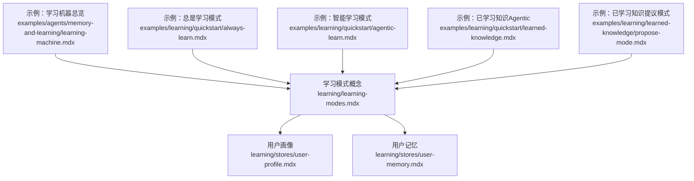
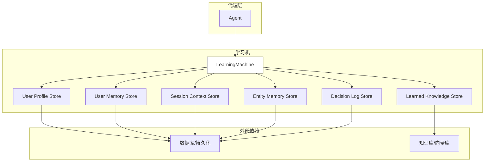
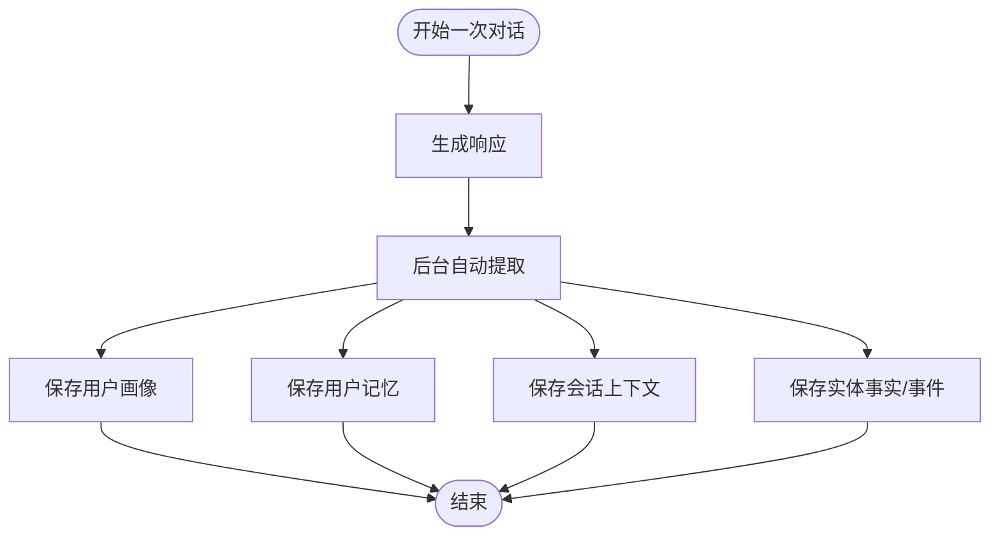
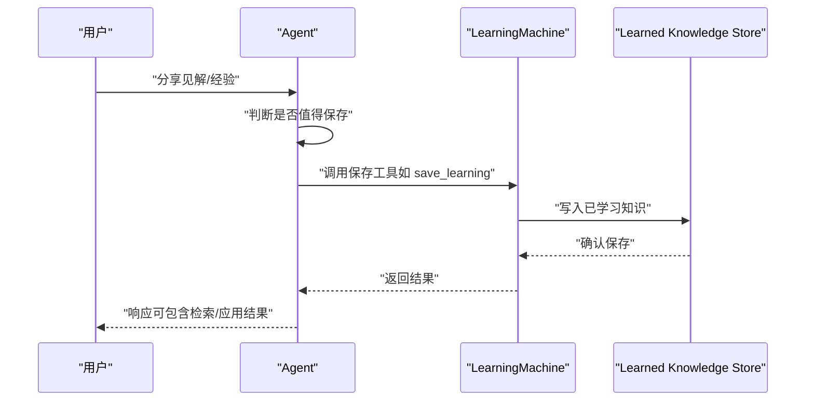
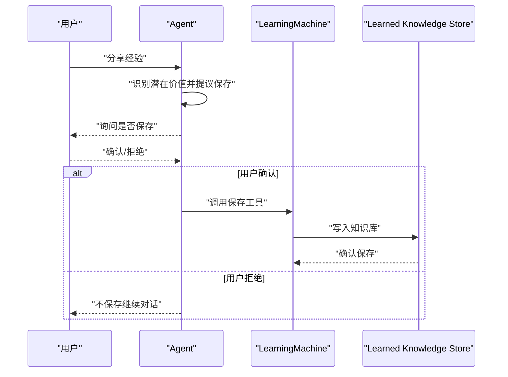
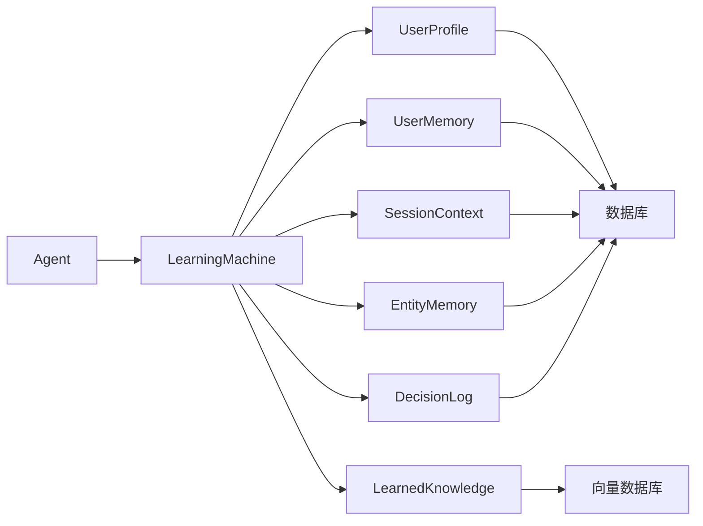

# 学习模式

<cite>
**本文引用的文件**
- [学习模式](file://learning/learning-modes.mdx)
- [用户画像](file://learning/stores/user-profile.mdx)
- [用户记忆](file://learning/stores/user-memory.mdx)
- [学习机器：总览](file://examples/agents/memory-and-learning/learning-machine.mdx)
- [学习机器：总览（快速开始）](file://examples/learning/quickstart/always-learn.mdx)
- [学习机器：智能模式（快速开始）](file://examples/learning/quickstart/agentic-learn.mdx)
- [学习机器：已学习知识](file://examples/learning/quickstart/learned-knowledge.mdx)
- [学习机器：已学习知识（提议模式）](file://examples/learning/learned-knowledge/propose-mode.mdx)
</cite>

## 目录
1. [简介](#简介)
2. [项目结构](#项目结构)
3. [核心组件](#核心组件)
4. [架构总览](#架构总览)
5. [详细组件分析](#详细组件分析)
6. [依赖分析](#依赖分析)
7. [性能考量](#性能考量)
8. [故障排除指南](#故障排除指南)
9. [结论](#结论)
10. [附录](#附录)

## 简介
本文件系统性地文档化“学习模式”的工作机制与实践，覆盖以下三种模式：
- 总是学习模式（Always Learn）
- 智能学习模式（Agentic Learn）
- 提议学习模式（Propose Learn）

内容包括：工作原理、适用场景、优缺点与性能影响、配置复杂度、模式切换时机与触发条件、与学习存储的交互关系、决策指南与最佳实践、故障排除与性能调优建议，以及扩展与自定义可能性。

## 项目结构
围绕“学习模式”的知识主要分布在如下位置：
- 概念与模式说明：learning/learning-modes.mdx
- 各学习存储的说明与默认模式：learning/stores/*.mdx
- 示例与用法：examples/learning/**/*.mdx

**图示来源**
- [学习模式](file://learning/learning-modes.mdx)
- [用户画像](file://learning/stores/user-profile.mdx)
- [用户记忆](file://learning/stores/user-memory.mdx)
- [学习机器：总览](file://examples/agents/memory-and-learning/learning-machine.mdx)
- [学习机器：总览（快速开始）](file://examples/learning/quickstart/always-learn.mdx)
- [学习机器：智能模式（快速开始）](file://examples/learning/quickstart/agentic-learn.mdx)
- [学习机器：已学习知识](file://examples/learning/quickstart/learned-knowledge.mdx)
- [学习机器：已学习知识（提议模式）](file://examples/learning/learned-knowledge/propose-mode.mdx)

**章节来源**
- [学习模式](file://learning/learning-modes.mdx)
- [用户画像](file://learning/stores/user-profile.mdx)
- [用户记忆](file://learning/stores/user-memory.mdx)
- [学习机器：总览](file://examples/agents/memory-and-learning/learning-machine.mdx)
- [学习机器：总览（快速开始）](file://examples/learning/quickstart/always-learn.mdx)
- [学习机器：智能模式（快速开始）](file://examples/learning/quickstart/agentic-learn.mdx)
- [学习机器：已学习知识](file://examples/learning/quickstart/learned-knowledge.mdx)
- [学习机器：已学习知识（提议模式）](file://examples/learning/learned-knowledge/propose-mode.mdx)

## 核心组件
- 学习机（LearningMachine）：协调多个“学习存储”，每个存储负责特定类型的知识。
- 学习模式枚举（LearningMode）：控制何时以及如何捕获信息。
- 各学习存储配置类：如 UserProfileConfig、UserMemoryConfig、LearnedKnowledgeConfig 等，用于为不同存储指定模式。

关键要点：
- 每个存储可独立设置模式（Always/Agentic/Propose），实现“按需组合”。
- 默认模式针对不同存储有明确倾向：用户画像、用户记忆、会话上下文、实体记忆默认 Always；已学习知识默认 Agentic；决策日志支持 Always 或显式 Agentic 工作流。

**章节来源**
- [学习模式](file://learning/learning-modes.mdx)
- [用户画像](file://learning/stores/user-profile.mdx)
- [用户记忆](file://learning/stores/user-memory.mdx)

## 架构总览
下图展示了 Agent、LearningMachine 与各学习存储之间的交互关系，以及三种模式在流程中的位置。

**图示来源**
- [学习模式](file://learning/learning-modes.mdx)
- [用户画像](file://learning/stores/user-profile.mdx)
- [用户记忆](file://learning/stores/user-memory.mdx)

## 详细组件分析

### 总是学习模式（Always Learn）
- 工作机制
  - 在每次响应后自动执行提取，无需显式工具调用。
  - 适合需要持续、无遗漏记录的场景。
- 适用场景
  - 用户画像、用户记忆、会话上下文、实体记忆等。
- 优缺点
  - 优点：无需人工干预，覆盖面广。
  - 缺点：每次交互可能产生额外 LLM 调用，带来成本与延迟开销。
- 配置复杂度
  - 低到中等：通常只需启用学习机或为相关存储设置 Always 模式。
- 示例路径
  - [学习机器：总览（快速开始）](file://examples/learning/quickstart/always-learn.mdx)
  - [用户画像（Always 模式）](file://learning/stores/user-profile.mdx)
  - [用户记忆（Always 模式）](file://learning/stores/user-memory.mdx)

**图示来源**
- [学习模式](file://learning/learning-modes.mdx)
- [用户画像](file://learning/stores/user-profile.mdx)
- [用户记忆](file://learning/stores/user-memory.mdx)

**章节来源**
- [学习模式](file://learning/learning-modes.mdx)
- [用户画像](file://learning/stores/user-profile.mdx)
- [用户记忆](file://learning/stores/user-memory.mdx)
- [学习机器：总览（快速开始）](file://examples/learning/quickstart/always-learn.mdx)

### 智能学习模式（Agentic Learn）
- 工作机制
  - 代理获得工具，基于对话上下文自行决定何时保存。
  - 适用于需要“质量优先”的场景，如已学习知识与决策审计。
- 适用场景
  - 已学习知识、决策日志等。
- 优缺点
  - 优点：更可控、减少冗余；适合高价值知识的沉淀。
  - 缺点：可能错过隐含信息，需要代理具备良好的判断力。
- 配置复杂度
  - 中等到高：需为相关存储设置 Agentic，并提供相应工具。
- 示例路径
  - [学习机器：智能模式（快速开始）](file://examples/learning/quickstart/agentic-learn.mdx)
  - [学习机器：已学习知识](file://examples/learning/quickstart/learned-knowledge.mdx)
  - [学习模式（工具清单）](file://learning/learning-modes.mdx)

**图示来源**
- [学习机器：已学习知识](file://examples/learning/quickstart/learned-knowledge.mdx)
- [学习模式](file://learning/learning-modes.mdx)

**章节来源**
- [学习模式](file://learning/learning-modes.mdx)
- [学习机器：智能模式（快速开始）](file://examples/learning/quickstart/agentic-learn.mdx)
- [学习机器：已学习知识](file://examples/learning/quickstart/learned-knowledge.mdx)

### 提议学习模式（Propose Learn）
- 工作机制
  - 代理提出学习建议，由用户确认后再保存。
  - 强调“人机协同的质量控制”，适合高价值或合规敏感领域。
- 适用场景
  - 高价值集体知识、监管合规环境。
- 优缺点
  - 优点：确保入库知识质量与合规性。
  - 缺点：引入用户交互，可能降低吞吐。
- 配置复杂度
  - 中等：需启用提议模式并配置知识库。
- 示例路径
  - [学习机器：已学习知识（提议模式）](file://examples/learning/learned-knowledge/propose-mode.mdx)

**图示来源**
- [学习机器：已学习知识（提议模式）](file://examples/learning/learned-knowledge/propose-mode.mdx)

**章节来源**
- [学习模式](file://learning/learning-modes.mdx)
- [学习机器：已学习知识（提议模式）](file://examples/learning/learned-knowledge/propose-mode.mdx)

### 模式切换与触发条件
- 切换时机
  - Always：每次响应后自动触发。
  - Agentic：代理根据上下文与工具调用决定触发。
  - Propose：代理先提议，经用户确认后触发。
- 触发条件
  - Always：固定时序（响应后）。
  - Agentic：代理内部判断（如发现有价值洞察）。
  - Propose：用户显式同意。

**章节来源**
- [学习模式](file://learning/learning-modes.mdx)
- [学习机器：智能模式（快速开始）](file://examples/learning/quickstart/agentic-learn.mdx)
- [学习机器：已学习知识（提议模式）](file://examples/learning/learned-knowledge/propose-mode.mdx)

### 模式与学习存储的交互关系
- 用户画像（UserProfile）
  - 默认 Always；支持 Always/Agentic。
  - 自动注入系统提示，便于个性化。
- 用户记忆（UserMemory）
  - 默认 Always；支持 Always/Agentic。
  - 支持增删改查与去重、修剪等维护操作。
- 会话上下文（SessionContext）
  - 默认 Always；适合长任务与进度跟踪。
- 实体记忆（EntityMemory）
  - 默认 Always；适合构建知识图谱。
- 已学习知识（LearnedKnowledge）
  - 默认 Agentic；适合团队共享的跨用户洞察。
- 决策日志（DecisionLog）
  - 支持 Always（配置化）与 Agentic（显式开关）两种工作流。

**章节来源**
- [学习模式](file://learning/learning-modes.mdx)
- [用户画像](file://learning/stores/user-profile.mdx)
- [用户记忆](file://learning/stores/user-memory.mdx)

## 依赖分析
- 组件耦合
  - Agent 通过 LearningMachine 间接依赖各存储；存储之间松耦合，通过统一接口交互。
- 外部依赖
  - 数据库/持久化：用户画像、用户记忆、会话上下文、实体记忆、决策日志。
  - 知识库/向量库：已学习知识（检索与嵌入）。
- 潜在循环依赖
  - 未见直接循环；模式选择仅影响调用时机与是否需要用户确认。
- 接口契约
  - 各存储遵循统一协议（如 recall、schema 等），便于替换与扩展。

**图示来源**
- [学习模式](file://learning/learning-modes.mdx)
- [用户画像](file://learning/stores/user-profile.mdx)
- [用户记忆](file://learning/stores/user-memory.mdx)

**章节来源**
- [学习模式](file://learning/learning-modes.mdx)
- [用户画像](file://learning/stores/user-profile.mdx)
- [用户记忆](file://learning/stores/user-memory.mdx)

## 性能考量
- Always 模式的成本
  - 每次交互增加一次额外 LLM 调用，可能提升延迟与费用。
- Agentic 模式的优势
  - 可减少不必要的提取，提高整体效率。
- Propose 模式的影响
  - 引入用户等待，吞吐下降；但质量与合规性提升。
- 建议
  - 对高频对话采用 Always 的轻量存储（如会话上下文），对高价值知识采用 Agentic/Propose。
  - 使用缓存与批处理策略优化检索与写入。

[本节为通用指导，无需具体文件引用]

## 故障排除指南
- 问题：学习未生效
  - 检查是否正确启用 LearningMachine 与对应存储配置。
  - 确认模式设置（Always/Agentic/Propose）符合预期。
- 问题：Agentic 模式未触发保存
  - 确认代理是否具备相应工具（如保存/提议工具）。
  - 检查代理指令是否引导其进行保存判断。
- 问题：Propose 模式阻塞流程
  - 评估是否需要简化提议逻辑或放宽用户确认要求。
- 问题：存储数据异常
  - 使用存储提供的调试输出与访问方法检查数据状态。
  - 对用户记忆进行去重与修剪以保持健康状态。

**章节来源**
- [学习机器：总览](file://examples/agents/memory-and-learning/learning-machine.mdx)
- [用户记忆（调试与访问）](file://learning/stores/user-memory.mdx)

## 结论
- Always 模式适合“全量覆盖”的场景，强调连续性与完整性。
- Agentic 模式适合“质量优先”的场景，强调智能判断与资源优化。
- Propose 模式适合“合规与高质量”的场景，强调人机协作与质量控制。
- 最佳实践：按存储类型与业务目标选择模式，必要时混合使用；结合缓存与批处理优化性能；定期维护与清理存储以保持长期可用性。

[本节为总结，无需具体文件引用]

## 附录

### 模式选择决策指南
- 场景与推荐模式
  - 捕捉用户姓名与偏好：Always
  - 自动构建用户记忆：Always
  - 跟踪会话进展：Always
  - 代理驱动的知识采集：Agentic
  - 构建实体知识图谱：Always
  - 审计代理决策：Agentic
  - 高价值集体知识：Propose
  - 合规敏感的学习：Propose

**章节来源**
- [学习模式](file://learning/learning-modes.mdx)

### 配置与使用示例路径
- 总是学习模式
  - [学习机器：总览（快速开始）](file://examples/learning/quickstart/always-learn.mdx)
- 智能学习模式
  - [学习机器：智能模式（快速开始）](file://examples/learning/quickstart/agentic-learn.mdx)
  - [学习机器：已学习知识](file://examples/learning/quickstart/learned-knowledge.mdx)
- 提议学习模式
  - [学习机器：已学习知识（提议模式）](file://examples/learning/learned-knowledge/propose-mode.mdx)

**章节来源**
- [学习机器：总览（快速开始）](file://examples/learning/quickstart/always-learn.mdx)
- [学习机器：智能模式（快速开始）](file://examples/learning/quickstart/agentic-learn.mdx)
- [学习机器：已学习知识](file://examples/learning/quickstart/learned-knowledge.mdx)
- [学习机器：已学习知识（提议模式）](file://examples/learning/learned-knowledge/propose-mode.mdx)

### 扩展与自定义
- 自定义存储
  - 参考最小自定义存储示例，实现学习存储协议，定义学习类型与模式。
- 存储工具与模式
  - 用户画像：update_profile
  - 用户记忆：update_user_memory
  - 实体记忆：search_entities/create_entity/update_entity/add_fact/update_fact/delete_fact/add_event/add_relationship
  - 已学习知识：search_learnings/save_learning
  - 决策日志：log_decision/record_outcome/search_decisions

**章节来源**
- [学习模式（工具清单）](file://learning/learning-modes.mdx)