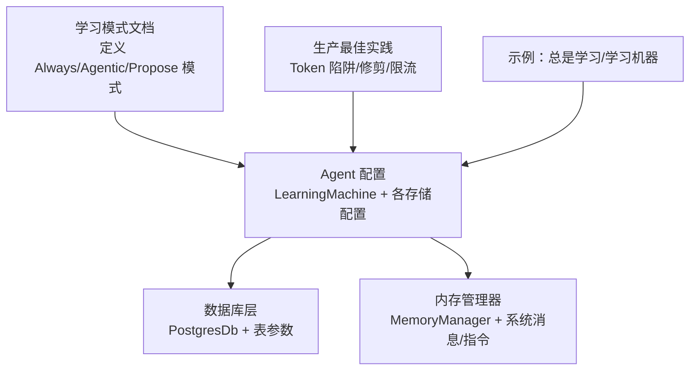
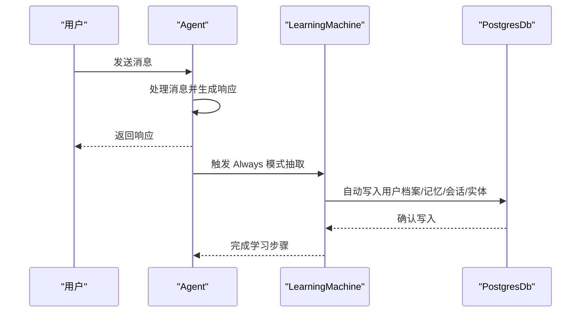
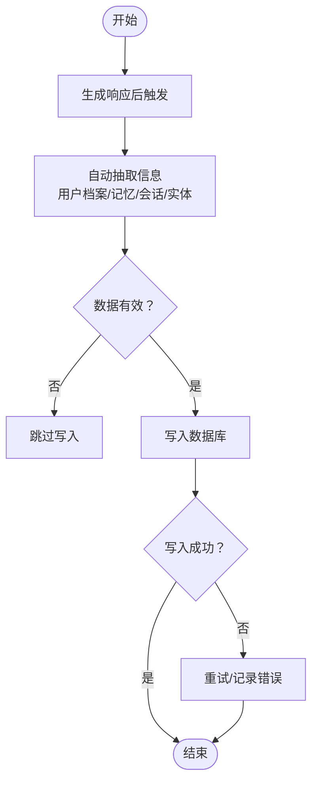
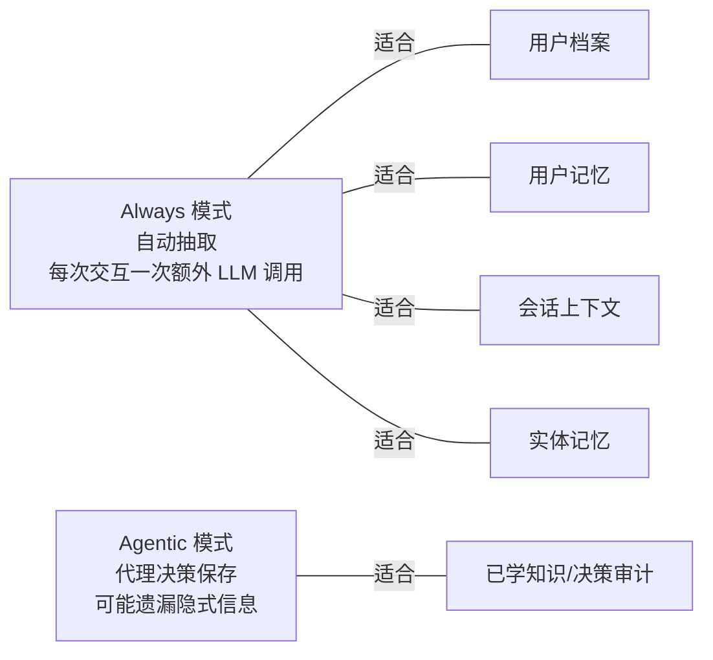
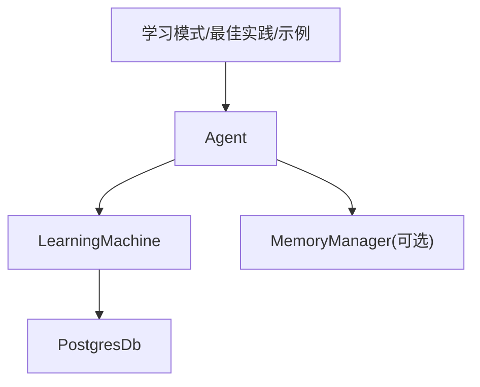

# 总是学习模式

<cite>
**本文引用的文件**
- [学习模式](file://learning/learning-modes.mdx)
- [生产最佳实践](file://memory/best-practices.mdx)
- [PostgreSQL 概览](file://database/postgres.mdx)
- [PostgreSQL 参数](file://_snippets/db-postgres-params.mdx)
- [内存管理器参考](file://_snippets/memory-manager-reference.mdx)
- [团队与学习机器](file://examples/teams/memory/learning-machine.mdx)
- [快速开始：总是学习](file://examples/learning/quickstart/always-learn.mdx)
- [Agno 学习示例概览](file://examples/learning/quickstart/overview.mdx)
</cite>

## 目录
1. [简介](#简介)
2. [项目结构](#项目结构)
3. [核心组件](#核心组件)
4. [架构总览](#架构总览)
5. [详细组件分析](#详细组件分析)
6. [依赖关系分析](#依赖关系分析)
7. [性能考量](#性能考量)
8. [故障排除指南](#故障排除指南)
9. [结论](#结论)
10. [附录](#附录)

## 简介
总是学习模式（Always Mode）是一种自动化的学习方式：在每次对话响应生成后，系统会自动触发一次信息抽取与存储流程，无需代理工具参与。该模式适用于以下知识/记忆场景：
- 用户档案（User Profile）
- 用户记忆（User Memory）
- 会话上下文（Session Context）
- 实体记忆（Entity Memory）

其核心特征是在正常对话之外增加一次“后台自动抽取”，以确保信息被持续、一致地捕获与沉淀。

## 项目结构
与总是学习模式直接相关的核心内容分布在如下位置：
- 学习模式文档：定义三种模式及适用场景
- 生产最佳实践：涵盖成本控制、Token 使用、内存修剪等
- 数据库与存储：PostgreSQL 连接与表参数
- 内存管理器参考：内存 CRUD 与系统消息配置
- 示例：团队与学习机器、快速开始总是学习

**章节来源**
- [学习模式:1-147](file://learning/learning-modes.mdx#L1-L147)
- [生产最佳实践:1-202](file://memory/best-practices.mdx#L1-L202)
- [PostgreSQL 概览:1-47](file://database/postgres.mdx#L1-L47)
- [PostgreSQL 参数:1-14](file://_snippets/db-postgres-params.mdx#L1-L14)
- [内存管理器参考:1-29](file://_snippets/memory-manager-reference.mdx#L1-L29)
- [Agno 学习示例概览:1-10](file://examples/learning/quickstart/overview.mdx#L1-L10)

## 核心组件
- 学习机（LearningMachine）：统一编排不同存储的抽取策略，支持为每个存储单独配置模式。
- 存储配置：
  - 用户档案配置（UserProfileConfig）
  - 用户记忆配置（UserMemoryConfig）
  - 已学知识配置（LearnedKnowledgeConfig）
- 数据库（PostgresDb）：提供 PostgreSQL 后端，支持 JSONB、模式版本与高效查询。
- 内存管理器（MemoryManager）：负责用户记忆的增删改查与系统提示词定制。

**章节来源**
- [学习模式:101-122](file://learning/learning-modes.mdx#L101-L122)
- [PostgreSQL 概览:1-22](file://database/postgres.mdx#L1-L22)
- [内存管理器参考:1-29](file://_snippets/memory-manager-reference.mdx#L1-L29)

## 架构总览
总是学习模式在每次响应后自动执行抽取与落库，整体流程如下：

**图表来源**
- [学习模式:16-38](file://learning/learning-modes.mdx#L16-L38)
- [PostgreSQL 概览:9-22](file://database/postgres.mdx#L9-L22)

## 详细组件分析

### Always 模式的适用场景
- 用户档案：自动记录姓名、偏好等基础信息，避免遗漏。
- 用户记忆：被动积累对话观察，形成连续记忆。
- 会话上下文：持续跟踪会话状态与进度。
- 实体记忆：从常规对话中持续抽取实体事实与事件。

这些默认均采用 Always 模式，以保证一致性与可追溯性。

**章节来源**
- [学习模式:124-133](file://learning/learning-modes.mdx#L124-L133)

### Always 模式配置示例（含 PostgreSQL 与 UserMemoryConfig）
- 使用 PostgresDb 作为数据库后端，通过连接字符串完成初始化。
- 在 LearningMachine 中为用户档案与用户记忆分别设置 Always 模式。
- 可选：为实体记忆或已学知识选择其他模式（如 Agentic/Propose）以平衡成本与质量。

示例路径（不展示具体代码内容）：
- [总是学习示例:1-40](file://examples/learning/quickstart/always-learn.mdx#L1-L40)
- [团队学习机器示例:1-49](file://examples/teams/memory/learning-machine.mdx#L1-L49)
- [PostgreSQL 初始化与运行:9-22](file://database/postgres.mdx#L9-L22)
- [PostgreSQL 参数说明:1-14](file://_snippets/db-postgres-params.mdx#L1-L14)

**章节来源**
- [学习模式:101-122](file://learning/learning-modes.mdx#L101-L122)
- [PostgreSQL 概览:9-22](file://database/postgres.mdx#L9-L22)
- [PostgreSQL 参数:1-14](file://_snippets/db-postgres-params.mdx#L1-L14)

### Always 模式工作流（算法流程）

**图表来源**
- [学习模式:10-18](file://learning/learning-modes.mdx#L10-L18)

### Always 模式与 Agentic 模式的对比（概念图）

**图表来源**
- [学习模式:10-18](file://learning/learning-modes.mdx#L10-L18)
- [学习模式:135-146](file://learning/learning-modes.mdx#L135-L146)

## 依赖关系分析
- Agent 依赖 LearningMachine 控制抽取时机与策略。
- LearningMachine 依赖数据库（PostgresDb）进行持久化。
- MemoryManager 提供可选的记忆管理能力（系统消息、指令定制），用于增强抽取质量。
- 示例与最佳实践为配置与运维提供参考。

**图表来源**
- [学习模式:101-122](file://learning/learning-modes.mdx#L101-L122)
- [内存管理器参考:1-29](file://_snippets/memory-manager-reference.mdx#L1-L29)
- [PostgreSQL 概览:1-22](file://database/postgres.mdx#L1-L22)

**章节来源**
- [学习模式:101-122](file://learning/learning-modes.mdx#L101-L122)
- [内存管理器参考:1-29](file://_snippets/memory-manager-reference.mdx#L1-L29)
- [PostgreSQL 概览:1-22](file://database/postgres.mdx#L1-L22)

## 性能考量
- 每次交互增加一次 LLM 调用：这会带来 Token 与成本的增长。
- 建议：
  - 默认采用 Always 模式，减少显式工具调用带来的嵌套 LLM 调用风险。
  - 对于长生命周期应用，定期进行内存修剪（按时间或数量阈值）。
  - 设置工具调用上限，防止异常高频率的记忆更新。
  - 使用更便宜的模型处理记忆操作，保留高性能模型用于对话。

**章节来源**
- [学习模式:10-18](file://learning/learning-modes.mdx#L10-L18)
- [生产最佳实践:54-94](file://memory/best-practices.mdx#L54-L94)
- [生产最佳实践:112-142](file://memory/best-practices.mdx#L112-L142)

## 故障排除指南
- 用户标识缺失导致记忆错乱
  - 症状：多用户共享同一份记忆。
  - 处理：始终显式传入 user_id。
- 同时启用两种自动模式导致行为异常
  - 症状：开启 update_memory_on_run 与 enable_agentic_memory 后，自动模式被覆盖。
  - 处理：二选一，不要同时启用。
- 记忆增长过快
  - 症状：Token 消耗激增、成本上升。
  - 处理：实施修剪策略、限制工具调用次数、使用廉价模型处理记忆。
- 抽取质量不佳
  - 症状：信息遗漏或冗余。
  - 处理：通过 MemoryManager 的系统消息与自定义指令引导抽取。

**章节来源**
- [生产最佳实践:144-178](file://memory/best-practices.mdx#L144-L178)
- [内存管理器参考:1-29](file://_snippets/memory-manager-reference.mdx#L1-L29)

## 结论
总是学习模式通过“每次响应后的自动抽取”实现了对用户档案、用户记忆、会话上下文与实体记忆的持续沉淀，适合需要高一致性的长期交互场景。在获得便利的同时，需关注额外 LLM 调用带来的成本与 Token 开销，并结合修剪、限流与廉价模型等策略进行优化。

## 附录

### 最佳实践清单
- 默认 Always 模式，除非有明确需求使用 Agentic/Propose。
- 显式传入 user_id，避免跨用户记忆污染。
- 定期修剪旧记忆，控制存储规模。
- 限制工具调用次数，防止滥用。
- 使用廉价模型处理记忆操作，保留高性能模型用于对话。

**章节来源**
- [学习模式:135-146](file://learning/learning-modes.mdx#L135-L146)
- [生产最佳实践:10-18](file://memory/best-practices.mdx#L10-L18)
- [生产最佳实践:112-142](file://memory/best-practices.mdx#L112-L142)