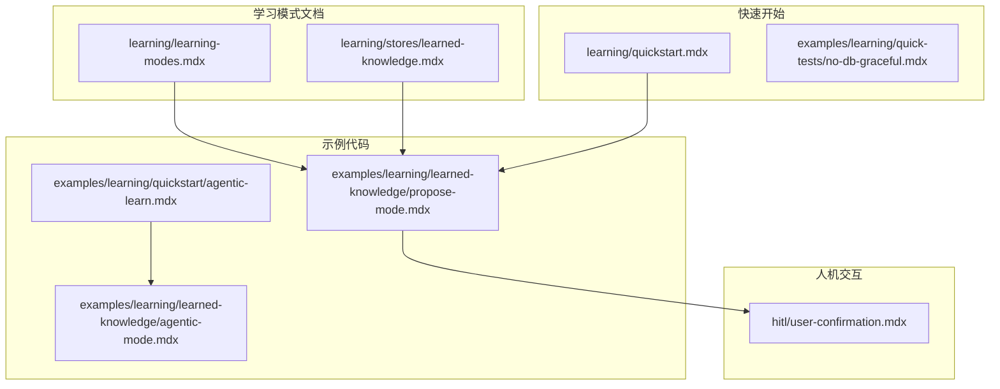
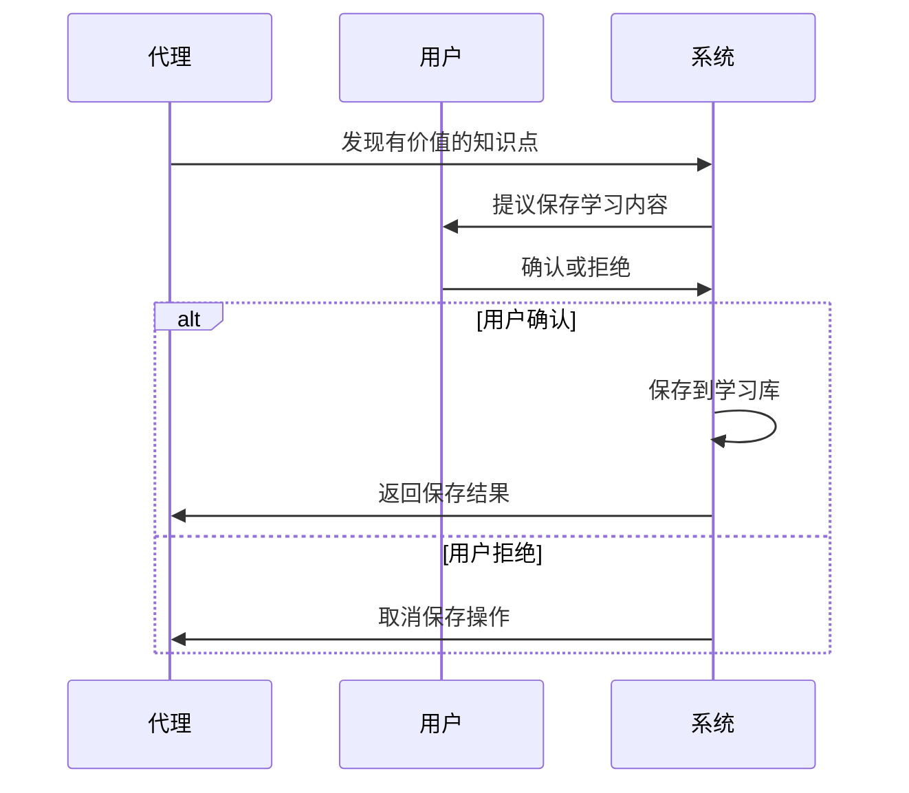
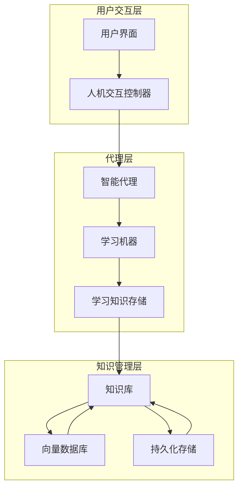
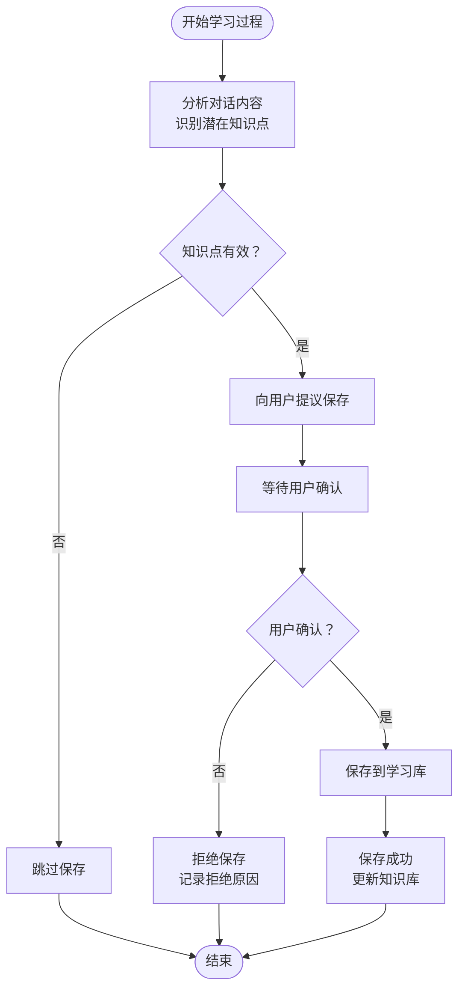
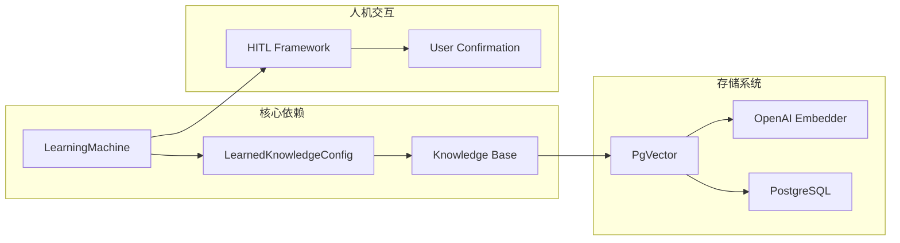
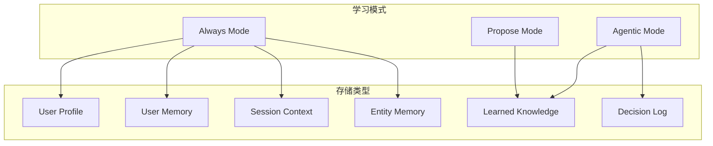
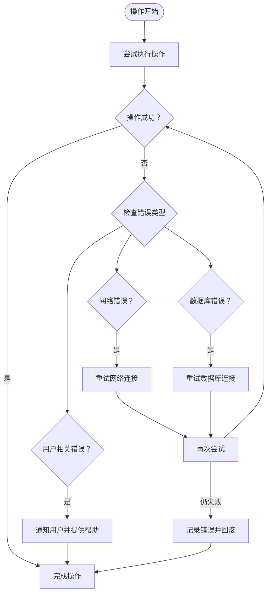

# 提议学习模式

<cite>
**本文档引用的文件**
- [learning/learning-modes.mdx](file://learning/learning-modes.mdx)
- [learning/stores/learned-knowledge.mdx](file://learning/stores/learned-knowledge.mdx)
- [examples/learning/learned-knowledge/propose-mode.mdx](file://examples/learning/learned-knowledge/propose-mode.mdx)
- [examples/learning/learned-knowledge/agentic-mode.mdx](file://examples/learning/learned-knowledge/agentic-mode.mdx)
- [hitl/user-confirmation.mdx](file://hitl/user-confirmation.mdx)
- [learning/quickstart.mdx](file://learning/quickstart.mdx)
- [examples/learning/quickstart/agentic-learn.mdx](file://examples/learning/quickstart/agentic-learn.mdx)
- [examples/learning/quick-tests/no-db-graceful.mdx](file://examples/learning/quick-tests/no-db-graceful.mdx)
</cite>

## 目录
1. [简介](#简介)
2. [项目结构](#项目结构)
3. [核心组件](#核心组件)
4. [架构概览](#架构概览)
5. [详细组件分析](#详细组件分析)
6. [依赖关系分析](#依赖关系分析)
7. [性能考虑](#性能考虑)
8. [故障排除指南](#故障排除指南)
9. [结论](#结论)
10. [附录](#附录)

## 简介

提议学习模式（Propose Mode）是Agno框架中一种特殊的学习模式，它要求代理在保存学习内容之前先向用户提议，只有经过用户确认后才会真正保存。这种模式特别适用于需要高质量控制和合规性的场景，如高价值集体知识、受监管环境中的学习内容等。

与传统的自动学习模式不同，提议模式通过引入人工审核环节，确保只有经过验证的有价值知识才能被纳入学习库，从而提高知识质量和安全性。

## 项目结构

提议学习模式主要涉及以下关键文件和模块：



**图表来源**
- [learning/learning-modes.mdx:75-99](file://learning/learning-modes.mdx#L75-L99)
- [examples/learning/learned-knowledge/propose-mode.mdx:1-133](file://examples/learning/learned-knowledge/propose-mode.mdx#L1-L133)

**章节来源**
- [learning/learning-modes.mdx:1-147](file://learning/learning-modes.mdx#L1-L147)
- [examples/learning/learned-knowledge/propose-mode.mdx:1-133](file://examples/learning/learned-knowledge/propose-mode.mdx#L1-L133)

## 核心组件

### 学习机器（Learning Machine）

学习机器是提议模式的核心组件，负责协调各种学习存储和模式配置。它支持多种学习模式，包括Always、Agentic和Propose模式。

### LearnedKnowledgeConfig 配置

LearnedKnowledgeConfig是专门用于配置学习知识存储的类，支持以下关键参数：

- **mode**: 设置学习模式（LearningMode.PROPOSE）
- **namespace**: 控制知识共享范围（"global"、"user"或自定义命名空间）
- **knowledge**: 指定知识库实例（用于语义搜索）

### 人机交互机制

提议模式依赖于人机交互（HITL）机制，通过用户确认流程确保知识质量：



**图表来源**
- [examples/learning/learned-knowledge/propose-mode.mdx:75-116](file://examples/learning/learned-knowledge/propose-mode.mdx#L75-L116)
- [hitl/user-confirmation.mdx:15-24](file://hitl/user-confirmation.mdx#L15-L24)

**章节来源**
- [learning/stores/learned-knowledge.mdx:86-106](file://learning/stores/learned-knowledge.mdx#L86-L106)
- [examples/learning/learned-knowledge/propose-mode.mdx:55-58](file://examples/learning/learned-knowledge/propose-mode.mdx#L55-L58)

## 架构概览

提议学习模式的整体架构如下：



**图表来源**
- [examples/learning/learned-knowledge/propose-mode.mdx:37-60](file://examples/learning/learned-knowledge/propose-mode.mdx#L37-L60)
- [learning/stores/learned-knowledge.mdx:20-34](file://learning/stores/learned-knowledge.mdx#L20-L34)

### 数据流分析

提议模式的数据流具有以下特点：

1. **知识发现**: 代理分析对话内容，识别有价值的见解
2. **用户提议**: 将潜在的学习内容提交给用户进行确认
3. **质量控制**: 用户评估内容的价值和适用性
4. **条件保存**: 仅在用户确认后才执行保存操作

**章节来源**
- [learning/learning-modes.mdx:75-99](file://learning/learning-modes.mdx#L75-L99)
- [examples/learning/learned-knowledge/propose-mode.mdx:49-52](file://examples/learning/learned-knowledge/propose-mode.mdx#L49-L52)

## 详细组件分析

### 提议模式工作流程



**图表来源**
- [examples/learning/learned-knowledge/propose-mode.mdx:75-116](file://examples/learning/learned-knowledge/propose-mode.mdx#L75-L116)
- [hitl/user-confirmation.mdx:191-195](file://hitl/user-confirmation.mdx#L191-L195)

### 配置示例详解

#### 基础配置

最简单的提议模式配置：

```python
from agno.learn import LearnedKnowledgeConfig, LearningMachine, LearningMode
from agno.knowledge import Knowledge

# 创建知识库
knowledge = Knowledge(vector_db=PgVector(...))

# 配置提议模式
agent = Agent(
    learning=LearningMachine(
        knowledge=knowledge,
        learned_knowledge=LearnedKnowledgeConfig(mode=LearningMode.PROPOSE)
    )
)
```

#### 高级配置选项

```python
# 自定义命名空间
learned_knowledge=LearnedKnowledgeConfig(
    mode=LearningMode.PROPOSE,
    namespace="engineering"
)

# 结合其他存储类型
agent = Agent(
    learning=LearningMachine(
        user_profile=UserProfileConfig(mode=LearningMode.ALWAYS),
        user_memory=UserMemoryConfig(mode=LearningMode.AGENTIC),
        learned_knowledge=LearnedKnowledgeConfig(mode=LearningMode.PROPOSE)
    )
)
```

**章节来源**
- [examples/learning/learned-knowledge/propose-mode.mdx:55-58](file://examples/learning/learned-knowledge/propose-mode.mdx#L55-L58)
- [examples/learning/learned-knowledge/agentic-mode.mdx:55-58](file://examples/learning/learned-knowledge/agentic-mode.mdx#L55-L58)

### 与Agentic模式对比

| 特性 | 提议模式 | Agentic模式 |
|------|----------|-------------|
| **决策权** | 用户决定是否保存 | 代理自主决策 |
| **质量控制** | 人工审核，高质量 | 代理判断，可能存在偏差 |
| **性能开销** | 需要用户交互，较慢 | 自动处理，效率高 |
| **适用场景** | 合规敏感、高价值知识 | 日常学习、快速迭代 |
| **错误处理** | 用户可拒绝不当保存 | 代理可能误判 |

**章节来源**
- [learning/learning-modes.mdx:101-122](file://learning/learning-modes.mdx#L101-L122)
- [examples/learning/learned-knowledge/propose-mode.mdx:11-16](file://examples/learning/learned-knowledge/propose-mode.mdx#L11-L16)

## 依赖关系分析

### 外部依赖

提议模式依赖于多个外部组件：



**图表来源**
- [examples/learning/learned-knowledge/propose-mode.mdx:22-44](file://examples/learning/learned-knowledge/propose-mode.mdx#L22-L44)
- [hitl/user-confirmation.mdx:15-24](file://hitl/user-confirmation.mdx#L15-L24)

### 内部耦合关系

提议模式与其他学习模式存在以下关系：



**图表来源**
- [learning/learning-modes.mdx:10-14](file://learning/learning-modes.mdx#L10-L14)
- [learning/learning-modes.mdx:65-73](file://learning/learning-modes.mdx#L65-L73)

**章节来源**
- [learning/learning-modes.mdx:10-14](file://learning/learning-modes.mdx#L10-L14)
- [learning/stores/learned-knowledge.mdx:66-84](file://learning/stores/learned-knowledge.mdx#L66-L84)

## 性能考虑

### 时间复杂度分析

提议模式的时间复杂度主要由以下因素决定：

- **知识发现**: O(n) - 分析对话内容
- **用户等待**: O(1) - 等待用户确认
- **保存操作**: O(log n) - 向量数据库插入
- **总体复杂度**: O(n) - 主要受对话长度影响

### 资源消耗

| 组件 | 消耗类型 | 典型值 |
|------|----------|--------|
| LLM调用 | 次数 | 每次交互1次 |
| 向量计算 | 次数 | 每次保存1次 |
| 数据库写入 | 次数 | 每次确认1次 |
| 网络请求 | 次数 | 每次交互1次 |

### 性能优化建议

1. **批量处理**: 在用户确认前收集多个知识点再统一保存
2. **缓存策略**: 缓存已确认的知识点，避免重复确认
3. **异步处理**: 使用异步方式处理保存操作，不阻塞用户交互
4. **去重机制**: 实现智能去重，避免重复保存相似内容

## 故障排除指南

### 常见问题及解决方案

#### 1. 用户确认超时

**问题**: 用户长时间未确认导致保存失败

**解决方案**:
- 实现超时检测机制
- 提供自动取消选项
- 记录超时事件用于审计

#### 2. 知识库连接失败

**问题**: 向量数据库连接异常

**解决方案**:
- 实现连接重试机制
- 提供降级模式（直接保存到普通数据库）
- 记录错误日志便于诊断

#### 3. 用户拒绝率过高

**问题**: 用户频繁拒绝保存请求

**解决方案**:
- 优化知识发现算法
- 提供更清晰的提议说明
- 允许用户反馈拒绝原因

### 错误处理流程



**图表来源**
- [examples/learning/quick-tests/no-db-graceful.mdx:11-20](file://examples/learning/quick-tests/no-db-graceful.mdx#L11-L20)

**章节来源**
- [examples/learning/quick-tests/no-db-graceful.mdx:11-20](file://examples/learning/quick-tests/no-db-graceful.mdx#L11-L20)

### 用户体验优化建议

1. **明确的提示信息**: 清晰说明提议的内容和保存效果
2. **快速确认选项**: 提供一键确认功能
3. **历史记录**: 显示之前的确认历史供参考
4. **批量操作**: 支持批量确认多个知识点
5. **撤销功能**: 允许用户撤销错误的确认

## 结论

提议学习模式通过引入人工审核机制，在保证知识质量的同时也带来了更高的安全性和合规性。虽然这种方式会增加用户交互成本，但在高价值知识管理和合规敏感场景中，这种权衡是值得的。

关键优势：
- **高质量控制**: 通过人工审核确保知识价值
- **合规保障**: 满足受监管环境的要求
- **风险降低**: 减少错误知识的传播
- **透明度**: 用户清楚了解每次保存的内容

实施建议：
- 优先在学习知识存储中使用提议模式
- 结合其他存储类型的默认模式形成混合策略
- 建立完善的监控和审计机制
- 提供良好的用户体验设计

## 附录

### 使用场景决策指南

| 场景 | 推荐模式 | 理由 |
|------|----------|------|
| 高价值集体知识 | Propose | 需要严格的质量控制 |
| 合规敏感环境 | Propose | 满足审计和监管要求 |
| 日常学习应用 | Agentic | 追求效率和自动化 |
| 用户偏好设置 | Always | 需要持续跟踪和更新 |
| 临时信息记录 | Agentic | 不需要长期保存 |

### 模式切换时机

1. **知识质量评估**: 当发现明显有价值的知识点时
2. **合规要求触发**: 面临监管审查或审计需求时
3. **错误纠正**: 发现之前保存的错误知识时
4. **系统升级**: 从自动模式迁移到人工审核模式

### 最佳实践清单

- 建立明确的知识价值评估标准
- 设计直观的用户确认界面
- 实现完善的错误处理和恢复机制
- 提供充分的用户培训和指导
- 建立定期的知识质量审查流程