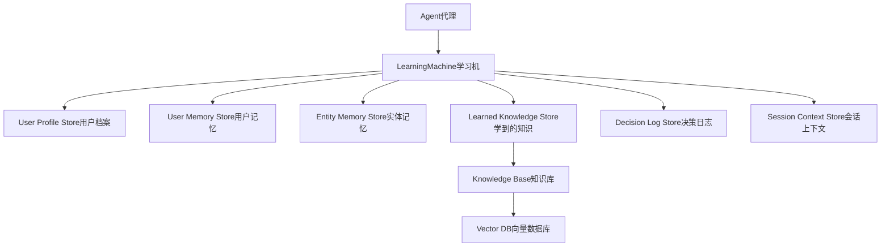
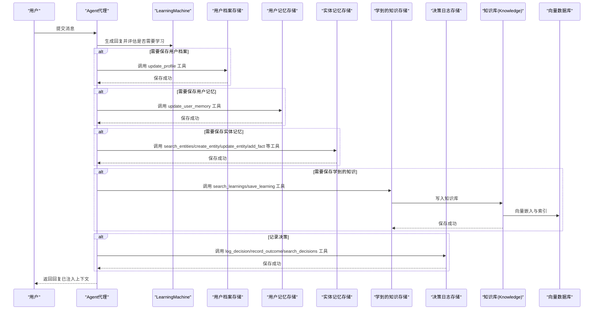
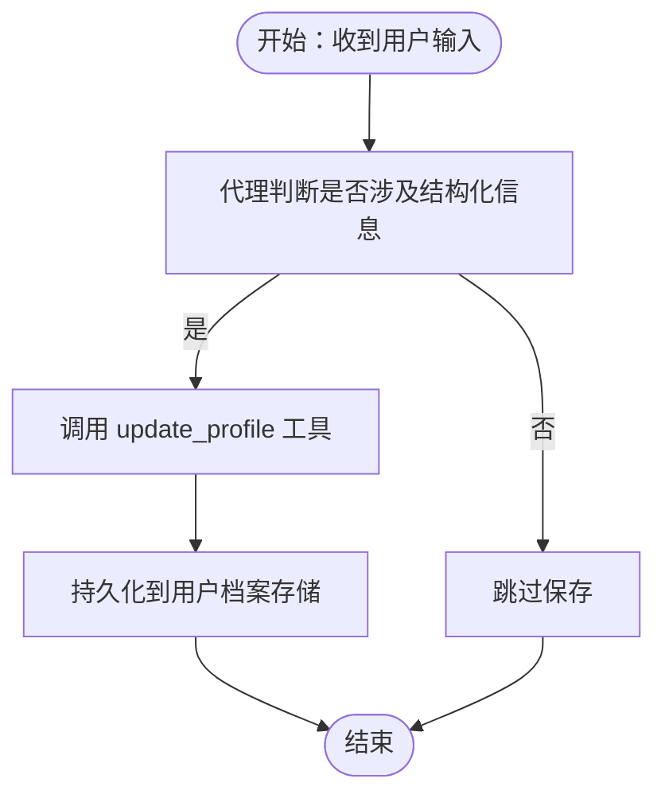
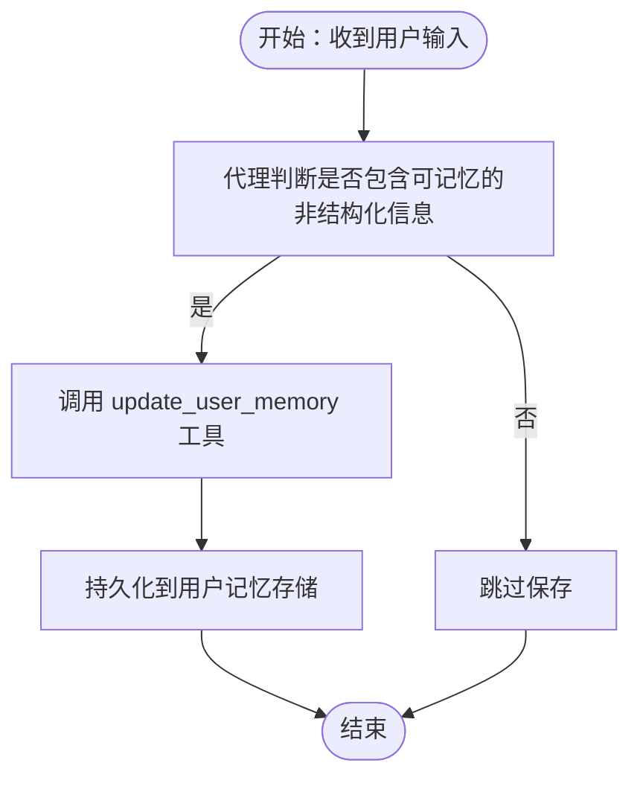
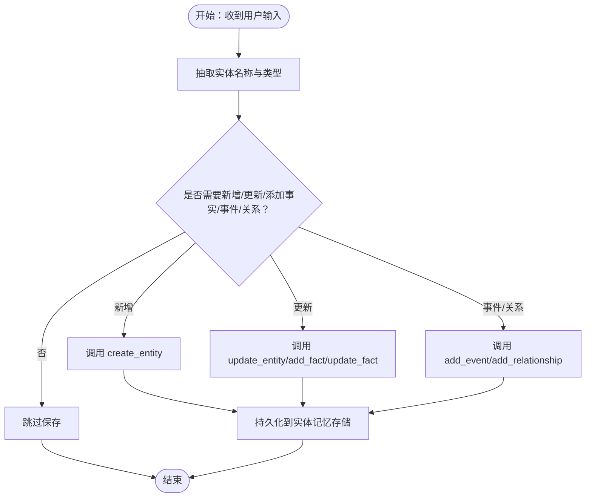
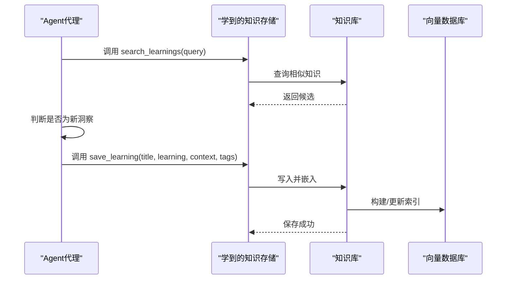
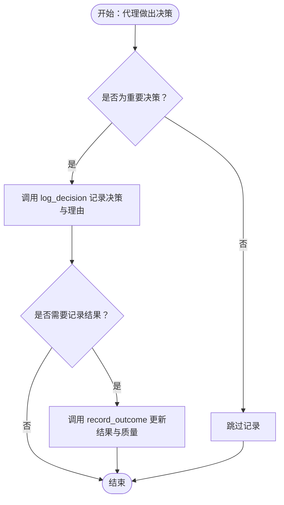
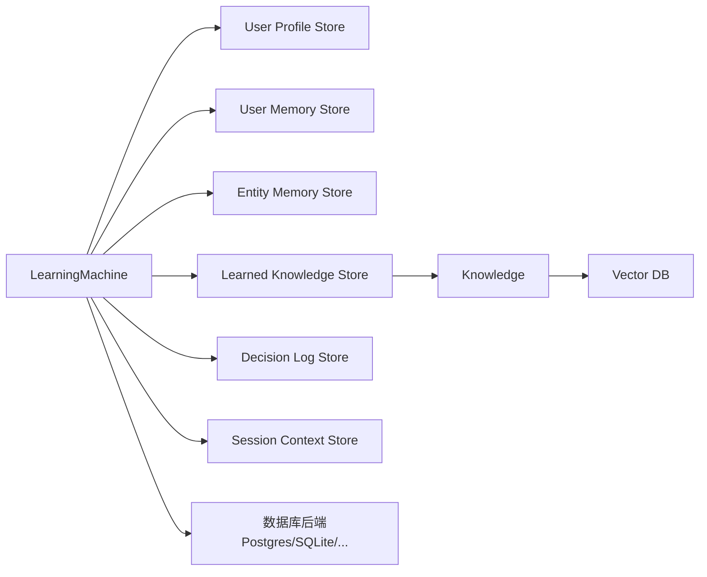

# 智能学习模式

<cite>
**本文引用的文件**
- [学习模式概览](file://learning/learning-modes.mdx)
- [学习总览](file://learning/overview.mdx)
- [学习商店总览](file://learning/stores/intro.mdx)
- [用户档案](file://learning/stores/user-profile.mdx)
- [用户记忆](file://learning/stores/user-memory.mdx)
- [实体记忆](file://learning/stores/entity-memory.mdx)
- [学到的知识](file://learning/stores/learned-knowledge.mdx)
- [决策日志](file://learning/stores/decision-log.mdx)
- [会话上下文](file://learning/stores/session-context.mdx)
- [示例：智能学习（Agentic）](file://examples/learning/quickstart/agentic-learn.mdx)
- [数据库总览](file://database/overview.mdx)
- [Postgres 数据库参考](file://reference/storage/postgres.mdx)
- [SQLite 数据库参考](file://reference/storage/sqlite.mdx)
- [Redis 数据库参考](file://reference/storage/redis.mdx)
- [知识向量库总览](file://knowledge/concepts/vector-db.mdx)
</cite>

## 目录
1. [简介](#简介)
2. [项目结构](#项目结构)
3. [核心组件](#核心组件)
4. [架构总览](#架构总览)
5. [详细组件分析](#详细组件分析)
6. [依赖关系分析](#依赖关系分析)
7. [性能考量](#性能考量)
8. [故障排查指南](#故障排查指南)
9. [结论](#结论)
10. [附录](#附录)

## 简介
本文件系统性阐述“智能学习模式”的工作机制与最佳实践，重点围绕代理在对话中接收工具并由其自主决定何时保存信息的学习方式。我们将解释该模式适用于“学到的知识”和“决策日志”的场景，并提供可直接定位到仓库示例的路径，帮助你快速完成 Agentic 模式的配置与落地。

智能学习模式的核心在于“代理驱动”的学习：代理在对话过程中根据上下文选择调用相应工具，对用户画像、用户记忆、实体记忆、学到的知识以及决策进行记录与沉淀。相比 Always 模式（自动抽取）和 Propose 模式（需人工确认），Agentic 模式更强调“显式控制”，但也存在“可能错过隐含信息”的权衡。

## 项目结构
学习能力通过“学习机（Learning Machine）”统一编排多个“学习存储（Learning Stores）”。每个存储负责一类知识域，支持独立启用与不同学习模式组合。

图示来源
- [学习总览:24-38](file://learning/overview.mdx#L24-L38)
- [学习商店总览:1-70](file://learning/stores/intro.mdx#L1-L70)

章节来源
- [学习总览:24-38](file://learning/overview.mdx#L24-L38)
- [学习商店总览:1-70](file://learning/stores/intro.mdx#L1-L70)

## 核心组件
- 学习机（LearningMachine）：协调各学习存储，注入工具，按模式触发提取与保存。
- 学习模式（LearningMode）：Always、Agentic、Propose，分别对应自动、代理驱动、提议确认三种策略。
- 各学习存储：
  - 用户档案：结构化字段（姓名、偏好等）
  - 用户记忆：非结构化观察
  - 实体记忆：外部实体的事实、事件、关系
  - 学到的知识：跨用户的可复用洞察（需知识库+向量库）
  - 决策日志：决策、理由、结果等审计信息
  - 会话上下文：当前会话目标、计划与进度

章节来源
- [学习模式概览:10-146](file://learning/learning-modes.mdx#L10-L146)
- [学习商店总览:10-70](file://learning/stores/intro.mdx#L10-L70)

## 架构总览
下图展示了 Agentic 模式下的典型交互流程：代理在每次回复后，根据上下文判断是否需要调用学习工具；若需要，则通过工具写入对应存储；同时，某些存储（如学到的知识、实体记忆）依赖知识库与向量数据库以支持检索增强。

图示来源
- [学习模式概览:42-122](file://learning/learning-modes.mdx#L42-L122)
- [学到的知识:66-84](file://learning/stores/learned-knowledge.mdx#L66-L84)
- [实体记忆:77-97](file://learning/stores/entity-memory.mdx#L77-L97)
- [用户档案:62-82](file://learning/stores/user-profile.mdx#L62-L82)
- [用户记忆:64-86](file://learning/stores/user-memory.mdx#L64-L86)
- [决策日志:47-65](file://learning/stores/decision-log.mdx#L47-L65)

## 详细组件分析

### 用户档案（User Profile）
- 适用场景：个人化、结构化信息（姓名、偏好等）
- 默认模式：Always（自动抽取）
- Agentic 模式工具：update_profile
- 使用建议：Always 用于稳定字段，Agentic 用于需要显式确认的变更

图示来源
- [用户档案:62-82](file://learning/stores/user-profile.mdx#L62-L82)

章节来源
- [用户档案:10-168](file://learning/stores/user-profile.mdx#L10-L168)

### 用户记忆（User Memory）
- 适用场景：非结构化观察、偏好、上下文线索
- 默认模式：Always（自动抽取）
- Agentic 模式工具：update_user_memory（支持新增、更新、删除、清空）
- 使用建议：Always 便于被动积累，Agentic 适合强调显式确认的场景

图示来源
- [用户记忆:64-86](file://learning/stores/user-memory.mdx#L64-L86)

章节来源
- [用户记忆:10-162](file://learning/stores/user-memory.mdx#L10-L162)

### 实体记忆（Entity Memory）
- 适用场景：公司、项目、人物等外部实体的事实、事件、关系
- 默认模式：Always（自动抽取）
- Agentic 模式工具：search_entities、create_entity、update_entity、add_fact、update_fact、delete_fact、add_event、add_relationship
- 使用建议：Always 适合持续对话中的实体抽取；Agentic 适合需要显式管理的场景

图示来源
- [实体记忆:77-97](file://learning/stores/entity-memory.mdx#L77-L97)

章节来源
- [实体记忆:10-184](file://learning/stores/entity-memory.mdx#L10-L184)

### 学到的知识（Learned Knowledge）
- 适用场景：跨用户可复用的洞察、模式与最佳实践
- 默认模式：Agentic（代理决定保存时机）
- 前置条件：需配置知识库与向量数据库
- Agentic 模式工具：search_learnings、save_learning
- 使用建议：先检索避免重复，再保存高价值洞察

图示来源
- [学到的知识:66-84](file://learning/stores/learned-knowledge.mdx#L66-L84)
- [知识向量库总览:91-117](file://knowledge/concepts/vector-db.mdx#L91-L117)

章节来源
- [学到的知识:10-214](file://learning/stores/learned-knowledge.mdx#L10-L214)

### 决策日志（Decision Log）
- 适用场景：审计代理决策、调试异常行为、构建反馈闭环
- 默认模式：Always 或 Agentic（取决于配置）
- Agentic 模式工具：log_decision、record_outcome、search_decisions
- 使用建议：Always 可记录所有工具调用；Agentic 由代理判断重要决策

图示来源
- [决策日志:47-65](file://learning/stores/decision-log.mdx#L47-L65)

章节来源
- [决策日志:10-173](file://learning/stores/decision-log.mdx#L10-L173)

### 会话上下文（Session Context）
- 适用场景：长对话、多步任务、会话恢复时的状态保持
- 默认模式：Always（摘要或规划模式）
- 使用建议：结合用户级存储，实现“长期用户知识 + 短期会话状态”的协同

章节来源
- [会话上下文:10-164](file://learning/stores/session-context.mdx#L10-L164)

## 依赖关系分析
- 学习机（LearningMachine）依赖各学习存储接口协议（recall/process/build_context/get_tools），确保统一的工具注入与上下文注入。
- “学到的知识”依赖知识库与向量数据库，以支持语义检索与上下文注入。
- 数据库层提供多种后端（PostgreSQL、SQLite、MongoDB、Redis 等），用于持久化会话、历史、状态与学习数据。

图示来源
- [学习总览:24-38](file://learning/overview.mdx#L24-L38)
- [数据库总览:105-130](file://database/overview.mdx#L105-L130)

章节来源
- [学习总览:24-38](file://learning/overview.mdx#L24-L38)
- [数据库总览:105-130](file://database/overview.mdx#L105-L130)

## 性能考量
- Agentic 模式每次保存都需要额外的工具调用与存储写入，可能增加响应延迟与 LLM 调用次数。
- “学到的知识”保存前的检索与去重逻辑，以及向量数据库的嵌入与索引操作，都会带来额外开销。
- 在高并发场景下，建议：
  - 对知识库与向量数据库采用异步插入与查询（参考知识库异步支持）。
  - 合理设置检索阈值与去重策略，减少无效写入。
  - 将 Always 模式用于高频但低价值的存储（如用户记忆），将 Agentic 模式用于高价值存储（如学到的知识、决策日志）。

章节来源
- [学到的知识:108-124](file://learning/stores/learned-knowledge.mdx#L108-L124)
- [知识向量库总览:108-117](file://knowledge/concepts/vector-db.mdx#L108-L117)

## 故障排查指南
- 缺少向量数据库或知识库配置
  - 现象：保存“学到的知识”时报错或无法检索。
  - 处理：确保已正确初始化 Knowledge 与向量数据库，并完成嵌入与索引。
  - 参考：[学到的知识:18-34](file://learning/stores/learned-knowledge.mdx#L18-L34)
- 数据库引擎与异步类不匹配
  - 现象：出现 MissingGreenlet 或 AsyncContextNotStarted 异常。
  - 处理：同步应用使用同步数据库类，异步应用使用异步数据库类。
  - 参考：[数据库总览:122-130](file://database/overview.mdx#L122-L130)
- 工具未注入或不可见
  - 现象：代理无法调用 update_profile、update_user_memory、search_learnings 等工具。
  - 处理：确认学习机已启用对应存储与 Agentic 模式，并检查工具注入流程。
  - 参考：[学习模式概览:65-73](file://learning/learning-modes.mdx#L65-L73)

章节来源
- [学到的知识:18-34](file://learning/stores/learned-knowledge.mdx#L18-L34)
- [数据库总览:122-130](file://database/overview.mdx#L122-L130)
- [学习模式概览:65-73](file://learning/learning-modes.mdx#L65-L73)

## 结论
智能学习模式通过“代理驱动”的工具调用，使代理在合适的时机保存用户画像、记忆、实体、学到的知识与决策，从而实现个性化与可审计的持续改进。尽管存在“可能错过隐含信息”的风险，但通过合理的模式组合与工具使用，可以在自动化程度与可控性之间取得平衡。建议优先将 Agentic 模式应用于学到的知识与决策日志，以获得更高的质量与可追溯性。

## 附录

### 如何配置 Agentic 模式（示例路径）
- 基础示例：启用用户档案与用户记忆的 Agentic 模式
  - 示例路径：[示例：智能学习（Agentic）:17-40](file://examples/learning/quickstart/agentic-learn.mdx#L17-L40)
- 组合模式：不同存储使用不同模式
  - 示例路径：[学习模式概览:104-122](file://learning/learning-modes.mdx#L104-L122)

章节来源
- [示例：智能学习（Agentic）:17-40](file://examples/learning/quickstart/agentic-learn.mdx#L17-L40)
- [学习模式概览:104-122](file://learning/learning-modes.mdx#L104-L122)

### 各存储可用工具清单
- 用户档案：update_profile
  - 参考：[用户档案:64-82](file://learning/stores/user-profile.mdx#L64-L82)
- 用户记忆：update_user_memory（新增/更新/删除/清空）
  - 参考：[用户记忆:84-86](file://learning/stores/user-memory.mdx#L84-L86)
- 实体记忆：search_entities、create_entity、update_entity、add_fact、update_fact、delete_fact、add_event、add_relationship
  - 参考：[实体记忆:77-97](file://learning/stores/entity-memory.mdx#L77-L97)
- 学到的知识：search_learnings、save_learning
  - 参考：[学到的知识:66-84](file://learning/stores/learned-knowledge.mdx#L66-L84)
- 决策日志：log_decision、record_outcome、search_decisions
  - 参考：[决策日志:47-65](file://learning/stores/decision-log.mdx#L47-L65)

章节来源
- [用户档案:64-82](file://learning/stores/user-profile.mdx#L64-L82)
- [用户记忆:84-86](file://learning/stores/user-memory.mdx#L84-L86)
- [实体记忆:77-97](file://learning/stores/entity-memory.mdx#L77-L97)
- [学到的知识:66-84](file://learning/stores/learned-knowledge.mdx#L66-L84)
- [决策日志:47-65](file://learning/stores/decision-log.mdx#L47-L65)

### 数据库与知识库配置参考
- 数据库后端（PostgreSQL/SQLite/Redis 等）
  - 参考：[Postgres 数据库参考:1-9](file://reference/storage/postgres.mdx#L1-L9)、[SQLite 数据库参考:1-8](file://reference/storage/sqlite.mdx#L1-L8)、[Redis 数据库参考:1-8](file://reference/storage/redis.mdx#L1-L8)
- 知识库与向量数据库
  - 参考：[知识向量库总览:91-117](file://knowledge/concepts/vector-db.mdx#L91-L117)

章节来源
- [Postgres 数据库参考:1-9](file://reference/storage/postgres.mdx#L1-L9)
- [SQLite 数据库参考:1-8](file://reference/storage/sqlite.mdx#L1-L8)
- [Redis 数据库参考:1-8](file://reference/storage/redis.mdx#L1-L8)
- [知识向量库总览:91-117](file://knowledge/concepts/vector-db.mdx#L91-L117)