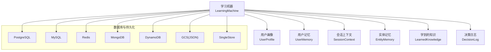
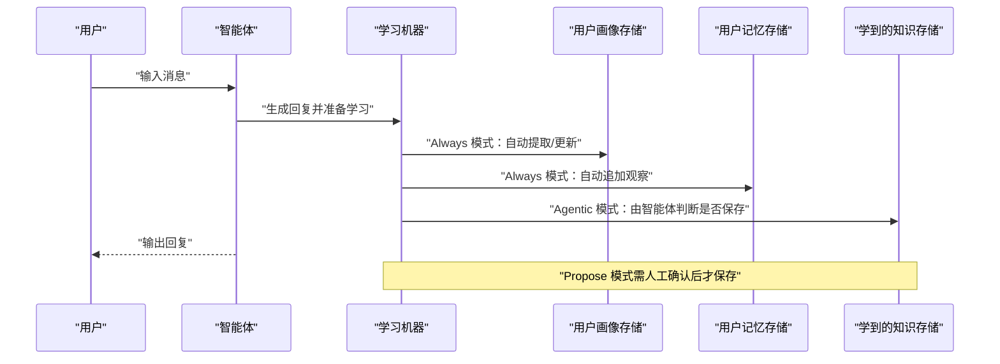
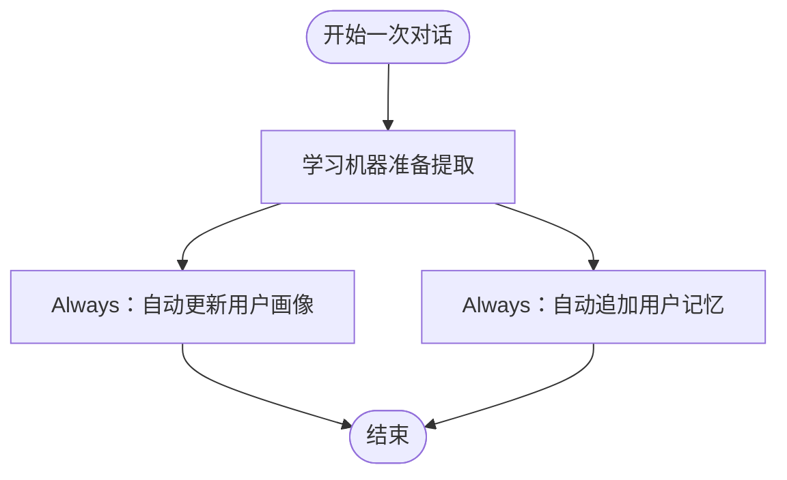
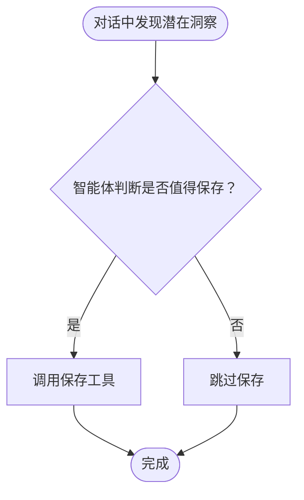
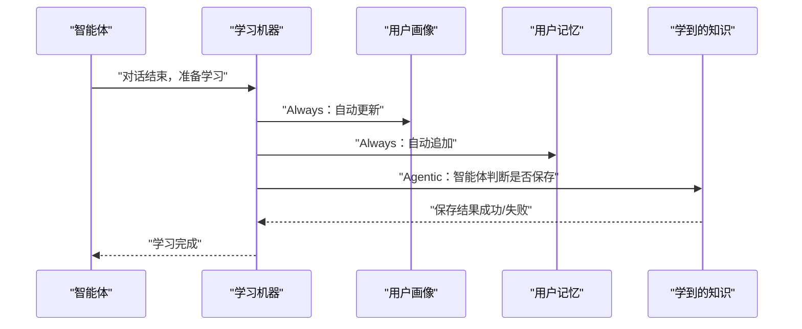
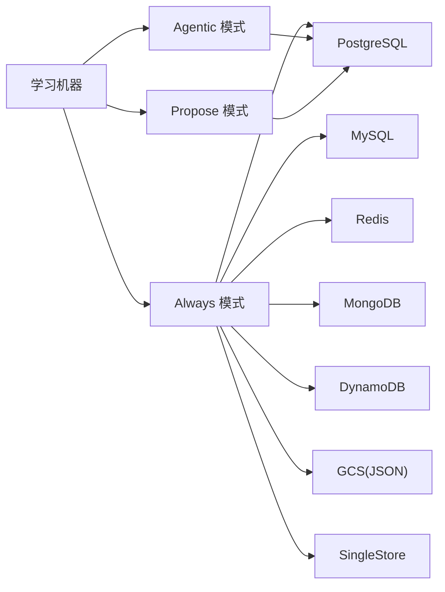

# 模式组合使用

<cite>
**本文引用的文件**
- [学习模式](file://learning/learning-modes.mdx)
- [学习存储总览](file://learning/stores/intro.mdx)
- [用户画像（User Profile）](file://learning/stores/user-profile.mdx)
- [用户记忆（User Memory）](file://learning/stores/user-memory.mdx)
- [会话上下文（Session Context）](file://examples/learning/session-context/summary-mode.mdx)
- [学习快速开始](file://learning/quickstart.mdx)
- [无数据库优雅降级测试](file://examples/learning/quick-tests/no-db-graceful.mdx)
- [代理调试](file://agents/debugging-agents.mdx)
- [团队调试](file://teams/debugging-teams.mdx)
- [学习：建议模式（Propose）](file://examples/learning/learned-knowledge/propose-mode.mdx)
- [代理学习：主动模式示例](file://examples/learning/quickstart/agentic-learn.mdx)
- [PostgreSQL 数据库](file://reference/storage/postgres.mdx)
- [MySQL 数据库](file://reference/storage/mysql.mdx)
- [Redis 数据库](file://reference/storage/redis.mdx)
- [MongoDB 数据库](file://reference/storage/mongodb.mdx)
- [DynamoDB 数据库](file://reference/storage/dynamodb.mdx)
- [Google Cloud Storage JSON 数据库](file://reference/storage/gcs.mdx)
- [SingleStore 数据库](file://reference/storage/singlestore.mdx)
</cite>

## 目录
1. [简介](#简介)
2. [项目结构](#项目结构)
3. [核心组件](#核心组件)
4. [架构总览](#架构总览)
5. [详细组件分析](#详细组件分析)
6. [依赖关系分析](#依赖关系分析)
7. [性能考量](#性能考量)
8. [故障排除指南](#故障排除指南)
9. [结论](#结论)
10. [附录](#附录)

## 简介
本文件面向需要在多存储类型中进行“学习模式组合使用”的读者，系统阐述如何针对不同存储选择合适的模式，以实现更优的学习效果与工程实践。文档重点覆盖以下内容：
- 针对用户画像、用户记忆、学到的知识等不同存储的默认模式与选择理由
- 混合模式配置示例（如用户画像与用户记忆使用 Always 模式、学到的知识使用 Agentic 模式）
- 模式组合的设计原则与权衡
- 不同场景下的组合建议与最佳实践
- 模式切换的时机与性能影响分析
- 故障排除与调试方法

## 项目结构
围绕“学习模式组合”，本仓库提供了从概念到示例的完整资料：
- 学习模式与默认策略：学习模式文档
- 学习存储类型与用途：学习存储总览与各存储页面
- 典型存储示例：用户画像、用户记忆、会话上下文
- 快速开始与混合模式示例：学习快速开始、代理学习主动模式示例、建议模式示例
- 数据库与持久化：多种数据库参考页
- 调试与故障排除：代理调试、团队调试、无数据库优雅降级测试

图表来源
- [学习模式](file://learning/learning-modes.mdx)
- [学习存储总览](file://learning/stores/intro.mdx)
- [PostgreSQL 数据库](file://reference/storage/postgres.mdx)
- [MySQL 数据库](file://reference/storage/mysql.mdx)
- [Redis 数据库](file://reference/storage/redis.mdx)
- [MongoDB 数据库](file://reference/storage/mongodb.mdx)
- [DynamoDB 数据库](file://reference/storage/dynamodb.mdx)
- [Google Cloud Storage JSON 数据库](file://reference/storage/gcs.mdx)
- [SingleStore 数据库](file://reference/storage/singlestore.mdx)

章节来源
- [学习模式](file://learning/learning-modes.mdx)
- [学习存储总览](file://learning/stores/intro.mdx)

## 核心组件
- 学习模式（Always、Agentic、Propose）
  - Always：每次响应后自动提取，适合需要持续跟踪的存储（如用户画像、用户记忆、会话上下文、实体记忆）
  - Agentic：由智能体根据上下文决定是否保存，适合“学到的知识”“决策日志”等需要质量控制或审计的场景
  - Propose：智能体先提出建议，经人工确认后再保存，适合高价值或合规敏感的知识沉淀
- 学习存储类型
  - 用户画像（UserProfile）：结构化字段（姓名、角色、偏好），用于个性化
  - 用户记忆（UserMemory）：非结构化观察与事实，用于上下文保留
  - 会话上下文（SessionContext）：目标、计划与进度，用于长任务
  - 实体记忆（EntityMemory）：外部实体的事实，用于知识图谱
  - 学到的知识（LearnedKnowledge）：跨用户的洞察，用于团队改进
  - 决策日志（DecisionLog）：带推理的决策，用于审计与学习

章节来源
- [学习模式](file://learning/learning-modes.mdx)
- [学习存储总览](file://learning/stores/intro.mdx)

## 架构总览
下图展示了“学习模式组合”的高层交互：智能体在一次对话中，可能同时触发多个存储的提取或保存流程；不同存储采用不同模式，从而在自动化程度、质量控制与开销之间取得平衡。

图表来源
- [学习模式](file://learning/learning-modes.mdx)
- [学习存储总览](file://learning/stores/intro.mdx)

## 详细组件分析

### 组件A：用户画像（UserProfile）与用户记忆（UserMemory）的 Always 模式
- 设计要点
  - Always 模式在每次响应后自动提取与更新，确保结构化信息与非结构化观察的连续性
  - 用户画像适合 Always，因为名称、角色、偏好等应保持一致与可检索
  - 用户记忆适合 Always，因为观察与事实会随对话被动积累
- 使用建议
  - 将用户画像与用户记忆均设为 Always，可降低遗漏风险，提升个性化与上下文质量
  - 若希望减少 LLM 调用次数，可在特定场景下评估是否允许延迟或批量处理

图表来源
- [学习模式](file://learning/learning-modes.mdx)
- [用户画像（User Profile）](file://learning/stores/user-profile.mdx)
- [用户记忆（User Memory）](file://learning/stores/user-memory.mdx)

章节来源
- [学习模式](file://learning/learning-modes.mdx)
- [用户画像（User Profile）](file://learning/stores/user-profile.mdx)
- [用户记忆（User Memory）](file://learning/stores/user-memory.mdx)

### 组件B：学到的知识（LearnedKnowledge）的 Agentic 模式
- 设计要点
  - Agentic 模式由智能体决定何时保存，适合“学到的知识”，能避免无关信息进入知识库
  - 可结合工具（如保存/搜索）在合适时机进行保存与检索
- 使用建议
  - 在对话中引导智能体识别“可迁移洞察”，并在合适时机调用保存工具
  - 对于高价值或合规敏感的知识，可考虑切换为 Propose 模式，增加人工确认

图表来源
- [学习模式](file://learning/learning-modes.mdx)
- [学习：建议模式（Propose）](file://examples/learning/learned-knowledge/propose-mode.mdx)

章节来源
- [学习模式](file://learning/learning-modes.mdx)
- [学习：建议模式（Propose）](file://examples/learning/learned-knowledge/propose-mode.mdx)

### 组件C：会话上下文（SessionContext）与实体记忆（EntityMemory）
- 设计要点
  - 会话上下文与实体记忆通常采用 Always 模式，保证会话目标与外部实体事实的连续记录
  - 会话上下文有助于长任务的连贯性与回溯
  - 实体记忆用于构建知识图谱，持续从对话中抽取事实与事件
- 使用建议
  - 对于长会话或多轮任务，Always 模式可显著提升上下文一致性
  - 结合“会话摘要”能力，可进一步优化上下文长度与检索效率

章节来源
- [会话上下文（Session Context）](file://examples/learning/session-context/summary-mode.mdx)
- [学习模式](file://learning/learning-modes.mdx)

### 组件D：决策日志（DecisionLog）
- 设计要点
  - 决策日志支持 Always 或 Agentic 两种形态，既可自动记录，也可显式触发
  - 适合审计与复盘，帮助理解智能体的推理过程与决策依据
- 使用建议
  - 在关键决策点启用 Agentic，确保有明确的“记录/搜索”工具可用
  - 对高风险或合规要求高的场景，可结合 Always 与 Agentic 的组合使用

章节来源
- [学习模式](file://learning/learning-modes.mdx)

### 组件E：混合模式配置示例（Always + Agentic）
- 示例目标
  - 用户画像：Always（自动）
  - 用户记忆：Always（自动）
  - 学到的知识：Agentic（智能体驱动）
- 配置思路
  - 通过学习机器的配置分别指定各存储的模式
  - 保持数据库与向量库（如需要）稳定可用，确保持久化与检索正常
- 性能与体验
  - Always 模式会在每次响应后产生额外 LLM 调用，但能保证数据连续性
  - Agentic 模式减少不必要的保存，提高整体吞吐

图表来源
- [学习模式](file://learning/learning-modes.mdx)
- [学习快速开始](file://learning/quickstart.mdx)

章节来源
- [学习模式](file://learning/learning-modes.mdx)
- [学习快速开始](file://learning/quickstart.mdx)

## 依赖关系分析
- 学习模式依赖于学习机器的配置，不同存储可独立设置模式
- 各存储依赖底层数据库与向量库（如使用学到的知识），以实现持久化与检索
- 数据库类型多样，可根据部署环境与性能需求选择

图表来源
- [学习模式](file://learning/learning-modes.mdx)
- [PostgreSQL 数据库](file://reference/storage/postgres.mdx)
- [MySQL 数据库](file://reference/storage/mysql.mdx)
- [Redis 数据库](file://reference/storage/redis.mdx)
- [MongoDB 数据库](file://reference/storage/mongodb.mdx)
- [DynamoDB 数据库](file://reference/storage/dynamodb.mdx)
- [Google Cloud Storage JSON 数据库](file://reference/storage/gcs.mdx)
- [SingleStore 数据库](file://reference/storage/singlestore.mdx)

章节来源
- [学习模式](file://learning/learning-modes.mdx)
- [PostgreSQL 数据库](file://reference/storage/postgres.mdx)
- [MySQL 数据库](file://reference/storage/mysql.mdx)
- [Redis 数据库](file://reference/storage/redis.mdx)
- [MongoDB 数据库](file://reference/storage/mongodb.mdx)
- [DynamoDB 数据库](file://reference/storage/dynamodb.mdx)
- [Google Cloud Storage JSON 数据库](file://reference/storage/gcs.mdx)
- [SingleStore 数据库](file://reference/storage/singlestore.mdx)

## 性能考量
- Always 模式的额外开销
  - 每次响应后都会触发提取，带来额外的 LLM 调用与数据库写入
  - 建议在对话频繁、需要强一致性的场景使用，并关注令牌与成本
- Agentic 模式的吞吐优势
  - 仅在必要时保存，减少无效写入
  - 适合高价值知识与审计场景，兼顾质量与效率
- Propose 模式的交互成本
  - 需要人工确认，适合合规敏感或高价值知识
  - 会引入用户等待时间，需在质量与速度间权衡
- 数据库与检索性能
  - 选择合适的数据库与索引策略（如向量检索）可显著降低查询延迟
  - 对高频写入场景，建议评估数据库的写入能力与扩展性

章节来源
- [学习模式](file://learning/learning-modes.mdx)
- [学习快速开始](file://learning/quickstart.mdx)

## 故障排除指南
- 无数据库时的优雅降级
  - 当未提供数据库时，学习功能应不崩溃，仅跳过持久化部分
  - 建议在开发与测试阶段验证该行为，确保用户体验稳定
- 调试学习行为
  - 启用代理/团队调试模式，查看消息流、工具调用与中间步骤
  - 关注 token 使用、执行时间与上下文长度，定位性能瓶颈
- 常见问题与对策
  - 模式误配导致数据不一致：检查 Always/Agentic/Propose 的适用范围
  - 数据库不可用：确认连接参数与网络状态，必要时降级到内存或本地存储
  - 决策日志缺失：确认是否启用 Agentic 并具备相应工具

章节来源
- [无数据库优雅降级测试](file://examples/learning/quick-tests/no-db-graceful.mdx)
- [代理调试](file://agents/debugging-agents.mdx)
- [团队调试](file://teams/debugging-teams.mdx)

## 结论
- 模式组合的核心在于“按存储类型匹配其特性与业务价值”
- Always 模式适合需要连续跟踪与强一致性的存储（用户画像、用户记忆、会话上下文、实体记忆）
- Agentic 模式适合需要质量控制与智能判断的存储（学到的知识、决策日志）
- Propose 模式适合高价值或合规敏感的知识沉淀
- 在实际工程中，应综合考虑性能、成本与质量，动态调整模式组合，并通过调试与监控持续优化

## 附录

### 默认模式与选择理由（摘要）
- 用户画像：Always（名称与偏好应一致）
- 用户记忆：Always（观察被动积累）
- 会话上下文：Always（会话状态需持续跟踪）
- 实体记忆：Always（对话中持续抽取事实/事件）
- 学到的知识：Agentic（智能体决定保存价值）
- 决策日志：Always 或 Agentic（支持自动记录与显式记录）

章节来源
- [学习模式](file://learning/learning-modes.mdx)

### 混合模式配置示例路径（摘要）
- Always + Always + Agentic 的组合示例
  - [学习模式](file://learning/learning-modes.mdx)
  - [学习快速开始](file://learning/quickstart.mdx)
- Agentic 模式示例（用户画像/记忆）
  - [代理学习：主动模式示例](file://examples/learning/quickstart/agentic-learn.mdx)
- Propose 模式示例（学到的知识）
  - [学习：建议模式（Propose）](file://examples/learning/learned-knowledge/propose-mode.mdx)

章节来源
- [学习模式](file://learning/learning-modes.mdx)
- [学习快速开始](file://learning/quickstart.mdx)
- [代理学习：主动模式示例](file://examples/learning/quickstart/agentic-learn.mdx)
- [学习：建议模式（Propose）](file://examples/learning/learned-knowledge/propose-mode.mdx)