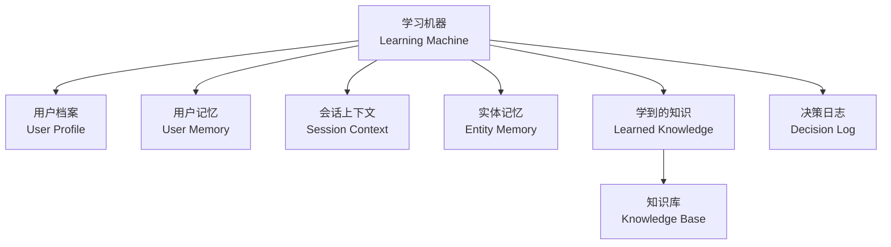
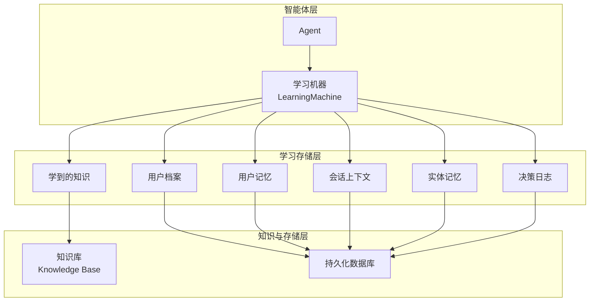
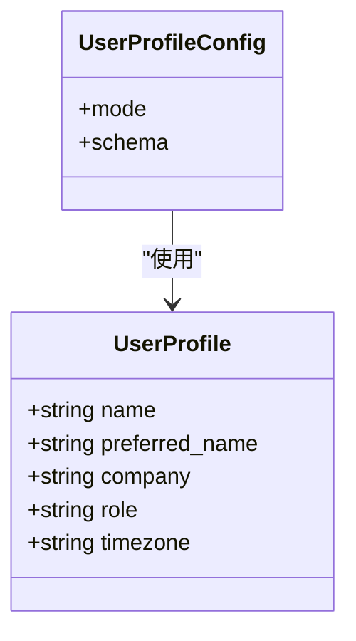
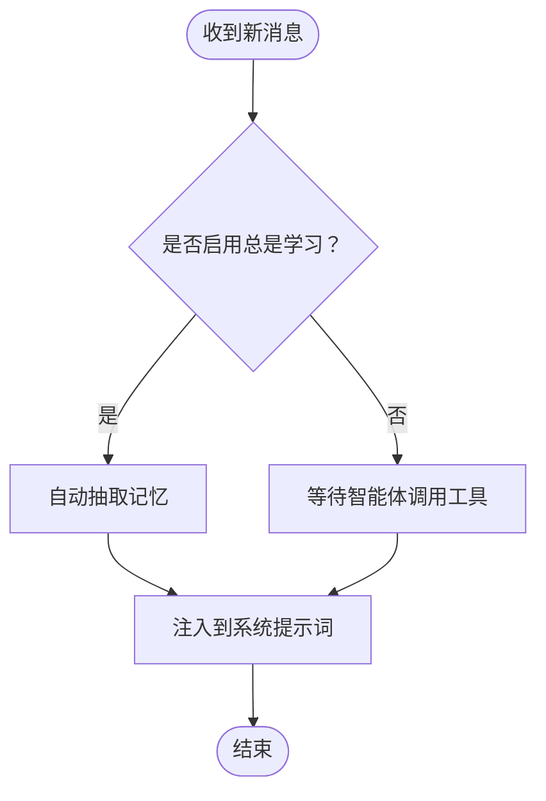
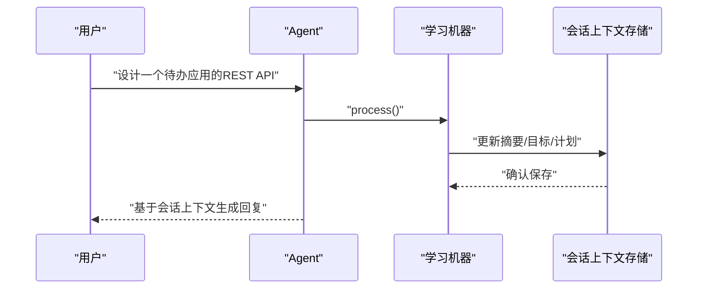
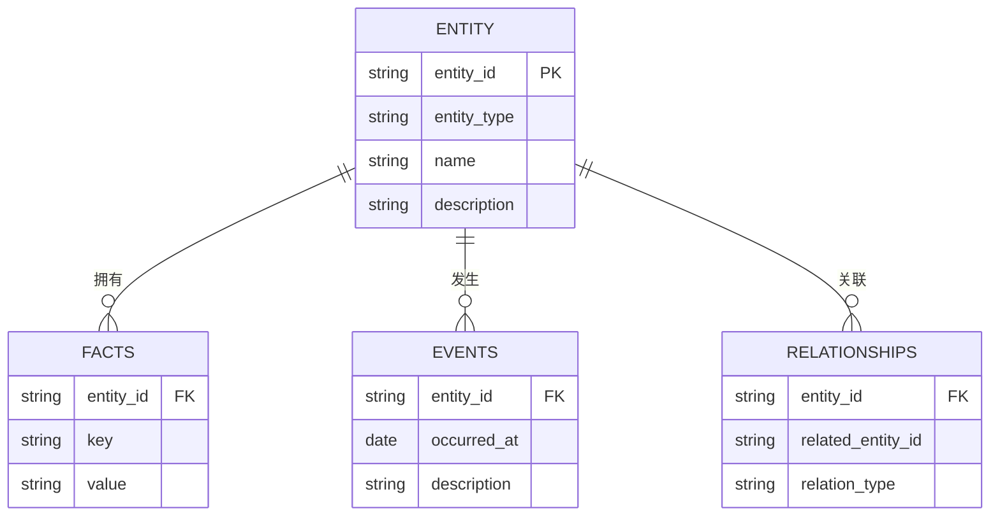
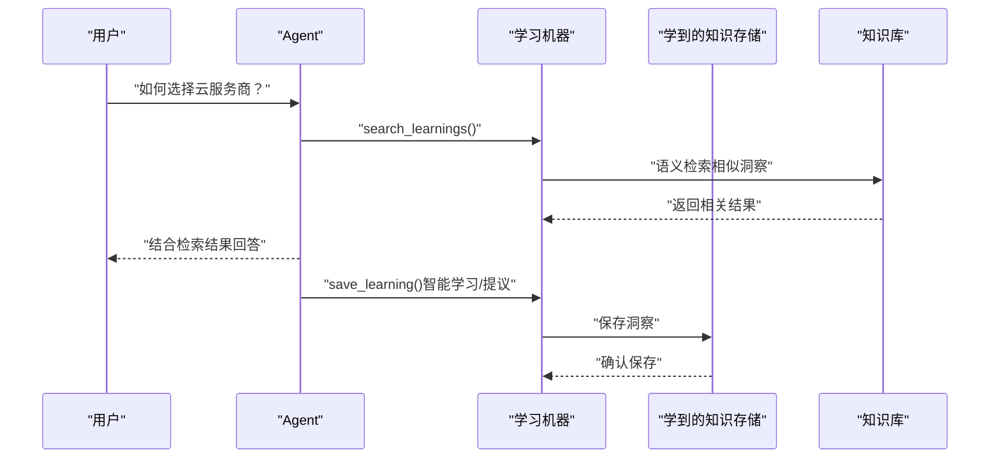
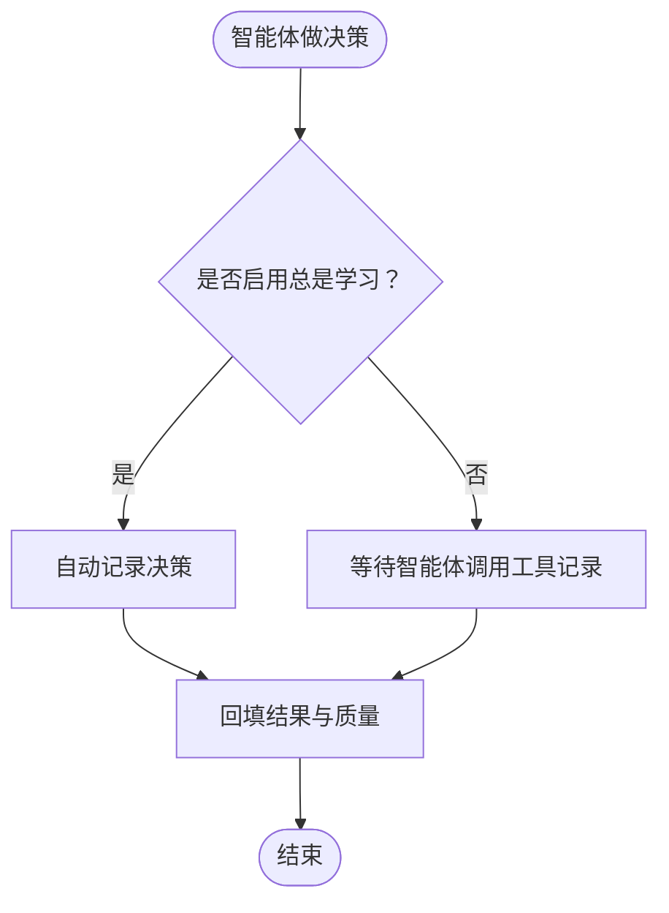
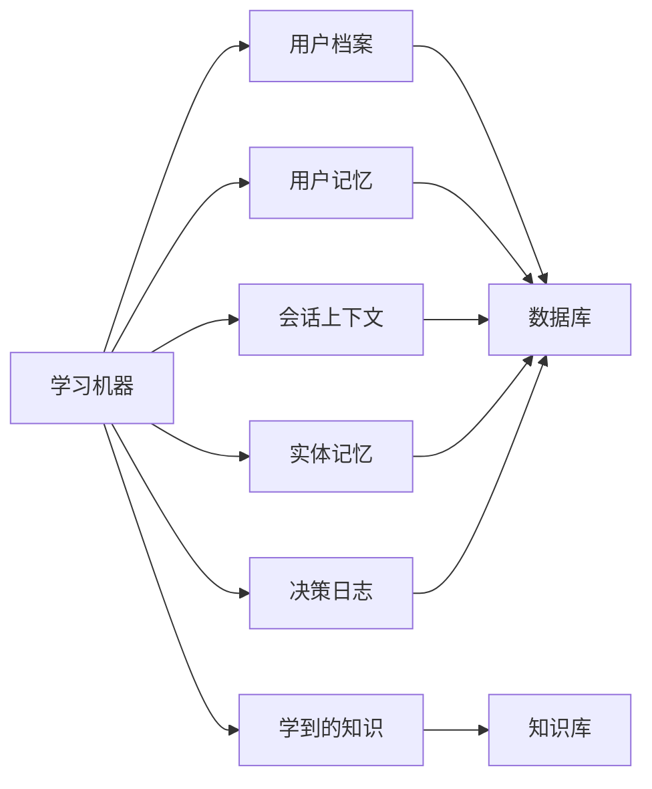

# 学习系统

<cite>
**本文引用的文件**
- [学习概览](file://learning/overview.mdx)
- [快速开始](file://learning/quickstart.mdx)
- [学习模式](file://learning/learning-modes.mdx)
- [用户档案](file://learning/stores/user-profile.mdx)
- [用户记忆](file://learning/stores/user-memory.mdx)
- [会话上下文](file://learning/stores/session-context.mdx)
- [实体记忆](file://learning/stores/entity-memory.mdx)
- [学到的知识](file://learning/stores/learned-knowledge.mdx)
- [决策日志](file://learning/stores/decision-log.mdx)
- [自定义模式](file://learning/custom-schemas.mdx)
- [个人助理示例](file://cookbook/learning/personal-assistant.mdx)
- [支持代理示例](file://cookbook/learning/support-agent.mdx)
- [安全与隐私说明](file://TBD/pages/get-started/agent-engineering.mdx)
</cite>

## 目录
1. [简介](#简介)
2. [项目结构](#项目结构)
3. [核心组件](#核心组件)
4. [架构总览](#架构总览)
5. [详细组件分析](#详细组件分析)
6. [依赖关系分析](#依赖关系分析)
7. [性能考量](#性能考量)
8. [故障排查指南](#故障排查指南)
9. [结论](#结论)
10. [附录](#附录)

## 简介
本技术文档面向希望构建“学习型智能体”的开发者与产品团队，系统阐述学习系统的概念、组件与实践方法。学习系统通过“学习机器（Learning Machine）”将多个“学习存储（Learning Stores）”组合起来，使智能体能够在每次交互后持续学习并改进：用户档案记录结构化信息；用户记忆沉淀非结构化观察；会话上下文跟踪当前任务状态；实体记忆维护外部实体知识图谱；学到的知识实现跨用户的可复用洞察；决策日志用于审计与反馈闭环。

学习系统同时提供三种学习模式：总是学习（Always）、智能学习（Agentic）、提议学习（Propose），以平衡自动化程度、可控性与合规要求。系统还支持自定义模式扩展，允许按领域定制存储字段与命名空间策略，满足个性化服务与智能推荐等复杂场景。

## 项目结构
学习系统相关文档主要分布在以下路径：
- learning/overview.mdx：学习机器总体介绍与核心能力
- learning/quickstart.mdx：启用学习的最简方式与基础示例
- learning/learning-modes.mdx：学习模式详解与默认策略
- learning/stores/*：各学习存储的使用指南与数据模型
- learning/custom-schemas.mdx：自定义模式与字段扩展
- cookbook/learning/*：典型应用场景（个人助理、支持代理）
- TBD/pages/get-started/agent-engineering.mdx：安全与隐私背景说明

**图表来源**
- [学习概览:24-38](file://learning/overview.mdx#L24-L38)
- [学习模式:1-147](file://learning/learning-modes.mdx#L1-L147)
- [用户档案:1-168](file://learning/stores/user-profile.mdx#L1-L168)
- [用户记忆:1-162](file://learning/stores/user-memory.mdx#L1-L162)
- [会话上下文:1-164](file://learning/stores/session-context.mdx#L1-L164)
- [实体记忆:1-184](file://learning/stores/entity-memory.mdx#L1-L184)
- [学到的知识:1-214](file://learning/stores/learned-knowledge.mdx#L1-L214)
- [决策日志:1-173](file://learning/stores/decision-log.mdx#L1-L173)

**章节来源**
- [学习概览:1-112](file://learning/overview.mdx#L1-L112)
- [学习模式:1-147](file://learning/learning-modes.mdx#L1-L147)

## 核心组件
- 用户档案（User Profile）
  - 作用：记录结构化事实（姓名、偏好、角色等），随对话自动更新或由智能体显式更新。
  - 默认模式：总是学习（Always）。
  - 上下文注入：自动注入到系统提示词中，无需手动拼接。
- 用户记忆（User Memory）
  - 作用：记录非结构化的观察与偏好，支持长期保留与清洗。
  - 默认模式：总是学习（Always）。
  - 上下文注入：相关记忆自动注入系统提示词，辅助个性化回答。
- 会话上下文（Session Context）
  - 作用：记录当前会话的目标、计划与进度，适合长对话、多步任务与恢复会话。
  - 默认模式：总是学习（Always）。
  - 可选规划模式：开启后记录目标、步骤与完成情况。
- 实体记忆（Entity Memory）
  - 作用：维护外部实体（公司、项目、人）的事实、事件与关系，形成知识图谱。
  - 默认模式：总是学习（Always）。
  - 命名空间：支持全局、用户级或自定义分组共享。
- 学到的知识（Learned Knowledge）
  - 作用：跨用户可复用的洞察与最佳实践，依赖向量数据库进行语义检索。
  - 默认模式：智能学习（Agentic）。
  - 支持模式：总是学习（Always）、智能学习（Agentic）、提议学习（Propose）。
- 决策日志（Decision Log）
  - 作用：记录智能体的决策、理由、替代方案、结果与质量，便于审计与反馈。
  - 默认模式：总是学习（Always）或智能学习（Agentic）。
  - 工具：log_decision、record_outcome、search_decisions。

**章节来源**
- [学习概览:24-38](file://learning/overview.mdx#L24-L38)
- [用户档案:8-16](file://learning/stores/user-profile.mdx#L8-L16)
- [用户记忆:8-16](file://learning/stores/user-memory.mdx#L8-L16)
- [会话上下文:8-16](file://learning/stores/session-context.mdx#L8-L16)
- [实体记忆:8-16](file://learning/stores/entity-memory.mdx#L8-L16)
- [学到的知识:8-17](file://learning/stores/learned-knowledge.mdx#L8-L17)
- [决策日志:8-16](file://learning/stores/decision-log.mdx#L8-L16)

## 架构总览
学习系统采用“学习机器协调多个学习存储”的架构。每个存储遵循统一协议（recall、process、build_context、get_tools），并通过模式控制何时提取与保存。知识型存储（学到的知识）依赖知识库（向量数据库）实现语义检索与上下文注入。

**图表来源**
- [学习概览:24-38](file://learning/overview.mdx#L24-L38)
- [学到的知识:18-34](file://learning/stores/learned-knowledge.mdx#L18-L34)

## 详细组件分析

### 用户档案（User Profile）
- 数据模型要点：包含用户标识、结构化字段（如名称、首选名、公司、角色、时区等）。
- 使用方式：启用后自动抽取；也可通过工具显式更新。
- 上下文注入：系统提示词自动包含用户档案内容，提升个性化程度。
- 自定义模式：通过继承基础模式类扩展字段，并在元数据中描述字段含义。

**图表来源**
- [用户档案:94-125](file://learning/stores/user-profile.mdx#L94-L125)

**章节来源**
- [用户档案:1-168](file://learning/stores/user-profile.mdx#L1-L168)
- [自定义模式:10-50](file://learning/custom-schemas.mdx#L10-L50)

### 用户记忆（User Memory）
- 数据模型要点：用户标识、记忆条目列表（含内容与可选元数据）、审计上下文（agent_id、team_id）、时间戳。
- 使用方式：默认自动抽取；也可通过工具增删改清。
- 上下文注入：相关记忆注入系统提示词，增强对用户偏好的理解。
- 维护建议：定期修剪过期与去重，保持高质量记忆库。

**图表来源**
- [用户记忆:47-86](file://learning/stores/user-memory.mdx#L47-L86)

**章节来源**
- [用户记忆:1-162](file://learning/stores/user-memory.mdx#L1-L162)

### 会话上下文（Session Context）
- 数据模型要点：会话标识、用户标识、摘要、目标（规划模式）、计划、进度、时间戳。
- 使用方式：默认自动更新；可开启规划模式记录目标与步骤。
- 上下文注入：系统提示词包含当前会话摘要与规划，确保长对话连贯性。

**图表来源**
- [会话上下文:17-45](file://learning/stores/session-context.mdx#L17-L45)

**章节来源**
- [会话上下文:1-164](file://learning/stores/session-context.mdx#L1-L164)

### 实体记忆（Entity Memory）
- 数据模型要点：实体标识、类型（公司/人/项目）、名称、描述、属性、事实、事件、关系。
- 使用方式：默认自动抽取；也可通过工具搜索、创建、更新、添加事实/事件/关系。
- 命名空间：支持全局、用户级或自定义分组，实现多租户隔离。

**图表来源**
- [实体记忆:99-111](file://learning/stores/entity-memory.mdx#L99-L111)

**章节来源**
- [实体记忆:1-184](file://learning/stores/entity-memory.mdx#L1-L184)

### 学到的知识（Learned Knowledge）
- 依赖：需要知识库（向量数据库）支持语义检索。
- 数据模型要点：标题、洞察内容、适用情境、标签、命名空间、创建时间。
- 使用方式：智能学习模式下，智能体在回答前后搜索并避免重复保存；提议模式下需人工确认后再保存。
- 命名空间：支持全局、用户级或自定义分组，便于组织与分享。

**图表来源**
- [学到的知识:36-64](file://learning/stores/learned-knowledge.mdx#L36-L64)

**章节来源**
- [学到的知识:1-214](file://learning/stores/learned-knowledge.mdx#L1-L214)

### 决策日志（Decision Log）
- 数据模型要点：决策标识、决策内容、理由、决策类型、情境、替代方案、置信度、结果与质量、时间戳。
- 使用方式：总是学习模式自动记录工具调用；智能学习模式由智能体决定是否记录。
- 审计与反馈：支持查询与回填结果，构建持续优化闭环。

**图表来源**
- [决策日志:67-87](file://learning/stores/decision-log.mdx#L67-L87)

**章节来源**
- [决策日志:1-173](file://learning/stores/decision-log.mdx#L1-L173)

## 依赖关系分析
- 学习机器（LearningMachine）协调多个学习存储，统一暴露统一接口（recall、process、build_context、get_tools）。
- 学到的知识依赖知识库（向量数据库）实现语义检索；其他存储依赖持久化数据库。
- 各存储支持不同学习模式，默认模式根据用途而定（如用户档案、用户记忆、会话上下文、实体记忆默认总是学习；学到的知识默认智能学习；决策日志默认总是学习或智能学习）。

**图表来源**
- [学习概览:24-38](file://learning/overview.mdx#L24-L38)
- [学习模式:124-133](file://learning/learning-modes.mdx#L124-L133)

**章节来源**
- [学习概览:24-38](file://learning/overview.mdx#L24-L38)
- [学习模式:124-133](file://learning/learning-modes.mdx#L124-L133)

## 性能考量
- 模式权衡
  - 总是学习：每次交互触发额外LLM调用，带来更全面的记忆但增加成本。
  - 智能学习：由智能体判断何时保存，兼顾自动化与质量。
  - 提议学习：需要人工确认，适合高价值或合规敏感场景，但会降低吞吐。
- 存储与检索
  - 学到的知识依赖向量检索，需合理设置索引与嵌入维度以平衡精度与速度。
  - 用户记忆与实体记忆建议定期修剪与去重，避免无序增长影响检索效率。
- 并发与会话
  - 多用户/多会话并发时，注意会话上下文与实体记忆的命名空间隔离，避免数据串扰。

[本节为通用指导，不直接分析具体文件]

## 故障排查指南
- 记忆未生效
  - 检查学习模式是否正确配置（总是学习应自动抽取；智能学习需确保智能体调用工具）。
  - 确认数据库连接正常且表结构已初始化。
- 语义检索效果差
  - 调整嵌入模型与向量库参数，检查知识库是否已建立索引。
  - 优化检索查询与标签体系，提高召回质量。
- 决策日志噪声过多
  - 切换为智能学习模式，仅记录关键决策；或在工具调用处精细化控制。
- 数据隔离问题
  - 检查命名空间配置（全局、用户级、自定义），确保多租户隔离策略正确。

**章节来源**
- [学习模式:10-15](file://learning/learning-modes.mdx#L10-L15)
- [学到的知识:18-34](file://learning/stores/learned-knowledge.mdx#L18-L34)
- [决策日志:67-87](file://learning/stores/decision-log.mdx#L67-L87)

## 结论
学习系统通过多存储协同与灵活的学习模式，实现了从“被动记忆”到“主动学习”的跃迁。结合知识库与命名空间策略，系统既能满足个性化服务与智能推荐需求，又能在合规与成本之间取得平衡。建议从总是学习起步，逐步引入智能学习与提议学习，配合定期维护与审计，持续提升智能体的服务质量与用户体验。

[本节为总结性内容，不直接分析具体文件]

## 附录

### 快速开始
- 启用学习：将学习机器设置为 True 或显式配置各存储。
- 测试记忆：在一次会话中提供个人信息，在后续会话中验证智能体是否能回忆。
- 生产环境：使用PostgreSQL等生产数据库，确保高可用与可扩展性。

**章节来源**
- [快速开始:8-25](file://learning/quickstart.mdx#L8-L25)
- [快速开始:95-108](file://learning/quickstart.mdx#L95-L108)

### 学习模式对比与适用场景
- 总是学习：适用于用户档案、用户记忆、会话上下文、实体记忆等需要连续跟踪的场景。
- 智能学习：适用于学到的知识、决策日志等需要智能体判断价值的场景。
- 提议学习：适用于高价值或合规敏感的知识保存，需人工确认后再入库。

**章节来源**
- [学习模式:10-15](file://learning/learning-modes.mdx#L10-L15)
- [学习模式:135-146](file://learning/learning-modes.mdx#L135-L146)

### 自定义模式与字段扩展
- 用户档案：通过继承基础模式类扩展字段，并在元数据中清晰描述字段含义。
- 其他存储：可按需扩展实体记忆、学到的知识等模式字段，提升领域适配度。

**章节来源**
- [自定义模式:10-50](file://learning/custom-schemas.mdx#L10-L50)
- [自定义模式:134-174](file://learning/custom-schemas.mdx#L134-L174)

### 应用场景与示例
- 个人助理：结合用户档案、会话上下文与实体记忆，实现长期个性化服务。
- 支持代理：多租户部署下，利用命名空间隔离与学到的知识实现跨案例复用。

**章节来源**
- [个人助理示例:1-106](file://cookbook/learning/personal-assistant.mdx#L1-L106)
- [支持代理示例:1-120](file://cookbook/learning/support-agent.mdx#L1-L120)

### 隐私保护与合规性
- 私有化部署：所有数据在企业内网运行，控制面直连本地AgentOS，避免外传。
- 数据主权：企业完全掌控数据存储与访问，消除外部共享与供应商锁定风险。
- 多租户隔离：通过命名空间策略实现组织间知识隔离，满足合规要求。

**章节来源**
- [安全与隐私说明:107-115](file://TBD/pages/get-started/agent-engineering.mdx#L107-L115)