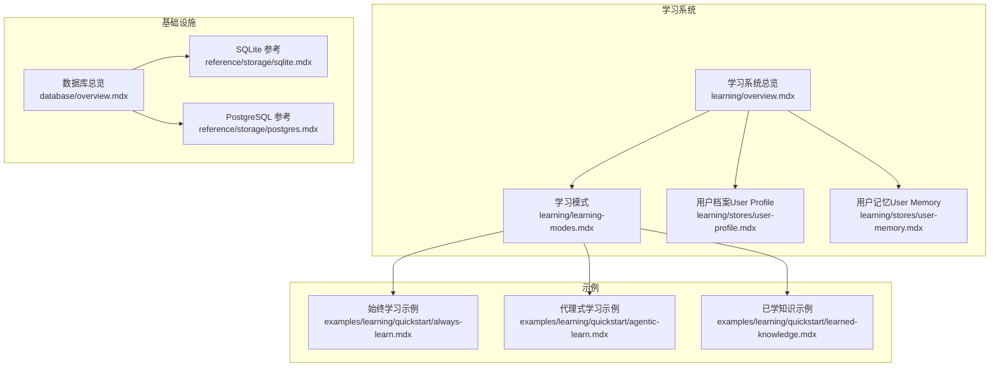
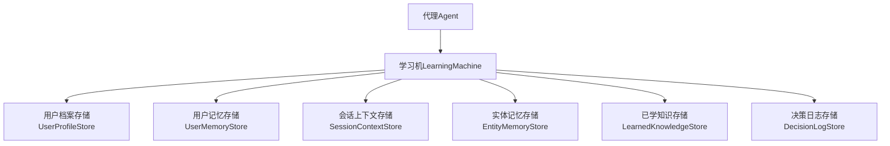
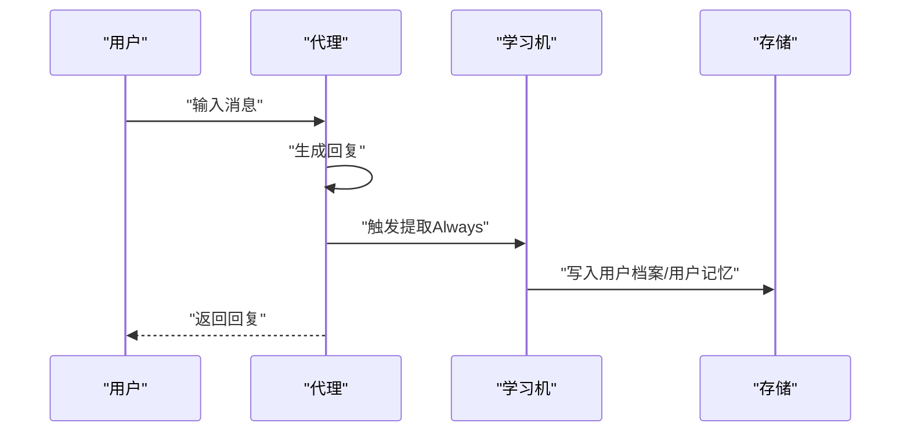
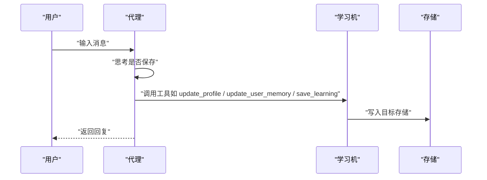
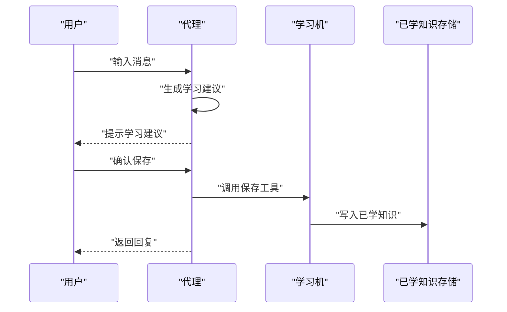
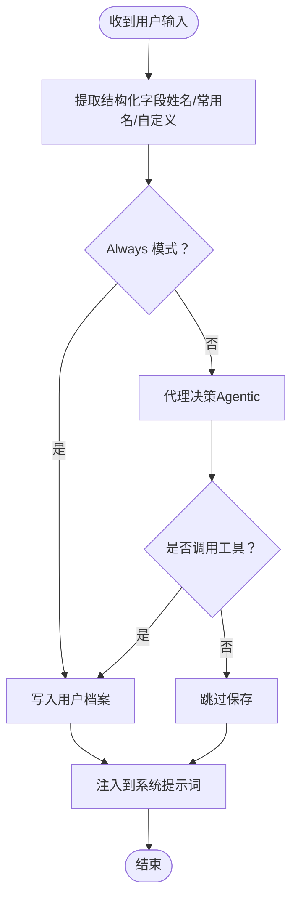
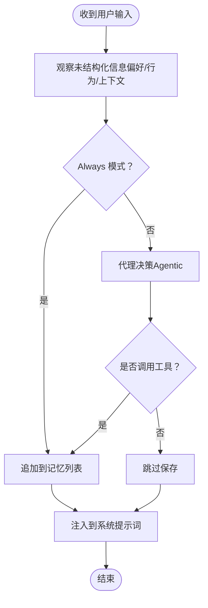
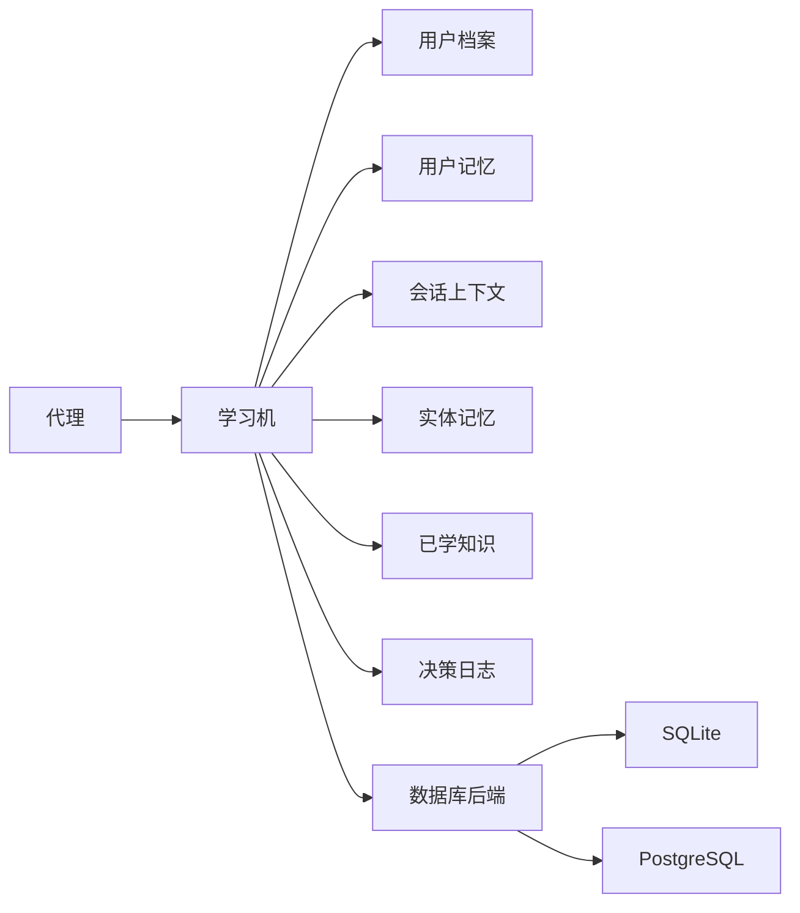

# 学习系统快速开始

<cite>
**本文引用的文件**
- [学习系统总览](file://learning/overview.mdx)
- [学习系统快速开始](file://learning/quickstart.mdx)
- [学习模式](file://learning/learning-modes.mdx)
- [用户档案（User Profile）](file://learning/stores/user-profile.mdx)
- [用户记忆（User Memory）](file://learning/stores/user-memory.mdx)
- [学习系统示例：始终学习](file://examples/learning/quickstart/always-learn.mdx)
- [学习系统示例：代理式学习](file://examples/learning/quickstart/agentic-learn.mdx)
- [学习系统示例：已学知识](file://examples/learning/quickstart/learned-knowledge.mdx)
- [无数据库优雅降级测试](file://examples/learning/quick-tests/no-db-graceful.mdx)
- [安装与环境准备](file://other/install.mdx)
- [数据库总览](file://database/overview.mdx)
- [SQLite 数据库参考](file://reference/storage/sqlite.mdx)
- [PostgreSQL 数据库参考](file://reference/storage/postgres.mdx)
</cite>

## 目录
1. [简介](#简介)
2. [项目结构](#项目结构)
3. [核心组件](#核心组件)
4. [架构总览](#架构总览)
5. [详细组件分析](#详细组件分析)
6. [依赖关系分析](#依赖关系分析)
7. [性能考虑](#性能考虑)
8. [故障排查指南](#故障排查指南)
9. [结论](#结论)
10. [附录](#附录)

## 简介
本指南面向新手开发者，帮助你在最短时间内启用并运行“学习系统”。你将学会：
- 如何在代理中启用学习功能（最小配置）
- 三种学习模式（总是学习、智能学习、提议学习）的基础配置与适用场景
- 学习存储的基本设置（用户档案、用户记忆等）
- 常见配置错误与解决方案
- 从零开始的完整示例流程（安装、配置、运行）

## 项目结构
学习系统相关文档主要分布在以下路径：
- learning：学习系统总览、模式说明、各存储类型详解
- examples/learning：学习系统示例（快速开始、基础用法、自定义存储等）
- database：数据库总览与支持列表
- reference/storage：数据库适配器参考（如 SQLite、PostgreSQL）

**图表来源**
- [学习系统总览:1-112](file://learning/overview.mdx#L1-L112)
- [学习模式:1-147](file://learning/learning-modes.mdx#L1-L147)
- [用户档案（User Profile）:1-168](file://learning/stores/user-profile.mdx#L1-L168)
- [用户记忆（User Memory）:1-162](file://learning/stores/user-memory.mdx#L1-L162)
- [学习系统示例：始终学习:1-75](file://examples/learning/quickstart/always-learn.mdx#L1-L75)
- [学习系统示例：代理式学习:1-83](file://examples/learning/quickstart/agentic-learn.mdx#L1-L83)
- [学习系统示例：已学知识:1-92](file://examples/learning/quickstart/learned-knowledge.mdx#L1-L92)
- [数据库总览:1-130](file://database/overview.mdx#L1-L130)
- [SQLite 数据库参考:1-8](file://reference/storage/sqlite.mdx#L1-L8)
- [PostgreSQL 数据库参考:1-9](file://reference/storage/postgres.mdx#L1-L9)

**章节来源**
- [学习系统总览:1-112](file://learning/overview.mdx#L1-L112)
- [数据库总览:1-130](file://database/overview.mdx#L1-L130)

## 核心组件
- 学习机（Learning Machine）：将代理与多个“学习存储”连接起来，统一控制何时、如何提取与回放知识。
- 学习存储（Learning Stores）：按领域划分的知识存储，如用户档案、用户记忆、会话上下文、实体记忆、已学知识、决策日志。
- 学习模式（Learning Modes）：控制学习触发方式，包括“总是学习”“智能学习”“提议学习”。

关键要点：
- 最小化配置：直接设置 learning=True 即可启用默认的用户档案与用户记忆提取（总是学习模式）。
- 模式选择：不同存储可使用不同模式；默认模式由存储类型决定。
- 数据库：学习需要持久化后端；开发可用 SQLite，生产建议 PostgreSQL。

**章节来源**
- [学习系统总览:8-70](file://learning/overview.mdx#L8-L70)
- [学习模式:8-147](file://learning/learning-modes.mdx#L8-L147)
- [数据库总览:105-130](file://database/overview.mdx#L105-L130)

## 架构总览
下图展示了代理、学习机与各学习存储之间的交互关系，以及学习模式对提取时机的影响。

**图表来源**
- [学习系统总览:24-38](file://learning/overview.mdx#L24-L38)

## 详细组件分析

### 总是学习模式（Always）
- 工作原理：每次生成回复后自动提取信息，无需显式工具调用。
- 适用场景：用户档案、用户记忆、会话上下文、实体记忆等需要持续积累的场景。
- 配置要点：设置学习机的对应存储为 Always 模式；默认情况下，用户档案与用户记忆即采用 Always 模式。

**图表来源**
- [学习模式:16-40](file://learning/learning-modes.mdx#L16-L40)
- [用户档案（User Profile）:45-61](file://learning/stores/user-profile.mdx#L45-L61)
- [用户记忆（User Memory）:47-63](file://learning/stores/user-memory.mdx#L47-L63)

**章节来源**
- [学习模式:16-40](file://learning/learning-modes.mdx#L16-L40)
- [用户档案（User Profile）:45-61](file://learning/stores/user-profile.mdx#L45-L61)
- [用户记忆（User Memory）:47-63](file://learning/stores/user-memory.mdx#L47-L63)

### 智能学习模式（Agentic）
- 工作原理：代理获得工具，根据对话上下文自行决定是否保存。
- 适用场景：已学知识、决策日志等需要由代理主动判断价值的场景。
- 配置要点：为相应存储启用 Agentic 模式，并确保代理具备对应的工具。

**图表来源**
- [学习模式:42-83](file://learning/learning-modes.mdx#L42-L83)
- [用户档案（User Profile）:62-84](file://learning/stores/user-profile.mdx#L62-L84)
- [用户记忆（User Memory）:64-86](file://learning/stores/user-memory.mdx#L64-L86)

**章节来源**
- [学习模式:42-83](file://learning/learning-modes.mdx#L42-L83)
- [用户档案（User Profile）:62-84](file://learning/stores/user-profile.mdx#L62-L84)
- [用户记忆（User Memory）:64-86](file://learning/stores/user-memory.mdx#L64-L86)

### 提议学习模式（Propose）
- 工作原理：代理提出学习内容，经用户确认后再保存。
- 适用场景：高价值或合规敏感的知识，需要人工审核后再入库。
- 配置要点：当前主要用于“已学知识”存储；需提供知识向量库与嵌入器。

**图表来源**
- [学习模式:75-98](file://learning/learning-modes.mdx#L75-L98)
- [学习系统示例：已学知识:7-19](file://examples/learning/quickstart/learned-knowledge.mdx#L7-L19)

**章节来源**
- [学习模式:75-98](file://learning/learning-modes.mdx#L75-L98)
- [学习系统示例：已学知识:7-19](file://examples/learning/quickstart/learned-knowledge.mdx#L7-L19)

### 学习存储与数据模型

#### 用户档案（User Profile）
- 范围：每个用户
- 默认模式：总是学习
- 典型字段：姓名、常用名等；可扩展自定义字段
- 上下文注入：自动注入到系统提示词中

**图表来源**
- [用户档案（User Profile）:1-168](file://learning/stores/user-profile.mdx#L1-L168)

**章节来源**
- [用户档案（User Profile）:1-168](file://learning/stores/user-profile.mdx#L1-L168)

#### 用户记忆（User Memory）
- 范围：每个用户
- 默认模式：总是学习
- 数据模型：包含 user_id、memories 列表、审计字段、时间戳
- 上下文注入：相关记忆被注入到系统提示词中

**图表来源**
- [用户记忆（User Memory）:1-162](file://learning/stores/user-memory.mdx#L1-L162)

**章节来源**
- [用户记忆（User Memory）:1-162](file://learning/stores/user-memory.mdx#L1-L162)

### 示例：从零开始的完整流程

#### 步骤一：安装与环境准备
- 在虚拟环境中安装 SDK 并升级 pip（如遇问题）
- 准备 Python 3.x 环境

**章节来源**
- [安装与环境准备:1-56](file://other/install.mdx#L1-L56)

#### 步骤二：启用学习（最小配置）
- 使用 learning=True 启用默认学习（用户档案与用户记忆，总是学习模式）
- 使用 SQLite 作为开发数据库

**章节来源**
- [学习系统快速开始:8-25](file://learning/quickstart.mdx#L8-L25)
- [数据库总览:20-39](file://database/overview.mdx#L20-L39)
- [SQLite 数据库参考:1-8](file://reference/storage/sqlite.mdx#L1-L8)

#### 步骤三：运行示例
- 始终学习示例：演示自动提取与跨会话记忆
- 代理式学习示例：演示通过工具显式保存
- 已学知识示例：演示团队共享的可迁移洞察

**章节来源**
- [学习系统示例：始终学习:1-75](file://examples/learning/quickstart/always-learn.mdx#L1-L75)
- [学习系统示例：代理式学习:1-83](file://examples/learning/quickstart/agentic-learn.mdx#L1-L83)
- [学习系统示例：已学知识:1-92](file://examples/learning/quickstart/learned-knowledge.mdx#L1-L92)

#### 步骤四：切换到生产数据库（PostgreSQL）
- 生产推荐使用 PostgreSQL；开发阶段可使用 SQLite
- 参考数据库适配器参数与异步支持

**章节来源**
- [学习系统快速开始:95-108](file://learning/quickstart.mdx#L95-L108)
- [数据库总览:105-130](file://database/overview.mdx#L105-L130)
- [PostgreSQL 数据库参考:1-9](file://reference/storage/postgres.mdx#L1-L9)

## 依赖关系分析
- 代理依赖学习机；学习机协调多个存储；存储依赖数据库后端。
- 不同存储可独立启用/禁用，并各自选择学习模式。
- 数据库层支持多种实现（SQLite、PostgreSQL 等），开发与生产分别推荐。

**图表来源**
- [学习系统总览:24-38](file://learning/overview.mdx#L24-L38)
- [数据库总览:105-130](file://database/overview.mdx#L105-L130)

**章节来源**
- [学习系统总览:24-38](file://learning/overview.mdx#L24-L38)
- [数据库总览:105-130](file://database/overview.mdx#L105-L130)

## 性能考虑
- Always 模式会在每次回复后进行额外的抽取，可能增加 LLM 调用次数与延迟。
- Agentic/Propose 模式减少不必要的抽取，但需要代理具备合适的工具与判断能力。
- 对于大规模团队共享的“已学知识”，建议结合向量检索与混合搜索以平衡召回与速度。

## 故障排查指南
- 未提供数据库时的行为：学习会优雅降级（不崩溃），但仍会响应用户，仅跳过持久化部分。请确保为学习机提供数据库实例。
- 异步数据库与同步引擎不匹配：会出现上下文异常。请使用对应引擎与数据库类组合（同步/异步）。
- 数据库参数错误：检查连接字符串、权限与网络可达性。

**章节来源**
- [无数据库优雅降级测试:1-46](file://examples/learning/quick-tests/no-db-graceful.mdx#L1-L46)
- [数据库总览:122-130](file://database/overview.mdx#L122-L130)

## 结论
通过本指南，你可以：
- 用一行配置启用学习（learning=True）
- 为不同存储选择合适的学习模式
- 设置用户档案与用户记忆等基础存储
- 在开发与生产环境中正确选择数据库
- 运行官方示例验证学习效果

下一步建议：
- 阅读各存储类型的详细文档，了解自定义模式与高级用法
- 在团队或工作流中引入“已学知识”与“决策日志”，提升复用与可审计性

## 附录

### 三种学习模式的适用场景与配置要点
- 总是学习（Always）
  - 场景：用户档案、用户记忆、会话上下文、实体记忆
  - 要点：自动抽取，无需工具；适合需要持续积累的场景
- 智能学习（Agentic）
  - 场景：已学知识、决策日志
  - 要点：代理自主判断保存；适合需要质量控制的场景
- 提议学习（Propose）
  - 场景：高价值/合规敏感知识
  - 要点：代理提出建议，用户确认后保存；当前主要用于“已学知识”

**章节来源**
- [学习模式:10-147](file://learning/learning-modes.mdx#L10-L147)

### 学习存储一览（范围与默认模式）
- 用户档案：每用户，Always
- 用户记忆：每用户，Always
- 会话上下文：每会话，Always
- 实体记忆：可配置，Always
- 已学知识：可配置，Agentic
- 决策日志：每代理，Always 或 Agentic

**章节来源**
- [学习系统总览:24-38](file://learning/overview.mdx#L24-L38)
- [学习模式:124-134](file://learning/learning-modes.mdx#L124-L134)