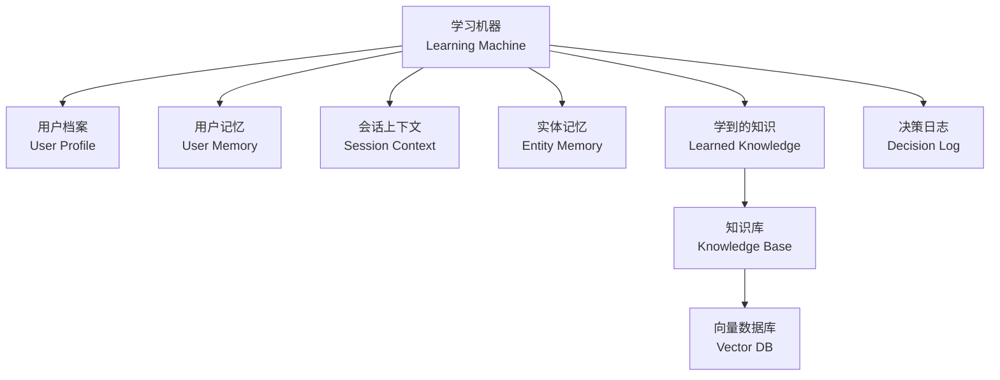
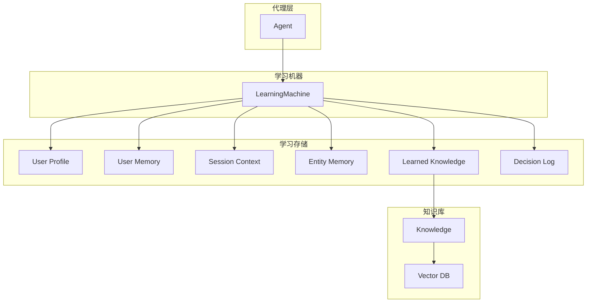
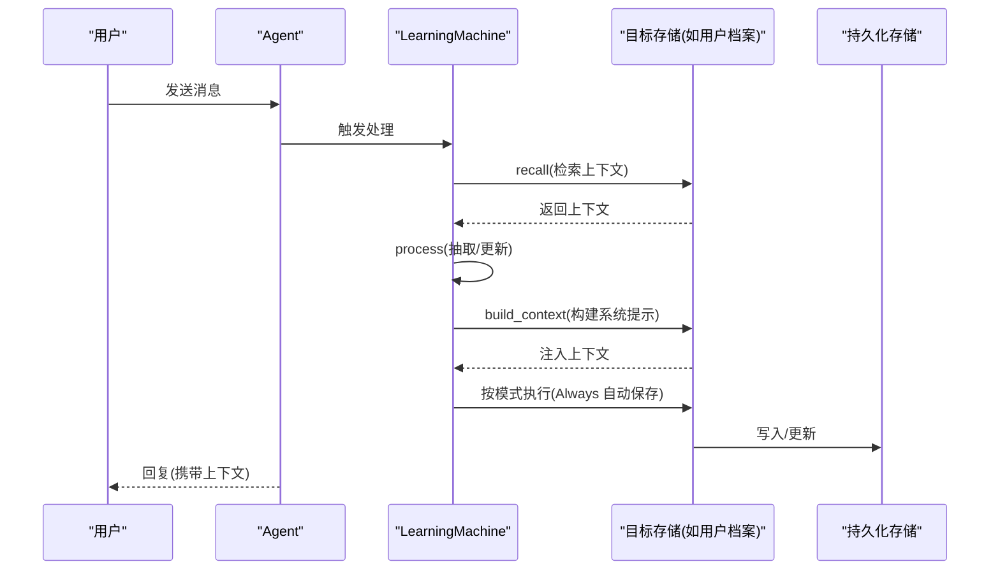
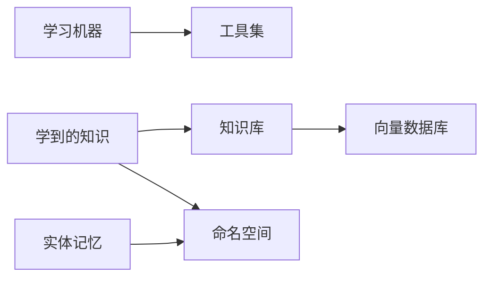

# 学习系统概述

<cite>
**本文引用的文件**
- [学习系统总览](file://learning/overview.mdx)
- [快速开始](file://learning/quickstart.mdx)
- [学习模式](file://learning/learning-modes.mdx)
- [自定义模式](file://learning/custom-schemas.mdx)
- [学习存储总览](file://learning/stores/intro.mdx)
- [用户档案](file://learning/stores/user-profile.mdx)
- [用户记忆](file://learning/stores/user-memory.mdx)
- [会话上下文](file://learning/stores/session-context.mdx)
- [实体记忆](file://learning/stores/entity-memory.mdx)
- [学到的知识](file://learning/stores/learned-knowledge.mdx)
- [决策日志](file://learning/stores/decision-log.mdx)
- [学习示例概览](file://examples/learning/overview.mdx)
</cite>

## 目录
1. [引言](#引言)
2. [项目结构](#项目结构)
3. [核心组件](#核心组件)
4. [架构总览](#架构总览)
5. [详细组件分析](#详细组件分析)
6. [依赖关系分析](#依赖关系分析)
7. [性能考量](#性能考量)
8. [故障排查指南](#故障排查指南)
9. [结论](#结论)
10. [附录](#附录)

## 引言
本文件面向希望构建“能学习、可适应并持续改进”的智能代理（Agent）的读者，系统性阐述学习系统的设计理念与实现方式。学习系统通过“学习机器”（Learning Machines）与“学习存储”（Learning Stores）协同工作，使代理在与用户的交互中不断沉淀知识，并在后续对话中加以利用。

- 学习机器：负责编排多个学习存储，按需提取、召回与注入知识，形成“记忆—理解—应用”的闭环。
- 学习存储：针对不同知识域的持久化后端，覆盖用户画像、用户记忆、会话上下文、实体记忆、学到的知识以及决策日志等。

## 项目结构
学习系统相关文档主要分布在 learning 与 examples/learning 两个目录下：
- learning/overview.mdx：学习系统总览与核心概念
- learning/quickstart.mdx：启用学习功能的最小示例与测试流程
- learning/learning-modes.mdx：三种学习模式的工作原理与适用场景
- learning/custom-schemas.mdx：扩展学习存储的自定义模式
- learning/stores/*：六大学习存储的详细说明与使用示例
- examples/learning/*：学习系统示例集合，覆盖基础用法、模式实践与端到端场景

图表来源
- [学习系统总览:8-38](file://learning/overview.mdx#L8-L38)
- [学习存储总览:8-18](file://learning/stores/intro.mdx#L8-L18)
- [学到的知识:18-35](file://learning/stores/learned-knowledge.mdx#L18-L35)

章节来源
- [学习系统总览:1-112](file://learning/overview.mdx#L1-L112)
- [学习存储总览:1-70](file://learning/stores/intro.mdx#L1-L70)

## 核心组件
- 学习机器（Learning Machines）
  - 职责：协调多个学习存储；统一暴露 recall/process/build_context/get_tools 等协议接口；根据配置选择学习模式。
  - 关键点：支持按存储粒度配置模式（Always/Agentic/Propose），并可组合多种存储。
- 六大学习存储
  - 用户档案：结构化事实（姓名、角色、偏好等），默认 Always 模式。
  - 用户记忆：非结构化观察（偏好、行为、上下文），默认 Always 模式。
  - 会话上下文：当前会话的目标、计划与进度快照，默认 Always 模式。
  - 实体记忆：外部实体（公司、项目、人）的事实、事件与关系，默认 Always 模式。
  - 学到的知识：跨用户可迁移的洞察，需配合知识库（向量数据库）使用，默认 Agentic 模式。
  - 决策日志：记录代理的决策、理由、结果与质量，支持审计与反馈循环。
- 学习模式
  - Always：每次回复后自动抽取，适合需要持续积累的存储（如用户档案、用户记忆、会话上下文、实体记忆）。
  - Agentic：代理获得工具，自行决定何时保存，适合学到的知识与决策日志。
  - Propose：代理提出学习建议，经人工确认后再保存，适用于高价值或合规敏感场景。
- 命名空间（Namespaces）
  - 支持按用户、全局或自定义分组控制数据可见性与共享范围，常见取值包括 user/global 以及团队/部门等自定义标识。
- 维护与健康检查
  - Curator 提供修剪（prune）与去重（deduplicate）能力，用于长期维护记忆健康。

章节来源
- [学习系统总览:24-71](file://learning/overview.mdx#L24-L71)
- [学习模式:10-147](file://learning/learning-modes.mdx#L10-L147)
- [用户档案:10-16](file://learning/stores/user-profile.mdx#L10-L16)
- [用户记忆:10-16](file://learning/stores/user-memory.mdx#L10-L16)
- [会话上下文:10-16](file://learning/stores/session-context.mdx#L10-L16)
- [实体记忆:10-16](file://learning/stores/entity-memory.mdx#L10-L16)
- [学到的知识:10-17](file://learning/stores/learned-knowledge.mdx#L10-L17)
- [决策日志:10-16](file://learning/stores/decision-log.mdx#L10-L16)

## 架构总览
学习系统以“学习机器”为中心，围绕六大存储构建知识闭环。其中“学到的知识”依赖知识库与向量数据库实现语义检索与注入。

图表来源
- [学习系统总览:8-38](file://learning/overview.mdx#L8-L38)
- [学到的知识:18-35](file://learning/stores/learned-knowledge.mdx#L18-L35)

## 详细组件分析

### 学习机器与学习模式
- 设计要点
  - 协调器：统一调度各存储的 recall/process/build_context/get_tools，确保上下文一致性。
  - 模式策略：每种存储可独立选择 Always/Agentic/Propose，兼顾自动化与可控性。
  - 默认策略：用户档案、用户记忆、会话上下文、实体记忆默认 Always；学到的知识默认 Agentic；决策日志默认 Always 或显式开启 Agentic。
- 序列图：Always 模式下的自动抽取流程

图表来源
- [学习系统总览:39-48](file://learning/overview.mdx#L39-L48)
- [学习模式:16-41](file://learning/learning-modes.mdx#L16-L41)

章节来源
- [学习系统总览:39-48](file://learning/overview.mdx#L39-L48)
- [学习模式:10-147](file://learning/learning-modes.mdx#L10-L147)

### 用户档案（User Profile）
- 能力与范围
  - 结构化字段（名称、首选名等），默认 Always 模式，支持自定义 Schema。
  - 上下文注入：自动注入到系统提示，无需手动拼接。
- 使用建议
  - Always 模式适合稳定、高频的结构化信息（如姓名、角色、偏好）。
  - 可通过自定义 Schema 扩展业务字段，结合 metadata 描述提升抽取准确性。

章节来源
- [用户档案:10-16](file://learning/stores/user-profile.mdx#L10-L16)
- [用户档案:17-44](file://learning/stores/user-profile.mdx#L17-L44)
- [用户档案:84-128](file://learning/stores/user-profile.mdx#L84-L128)
- [用户档案:129-155](file://learning/stores/user-profile.mdx#L129-L155)

### 用户记忆（User Memory）
- 能力与范围
  - 非结构化观察（偏好、行为、上下文），默认 Always 模式。
  - 支持 Curator 进行修剪与去重，保持长期可用性。
- 使用建议
  - Always 模式适合被动积累的观察类信息。
  - 与用户档案配合，形成“结构化身份 + 非结构化偏好”的完整画像。

章节来源
- [用户记忆:10-16](file://learning/stores/user-memory.mdx#L10-L16)
- [用户记忆:17-46](file://learning/stores/user-memory.mdx#L17-L46)
- [用户记忆:134-146](file://learning/stores/user-memory.mdx#L134-L146)

### 会话上下文（Session Context）
- 能力与范围
  - 当前会话的摘要、目标、计划与进度，生命周期随会话更新而替换。
  - 支持摘要模式与规划模式（含目标、步骤、进度跟踪）。
- 使用建议
  - 在长对话、多轮任务与会话恢复场景中尤为关键，可显著减少上下文截断带来的信息丢失。

章节来源
- [会话上下文:10-16](file://learning/stores/session-context.mdx#L10-L16)
- [会话上下文:17-46](file://learning/stores/session-context.mdx#L17-L46)
- [会话上下文:139-147](file://learning/stores/session-context.mdx#L139-L147)

### 实体记忆（Entity Memory）
- 能力与范围
  - 外部实体（公司、项目、人）的事实、事件与关系，默认 Always 模式。
  - 支持命名空间控制访问范围（user/global/自定义）。
- 使用建议
  - Always 模式可从常规对话中持续抽取实体知识；Agentic 模式提供更精细的管理工具集。

章节来源
- [实体记忆:10-16](file://learning/stores/entity-memory.mdx#L10-L16)
- [实体记忆:46-59](file://learning/stores/entity-memory.mdx#L46-L59)
- [实体记忆:152-167](file://learning/stores/entity-memory.mdx#L152-L167)

### 学到的知识（Learned Knowledge）
- 能力与范围
  - 跨用户可迁移的洞察，需配合知识库与向量数据库使用，默认 Agentic 模式。
  - 支持 Always/Agentic/Propose 三种模式，命名空间可选 user/global/自定义。
- 使用建议
  - Always 模式可能产生噪声，建议优先采用 Agentic/Propose 以提高质量。
  - 保存时注意区分“洞察”与“事实”，避免将通用信息或临时信息入库。

章节来源
- [学到的知识:10-17](file://learning/stores/learned-knowledge.mdx#L10-L17)
- [学到的知识:138-153](file://learning/stores/learned-knowledge.mdx#L138-L153)
- [学到的知识:182-197](file://learning/stores/learned-knowledge.mdx#L182-L197)

### 决策日志（Decision Log）
- 能力与范围
  - 记录代理的决策、理由、替代方案、置信度、结果与质量，支持审计与反馈循环。
  - 默认 Always（自动记录工具调用）或显式 Agentic（由代理决定是否记录）。
- 使用建议
  - 通过 outcome 与 outcome_quality 形成闭环反馈，持续优化指令与工具选择。

章节来源
- [决策日志:10-16](file://learning/stores/decision-log.mdx#L10-L16)
- [决策日志:167-173](file://learning/stores/decision-log.mdx#L167-L173)

### 命名空间（Namespaces）
- 作用：控制数据的可见性与共享范围，典型取值包括 user/global 以及团队/部门等自定义标识。
- 适用范围：实体记忆与学到的知识支持命名空间配置；用户档案/用户记忆/会话上下文/决策日志通常按用户或代理维度管理。

章节来源
- [学习系统总览:49-58](file://learning/overview.mdx#L49-L58)
- [实体记忆:152-167](file://learning/stores/entity-memory.mdx#L152-L167)
- [学到的知识:182-197](file://learning/stores/learned-knowledge.mdx#L182-L197)

### 维护与健康检查
- Curator 能力
  - prune：按最大年龄删除过期记忆
  - deduplicate：去重，保持知识库整洁
- 适用场景：长期运行的代理需要定期清理与整理记忆，避免冗余与噪声影响检索效果。

章节来源
- [学习系统总览:59-71](file://learning/overview.mdx#L59-L71)
- [用户记忆:134-146](file://learning/stores/user-memory.mdx#L134-L146)

## 依赖关系分析
- 学习存储与知识库
  - “学到的知识”依赖知识库（Knowledge）与向量数据库（Vector DB）进行语义检索与注入。
- 学习模式与工具链
  - Agentic/Propose 模式引入工具集（如 update_profile、update_user_memory、search_entities、save_learning、log_decision 等），增强可控性与可审计性。
- 命名空间与权限
  - 实体记忆与学到的知识通过命名空间实现细粒度权限控制，避免越权访问。

图表来源
- [学到的知识:18-35](file://learning/stores/learned-knowledge.mdx#L18-L35)
- [实体记忆:152-167](file://learning/stores/entity-memory.mdx#L152-L167)

章节来源
- [学到的知识:18-35](file://learning/stores/learned-knowledge.mdx#L18-L35)
- [实体记忆:152-167](file://learning/stores/entity-memory.mdx#L152-L167)

## 性能考量
- Always 模式的成本
  - 每次交互均触发抽取，带来额外的大模型调用开销，适合对一致性要求高的存储（如用户档案、用户记忆、会话上下文、实体记忆）。
- Agentic/Propose 的权衡
  - Agentic 模式由代理自主决定保存时机，可能遗漏隐式信息；Propose 模式需人工确认，适合高价值或合规敏感场景。
- 向量检索与索引
  - 学到的知识依赖向量检索，需关注嵌入质量、索引策略与查询性能；合理设置命名空间与过滤条件可降低无关匹配。

## 故障排查指南
- 记忆重复与噪声
  - 使用 Curator 的去重与修剪功能，定期清理无效或重复的记忆条目。
- 抽取不准确
  - 对于用户档案等结构化字段，可通过自定义 Schema 并在字段元数据中明确描述，提升抽取精度。
- 上下文缺失
  - 确认会话上下文与用户记忆是否启用；在长对话场景中，适当开启规划模式以保留目标与进度。
- 决策审计
  - 定期审查决策日志中的 reasoning 与 outcome，识别异常路径并调整指令或工具。

章节来源
- [用户记忆:134-146](file://learning/stores/user-memory.mdx#L134-L146)
- [用户档案:91-128](file://learning/stores/user-profile.mdx#L91-L128)
- [会话上下文:139-147](file://learning/stores/session-context.mdx#L139-L147)
- [决策日志:104-119](file://learning/stores/decision-log.mdx#L104-L119)

## 结论
学习系统通过“学习机器 + 六大学习存储 + 多模式策略 + 命名空间控制 + 维护工具”的组合，实现了从个人到团队层面的知识沉淀与迁移。在实践中，应根据场景选择合适的模式与存储组合，并借助工具链与审计机制持续优化代理的表现。

## 附录

### 快速启用学习功能（示例路径）
- 最小化启用：将 learning 参数设为 True，即可启用用户档案与用户记忆的默认抽取。
- 逐项启用：按需开启用户档案、用户记忆、会话上下文、实体记忆、学到的知识与决策日志。
- 生产环境：推荐使用 PostgreSQL 等关系型数据库作为持久化后端。

章节来源
- [快速开始:8-25](file://learning/quickstart.mdx#L8-L25)
- [快速开始:45-65](file://learning/quickstart.mdx#L45-L65)
- [快速开始:95-109](file://learning/quickstart.mdx#L95-L109)

### 示例与参考
- 学习示例概览：包含快速入门、基础用法、用户档案、会话上下文、实体记忆、学到的知识、快速验证、模式实践与自定义存储等主题。

章节来源
- [学习示例概览:1-18](file://examples/learning/overview.mdx#L1-L18)