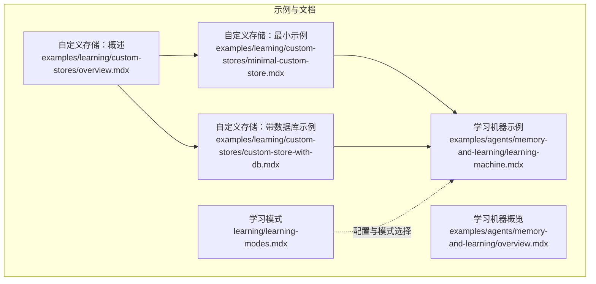
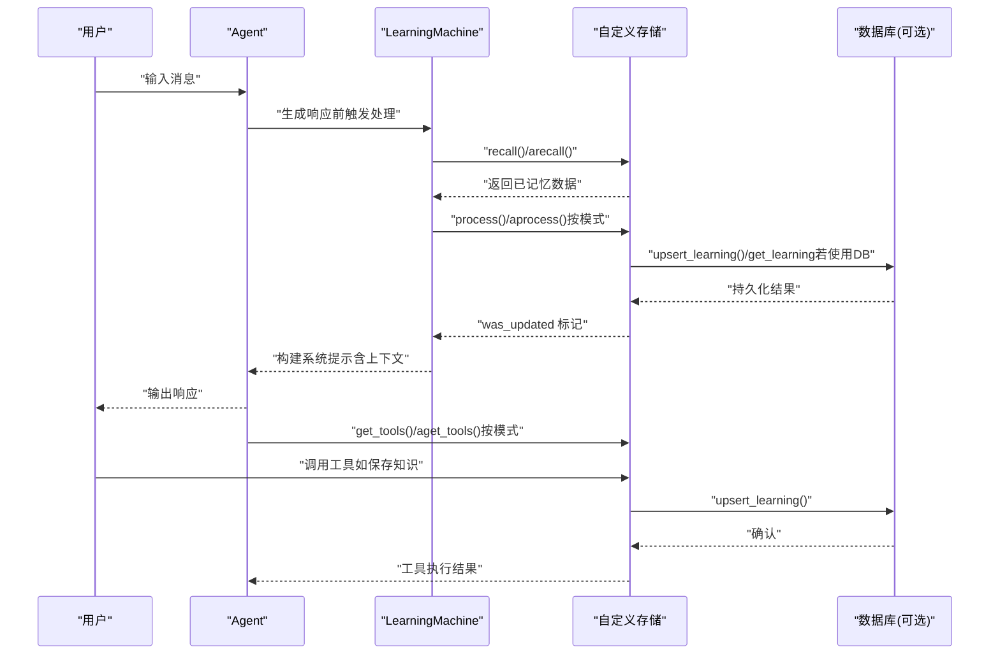
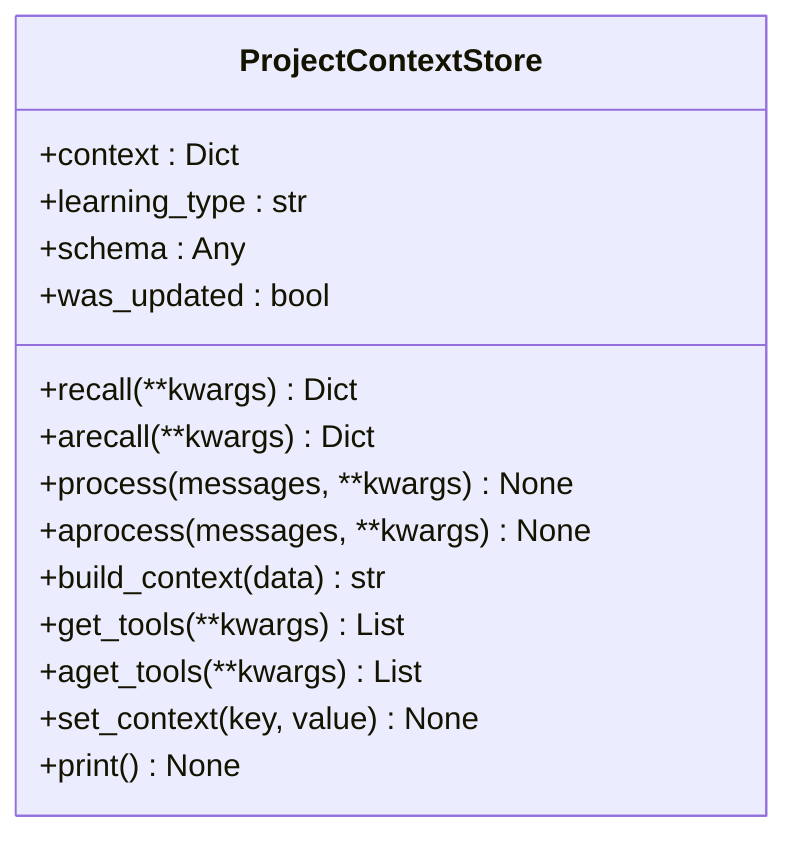
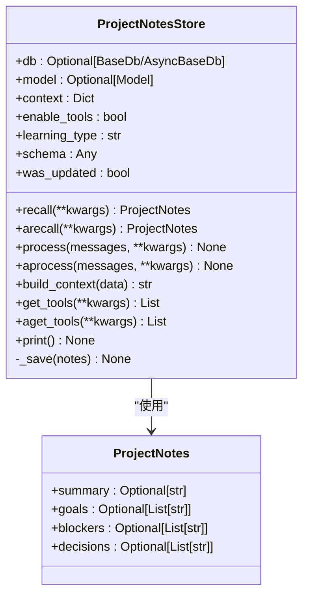
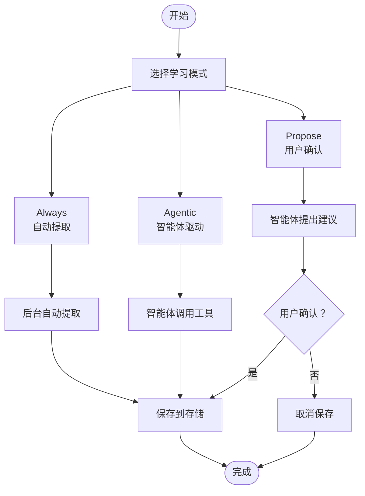
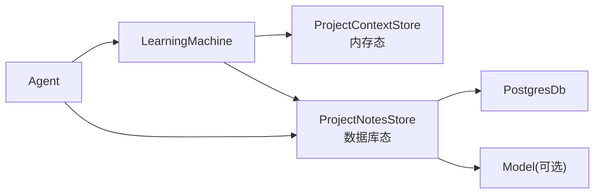

# 自定义模式

<cite>
**本文引用的文件**
- [自定义存储：最小示例](file://examples/learning/custom-stores/minimal-custom-store.mdx)
- [自定义存储：概述](file://examples/learning/custom-stores/overview.mdx)
- [自定义存储：带数据库示例](file://examples/learning/custom-stores/custom-store-with-db.mdx)
- [学习模式](file://learning/learning-modes.mdx)
- [学习机器示例](file://examples/agents/memory-and-learning/learning-machine.mdx)
- [学习机器概览](file://examples/agents/memory-and-learning/overview.mdx)
</cite>

## 目录
1. [简介](#简介)
2. [项目结构](#项目结构)
3. [核心组件](#核心组件)
4. [架构总览](#架构总览)
5. [详细组件分析](#详细组件分析)
6. [依赖关系分析](#依赖关系分析)
7. [性能考量](#性能考量)
8. [故障排查指南](#故障排查指南)
9. [结论](#结论)
10. [附录](#附录)

## 简介
本指南面向希望扩展学习系统的开发者，提供“自定义学习模式”的完整开发路径：从接口要求、实现步骤、最小化示例到与现有学习系统的集成、配置与部署、测试策略与验证方法，以及性能优化与扩展性建议。文档中的所有示例均来自仓库内的真实示例文件，确保可复现与可操作。

## 项目结构
围绕“自定义学习模式”，本仓库提供了两类关键示例：
- 最小化自定义存储（内存态）：演示如何实现 LearningStore 协议、如何通过构造函数传递上下文、如何将自定义存储注入 LearningMachine。
- 带数据库的自定义存储：在上述基础上引入持久化能力，使用数据库提供的学习数据读写方法，并暴露工具给智能体。

图表来源
- [自定义存储：概述:1-10](file://examples/learning/custom-stores/overview.mdx#L1-L10)
- [自定义存储：最小示例:1-253](file://examples/learning/custom-stores/minimal-custom-store.mdx#L1-L253)
- [自定义存储：带数据库示例:1-423](file://examples/learning/custom-stores/custom-store-with-db.mdx#L1-L423)
- [学习模式:1-147](file://learning/learning-modes.mdx#L1-L147)
- [学习机器示例:51-70](file://examples/agents/memory-and-learning/learning-machine.mdx#L51-L70)
- [学习机器概览:1-9](file://examples/agents/memory-and-learning/overview.mdx#L1-L9)

章节来源
- [自定义存储：概述:1-10](file://examples/learning/custom-stores/overview.mdx#L1-L10)
- [学习模式:1-147](file://learning/learning-modes.mdx#L1-L147)

## 核心组件
- 自定义学习存储（Custom Learning Store）
  - 必须实现 LearningStore 协议的关键方法与属性：学习类型标识、数据模式、回忆（recall/arecall）、处理（process/aprocess）、构建上下文（build_context）、工具（get_tools/aget_tools）、更新标记（was_updated）等。
  - 可选增强：自定义上下文字段、便捷方法（如打印、手动设置上下文）。
- 学习模式（Learning Mode）
  - 控制何时以及如何触发提取：Always（自动）、Agentic（由智能体决定）、Propose（需用户确认）。
  - 不同存储可采用不同模式；默认模式因存储而异。
- 集成入口（LearningMachine）
  - 将自定义存储以键值对形式注入 LearningMachine 的 custom_stores 字典中，即可生效。

章节来源
- [自定义存储：最小示例:35-177](file://examples/learning/custom-stores/minimal-custom-store.mdx#L35-L177)
- [自定义存储：带数据库示例:56-333](file://examples/learning/custom-stores/custom-store-with-db.mdx#L56-L333)
- [学习模式:10-147](file://learning/learning-modes.mdx#L10-L147)

## 架构总览
下图展示了从智能体到自定义学习存储的整体交互流程，包括模式控制与工具调用：

图表来源
- [自定义存储：最小示例:68-143](file://examples/learning/custom-stores/minimal-custom-store.mdx#L68-L143)
- [自定义存储：带数据库示例:93-304](file://examples/learning/custom-stores/custom-store-with-db.mdx#L93-L304)
- [学习模式:10-147](file://learning/learning-modes.mdx#L10-L147)

## 详细组件分析

### 组件A：最小化自定义存储（内存态）
- 实现要点
  - 定义学习类型标识与数据模式。
  - 实现回忆与处理方法，支持同步与异步版本。
  - 提供构建上下文字符串的能力，以便注入到智能体系统提示。
  - 暴露空工具列表或无工具（本示例未启用工具）。
  - 内部维护更新状态，便于上层感知变更。
  - 支持通过构造函数传入自定义上下文（如项目 ID），并在运行时动态设置键值。
- 关键接口与职责
  - 回忆：从内存字典中检索对应项目的数据。
  - 处理：基于对话内容进行简单关键词抽取（演示用途），更新内存。
  - 上下文构建：将数据格式化为 XML 片段，注入系统提示。
  - 工具：返回空列表（本示例不启用）。
  - 更新标记：根据内部状态返回是否更新。
- 集成方式
  - 将实例注册到 LearningMachine 的 custom_stores 中，键名为“project”。

图表来源
- [自定义存储：最小示例:35-177](file://examples/learning/custom-stores/minimal-custom-store.mdx#L35-L177)

章节来源
- [自定义存储：最小示例:35-177](file://examples/learning/custom-stores/minimal-custom-store.mdx#L35-L177)

### 组件B：带数据库的自定义存储
- 实现要点
  - 引入数据库依赖，使用数据库提供的学习数据读取与写入方法（命名空间隔离）。
  - 使用结构化数据模式类承载存储内容。
  - 在构建上下文时，根据是否启用工具动态添加提示。
  - 暴露工具：新增笔记、更新摘要等，直接持久化到数据库。
  - 内部保存方法封装 upsert_learning 调用，统一错误处理与更新标记。
- 关键接口与职责
  - 回忆：通过数据库查询获取学习记录并反序列化为模式对象。
  - 处理：示例中跳过自动提取，转而依赖工具调用。
  - 上下文构建：将结构化数据格式化为 XML 片段，必要时提示可用工具。
  - 工具：提供新增笔记与更新摘要两个工具，直接写入数据库。
  - 更新标记：保存成功后置位。
- 集成方式
  - 将实例注册到 LearningMachine 的 custom_stores 中，键名为“project_notes”。

图表来源
- [自定义存储：带数据库示例:41-333](file://examples/learning/custom-stores/custom-store-with-db.mdx#L41-L333)

章节来源
- [自定义存储：带数据库示例:56-333](file://examples/learning/custom-stores/custom-store-with-db.mdx#L56-L333)

### 组件C：学习模式与工具
- 模式说明
  - Always：每次交互后自动提取，适合用户画像、会话上下文等需要持续跟踪的场景。
  - Agentic：智能体获得工具，自行决定何时保存，适合“已学到的知识”“决策日志”等。
  - Propose：智能体提出学习建议，经用户确认后再保存，适合合规敏感或高价值知识。
- 默认模式与适用场景
  - 用户画像、用户记忆、会话上下文、实体记忆默认 Always。
  - 已学到的知识默认 Agentic。
  - 可按存储分别配置不同模式，灵活组合。
- 工具清单
  - 用户画像：update_profile
  - 用户记忆：update_user_memory
  - 实体记忆：search_entities、create_entity、update_entity、add_fact、update_fact、delete_fact、add_event、add_relationship
  - 已学到的知识：search_learnings、save_learning
  - 决策日志：log_decision、record_outcome、search_decisions

图表来源
- [学习模式:10-147](file://learning/learning-modes.mdx#L10-L147)

章节来源
- [学习模式:10-147](file://learning/learning-modes.mdx#L10-L147)

## 依赖关系分析
- 自定义存储依赖
  - 协议实现：必须遵循 LearningStore 协议的所有方法与属性。
  - 可选依赖：数据库（如 PostgresDb）、模型（用于自动提取）。
- 集成点
  - LearningMachine 的 custom_stores 注册表，键名即为该存储在系统中的标识。
  - 智能体通过工具接口与自定义存储交互（当启用工具时）。
- 潜在耦合
  - 存储与数据库耦合度取决于是否使用数据库方法；纯内存实现耦合度低，便于单元测试。
  - 模式配置影响工具可见性与自动提取频率，间接影响性能与用户体验。

图表来源
- [自定义存储：最小示例:191-200](file://examples/learning/custom-stores/minimal-custom-store.mdx#L191-L200)
- [自定义存储：带数据库示例:340-359](file://examples/learning/custom-stores/custom-store-with-db.mdx#L340-L359)

章节来源
- [自定义存储：最小示例:191-200](file://examples/learning/custom-stores/minimal-custom-store.mdx#L191-L200)
- [自定义存储：带数据库示例:340-359](file://examples/learning/custom-stores/custom-store-with-db.mdx#L340-L359)

## 性能考量
- 自动提取成本
  - Always 模式会在每次交互后触发提取，可能增加 LLM 调用与存储写入开销。建议仅对关键存储启用 Always。
- 工具调用频率
  - Agentic/Propose 模式下，工具调用次数与用户行为相关，应避免频繁写入；可在存储层合并写入或批量提交。
- 数据库写入
  - 数据库存取应尽量减少往返次数，优先使用批量写入或合并更新；命名空间设计要合理，避免全表扫描。
- 上下文构建
  - 上下文字符串过大可能影响提示长度与延迟，建议对长文本进行截断或摘要化处理。
- 并发与一致性
  - 多会话并发写入时，注意命名空间隔离与幂等写入；必要时引入乐观锁或事务。

## 故障排查指南
- 回忆失败
  - 检查上下文中的命名空间键是否存在；确认数据库连接与权限；查看异常日志。
- 工具不可见
  - 确认存储是否启用了工具；检查智能体是否正确接收工具列表；核对模式配置。
- 更新未生效
  - 检查 was_updated 标记是否被正确置位；确认保存逻辑是否抛出异常；核对数据库 upsert_learning 的参数。
- 模式行为不符预期
  - 核对各存储的模式配置；确认默认模式与自定义配置的优先级；检查工具是否按模式显示。
- 集成问题
  - 确认 custom_stores 注册键名一致；确保智能体初始化时传入了正确的 LearningMachine 实例。

章节来源
- [自定义存储：带数据库示例:118-149](file://examples/learning/custom-stores/custom-store-with-db.mdx#L118-L149)
- [自定义存储：带数据库示例:302-304](file://examples/learning/custom-stores/custom-store-with-db.mdx#L302-L304)
- [学习模式:10-147](file://learning/learning-modes.mdx#L10-L147)

## 结论
通过实现 LearningStore 协议并结合合适的模式配置，开发者可以快速扩展学习系统以满足特定业务需求。最小化示例帮助理解协议与集成方式，带数据库示例则展示了生产级持久化与工具交互的最佳实践。建议在实际部署中综合考虑性能、一致性与可维护性，按存储类型选择合适的学习模式，并建立完善的测试与监控体系。

## 附录

### A. 自定义存储接口要求与实现步骤
- 接口要求（必做）
  - 学习类型标识：learning_type
  - 数据模式：schema
  - 回忆：recall()/arecall()
  - 处理：process()/aprocess()
  - 上下文构建：build_context()
  - 工具：get_tools()/aget_tools()
  - 更新标记：was_updated
- 实现步骤（最小化）
  - 定义数据结构与上下文字段。
  - 实现 recall/arecall：从内存/数据库读取数据。
  - 实现 process/aprocess：按模式自动提取或留空。
  - 实现 build_context：将数据格式化为提示片段。
  - 实现 get_tools/aget_tools：按需返回工具。
  - 维护 was_updated 标记。
  - 在 LearningMachine.custom_stores 中注册。
- 实现步骤（数据库态）
  - 引入数据库与模型依赖。
  - 使用数据库学习方法进行读写（命名空间隔离）。
  - 暴露工具以支持智能体直接写入。
  - 统一封装保存逻辑与异常处理。

章节来源
- [自定义存储：最小示例:57-143](file://examples/learning/custom-stores/minimal-custom-store.mdx#L57-L143)
- [自定义存储：带数据库示例:83-304](file://examples/learning/custom-stores/custom-store-with-db.mdx#L83-L304)

### B. 与现有学习系统的集成
- 注册自定义存储
  - 将实例放入 LearningMachine.custom_stores 的字典中，键名为存储标识。
- 模式配置
  - 为不同存储设置不同的学习模式，以平衡自动化与人工控制。
- 工具接入
  - 若启用工具，智能体会在提示中看到可用工具，从而实现交互式保存。

章节来源
- [自定义存储：最小示例:191-200](file://examples/learning/custom-stores/minimal-custom-store.mdx#L191-L200)
- [自定义存储：带数据库示例:350-359](file://examples/learning/custom-stores/custom-store-with-db.mdx#L350-L359)
- [学习模式:101-122](file://learning/learning-modes.mdx#L101-L122)

### C. 配置与部署方法
- 开发环境
  - 运行示例脚本前，参考示例中的运行说明准备虚拟环境与依赖。
- 生产部署
  - 选择合适的数据库后端并配置连接信息。
  - 根据业务场景为不同存储设置学习模式。
  - 对外暴露工具时，确保鉴权与限流策略到位。

章节来源
- [自定义存储：最小示例:241-252](file://examples/learning/custom-stores/minimal-custom-store.mdx#L241-L252)
- [自定义存储：带数据库示例:411-422](file://examples/learning/custom-stores/custom-store-with-db.mdx#L411-L422)

### D. 测试策略与验证方法
- 单元测试
  - 针对 recall/build_context/process 等方法编写测试用例，覆盖正常与异常分支。
- 集成测试
  - 通过智能体发起对话，验证上下文注入与工具调用是否正确。
- 端到端测试
  - 多轮对话后验证数据持久化与跨会话恢复。
- 性能测试
  - 在高并发场景下评估数据库写入延迟与提示长度限制。

章节来源
- [学习机器示例:51-70](file://examples/agents/memory-and-learning/learning-machine.mdx#L51-L70)
- [学习机器概览:1-9](file://examples/agents/memory-and-learning/overview.mdx#L1-L9)