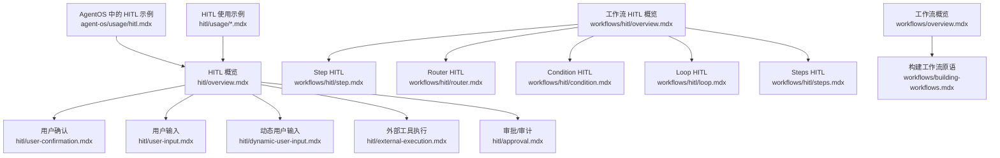
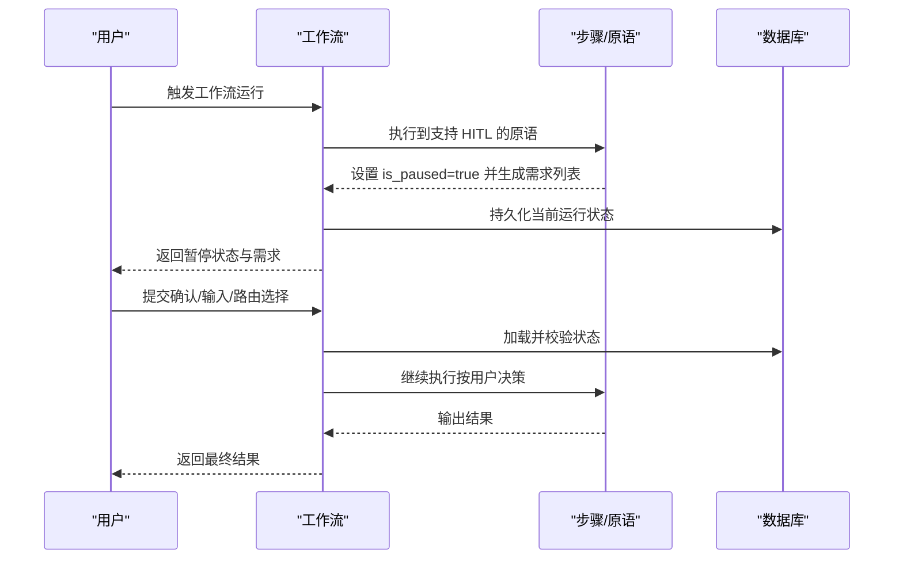
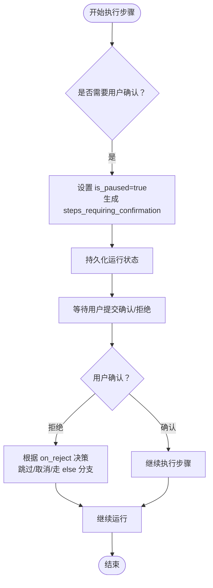
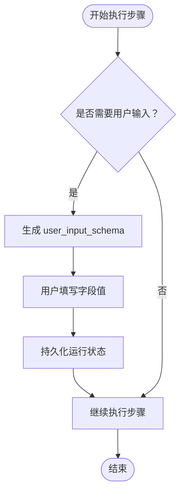
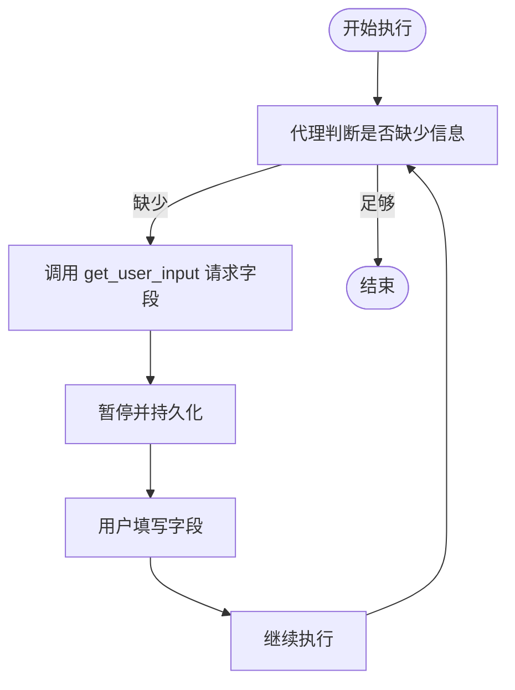
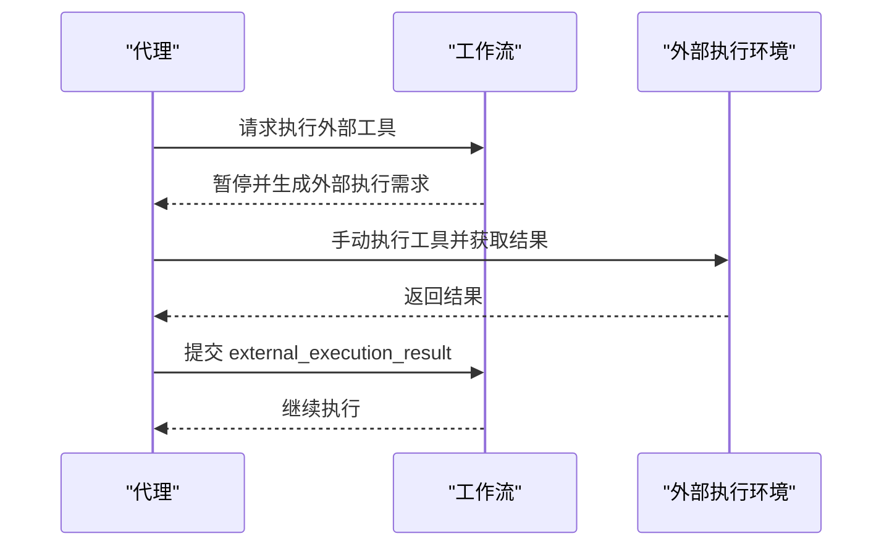
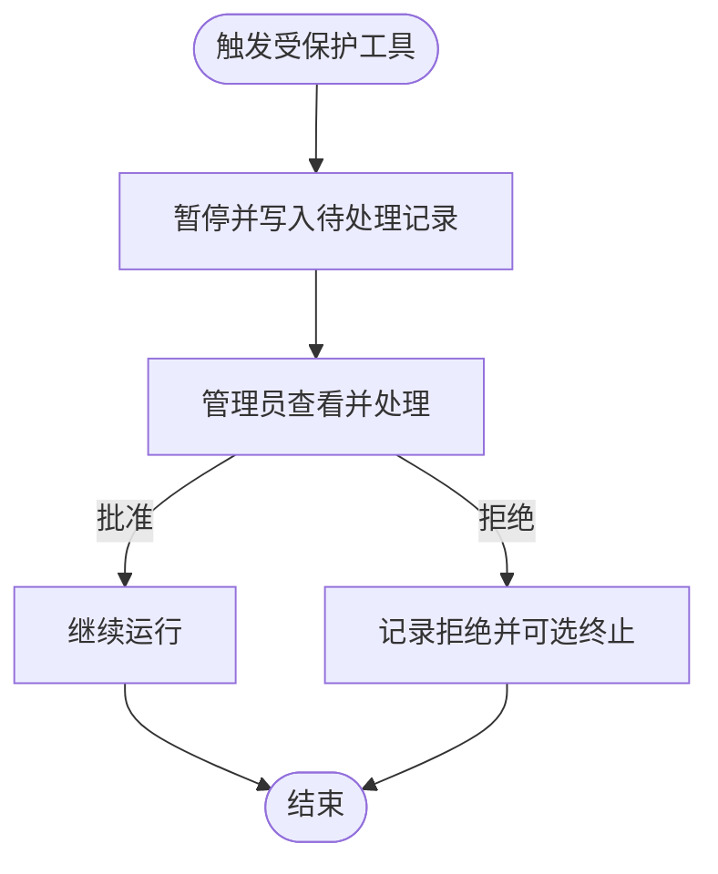
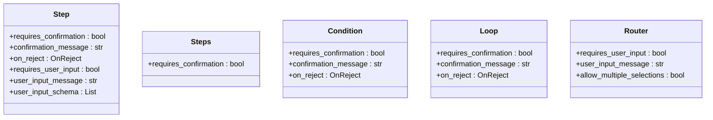
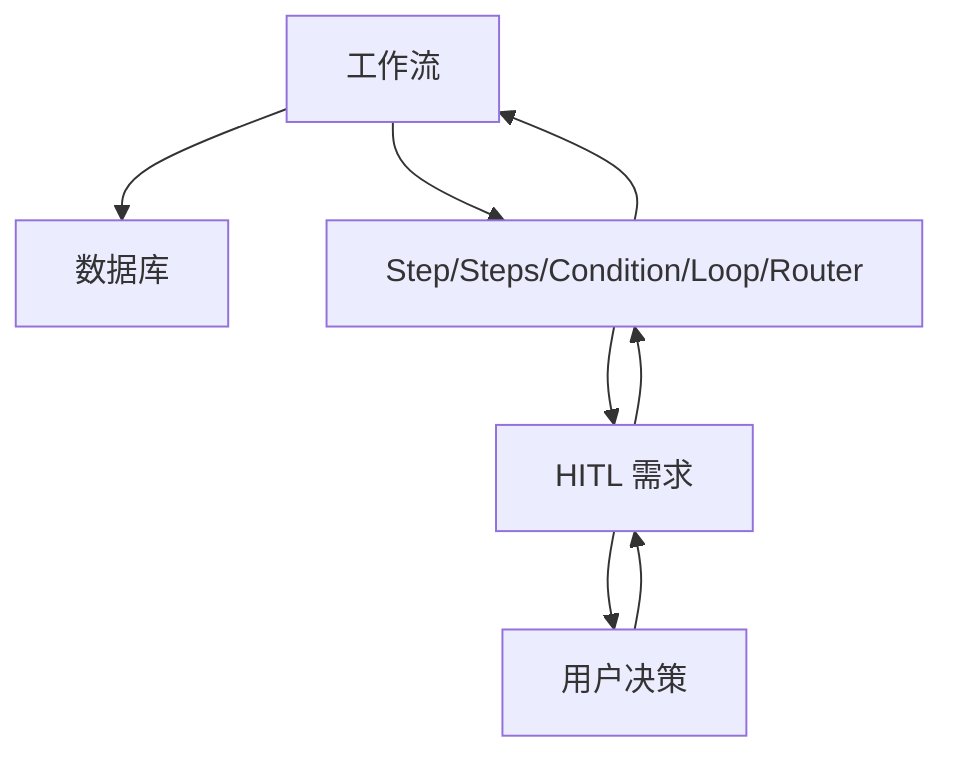

# HITL 概述

<cite>
**本文引用的文件**
- [hitl/overview.mdx](file://hitl/overview.mdx)
- [hitl/user-confirmation.mdx](file://hitl/user-confirmation.mdx)
- [hitl/user-input.mdx](file://hitl/user-input.mdx)
- [hitl/dynamic-user-input.mdx](file://hitl/dynamic-user-input.mdx)
- [hitl/external-execution.mdx](file://hitl/external-execution.mdx)
- [hitl/approval.mdx](file://hitl/approval.mdx)
- [workflows/hitl/overview.mdx](file://workflows/hitl/overview.mdx)
- [workflows/hitl/step.mdx](file://workflows/hitl/step.mdx)
- [workflows/hitl/router.mdx](file://workflows/hitl/router.mdx)
- [workflows/hitl/condition.mdx](file://workflows/hitl/condition.mdx)
- [workflows/hitl/loop.mdx](file://workflows/hitl/loop.mdx)
- [workflows/hitl/steps.mdx](file://workflows/hitl/steps.mdx)
- [workflows/overview.mdx](file://workflows/overview.mdx)
- [workflows/building-workflows.mdx](file://workflows/building-workflows.mdx)
- [agent-os/usage/hitl.mdx](file://agent-os/usage/hitl.mdx)
- [hitl/usage/confirmation-required.mdx](file://hitl/usage/confirmation-required.mdx)
- [hitl/usage/user-input-required.mdx](file://hitl/usage/user-input-required.mdx)
- [hitl/usage/agentic-user-input.mdx](file://hitl/usage/agentic-user-input.mdx)
</cite>

## 目录
1. [引言](#引言)
2. [项目结构](#项目结构)
3. [核心组件](#核心组件)
4. [架构总览](#架构总览)
5. [详细组件分析](#详细组件分析)
6. [依赖关系分析](#依赖关系分析)
7. [性能考量](#性能考量)
8. [故障排查指南](#故障排查指南)
9. [结论](#结论)
10. [附录](#附录)

## 引言
本文件面向工作流的人机交互（Human-in-the-Loop，简称 HITL）场景，系统性阐述如何在工作流执行过程中暂停并等待用户确认、输入或路由选择，从而实现对关键步骤的可控与可审计。内容覆盖 HITL 的三大类型（确认、用户输入、路由选择）、支持的工作流原语（Step、Steps、Condition、Loop、Router）、运行输出属性（如 is_paused、steps_requiring_confirmation 等）、状态持久化与数据库要求，并提供完整实现示例与最佳实践。

## 项目结构
围绕 HITL 的文档分布在多个模块：
- 基础 HITL 概览与用例：hitl/overview.mdx
- 三种 HITL 类型的详细说明与示例：user-confirmation.mdx、user-input.mdx、dynamic-user-input.mdx、external-execution.mdx、approval.mdx
- 工作流中的 HITL：workflows/hitl/overview.mdx 及其子主题 step.mdx、router.mdx、condition.mdx、loop.mdx、steps.mdx
- 工作流基础与原语：workflows/overview.mdx、workflows/building-workflows.mdx
- 示例与集成：agent-os/usage/hitl.mdx，以及 hitl/usage 下的多种用法示例

图表来源
- [hitl/overview.mdx:1-174](file://hitl/overview.mdx#L1-L174)
- [workflows/hitl/overview.mdx:1-289](file://workflows/hitl/overview.mdx#L1-L289)
- [workflows/overview.mdx:1-102](file://workflows/overview.mdx#L1-L102)
- [workflows/building-workflows.mdx:1-59](file://workflows/building-workflows.mdx#L1-L59)
- [agent-os/usage/hitl.mdx:1-154](file://agent-os/usage/hitl.mdx#L1-L154)

章节来源
- [hitl/overview.mdx:1-174](file://hitl/overview.mdx#L1-L174)
- [workflows/hitl/overview.mdx:1-289](file://workflows/hitl/overview.mdx#L1-L289)
- [workflows/overview.mdx:1-102](file://workflows/overview.mdx#L1-L102)
- [workflows/building-workflows.mdx:1-59](file://workflows/building-workflows.mdx#L1-L59)
- [agent-os/usage/hitl.mdx:1-154](file://agent-os/usage/hitl.mdx#L1-L154)

## 核心组件
- HITL 类型
  - 用户确认：在工具调用前要求显式确认，适合敏感操作与高风险 API 调用。
  - 用户输入：在步骤执行前收集参数，适合需要用户补充信息的场景。
  - 路由选择：通过 Router 让用户选择下一步路径，适合分支逻辑的人工决策。
  - 外部工具执行：由外部环境执行工具，适合安全隔离与自定义控制。
  - 审批/审计：阻塞式或非阻塞式管理员审批，支持持久化记录与审计追踪。
- 支持的原语
  - Step：支持“确认”和“用户输入”，适合单步人工干预。
  - Steps：支持“确认”，适合整组步骤的批量确认。
  - Condition：支持“确认”，用于分支决策的人工把关。
  - Loop：支持“确认”，用于迭代流程的启动确认。
  - Router：支持“确认”和“路由选择”，用于多路径的人工选择。
- 运行输出属性（工作流）
  - is_paused：是否处于暂停状态
  - steps_requiring_confirmation：需要确认的步骤
  - steps_requiring_user_input：需要用户输入的步骤
  - steps_requiring_route：需要路由选择的 Router
  - steps_with_errors：因错误而暂停的步骤
- 状态持久化与数据库
  - 工作流级 HITL 需要数据库持久化以保存暂停状态与后续恢复。
  - 支持 SQLite（开发）与 PostgreSQL（生产）等数据库配置。

章节来源
- [workflows/hitl/overview.mdx:63-95](file://workflows/hitl/overview.mdx#L63-L95)
- [workflows/hitl/overview.mdx:72-83](file://workflows/hitl/overview.mdx#L72-L83)
- [workflows/hitl/overview.mdx:48-62](file://workflows/hitl/overview.mdx#L48-L62)

## 架构总览
下图展示了工作流中 HITL 的整体交互：工作流在特定原语处暂停，等待用户决策；用户完成决策后，工作流从持久化状态恢复继续执行。

图表来源
- [workflows/hitl/overview.mdx:19-46](file://workflows/hitl/overview.mdx#L19-L46)
- [workflows/hitl/overview.mdx:48-62](file://workflows/hitl/overview.mdx#L48-L62)

## 详细组件分析

### 用户确认（User Confirmation）
- 适用场景：敏感操作、高风险 API 调用、数据修改等。
- 行为特征：在工具调用前暂停，设置 is_paused，等待用户批准后继续。
- 关键点：
  - 工具级装饰器 requires_confirmation=True 与工作流级 Step.requires_confirmation 不同，后者会持久化并恢复。
  - 支持异步与流式模式。
  - 可拒绝并提供反馈，便于后续重试或替代方案。
- 实现要点（工作流）
  - 在 Step 上启用 requires_confirmation，并设置 confirmation_message 与 on_reject。
  - 处理 run_output.steps_requiring_confirmation，逐项确认或拒绝。
- 示例参考
  - [用户确认示例:1-127](file://hitl/usage/confirmation-required.mdx#L1-L127)
  - [工作流确认示例（概述）:96-119](file://workflows/hitl/overview.mdx#L96-L119)

图表来源
- [hitl/user-confirmation.mdx:15-25](file://hitl/user-confirmation.mdx#L15-L25)
- [workflows/hitl/condition.mdx:65-72](file://workflows/hitl/condition.mdx#L65-L72)
- [workflows/hitl/overview.mdx:96-119](file://workflows/hitl/overview.mdx#L96-L119)

章节来源
- [hitl/user-confirmation.mdx:1-258](file://hitl/user-confirmation.mdx#L1-L258)
- [workflows/hitl/overview.mdx:96-119](file://workflows/hitl/overview.mdx#L96-L119)
- [workflows/hitl/condition.mdx:65-107](file://workflows/hitl/condition.mdx#L65-L107)

### 用户输入（User Input）
- 适用场景：步骤执行前需要用户提供缺失的关键参数。
- 行为特征：暂停并填充 user_input_schema，用户填写后继续。
- 关键点：
  - 支持指定 user_input_fields 或全量收集。
  - 支持异步与流式。
  - 支持预填值，避免重复输入。
- 实现要点（工作流）
  - 在 Step 上启用 requires_user_input，并提供 user_input_message 与 user_input_schema。
  - 处理 run_output.steps_requiring_user_input，逐项收集字段值。
- 示例参考
  - [用户输入示例:1-112](file://hitl/usage/user-input-required.mdx#L1-L112)
  - [工作流用户输入示例（概述）:121-148](file://workflows/hitl/overview.mdx#L121-L148)

图表来源
- [hitl/user-input.mdx:15-26](file://hitl/user-input.mdx#L15-L26)
- [workflows/hitl/overview.mdx:121-148](file://workflows/hitl/overview.mdx#L121-L148)

章节来源
- [hitl/user-input.mdx:1-260](file://hitl/user-input.mdx#L1-L260)
- [workflows/hitl/overview.mdx:121-148](file://workflows/hitl/overview.mdx#L121-L148)

### 动态用户输入（Agentic User Input）
- 适用场景：代理在执行过程中动态决定所需信息，而非预先定义。
- 行为特征：代理主动请求用户输入，可能多次往返，直到满足条件。
- 关键点：
  - 使用 UserControlFlowTools 的 get_user_input 工具。
  - 需要 while 循环处理多次暂停。
  - 支持异步与流式。
- 示例参考
  - [动态用户输入示例:1-173](file://hitl/usage/agentic-user-input.mdx#L1-L173)
  - [动态用户输入文档:1-322](file://hitl/dynamic-user-input.mdx#L1-L322)

图表来源
- [hitl/dynamic-user-input.mdx:17-28](file://hitl/dynamic-user-input.mdx#L17-L28)
- [hitl/usage/agentic-user-input.mdx:72-104](file://hitl/usage/agentic-user-input.mdx#L72-L104)

章节来源
- [hitl/dynamic-user-input.mdx:1-322](file://hitl/dynamic-user-input.mdx#L1-L322)
- [hitl/usage/agentic-user-input.mdx:1-173](file://hitl/usage/agentic-user-input.mdx#L1-L173)

### 外部工具执行（External Tool Execution）
- 适用场景：需要在受控环境中执行敏感或复杂操作，如数据库查询、系统命令等。
- 行为特征：暂停并将工具调用交给外部执行，完成后回传结果。
- 关键点：
  - 必须设置 external_execution=True。
  - 需要为每个外部执行需求设置 external_execution_result。
  - 支持异步与流式。
- 示例参考
  - [外部执行文档:1-306](file://hitl/external-execution.mdx#L1-L306)

图表来源
- [hitl/external-execution.mdx:16-27](file://hitl/external-execution.mdx#L16-L27)

章节来源
- [hitl/external-execution.mdx:1-306](file://hitl/external-execution.mdx#L1-L306)

### 审批/审计（Approval/Audit）
- 适用场景：需要管理员审查与批准的高风险操作，或仅需审计日志。
- 行为特征：
  - 阻塞式：暂停并写入待处理记录，管理员批准后继续。
  - 非阻塞式（审计）：立即继续，仅记录审计日志。
- 关键点：
  - 结合 @approval 与 requires_confirmation 或 requires_user_input/external_execution。
  - 数据库提供者用于更新审批状态与解析记录。
- 示例参考
  - [审批文档:1-103](file://hitl/approval.mdx#L1-L103)

图表来源
- [hitl/approval.mdx:50-72](file://hitl/approval.mdx#L50-L72)

章节来源
- [hitl/approval.mdx:1-103](file://hitl/approval.mdx#L1-L103)

### 工作流原语与 HITL 支持矩阵
- Step：支持“确认”和“用户输入”
- Steps：支持“确认”
- Condition：支持“确认”，并有 on_reject 行为选项
- Loop：支持“确认”，仅在首次迭代前确认
- Router：支持“确认”和“路由选择”

图表来源
- [workflows/hitl/overview.mdx:72-83](file://workflows/hitl/overview.mdx#L72-L83)
- [workflows/hitl/step.mdx](file://workflows/hitl/step.mdx)
- [workflows/hitl/steps.mdx](file://workflows/hitl/steps.mdx)
- [workflows/hitl/condition.mdx:65-72](file://workflows/hitl/condition.mdx#L65-L72)
- [workflows/hitl/loop.mdx:61-71](file://workflows/hitl/loop.mdx#L61-L71)
- [workflows/hitl/router.mdx](file://workflows/hitl/router.mdx)

章节来源
- [workflows/hitl/overview.mdx:72-83](file://workflows/hitl/overview.mdx#L72-L83)

## 依赖关系分析
- 工作流 HITL 依赖数据库进行状态持久化，确保暂停与恢复的一致性。
- 工具级 HITL（如 @tool(requires_confirmation=True)）不直接传播到工作流，应改用工作流级 Step.requires_confirmation。
- Router 的路由选择与用户输入结合，形成灵活的分支控制。

图表来源
- [workflows/hitl/overview.mdx:48-62](file://workflows/hitl/overview.mdx#L48-L62)
- [workflows/hitl/overview.mdx:15-17](file://workflows/hitl/overview.mdx#L15-L17)

章节来源
- [workflows/hitl/overview.mdx:48-62](file://workflows/hitl/overview.mdx#L48-L62)
- [workflows/hitl/overview.mdx:15-17](file://workflows/hitl/overview.mdx#L15-L17)

## 性能考量
- 流式与异步：HITL 支持流式与异步模式，可在暂停期间持续输出事件，减少等待时间。
- 数据库选择：开发使用 SQLite，生产使用 PostgreSQL，注意连接池与索引优化。
- 复杂度与开销：动态用户输入可能多次暂停，建议在 UI 层合并多次交互，降低往返次数。
- 错误处理：在错误暂停场景中，尽量提供“重试/跳过”的便捷操作，减少人工干预成本。

## 故障排查指南
- 工具级 vs 工作流级 HITL
  - 若使用 @tool(requires_confirmation=True)，工作流不会暂停；请改用 Step.requires_confirmation。
- 外部执行未设置结果
  - 外部执行需求必须设置 external_execution_result，否则继续运行时会抛出异常。
- 审批记录未更新
  - 确保使用数据库提供者的更新接口，设置期望状态与解析数据。
- 流式处理
  - 在流式场景中，检查 StepPausedEvent 并正确加载会话与 run_output。

章节来源
- [hitl/external-execution.mdx:107-112](file://hitl/external-execution.mdx#L107-L112)
- [hitl/approval.mdx:57-68](file://hitl/approval.mdx#L57-L68)
- [workflows/hitl/overview.mdx:218-234](file://workflows/hitl/overview.mdx#L218-L234)

## 结论
HITL 是保障工作流在关键节点具备可控性与可审计性的关键技术。通过在 Step、Condition、Loop、Router 等原语上启用“确认”“用户输入”“路由选择”，并配合数据库持久化，可以在复杂业务流程中实现人机协同的最佳实践。建议优先采用工作流级 HITL，并结合审批/审计模式，确保合规与安全。

## 附录
- 快速开始示例
  - [AgentOS 中的 HITL 示例:16-77](file://agent-os/usage/hitl.mdx#L16-L77)
  - [用户确认示例:11-96](file://hitl/usage/confirmation-required.mdx#L11-L96)
  - [用户输入示例:11-77](file://hitl/usage/user-input-required.mdx#L11-L77)
  - [动态用户输入示例:11-104](file://hitl/usage/agentic-user-input.mdx#L11-L104)
- 参考文档
  - [工作流概览:1-102](file://workflows/overview.mdx#L1-L102)
  - [构建工作流原语:9-32](file://workflows/building-workflows.mdx#L9-L32)
  - [工作流 HITL 概览:1-289](file://workflows/hitl/overview.mdx#L1-L289)