# 人机交互 (HITL)

<cite>
**本文引用的文件**
- [hitl/overview.mdx](file://hitl/overview.mdx)
- [hitl/approval.mdx](file://hitl/approval.mdx)
- [hitl/user-confirmation.mdx](file://hitl/user-confirmation.mdx)
- [hitl/user-input.mdx](file://hitl/user-input.mdx)
- [hitl/external-execution.mdx](file://hitl/external-execution.mdx)
- [hitl/dynamic-user-input.mdx](file://hitl/dynamic-user-input.mdx)
- [hitl/usage/confirmation-required.mdx](file://hitl/usage/confirmation-required.mdx)
- [hitl/usage/user-input-required.mdx](file://hitl/usage/user-input-required.mdx)
- [hitl/usage/external-tool-execution.mdx](file://hitl/usage/external-tool-execution.mdx)
- [workflows/hitl/condition.mdx](file://workflows/hitl/condition.mdx)
- [workflows/hitl/error-handling.mdx](file://workflows/hitl/error-handling.mdx)
- [workflows/hitl/loop.mdx](file://workflows/hitl/loop.mdx)
- [workflows/hitl/router.mdx](file://workflows/hitl/router.mdx)
</cite>

## 目录
1. [简介](#简介)
2. [项目结构](#项目结构)
3. [核心组件](#核心组件)
4. [架构总览](#架构总览)
5. [详细组件分析](#详细组件分析)
6. [依赖关系分析](#依赖关系分析)
7. [性能考量](#性能考量)
8. [故障排查指南](#故障排查指南)
9. [结论](#结论)
10. [附录](#附录)

## 简介
本技术文档围绕“人机交互（HITL）”在工作流与智能体中的应用进行系统化说明，涵盖用户确认、用户输入收集、动态输入、外部工具执行以及审批与审计等关键能力。文档重点解释 HITL 的触发条件、执行时机、在条件判断、错误处理、循环控制与路由选择中的实现方式，并提供同步与异步两种确认模式、输入收集与处理机制、外部执行的配置与管理方法，以及用户体验设计与最佳实践。最后给出完整实现示例与集成指南。

## 项目结构
HITL 能力主要分布在以下模块：
- 智能体与团队层：用户确认、用户输入、动态输入、外部执行、审批与审计
- 工作流层：条件分支、错误处理、循环、路由中的 HITL 实现
- 示例与用法：覆盖同步、异步、流式输出等多场景

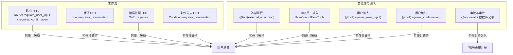

**图表来源**
- [hitl/user-confirmation.mdx](file://hitl/user-confirmation.mdx)
- [hitl/user-input.mdx](file://hitl/user-input.mdx)
- [hitl/dynamic-user-input.mdx](file://hitl/dynamic-user-input.mdx)
- [hitl/external-execution.mdx](file://hitl/external-execution.mdx)
- [hitl/approval.mdx](file://hitl/approval.mdx)
- [workflows/hitl/condition.mdx](file://workflows/hitl/condition.mdx)
- [workflows/hitl/error-handling.mdx](file://workflows/hitl/error-handling.mdx)
- [workflows/hitl/loop.mdx](file://workflows/hitl/loop.mdx)
- [workflows/hitl/router.mdx](file://workflows/hitl/router.mdx)

**章节来源**
- [hitl/overview.mdx](file://hitl/overview.mdx)

## 核心组件
- 用户确认（requires_confirmation）
  - 触发：工具调用前暂停，等待用户批准或拒绝
  - 执行：通过 requirement.confirm()/reject() 决定是否继续
  - 支持：同步、异步、流式
- 用户输入（requires_user_input）
  - 触发：工具执行前暂停，收集指定字段
  - 执行：填充 requirement.user_input_schema 中的字段值后继续
  - 支持：仅部分字段需要用户输入或全部字段由用户输入
- 动态用户输入（UserControlFlowTools）
  - 触发：智能体运行中按需请求用户输入，可多次交互
  - 执行：while 循环持续处理直到满意
  - 支持：同步、异步、流式
- 外部执行（external_execution）
  - 触发：工具调用前暂停，交由外部环境执行
  - 执行：设置 requirement.external_execution_result 后继续
  - 支持：同步、异步、流式
- 审批与审计（@approval）
  - 触发：受保护工具调用时自动暂停并写入数据库待审
  - 执行：管理员更新状态后继续；支持阻塞与非阻塞（审计）

**章节来源**
- [hitl/user-confirmation.mdx](file://hitl/user-confirmation.mdx)
- [hitl/user-input.mdx](file://hitl/user-input.mdx)
- [hitl/dynamic-user-input.mdx](file://hitl/dynamic-user-input.mdx)
- [hitl/external-execution.mdx](file://hitl/external-execution.mdx)
- [hitl/approval.mdx](file://hitl/approval.mdx)

## 架构总览
下图展示 HITL 在智能体与工作流中的整体交互路径：工具/步骤在特定条件下暂停，生成“需求（requirement）”，由用户或管理员/外部系统处理后继续执行。

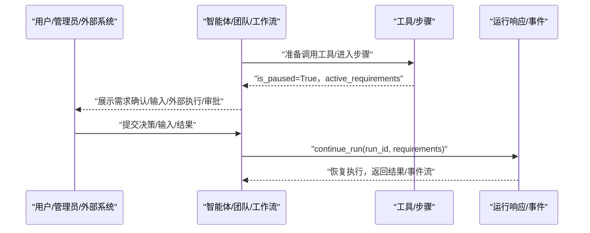

**图表来源**
- [hitl/overview.mdx](file://hitl/overview.mdx)
- [hitl/user-confirmation.mdx](file://hitl/user-confirmation.mdx)
- [hitl/user-input.mdx](file://hitl/user-input.mdx)
- [hitl/external-execution.mdx](file://hitl/external-execution.mdx)
- [hitl/approval.mdx](file://hitl/approval.mdx)
- [workflows/hitl/condition.mdx](file://workflows/hitl/condition.mdx)
- [workflows/hitl/error-handling.mdx](file://workflows/hitl/error-handling.mdx)
- [workflows/hitl/loop.mdx](file://workflows/hitl/loop.mdx)
- [workflows/hitl/router.mdx](file://workflows/hitl/router.mdx)

## 详细组件分析

### 用户确认（requires_confirmation）
- 触发条件
  - 工具标注 requires_confirmation=True
  - 工具调用前暂停，设置 is_paused 并生成 active_requirements
- 执行时机
  - 运行响应中遍历 active_requirements，识别 needs_confirmation
  - 用户确认后调用 requirement.confirm() 或 reject()
  - 调用 continue_run() 继续
- 异步与流式
  - 使用 arun()/acontinue_run() 实现异步确认
  - 流式场景中在 paused 事件处处理确认并继续流
- 最佳实践
  - 仅对敏感操作启用确认
  - 提供清晰的工具名与参数摘要
  - 对拒绝提供反馈（confirmation_note），便于后续重试策略

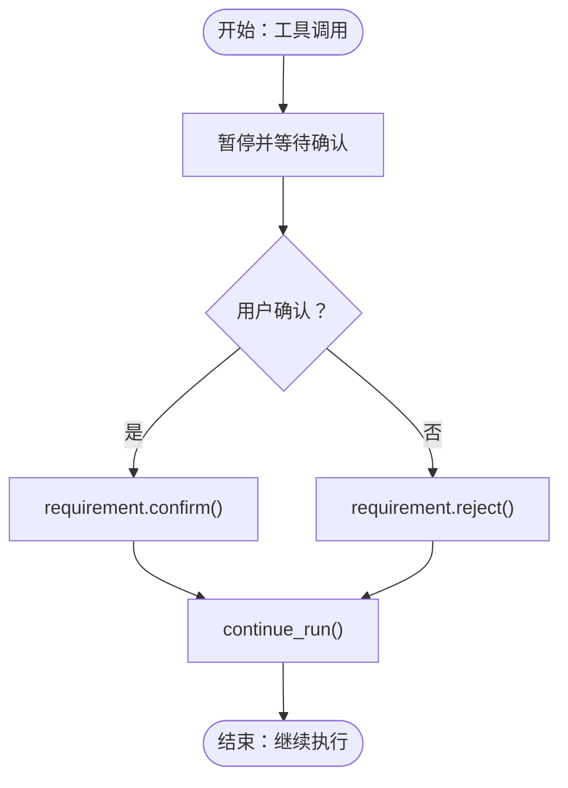

**图表来源**
- [hitl/user-confirmation.mdx](file://hitl/user-confirmation.mdx)
- [hitl/usage/confirmation-required.mdx](file://hitl/usage/confirmation-required.mdx)

**章节来源**
- [hitl/user-confirmation.mdx](file://hitl/user-confirmation.mdx)
- [hitl/usage/confirmation-required.mdx](file://hitl/usage/confirmation-required.mdx)

### 用户输入（requires_user_input）
- 触发条件
  - 工具标注 requires_user_input=True
  - 工具调用前暂停，生成 user_input_schema
- 执行时机
  - 遍历 active_requirements，识别 needs_user_input
  - 填充 schema 中 value 字段（可选：仅部分字段）
  - 调用 continue_run() 继续
- 字段策略
  - user_input_fields 指定必填字段，其余由上下文自动填充
  - 未指定则要求用户提供全部字段
- 异步与流式
  - 支持 arun()/acontinue_run() 与流式事件

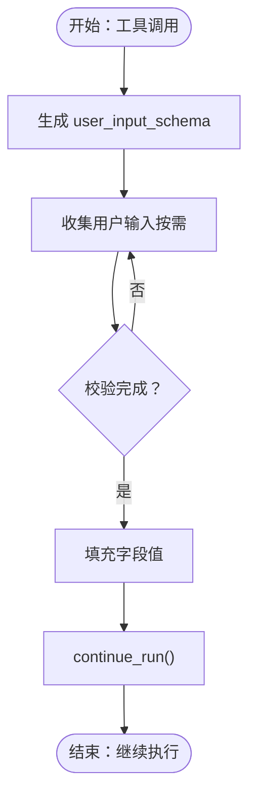

**图表来源**
- [hitl/user-input.mdx](file://hitl/user-input.mdx)
- [hitl/usage/user-input-required.mdx](file://hitl/usage/user-input-required.mdx)

**章节来源**
- [hitl/user-input.mdx](file://hitl/user-input.mdx)
- [hitl/usage/user-input-required.mdx](file://hitl/usage/user-input-required.mdx)

### 动态用户输入（UserControlFlowTools）
- 触发条件
  - 智能体在运行中主动调用 get_user_input 请求信息
  - 可多次交互，直至满足所需字段
- 执行时机
  - while run_response.is_paused: 循环处理每个 paused 事件
  - 填充 requirement.user_input_schema 后 continue_run()
- 异步与流式
  - 支持异步与流式事件处理

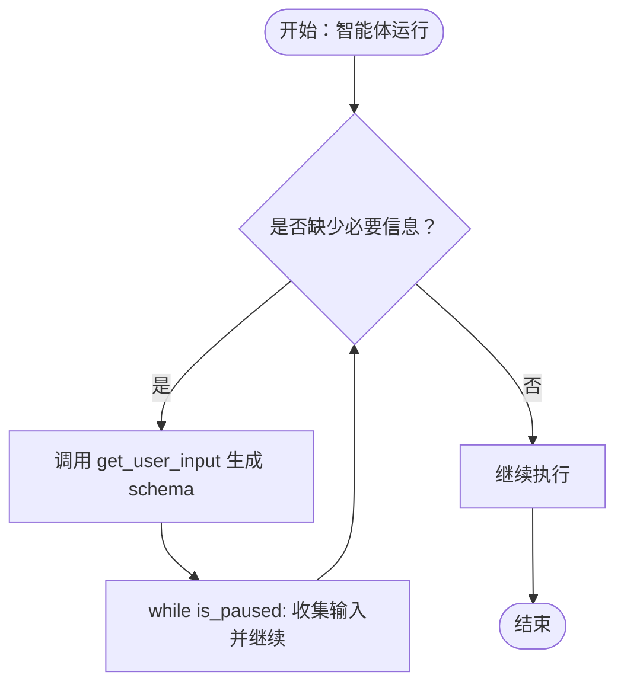

**图表来源**
- [hitl/dynamic-user-input.mdx](file://hitl/dynamic-user-input.mdx)

**章节来源**
- [hitl/dynamic-user-input.mdx](file://hitl/dynamic-user-input.mdx)

### 外部执行（external_execution）
- 触发条件
  - 工具标注 external_execution=True
  - 工具调用前暂停，生成 tools_awaiting_external_execution
- 执行时机
  - 遍历 active_requirements，识别 is_external_tool_execution
  - 外部执行函数/进程，设置 requirement.external_execution_result
  - 调用 continue_run() 继续
- 工具包混合
  - Toolkit 中可指定 external_execution_required_tools，仅部分工具外部执行
- 异步与流式
  - 支持异步与流式事件

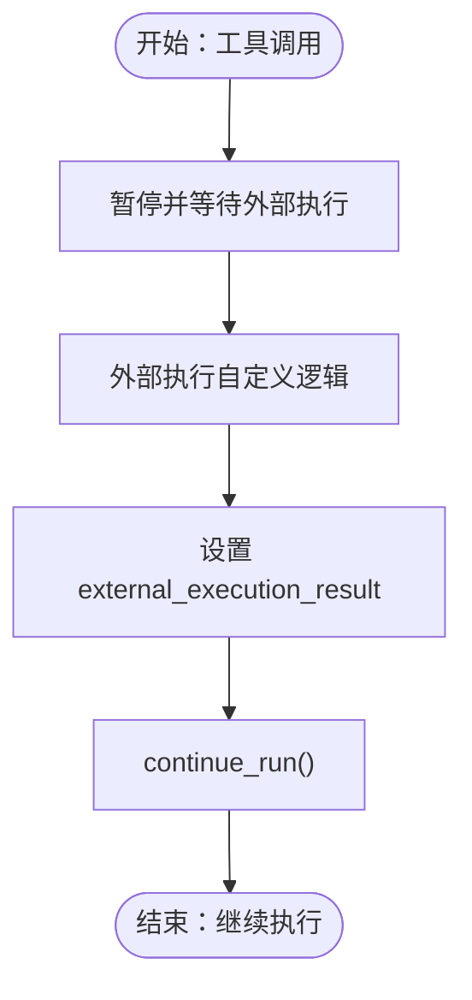

**图表来源**
- [hitl/external-execution.mdx](file://hitl/external-execution.mdx)
- [hitl/usage/external-tool-execution.mdx](file://hitl/usage/external-tool-execution.mdx)

**章节来源**
- [hitl/external-execution.mdx](file://hitl/external-execution.mdx)
- [hitl/usage/external-tool-execution.mdx](file://hitl/usage/external-tool-execution.mdx)

### 审批与审计（@approval）
- 触发条件
  - 工具标注 @approval（默认阻塞）或 @approval(type="audit")（非阻塞）
  - 工具调用时自动暂停并写入数据库（如 SQLite）
- 执行时机
  - 管理员查询待审列表，更新记录状态（expected_status 防竞态）
  - 调用 continue_run(run_id, requirements) 恢复
- 类型对比
  - 阻塞：暂停并等待审批
  - 审计：立即继续并记录审计日志

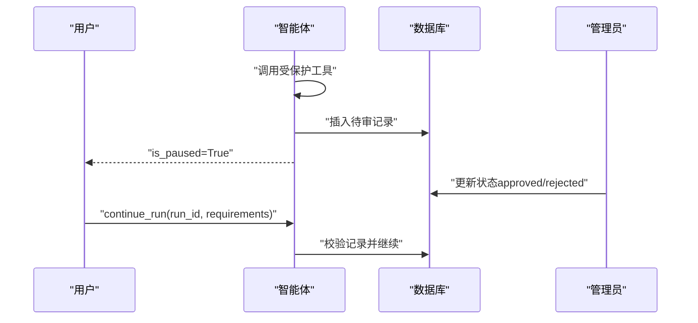

**图表来源**
- [hitl/approval.mdx](file://hitl/approval.mdx)

**章节来源**
- [hitl/approval.mdx](file://hitl/approval.mdx)

### 条件判断中的 HITL（Condition）
- 触发条件
  - Condition(steps, else_steps, requires_confirmation=True)
- 执行时机
  - is_paused 时，根据用户确认决定执行 if 分支或 else 分支
  - on_reject 支持 else_branch/skip/cancel
- 与评估器的关系
  - requires_confirmation=True 时忽略 evaluator，以用户决策为准
- 流式支持
  - 通过 StepPausedEvent 识别暂停点并处理

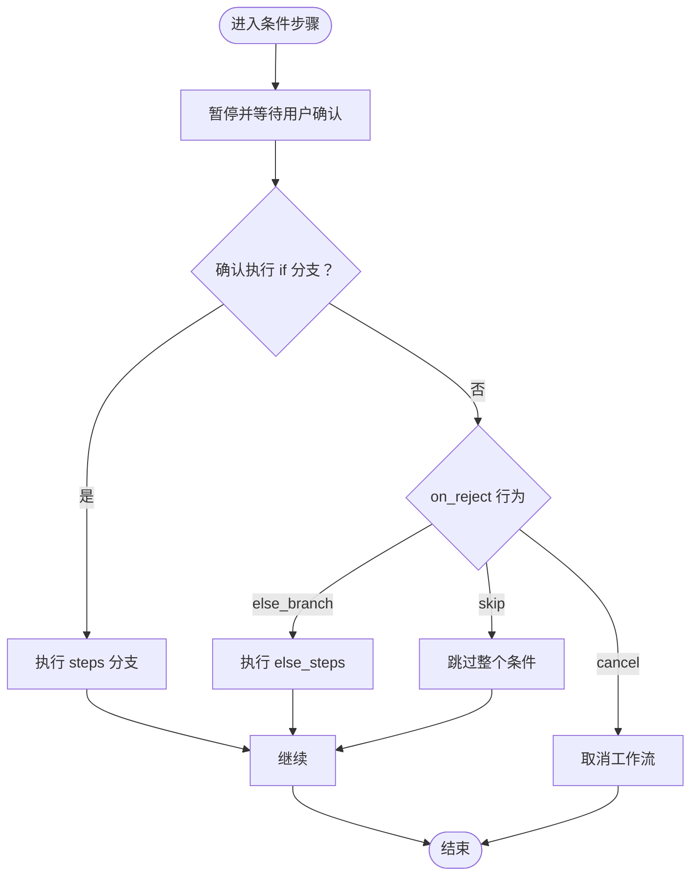

**图表来源**
- [workflows/hitl/condition.mdx](file://workflows/hitl/condition.mdx)

**章节来源**
- [workflows/hitl/condition.mdx](file://workflows/hitl/condition.mdx)

### 错误处理中的 HITL（OnError.pause）
- 触发条件
  - 步骤 on_error=OnError.pause，发生异常时暂停
- 执行时机
  - is_paused 时，遍历 steps_with_errors
  - 用户选择 retry 或 skip，继续
- 与确认结合
  - 可同时启用 requires_confirmation，先确认再错误处理
- 流式支持
  - 通过 StepPausedEvent 识别并处理

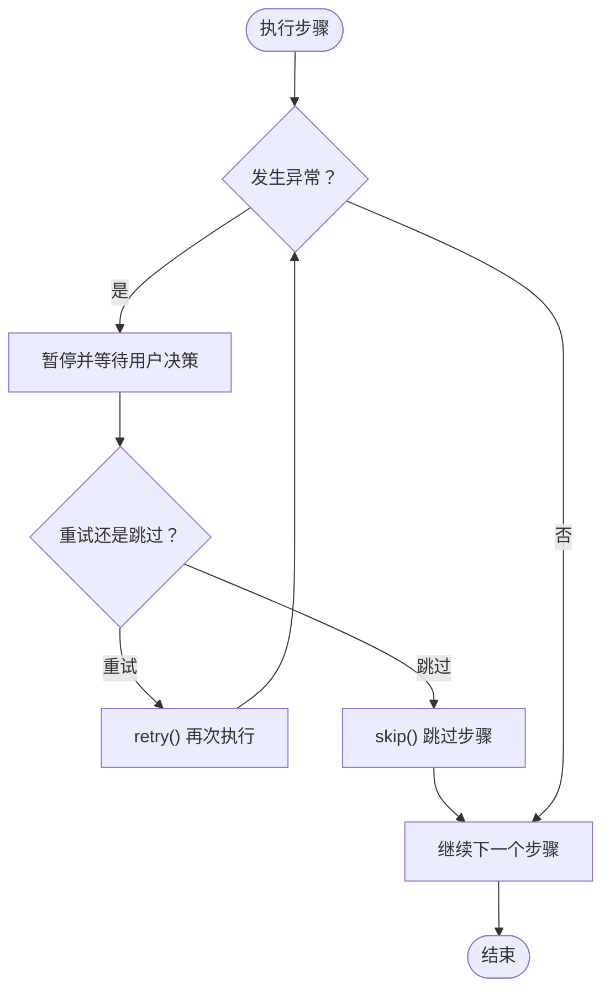

**图表来源**
- [workflows/hitl/error-handling.mdx](file://workflows/hitl/error-handling.mdx)

**章节来源**
- [workflows/hitl/error-handling.mdx](file://workflows/hitl/error-handling.mdx)

### 循环中的 HITL（Loop）
- 触发条件
  - Loop(max_iterations, requires_confirmation=True)
- 执行时机
  - 首次迭代前暂停，用户确认后执行
  - on_reject 默认 skip，也可 cancel
- 与 should_continue 结合
  - 首次确认在 should_continue 之前
- 流式支持
  - 通过 StepPausedEvent 识别并处理

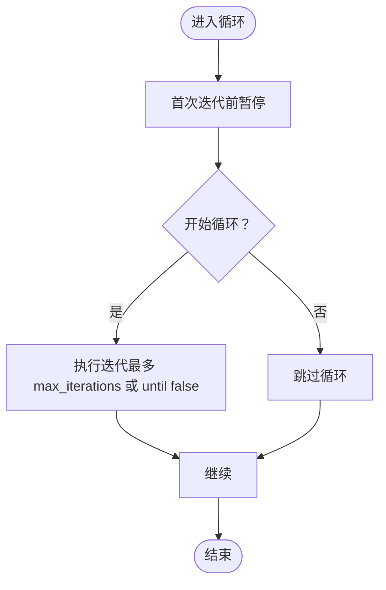

**图表来源**
- [workflows/hitl/loop.mdx](file://workflows/hitl/loop.mdx)

**章节来源**
- [workflows/hitl/loop.mdx](file://workflows/hitl/loop.mdx)

### 路由中的 HITL（Router）
- 用户选择模式
  - requires_user_input=True，展示可用选项，用户选择单个或多选
- 确认模式
  - requires_confirmation=True，由 selector 函数自动选择路由，用户确认后执行
- 执行时机
  - is_paused 时，用户选择或确认后继续
- 流式支持
  - 通过 StepPausedEvent 识别并处理

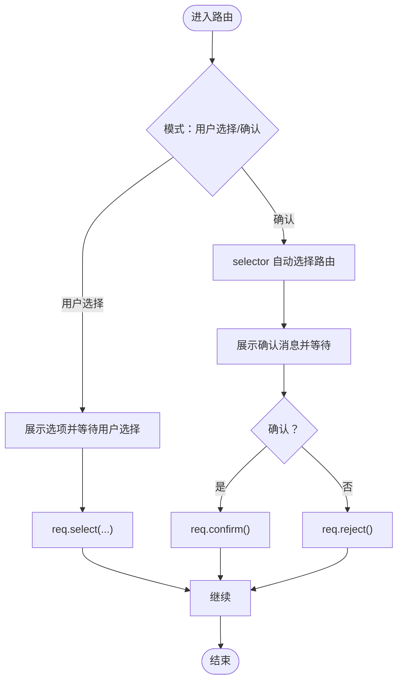

**图表来源**
- [workflows/hitl/router.mdx](file://workflows/hitl/router.mdx)

**章节来源**
- [workflows/hitl/router.mdx](file://workflows/hitl/router.mdx)

## 依赖关系分析
- 工具装饰器与 HITL 模式互斥
  - 单个工具只能使用一种模式：requires_confirmation、requires_user_input、external_execution 三者互斥
- 工具包与外部执行
  - Toolkit 可指定 external_execution_required_tools，仅部分工具外部执行
- 工作流与智能体的 HITL 共享同一套 requirement/requirement 类型（确认、输入、外部执行、路由、错误）
- 审批与数据库
  - @approval 依赖数据库提供者持久化待审记录，支持并发安全（expected_status）

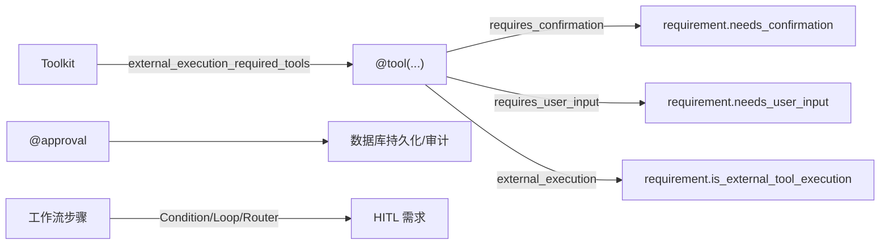

**图表来源**
- [hitl/user-confirmation.mdx](file://hitl/user-confirmation.mdx)
- [hitl/user-input.mdx](file://hitl/user-input.mdx)
- [hitl/external-execution.mdx](file://hitl/external-execution.mdx)
- [hitl/approval.mdx](file://hitl/approval.mdx)
- [workflows/hitl/condition.mdx](file://workflows/hitl/condition.mdx)
- [workflows/hitl/loop.mdx](file://workflows/hitl/loop.mdx)
- [workflows/hitl/router.mdx](file://workflows/hitl/router.mdx)

**章节来源**
- [hitl/user-confirmation.mdx](file://hitl/user-confirmation.mdx)
- [hitl/user-input.mdx](file://hitl/user-input.mdx)
- [hitl/external-execution.mdx](file://hitl/external-execution.mdx)
- [hitl/approval.mdx](file://hitl/approval.mdx)
- [workflows/hitl/condition.mdx](file://workflows/hitl/condition.mdx)
- [workflows/hitl/loop.mdx](file://workflows/hitl/loop.mdx)
- [workflows/hitl/router.mdx](file://workflows/hitl/router.mdx)

## 性能考量
- 流式输出
  - 在 paused 事件处及时处理需求，避免长时间阻塞
- 外部执行
  - 设置超时与重试策略，防止挂起
- 审批流程
  - 数据库写入与查询应使用索引字段（如 status/pending），减少锁竞争
- 动态输入
  - while 循环中尽量减少不必要的网络请求与 IO

## 故障排查指南
- 工具模式互斥
  - 若工具同时标注多种模式，SDK 将报错；请确保仅使用一种模式
- 外部执行未设置结果
  - 必须为所有 is_external_tool_execution 的 requirement 设置 external_execution_result，否则抛出 ValueError
- 审批记录缺失或仍为 pending
  - continue_run 会校验记录状态，若缺失或 pending 将抛出 RuntimeError
- 错误处理与确认叠加
  - 先走确认流程，再根据确认结果进入错误处理；确认失败不会触发错误暂停
- 流式场景
  - 使用 StepPausedEvent 识别暂停点；在继续流时保持 run_id 一致

**章节来源**
- [hitl/external-execution.mdx](file://hitl/external-execution.mdx)
- [hitl/approval.mdx](file://hitl/approval.mdx)
- [workflows/hitl/error-handling.mdx](file://workflows/hitl/error-handling.mdx)
- [workflows/hitl/condition.mdx](file://workflows/hitl/condition.mdx)

## 结论
HITL 通过“暂停+需求”的机制，在智能体与工作流的关键节点引入人类监督与干预，显著提升安全性与可控性。用户确认、用户输入、动态输入、外部执行与审批审计共同构成完整的 HITL 生态。建议在敏感操作、数据变更、外部服务调用等场景优先采用 HITL；在工作流中结合条件、错误处理、循环与路由的 HITL，形成稳健的控制流。配合异步与流式支持，可在复杂业务中实现高可用的人机协作体验。

## 附录
- 完整实现示例与集成指南
  - 用户确认：参考 [confirmation-required 示例](file://hitl/usage/confirmation-required.mdx)
  - 用户输入：参考 [user-input-required 示例](file://hitl/usage/user-input-required.mdx)
  - 外部执行：参考 [external-tool-execution 示例](file://hitl/usage/external-tool-execution.mdx)
  - 条件 HITL：参考 [condition HITL](file://workflows/hitl/condition.mdx)
  - 错误处理 HITL：参考 [error-handling HITL](file://workflows/hitl/error-handling.mdx)
  - 循环 HITL：参考 [loop HITL](file://workflows/hitl/loop.mdx)
  - 路由 HITL：参考 [router HITL](file://workflows/hitl/router.mdx)
- 开发者资源
  - 智能体与团队 HITL 概览：[HITL 概览](file://hitl/overview.mdx)
  - 审批与审计参考：[approval 文档](file://hitl/approval.mdx)
  - 工作流 HITL 参考：[workflows HITL 概览](file://workflows/hitl/overview.mdx)