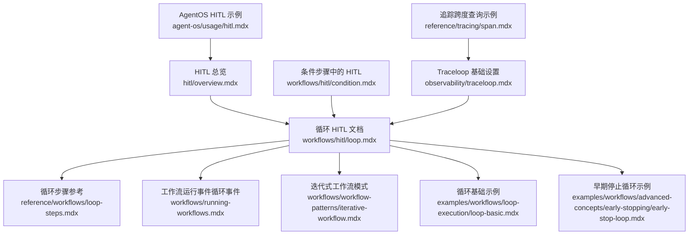
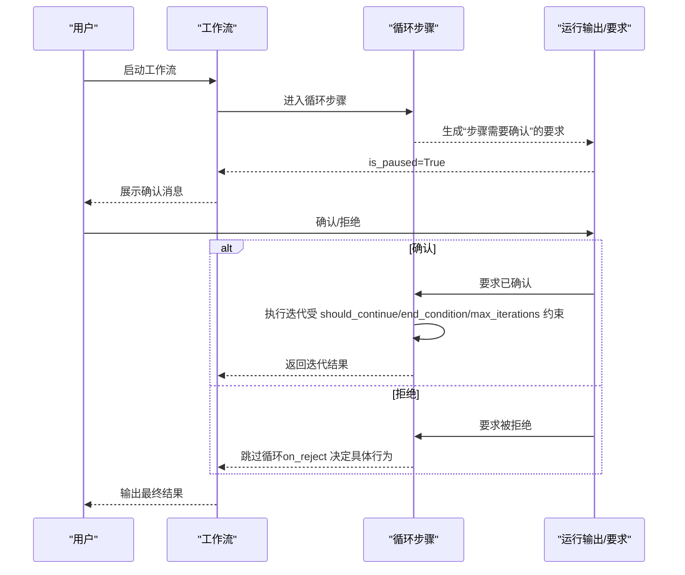
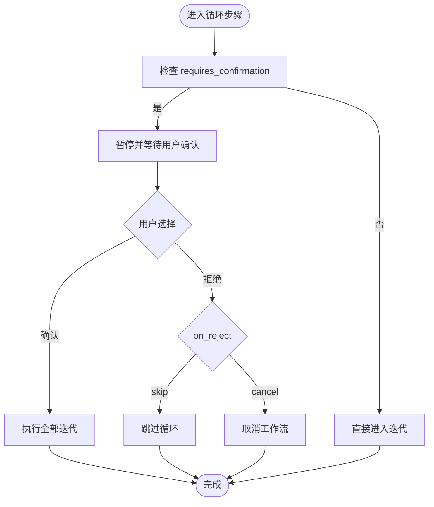
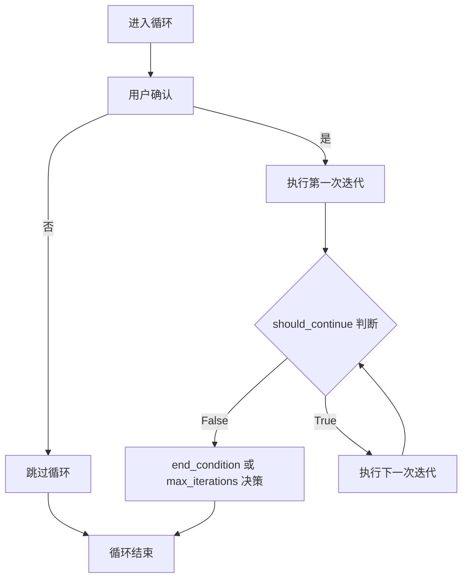
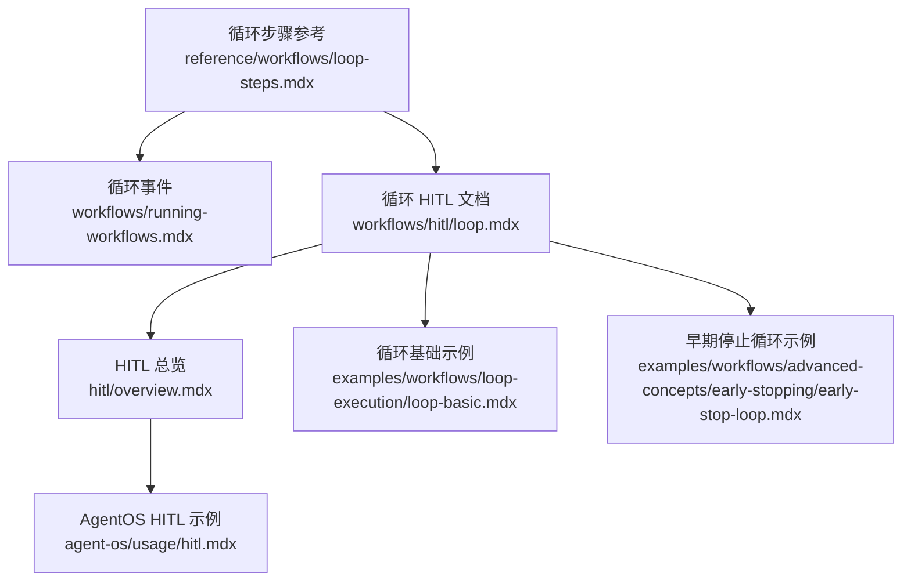

# 循环中的 HITL

<cite>
**本文引用的文件**
- [循环 HITL 概览](file://workflows/hitl/loop.mdx)
- [循环步骤参考](file://reference/workflows/loop-steps.mdx)
- [工作流运行事件：循环事件](file://workflows/running-workflows.mdx)
- [迭代式工作流模式](file://workflows/workflow-patterns/iterative-workflow.mdx)
- [循环基础示例](file://examples/workflows/loop-execution/loop-basic.mdx)
- [早期停止循环示例](file://examples/workflows/advanced-concepts/early-stopping/early-stop-loop.mdx)
- [人类在回路（HITL）总览](file://hitl/overview.mdx)
- [AgentOS 中的 HITL 示例](file://agent-os/usage/hitl.mdx)
- [条件步骤中的 HITL](file://workflows/hitl/condition.mdx)
- [Traceloop 基础设置](file://observability/traceloop.mdx)
- [追踪跨度查询示例](file://reference/tracing/span.mdx)
</cite>

## 目录
1. [简介](#简介)
2. [项目结构](#项目结构)
3. [核心组件](#核心组件)
4. [架构概览](#架构概览)
5. [详细组件分析](#详细组件分析)
6. [依赖关系分析](#依赖关系分析)
7. [性能考虑](#性能考虑)
8. [故障排查指南](#故障排查指南)
9. [结论](#结论)
10. [附录](#附录)

## 简介
本技术文档聚焦“循环中的 HITL（人类在回路）”能力，系统阐述如何在循环步骤中实现用户控制的迭代执行。内容涵盖：
- 循环前的用户确认机制：确认消息定制、用户选择（继续/取消）以及 on_reject 行为
- 循环执行过程中的用户交互模式与注意事项
- 完整实现示例：如何让用户决定是否开始或继续循环执行
- 循环中 HITL 与循环终止条件的关系
- 循环执行的监控与调试方法

## 项目结构
围绕循环与 HITL 的相关文档分布在以下位置：
- 工作流循环与 HITL 的使用说明与示例
- 循环步骤的参数与行为参考
- 工作流运行事件（含循环事件）
- 迭代式工作流模式与循环示例
- HITL 总览与 AgentOS 示例
- 条件步骤中的 HITL（便于对比理解）
- 可观测性与调试（追踪）

**图表来源**
- [循环 HITL 概览:1-126](file://workflows/hitl/loop.mdx#L1-L126)
- [循环步骤参考:1-16](file://reference/workflows/loop-steps.mdx#L1-L16)
- [工作流运行事件：循环事件:502-510](file://workflows/running-workflows.mdx#L502-L510)
- [迭代式工作流模式:43-57](file://workflows/workflow-patterns/iterative-workflow.mdx#L43-L57)
- [循环基础示例:1-144](file://examples/workflows/loop-execution/loop-basic.mdx#L1-L144)
- [早期停止循环示例:1-143](file://examples/workflows/advanced-concepts/early-stopping/early-stop-loop.mdx#L1-L143)
- [人类在回路（HITL）总览:1-174](file://hitl/overview.mdx#L1-L174)
- [AgentOS 中的 HITL 示例:1-154](file://agent-os/usage/hitl.mdx#L1-L154)
- [条件步骤中的 HITL:62-107](file://workflows/hitl/condition.mdx#L62-L107)
- [Traceloop 基础设置:145-186](file://observability/traceloop.mdx#L145-L186)
- [追踪跨度查询示例:86-122](file://reference/tracing/span.mdx#L86-L122)

**章节来源**
- [循环 HITL 概览:1-126](file://workflows/hitl/loop.mdx#L1-L126)
- [循环步骤参考:1-16](file://reference/workflows/loop-steps.mdx#L1-L16)
- [工作流运行事件：循环事件:502-510](file://workflows/running-workflows.mdx#L502-L510)
- [迭代式工作流模式:43-57](file://workflows/workflow-patterns/iterative-workflow.mdx#L43-L57)
- [循环基础示例:1-144](file://examples/workflows/loop-execution/loop-basic.mdx#L1-L144)
- [早期停止循环示例:1-143](file://examples/workflows/advanced-concepts/early-stopping/early-stop-loop.mdx#L1-L143)
- [人类在回路（HITL）总览:1-174](file://hitl/overview.mdx#L1-L174)
- [AgentOS 中的 HITL 示例:1-154](file://agent-os/usage/hitl.mdx#L1-L154)
- [条件步骤中的 HITL:62-107](file://workflows/hitl/condition.mdx#L62-L107)
- [Traceloop 基础设置:145-186](file://observability/traceloop.mdx#L145-L186)
- [追踪跨度查询示例:86-122](file://reference/tracing/span.mdx#L86-L122)

## 核心组件
- 循环步骤（Loop Step）
  - 支持在首次迭代前暂停以请求用户确认
  - 参数包括：requires_confirmation、confirmation_message、on_reject
  - 行为：确认后执行全部迭代；拒绝则跳过整个循环
- 用户确认要求（Requirement）
  - 在循环开始前生成“步骤需要确认”的要求
  - 通过 requirement.confirm()/reject() 解决
- 终止条件与迭代控制
  - should_continue 控制单次迭代后的继续判断
  - end_condition 控制整体循环结束
  - max_iterations 提供最大迭代次数保护
- 流式执行支持
  - 支持在流式事件中处理 StepPausedEvent 并继续执行

**章节来源**
- [循环 HITL 概览:10-94](file://workflows/hitl/loop.mdx#L10-L94)
- [循环步骤参考:6-16](file://reference/workflows/loop-steps.mdx#L6-L16)
- [工作流运行事件：循环事件:502-510](file://workflows/running-workflows.mdx#L502-L510)
- [人类在回路（HITL）总览:25-89](file://hitl/overview.mdx#L25-L89)

## 架构概览
下图展示了循环中 HITL 的关键交互流程：工作流在 Loop 步骤启动前暂停，等待用户确认；用户确认后进入循环迭代；每次迭代由 should_continue/end_condition/max_iterations 共同决定是否继续。

**图表来源**
- [循环 HITL 概览:10-94](file://workflows/hitl/loop.mdx#L10-L94)
- [循环步骤参考:6-16](file://reference/workflows/loop-steps.mdx#L6-L16)
- [人类在回路（HITL）总览:25-89](file://hitl/overview.mdx#L25-L89)

## 详细组件分析

### 循环前的用户确认机制
- 触发时机：requires_confirmation=True 时，在第一次迭代前暂停
- 确认消息：confirmation_message 可自定义
- 用户选择：
  - 确认：执行所有迭代（受 max_iterations 或 should_continue 约束）
  - 拒绝：根据 on_reject 决定行为（默认 skip，也可 cancel）
- on_reject 行为对照：
  - skip：跳过循环
  - cancel：取消工作流

**图表来源**
- [循环 HITL 概览:10-94](file://workflows/hitl/loop.mdx#L10-L94)
- [循环步骤参考:6-16](file://reference/workflows/loop-steps.mdx#L6-L16)

**章节来源**
- [循环 HITL 概览:10-94](file://workflows/hitl/loop.mdx#L10-L94)
- [循环步骤参考:6-16](file://reference/workflows/loop-steps.mdx#L6-L16)

### 循环执行过程中的用户交互模式
- 单次确认：仅在循环开始前进行一次确认，不针对每次迭代单独暂停
- 迭代内无确认：确认只影响是否进入循环，不影响循环内的具体步骤
- 流式场景：可通过 StepPausedEvent 捕获暂停点，逐个解决 active_requirements 后继续

**章节来源**
- [循环 HITL 概览:71-76](file://workflows/hitl/loop.mdx#L71-L76)
- [工作流运行事件：循环事件:502-510](file://workflows/running-workflows.mdx#L502-L510)
- [人类在回路（HITL）总览:91-106](file://hitl/overview.mdx#L91-L106)

### 与循环终止条件的关系
- should_continue：控制单次迭代后的继续判断
- end_condition：控制整体循环结束
- max_iterations：提供最大迭代次数保护
- 优先级：确认发生在任何迭代之前；一旦确认，后续由上述三个条件共同决定循环生命周期

**图表来源**
- [循环 HITL 概览:78-94](file://workflows/hitl/loop.mdx#L78-L94)
- [循环步骤参考:11-13](file://reference/workflows/loop-steps.mdx#L11-L13)

**章节来源**
- [循环 HITL 概览:78-94](file://workflows/hitl/loop.mdx#L78-L94)
- [循环步骤参考:11-13](file://reference/workflows/loop-steps.mdx#L11-L13)

### 完整实现示例（概念与步骤）
- 基本思路
  - 定义 Loop 步骤，设置 requires_confirmation=True、confirmation_message
  - 在工作流运行后，若 is_paused=True，则遍历 steps_requiring_confirmation
  - 根据用户输入调用 requirement.confirm() 或 requirement.reject()
  - 调用 continue_run() 继续执行
- 流式处理
  - 使用 stream=True 和 stream_events=True
  - 遇到 StepPausedEvent 时，解析 active_requirements 并解决
  - 通过 continue_run(..., stream=True, stream_events=True) 继续流式输出

**章节来源**
- [循环 HITL 概览:16-59](file://workflows/hitl/loop.mdx#L16-L59)
- [循环 HITL 概览:96-119](file://workflows/hitl/loop.mdx#L96-L119)
- [人类在回路（HITL）总览:29-89](file://hitl/overview.mdx#L29-L89)

### 对比：条件步骤中的 HITL
- 条件步骤支持与循环类似的确认机制，但 on_reject 的分支语义不同（如 else_branch、skip、cancel）
- 当条件步骤 requires_confirmation=True 且未配置 else_steps 时，拒绝将跳过该条件块
- 该对比有助于理解循环与条件在 HITL 上的行为差异

**章节来源**
- [条件步骤中的 HITL:62-107](file://workflows/hitl/condition.mdx#L62-L107)

## 依赖关系分析
- 循环步骤依赖于工作流运行事件（循环事件类型）用于流式暂停与恢复
- 循环步骤与 HITL 总览共同定义了确认要求的产生与解决流程
- 迭代式工作流模式与循环示例提供了实际的循环使用范式
- 早期停止示例展示了安全检查与循环终止的结合

**图表来源**
- [循环步骤参考:1-16](file://reference/workflows/loop-steps.mdx#L1-L16)
- [工作流运行事件：循环事件:502-510](file://workflows/running-workflows.mdx#L502-L510)
- [循环 HITL 概览:1-126](file://workflows/hitl/loop.mdx#L1-L126)
- [人类在回路（HITL）总览:1-174](file://hitl/overview.mdx#L1-L174)
- [AgentOS 中的 HITL 示例:1-154](file://agent-os/usage/hitl.mdx#L1-L154)
- [循环基础示例:1-144](file://examples/workflows/loop-execution/loop-basic.mdx#L1-L144)
- [早期停止循环示例:1-143](file://examples/workflows/advanced-concepts/early-stopping/early-stop-loop.mdx#L1-L143)

**章节来源**
- [循环步骤参考:1-16](file://reference/workflows/loop-steps.mdx#L1-L16)
- [工作流运行事件：循环事件:502-510](file://workflows/running-workflows.mdx#L502-L510)
- [循环 HITL 概览:1-126](file://workflows/hitl/loop.mdx#L1-L126)
- [人类在回路（HITL）总览:1-174](file://hitl/overview.mdx#L1-L174)
- [AgentOS 中的 HITL 示例:1-154](file://agent-os/usage/hitl.mdx#L1-L154)
- [循环基础示例:1-144](file://examples/workflows/loop-execution/loop-basic.mdx#L1-L144)
- [早期停止循环示例:1-143](file://examples/workflows/advanced-concepts/early-stopping/early-stop-loop.mdx#L1-L143)

## 性能考虑
- 确认仅在循环开始前发生一次，避免对每次迭代造成额外开销
- should_continue/end_condition/max_iterations 共同作用，确保循环不会无限执行
- 流式执行可降低等待时间，提升用户体验

[本节为通用建议，无需特定文件引用]

## 故障排查指南
- 确认未触发暂停
  - 检查 requires_confirmation 是否正确设置
  - 确认运行输出 is_paused=True 且存在 steps_requiring_confirmation
- 解决确认要求
  - 遍历 active_requirements，区分 needs_confirmation 类型
  - 调用 requirement.confirm() 或 requirement.reject()，并附带必要备注
- 流式场景
  - 监听 StepPausedEvent，逐个解决 active_requirements 后调用 continue_run(stream=True, stream_events=True)
- 调试与可观测性
  - 使用 Traceloop 初始化并开启追踪，观察循环事件（LoopExecutionStarted/Completed 等）
  - 通过数据库函数查询 spans，构建跨度树以便定位问题

**章节来源**
- [人类在回路（HITL）总览:25-89](file://hitl/overview.mdx#L25-L89)
- [工作流运行事件：循环事件:502-510](file://workflows/running-workflows.mdx#L502-L510)
- [Traceloop 基础设置:145-186](file://observability/traceloop.mdx#L145-L186)
- [追踪跨度查询示例:86-122](file://reference/tracing/span.mdx#L86-L122)

## 结论
- 循环中的 HITL 将“用户控制”前置到循环开始，既保证了用户对批量迭代的知情与同意，又避免了对每次迭代的重复确认
- 通过 should_continue/end_condition/max_iterations 与 on_reject 的组合，既能灵活控制循环生命周期，又能安全地处理拒绝路径
- 配合流式执行与可观测性工具，可以实现高效、可控、可审计的循环执行体验

[本节为总结，无需特定文件引用]

## 附录
- 相关示例与模式
  - 迭代式工作流模式与循环基础示例展示了循环的典型用法
  - 早期停止示例展示了在循环中加入安全检查与提前终止的实践

**章节来源**
- [迭代式工作流模式:43-57](file://workflows/workflow-patterns/iterative-workflow.mdx#L43-L57)
- [循环基础示例:1-144](file://examples/workflows/loop-execution/loop-basic.mdx#L1-L144)
- [早期停止循环示例:1-143](file://examples/workflows/advanced-concepts/early-stopping/early-stop-loop.mdx#L1-L143)