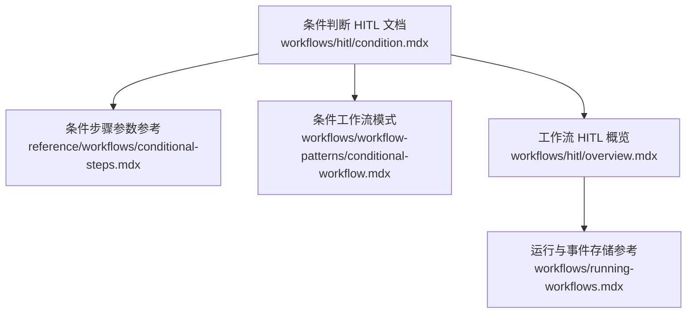
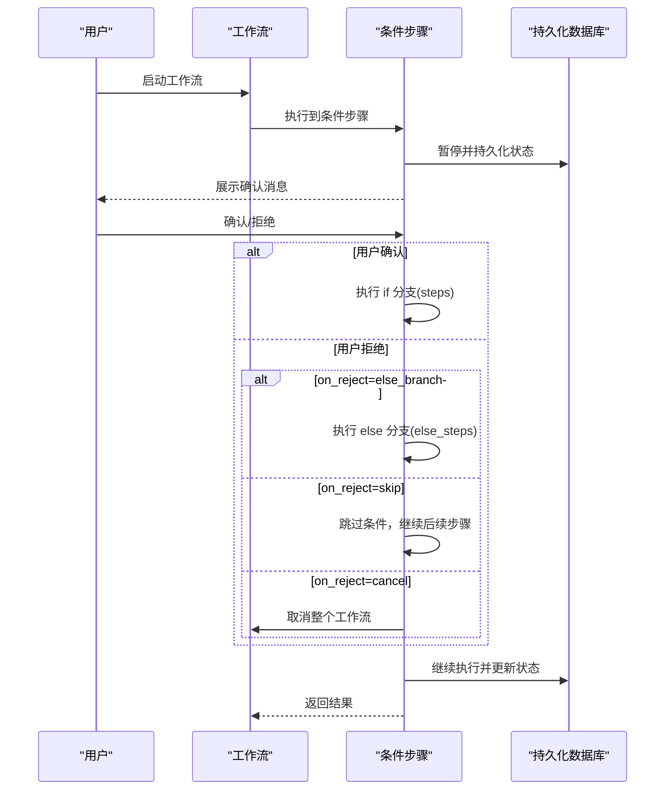
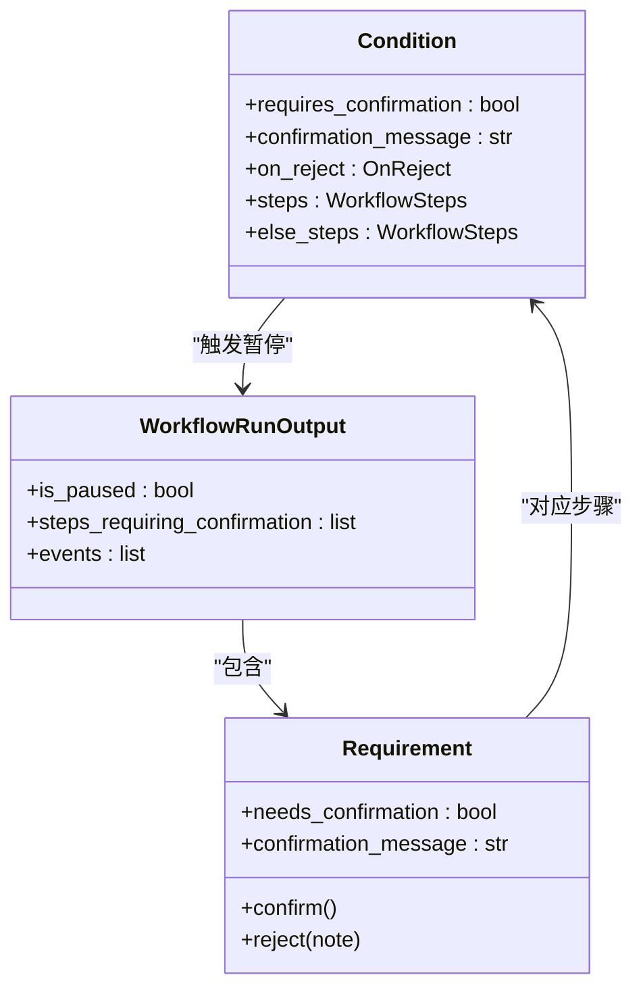
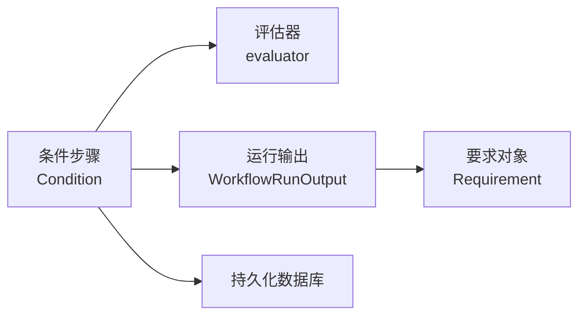

# 条件判断中的 HITL

<cite>
**本文引用的文件**
- [workflows/hitl/condition.mdx](file://workflows/hitl/condition.mdx)
- [reference/workflows/conditional-steps.mdx](file://reference/workflows/conditional-steps.mdx)
- [workflows/workflow-patterns/conditional-workflow.mdx](file://workflows/workflow-patterns/conditional-workflow.mdx)
- [workflows/hitl/overview.mdx](file://workflows/hitl/overview.mdx)
- [workflows/running-workflows.mdx](file://workflows/running-workflows.mdx)
</cite>

## 目录
1. [简介](#简介)
2. [项目结构](#项目结构)
3. [核心组件](#核心组件)
4. [架构总览](#架构总览)
5. [详细组件分析](#详细组件分析)
6. [依赖关系分析](#依赖关系分析)
7. [性能考量](#性能考量)
8. [故障排查指南](#故障排查指南)
9. [结论](#结论)
10. [附录](#附录)

## 简介
本技术文档聚焦于“条件判断中的 HITL（人机交互）”能力，系统讲解如何在条件判断步骤中实现用户控制的分支决策。内容涵盖：
- requires_confirmation 参数的使用方式与行为
- on_reject 配置对拒绝后分支的影响
- 用户确认流程：确认消息定制、拒绝后的分支处理
- 条件判断中 HITL 的完整实现示例
- else_branch 在条件判断中的特殊作用
- 最佳实践与常见问题解决方案

## 项目结构
围绕条件判断 HITL 的知识主要分布在以下文档：
- 条件判断 HITL 使用说明与示例
- 条件步骤参数参考
- 条件工作流模式与基础用法
- 工作流 HITL 概览与通用机制
- 运行与事件存储参考

图表来源
- [workflows/hitl/condition.mdx:1-150](file://workflows/hitl/condition.mdx#L1-L150)
- [reference/workflows/conditional-steps.mdx:1-15](file://reference/workflows/conditional-steps.mdx#L1-L15)
- [workflows/workflow-patterns/conditional-workflow.mdx:1-100](file://workflows/workflow-patterns/conditional-workflow.mdx#L1-L100)
- [workflows/hitl/overview.mdx:1-289](file://workflows/hitl/overview.mdx#L1-L289)
- [workflows/running-workflows.mdx:536-574](file://workflows/running-workflows.mdx#L536-L574)

章节来源
- [workflows/hitl/condition.mdx:1-150](file://workflows/hitl/condition.mdx#L1-L150)
- [reference/workflows/conditional-steps.mdx:1-15](file://reference/workflows/conditional-steps.mdx#L1-L15)
- [workflows/workflow-patterns/conditional-workflow.mdx:1-100](file://workflows/workflow-patterns/conditional-workflow.mdx#L1-L100)
- [workflows/hitl/overview.mdx:1-289](file://workflows/hitl/overview.mdx#L1-L289)
- [workflows/running-workflows.mdx:536-574](file://workflows/running-workflows.mdx#L536-L574)

## 核心组件
- 条件步骤（Condition）
  - 支持 requires_confirmation 开启用户确认暂停
  - 支持 confirmation_message 自定义提示信息
  - 支持 on_reject 控制拒绝后的动作（else_branch/skip/cancel）
  - 当 requires_confirmation=True 时，evaluator 将被忽略，以用户决策为准
- 工作流运行输出（WorkflowRunOutput）
  - 提供 is_paused、steps_requiring_confirmation 等属性用于检测与处理暂停
- 数据库持久化
  - HITL 需要数据库（如 SqliteDb/PostgresDb）以保存状态

章节来源
- [reference/workflows/conditional-steps.mdx:6-15](file://reference/workflows/conditional-steps.mdx#L6-L15)
- [workflows/hitl/overview.mdx:48-61](file://workflows/hitl/overview.mdx#L48-L61)
- [workflows/hitl/condition.mdx:65-118](file://workflows/hitl/condition.mdx#L65-L118)

## 架构总览
下图展示了条件判断 HITL 的关键交互：工作流在遇到 requires_confirmation=True 的 Condition 步骤时暂停，等待用户确认；根据用户选择与 on_reject 设置决定执行 if 分支或 else 分支，或跳过/取消。

图表来源
- [workflows/hitl/condition.mdx:12-14](file://workflows/hitl/condition.mdx#L12-L14)
- [workflows/hitl/condition.mdx:73-88](file://workflows/hitl/condition.mdx#L73-L88)
- [workflows/hitl/overview.mdx:84-94](file://workflows/hitl/overview.mdx#L84-L94)

## 详细组件分析

### 条件步骤（Condition）与 HITL 参数
- requires_confirmation：开启后，条件步骤在执行前暂停，等待用户确认
- confirmation_message：自定义提示信息，用于引导用户做出决策
- on_reject：拒绝时的行为选项
  - else_branch：执行 else_steps（默认）
  - skip：跳过整个条件，继续后续步骤
  - cancel：取消整个工作流

章节来源
- [reference/workflows/conditional-steps.mdx:6-15](file://reference/workflows/conditional-steps.mdx#L6-L15)
- [workflows/hitl/condition.mdx:65-88](file://workflows/hitl/condition.mdx#L65-L88)

### 用户确认流程与拒绝分支处理
- 用户确认：执行 if 分支（steps）
- 用户拒绝：
  - 若定义了 else_steps，则执行 else 分支（else_branch，默认）
  - 若未定义 else_steps 且 on_reject=else_branch，则跳过该条件（skip）
  - on_reject=skip：跳过条件，继续后续步骤
  - on_reject=cancel：取消整个工作流

章节来源
- [workflows/hitl/condition.mdx:12-14](file://workflows/hitl/condition.mdx#L12-L14)
- [workflows/hitl/condition.mdx:90-103](file://workflows/hitl/condition.mdx#L90-L103)
- [workflows/hitl/condition.mdx:81-88](file://workflows/hitl/condition.mdx#L81-L88)

### 与评估器（evaluator）的关系
- 当 requires_confirmation=True 时，evaluator 将被忽略，用户决策优先
- 仅当 requires_confirmation=False 时，evaluator 决定分支

章节来源
- [workflows/hitl/condition.mdx:105-118](file://workflows/hitl/condition.mdx#L105-L118)
- [reference/workflows/conditional-steps.mdx:8](file://reference/workflows/conditional-steps.mdx#L8)

### 流式工作流中的条件 HITL
- 通过监听 StepPausedEvent 检测暂停
- 获取会话与运行输出，遍历 steps_requiring_confirmation 并调用 confirm()/reject()
- 继续执行并刷新会话

章节来源
- [workflows/hitl/condition.mdx:120-143](file://workflows/hitl/condition.mdx#L120-L143)
- [workflows/hitl/overview.mdx:218-234](file://workflows/hitl/overview.mdx#L218-L234)

### 条件工作流模式与 else_branch 特殊性
- 条件工作流提供确定性分支逻辑
- else_steps 为空时，拒绝且 on_reject=else_branch 将跳过条件
- else_steps 存在时，拒绝将执行 else_steps

章节来源
- [workflows/workflow-patterns/conditional-workflow.mdx:21-28](file://workflows/workflow-patterns/conditional-workflow.mdx#L21-L28)
- [workflows/hitl/condition.mdx:90-103](file://workflows/hitl/condition.mdx#L90-L103)

### 类图：条件步骤与运行输出的关键关系

图表来源
- [reference/workflows/conditional-steps.mdx:6-15](file://reference/workflows/conditional-steps.mdx#L6-L15)
- [workflows/hitl/overview.mdx:84-94](file://workflows/hitl/overview.mdx#L84-L94)

## 依赖关系分析
- 条件步骤依赖于工作流运行输出与 Requirement 对象进行暂停与恢复
- 条件步骤与评估器（evaluator）存在互斥关系：requires_confirmation=True 时忽略 evaluator
- 条件步骤与数据库持久化耦合：HITL 需要数据库保存状态

图表来源
- [workflows/hitl/condition.mdx:105-118](file://workflows/hitl/condition.mdx#L105-L118)
- [workflows/hitl/overview.mdx:48-61](file://workflows/hitl/overview.mdx#L48-L61)

章节来源
- [workflows/hitl/condition.mdx:105-118](file://workflows/hitl/condition.mdx#L105-L118)
- [workflows/hitl/overview.mdx:48-61](file://workflows/hitl/overview.mdx#L48-L61)

## 性能考量
- HITL 会在暂停点持久化状态，避免重复计算
- 流式运行时建议按需过滤事件，减少日志噪声
- 条件 HITL 不涉及外部工具调用，性能开销主要来自数据库读写与事件存储

章节来源
- [workflows/running-workflows.mdx:536-574](file://workflows/running-workflows.mdx#L536-L574)
- [workflows/hitl/overview.mdx:48-61](file://workflows/hitl/overview.mdx#L48-L61)

## 故障排查指南
- 无法暂停或无法继续
  - 确认已配置数据库（如 SqliteDb/PostgresDb），HITL 需要持久化支持
  - 检查 run_output.is_paused 是否为真，并正确遍历 steps_requiring_confirmation
- 消息未显示或显示不正确
  - 确认 confirmation_message 已设置
  - 确认用户输入或确认流程已正确调用 confirm()/reject()
- 分支逻辑不符合预期
  - requires_confirmation=True 时，evaluator 将被忽略，请确保 on_reject 设置符合需求
  - else_steps 为空时，拒绝且 on_reject=else_branch 将跳过条件

章节来源
- [workflows/hitl/overview.mdx:48-61](file://workflows/hitl/overview.mdx#L48-L61)
- [workflows/hitl/condition.mdx:105-118](file://workflows/hitl/condition.mdx#L105-L118)
- [workflows/hitl/condition.mdx:90-103](file://workflows/hitl/condition.mdx#L90-L103)

## 结论
条件判断中的 HITL 为工作流提供了灵活的人机协作能力：通过 requires_confirmation 实现用户控制的分支决策，结合 on_reject 精准控制拒绝后的动作。在需要安全与合规的场景中，合理配置 else_branch、skip 或 cancel 能有效平衡自动化与人工审核。配合数据库持久化与流式事件处理，可构建稳定、可观测的条件分支工作流。

## 附录
- 完整实现示例路径
  - 条件 HITL 示例与确认流程：[workflows/hitl/condition.mdx:16-63](file://workflows/hitl/condition.mdx#L16-L63)
  - 流式条件 HITL 处理：[workflows/hitl/condition.mdx:120-143](file://workflows/hitl/condition.mdx#L120-L143)
- 参数与行为参考
  - 条件步骤参数表：[reference/workflows/conditional-steps.mdx:6-15](file://reference/workflows/conditional-steps.mdx#L6-L15)
  - HITL 行为汇总（含 OnReject）：[workflows/hitl/overview.mdx:208-217](file://workflows/hitl/overview.mdx#L208-L217)
- 基础模式与 else_steps 语义
  - 条件工作流模式与分支说明：[workflows/workflow-patterns/conditional-workflow.mdx:21-28](file://workflows/workflow-patterns/conditional-workflow.mdx#L21-L28)