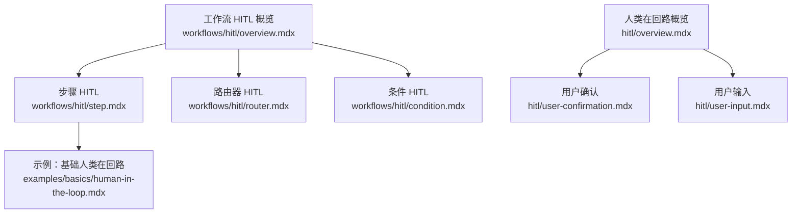
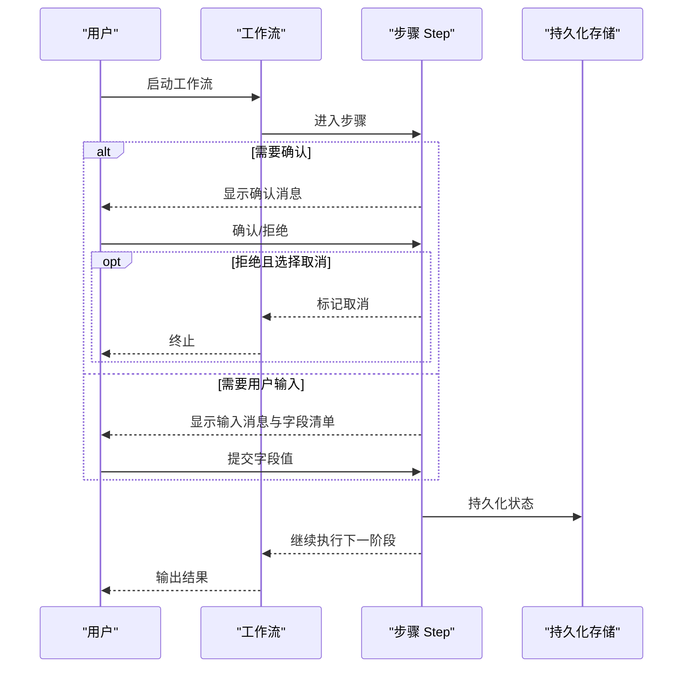
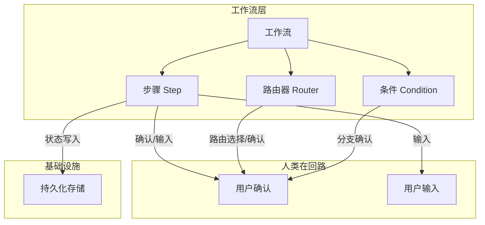

# 步骤中的 HITL

<cite>
**本文引用的文件**
- [workflows/hitl/step.mdx](file://workflows/hitl/step.mdx)
- [workflows/hitl/overview.mdx](file://workflows/hitl/overview.mdx)
- [hitl/overview.mdx](file://hitl/overview.mdx)
- [hitl/user-confirmation.mdx](file://hitl/user-confirmation.mdx)
- [hitl/user-input.mdx](file://hitl/user-input.mdx)
- [workflows/hitl/router.mdx](file://workflows/hitl/router.mdx)
- [workflows/hitl/condition.mdx](file://workflows/hitl/condition.mdx)
- [examples/basics/human-in-the-loop.mdx](file://examples/basics/human-in-the-loop.mdx)
</cite>

## 目录
1. [简介](#简介)
2. [项目结构](#项目结构)
3. [核心组件](#核心组件)
4. [架构总览](#架构总览)
5. [详细组件分析](#详细组件分析)
6. [依赖关系分析](#依赖关系分析)
7. [性能考量](#性能考量)
8. [故障排查指南](#故障排查指南)
9. [结论](#结论)
10. [附录](#附录)

## 简介
本篇文档聚焦“步骤中的 HITL（人类在回路）”，系统讲解如何在单个工作流步骤中实现用户确认与参数收集。内容覆盖：
- requires_confirmation 与 requires_user_input 的用法与行为差异
- 确认消息与用户输入消息的定制方式
- 用户输入 schema 的定义与字段类型配置
- 完整实现示例：确认流程与用户输入处理
- @pause 装饰器在步骤中的应用
- 步骤级 HITL 与自定义函数的结合
- 最佳实践与性能考虑

## 项目结构
围绕步骤级 HITL 的知识主要分布在以下文档：
- 工作流 HITL 概览与步骤、路由器、条件等子主题
- 人类在回路总体概念与工具级确认/输入
- 示例：基础的人类在回路交互模式

**图表来源**
- [workflows/hitl/overview.mdx:1-289](file://workflows/hitl/overview.mdx#L1-L289)
- [workflows/hitl/step.mdx:1-250](file://workflows/hitl/step.mdx#L1-L250)
- [workflows/hitl/router.mdx:1-202](file://workflows/hitl/router.mdx#L1-L202)
- [workflows/hitl/condition.mdx:1-150](file://workflows/hitl/condition.mdx#L1-L150)
- [hitl/overview.mdx:1-174](file://hitl/overview.mdx#L1-L174)
- [hitl/user-confirmation.mdx:1-258](file://hitl/user-confirmation.mdx#L1-L258)
- [hitl/user-input.mdx:1-260](file://hitl/user-input.mdx#L1-L260)
- [examples/basics/human-in-the-loop.mdx:201-236](file://examples/basics/human-in-the-loop.mdx#L201-L236)

**章节来源**
- [workflows/hitl/overview.mdx:1-289](file://workflows/hitl/overview.mdx#L1-L289)
- [workflows/hitl/step.mdx:1-250](file://workflows/hitl/step.mdx#L1-L250)
- [hitl/overview.mdx:1-174](file://hitl/overview.mdx#L1-L174)

## 核心组件
- 步骤（Step）：支持两种 HITL 模式
  - 确认（requires_confirmation=True）：执行前暂停，用户批准或拒绝；拒绝时可选择跳过当前步骤或取消整个工作流
  - 用户输入（requires_user_input=True）：执行前暂停，收集参数；参数通过 step_input.additional_data["user_input"] 传递给步骤函数
- 用户输入字段（UserInputField）：定义字段名、类型、描述、是否必填、允许值等
- @pause 装饰器：在自定义函数上直接声明 HITL 配置，自动被 Step 检测并生效
- 数据库持久化：工作流暂停需要数据库以保存状态，以便后续继续运行

关键参数与行为要点：
- requires_confirmation：布尔值，开启后在步骤执行前暂停
- confirmation_message：字符串，向用户显示的确认提示
- on_reject：当用户拒绝时的行为，支持 skip（默认）、cancel
- requires_user_input：布尔值，开启后在步骤执行前暂停并等待用户输入
- user_input_message：字符串，向用户显示的输入提示
- user_input_schema：列表，定义需要收集的字段及其类型、描述、是否必填等
- 访问用户输入：在自定义函数步骤中通过 step_input.additional_data["user_input"] 获取

**章节来源**
- [workflows/hitl/step.mdx:10-184](file://workflows/hitl/step.mdx#L10-L184)
- [workflows/hitl/overview.mdx:48-153](file://workflows/hitl/overview.mdx#L48-L153)

## 架构总览
下图展示了“步骤级 HITL”的整体交互：工作流运行到某一步骤时，根据配置决定是等待用户确认还是等待用户输入；用户完成操作后，继续运行。

**图表来源**
- [workflows/hitl/step.mdx:10-184](file://workflows/hitl/step.mdx#L10-L184)
- [workflows/hitl/overview.mdx:48-153](file://workflows/hitl/overview.mdx#L48-L153)

## 详细组件分析

### 步骤确认（requires_confirmation）
- 行为：在步骤执行前暂停，等待用户批准或拒绝
- 拒绝策略：on_reject 可选 skip（跳过当前步骤继续）或 cancel（取消整个工作流）
- 使用场景：对敏感或高风险操作进行人工把关

参数与表格
- requires_confirmation：布尔值
- confirmation_message：字符串
- on_reject：枚举（skip 或 cancel）

处理流程（代码路径）
- 在 run_output.is_paused 为真时，遍历 steps_requiring_confirmation
- 根据用户输入调用 req.confirm() 或 req.reject()
- 调用 continue_run 继续执行

**章节来源**
- [workflows/hitl/step.mdx:10-68](file://workflows/hitl/step.mdx#L10-L68)
- [workflows/hitl/overview.mdx:96-119](file://workflows/hitl/overview.mdx#L96-L119)

### 步骤用户输入（requires_user_input）
- 行为：在步骤执行前暂停，收集用户提供的参数
- 输入来源：通过 user_input_schema 定义字段；用户提交后通过 req.set_user_input(...) 注入
- 输入访问：在自定义函数步骤中通过 step_input.additional_data["user_input"] 获取

参数与表格
- requires_user_input：布尔值
- user_input_message：字符串
- user_input_schema：列表，元素为 UserInputField

UserInputField 字段
- name：字段名（作为 user_input 字典的键）
- field_type：字段类型（str、int、float、bool）
- description：字段描述
- required：是否必填（默认 True）
- allowed_values：可选的合法值列表

访问用户输入
- 自定义函数步骤中通过 step_input.additional_data["user_input"] 获取字典

**章节来源**
- [workflows/hitl/step.mdx:68-184](file://workflows/hitl/step.mdx#L68-L184)

### @pause 装饰器在步骤中的应用
- 作用：在自定义函数上直接声明 HITL 配置（确认或用户输入），Step 会自动检测并应用
- 典型用法：在函数上使用 @pause，然后将其作为 executor 传入 Step

**章节来源**
- [workflows/hitl/step.mdx:185-219](file://workflows/hitl/step.mdx#L185-L219)
- [workflows/hitl/overview.mdx:236-257](file://workflows/hitl/overview.mdx#L236-L257)

### 步骤级 HITL 与自定义函数的结合
- 自定义函数步骤：通过 step_input 接收 additional_data["user_input"]，读取用户输入并执行业务逻辑
- 代理步骤：用户输入会自动附加到消息中，由代理在上下文中使用

**章节来源**
- [workflows/hitl/step.mdx:168-184](file://workflows/hitl/step.mdx#L168-L184)

### 流式工作流中的 HITL
- 支持流式事件 StepPausedEvent，在暂停时处理确认或输入
- 继续运行时同样支持流式事件

**章节来源**
- [workflows/hitl/step.mdx:221-244](file://workflows/hitl/step.mdx#L221-L244)
- [workflows/hitl/overview.mdx:218-234](file://workflows/hitl/overview.mdx#L218-L234)

### 与其他工作流原语的关系
- Router：支持用户选择路由或确认自动化路由决策
- Condition：支持确认模式，用户决定走 if 分支还是 else 分支
- 注意：工具级 HITL（如 @tool(requires_confirmation=True)）不会传播到工作流，应使用步骤级 HITL

**章节来源**
- [workflows/hitl/router.mdx:1-202](file://workflows/hitl/router.mdx#L1-L202)
- [workflows/hitl/condition.mdx:1-150](file://workflows/hitl/condition.mdx#L1-L150)
- [workflows/hitl/overview.mdx:11-17](file://workflows/hitl/overview.mdx#L11-L17)

## 依赖关系分析
- 步骤级 HITL 依赖数据库持久化能力（用于保存暂停状态并在继续时恢复）
- 步骤级 HITL 与工具级 HITL 不同步：工具级的 requires_confirmation 等不会影响工作流的步骤执行
- 步骤级 HITL 与路由器、条件等其他原语协同工作，共同构成工作流的人工把关点

**图表来源**
- [workflows/hitl/overview.mdx:48-153](file://workflows/hitl/overview.mdx#L48-L153)
- [workflows/hitl/step.mdx:10-184](file://workflows/hitl/step.mdx#L10-L184)
- [workflows/hitl/router.mdx:1-202](file://workflows/hitl/router.mdx#L1-L202)
- [workflows/hitl/condition.mdx:1-150](file://workflows/hitl/condition.mdx#L1-L150)

**章节来源**
- [workflows/hitl/overview.mdx:48-153](file://workflows/hitl/overview.mdx#L48-L153)

## 性能考量
- 数据库持久化：HITL 需要数据库以保存暂停状态，建议在生产环境使用高性能数据库（如 PostgreSQL）
- 流式处理：在流式工作流中，暂停时仅处理必要的事件，避免阻塞主流程
- 输入验证：在步骤函数内部对用户输入进行快速校验，减少无效重试
- 批量输入：对于多个字段的输入，尽量一次性收集并校验，降低交互轮次

[本节为通用指导，不直接分析具体文件]

## 故障排查指南
- run_output.is_paused 为真但未处理：检查是否正确遍历 steps_requiring_confirmation 或 steps_requiring_user_input，并调用 confirm()/reject() 或 set_user_input()
- 数据库未配置：HITL 暂停后无法继续，确保工作流初始化时提供了持久化存储
- 工具级 HITL 未生效：注意工具级 requires_confirmation 等不会传播到工作流，应使用步骤级 HITL
- 流式事件未处理：在流式场景中，遇到 StepPausedEvent 时及时处理并继续

**章节来源**
- [workflows/hitl/overview.mdx:48-153](file://workflows/hitl/overview.mdx#L48-L153)
- [workflows/hitl/step.mdx:221-244](file://workflows/hitl/step.mdx#L221-L244)
- [hitl/overview.mdx:29-90](file://hitl/overview.mdx#L29-L90)

## 结论
步骤级 HITL 是在工作流中引入人工把关与参数收集的关键机制。通过 requires_confirmation 与 requires_user_input，可以灵活控制每个步骤的执行时机与输入参数。配合 @pause 装饰器与数据库持久化，既能保证安全性，又能维持良好的用户体验。在实际工程中，建议明确区分工具级与步骤级 HITL，合理设计确认消息与输入 schema，并在流式场景中妥善处理事件与状态恢复。

[本节为总结性内容，不直接分析具体文件]

## 附录

### 实现示例（步骤确认）
- 在步骤中启用 requires_confirmation 并设置 confirmation_message
- 在 run_output.is_paused 时，遍历 steps_requiring_confirmation，根据用户输入调用 confirm()/reject()
- 调用 continue_run 继续执行

参考路径
- [workflows/hitl/step.mdx:14-50](file://workflows/hitl/step.mdx#L14-L50)

### 实现示例（步骤用户输入）
- 在步骤中启用 requires_user_input，并定义 user_input_message 与 user_input_schema
- 在 run_output.is_paused 时，遍历 steps_requiring_user_input，收集字段值并通过 set_user_input 注入
- 在步骤函数中通过 step_input.additional_data["user_input"] 获取输入并执行

参考路径
- [workflows/hitl/step.mdx:71-148](file://workflows/hitl/step.mdx#L71-L148)

### @pause 装饰器示例
- 在自定义函数上使用 @pause 声明 requires_confirmation 或 requires_user_input
- 将该函数作为 executor 传入 Step，装饰器配置会被自动检测

参考路径
- [workflows/hitl/step.mdx:189-219](file://workflows/hitl/step.mdx#L189-L219)

### 与工具级 HITL 的区别
- 工具级 HITL（如 @tool(requires_confirmation=True)）不会传播到工作流
- 工作流中应使用步骤级 HITL（Step.requires_confirmation）

参考路径
- [workflows/hitl/overview.mdx:11-17](file://workflows/hitl/overview.mdx#L11-L17)