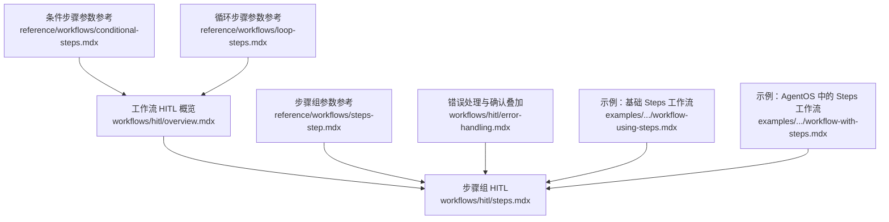
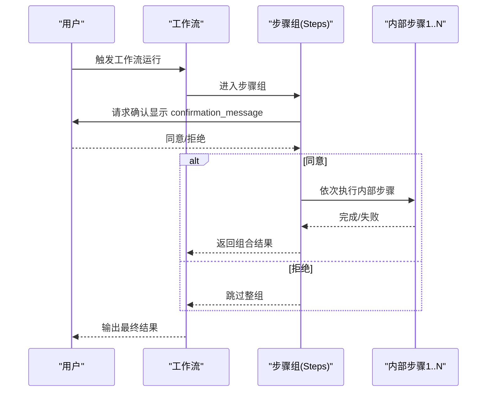
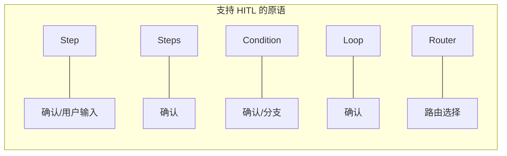

# 步骤组中的 HITL

<cite>
**本文引用的文件**
- [workflows/hitl/steps.mdx](file://workflows/hitl/steps.mdx)
- [workflows/hitl/overview.mdx](file://workflows/hitl/overview.mdx)
- [reference/workflows/steps-step.mdx](file://reference/workflows/steps-step.mdx)
- [reference/workflows/conditional-steps.mdx](file://reference/workflows/conditional-steps.mdx)
- [reference/workflows/loop-steps.mdx](file://reference/workflows/loop-steps.mdx)
- [workflows/hitl/error-handling.mdx](file://workflows/hitl/error-handling.mdx)
- [examples/workflows/basic-workflows/sequence-of-steps/workflow-using-steps.mdx](file://examples/workflows/basic-workflows/sequence-of-steps/workflow-using-steps.mdx)
- [examples/agent-os/workflow/workflow-with-steps.mdx](file://examples/agent-os/workflow/workflow-with-steps.mdx)
</cite>

## 目录
1. [简介](#简介)
2. [项目结构](#项目结构)
3. [核心组件](#核心组件)
4. [架构总览](#架构总览)
5. [详细组件分析](#详细组件分析)
6. [依赖关系分析](#依赖关系分析)
7. [性能考量](#性能考量)
8. [故障排查指南](#故障排查指南)
9. [结论](#结论)
10. [附录](#附录)

## 简介
本篇文档聚焦于工作流中的“步骤组（Steps）原语”的人机交互（HITL）能力，系统阐述如何在 Steps 组合步骤中实现“用户确认”机制，以及与单个 Step 的区别、优势与最佳实践。我们将从配置参数、确认流程、执行顺序、错误处理、与内部步骤的关系等维度进行深入解析，并提供完整的实现示例路径与可视化图示。

## 项目结构
围绕 Steps HITL 的相关文档主要分布在以下位置：
- 工作流 HITL 概览：定义支持的原语类型、运行时暂停属性与通用处理方式
- Steps 原语 HITL：步骤组确认模式、行为与参数
- 参考文档：各原语的参数表（含 Steps）
- 示例工程：基于 Steps 的工作流编排与运行
- 错误处理：与确认叠加时的优先级与行为

图表来源
- [workflows/hitl/overview.mdx:1-289](file://workflows/hitl/overview.mdx#L1-L289)
- [workflows/hitl/steps.mdx:1-117](file://workflows/hitl/steps.mdx#L1-L117)
- [reference/workflows/steps-step.mdx:1-13](file://reference/workflows/steps-step.mdx#L1-L13)
- [reference/workflows/conditional-steps.mdx:1-15](file://reference/workflows/conditional-steps.mdx#L1-L15)
- [reference/workflows/loop-steps.mdx:1-16](file://reference/workflows/loop-steps.mdx#L1-L16)
- [workflows/hitl/error-handling.mdx:1-184](file://workflows/hitl/error-handling.mdx#L1-L184)
- [examples/workflows/basic-workflows/sequence-of-steps/workflow-using-steps.mdx:1-111](file://examples/workflows/basic-workflows/sequence-of-steps/workflow-using-steps.mdx#L1-L111)
- [examples/agent-os/workflow/workflow-with-steps.mdx:1-110](file://examples/agent-os/workflow/workflow-with-steps.mdx#L1-L110)

章节来源
- [workflows/hitl/overview.mdx:1-289](file://workflows/hitl/overview.mdx#L1-L289)
- [workflows/hitl/steps.mdx:1-117](file://workflows/hitl/steps.mdx#L1-L117)
- [reference/workflows/steps-step.mdx:1-13](file://reference/workflows/steps-step.mdx#L1-L13)
- [reference/workflows/conditional-steps.mdx:1-15](file://reference/workflows/conditional-steps.mdx#L1-L15)
- [reference/workflows/loop-steps.mdx:1-16](file://reference/workflows/loop-steps.mdx#L1-L16)
- [workflows/hitl/error-handling.mdx:1-184](file://workflows/hitl/error-handling.mdx#L1-L184)
- [examples/workflows/basic-workflows/sequence-of-steps/workflow-using-steps.mdx:1-111](file://examples/workflows/basic-workflows/sequence-of-steps/workflow-using-steps.mdx#L1-L111)
- [examples/agent-os/workflow/workflow-with-steps.mdx:1-110](file://examples/agent-os/workflow/workflow-with-steps.mdx#L1-L110)

## 核心组件
- 步骤组（Steps）：将多个 Step 组成一个“管道”，支持在进入该管道前进行一次性确认；确认后按顺序执行内部所有 Step。
- 单个 Step：每个 Step 可独立设置确认或用户输入，适合细粒度控制。
- 参数要点（Steps）：
  - requires_confirmation：是否在进入管道前暂停等待确认
  - confirmation_message：提示用户的消息
  - on_reject：拒绝时的行为（skip 跳过整组；cancel 取消工作流）

章节来源
- [workflows/hitl/steps.mdx:1-117](file://workflows/hitl/steps.mdx#L1-L117)
- [reference/workflows/steps-step.mdx:1-13](file://reference/workflows/steps-step.mdx#L1-L13)

## 架构总览
Steps HITL 在工作流执行中的作用是“在进入一组连续步骤之前”进行一次性的用户确认。一旦确认，工作流会依次执行该组内的所有步骤；若拒绝，则跳过整组。

图表来源
- [workflows/hitl/steps.mdx:1-117](file://workflows/hitl/steps.mdx#L1-L117)
- [workflows/hitl/overview.mdx:84-95](file://workflows/hitl/overview.mdx#L84-L95)

## 详细组件分析

### 步骤组（Steps）HITL 配置与行为
- 确认模式：requires_confirmation=true 时，工作流在进入 Steps 管道前暂停，等待用户确认。
- 消息与选项：confirmation_message 提示用户，on_reject 控制拒绝时的行为（默认 skip，也可 cancel）。
- 执行顺序：确认通过后，按声明顺序依次执行内部所有 Step；单个内部 Step 是否再次暂停取决于其自身配置（如 requires_confirmation 或 requires_user_input）。

章节来源
- [workflows/hitl/steps.mdx:1-117](file://workflows/hitl/steps.mdx#L1-L117)
- [reference/workflows/steps-step.mdx:1-13](file://reference/workflows/steps-step.mdx#L1-L13)

### 与单个 Step 的区别与优势
- 区别
  - Step：可针对单步进行确认或用户输入，适合细粒度控制与多分支场景。
  - Steps：面向“一整套流程”的一次性确认，避免多次弹窗，提升用户体验。
- 优势
  - 降低交互频次：一次确认，批量执行
  - 易于组织复杂流程：将多个 Step 组织为逻辑单元
  - 与内部 Step 配置解耦：Steps 的确认不影响内部 Step 的独立配置

章节来源
- [workflows/hitl/overview.mdx:72-83](file://workflows/hitl/overview.mdx#L72-L83)
- [reference/workflows/conditional-steps.mdx:1-15](file://reference/workflows/conditional-steps.mdx#L1-L15)
- [reference/workflows/loop-steps.mdx:1-16](file://reference/workflows/loop-steps.mdx#L1-L16)

### 与内部步骤的关系
- Steps 的确认发生在进入管道前，仅触发一次。
- 内部 Step 可能各自带有确认或用户输入需求，这些需求与 Steps 的确认互不冲突，按 Step 自身规则生效。
- 若内部 Step 失败且设置了错误暂停策略，可在后续与确认叠加处理。

章节来源
- [workflows/hitl/steps.mdx:78-86](file://workflows/hitl/steps.mdx#L78-L86)
- [workflows/hitl/error-handling.mdx:112-127](file://workflows/hitl/error-handling.mdx#L112-L127)

### 确认后的执行顺序与错误处理
- 执行顺序：确认同意后，按声明顺序依次执行内部 Step；若某 Step 失败并设置了错误暂停，则在该 Step 处暂停，允许用户选择重试或跳过。
- 错误处理叠加：先走确认，再处理错误暂停；两者互不影响，但都会导致工作流暂停。

章节来源
- [workflows/hitl/steps.mdx:78-86](file://workflows/hitl/steps.mdx#L78-L86)
- [workflows/hitl/error-handling.mdx:112-127](file://workflows/hitl/error-handling.mdx#L112-L127)

### 使用场景与最佳实践
- 场景
  - 敏感或昂贵的操作：如批量数据处理、外部系统调用等，先整体确认再执行
  - 复杂流程编排：将多个相关步骤封装为一组，统一管理
  - 降低交互成本：减少频繁弹窗，提升用户体验
- 最佳实践
  - 为 Steps 设置清晰的 confirmation_message，说明将要执行的内容与影响
  - 对可能失败的内部 Step 设置合理的 on_error 策略（fail/skip/pause），并在需要时与确认叠加
  - 将 Steps 作为“逻辑单元”进行分层设计，内部 Step 保持职责单一

章节来源
- [workflows/hitl/steps.mdx:1-117](file://workflows/hitl/steps.mdx#L1-L117)
- [workflows/hitl/error-handling.mdx:112-127](file://workflows/hitl/error-handling.mdx#L112-L127)

### 完整实现示例（步骤组 HITL）
以下示例展示了如何在工作流中使用 Steps 并启用 HITL 确认：
- 示例路径（基础 Steps 工作流）：[示例：基础 Steps 工作流:1-111](file://examples/workflows/basic-workflows/sequence-of-steps/workflow-using-steps.mdx#L1-L111)
- 示例路径（AgentOS 中的 Steps 工作流）：[示例：AgentOS 中的 Steps 工作流:1-110](file://examples/agent-os/workflow/workflow-with-steps.mdx#L1-L110)
- 步骤组 HITL 文档：[步骤组 HITL:1-117](file://workflows/hitl/steps.mdx#L1-L117)

章节来源
- [examples/workflows/basic-workflows/sequence-of-steps/workflow-using-steps.mdx:1-111](file://examples/workflows/basic-workflows/sequence-of-steps/workflow-using-steps.mdx#L1-L111)
- [examples/agent-os/workflow/workflow-with-steps.mdx:1-110](file://examples/agent-os/workflow/workflow-with-steps.mdx#L1-L110)
- [workflows/hitl/steps.mdx:1-117](file://workflows/hitl/steps.mdx#L1-L117)

## 依赖关系分析
- 支持的原语与 HITL 类型
  - Step：支持确认与用户输入
  - Steps：支持确认（不支持用户输入）
  - Condition：支持确认（分支选择）
  - Loop：支持确认（开始前确认）
  - Router：支持路由选择（不支持确认）

图表来源
- [workflows/hitl/overview.mdx:72-83](file://workflows/hitl/overview.mdx#L72-L83)

章节来源
- [workflows/hitl/overview.mdx:72-83](file://workflows/hitl/overview.mdx#L72-L83)

## 性能考量
- 数据持久化：HITL 需要数据库来保存工作流状态，以便暂停与恢复。开发环境可用 SQLite，生产建议使用更稳定的数据库。
- 流式执行：HITL 可与流式工作流结合，在事件流中检测暂停并处理要求后再继续。
- 确认频率：Steps 的一次性确认可显著降低交互次数，提升端到端吞吐。

章节来源
- [workflows/hitl/overview.mdx:48-63](file://workflows/hitl/overview.mdx#L48-L63)
- [workflows/hitl/overview.mdx:218-235](file://workflows/hitl/overview.mdx#L218-L235)

## 故障排查指南
- 状态检查
  - 当工作流暂停时，检查运行输出对象的属性以识别暂停原因：哪些步骤需要确认、需要用户输入、需要路由选择、哪些步骤因错误暂停。
- 错误与确认叠加
  - 先走确认，再处理错误暂停；两者互不影响，但都会导致暂停。
- 常见问题
  - 忘记设置数据库：HITL 需要持久化存储，否则无法恢复
  - 未处理拒绝：on_reject 默认 skip，若需取消工作流请显式设置
  - 内部 Step 仍需确认：Steps 的确认不会覆盖内部 Step 的独立配置

章节来源
- [workflows/hitl/overview.mdx:84-95](file://workflows/hitl/overview.mdx#L84-L95)
- [workflows/hitl/error-handling.mdx:112-127](file://workflows/hitl/error-handling.mdx#L112-L127)

## 结论
Steps 原语的 HITL 能力提供了“一次性确认、批量执行”的高效模式，特别适用于复杂流程与敏感操作。通过与单个 Step 的确认机制互补，以及与错误处理策略叠加，可以构建既安全又灵活的工作流。实践中应重视消息表达、拒绝策略与错误处理的组合设计，以获得良好的用户体验与可靠性。

## 附录
- 相关参考
  - 步骤组参数参考：[Steps 参数:1-13](file://reference/workflows/steps-step.mdx#L1-L13)
  - 条件步骤参数参考：[Conditional 参数:1-15](file://reference/workflows/conditional-steps.mdx#L1-L15)
  - 循环步骤参数参考：[Loop 参数:1-16](file://reference/workflows/loop-steps.mdx#L1-L16)
  - 错误处理与确认叠加：[错误处理:112-127](file://workflows/hitl/error-handling.mdx#L112-L127)
- 示例工程
  - 基础 Steps 工作流：[示例:1-111](file://examples/workflows/basic-workflows/sequence-of-steps/workflow-using-steps.mdx#L1-L111)
  - AgentOS 中的 Steps 工作流：[示例:1-110](file://examples/agent-os/workflow/workflow-with-steps.mdx#L1-L110)