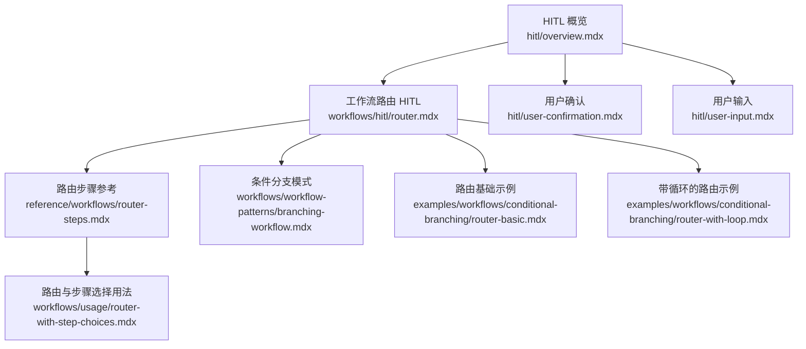
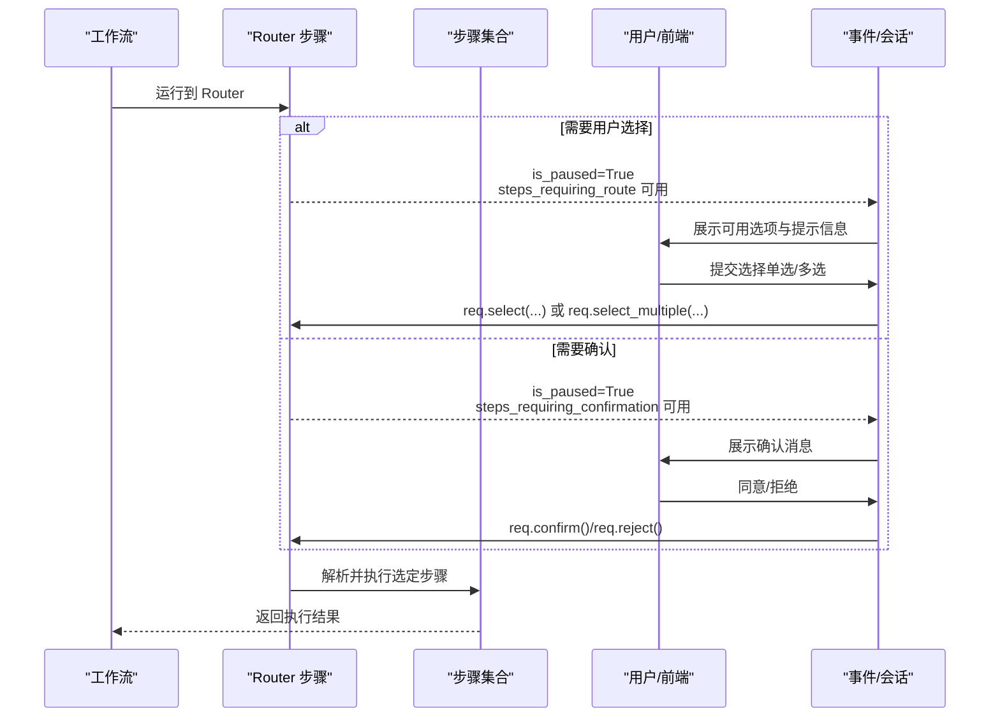
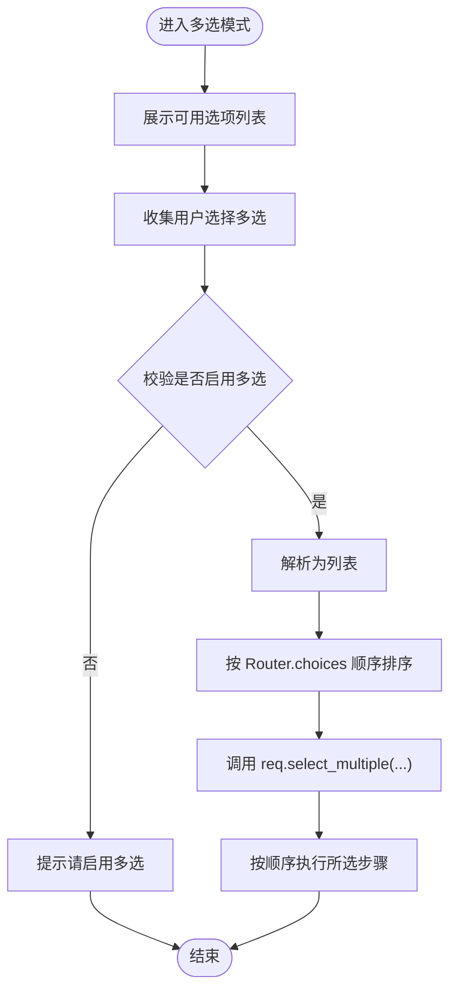
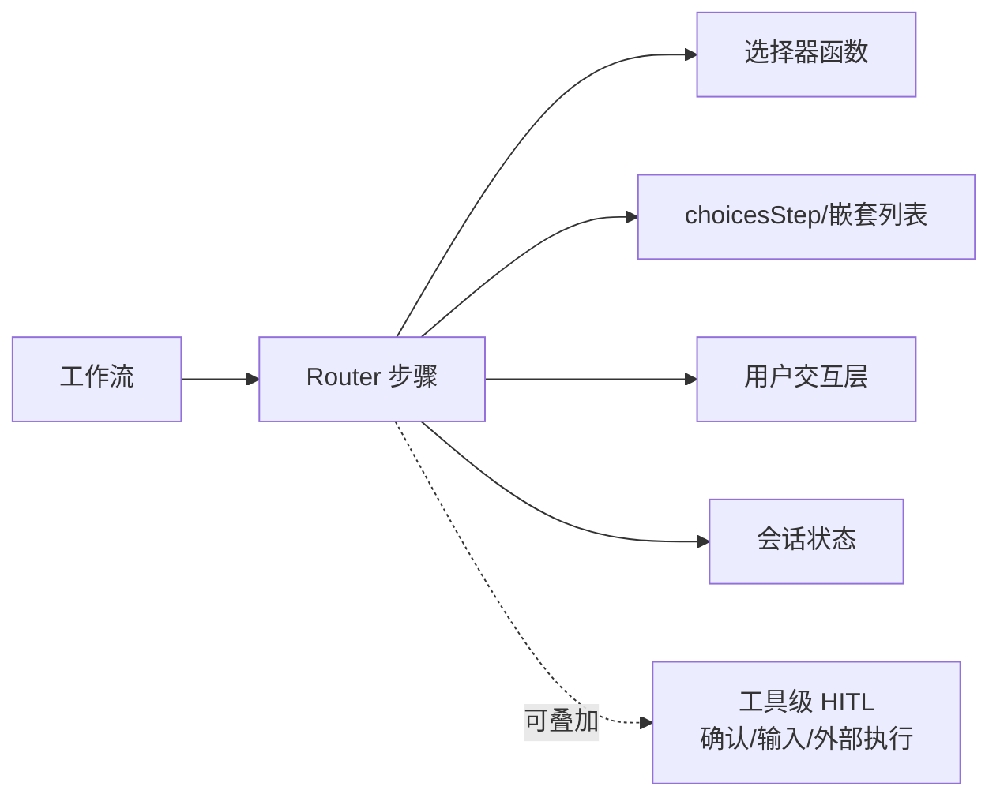

# 路由中的 HITL

<cite>
**本文引用的文件**
- [工作流路由 HITL](file://workflows/hitl/router.mdx)
- [路由步骤参考](file://reference/workflows/router-steps.mdx)
- [工作流条件分支模式](file://workflows/workflow-patterns/branching-workflow.mdx)
- [路由与步骤选择用法](file://workflows/usage/router-with-step-choices.mdx)
- [路由基础示例](file://examples/workflows/conditional-branching/router-basic.mdx)
- [带循环的路由示例](file://examples/workflows/conditional-branching/router-with-loop.mdx)
- [HITL 概览](file://hitl/overview.mdx)
- [用户确认](file://hitl/user-confirmation.mdx)
- [用户输入](file://hitl/user-input.mdx)
</cite>

## 目录
1. [简介](#简介)
2. [项目结构](#项目结构)
3. [核心组件](#核心组件)
4. [架构总览](#架构总览)
5. [详细组件分析](#详细组件分析)
6. [依赖关系分析](#依赖关系分析)
7. [性能考量](#性能考量)
8. [故障排查指南](#故障排查指南)
9. [结论](#结论)
10. [附录](#附录)

## 简介
本技术文档聚焦于“路由中的 HITL（人类在回路）”能力，系统讲解如何在工作流的 Router 步骤中实现“用户驱动的路径选择”。文档覆盖以下关键主题：
- requires_user_input 参数的使用与用户界面交互
- 用户输入消息的定制与可用选择的展示方式
- 单选与多选路由选择的不同实现方式
- 路由选择与步骤执行的集成流程
- 与工具调用确认、外部执行等其他 HITL 场景的协同
- 用户体验设计与最佳实践

## 项目结构
围绕路由 HITL 的知识分布在以下文档：
- 工作流路由 HITL：提供 Router 的用户选择与确认两种模式、参数与方法、多选处理、流式运行支持
- 路由步骤参考：给出 Router 的参数表、选择器返回类型、异步签名等 API 细节
- 条件分支与步骤选择：展示 choices 的灵活组织、嵌套容器、动态选择器与 step_choices 的使用
- 示例：路由基础与带循环的路由，演示自动化与交互式路由结合的场景

图表来源
- [工作流路由 HITL:1-202](file://workflows/hitl/router.mdx#L1-L202)
- [路由步骤参考:1-56](file://reference/workflows/router-steps.mdx#L1-L56)
- [工作流条件分支模式:136-176](file://workflows/workflow-patterns/branching-workflow.mdx#L136-L176)
- [路由与步骤选择用法:1-45](file://workflows/usage/router-with-step-choices.mdx#L1-L45)
- [路由基础示例:1-158](file://examples/workflows/conditional-branching/router-basic.mdx#L1-L158)
- [带循环的路由示例:1-172](file://examples/workflows/conditional-branching/router-with-loop.mdx#L1-L172)
- [HITL 概览:1-174](file://hitl/overview.mdx#L1-L174)
- [用户确认:1-258](file://hitl/user-confirmation.mdx#L1-L258)
- [用户输入:1-260](file://hitl/user-input.mdx#L1-L260)

章节来源
- [工作流路由 HITL:1-202](file://workflows/hitl/router.mdx#L1-L202)
- [路由步骤参考:1-56](file://reference/workflows/router-steps.mdx#L1-L56)

## 核心组件
- Router 步骤：在工作流中根据策略或用户选择决定下一步执行哪些步骤
- 选择器函数（selector）：可选，用于自动决策；也可通过 requires_user_input 强制用户选择
- 用户要求对象（steps_requiring_route / steps_requiring_confirmation）：在暂停时暴露给上层应用，用于收集用户选择或确认
- 选择方法：select、select_single、select_multiple
- 多选顺序：按 Router.choices 中出现的顺序依次执行，而非用户选择顺序

章节来源
- [工作流路由 HITL:66-114](file://workflows/hitl/router.mdx#L66-L114)
- [路由步骤参考:6-47](file://reference/workflows/router-steps.mdx#L6-L47)

## 架构总览
下图展示了 Router 在工作流中的位置以及与 HITL 的交互关系。

图表来源
- [工作流路由 HITL:10-170](file://workflows/hitl/router.mdx#L10-L170)

## 详细组件分析

### Router 参数与选择方法
- requires_user_input：是否暂停并等待用户选择路由
- user_input_message：向用户展示的选择提示语
- allow_multiple_selections：是否允许一次选择多个路由
- 选择方法：
  - req.select("route_name")：选择单一路由
  - req.select_single("route_name")：确保仅一个路由被选中
  - req.select_multiple(["a","b"])：多选（需 allow_multiple_selections=True）

章节来源
- [工作流路由 HITL:66-81](file://workflows/hitl/router.mdx#L66-L81)
- [路由步骤参考:6-19](file://reference/workflows/router-steps.mdx#L6-L19)

### 单选路由选择
- 使用场景：用户明确决定下一步执行哪条路径
- 实现要点：
  - Router(choices, requires_user_input=True, user_input_message=...)
  - 在 run_output.is_paused 时遍历 steps_requiring_route
  - 通过 req.select(...) 完成选择
- 执行顺序：严格遵循 Router.choices 中的顺序

章节来源
- [工作流路由 HITL:10-64](file://workflows/hitl/router.mdx#L10-L64)

### 多选路由选择
- 使用场景：用户希望组合多个步骤顺序执行
- 实现要点：
  - Router(allow_multiple_selections=True)
  - 收集用户输入后调用 req.select_multiple([...])
  - 执行顺序仍以 Router.choices 为准，不随用户选择顺序变化
- 前端展示建议：提供复选框列表，并在提交时将选中项转换为逗号分隔字符串再拆分

图表来源
- [工作流路由 HITL:82-114](file://workflows/hitl/router.mdx#L82-L114)

章节来源
- [工作流路由 HITL:82-114](file://workflows/hitl/router.mdx#L82-L114)

### 确认模式（Confirmation）
- 使用场景：由 selector 自动选择路由，但需要人工最终确认
- 关键参数：
  - requires_confirmation：开启确认
  - confirmation_message：确认提示语
  - on_reject：拒绝时的行为（skip 或 cancel）
- 实现要点：
  - 在 steps_requiring_confirmation 上询问用户是否同意
  - 同意则 req.confirm()，拒绝则 req.reject()

章节来源
- [工作流路由 HITL:116-161](file://workflows/hitl/router.mdx#L116-L161)

### 与工具调用确认/外部执行的协同
- Router 的 HITL 与工具级 HITL（用户确认、用户输入、外部执行）可以并存：
  - Router 暂停时，可能同时存在工具级确认需求
  - 需要先处理 Router 的用户选择/确认，再处理工具级需求
- 注意互斥性：工具级三类模式互斥（确认/输入/外部执行），不可同时对同一工具启用

章节来源
- [HITL 概览:19-23](file://hitl/overview.mdx#L19-L23)
- [用户确认:191-195](file://hitl/user-confirmation.mdx#L191-L195)
- [用户输入:219-223](file://hitl/user-input.mdx#L219-L223)

### 与步骤执行的集成
- Router.choices 支持多种形式：
  - Step 对象
  - 嵌套列表（形成 Steps 容器，顺序执行）
  - selector 返回字符串名称、Step 对象或 Step 列表
- 通过 step_choices 参数可在 selector 内访问已准备好的 Step 对象，便于动态逻辑

章节来源
- [路由步骤参考:10-47](file://reference/workflows/router-steps.mdx#L10-L47)
- [工作流条件分支模式:136-176](file://workflows/workflow-patterns/branching-workflow.mdx#L136-L176)
- [路由与步骤选择用法:1-45](file://workflows/usage/router-with-step-choices.mdx#L1-L45)

### 流式运行中的 Router HITL
- 在流式场景中，当 Router 暂停时会触发 StepPausedEvent
- 可以在事件后继续执行 continue_run 并再次监听事件，直到恢复或再次暂停

章节来源
- [工作流路由 HITL:172-195](file://workflows/hitl/router.mdx#L172-L195)

### 完整实现示例（单选）
- 创建 Router 步骤，配置 choices、requires_user_input、user_input_message
- 运行工作流，遇到暂停时：
  - 遍历 steps_requiring_route
  - 展示 available_choices 与 user_input_message
  - 通过 req.select(...) 提交选择
- 继续执行并输出结果

章节来源
- [工作流路由 HITL:14-64](file://workflows/hitl/router.mdx#L14-L64)

### 完整实现示例（多选）
- 创建 Router 步骤，启用 allow_multiple_selections
- 运行工作流，遇到暂停时：
  - 展示 available_choices
  - 接收用户输入的逗号分隔字符串
  - 调用 req.select_multiple(...) 提交选择
- 所选步骤按 Router.choices 顺序执行

章节来源
- [工作流路由 HITL:86-114](file://workflows/hitl/router.mdx#L86-L114)

### 与自动化选择器结合
- 使用 selector 函数自动选择路由，再通过 requires_confirmation 让用户最终确认
- 适用于“智能推荐 + 人工把关”的场景

章节来源
- [工作流路由 HITL:116-161](file://workflows/hitl/router.mdx#L116-L161)

## 依赖关系分析
- Router 依赖：
  - Workflow 的步骤容器与会话状态
  - 选择器函数（可选）与 step_choices（可选）
  - 用户交互层（UI/CLI）负责展示选项与接收输入
- 与其他 HITL 的关系：
  - Router HITL 与工具级 HITL（确认/输入/外部执行）可叠加
  - 工具级三者互斥，不可同时作用于同一工具

图表来源
- [路由步骤参考:6-47](file://reference/workflows/router-steps.mdx#L6-L47)
- [工作流路由 HITL:10-170](file://workflows/hitl/router.mdx#L10-L170)
- [HITL 概览:19-23](file://hitl/overview.mdx#L19-L23)

章节来源
- [路由步骤参考:6-47](file://reference/workflows/router-steps.mdx#L6-L47)
- [工作流路由 HITL:10-170](file://workflows/hitl/router.mdx#L10-L170)
- [HITL 概览:19-23](file://hitl/overview.mdx#L19-L23)

## 性能考量
- 选择器复杂度：selector 应尽量保持轻量，避免在每次暂停时进行重计算
- 多选处理：多选时建议在前端做去重与顺序规范化，减少后端解析成本
- 流式运行：在事件循环中及时调用 continue_run，避免长时间阻塞
- 会话持久化：在长流程中合理使用会话与 run_id，减少重复计算

## 故障排查指南
- 问题：多选未生效
  - 检查是否设置 allow_multiple_selections=True
  - 确认调用的是 select_multiple 而非 select
- 问题：选择顺序与预期不符
  - 明确 Router 会按 choices 顺序执行，与用户选择顺序无关
- 问题：工具级与 Router HITL 同时出现
  - 先处理 Router 的用户选择/确认，再处理工具级需求
- 问题：流式运行无法继续
  - 确保在 StepPausedEvent 后调用 continue_run，并持续监听事件

章节来源
- [工作流路由 HITL:82-114](file://workflows/hitl/router.mdx#L82-L114)
- [工作流路由 HITL:172-195](file://workflows/hitl/router.mdx#L172-L195)
- [HITL 概览:70-90](file://hitl/overview.mdx#L70-L90)

## 结论
通过 Router 的 HITL 能力，可以在工作流中灵活地将“人类决策”与“自动化执行”结合：
- 单选适合交互式向导与用户主导的路径选择
- 多选适合组合式处理管线，提升灵活性
- 确认模式适合“智能推荐 + 人工把关”的稳健方案
- 与工具级 HITL 协同，可构建从工具到路由的全链路可控执行体系

## 附录
- 相关示例与参考
  - [路由基础示例:1-158](file://examples/workflows/conditional-branching/router-basic.mdx#L1-L158)
  - [带循环的路由示例:1-172](file://examples/workflows/conditional-branching/router-with-loop.mdx#L1-L172)
  - [路由与步骤选择用法:1-45](file://workflows/usage/router-with-step-choices.mdx#L1-L45)
  - [工作流条件分支模式:136-176](file://workflows/workflow-patterns/branching-workflow.mdx#L136-L176)