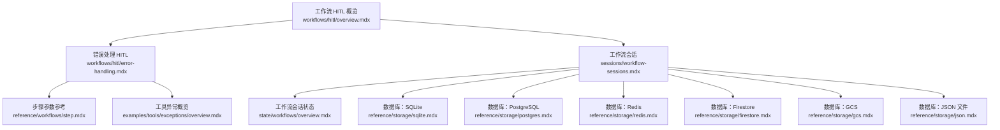
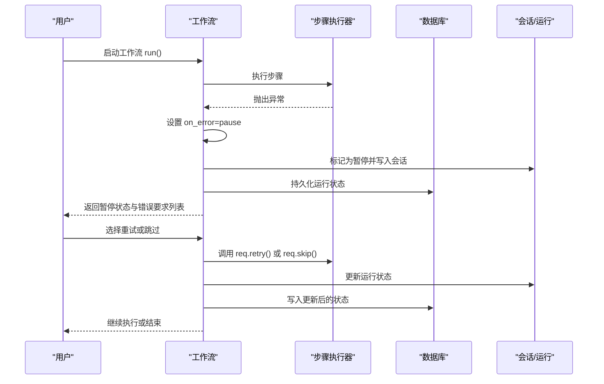
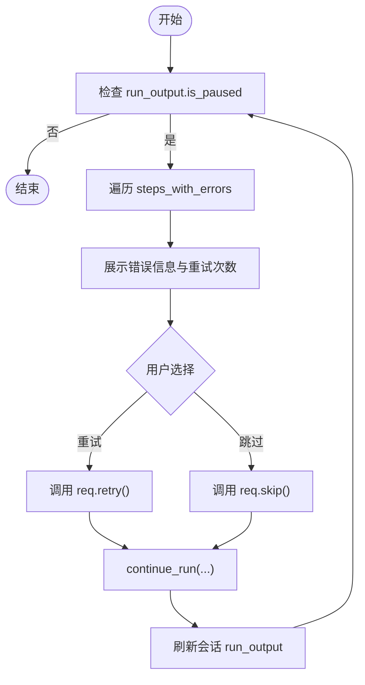
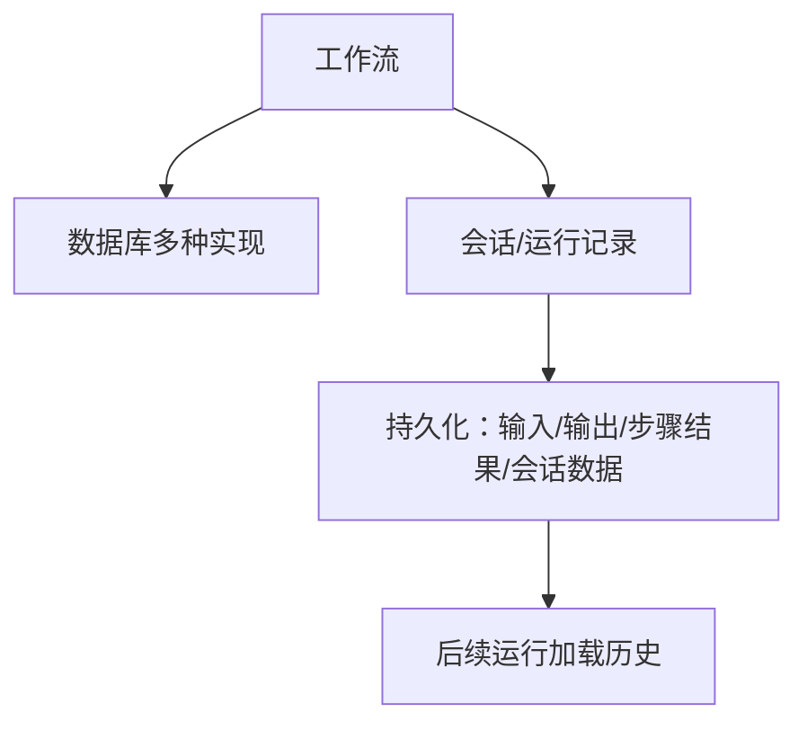
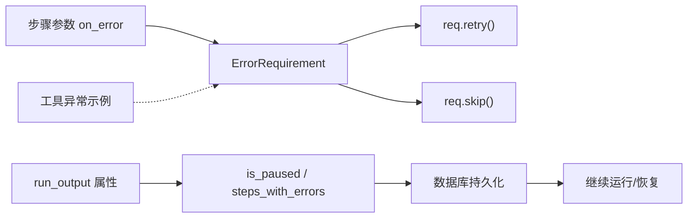

# 错误处理中的 HITL

<cite>
**本文引用的文件**
- [错误处理 HITL](file://workflows/hitl/error-handling.mdx)
- [工作流 HITL 概览](file://workflows/hitl/overview.mdx)
- [工作流步骤参数](file://reference/workflows/step.mdx)
- [工作流会话](file://sessions/workflow-sessions.mdx)
- [工作流会话状态](file://state/workflows/overview.mdx)
- [数据库：SQLite](file://reference/storage/sqlite.mdx)
- [数据库：PostgreSQL](file://reference/storage/postgres.mdx)
- [数据库：Redis](file://reference/storage/redis.mdx)
- [数据库：Firestore](file://reference/storage/firestore.mdx)
- [数据库：GCS](file://reference/storage/gcs.mdx)
- [数据库：JSON 文件](file://reference/storage/json.mdx)
- [工具异常概览](file://examples/tools/exceptions/overview.mdx)
</cite>

## 目录
1. [简介](#简介)
2. [项目结构](#项目结构)
3. [核心组件](#核心组件)
4. [架构总览](#架构总览)
5. [详细组件分析](#详细组件分析)
6. [依赖关系分析](#依赖关系分析)
7. [性能考量](#性能考量)
8. [故障排除指南](#故障排除指南)
9. [结论](#结论)
10. [附录](#附录)

## 简介
本技术文档聚焦于“工作流执行中的 HITL（人机协同）错误处理”。内容涵盖：
- 在步骤级启用 on_error 参数的三种行为：fail、skip、pause，并解释 pause 如何触发错误暂停与用户决策。
- 错误暂停时的用户交互流程：错误信息展示与用户选择（重试或跳过）。
- 完整实现示例：如何在步骤级别实现错误暂停与用户决策。
- 错误处理与数据库持久化的结合使用：通过数据库保存会话与运行历史，确保暂停后可恢复。
- 最佳实践与常见问题排查建议。

## 项目结构
围绕错误处理 HITL 的相关文档主要分布在以下位置：
- 工作流 HITL 与错误处理专题文档
- 步骤参数参考（含 on_error）
- 数据库存储与会话管理
- 示例与工具异常处理

图表来源
- [工作流 HITL 概览](file://workflows/hitl/overview.mdx)
- [错误处理 HITL](file://workflows/hitl/error-handling.mdx)
- [工作流步骤参数](file://reference/workflows/step.mdx)
- [工作流会话](file://sessions/workflow-sessions.mdx)
- [工作流会话状态](file://state/workflows/overview.mdx)
- [数据库：SQLite](file://reference/storage/sqlite.mdx)
- [数据库：PostgreSQL](file://reference/storage/postgres.mdx)
- [数据库：Redis](file://reference/storage/redis.mdx)
- [数据库：Firestore](file://reference/storage/firestore.mdx)
- [数据库：GCS](file://reference/storage/gcs.mdx)
- [数据库：JSON 文件](file://reference/storage/json.mdx)
- [工具异常概览](file://examples/tools/exceptions/overview.mdx)

章节来源
- [工作流 HITL 概览](file://workflows/hitl/overview.mdx)
- [错误处理 HITL](file://workflows/hitl/error-handling.mdx)
- [工作流步骤参数](file://reference/workflows/step.mdx)
- [工作流会话](file://sessions/workflow-sessions.mdx)
- [工作流会话状态](file://state/workflows/overview.mdx)
- [数据库：SQLite](file://reference/storage/sqlite.mdx)
- [数据库：PostgreSQL](file://reference/storage/postgres.mdx)
- [数据库：Redis](file://reference/storage/redis.mdx)
- [数据库：Firestore](file://reference/storage/firestore.mdx)
- [数据库：GCS](file://reference/storage/gcs.mdx)
- [数据库：JSON 文件](file://reference/storage/json.mdx)
- [工具异常概览](file://examples/tools/exceptions/overview.mdx)

## 核心组件
- 步骤级错误处理 on_error 配置
  - fail：默认行为，失败即终止工作流。
  - skip：失败时跳过该步骤并继续后续步骤。
  - pause：失败时暂停，等待用户决定重试或跳过。
- 错误要求对象 ErrorRequirement
  - 属性：step_name、error_message、error_type、retry_count。
  - 方法：retry()、skip()。
- 数据库与会话持久化
  - 工作流需要配置数据库以支持 HITL 的状态持久化与恢复。
  - 支持 SQLite、PostgreSQL、Redis、Firestore、GCS、JSON 文件等数据库类型。
- 会话与运行历史
  - 工作流会话记录每次运行的输入、输出、步骤结果与会话数据。
  - 可启用工作流历史，使后续步骤能读取之前的运行上下文。

章节来源
- [错误处理 HITL](file://workflows/hitl/error-handling.mdx)
- [工作流 HITL 概览](file://workflows/hitl/overview.mdx)
- [工作流步骤参数](file://reference/workflows/step.mdx)
- [工作流会话](file://sessions/workflow-sessions.mdx)
- [工作流会话状态](file://state/workflows/overview.mdx)
- [数据库：SQLite](file://reference/storage/sqlite.mdx)
- [数据库：PostgreSQL](file://reference/storage/postgres.mdx)
- [数据库：Redis](file://reference/storage/redis.mdx)
- [数据库：Firestore](file://reference/storage/firestore.mdx)
- [数据库：GCS](file://reference/storage/gcs.mdx)
- [数据库：JSON 文件](file://reference/storage/json.mdx)

## 架构总览
下图展示了工作流在发生错误时，如何通过 on_error=pause 触发错误暂停，并与数据库持久化、会话管理协同，最终由用户进行重试或跳过的决策流程。

图表来源
- [错误处理 HITL](file://workflows/hitl/error-handling.mdx)
- [工作流 HITL 概览](file://workflows/hitl/overview.mdx)
- [工作流会话](file://sessions/workflow-sessions.mdx)

## 详细组件分析

### on_error 参数详解与行为对比
- fail（默认）：遇到异常立即失败，不暂停。
- skip：遇到异常跳过当前步骤，继续下一个步骤；若后续步骤依赖前一步输入，其 previous_step_content 将为 None。
- pause：遇到异常暂停，生成 ErrorRequirement，等待用户选择重试或跳过；重试会再次执行相同输入，retry_count 增加。

章节来源
- [错误处理 HITL](file://workflows/hitl/error-handling.mdx)
- [工作流步骤参数](file://reference/workflows/step.mdx)

### 错误暂停时的用户交互流程
- 当 run_output.is_paused 为真时，遍历 run_output.steps_with_errors 获取每个错误要求。
- 展示错误信息（如 error_message），提示用户选择重试或跳过。
- 用户选择后调用 req.retry() 或 req.skip()，然后继续运行。
- 对于流式工作流，可在事件流中检测 StepPausedEvent 并在会话中获取最新 run_output 进行处理。

图表来源
- [错误处理 HITL](file://workflows/hitl/error-handling.mdx)
- [工作流 HITL 概览](file://workflows/hitl/overview.mdx)

章节来源
- [错误处理 HITL](file://workflows/hitl/error-handling.mdx)
- [工作流 HITL 概览](file://workflows/hitl/overview.mdx)

### 错误处理与数据库持久化的结合
- 工作流需要配置数据库（如 SQLite、PostgreSQL、Redis、Firestore、GCS、JSON 文件）以支持 HITL 的状态持久化。
- 每次运行会创建唯一的 run_id，存储输入、输出、步骤结果与会话数据，并在后续运行中加载历史。
- 通过 workflow.get_session() 与 workflow.get_session_name() 等接口管理会话与命名。

图表来源
- [工作流会话](file://sessions/workflow-sessions.mdx)
- [数据库：SQLite](file://reference/storage/sqlite.mdx)
- [数据库：PostgreSQL](file://reference/storage/postgres.mdx)
- [数据库：Redis](file://reference/storage/redis.mdx)
- [数据库：Firestore](file://reference/storage/firestore.mdx)
- [数据库：GCS](file://reference/storage/gcs.mdx)
- [数据库：JSON 文件](file://reference/storage/json.mdx)

章节来源
- [工作流会话](file://sessions/workflow-sessions.mdx)
- [数据库：SQLite](file://reference/storage/sqlite.mdx)
- [数据库：PostgreSQL](file://reference/storage/postgres.mdx)
- [数据库：Redis](file://reference/storage/redis.mdx)
- [数据库：Firestore](file://reference/storage/firestore.mdx)
- [数据库：GCS](file://reference/storage/gcs.mdx)
- [数据库：JSON 文件](file://reference/storage/json.mdx)

### 完整实现示例（步骤级错误暂停与用户决策）
- 在步骤上设置 on_error=OnError.pause，当步骤失败时暂停并生成 ErrorRequirement。
- 循环检查 run_output.is_paused，展示错误信息，根据用户输入调用 req.retry() 或 req.skip()。
- 使用 workflow.continue_run() 恢复执行，直至完成或再次暂停。

章节来源
- [错误处理 HITL](file://workflows/hitl/error-handling.mdx)

### 与其他 HITL 类型的关系
- 错误处理（pause）与确认（requires_confirmation）、用户输入（requires_user_input）、路由选择（Router）共同构成工作流的多类型 HITL。
- 错误处理仅在 Step 级别生效；其他类型在不同原语上支持确认或输入。

章节来源
- [工作流 HITL 概览](file://workflows/hitl/overview.mdx)

### 流式工作流中的错误处理
- 在流式运行中监听 StepPausedEvent，定位暂停点。
- 从会话获取最新 run_output，处理 steps_with_errors，再继续流式执行。

章节来源
- [错误处理 HITL](file://workflows/hitl/error-handling.mdx)
- [工作流 HITL 概览](file://workflows/hitl/overview.mdx)

## 依赖关系分析
- 步骤参数 on_error 与 ErrorRequirement 的方法（retry、skip）直接控制错误处理行为。
- run_output 的属性（如 is_paused、steps_with_errors）用于判断是否暂停以及暂停原因。
- 数据库与会话管理为 HITL 提供持久化基础，保证暂停后可恢复。
- 工具异常处理示例可作为补充策略，与工作流级错误暂停形成互补。

图表来源
- [错误处理 HITL](file://workflows/hitl/error-handling.mdx)
- [工作流步骤参数](file://reference/workflows/step.mdx)
- [工作流 HITL 概览](file://workflows/hitl/overview.mdx)
- [工具异常概览](file://examples/tools/exceptions/overview.mdx)

章节来源
- [错误处理 HITL](file://workflows/hitl/error-handling.mdx)
- [工作流步骤参数](file://reference/workflows/step.mdx)
- [工作流 HITL 概览](file://workflows/hitl/overview.mdx)
- [工具异常概览](file://examples/tools/exceptions/overview.mdx)

## 性能考量
- 重试策略应限制最大尝试次数，避免无限循环与资源浪费。
- 对瞬时性错误（如网络超时、限流）采用指数退避或固定延迟后再重试。
- 对无效输入或不可恢复错误直接跳过，减少不必要的重复执行。
- 在流式工作流中，及时消费事件流并尽快调用 continue_run，避免长时间阻塞。

## 故障排除指南
- 未配置数据库导致无法暂停或恢复
  - 现象：工作流在错误时不会暂停，或暂停后无法恢复。
  - 处理：为工作流配置数据库（推荐 SQLite 用于开发，PostgreSQL 用于生产）。
- 未正确处理 ErrorRequirement
  - 现象：run_output.is_paused 为真但未处理 steps_with_errors。
  - 处理：遍历 steps_with_errors，调用 req.retry() 或 req.skip()，再继续运行。
- 重试次数过多导致性能问题
  - 现象：反复重试占用资源。
  - 处理：在业务逻辑中限制 retry_count，超过阈值自动跳过。
- 流式场景未及时继续
  - 现象：事件流已暂停但未继续。
  - 处理：监听 StepPausedEvent 后，获取最新 run_output 并调用 continue_run。

章节来源
- [错误处理 HITL](file://workflows/hitl/error-handling.mdx)
- [工作流 HITL 概览](file://workflows/hitl/overview.mdx)
- [工作流会话](file://sessions/workflow-sessions.mdx)
- [数据库：SQLite](file://reference/storage/sqlite.mdx)
- [数据库：PostgreSQL](file://reference/storage/postgres.mdx)

## 结论
通过在步骤上启用 on_error=pause，工作流可以在错误发生时暂停并交由用户决定重试或跳过，配合数据库持久化与会话管理，实现可靠的错误处理与恢复机制。结合合理的重试策略与流式处理，可显著提升工作流的鲁棒性与用户体验。

## 附录
- 相关参考与示例
  - [工作流 HITL 概览](file://workflows/hitl/overview.mdx)
  - [错误处理 HITL](file://workflows/hitl/error-handling.mdx)
  - [工作流步骤参数](file://reference/workflows/step.mdx)
  - [工作流会话](file://sessions/workflow-sessions.mdx)
  - [工作流会话状态](file://state/workflows/overview.mdx)
  - [数据库：SQLite](file://reference/storage/sqlite.mdx)
  - [数据库：PostgreSQL](file://reference/storage/postgres.mdx)
  - [数据库：Redis](file://reference/storage/redis.mdx)
  - [数据库：Firestore](file://reference/storage/firestore.mdx)
  - [数据库：GCS](file://reference/storage/gcs.mdx)
  - [数据库：JSON 文件](file://reference/storage/json.mdx)
  - [工具异常概览](file://examples/tools/exceptions/overview.mdx)