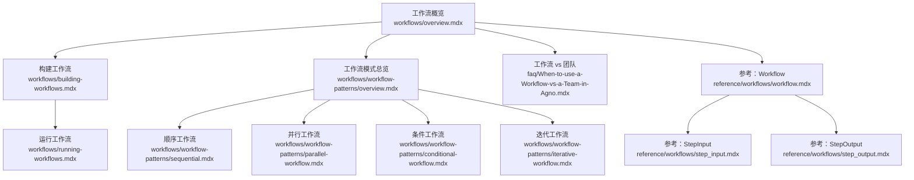
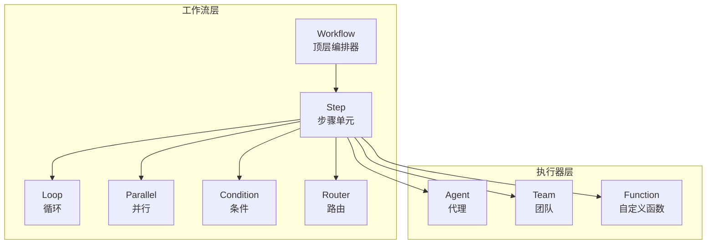
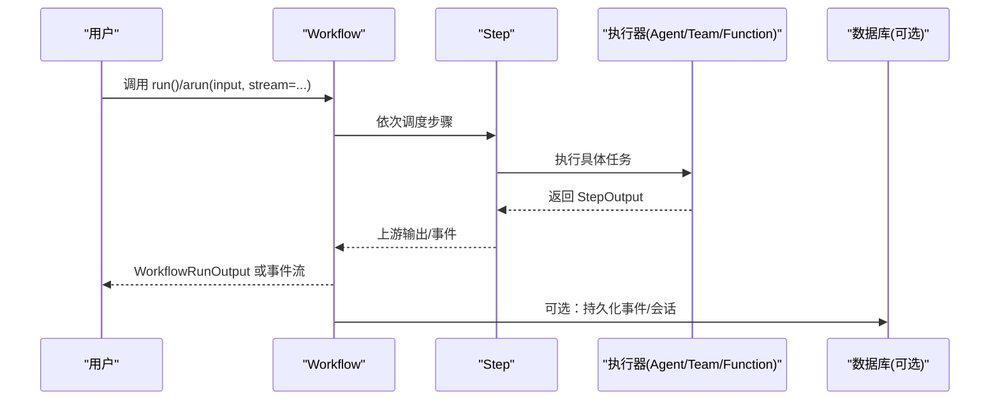
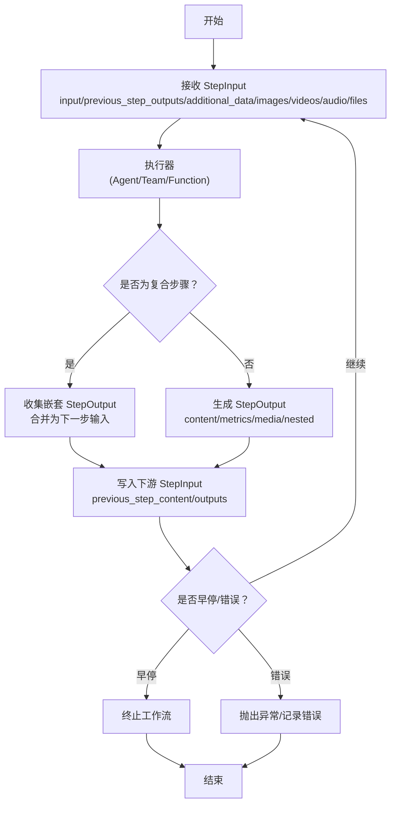
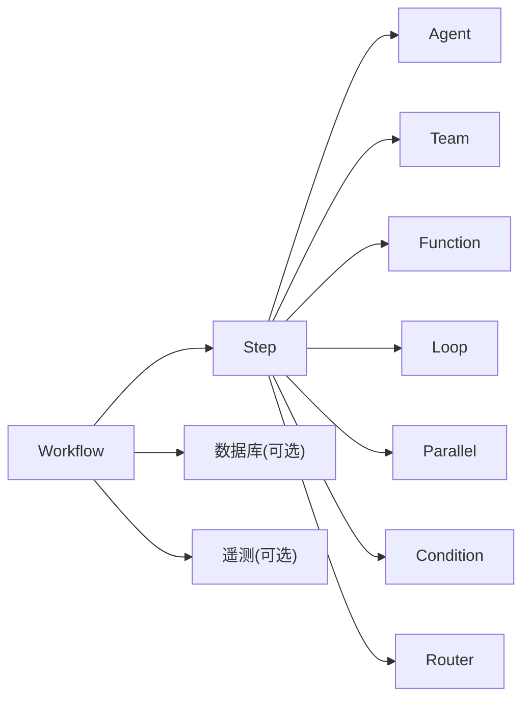

# 工作流基础概念

<cite>
**本文引用的文件**
- [工作流概览](file://workflows/overview.mdx)
- [构建工作流](file://workflows/building-workflows.mdx)
- [运行工作流](file://workflows/running-workflows.mdx)
- [顺序工作流](file://workflows/workflow-patterns/sequential.mdx)
- [并行工作流](file://workflows/workflow-patterns/parallel-workflow.mdx)
- [条件工作流](file://workflows/workflow-patterns/conditional-workflow.mdx)
- [迭代工作流](file://workflows/workflow-patterns/iterative-workflow.mdx)
- [工作流模式总览](file://workflows/workflow-patterns/overview.mdx)
- [工作流 vs 团队](file://faq/When-to-use-a-Workflow-vs-a-Team-in-Agno.mdx)
- [工作流参考：Workflow](file://reference/workflows/workflow.mdx)
- [工作流参考：StepInput](file://reference/workflows/step_input.mdx)
- [工作流参考：StepOutput](file://reference/workflows/step_output.mdx)
</cite>

## 目录
1. [引言](#引言)
2. [项目结构](#项目结构)
3. [核心组件](#核心组件)
4. [架构总览](#架构总览)
5. [详细组件分析](#详细组件分析)
6. [依赖关系分析](#依赖关系分析)
7. [性能考量](#性能考量)
8. [故障排查指南](#故障排查指南)
9. [结论](#结论)
10. [附录](#附录)

## 引言
本篇文档系统阐述工作流（Workflow）的基础概念与实现原理，重点覆盖以下方面：
- 工作流如何编排代理（Agent）、团队（Team）与自定义函数（Function）
- 步骤类型与组合方式：顺序、并行、条件分支、循环迭代
- 执行模式：同步/异步、流式输出、事件流
- 输入输出机制与数据流传递：StepInput/StepOutput 的作用与流转
- 简单工作流示例与执行流程图
- 何时使用工作流，以及与团队的区别

## 项目结构
围绕“工作流”主题，知识库提供了从高层概览到具体模式、再到参考与示例的完整路径：
- 概念与用法：工作流概览、构建工作流、运行工作流
- 模式与实践：顺序、并行、条件、循环等模式页面
- 参考与接口：Workflow 类参数、StepInput/StepOutput 字段
- 对比与选型：工作流 vs 团队

**图表来源**
- [工作流概览:1-102](file://workflows/overview.mdx#L1-L102)
- [构建工作流:1-59](file://workflows/building-workflows.mdx#L1-L59)
- [运行工作流:1-619](file://workflows/running-workflows.mdx#L1-L619)
- [工作流模式总览:30-92](file://workflows/workflow-patterns/overview.mdx#L30-L92)
- [顺序工作流:1-50](file://workflows/workflow-patterns/sequential.mdx#L1-L50)
- [并行工作流:1-54](file://workflows/workflow-patterns/parallel-workflow.mdx#L1-L54)
- [条件工作流:1-100](file://workflows/workflow-patterns/conditional-workflow.mdx#L1-L100)
- [迭代工作流:1-57](file://workflows/workflow-patterns/iterative-workflow.mdx#L1-L57)
- [工作流 vs 团队:1-44](file://faq/When-to-use-a-Workflow-vs-a-Team-in-Agno.mdx#L1-L44)
- [工作流参考：Workflow:1-306](file://reference/workflows/workflow.mdx#L1-L306)
- [工作流参考：StepInput:1-29](file://reference/workflows/step_input.mdx#L1-L29)
- [工作流参考：StepOutput:1-25](file://reference/workflows/step_output.mdx#L1-L25)

**章节来源**
- [工作流概览:1-102](file://workflows/overview.mdx#L1-L102)
- [构建工作流:1-59](file://workflows/building-workflows.mdx#L1-L59)
- [运行工作流:1-619](file://workflows/running-workflows.mdx#L1-L619)
- [工作流模式总览:30-92](file://workflows/workflow-patterns/overview.mdx#L30-L92)

## 核心组件
- Workflow：顶层编排器，管理整个执行过程，支持同步/异步运行、流式输出、事件存储与遥测控制。
- Step：工作流的最小执行单元，封装一个执行器（Agent、Team 或自定义函数），确保职责单一、可维护性强。
- Loop：重复执行一组步骤直至满足结束条件或达到最大迭代次数，适合质量控制与迭代优化。
- Parallel：并发执行多个步骤，结果在下一步统一汇聚，显著提升独立任务的吞吐。
- Condition：基于评估函数进行分支选择，支持 if/else 分支，实现动态路由。
- Router：显式指定下一步执行路径，形成更灵活的分支逻辑。

这些组件共同构成“可预测、可审计”的流水线式执行模型，适用于结构化流程与复杂管道。

**章节来源**
- [构建工作流:9-16](file://workflows/building-workflows.mdx#L9-L16)
- [工作流参考：Workflow:7-33](file://reference/workflows/workflow.mdx#L7-L33)

## 架构总览
下图展示了工作流的高层架构与关键交互：

**图表来源**
- [构建工作流:11-16](file://workflows/building-workflows.mdx#L11-L16)
- [工作流参考：Workflow:35-82](file://reference/workflows/workflow.mdx#L35-L82)

## 详细组件分析

### 步骤类型与组合
- 代理（Agent）：面向明确指令与工具集的单体执行者，适合确定性任务。
- 团队（Team）：多代理协作，适合需要分工与协同的复杂子任务。
- 自定义函数（Function）：纯 Python 函数，用于数据处理、规则判断、中间态转换等。

组合方式：
- 顺序：前一步输出作为下一步输入，形成线性流水线。
- 并行：多个独立步骤同时执行，合并结果后进入下一步。
- 条件：根据评估结果在 if/else 路径间切换。
- 循环：在满足条件时重复执行，常用于质量控制与迭代优化。

**章节来源**
- [工作流概览:58-68](file://workflows/overview.mdx#L58-L68)
- [构建工作流:11-16](file://workflows/building-workflows.mdx#L11-L16)

### 执行模式
- 同步执行：Workflow.run() 返回 WorkflowRunOutput；支持流式输出（Iterator[WorkflowRunOutputEvent]）。
- 异步执行：Workflow.arun() 支持异步流式事件；可配置 WebSocket 实时通信。
- 事件流：可选择仅流式工作流事件或同时包含执行器内部事件；可过滤特定事件以降低噪声。
- 存储与审计：可自动存储执行事件，便于调试、合规与性能分析。

**图表来源**
- [运行工作流:7-11](file://workflows/running-workflows.mdx#L7-L11)
- [运行工作流:462-525](file://workflows/running-workflows.mdx#L462-L525)
- [运行工作流:527-598](file://workflows/running-workflows.mdx#L527-L598)

**章节来源**
- [运行工作流:7-11](file://workflows/running-workflows.mdx#L7-L11)
- [运行工作流:199-364](file://workflows/running-workflows.mdx#L199-L364)
- [运行工作流:462-525](file://workflows/running-workflows.mdx#L462-L525)
- [运行工作流:527-598](file://workflows/running-workflows.mdx#L527-L598)

### 输入输出机制与数据流
- StepInput：每步的输入上下文，包含主输入、上一步内容、所有历史输出、附加数据与媒体输入等，并提供便捷查询方法。
- StepOutput：每步的输出载体，包含内容、媒体、指标、嵌套输出（复合步骤如 Loop/Condition/Parallel）等；支持早停与错误标记。
- 数据流：顺序执行时，上游 StepOutput.content 作为下游 StepInput.input 或 previous_step_content；并行/条件/循环通过组合 StepOutput 形成下一阶段输入。

**图表来源**
- [工作流参考：StepInput:6-27](file://reference/workflows/step_input.mdx#L6-L27)
- [工作流参考：StepOutput:6-24](file://reference/workflows/step_output.mdx#L6-L24)

**章节来源**
- [工作流参考：StepInput:1-29](file://reference/workflows/step_input.mdx#L1-L29)
- [工作流参考：StepOutput:1-25](file://reference/workflows/step_output.mdx#L1-L25)

### 模式详解与示例

#### 顺序执行
- 特点：严格的先后顺序，清晰的数据传递链路。
- 典型场景：研究 → 数据预处理 → 内容创作 → 最终审阅。
- 示例要点：使用 Step/Workflow 定义线性步骤；自定义函数可直接返回 StepOutput 以接入标准化数据流。

**章节来源**
- [顺序工作流:1-50](file://workflows/workflow-patterns/sequential.mdx#L1-L50)

#### 并行执行
- 特点：多个独立任务同时进行，显著缩短整体耗时。
- 注意事项：共享状态更新需协调，避免竞态。
- 示例要点：使用 Parallel 包裹多个 Step，后续合成步骤统一汇总。

**章节来源**
- [并行工作流:1-54](file://workflows/workflow-patterns/parallel-workflow.mdx#L1-L54)

#### 条件分支
- 特点：基于评估函数在 if/else 路径间切换，实现动态路由。
- 示例要点：Condition(evaluator, steps, else_steps)；未命中 else 时可跳过该步骤继续后续。

**章节来源**
- [条件工作流:1-100](file://workflows/workflow-patterns/conditional-workflow.mdx#L1-L100)

#### 迭代执行
- 特点：在满足条件时重复执行，适合质量控制与迭代优化。
- 示例要点：Loop(steps, end_condition, max_iterations)；默认迭代输出前向传播，也可关闭。

**章节来源**
- [迭代工作流:1-57](file://workflows/workflow-patterns/iterative-workflow.mdx#L1-L57)

### 简单工作流示例（步骤定义与执行）
- 基本步骤：定义若干 Step（Agent/Team/Function），按顺序组织为 Workflow。
- 执行入口：Workflow.run()/arun()；打印输出可用 Workflow.print_response()/aprint_response()。
- 流式与事件：设置 stream/stream_events 控制输出粒度；事件类型涵盖工作流、步骤、并行、条件、循环、路由等。

**章节来源**
- [构建工作流:34-59](file://workflows/building-workflows.mdx#L34-L59)
- [运行工作流:11-71](file://workflows/running-workflows.mdx#L11-L71)
- [运行工作流:199-364](file://workflows/running-workflows.mdx#L199-L364)

## 依赖关系分析
- 组件内聚与耦合
  - Step 封装单一执行器，内聚性高、耦合度低，便于替换与测试。
  - 复合步骤（Loop/Parallel/Condition/Router）通过 StepOutput 组合，保持接口一致。
- 外部依赖
  - 数据库：可选的事件存储与会话持久化（SQLite/PostgreSQL 等）。
  - 遥测：可禁用以保护隐私或降低开销。
- 接口契约
  - 自定义函数需遵循 StepInput/StepOutput 约定，保证与工作流系统的无缝集成。

**图表来源**
- [构建工作流:11-16](file://workflows/building-workflows.mdx#L11-L16)
- [运行工作流:600-612](file://workflows/running-workflows.mdx#L600-L612)
- [工作流参考：Workflow:15-32](file://reference/workflows/workflow.mdx#L15-L32)

**章节来源**
- [构建工作流:11-16](file://workflows/building-workflows.mdx#L11-L16)
- [运行工作流:600-612](file://workflows/running-workflows.mdx#L600-L612)
- [工作流参考：Workflow:15-32](file://reference/workflows/workflow.mdx#L15-L32)

## 性能考量
- 并行优先：对独立任务使用 Parallel 显著缩短端到端时间。
- 事件过滤：生产环境可跳过高频事件（如 step_started/completed）以减少存储与网络开销。
- 输出聚合：并行/循环后的合成步骤应尽量轻量化，避免成为瓶颈。
- 早停与短路：在条件/循环中合理设置退出条件，避免无效重算。
- 会话缓存：开启会话缓存可加速频繁访问的上下文读取。

## 故障排查指南
- 事件存储与回放：启用 store_events 并通过 events_to_skip 过滤噪声，结合 run_response.events 与数据库 runs 列定位问题。
- 事件类型识别：区分工作流事件（WorkflowStarted/Completed/Error）、步骤事件（StepStarted/Completed/Error）、并行/条件/循环/路由事件，有助于快速定位失败阶段。
- 执行器事件过滤：必要时关闭 stream_executor_events，聚焦工作流自身事件。
- 调试模式：在 Workflow 参数中启用 debug_mode 获取更详细的执行信息。

**章节来源**
- [运行工作流:527-598](file://workflows/running-workflows.mdx#L527-L598)
- [运行工作流:366-413](file://workflows/running-workflows.mdx#L366-L413)

## 结论
工作流通过“步骤 + 复合控制结构”的组合，提供了可预测、可审计、可扩展的多执行器编排能力。它适用于结构化流程与复杂管道，而团队更适合开放式的协作与推理。选择工作流还是团队，取决于任务是否具备明确的步骤边界与可重复性。

## 附录

### 何时使用工作流 vs 团队
- 使用工作流：需要可预测的多步执行、并行、条件分支、循环迭代、结构化数据管线与审计追踪。
- 使用团队：需要灵活协作、多代理分工、动态决策与开放式问题求解。

**章节来源**
- [工作流 vs 团队:10-43](file://faq/When-to-use-a-Workflow-vs-a-Team-in-Agno.mdx#L10-L43)

### 关键参考清单
- Workflow 类参数与方法：见参考文档
- StepInput/StepOutput 字段与辅助方法：见参考文档
- 模式与示例：顺序/并行/条件/循环工作流页面

**章节来源**
- [工作流参考：Workflow:7-306](file://reference/workflows/workflow.mdx#L7-L306)
- [工作流参考：StepInput:1-29](file://reference/workflows/step_input.mdx#L1-L29)
- [工作流参考：StepOutput:1-25](file://reference/workflows/step_output.mdx#L1-L25)