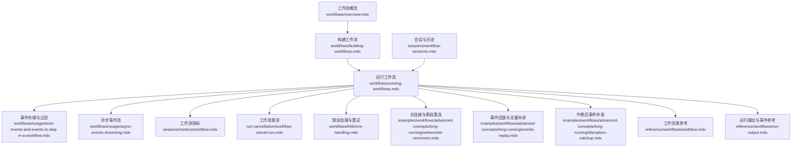
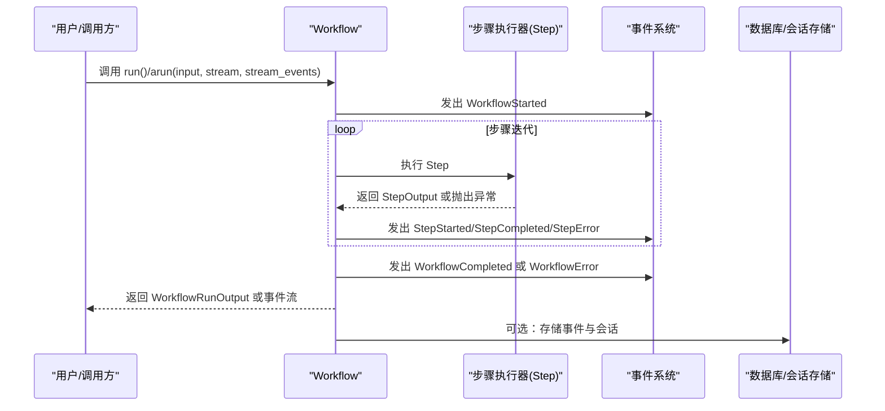
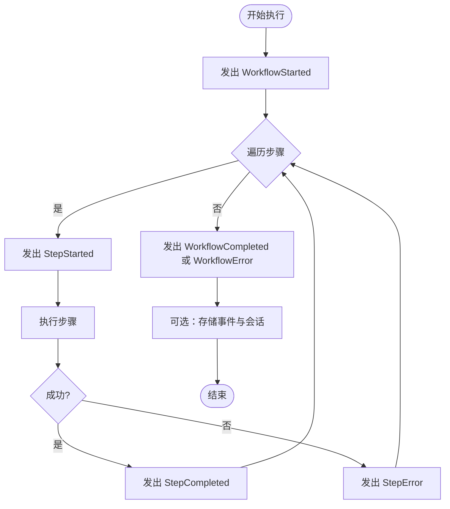
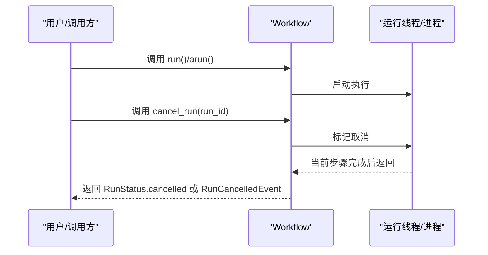
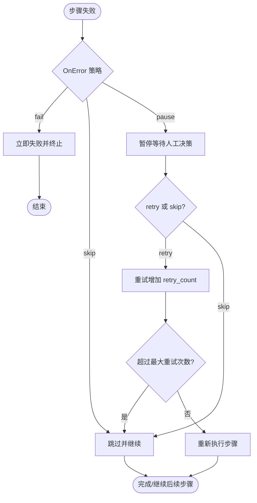
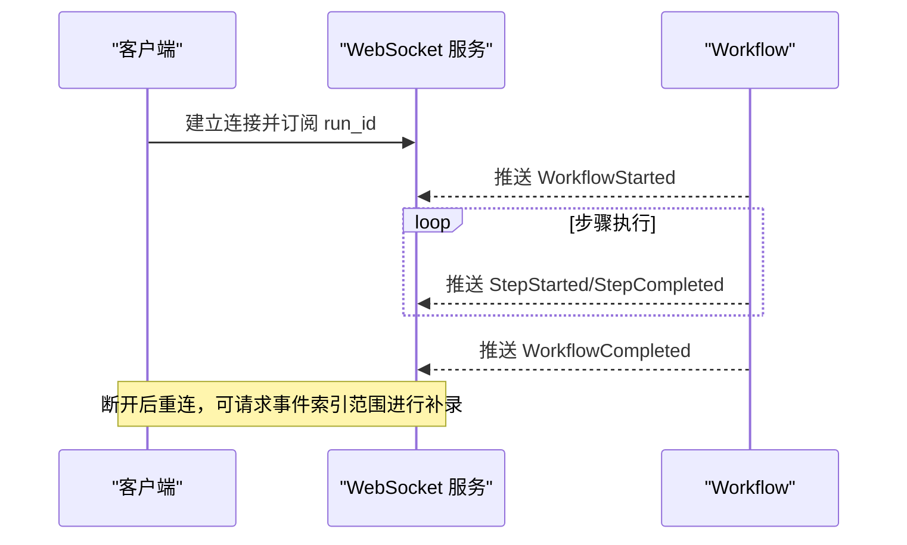
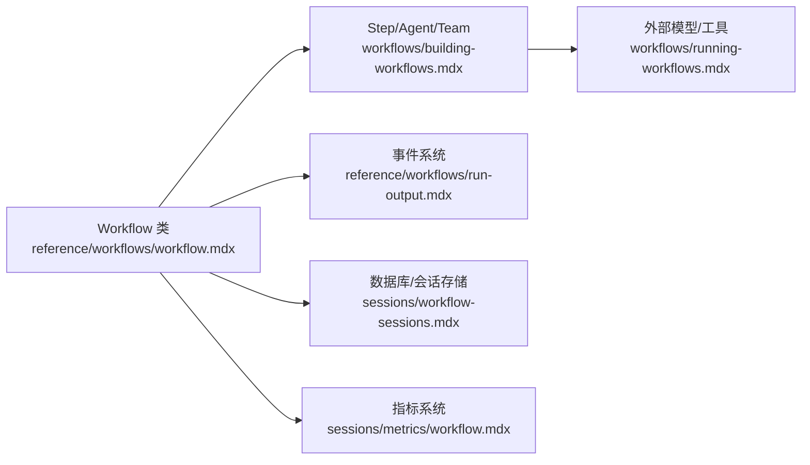

# 工作流执行管理

<cite>
**本文引用的文件**
- [工作流概览](file://workflows/overview.mdx)
- [构建工作流](file://workflows/building-workflows.mdx)
- [运行工作流](file://workflows/running-workflows.mdx)
- [会话与历史](file://sessions/workflow-sessions.mdx)
- [事件存储与跳过](file://workflows/usage/store-events-and-events-to-skip-in-a-workflow.mdx)
- [异步事件流](file://workflows/usage/async-events-streaming.mdx)
- [长连接与断连重连](file://examples/workflows/advanced-concepts/long-running/websocket-reconnect.mdx)
- [事件回放与全量补录](file://examples/workflows/advanced-concepts/long-running/events-replay.mdx)
- [中断后事件补录](file://examples/workflows/advanced-concepts/long-running/disruption-catchup.mdx)
- [工作流取消](file://run-cancellation/workflow-cancel-run.mdx)
- [工作流取消（示例）](file://workflows/usage/workflow-cancellation.mdx)
- [取消运行示例](file://examples/workflows/advanced-concepts/run-control/cancel-run.mdx)
- [错误处理与重试](file://workflows/hitl/error-handling.mdx)
- [条件与会话状态重试](file://examples/workflows/cel-expressions/condition/cel-session-state.mdx)
- [工作流指标](file://sessions/metrics/workflow.mdx)
- [指标概览](file://sessions/metrics/overview.mdx)
- [工作流类参考](file://reference/workflows/workflow.mdx)
- [工作流运行输出与事件](file://reference/workflows/run-output.mdx)
</cite>

## 目录
1. [简介](#简介)
2. [项目结构](#项目结构)
3. [核心组件](#核心组件)
4. [架构总览](#架构总览)
5. [详细组件分析](#详细组件分析)
6. [依赖关系分析](#依赖关系分析)
7. [性能考量](#性能考量)
8. [故障排查指南](#故障排查指南)
9. [结论](#结论)
10. [附录](#附录)

## 简介
本文件系统化阐述工作流执行管理的技术细节，覆盖执行状态监控、进度跟踪、结果收集；启动与停止控制（含取消执行与错误处理）；流式输出与实时反馈；性能监控与指标采集；调试技巧与问题排查；重试机制与故障恢复策略；以及执行效率优化与资源管理最佳实践。目标是帮助读者在实际工程中可靠地设计、运行与运维复杂的工作流。

## 项目结构
围绕工作流执行管理，知识库提供了从“概念到实现”的完整路径：先理解工作流是什么、如何构建与运行，再掌握事件流、指标、取消与重试等高级能力，并通过会话与历史实现可追溯性与复用。

图表来源
- [工作流概览:1-102](file://workflows/overview.mdx#L1-L102)
- [构建工作流:1-59](file://workflows/building-workflows.mdx#L1-L59)
- [运行工作流:1-619](file://workflows/running-workflows.mdx#L1-L619)
- [事件存储与跳过:1-166](file://workflows/usage/store-events-and-events-to-skip-in-a-workflow.mdx#L1-L166)
- [异步事件流:1-141](file://workflows/usage/async-events-streaming.mdx#L1-L141)
- [长连接与断连重连:39-78](file://examples/workflows/advanced-concepts/long-running/websocket-reconnect.mdx#L39-L78)
- [事件回放与全量补录:48-86](file://examples/workflows/advanced-concepts/long-running/events-replay.mdx#L48-L86)
- [中断后事件补录:46-86](file://examples/workflows/advanced-concepts/long-running/disruption-catchup.mdx#L46-L86)
- [工作流取消:89-126](file://run-cancellation/workflow-cancel-run.mdx#L89-L126)
- [错误处理与重试:42-183](file://workflows/hitl/error-handling.mdx#L42-L183)
- [工作流指标:1-38](file://sessions/metrics/workflow.mdx#L1-L38)
- [指标概览:1-38](file://sessions/metrics/overview.mdx#L1-L38)
- [工作流类参考:1-306](file://reference/workflows/workflow.mdx#L1-L306)
- [运行输出与事件参考:1-253](file://reference/workflows/run-output.mdx#L1-L253)

章节来源
- [工作流概览:1-102](file://workflows/overview.mdx#L1-L102)
- [构建工作流:1-59](file://workflows/building-workflows.mdx#L1-L59)
- [运行工作流:1-619](file://workflows/running-workflows.mdx#L1-L619)

## 核心组件
- 工作流（Workflow）：顶层编排器，负责步骤调度、事件流、指标与会话管理。
- 步骤（Step）：最小执行单元，可由 Agent、Team 或自定义函数组成。
- 条件（Condition）、并行（Parallel）、循环（Loop）、路由（Router）：控制流与数据流的关键构造。
- 运行输出（WorkflowRunOutput）与事件（WorkflowRunOutputEvent）：统一承载结果、中间事件与指标。
- 会话（WorkflowSession）与历史（History）：持久化执行上下文，支持跨运行复用与审计。
- 取消（cancel_run）与错误处理（OnError）：保障长任务可控与稳健性。
- 指标（Metrics）：工作流整体与步骤级时延、Token 使用等关键指标。

章节来源
- [构建工作流:1-59](file://workflows/building-workflows.mdx#L1-L59)
- [运行工作流:1-619](file://workflows/running-workflows.mdx#L1-L619)
- [工作流类参考:1-306](file://reference/workflows/workflow.mdx#L1-L306)
- [运行输出与事件参考:1-253](file://reference/workflows/run-output.mdx#L1-L253)
- [会话与历史:213-242](file://sessions/workflow-sessions.mdx#L213-L242)

## 架构总览
下图展示工作流执行的端到端流程：输入经由 Workflow.run/arun 触发，按步骤顺序或控制结构执行，期间产生丰富的事件流；事件既可实时消费，也可持久化存储；运行结束后汇总为 WorkflowRunOutput 并附带 Metrics；同时支持取消与错误处理策略。

图表来源
- [运行工作流:199-526](file://workflows/running-workflows.mdx#L199-L526)
- [工作流类参考:37-82](file://reference/workflows/workflow.mdx#L37-L82)
- [运行输出与事件参考:28-238](file://reference/workflows/run-output.mdx#L28-L238)

## 详细组件分析

### 执行状态监控与进度跟踪
- 事件类型：WorkflowStarted、StepStarted、StepCompleted、WorkflowCompleted、WorkflowError、StepError 等。
- 实时进度：通过 stream=True 与 stream_events=True 获取细粒度事件，结合事件索引与时间戳进行进度可视化。
- 存储与检索：store_events 控制是否持久化事件；events_to_skip 可过滤冗余事件以降低存储与噪声。
- 会话与历史：通过 session_id 关联多次运行，使用 get_session/get_session_state 获取上下文，支持历史复用。

图表来源
- [运行工作流:462-526](file://workflows/running-workflows.mdx#L462-L526)
- [事件存储与跳过:1-166](file://workflows/usage/store-events-and-events-to-skip-in-a-workflow.mdx#L1-L166)
- [运行输出与事件参考:28-238](file://reference/workflows/run-output.mdx#L28-L238)

章节来源
- [运行工作流:199-526](file://workflows/running-workflows.mdx#L199-L526)
- [事件存储与跳过:1-166](file://workflows/usage/store-events-and-events-to-skip-in-a-workflow.mdx#L1-L166)
- [运行输出与事件参考:28-238](file://reference/workflows/run-output.mdx#L28-L238)

### 结果收集与输出格式
- 非流式：返回 WorkflowRunOutput，包含 content、step_results、step_executor_runs、events、metrics、metadata 等字段。
- 流式：返回事件迭代器，逐步产出 WorkflowRunOutputEvent，便于前端实时渲染与交互。
- 输出类型：content 支持字符串、JSON、模型对象等多种类型，便于下游解析与展示。

章节来源
- [运行工作流:1-200](file://workflows/running-workflows.mdx#L1-L200)
- [运行输出与事件参考:6-27](file://reference/workflows/run-output.mdx#L6-L27)

### 启动与停止控制（含取消）
- 启动：Workflow.run()/arun() 同步/异步触发执行。
- 停止：Workflow.cancel_run(run_id) 标记取消，当前步骤完成后优雅退出；非流式返回 RunStatus.cancelled，流式发出 RunCancelledEvent。
- 示例：提供延迟取消、异常捕获与结果容器更新的完整示例，便于集成到生产环境。

图表来源
- [运行工作流:199-230](file://workflows/running-workflows.mdx#L199-L230)
- [工作流取消:89-126](file://run-cancellation/workflow-cancel-run.mdx#L89-L126)
- [工作流取消（示例）:81-118](file://workflows/usage/workflow-cancellation.mdx#L81-L118)
- [取消运行示例:72-230](file://examples/workflows/advanced-concepts/run-control/cancel-run.mdx#L72-L230)

章节来源
- [工作流取消:89-126](file://run-cancellation/workflow-cancel-run.mdx#L89-L126)
- [工作流取消（示例）:81-118](file://workflows/usage/workflow-cancellation.mdx#L81-L118)
- [取消运行示例:72-230](file://examples/workflows/advanced-concepts/run-control/cancel-run.mdx#L72-L230)

### 错误处理与重试机制
- 错误策略：OnError.fail（默认）、OnError.skip、OnError.pause（人工决策：retry/skip）。
- 错误要求（ErrorRequirement）：包含 step_name、error_message、error_type、retry_count 等属性；提供 retry()/skip() 方法。
- 自动重试：结合会话状态与 CEL 表达式，实现基于计数与条件的自动重试与降级分支。
- 典型场景：网络超时、限流、无效输入、资源不可用等，建议按错误类型设定不同策略。

图表来源
- [错误处理与重试:42-183](file://workflows/hitl/error-handling.mdx#L42-L183)
- [条件与会话状态重试:38-120](file://examples/workflows/cel-expressions/condition/cel-session-state.mdx#L38-L120)

章节来源
- [错误处理与重试:42-183](file://workflows/hitl/error-handling.mdx#L42-L183)
- [条件与会话状态重试:38-120](file://examples/workflows/cel-expressions/condition/cel-session-state.mdx#L38-L120)

### 流式输出与实时反馈
- 事件流：Workflow.run(..., stream=True, stream_events=True) 返回事件迭代器，支持前端 WebSocket/Server-Sent Events 实时推送。
- 过滤器：stream_executor_events=False 可隐藏内部执行器事件，仅保留工作流核心事件，降低噪音。
- 异步流：arun(...) 返回异步迭代器，适合高并发与长连接场景。
- 断连与重连：提供 WebSocket 重连测试样例，支持断点续推与事件补录。

图表来源
- [异步事件流:1-141](file://workflows/usage/async-events-streaming.mdx#L1-L141)
- [长连接与断连重连:39-78](file://examples/workflows/advanced-concepts/long-running/websocket-reconnect.mdx#L39-L78)
- [事件回放与全量补录:48-86](file://examples/workflows/advanced-concepts/long-running/events-replay.mdx#L48-L86)
- [中断后事件补录:46-86](file://examples/workflows/advanced-concepts/long-running/disruption-catchup.mdx#L46-L86)

章节来源
- [异步事件流:1-141](file://workflows/usage/async-events-streaming.mdx#L1-L141)
- [长连接与断连重连:39-78](file://examples/workflows/advanced-concepts/long-running/websocket-reconnect.mdx#L39-L78)
- [事件回放与全量补录:48-86](file://examples/workflows/advanced-concepts/long-running/events-replay.mdx#L48-L86)
- [中断后事件补录:46-86](file://examples/workflows/advanced-concepts/long-running/disruption-catchup.mdx#L46-L86)

### 性能监控与指标收集
- 指标维度：工作流总时延、步骤级时延、Token 使用量、模型信息等。
- 访问方式：WorkflowRunOutput.metrics 提供工作流与步骤级指标；会话级聚合可通过 session_metrics 获取。
- 可视化：结合前端框架对事件与指标进行实时展示与历史对比。

章节来源
- [工作流指标:1-38](file://sessions/metrics/workflow.mdx#L1-L38)
- [指标概览:1-38](file://sessions/metrics/overview.mdx#L1-L38)
- [运行输出与事件参考:239-253](file://reference/workflows/run-output.mdx#L239-L253)

### 调试技巧与问题排查
- 事件存储：启用 store_events 并合理设置 events_to_skip，聚焦关键里程碑事件，减少噪音。
- 事件回放：通过 run_response.events 或数据库 runs 字段回溯执行轨迹。
- 会话与历史：利用 get_session/get_session_state 读取上下文，定位状态漂移与历史依赖问题。
- 取消与错误：结合取消与错误处理策略，快速止损并恢复。

章节来源
- [事件存储与跳过:1-166](file://workflows/usage/store-events-and-events-to-skip-in-a-workflow.mdx#L1-L166)
- [会话与历史:213-242](file://sessions/workflow-sessions.mdx#L213-L242)

### 重试机制与故障恢复策略
- 自动重试：基于会话状态与条件表达式，实现有限次重试与降级分支。
- 人工干预：OnError.pause 模式下，通过 ErrorRequirement 的 retry()/skip() 决策。
- 恢复策略：网络超时/限流采用指数退避或固定延时；无效输入直接 skip；资源不可用根据业务重要性选择 skip 或重试。

章节来源
- [错误处理与重试:42-183](file://workflows/hitl/error-handling.mdx#L42-L183)
- [条件与会话状态重试:38-120](file://examples/workflows/cel-expressions/condition/cel-session-state.mdx#L38-L120)

### 执行效率优化与资源管理最佳实践
- 事件过滤：生产环境建议跳过高频事件（如 step_started），仅保留关键里程碑，降低存储与网络开销。
- 异步与并发：优先使用 arun 与并行（Parallel）提升吞吐；避免阻塞式工具调用。
- 指标驱动：基于 Metrics 定义 SLA 与告警阈值，持续优化步骤与模型配置。
- 会话缓存：开启 cache_session 以减少重复读取成本（视场景而定）。

章节来源
- [运行工作流:527-598](file://workflows/running-workflows.mdx#L527-L598)
- [工作流类参考:9-33](file://reference/workflows/workflow.mdx#L9-L33)

## 依赖关系分析
工作流执行管理涉及多层依赖：Workflow 对 Step 的依赖、对事件系统的依赖、对数据库的依赖、对会话与历史的依赖，以及对外部模型与工具的依赖。

图表来源
- [工作流类参考:1-306](file://reference/workflows/workflow.mdx#L1-L306)
- [构建工作流:1-59](file://workflows/building-workflows.mdx#L1-L59)
- [运行工作流:1-619](file://workflows/running-workflows.mdx#L1-L619)
- [会话与历史:213-242](file://sessions/workflow-sessions.mdx#L213-L242)
- [工作流指标:1-38](file://sessions/metrics/workflow.mdx#L1-L38)

章节来源
- [工作流类参考:1-306](file://reference/workflows/workflow.mdx#L1-L306)
- [构建工作流:1-59](file://workflows/building-workflows.mdx#L1-L59)
- [运行工作流:1-619](file://workflows/running-workflows.mdx#L1-L619)
- [会话与历史:213-242](file://sessions/workflow-sessions.mdx#L213-L242)
- [工作流指标:1-38](file://sessions/metrics/workflow.mdx#L1-L38)

## 性能考量
- 事件风暴治理：通过 events_to_skip 与 stream_executor_events=false 降低事件密度。
- 指标采样：仅在关键步骤采集 Token 与时延，避免过度采样带来的开销。
- 并行化：合理拆分步骤，最大化并行度；注意外部依赖的并发限制。
- 缓存与复用：利用会话状态与历史，减少重复计算与外部调用。

## 故障排查指南
- 无法获取最终结果：检查是否在流式过程中提前断开；使用事件回放与补录功能确认事件完整性。
- 执行卡住：查看 StepError 与 StepOutput 中的错误信息；结合会话状态定位上下文。
- 取消无效：确认取消时机与步骤边界，确保当前步骤完成后再返回。
- 指标缺失：确认 WorkflowRunOutput.metrics 是否存在，必要时调整指标采集策略。

章节来源
- [事件回放与全量补录:48-86](file://examples/workflows/advanced-concepts/long-running/events-replay.mdx#L48-L86)
- [中断后事件补录:46-86](file://examples/workflows/advanced-concepts/long-running/disruption-catchup.mdx#L46-L86)
- [工作流取消（示例）:81-118](file://workflows/usage/workflow-cancellation.mdx#L81-L118)

## 结论
通过事件驱动的执行模型、完善的指标体系与灵活的控制流（取消、重试、并行、条件、循环、路由），工作流执行管理实现了从“可运行”到“可观测、可治理”的闭环。结合会话与历史，可在保证一致性的同时实现可追溯与可复用；通过事件过滤与异步流，兼顾性能与实时性；借助指标与错误处理策略，确保在复杂场景下的稳定性与可靠性。

## 附录
- 快速参考
  - 启动与流式：参见 [运行工作流:199-526](file://workflows/running-workflows.mdx#L199-L526)
  - 事件与指标：参见 [运行输出与事件参考:28-253](file://reference/workflows/run-output.mdx#L28-L253)、[工作流指标:1-38](file://sessions/metrics/workflow.mdx#L1-L38)
  - 取消与错误：参见 [工作流取消:89-126](file://run-cancellation/workflow-cancel-run.mdx#L89-L126)、[错误处理与重试:42-183](file://workflows/hitl/error-handling.mdx#L42-L183)
  - 事件存储与过滤：参见 [事件存储与跳过:1-166](file://workflows/usage/store-events-and-events-to-skip-in-a-workflow.mdx#L1-L166)
  - 长连接与断连重连：参见 [长连接与断连重连:39-78](file://examples/workflows/advanced-concepts/long-running/websocket-reconnect.mdx#L39-L78)