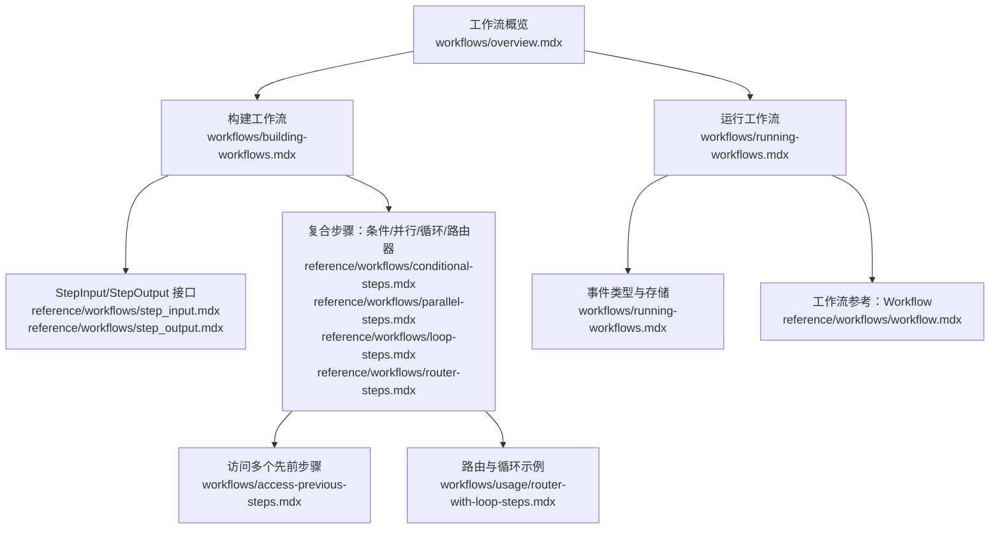
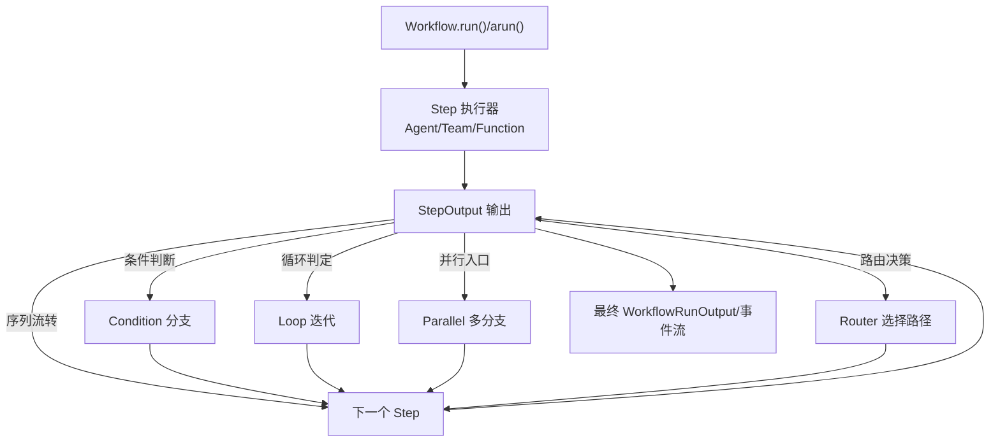
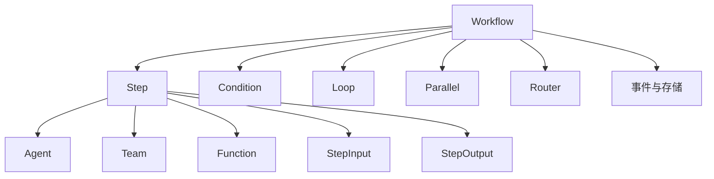

# 工作流基础概念

<cite>
**本文引用的文件**
- [工作流概览](file://workflows/overview.mdx)
- [构建工作流](file://workflows/building-workflows.mdx)
- [运行工作流](file://workflows/running-workflows.mdx)
- [访问多个先前步骤](file://workflows/access-previous-steps.mdx)
- [路由与循环步骤示例](file://workflows/usage/router-with-loop-steps.mdx)
- [工作流参考：Workflow](file://reference/workflows/workflow.mdx)
- [工作流参考：Step](file://reference/workflows/step.mdx)
- [工作流参考：StepInput](file://reference/workflows/step_input.mdx)
- [工作流参考：StepOutput](file://reference/workflows/step_output.mdx)
- [工作流参考：条件步骤](file://reference/workflows/conditional-steps.mdx)
- [工作流参考：并行步骤](file://reference/workflows/parallel-steps.mdx)
- [工作流参考：循环步骤](file://reference/workflows/loop-steps.mdx)
- [工作流参考：路由器步骤](file://reference/workflows/router-steps.mdx)
</cite>

## 目录
1. [引言](#引言)
2. [项目结构](#项目结构)
3. [核心组件](#核心组件)
4. [架构总览](#架构总览)
5. [详细组件分析](#详细组件分析)
6. [依赖关系分析](#依赖关系分析)
7. [性能考量](#性能考量)
8. [故障排查指南](#故障排查指南)
9. [结论](#结论)
10. [附录](#附录)

## 引言
本文件系统化阐述工作流的基础概念与实现要点，围绕以下构建模块展开：Workflow 类、Step 步骤、Loop 循环、Parallel 并行、Condition 条件与 Router 路由器。文档不仅解释各组件的功能与使用场景，还说明工作流的执行原理、数据流向、事件体系、验证与调试方法，并给出基于 Agent、Team 与自定义函数的组合示例路径，帮助读者从入门到进阶掌握工作流的构建与运行。

## 项目结构
本仓库以“文档+示例”为主，工作流相关知识分布在三类位置：
- 概念与实践：workflows/* 提供工作流的总体介绍、构建方式、运行与事件、历史与多步访问等
- 参考手册：reference/workflows/* 提供各组件参数、行为与接口规范
- 示例与模式：examples/workflows/* 与 cookbook/workflows/* 展示具体用法

图表来源
- [工作流概览:1-102](file://workflows/overview.mdx#L1-L102)
- [构建工作流:1-59](file://workflows/building-workflows.mdx#L1-L59)
- [运行工作流:1-619](file://workflows/running-workflows.mdx#L1-L619)
- [StepInput:1-29](file://reference/workflows/step_input.mdx#L1-L29)
- [StepOutput:1-25](file://reference/workflows/step_output.mdx#L1-L25)
- [Workflow:1-306](file://reference/workflows/workflow.mdx#L1-L306)
- [条件步骤:1-15](file://reference/workflows/conditional-steps.mdx#L1-L15)
- [并行步骤:1-10](file://reference/workflows/parallel-steps.mdx#L1-L10)
- [循环步骤:1-16](file://reference/workflows/loop-steps.mdx#L1-L16)
- [路由器步骤:1-56](file://reference/workflows/router-steps.mdx#L1-L56)
- [访问多个先前步骤:1-110](file://workflows/access-previous-steps.mdx#L1-L110)
- [路由与循环示例:1-20](file://workflows/usage/router-with-loop-steps.mdx#L1-L20)

章节来源
- [工作流概览:1-102](file://workflows/overview.mdx#L1-L102)
- [构建工作流:1-59](file://workflows/building-workflows.mdx#L1-L59)

## 核心组件
- Workflow 类：顶层编排器，负责管理整个执行流程，支持同步/异步运行、事件流式输出、会话与数据库持久化、取消与查询等能力。
- Step 步骤：最小可执行单元，封装一个执行器（Agent、Team 或自定义函数），具备重试、超时、确认、用户输入等控制选项。
- Loop 循环：重复执行一组步骤，支持最大迭代次数、是否向前传递上一次输出、结束条件回调等。
- Parallel 并行：并发执行多个步骤，将各分支输出合并后进入下一步。
- Condition 条件：根据评估器结果在“是/否”分支中选择执行路径，支持确认模式与拒绝策略。
- Router 路由器：动态选择下一步或多步执行路径，支持字符串/Step/Step 列表返回值、可选用户输入选择、多选模式与确认模式。

章节来源
- [构建工作流:9-16](file://workflows/building-workflows.mdx#L9-L16)
- [Step:1-25](file://reference/workflows/step.mdx#L1-L25)
- [循环步骤:1-16](file://reference/workflows/loop-steps.mdx#L1-L16)
- [并行步骤:1-10](file://reference/workflows/parallel-steps.mdx#L1-L10)
- [条件步骤:1-15](file://reference/workflows/conditional-steps.mdx#L1-L15)
- [路由器步骤:1-56](file://reference/workflows/router-steps.mdx#L1-L56)

## 架构总览
下图展示了工作流从输入到输出的整体执行路径，以及复合步骤（条件、循环、并行、路由器）在流程中的位置与交互。

图表来源
- [运行工作流:1-619](file://workflows/running-workflows.mdx#L1-L619)
- [构建工作流:1-59](file://workflows/building-workflows.mdx#L1-L59)

## 详细组件分析

### Workflow 类
- 职责：统一编排、调度与状态管理；提供 run/arun、打印输出、CLI、取消、查询、会话与事件存储等能力。
- 关键参数：名称/描述、步骤集合、数据库、会话与用户标识、调试/流式/事件存储、Telemetry 等。
- 运行模式：同步/异步、可选择仅流式工作流事件或同时包含执行器事件；支持后台运行与 WebSocket 实时通信。
- 事件体系：工作流开始/完成/错误、Step 开始/完成/错误、StepOutput、并行/条件/循环/路由器/Steps 执行事件等。
- 存储与审计：可配置事件存储与过滤，便于调试、合规与性能分析。

章节来源
- [工作流参考：Workflow:1-306](file://reference/workflows/workflow.mdx#L1-L306)
- [运行工作流:460-598](file://workflows/running-workflows.mdx#L460-L598)

### Step 步骤
- 单一执行器：每个 Step 封装一个执行器（Agent/Team/自定义函数），确保职责单一、可维护性强。
- 控制选项：最大重试、超时、失败跳过、添加工作流历史、需要确认/用户输入、拒绝策略（跳过/取消）等。
- 数据接口：通过 StepInput 获取输入、前一步内容、所有历史内容、媒体与附加数据；通过 StepOutput 返回内容、媒体、指标、成功/错误标记、嵌套输出等。

章节来源
- [构建工作流:11-12](file://workflows/building-workflows.mdx#L11-L12)
- [工作流参考：Step:1-25](file://reference/workflows/step.mdx#L1-L25)
- [StepInput:1-29](file://reference/workflows/step_input.mdx#L1-L29)
- [StepOutput:1-25](file://reference/workflows/step_output.mdx#L1-L25)

### Loop 循环
- 行为：重复执行一组步骤，支持最大迭代次数、是否将上一次输出作为下一次输入、结束条件回调。
- 使用场景：需要多次校验/迭代优化的流程，如质量检查、数据清洗、多轮检索等。
- 与历史/并行结合：可在循环内嵌套并行或条件，形成复杂的迭代控制。

章节来源
- [构建工作流:13-13](file://workflows/building-workflows.mdx#L13-L13)
- [工作流参考：Loop 步骤:1-16](file://reference/workflows/loop-steps.mdx#L1-L16)

### Parallel 并行
- 行为：并发执行多个步骤，收集各分支输出并在下一步统一处理。
- 使用场景：多源数据采集、并行计算、多路验证等。
- 输出聚合：可通过 StepInput 访问并行组整体输出或直接按 Step 名称访问子步骤输出。

章节来源
- [构建工作流:14-14](file://workflows/building-workflows.mdx#L14-L14)
- [工作流参考：并行步骤:1-10](file://reference/workflows/parallel-steps.mdx#L1-L10)
- [访问多个先前步骤:72-110](file://workflows/access-previous-steps.mdx#L72-L110)

### Condition 条件
- 行为：根据评估器返回的布尔值在“是/否”分支中选择执行路径；支持确认模式与拒绝策略。
- 使用场景：根据上一步内容自动分流，如是否需要事实核查、是否继续迭代等。
- 与 StepInput 结合：评估器可读取上一步内容、历史内容等进行决策。

章节来源
- [构建工作流:15-15](file://workflows/building-workflows.mdx#L15-L15)
- [工作流参考：条件步骤:1-15](file://reference/workflows/conditional-steps.mdx#L1-L15)
- [运行工作流:117-184](file://workflows/running-workflows.mdx#L117-L184)

### Router 路由器
- 行为：动态选择下一步或多步执行路径；支持字符串/Step/Step 列表返回值、可选用户输入选择、多选模式与确认模式。
- 使用场景：智能路径选择、A/B 流程切换、复杂业务分支。
- 与 Loop 结合：可将简单路径与深度迭代路径结合，依据输入复杂度动态选择。

章节来源
- [构建工作流:16-16](file://workflows/building-workflows.mdx#L16-L16)
- [工作流参考：路由器步骤:1-56](file://reference/workflows/router-steps.mdx#L1-L56)
- [路由与循环示例:1-20](file://workflows/usage/router-with-loop-steps.mdx#L1-L20)

### StepInput 与 StepOutput 标准化接口
- StepInput：提供输入、上一步内容、全部历史内容、附加数据、媒体输入、辅助查询方法（按名取输出/内容、最近内容、工作流历史等）。
- StepOutput：承载内容、媒体输出、执行元信息（类型、名称、ID、执行器信息）、指标、成功/错误标记、提前终止请求、嵌套输出等。
- 作用：保证自定义函数与内置执行器在数据流上的兼容性，使任意步骤均可无缝接入。

章节来源
- [构建工作流:18-21](file://workflows/building-workflows.mdx#L18-L21)
- [StepInput:1-29](file://reference/workflows/step_input.mdx#L1-L29)
- [StepOutput:1-25](file://reference/workflows/step_output.mdx#L1-L25)
- [顺序模式说明:39-50](file://workflows/workflow-patterns/sequential.mdx#L39-L50)

### 执行原理与数据流向
- 数据流：Workflow 输入经 StepInput 进入 Step 执行器，生成 StepOutput；StepOutput 作为输入进入下一个 Step，直至结束。
- 历史与上下文：StepInput 支持访问上一步、全部历史、工作流历史上下文，满足跨步骤协作与决策。
- 事件驱动：运行期间产生丰富事件，支持流式输出与事件存储，便于可观测性与审计。

章节来源
- [运行工作流:460-525](file://workflows/running-workflows.mdx#L460-L525)
- [访问多个先前步骤:1-110](file://workflows/access-previous-steps.mdx#L1-L110)

### 基本工作流构建示例（组合 Agent、Team、自定义函数）
- 组合思路：将 Agent/Team 作为步骤执行器，配合自定义函数实现预处理、后处理、条件评估、路由选择等。
- 示例路径：
  - [构建工作流（混合执行流水线示例）:34-59](file://workflows/building-workflows.mdx#L34-L59)
  - [顺序模式（函数与 Agent 组合）:39-50](file://workflows/workflow-patterns/sequential.mdx#L39-L50)
  - [条件执行示例（含评估器）:117-184](file://workflows/running-workflows.mdx#L117-L184)
  - [路由与循环示例:1-20](file://workflows/usage/router-with-loop-steps.mdx#L1-L20)

章节来源
- [构建工作流:34-59](file://workflows/building-workflows.mdx#L34-L59)
- [顺序模式:39-50](file://workflows/workflow-patterns/sequential.mdx#L39-L50)
- [运行工作流:117-184](file://workflows/running-workflows.mdx#L117-L184)
- [路由与循环示例:1-20](file://workflows/usage/router-with-loop-steps.mdx#L1-L20)

## 依赖关系分析
- 组件耦合：Workflow 对 Step/Loop/Parallel/Condition/Router 等复合步骤存在组合依赖；Step 依赖执行器（Agent/Team/Function）与 StepInput/StepOutput 接口。
- 事件与存储：Workflow 在运行期产生事件，可选择存储与过滤，形成对运行过程的可观测闭环。
- 数据依赖：StepInput 提供跨步骤数据访问能力，降低步骤间耦合，提升复用性。

图表来源
- [工作流参考：Workflow:1-306](file://reference/workflows/workflow.mdx#L1-L306)
- [工作流参考：Step:1-25](file://reference/workflows/step.mdx#L1-L25)
- [StepInput:1-29](file://reference/workflows/step_input.mdx#L1-L29)
- [StepOutput:1-25](file://reference/workflows/step_output.mdx#L1-L25)
- [条件步骤:1-15](file://reference/workflows/conditional-steps.mdx#L1-L15)
- [循环步骤:1-16](file://reference/workflows/loop-steps.mdx#L1-L16)
- [并行步骤:1-10](file://reference/workflows/parallel-steps.mdx#L1-L10)
- [路由器步骤:1-56](file://reference/workflows/router-steps.mdx#L1-L56)

## 性能考量
- 并行与循环：合理设置并行度与循环上限，避免资源争用与无限迭代；利用结束条件回调及时退出。
- 事件存储：生产环境建议过滤冗余事件（如 step_started/completed），减少存储与解析开销。
- 超时与重试：为易失败步骤配置超时与重试，平衡可靠性与吞吐。
- 历史与上下文：按需启用工作流历史注入，避免过度拼接历史文本导致延迟与成本上升。

## 故障排查指南
- 事件流式定位：开启事件流与事件存储，结合事件类型（如条件/循环/并行/路由器）定位问题阶段。
- 步骤级诊断：利用 StepInput 的历史查询方法（最近内容、全部历史、按名取输出）快速回溯。
- 取消与恢复：使用 Workflow.cancel_run 取消长时间运行任务；必要时通过会话与数据库查询上次运行输出。
- 验证与调试：启用调试模式与详细事件输出，逐步缩小问题范围；对自定义函数严格遵循 StepInput/StepOutput 接口约定。

章节来源
- [运行工作流:460-598](file://workflows/running-workflows.mdx#L460-L598)
- [访问多个先前步骤:1-110](file://workflows/access-previous-steps.mdx#L1-L110)
- [工作流参考：Workflow:159-207](file://reference/workflows/workflow.mdx#L159-L207)

## 结论
工作流通过标准化的 StepInput/StepOutput 接口与丰富的复合步骤（条件、循环、并行、路由器），实现了从简单线性到复杂分支与迭代的全场景编排。结合事件流式输出与事件存储，既能满足开发调试需求，也能支撑生产环境的可观测性与审计。建议在实际工程中优先明确数据边界与错误处理策略，合理使用并行与循环，充分利用历史与上下文能力，构建高可靠、可演进的工作流系统。

## 附录
- 快速参考
  - [Workflow 参数与方法:7-122](file://reference/workflows/workflow.mdx#L7-L122)
  - [Step 参数与控制选项:1-25](file://reference/workflows/step.mdx#L1-L25)
  - [StepInput 字段与辅助方法:1-29](file://reference/workflows/step_input.mdx#L1-L29)
  - [StepOutput 字段与语义:1-25](file://reference/workflows/step_output.mdx#L1-L25)
  - [条件/并行/循环/路由器参数:1-15](file://reference/workflows/conditional-steps.mdx#L1-L15)
  - [路由器选择器签名与返回类型:31-56](file://reference/workflows/router-steps.mdx#L31-L56)
- 示例路径
  - [构建工作流示例:34-59](file://workflows/building-workflows.mdx#L34-L59)
  - [条件执行示例:117-184](file://workflows/running-workflows.mdx#L117-L184)
  - [路由与循环示例:1-20](file://workflows/usage/router-with-loop-steps.mdx#L1-L20)
  - [访问多个先前步骤示例:1-110](file://workflows/access-previous-steps.mdx#L1-L110)