# 工作流构建指南

<cite>
**本文引用的文件**
- [工作流概述](file://workflows/overview.mdx)
- [构建工作流](file://workflows/building-workflows.mdx)
- [运行工作流](file://workflows/running-workflows.mdx)
- [会话式工作流](file://workflows/conversational-workflows.mdx)
- [后台执行](file://workflows/background-execution.mdx)
- [工作流模式总览](file://workflows/workflow-patterns/overview.mdx)
- [顺序工作流](file://workflows/workflow-patterns/sequential.mdx)
- [并行工作流](file://workflows/workflow-patterns/parallel-workflow.mdx)
- [条件工作流](file://workflows/workflow-patterns/conditional-workflow.mdx)
- [迭代工作流](file://workflows/workflow-patterns/iterative-workflow.mdx)
- [分支工作流](file://workflows/workflow-patterns/branching-workflow.mdx)
- [分组步骤工作流](file://workflows/workflow-patterns/grouped-steps-workflow.mdx)
- [自定义函数步骤工作流](file://workflows/workflow-patterns/custom-function-step-workflow.mdx)
- [高级工作流模式组合](file://workflows/workflow-patterns/advanced-workflow-patterns.mdx)
- [访问前序步骤](file://workflows/access-previous-steps.mdx)
- [附加数据与元数据](file://workflows/additional-data.mdx)
- [人机交互（HITL）- 步骤组](file://workflows/hitl/steps.mdx)
- [路由器（Router）- 确认模式](file://workflows/hitl/router.mdx)
- [基本工作流示例概览](file://examples/workflows/basic-workflows/overview.mdx)
- [并行执行示例概览](file://examples/workflows/parallel-execution/overview.mdx)
- [并行执行-基础示例](file://examples/workflows/parallel-execution/parallel-basic.mdx)
- [条件分支示例概览](file://examples/workflows/conditional-branching/overview.mdx)
- [循环执行示例概览](file://examples/workflows/loop-execution/overview.mdx)
</cite>

## 目录
1. [简介](#简介)
2. [项目结构](#项目结构)
3. [核心组件](#核心组件)
4. [架构总览](#架构总览)
5. [详细组件分析](#详细组件分析)
6. [依赖关系分析](#依赖关系分析)
7. [性能考量](#性能考量)
8. [故障排查指南](#故障排查指南)
9. [结论](#结论)
10. [附录](#附录)

## 简介
本指南面向希望在 Agno 平台上构建可重复、可审计、可扩展的自动化工作流的工程师与产品人员。内容覆盖从“步骤定义、输入输出配置、执行逻辑设计”到“顺序、并行、条件分支、迭代循环”等模式的实现；涵盖“代理步骤、团队步骤、自定义函数步骤”的组合方式；讲解参数传递与数据流管理；提供可运行示例路径与最佳实践，并给出验证与测试建议。

## 项目结构
围绕工作流主题，知识库提供了从“概念介绍、构建方法、运行与事件、模式范式、示例与用法”的完整路径。下图展示了与工作流构建直接相关的文档与示例组织关系。

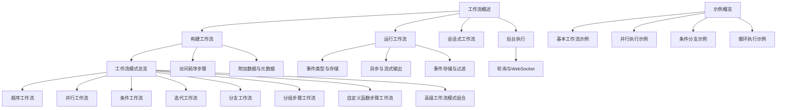

图表来源
- [工作流概述:1-102](file://workflows/overview.mdx#L1-L102)
- [构建工作流:1-59](file://workflows/building-workflows.mdx#L1-L59)
- [运行工作流:1-619](file://workflows/running-workflows.mdx#L1-L619)
- [会话式工作流:1-160](file://workflows/conversational-workflows.mdx#L1-L160)
- [后台执行:1-137](file://workflows/background-execution.mdx#L1-L137)
- [工作流模式总览:30-92](file://workflows/workflow-patterns/overview.mdx#L30-L92)
- [顺序工作流:1-50](file://workflows/workflow-patterns/sequential.mdx#L1-L50)
- [并行工作流:1-54](file://workflows/workflow-patterns/parallel-workflow.mdx#L1-L54)
- [条件工作流:1-100](file://workflows/workflow-patterns/conditional-workflow.mdx#L1-L100)
- [迭代工作流:1-57](file://workflows/workflow-patterns/iterative-workflow.mdx#L1-L57)
- [分支工作流:1-176](file://workflows/workflow-patterns/branching-workflow.mdx#L1-L176)
- [分组步骤工作流:1-101](file://workflows/workflow-patterns/grouped-steps-workflow.mdx#L1-L101)
- [自定义函数步骤工作流:1-148](file://workflows/workflow-patterns/custom-function-step-workflow.mdx#L1-L148)
- [高级工作流模式组合:1-29](file://workflows/workflow-patterns/advanced-workflow-patterns.mdx#L1-L29)
- [访问前序步骤:72-110](file://workflows/access-previous-steps.mdx#L72-L110)
- [附加数据与元数据:1-23](file://workflows/additional-data.mdx#L1-L23)
- [示例概览-基本工作流:1-11](file://examples/workflows/basic-workflows/overview.mdx#L1-L11)
- [示例概览-并行执行:1-9](file://examples/workflows/parallel-execution/overview.mdx#L1-L9)
- [示例概览-条件分支:1-16](file://examples/workflows/conditional-branching/overview.mdx#L1-L16)
- [示例概览-循环执行:1-10](file://examples/workflows/loop-execution/overview.mdx#L1-L10)

章节来源
- [工作流概述:1-102](file://workflows/overview.mdx#L1-L102)
- [工作流模式总览:30-92](file://workflows/workflow-patterns/overview.mdx#L30-L92)

## 核心组件
- 工作流（Workflow）：顶层编排器，负责管理整个执行流程，支持事件存储、遥测、会话数据库等能力。
- 步骤（Step）：最小工作单元，封装一个执行器（Agent、Team 或自定义函数），确保职责单一与可维护性。
- 循环（Loop）：对一组步骤进行重复执行，直到满足退出条件或达到最大迭代次数。
- 并行（Parallel）：并发执行多个独立步骤，结果合并后进入后续步骤。
- 条件（Condition）：基于评估函数在两个分支间选择执行路径。
- 路由器（Router）：根据选择器动态决定下一步执行哪些步骤，支持字符串、Step 对象或 Step 列表返回。
- 分组步骤（Steps）：将多个步骤封装为可复用的序列，便于模块化与清晰的分支逻辑。
- 自定义函数（Custom Function）：以纯 Python 函数作为执行器，实现灵活的数据处理、调用 Agent/Team 与输出转换。

章节来源
- [构建工作流:9-16](file://workflows/building-workflows.mdx#L9-L16)
- [自定义函数步骤工作流:1-34](file://workflows/workflow-patterns/custom-function-step-workflow.mdx#L1-L34)

## 架构总览
下图展示了工作流从“输入消息”到“最终输出”的典型执行路径，以及事件驱动的运行时模型。

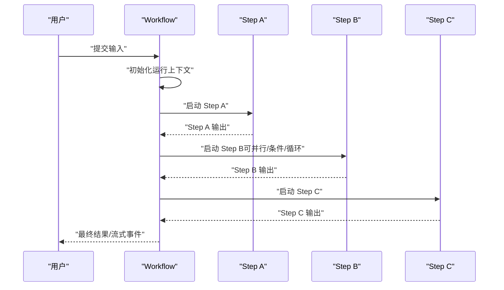

图表来源
- [运行工作流:1-200](file://workflows/running-workflows.mdx#L1-L200)
- [工作流概述:21-47](file://workflows/overview.mdx#L21-L47)

## 详细组件分析

### 顺序执行（Sequential）
顺序工作流确保确定性的执行顺序与清晰的数据流。适合线性任务编排，如“研究 → 数据处理 → 内容创作 → 最终审核”。

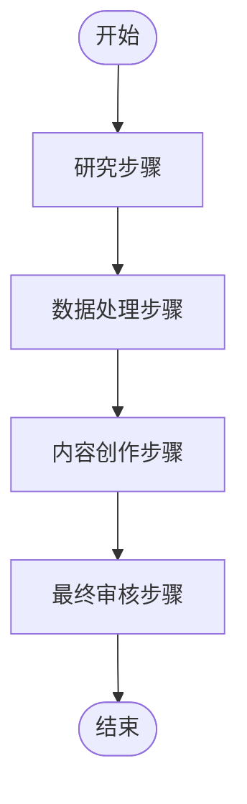

图表来源
- [顺序工作流:12-32](file://workflows/workflow-patterns/sequential.mdx#L12-L32)

章节来源
- [顺序工作流:1-50](file://workflows/workflow-patterns/sequential.mdx#L1-L50)

### 并行执行（Parallel）
并行工作流通过并发执行独立任务显著缩短整体耗时，适用于多源研究、并行分析等场景。注意共享状态的并发协调。

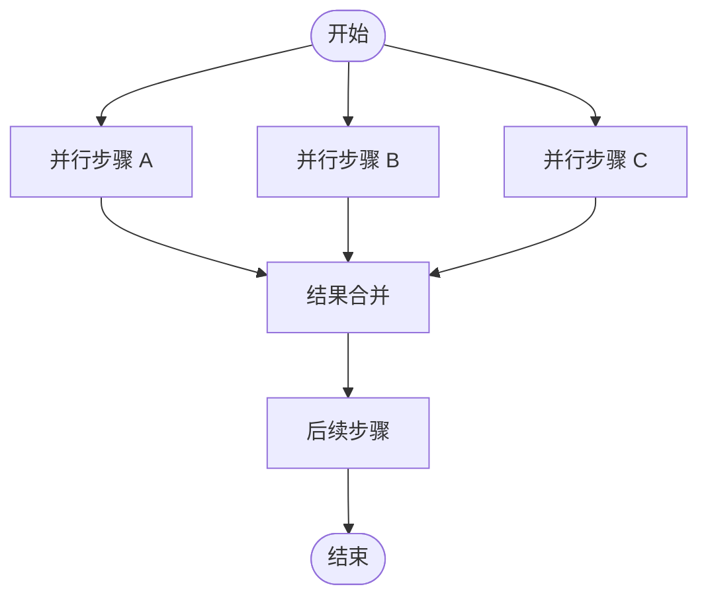

图表来源
- [并行工作流:10-19](file://workflows/workflow-patterns/parallel-workflow.mdx#L10-L19)
- [并行执行-基础示例:1-87](file://examples/workflows/parallel-execution/parallel-basic.mdx#L1-L87)

章节来源
- [并行工作流:1-54](file://workflows/workflow-patterns/parallel-workflow.mdx#L1-L54)
- [并行执行-基础示例:1-87](file://examples/workflows/parallel-execution/parallel-basic.mdx#L1-L87)

### 条件分支（Condition）
条件工作流根据输入或业务规则进行确定性分支，支持“真/假”双分支或仅“真”分支跳过。

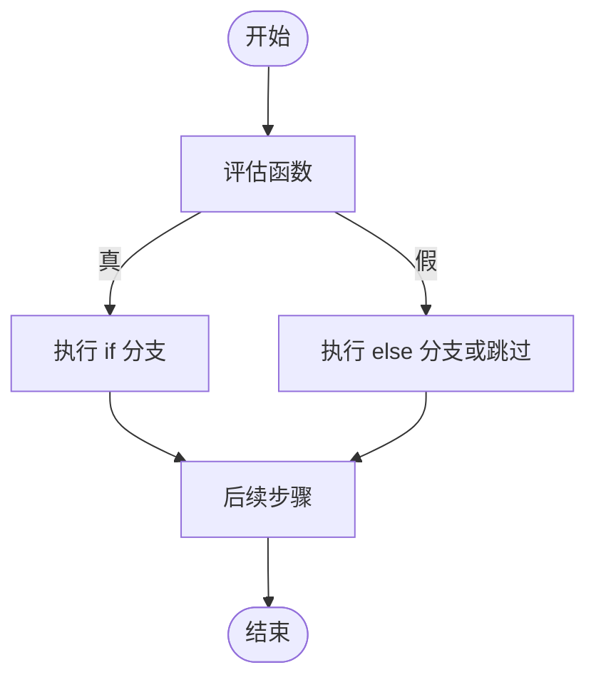

图表来源
- [条件工作流:21-28](file://workflows/workflow-patterns/conditional-workflow.mdx#L21-L28)

章节来源
- [条件工作流:1-100](file://workflows/workflow-patterns/conditional-workflow.mdx#L1-L100)

### 迭代循环（Loop）
迭代工作流在满足退出条件前重复执行一组步骤，适合质量控制、重试机制与迭代优化。

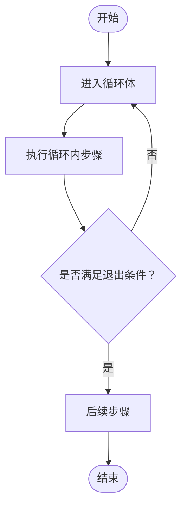

图表来源
- [迭代工作流:10-19](file://workflows/workflow-patterns/iterative-workflow.mdx#L10-L19)

章节来源
- [迭代工作流:1-57](file://workflows/workflow-patterns/iterative-workflow.mdx#L1-L57)

### 动态路由（Router）
路由器根据选择器返回的名称、Step 对象或 Step 列表进行路径选择，支持确认模式与 step_choices 参数。

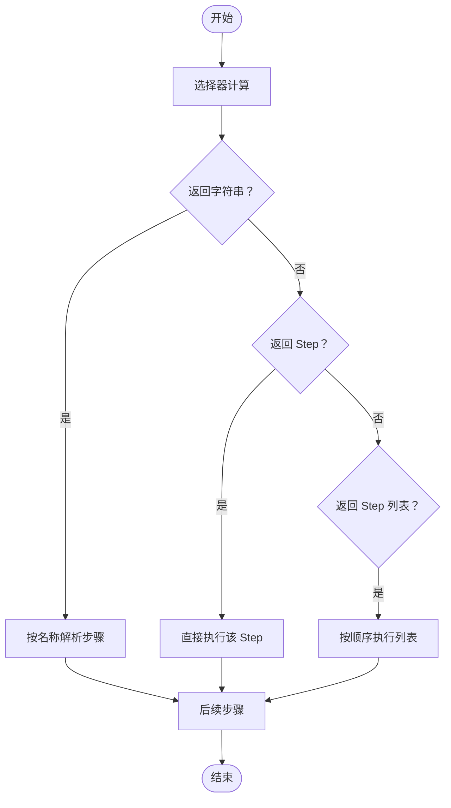

图表来源
- [分支工作流:21-28](file://workflows/workflow-patterns/branching-workflow.mdx#L21-L28)
- [路由器-确认模式:116-140](file://workflows/hitl/router.mdx#L116-L140)

章节来源
- [分支工作流:1-176](file://workflows/workflow-patterns/branching-workflow.mdx#L1-L176)
- [路由器-确认模式:101-142](file://workflows/hitl/router.mdx#L101-L142)

### 分组步骤（Steps）
将多个步骤封装为可复用序列，提升模块化与可读性，常与 Router 组合用于不同内容类型的流水线。

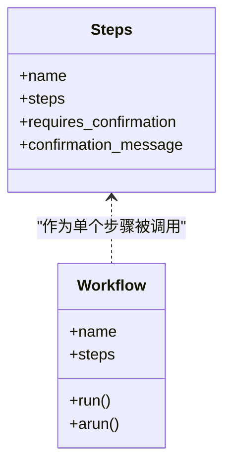

图表来源
- [分组步骤工作流:10-33](file://workflows/workflow-patterns/grouped-steps-workflow.mdx#L10-L33)

章节来源
- [分组步骤工作流:1-101](file://workflows/workflow-patterns/grouped-steps-workflow.mdx#L1-L101)

### 自定义函数步骤（Custom Function）
以纯 Python 函数作为执行器，实现复杂业务规则、数据转换与 Agent/Team 的编排集成。

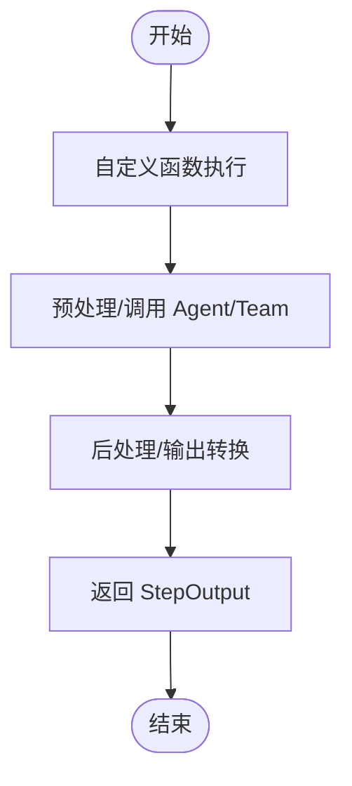

图表来源
- [自定义函数步骤工作流:14-34](file://workflows/workflow-patterns/custom-function-step-workflow.mdx#L14-L34)

章节来源
- [自定义函数步骤工作流:1-148](file://workflows/workflow-patterns/custom-function-step-workflow.mdx#L1-L148)

### 高级模式组合（Advanced Patterns）
将条件逻辑、并行执行、迭代循环、自定义处理与动态路由组合，形成复杂但可预测的工作流。

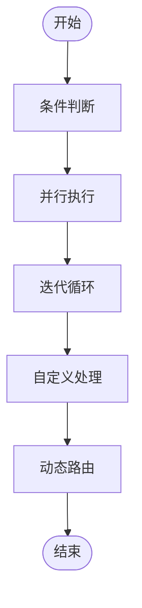

图表来源
- [高级工作流模式组合:6-8](file://workflows/workflow-patterns/advanced-workflow-patterns.mdx#L6-L8)

章节来源
- [高级工作流模式组合:1-29](file://workflows/workflow-patterns/advanced-workflow-patterns.mdx#L1-L29)

## 依赖关系分析
- 工作流依赖于步骤（Step）作为执行单元，步骤可由 Agent、Team 或自定义函数组成。
- 并行（Parallel）、条件（Condition）、循环（Loop）、路由（Router）、分组（Steps）均以 Step 为基础进行组合。
- 运行时依赖事件系统（WorkflowRunOutputEvent）与数据库（Session Storage）进行审计与回放。
- 会话式工作流依赖 WorkflowAgent 与历史运行记录进行对话延续。

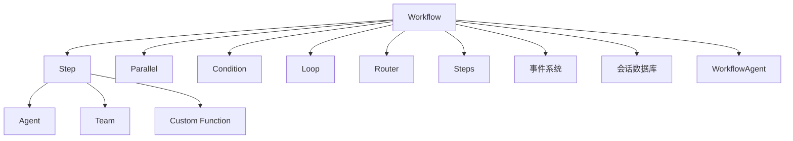

图表来源
- [构建工作流:9-16](file://workflows/building-workflows.mdx#L9-L16)
- [运行工作流:462-525](file://workflows/running-workflows.mdx#L462-L525)

章节来源
- [构建工作流:9-16](file://workflows/building-workflows.mdx#L9-L16)
- [运行工作流:462-525](file://workflows/running-workflows.mdx#L462-L525)

## 性能考量
- 并行执行优先用于独立任务，减少端到端延迟；注意共享状态的并发安全与锁策略。
- 循环与迭代应设置合理的最大迭代次数与退出条件，避免无限循环。
- 流式输出与事件存储在调试与审计时非常有用，但在生产中可通过事件过滤降低存储与噪声。
- 异步运行与后台执行适合长耗时任务，结合轮询或 WebSocket 实时通知。
- 会话式工作流的历史窗口（num_history_runs）需平衡上下文感知与令牌开销。

章节来源
- [并行工作流:42-46](file://workflows/workflow-patterns/parallel-workflow.mdx#L42-L46)
- [运行工作流:527-598](file://workflows/running-workflows.mdx#L527-L598)
- [后台执行:8-14](file://workflows/background-execution.mdx#L8-L14)
- [会话式工作流:64-72](file://workflows/conversational-workflows.mdx#L64-L72)

## 故障排查指南
- 事件类型与存储
  - 使用事件类型（如 WorkflowStarted、StepCompleted、ParallelExecutionStarted 等）定位问题阶段。
  - 通过数据库中的 runs 列表与 run_response.events 获取完整执行轨迹。
- 流式输出与异步
  - 开启 stream_events 查看内部步骤事件；必要时关闭 executor 事件以减少噪声。
  - 异步运行时检查 Workflow.arun 返回的 run_id，并定期轮询完成状态。
- 人机交互（HITL）
  - Steps 与 Router 的确认模式允许人工审批后再执行，便于关键路径的审慎控制。
- 常见问题
  - 步骤间数据不一致：检查 StepInput/StepOutput 的兼容性与命名访问（get_step_output/content）。
  - 并发写入冲突：在并行步骤中更新共享状态时采用加锁或去并发化策略。
  - 路由错误：核对选择器返回值类型与 choices 映射一致性。

章节来源
- [运行工作流:462-525](file://workflows/running-workflows.mdx#L462-L525)
- [运行工作流:527-598](file://workflows/running-workflows.mdx#L527-L598)
- [人机交互（HITL）- 步骤组:29-70](file://workflows/hitl/steps.mdx#L29-L70)
- [路由器（Router）- 确认模式:116-142](file://workflows/hitl/router.mdx#L116-L142)
- [访问前序步骤:72-110](file://workflows/access-previous-steps.mdx#L72-L110)

## 结论
通过将“步骤、循环、条件、并行、路由、分组”等构建块进行组合，可以实现从简单到复杂的自动化工作流。配合事件系统、会话数据库与会话式交互，既能保证可审计与可追溯，也能提供良好的用户体验。建议在设计初期明确数据流与边界条件，利用示例与参考文档快速落地，并在上线前进行充分的事件回放与压力测试。

## 附录

### 输入输出与数据流管理
- 标准化接口：StepInput/StepOutput 提供统一的数据交换格式，确保自定义函数与内置执行器的无缝衔接。
- 访问前序步骤：通过名称或递归搜索访问并行组内的子步骤输出。
- 附加数据：additional_data 用于传递元数据、配置或上下文，避免污染主消息流。

章节来源
- [构建工作流:18-32](file://workflows/building-workflows.mdx#L18-L32)
- [访问前序步骤:72-110](file://workflows/access-previous-steps.mdx#L72-L110)
- [附加数据与元数据:1-23](file://workflows/additional-data.mdx#L1-L23)

### 参数传递与会话
- 会话式工作流：WorkflowAgent 可根据历史运行记录回答问题或触发工作流，num_history_runs 控制上下文范围。
- 会话存储：Workflow 支持将事件持久化至数据库，便于审计与回溯。

章节来源
- [会话式工作流:18-90](file://workflows/conversational-workflows.mdx#L18-L90)
- [运行工作流:527-598](file://workflows/running-workflows.mdx#L527-L598)

### 示例与构建步骤
- 基础示例
  - 顺序步骤、函数步骤、函数工作流
- 并行执行
  - 多源研究并行、同步/异步运行与流式输出
- 条件分支
  - 字符串选择器、Step 对象返回、嵌套选择与动态 step_choices
- 循环执行
  - 基础循环与循环内并行混合

章节来源
- [基本工作流示例概览:1-11](file://examples/workflows/basic-workflows/overview.mdx#L1-L11)
- [并行执行示例概览:1-9](file://examples/workflows/parallel-execution/overview.mdx#L1-L9)
- [并行执行-基础示例:1-87](file://examples/workflows/parallel-execution/parallel-basic.mdx#L1-L87)
- [条件分支示例概览:1-16](file://examples/workflows/conditional-branching/overview.mdx#L1-L16)
- [循环执行示例概览:1-10](file://examples/workflows/loop-execution/overview.mdx#L1-L10)

### 验证与测试方法
- 单步验证：针对每个 Step 的输入/输出与边界条件编写断言。
- 事件回放：启用事件存储，回放历史运行以验证稳定性与一致性。
- 流式事件校验：开启 stream_events，观察关键事件（条件/并行/循环/路由）的起止顺序。
- 异步与后台：使用 arun + 轮询或 WebSocket 检查后台任务的完成状态与错误日志。
- 会话式交互：模拟用户多轮提问，验证 WorkflowAgent 的直答与触发行为。

章节来源
- [运行工作流:527-598](file://workflows/running-workflows.mdx#L527-L598)
- [后台执行:8-14](file://workflows/background-execution.mdx#L8-L14)
- [会话式工作流:125-156](file://workflows/conversational-workflows.mdx#L125-L156)