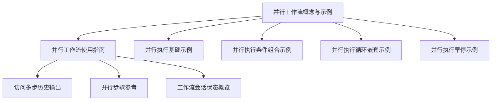
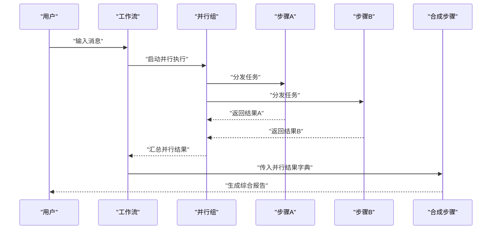
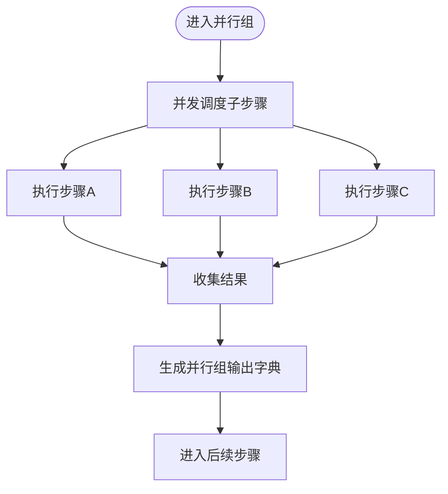
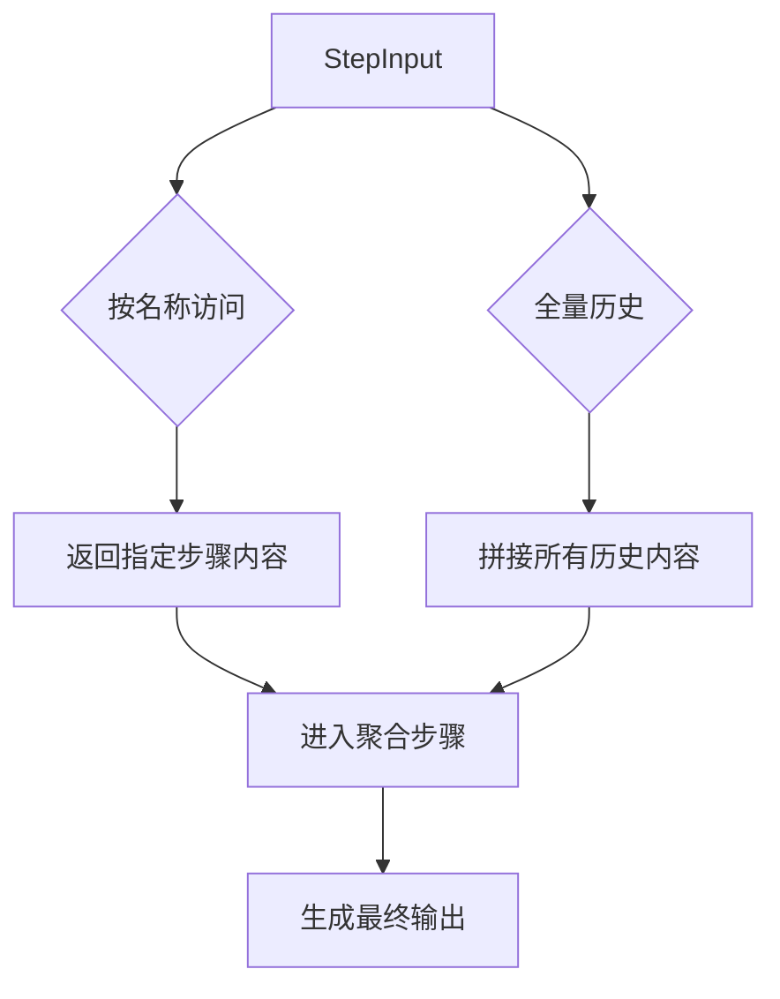
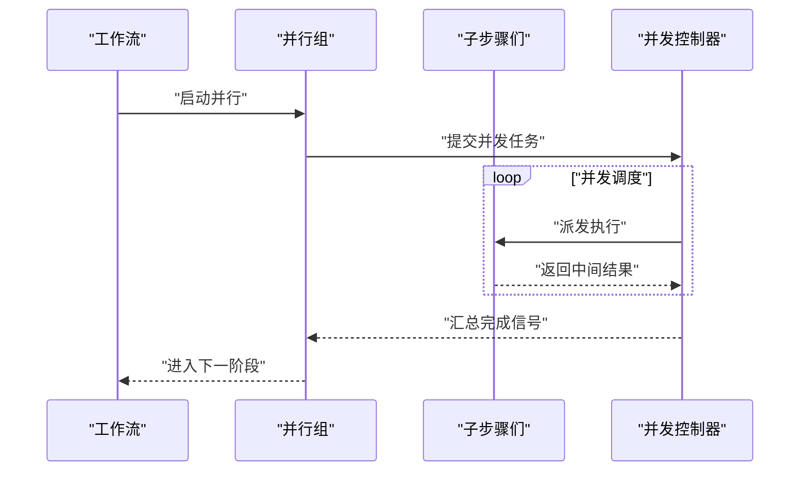
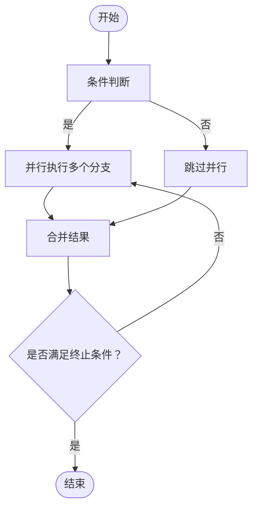
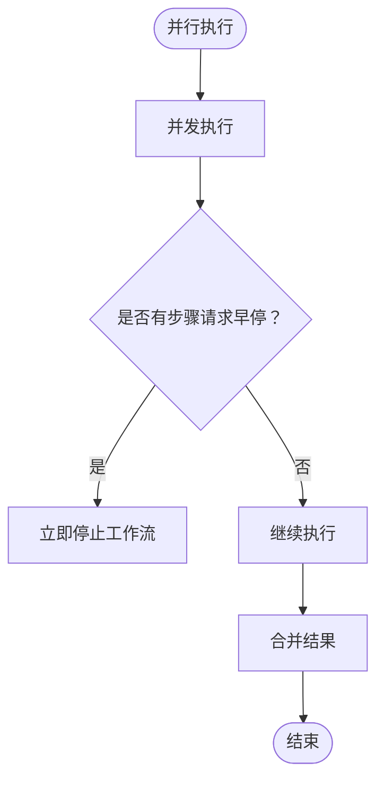
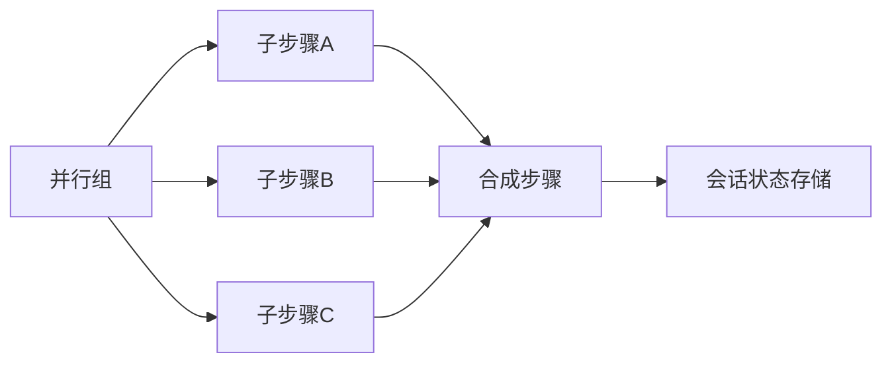

# 并行执行模式

<cite>
**本文引用的文件**
- [并行工作流（概念与示例）](file://workflows/workflow-patterns/parallel-workflow.mdx)
- [并行工作流（使用指南）](file://workflows/usage/parallel-steps-workflow.mdx)
- [并行执行（基础示例）](file://examples/workflows/parallel-execution/parallel-basic.mdx)
- [并行执行（条件组合示例）](file://examples/workflows/parallel-execution/parallel-with-condition.mdx)
- [并行执行（循环嵌套示例）](file://examples/workflows/loop-execution/loop-with-parallel.mdx)
- [并行执行（早停示例）](file://examples/workflows/advanced-concepts/early-stopping/early-stop-parallel.mdx)
- [访问多步历史输出](file://workflows/access-previous-steps.mdx)
- [并行步骤参考](file://reference/workflows/parallel-steps.mdx)
- [工作流会话状态概览](file://state/workflows/overview.mdx)
</cite>

## 目录
1. [引言](#引言)
2. [项目结构](#项目结构)
3. [核心组件](#核心组件)
4. [架构总览](#架构总览)
5. [详细组件分析](#详细组件分析)
6. [依赖分析](#依赖分析)
7. [性能考量](#性能考量)
8. [故障排查指南](#故障排查指南)
9. [结论](#结论)
10. [附录](#附录)

## 引言
本文件系统性阐述并行执行模式的设计理念、数据流管理与同步策略，并结合仓库中的示例与参考文档，给出可操作的实现路径与最佳实践。重点覆盖：
- 如何在工作流中组合并行步骤并进行结果合并
- 并行执行的数据流与状态共享机制
- 同步策略、并发控制与错误处理
- 步骤间依赖关系与协调机制
- 性能优势与资源消耗评估

## 项目结构
围绕并行执行模式，相关知识与示例主要分布在以下位置：
- 概念与用法：workflows/workflow-patterns/parallel-workflow.mdx、workflows/usage/parallel-steps-workflow.mdx
- 示例集合：examples/workflows/parallel-execution、examples/workflows/loop-execution、examples/workflows/advanced-concepts
- 数据访问与状态：workflows/access-previous-steps.mdx、state/workflows/overview.mdx
- API 参考：reference/workflows/parallel-steps.mdx

**图示来源**
- [并行工作流（概念与示例）:1-54](file://workflows/workflow-patterns/parallel-workflow.mdx#L1-L54)
- [并行工作流（使用指南）:1-47](file://workflows/usage/parallel-steps-workflow.mdx#L1-L47)
- [并行执行（基础示例）:1-87](file://examples/workflows/parallel-execution/parallel-basic.mdx#L1-L87)
- [并行执行（条件组合示例）:1-202](file://examples/workflows/parallel-execution/parallel-with-condition.mdx#L1-L202)
- [并行执行（循环嵌套示例）:1-167](file://examples/workflows/loop-execution/loop-with-parallel.mdx#L1-L167)
- [并行执行（早停示例）:1-120](file://examples/workflows/advanced-concepts/early-stopping/early-stop-parallel.mdx#L1-L120)
- [访问多步历史输出:1-167](file://workflows/access-previous-steps.mdx#L1-L167)
- [并行步骤参考:1-10](file://reference/workflows/parallel-steps.mdx#L1-L10)
- [工作流会话状态概览:1-39](file://state/workflows/overview.mdx#L1-L39)

**章节来源**
- [并行工作流（概念与示例）:1-54](file://workflows/workflow-patterns/parallel-workflow.mdx#L1-L54)
- [并行工作流（使用指南）:1-47](file://workflows/usage/parallel-steps-workflow.mdx#L1-L47)

## 核心组件
- 并行步骤容器：用于将多个独立步骤并行执行，并在完成后统一进入后续步骤或进行结果聚合。
- 步骤输入与输出：通过 StepInput 获取前序步骤输出，支持按名称直接访问或递归查找嵌套步骤。
- 会话状态：跨步骤共享状态数据，支持初始化、读取与更新；在并行场景下需注意并发写入的协调。
- 条件与循环：可与并行组合，形成自适应的并行执行策略。

**章节来源**
- [并行步骤参考:1-10](file://reference/workflows/parallel-steps.mdx#L1-L10)
- [访问多步历史输出:61-167](file://workflows/access-previous-steps.mdx#L61-L167)
- [工作流会话状态概览:23-39](file://state/workflows/overview.mdx#L23-L39)

## 架构总览
下图展示了典型“并行研究 → 合成报告”的执行流程，以及数据在步骤间的传递方式。

**图示来源**
- [并行执行（基础示例）:39-46](file://examples/workflows/parallel-execution/parallel-basic.mdx#L39-L46)
- [访问多步历史输出:152-164](file://workflows/access-previous-steps.mdx#L152-L164)

## 详细组件分析

### 组件一：并行步骤容器与组合
- 定义方式：将多个 Step 或嵌套的 Condition/Loop 等组合到 Parallel 中，作为单一执行单元。
- 执行模型：并行组内的所有子步骤在同一阶段并发执行，等待全部完成后再进入下一步。
- 结果格式：当以名称访问并行组时，返回一个字典，键为各子步骤名称，值为对应输出内容。

**图示来源**
- [并行步骤参考:6-10](file://reference/workflows/parallel-steps.mdx#L6-L10)
- [访问多步历史输出:152-164](file://workflows/access-previous-steps.mdx#L152-L164)

**章节来源**
- [并行步骤参考:1-10](file://reference/workflows/parallel-steps.mdx#L1-L10)
- [访问多步历史输出:72-101](file://workflows/access-previous-steps.mdx#L72-L101)

### 组件二：数据流管理与结果合并
- 历史输出访问：通过 StepInput 的方法按名称或全量访问前序步骤输出，便于在后续步骤中进行聚合。
- 嵌套访问：支持递归查找任意深度的嵌套步骤，优先匹配顶层同名步骤。
- 并行组输出：以字典形式返回，键为子步骤名称，值为对应内容，便于后续合成步骤统一处理。

**图示来源**
- [访问多步历史输出:12-67](file://workflows/access-previous-steps.mdx#L12-L67)
- [访问多步历史输出:103-146](file://workflows/access-previous-steps.mdx#L103-L146)

**章节来源**
- [访问多步历史输出:61-167](file://workflows/access-previous-steps.mdx#L61-L167)

### 组件三：同步策略与并发控制
- 并发执行：并行组内子步骤并发运行，缩短端到端时延。
- 会话状态并发：若在并行步骤中更新共享会话状态，需避免竞态，建议采用互斥或幂等更新策略。
- 流式输出：支持同步与异步流式输出，便于实时观察执行进度。

**图示来源**
- [并行执行（基础示例）:54-72](file://examples/workflows/parallel-execution/parallel-basic.mdx#L54-L72)
- [并行工作流（概念与示例）:44-46](file://workflows/workflow-patterns/parallel-workflow.mdx#L44-L46)

**章节来源**
- [并行工作流（概念与示例）:44-46](file://workflows/workflow-patterns/parallel-workflow.mdx#L44-L46)
- [并行执行（基础示例）:54-72](file://examples/workflows/parallel-execution/parallel-basic.mdx#L54-L72)

### 组件四：与条件、循环的组合
- 条件并行：在条件分支内部使用并行，实现“按条件选择并行策略”的灵活流水线。
- 循环并行：在循环体中混合并行与顺序步骤，直到满足终止条件后生成最终内容。

**图示来源**
- [并行执行（条件组合示例）:138-165](file://examples/workflows/parallel-execution/parallel-with-condition.mdx#L138-L165)
- [并行执行（循环嵌套示例）:104-125](file://examples/workflows/loop-execution/loop-with-parallel.mdx#L104-L125)

**章节来源**
- [并行执行（条件组合示例）:128-165](file://examples/workflows/parallel-execution/parallel-with-condition.mdx#L128-L165)
- [并行执行（循环嵌套示例）:101-153](file://examples/workflows/loop-execution/loop-with-parallel.mdx#L101-L153)

### 组件五：早停与错误处理
- 早停：任一并行步骤可触发工作流早停，确保安全与质量控制。
- 错误处理：并行执行中单个步骤失败不影响其他步骤，后续合成步骤可基于可用结果继续推进。

**图示来源**
- [并行执行（早停示例）:76-90](file://examples/workflows/advanced-concepts/early-stopping/early-stop-parallel.mdx#L76-L90)

**章节来源**
- [并行执行（早停示例）:31-60](file://examples/workflows/advanced-concepts/early-stopping/early-stop-parallel.mdx#L31-L60)

## 依赖分析
- 组件耦合
  - 并行组与子步骤：强依赖关系，子步骤的完成状态决定并行组的推进时机。
  - 合成步骤与并行组：弱依赖关系，仅依赖并行组输出字典。
  - 条件/循环与并行：组合关系，通过嵌套实现动态并行策略。
- 外部依赖
  - 会话状态持久化：依赖可用数据库以实现状态持久化与恢复。
  - 流式输出：依赖异步运行时以支持流式传输。

**图示来源**
- [并行执行（基础示例）:39-46](file://examples/workflows/parallel-execution/parallel-basic.mdx#L39-L46)
- [工作流会话状态概览:10-11](file://state/workflows/overview.mdx#L10-L11)

**章节来源**
- [工作流会话状态概览:10-11](file://state/workflows/overview.mdx#L10-L11)

## 性能考量
- 性能优势
  - 并行执行显著降低独立任务的总时延，适合多源研究、并行分析与并发数据处理。
  - 支持同步与异步流式输出，提升交互体验。
- 资源消耗
  - 并行度越高，CPU/IO/网络等资源占用越大；应根据硬件与外部服务限流策略合理设置并发数。
  - 并行会话状态更新需避免竞态，必要时引入锁或幂等写入，以免增加额外开销。
- 实践建议
  - 将无依赖的独立步骤放入并行组，减少全局等待时间。
  - 在合成步骤中进行结果裁剪与去重，避免下游处理压力过大。

[本节为通用指导，无需特定文件来源]

## 故障排查指南
- 并行步骤早停
  - 现象：某一步骤返回早停标记，导致整个工作流提前结束。
  - 排查：检查该步骤的早停逻辑与触发条件，确认是否符合预期。
  - 参考：[并行执行（早停示例）:31-60](file://examples/workflows/advanced-concepts/early-stopping/early-stop-parallel.mdx#L31-L60)
- 并发写入会话状态冲突
  - 现象：并行步骤同时更新共享状态，出现竞态或数据不一致。
  - 排查：确认是否在并行步骤中更新会话状态；如需更新，采用互斥或幂等策略。
  - 参考：[并行工作流（概念与示例）:44-46](file://workflows/workflow-patterns/parallel-workflow.mdx#L44-L46)
- 嵌套步骤访问异常
  - 现象：按名称无法找到嵌套步骤或返回空值。
  - 排查：确认步骤命名唯一性与嵌套层级；注意顶层同名步骤优先于嵌套查找。
  - 参考：[访问多步历史输出:148-150](file://workflows/access-previous-steps.mdx#L148-L150)
- 循环并行未达预期
  - 现象：循环体未按预期次数执行或提前退出。
  - 排查：检查循环终止条件与并行组完成信号，确认评估器逻辑正确。
  - 参考：[并行执行（循环嵌套示例）:84-99](file://examples/workflows/loop-execution/loop-with-parallel.mdx#L84-L99)

**章节来源**
- [并行执行（早停示例）:31-60](file://examples/workflows/advanced-concepts/early-stopping/early-stop-parallel.mdx#L31-L60)
- [并行工作流（概念与示例）:44-46](file://workflows/workflow-patterns/parallel-workflow.mdx#L44-L46)
- [访问多步历史输出:148-150](file://workflows/access-previous-steps.mdx#L148-L150)
- [并行执行（循环嵌套示例）:84-99](file://examples/workflows/loop-execution/loop-with-parallel.mdx#L84-L99)

## 结论
并行执行模式通过将独立步骤并发调度，有效缩短整体执行时间，适用于多源研究、并行分析与并发数据处理等场景。配合条件与循环，可构建自适应的并行策略；通过会话状态与历史输出访问，实现跨步骤的数据协同与结果聚合。在实践中，应重视并发写入的协调、早停与错误处理策略，并依据资源与外部约束合理设计并行度，以获得最佳的性能与稳定性。

[本节为总结性内容，无需特定文件来源]

## 附录
- 快速上手
  - 创建并行组：将多个 Step 放入 Parallel，作为单一执行块。
  - 访问并行输出：在后续步骤中以名称访问并行组，得到子步骤输出字典。
  - 组合条件/循环：在条件或循环体内嵌套并行组，实现动态并行策略。
- 参考示例
  - 基础并行：[并行执行（基础示例）:39-46](file://examples/workflows/parallel-execution/parallel-basic.mdx#L39-L46)
  - 条件并行：[并行执行（条件组合示例）:138-165](file://examples/workflows/parallel-execution/parallel-with-condition.mdx#L138-L165)
  - 循环并行：[并行执行（循环嵌套示例）:104-125](file://examples/workflows/loop-execution/loop-with-parallel.mdx#L104-L125)
  - 早停并行：[并行执行（早停示例）:76-90](file://examples/workflows/advanced-concepts/early-stopping/early-stop-parallel.mdx#L76-L90)
  - 历史输出访问：[访问多步历史输出:12-67](file://workflows/access-previous-steps.mdx#L12-L67)
  - 并行步骤参考：[并行步骤参考:6-10](file://reference/workflows/parallel-steps.mdx#L6-L10)
  - 会话状态概览：[工作流会话状态概览:23-39](file://state/workflows/overview.mdx#L23-L39)

**章节来源**
- [并行执行（基础示例）:39-46](file://examples/workflows/parallel-execution/parallel-basic.mdx#L39-L46)
- [并行执行（条件组合示例）:138-165](file://examples/workflows/parallel-execution/parallel-with-condition.mdx#L138-L165)
- [并行执行（循环嵌套示例）:104-125](file://examples/workflows/loop-execution/loop-with-parallel.mdx#L104-L125)
- [并行执行（早停示例）:76-90](file://examples/workflows/advanced-concepts/early-stopping/early-stop-parallel.mdx#L76-L90)
- [访问多步历史输出:12-67](file://workflows/access-previous-steps.mdx#L12-L67)
- [并行步骤参考:6-10](file://reference/workflows/parallel-steps.mdx#L6-L10)
- [工作流会话状态概览:23-39](file://state/workflows/overview.mdx#L23-L39)