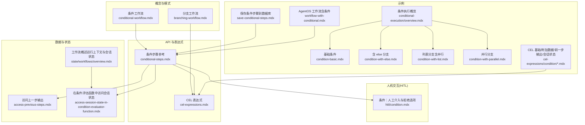
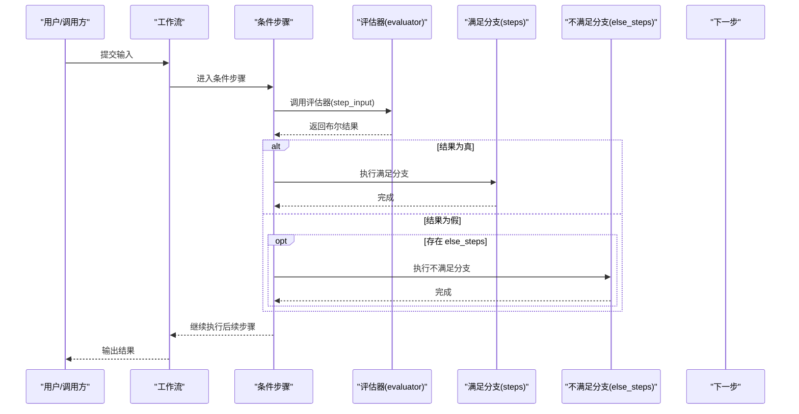
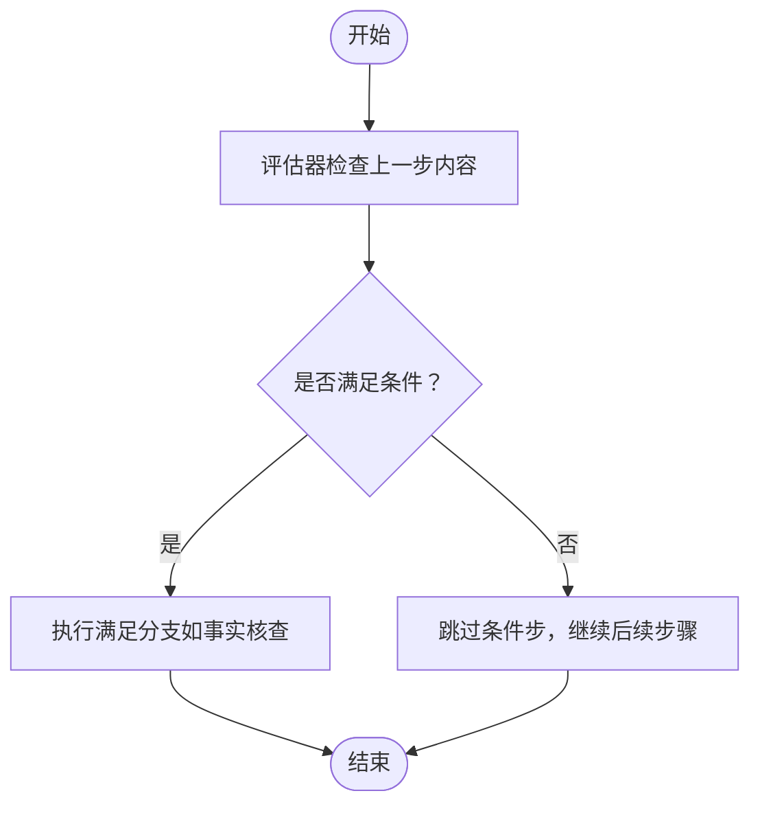
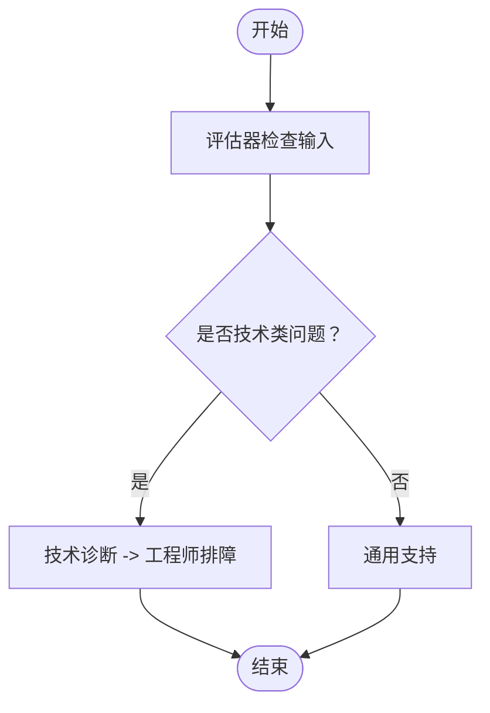
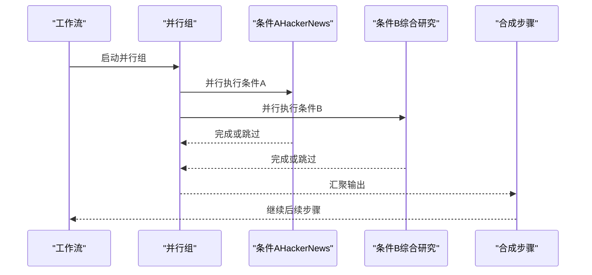
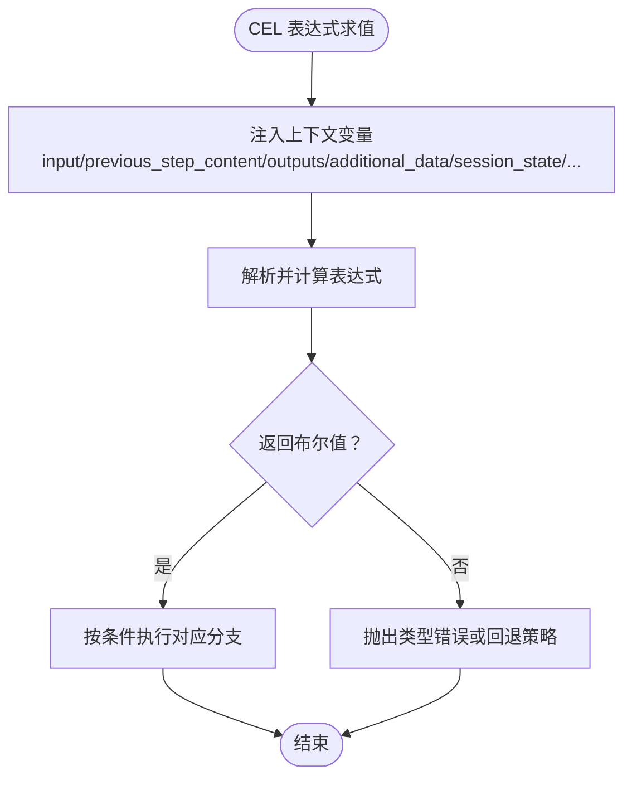
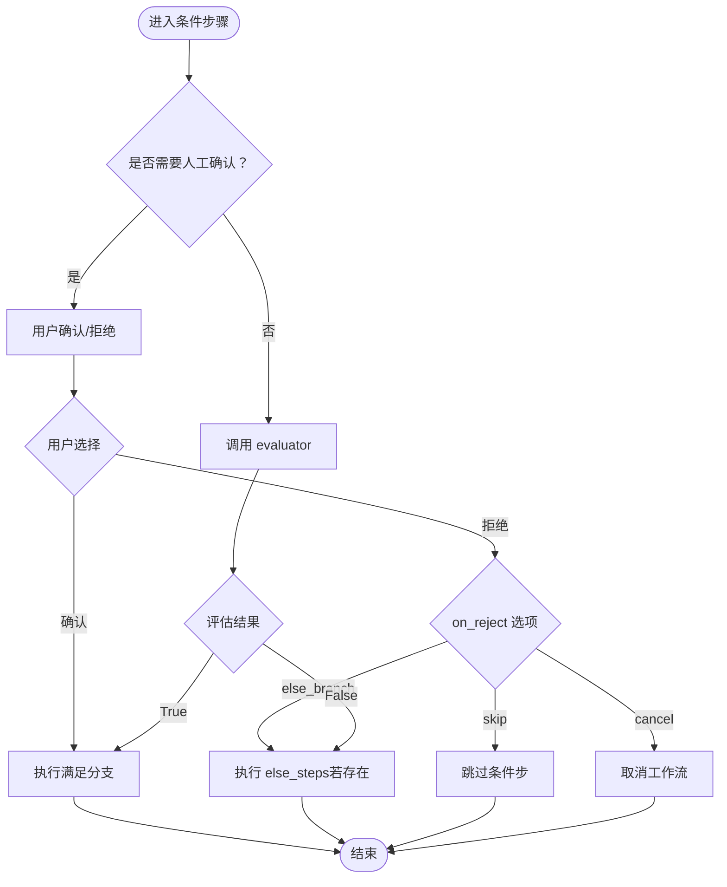
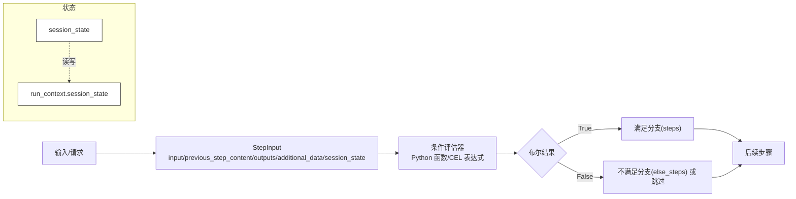
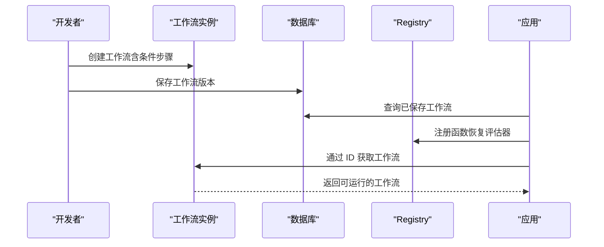
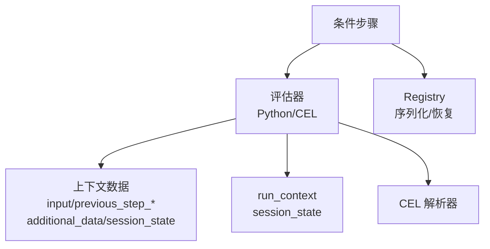

# 条件分支模式

<cite>
**本文引用的文件**
- [工作流模式：条件工作流](file://workflows/workflow-patterns/conditional-workflow.mdx)
- [工作流模式：分支工作流](file://workflows/workflow-patterns/branching-workflow.mdx)
- [条件步骤参考](file://reference/workflows/conditional-steps.mdx)
- [CEL 表达式](file://agent-os/studio/cel-expressions.mdx)
- [条件：人工介入与拒绝选项](file://workflows/hitl/condition.mdx)
- [访问上一步输出](file://workflows/access-previous-steps.mdx)
- [在条件评估函数中访问会话状态](file://state/workflows/access-session-state-in-condition-evaluator-function.mdx)
- [工作流概述（运行上下文与会话状态）](file://state/workflows/overview.mdx)
- [示例：条件执行概览](file://examples/workflows/conditional-execution/overview.mdx)
- [示例：条件执行（基础）](file://examples/workflows/conditional-execution/condition-basic.mdx)
- [示例：条件执行（含 else 分支）](file://examples/workflows/conditional-execution/condition-with-else.mdx)
- [示例：条件执行（列表分支）](file://examples/workflows/conditional-execution/condition-with-list.mdx)
- [示例：条件执行（并行分支）](file://examples/workflows/conditional-execution/condition-with-parallel.mdx)
- [示例：保存条件步骤到数据库](file://examples/components/workflows/save-conditional-steps.mdx)
- [示例：AgentOS 工作流（含条件）](file://examples/agent-os/workflow/workflow-with-conditional.mdx)
- [示例：CEL 条件（附加数据）](file://examples/workflows/cel-expressions/condition/cel-additional-data.mdx)
- [示例：CEL 条件（输入路由）](file://examples/workflows/cel-expressions/condition/cel-basic.mdx)
- [示例：CEL 条件（前一步输出）](file://examples/workflows/cel-expressions/condition/cel-previous-step.mdx)
- [示例：CEL 条件（会话状态）](file://examples/workflows/cel-expressions/condition/cel-session-state.mdx)
</cite>

## 目录
1. [简介](#简介)
2. [项目结构](#项目结构)
3. [核心组件](#核心组件)
4. [架构总览](#架构总览)
5. [详细组件分析](#详细组件分析)
6. [依赖关系分析](#依赖关系分析)
7. [性能考量](#性能考量)
8. [故障排查指南](#故障排查指南)
9. [结论](#结论)
10. [附录](#附录)

## 简介
本技术文档系统性阐述“条件分支模式”，围绕条件表达式、评估逻辑、数据来源与状态管理展开，覆盖基础条件、多分支与复杂条件场景，并给出性能优化与最佳实践建议。读者可据此在工作流中可靠地实现基于输入、历史输出、附加数据与会话状态的判定与路径选择。

## 项目结构
本仓库提供了从概念到示例的完整资料，涵盖：
- 概念与模式：条件工作流、分支工作流
- API 参考：条件步骤参数与行为
- 表达式语言：CEL 在条件、循环与路由器中的应用
- 人机交互：条件步骤的人工确认与拒绝策略
- 数据访问：上一步输出、附加数据、会话状态
- 示例：基础条件、含 else 分支、列表分支、并行分支、保存加载、CEL 条件等

图表来源
- [工作流模式：条件工作流:1-37](file://workflows/workflow-patterns/conditional-workflow.mdx#L1-L37)
- [工作流模式：分支工作流:1-176](file://workflows/workflow-patterns/branching-workflow.mdx#L1-L176)
- [条件步骤参考:1-15](file://reference/workflows/conditional-steps.mdx#L1-L15)
- [CEL 表达式:1-272](file://agent-os/studio/cel-expressions.mdx#L1-L272)
- [条件：人工介入与拒绝选项:62-107](file://workflows/hitl/condition.mdx#L62-L107)
- [访问上一步输出:72-110](file://workflows/access-previous-steps.mdx#L72-L110)
- [在条件评估函数中访问会话状态:1-32](file://state/workflows/access-session-state-in-condition-evaluator-function.mdx#L1-L32)
- [工作流概述（运行上下文与会话状态）:201-246](file://state/workflows/overview.mdx#L201-L246)
- [示例：条件执行概览:1-12](file://examples/workflows/conditional-execution/overview.mdx#L1-L12)
- [示例：条件执行（基础）:1-157](file://examples/workflows/conditional-execution/condition-basic.mdx#L1-L157)
- [示例：条件执行（含 else 分支）:1-189](file://examples/workflows/conditional-execution/condition-with-else.mdx#L1-L189)
- [示例：条件执行（列表分支）:1-189](file://examples/workflows/conditional-execution/condition-with-list.mdx#L1-L189)
- [示例：条件执行（并行分支）:1-204](file://examples/workflows/conditional-execution/condition-with-parallel.mdx#L1-L204)
- [示例：保存条件步骤到数据库:1-162](file://examples/components/workflows/save-conditional-steps.mdx#L1-L162)
- [示例：AgentOS 工作流（含条件）:1-151](file://examples/agent-os/workflow/workflow-with-conditional.mdx#L1-L151)
- [示例：CEL 条件（附加数据）:44-92](file://examples/workflows/cel-expressions/condition/cel-additional-data.mdx#L44-L92)
- [示例：CEL 条件（输入路由）:44-88](file://examples/workflows/cel-expressions/condition/cel-basic.mdx#L44-L88)
- [示例：CEL 条件（前一步输出）:86-101](file://examples/workflows/cel-expressions/condition/cel-previous-step.mdx#L86-L101)
- [示例：CEL 条件（会话状态）:74-120](file://examples/workflows/cel-expressions/condition/cel-session-state.mdx#L74-L120)

章节来源
- [工作流模式：条件工作流:1-37](file://workflows/workflow-patterns/conditional-workflow.mdx#L1-L37)
- [工作流模式：分支工作流:1-176](file://workflows/workflow-patterns/branching-workflow.mdx#L1-L176)
- [条件步骤参考:1-15](file://reference/workflows/conditional-steps.mdx#L1-L15)
- [CEL 表达式:1-272](file://agent-os/studio/cel-expressions.mdx#L1-L272)
- [条件：人工介入与拒绝选项:62-107](file://workflows/hitl/condition.mdx#L62-L107)
- [访问上一步输出:72-110](file://workflows/access-previous-steps.mdx#L72-L110)
- [在条件评估函数中访问会话状态:1-32](file://state/workflows/access-session-state-in-condition-evaluator-function.mdx#L1-L32)
- [工作流概述（运行上下文与会话状态）:201-246](file://state/workflows/overview.mdx#L201-L246)
- [示例：条件执行概览:1-12](file://examples/workflows/conditional-execution/overview.mdx#L1-L12)
- [示例：条件执行（基础）:1-157](file://examples/workflows/conditional-execution/condition-basic.mdx#L1-L157)
- [示例：条件执行（含 else 分支）:1-189](file://examples/workflows/conditional-execution/condition-with-else.mdx#L1-L189)
- [示例：条件执行（列表分支）:1-189](file://examples/workflows/conditional-execution/condition-with-list.mdx#L1-L189)
- [示例：条件执行（并行分支）:1-204](file://examples/workflows/conditional-execution/condition-with-parallel.mdx#L1-L204)
- [示例：保存条件步骤到数据库:1-162](file://examples/components/workflows/save-conditional-steps.mdx#L1-L162)
- [示例：AgentOS 工作流（含条件）:1-151](file://examples/agent-os/workflow/workflow-with-conditional.mdx#L1-L151)
- [示例：CEL 条件（附加数据）:44-92](file://examples/workflows/cel-expressions/condition/cel-additional-data.mdx#L44-L92)
- [示例：CEL 条件（输入路由）:44-88](file://examples/workflows/cel-expressions/condition/cel-basic.mdx#L44-L88)
- [示例：CEL 条件（前一步输出）:86-101](file://examples/workflows/cel-expressions/condition/cel-previous-step.mdx#L86-L101)
- [示例：CEL 条件（会话状态）:74-120](file://examples/workflows/cel-expressions/condition/cel-session-state.mdx#L74-L120)

## 核心组件
- 条件步骤（Condition）
  - 作用：根据评估器返回值在两条路径间切换
  - 关键参数：evaluator（布尔或可调用）、steps（满足时执行）、else_steps（不满足时执行，可选）、name/description、requires_confirmation（人工确认）、on_reject（拒绝时动作）
  - 行为要点：当 evaluator 返回 False 且未提供 else_steps 时，跳过该条件步继续后续步骤；当 requires_confirmation=True 时，忽略 evaluator，以用户决策为准
- 表达式语言（CEL）
  - 适用范围：Condition 的 evaluator、Loop 的 end_condition、Router 的 selector
  - 上下文变量：input、previous_step_content、previous_step_outputs、additional_data、session_state、step_choices、current_iteration/max_iterations/all_success/last_step_content/step_outputs 等
- 人机交互（HITL）
  - 支持在条件步骤中暂停等待用户确认，拒绝时可选择 else_branch/skip/cancel
- 数据与状态
  - 上一步输出：通过 StepInput 访问 previous_step_content/previous_step_outputs
  - 附加数据：additional_data 作为 map 注入
  - 会话状态：session_state 用于跨步骤持久化与条件判断
  - 运行上下文：run_context 注入到自定义函数（包括条件评估器），可读写 session_state

章节来源
- [条件步骤参考:1-15](file://reference/workflows/conditional-steps.mdx#L1-L15)
- [CEL 表达式:1-272](file://agent-os/studio/cel-expressions.mdx#L1-L272)
- [条件：人工介入与拒绝选项:62-107](file://workflows/hitl/condition.mdx#L62-L107)
- [访问上一步输出:72-110](file://workflows/access-previous-steps.mdx#L72-L110)
- [在条件评估函数中访问会话状态:1-32](file://state/workflows/access-session-state-in-condition-evaluator-function.mdx#L1-L32)
- [工作流概述（运行上下文与会话状态）:201-246](file://state/workflows/overview.mdx#L201-L246)

## 架构总览
下图展示了条件步骤在工作流中的位置与数据流：

图表来源
- [条件步骤参考:1-15](file://reference/workflows/conditional-steps.mdx#L1-L15)
- [示例：条件执行（基础）:100-115](file://examples/workflows/conditional-execution/condition-basic.mdx#L100-L115)
- [示例：条件执行（含 else 分支）:110-124](file://examples/workflows/conditional-execution/condition-with-else.mdx#L110-L124)

## 详细组件分析

### 基础条件（单分支）
- 场景：线性流程中插入一个“事实核查”门禁，仅当摘要包含特定关键词时才执行核查
- 数据来源：previous_step_content
- 处理逻辑：评估器对上一步内容进行关键字匹配，返回布尔值
- 结果：满足则进入核查分支，否则跳过该条件步继续后续步骤

图表来源
- [示例：条件执行（基础）:50-68](file://examples/workflows/conditional-execution/condition-basic.mdx#L50-L68)
- [示例：条件执行（基础）:100-115](file://examples/workflows/conditional-execution/condition-basic.mdx#L100-L115)

章节来源
- [示例：条件执行（基础）:1-157](file://examples/workflows/conditional-execution/condition-basic.mdx#L1-L157)

### 多分支条件（含 else 分支）
- 场景：客服查询自动分流至技术诊断或通用支持
- 数据来源：input
- 处理逻辑：评估器对用户输入进行关键字匹配；若命中技术相关词汇走技术分支（多个步骤），否则走 else 分支
- 结果：按分支顺序执行相应步骤序列

图表来源
- [示例：条件执行（含 else 分支）:60-78](file://examples/workflows/conditional-execution/condition-with-else.mdx#L60-L78)
- [示例：条件执行（含 else 分支）:110-124](file://examples/workflows/conditional-execution/condition-with-else.mdx#L110-L124)

章节来源
- [示例：条件执行（含 else 分支）:1-189](file://examples/workflows/conditional-execution/condition-with-else.mdx#L1-L189)

### 列表分支与并行条件
- 场景：根据主题决定是否并行执行多个研究任务（如 HackerNews、Exa、趋势分析、事实核查）
- 数据来源：input 或 previous_step_content
- 处理逻辑：条件评估器返回 True 时，执行一组步骤（列表形式）；可在 Parallel 中组合多个条件分支
- 结果：并行分支完成后统一进入后续合成步骤

图表来源
- [示例：条件执行（列表分支）:128-153](file://examples/workflows/conditional-execution/condition-with-list.mdx#L128-L153)
- [示例：条件执行（并行分支）:129-159](file://examples/workflows/conditional-execution/condition-with-parallel.mdx#L129-L159)

章节来源
- [示例：条件执行（列表分支）:1-189](file://examples/workflows/conditional-execution/condition-with-list.mdx#L1-L189)
- [示例：条件执行（并行分支）:1-204](file://examples/workflows/conditional-execution/condition-with-parallel.mdx#L1-L204)

### 复杂条件（CEL 表达式）
- 场景：使用 CEL 表达式在条件、循环、路由器中进行判定与选择
- 表达式类型与上下文
  - Condition.evaluator 必须返回布尔值，上下文变量包括 input、previous_step_content、previous_step_outputs、additional_data、session_state
  - Loop.end_condition 必须返回布尔值，上下文变量包括 current_iteration、max_iterations、all_success、last_step_content、step_outputs
  - Router.selector 必须返回字符串（步骤名）或 Step 对象或步骤列表，上下文变量包括 step_choices 等
- 示例要点
  - 输入路由：基于 input.contains(...) 决定紧急与普通处理
  - 前一步输出路由：先分类再基于 previous_step_content.contains(...) 决策
  - 附加数据路由：基于 additional_data.priority 判定优先级
  - 会话状态路由：基于 session_state.retry_count 实现重试逻辑

图表来源
- [CEL 表达式:1-272](file://agent-os/studio/cel-expressions.mdx#L1-L272)
- [示例：CEL 条件（输入路由）:44-88](file://examples/workflows/cel-expressions/condition/cel-basic.mdx#L44-L88)
- [示例：CEL 条件（前一步输出）:86-101](file://examples/workflows/cel-expressions/condition/cel-previous-step.mdx#L86-L101)
- [示例：CEL 条件（附加数据）:44-92](file://examples/workflows/cel-expressions/condition/cel-additional-data.mdx#L44-L92)
- [示例：CEL 条件（会话状态）:74-120](file://examples/workflows/cel-expressions/condition/cel-session-state.mdx#L74-L120)

章节来源
- [CEL 表达式:1-272](file://agent-os/studio/cel-expressions.mdx#L1-L272)
- [示例：CEL 条件（输入路由）:1-120](file://examples/workflows/cel-expressions/condition/cel-basic.mdx#L1-L120)
- [示例：CEL 条件（前一步输出）:1-101](file://examples/workflows/cel-expressions/condition/cel-previous-step.mdx#L1-L101)
- [示例：CEL 条件（附加数据）:1-92](file://examples/workflows/cel-expressions/condition/cel-additional-data.mdx#L1-L92)
- [示例：CEL 条件（会话状态）:1-120](file://examples/workflows/cel-expressions/condition/cel-session-state.mdx#L1-L120)

### 人工介入与拒绝策略（HITL）
- 当 requires_confirmation=True 时，忽略 evaluator，由用户决定执行满足分支还是 else 分支
- on_reject 可选策略：
  - else_branch：执行 else_steps（默认）
  - skip：跳过整个条件步
  - cancel：取消工作流
- 若未提供 else_steps 且 on_reject=else_branch，则条件被跳过

图表来源
- [条件：人工介入与拒绝选项:62-107](file://workflows/hitl/condition.mdx#L62-L107)

章节来源
- [条件：人工介入与拒绝选项:62-107](file://workflows/hitl/condition.mdx#L62-L107)

### 状态管理与数据传递
- 上一步输出访问
  - 通过 StepInput.get_step_output()/get_step_content() 递归访问深层嵌套步骤输出
- 附加数据
  - 通过 additional_data 注入 map，供 CEL 与 Python 评估器使用
- 会话状态
  - 通过 session_state 在步骤间持久化计数、标志位等
  - run_context 注入到自定义函数（包括条件评估器），可读写 session_state
- 示例
  - 基于 previous_step_content 的条件路由
  - 基于 additional_data.priority 的优先级路由
  - 基于 session_state.retry_count 的重试逻辑

图表来源
- [访问上一步输出:72-110](file://workflows/access-previous-steps.mdx#L72-L110)
- [在条件评估函数中访问会话状态:1-32](file://state/workflows/access-session-state-in-condition-evaluator-function.mdx#L1-L32)
- [工作流概述（运行上下文与会话状态）:201-246](file://state/workflows/overview.mdx#L201-L246)
- [CEL 表达式:1-272](file://agent-os/studio/cel-expressions.mdx#L1-L272)

章节来源
- [访问上一步输出:72-110](file://workflows/access-previous-steps.mdx#L72-L110)
- [在条件评估函数中访问会话状态:1-32](file://state/workflows/access-session-state-in-condition-evaluator-function.mdx#L1-L32)
- [工作流概述（运行上下文与会话状态）:201-246](file://state/workflows/overview.mdx#L201-L246)
- [CEL 表达式:1-272](file://agent-os/studio/cel-expressions.mdx#L1-L272)

### 保存与加载（序列化评估器）
- 将条件评估器以函数名序列化，配合 Registry 在加载时恢复
- 典型流程：创建工作流 -> 保存版本 -> 重启后通过 ID 与 Registry 加载 -> 运行

图表来源
- [示例：保存条件步骤到数据库:125-147](file://examples/components/workflows/save-conditional-steps.mdx#L125-L147)

章节来源
- [示例：保存条件步骤到数据库:1-162](file://examples/components/workflows/save-conditional-steps.mdx#L1-L162)

## 依赖关系分析
- 组件耦合
  - 条件步骤依赖评估器（Python 函数或 CEL 表达式）与上下文数据（input/previous_step_*、additional_data、session_state）
  - 评估器可访问 run_context，从而读写 session_state，形成对状态的间接耦合
- 外部依赖
  - CEL 解析器（cel-python）用于表达式求值
  - Registry 用于序列化/反序列化函数
- 潜在风险
  - 表达式类型错误或上下文缺失导致求值失败
  - 评估器异常中断工作流执行
  - 会话状态并发更新引发竞态

图表来源
- [CEL 表达式:1-272](file://agent-os/studio/cel-expressions.mdx#L1-L272)
- [在条件评估函数中访问会话状态:1-32](file://state/workflows/access-session-state-in-condition-evaluator-function.mdx#L1-L32)
- [示例：保存条件步骤到数据库:74-78](file://examples/components/workflows/save-conditional-steps.mdx#L74-L78)

章节来源
- [CEL 表达式:1-272](file://agent-os/studio/cel-expressions.mdx#L1-L272)
- [在条件评估函数中访问会话状态:1-32](file://state/workflows/access-session-state-in-condition-evaluator-function.mdx#L1-L32)
- [示例：保存条件步骤到数据库:1-162](file://examples/components/workflows/save-conditional-steps.mdx#L1-L162)

## 性能考量
- 评估器开销控制
  - 避免在评估器中执行重型 I/O 或长耗时操作；必要时将结果缓存到 session_state
- 表达式优化
  - 使用 CEL 表达式时尽量保持简单，避免复杂嵌套与重复计算
  - 合理利用 previous_step_outputs 缓存中间结果，减少重复检索
- 并行条件
  - 在 Parallel 中组织多个条件分支，缩短整体执行时间；但需注意资源竞争与幂等性
- 状态访问
  - 通过 run_context.session_state 读写状态应加锁或采用无冲突设计，避免竞态

## 故障排查指南
- 评估器返回类型错误
  - Condition.evaluator 必须返回布尔值；若表达式返回非布尔，将导致分支逻辑异常
- 上下文变量缺失
  - 若依赖 previous_step_content/outputs 而上一步未产生输出，需在评估器中做空值保护
- 人工确认未生效
  - requires_confirmation=True 时，评估器被忽略；检查 on_reject 选项与 else_steps 是否配置
- 会话状态未更新
  - 确认评估器签名包含 run_context 参数并正确写入 session_state
- 序列化/反序列化失败
  - 评估器必须可通过名称恢复；确保 Registry 正确注册

章节来源
- [条件：人工介入与拒绝选项:62-107](file://workflows/hitl/condition.mdx#L62-L107)
- [在条件评估函数中访问会话状态:1-32](file://state/workflows/access-session-state-in-condition-evaluator-function.mdx#L1-L32)
- [示例：保存条件步骤到数据库:74-78](file://examples/components/workflows/save-conditional-steps.mdx#L74-L78)

## 结论
条件分支模式通过“评估器 + 分支路径”的方式，在工作流中实现了灵活而可控的决策机制。结合 CEL 表达式、上一步输出、附加数据与会话状态，可覆盖从简单关键字匹配到复杂业务规则的多种场景。配合人工确认、并行执行与状态持久化，既能保证确定性，又能提升用户体验与执行效率。

## 附录
- 设计模式与最佳实践
  - 门禁式守卫：在关键节点放置条件步，前置过滤低价值流量
  - 多路复用：将多个条件并行化，缩短端到端延迟
  - 状态驱动：用 session_state 记录阶段标志、重试次数等，使条件具备记忆能力
  - 表达式优先：能用 CEL 表达式的场景优先使用，便于可视化编辑与持久化
  - 评估器最小化：将复杂逻辑下沉到工具或步骤，评估器只做轻量判定
  - 异常与回退：为评估器与表达式提供明确的错误处理与回退分支