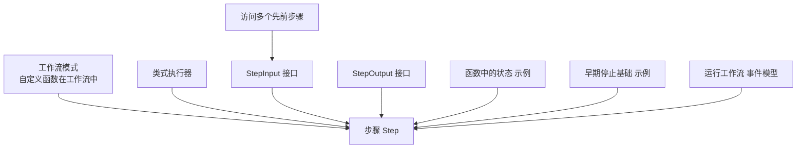
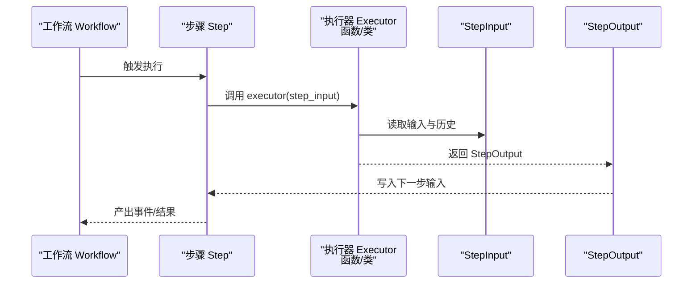
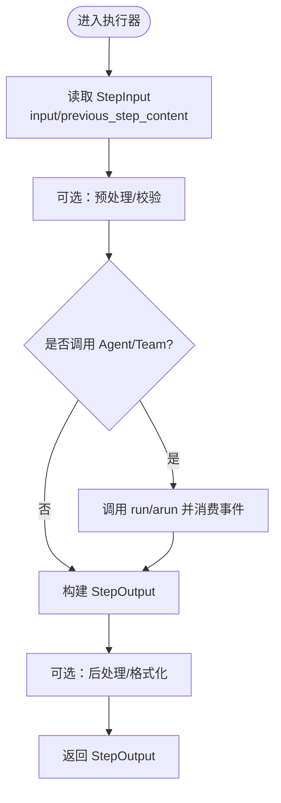
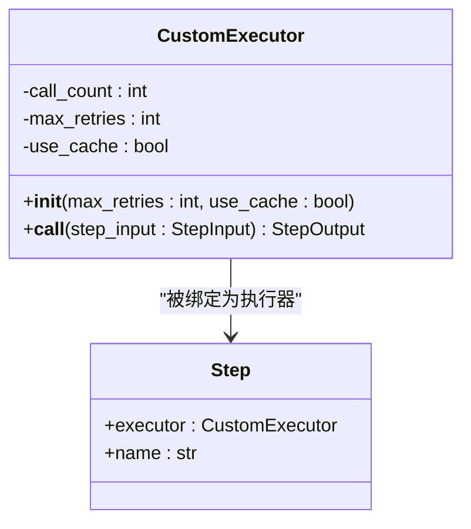
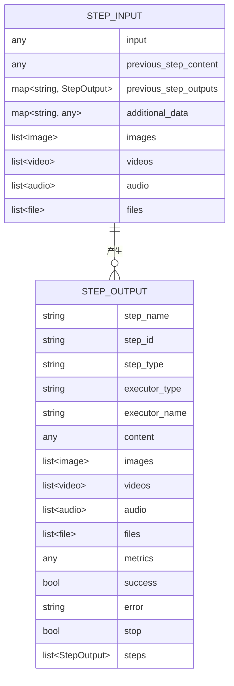
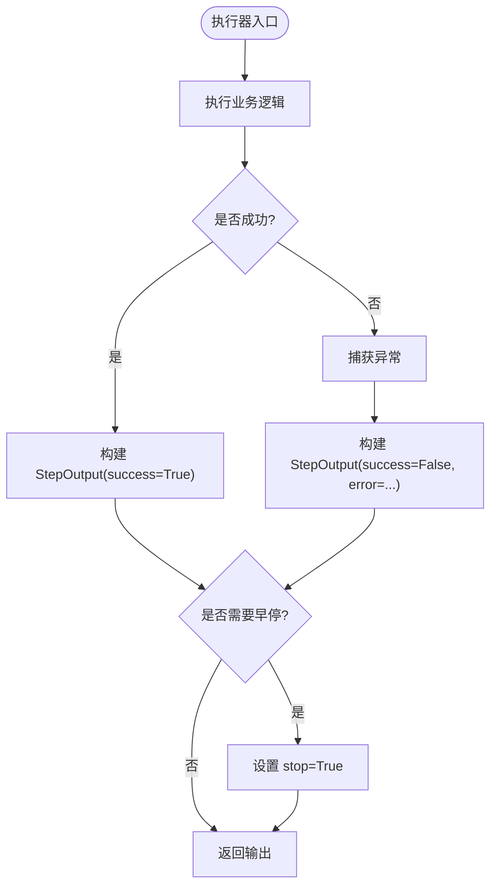
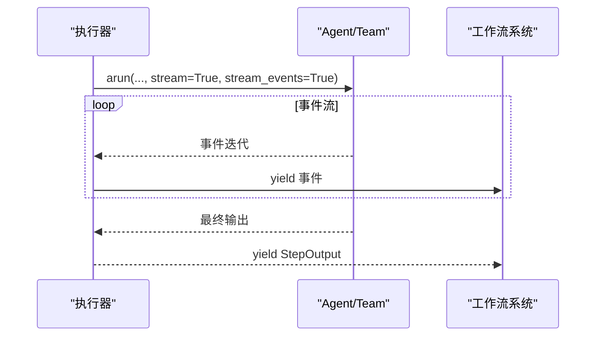

# 自定义执行器

<cite>
**本文引用的文件**
- [自定义函数在工作流中](file://workflows/workflow-patterns/custom-function-step-workflow.mdx)
- [类式执行器](file://workflows/usage/class-based-executor.mdx)
- [函数中的状态](file://examples/workflows/advanced-concepts/session-state/state-in-function.mdx)
- [早期停止基础](file://examples/workflows/advanced-concepts/early-stopping/early-stop-basic.mdx)
- [StepInput 参考](file://reference/workflows/step_input.mdx)
- [StepOutput 参考](file://reference/workflows/step_output.mdx)
- [运行工作流](file://workflows/running-workflows.mdx)
- [访问多个先前步骤](file://workflows/access-previous-steps.mdx)
</cite>

## 目录
1. [简介](#简介)
2. [项目结构](#项目结构)
3. [核心组件](#核心组件)
4. [架构总览](#架构总览)
5. [详细组件分析](#详细组件分析)
6. [依赖关系分析](#依赖关系分析)
7. [性能考虑](#性能考虑)
8. [故障排查指南](#故障排查指南)
9. [结论](#结论)
10. [附录](#附录)

## 简介
本篇文档围绕“自定义执行器”展开，系统讲解如何在工作流中使用自定义 Python 函数或类作为步骤执行器（executor）。内容涵盖：
- 函数签名与参数传递机制
- 输入输出规范与数据格式
- 错误处理与异常管理
- 流式执行与事件模型
- 性能特性与优化建议
- 测试与调试策略

目标是帮助读者快速将现有函数转换为工作流步骤，并在复杂场景中稳定、高效地运行。

## 项目结构
与“自定义执行器”直接相关的文档主要分布在以下位置：
- 工作流模式与用法：workflows/workflow-patterns/custom-function-step-workflow.mdx、workflows/usage/class-based-executor.mdx
- 输入输出接口参考：reference/workflows/step_input.mdx、reference/workflows/step_output.mdx
- 高级用法示例：examples/workflows/advanced-concepts/session-state/state-in-function.mdx、examples/workflows/advanced-concepts/early-stopping/early-stop-basic.mdx
- 运行时事件与流式输出：workflows/running-workflows.mdx
- 多步历史访问：workflows/access-previous-steps.mdx

**图表来源**
- [自定义函数在工作流中:1-259](file://workflows/workflow-patterns/custom-function-step-workflow.mdx#L1-L259)
- [类式执行器:1-132](file://workflows/usage/class-based-executor.mdx#L1-L132)
- [StepInput 参考:1-29](file://reference/workflows/step_input.mdx#L1-L29)
- [StepOutput 参考:1-25](file://reference/workflows/step_output.mdx#L1-L25)
- [函数中的状态:1-405](file://examples/workflows/advanced-concepts/session-state/state-in-function.mdx#L1-L405)
- [早期停止基础:1-266](file://examples/workflows/advanced-concepts/early-stopping/early-stop-basic.mdx#L1-L266)
- [运行工作流:460-488](file://workflows/running-workflows.mdx#L460-L488)
- [访问多个先前步骤:1-41](file://workflows/access-previous-steps.mdx#L1-L41)

**章节来源**
- [自定义函数在工作流中:1-259](file://workflows/workflow-patterns/custom-function-step-workflow.mdx#L1-L259)
- [类式执行器:1-132](file://workflows/usage/class-based-executor.mdx#L1-L132)
- [StepInput 参考:1-29](file://reference/workflows/step_input.mdx#L1-L29)
- [StepOutput 参考:1-25](file://reference/workflows/step_output.mdx#L1-L25)
- [函数中的状态:1-405](file://examples/workflows/advanced-concepts/session-state/state-in-function.mdx#L1-L405)
- [早期停止基础:1-266](file://examples/workflows/advanced-concepts/early-stopping/early-stop-basic.mdx#L1-L266)
- [运行工作流:460-488](file://workflows/running-workflows.mdx#L460-L488)
- [访问多个先前步骤:1-41](file://workflows/access-previous-steps.mdx#L1-L41)

## 核心组件
- 执行器（Executor）
  - 函数式执行器：接收 StepInput，返回 StepOutput
  - 类式执行器：实现 __call__ 方法，同样遵循上述签名约定；可异步实现
- 步骤（Step）：通过 executor 字段绑定执行器
- 工作流（Workflow）：编排多个步骤，支持同步/异步与流式事件
- 输入输出接口：StepInput、StepOutput 提供标准化的数据契约

关键要点
- 函数签名必须严格匹配：executor(step_input: StepInput) -> StepOutput 或异步版本
- StepInput 提供对上一步输出、历史内容、媒体等的统一访问
- StepOutput 支持 success、error、stop、metrics 等控制与元数据字段

**章节来源**
- [自定义函数在工作流中:14-16](file://workflows/workflow-patterns/custom-function-step-workflow.mdx#L14-L16)
- [类式执行器:50-96](file://workflows/usage/class-based-executor.mdx#L50-L96)
- [StepInput 参考:6-27](file://reference/workflows/step_input.mdx#L6-L27)
- [StepOutput 参考:6-24](file://reference/workflows/step_output.mdx#L6-L24)

## 架构总览
下图展示了自定义执行器在工作流中的调用关系与数据流：

**图表来源**
- [自定义函数在工作流中:14-16](file://workflows/workflow-patterns/custom-function-step-workflow.mdx#L14-L16)
- [类式执行器:50-96](file://workflows/usage/class-based-executor.mdx#L50-L96)
- [运行工作流:460-488](file://workflows/running-workflows.mdx#L460-L488)

## 详细组件分析

### 函数式执行器
- 签名与职责
  - 必须接受 StepInput，返回 StepOutput
  - 可进行预处理、调用代理/团队、后处理与聚合
- 异步支持
  - 通过异步 executor 实现流式事件与并行能力
- 典型流程
  - 读取 step_input.input 与 previous_step_content
  - 可选：调用 Agent/Team 的 run/arun 并按需流式消费事件
  - 生成内容并封装为 StepOutput 返回

**图表来源**
- [自定义函数在工作流中:36-87](file://workflows/workflow-patterns/custom-function-step-workflow.mdx#L36-L87)
- [运行工作流:460-488](file://workflows/running-workflows.mdx#L460-L488)

**章节来源**
- [自定义函数在工作流中:28-87](file://workflows/workflow-patterns/custom-function-step-workflow.mdx#L28-L87)
- [运行工作流:460-488](file://workflows/running-workflows.mdx#L460-L488)

### 类式执行器
- 设计要点
  - 定义 __call__ 方法，接收 StepInput，返回 StepOutput
  - 可在构造函数中注入配置与缓存，实现有状态执行
  - 支持异步 __call__ 以适配 AgentOS 的异步流式执行
- 使用场景
  - 初始化配置（如重试次数、缓存开关）
  - 跨多次运行的状态维护（计数器、缓存）
  - 组件复用（共享实例）

**图表来源**
- [类式执行器:50-96](file://workflows/usage/class-based-executor.mdx#L50-L96)
- [类式执行器:106-109](file://workflows/usage/class-based-executor.mdx#L106-L109)

**章节来源**
- [类式执行器:1-132](file://workflows/usage/class-based-executor.mdx#L1-L132)

### 输入输出规范与数据格式
- StepInput 字段
  - input：主输入消息（字符串/字典/列表/BaseModel 等任意格式）
  - previous_step_content：上一步内容
  - previous_step_outputs：按名称映射的上一步输出对象
  - additional_data：附加上下文
  - images/videos/audio/files：媒体输入（累积）
  - 辅助方法：按名称获取特定步骤输出、合并所有历史、获取最后一步内容等
- StepOutput 字段
  - step_name/step_id/step_type：标识与类型
  - executor_type/executor_name：执行器类型与名称
  - content：主输出（任意格式）
  - images/videos/audio/files：媒体输出
  - metrics：指标与元数据
  - success/error：成功/失败与错误信息
  - stop：请求提前终止
  - steps：复合步骤的嵌套输出

**图表来源**
- [StepInput 参考:6-27](file://reference/workflows/step_input.mdx#L6-L27)
- [StepOutput 参考:6-24](file://reference/workflows/step_output.mdx#L6-L24)

**章节来源**
- [StepInput 参考:1-29](file://reference/workflows/step_input.mdx#L1-L29)
- [StepOutput 参考:1-25](file://reference/workflows/step_output.mdx#L1-L25)

### 错误处理与异常管理
- 建议策略
  - 在执行器内部捕获异常，返回 StepOutput(success=False, error=...)，避免传播未处理异常
  - 对于 Agent/Team 调用，结合 run/arun 的错误处理与事件流，确保可观测性
- 早停机制
  - 通过 StepOutput(stop=True) 请求工作流提前终止
  - 适用于安全门、质量门、数据有效性检查等场景

**图表来源**
- [早期停止基础:50-62](file://examples/workflows/advanced-concepts/early-stopping/early-stop-basic.mdx#L50-L62)
- [StepOutput 参考:20-23](file://reference/workflows/step_output.mdx#L20-L23)

**章节来源**
- [早期停止基础:50-62](file://examples/workflows/advanced-concepts/early-stopping/early-stop-basic.mdx#L50-L62)
- [StepOutput 参考:1-25](file://reference/workflows/step_output.mdx#L1-L25)

### 流式执行与事件模型
- AgentOS 场景
  - 设置 stream=True、stream_events=True，使用 arun 获取事件迭代器
  - 执行器可直接 yield 事件，系统自动注入工作流上下文
- 事件类型
  - WorkflowStarted/WorkflowCompleted/WorkflowError
  - StepStarted/StepCompleted/StepError
  - StepOutput（用于自定义函数步骤）
- 并行与条件组合
  - 结合 Steps/Parallel 等容器时，事件模型保持一致

**图表来源**
- [自定义函数在工作流中:166-253](file://workflows/workflow-patterns/custom-function-step-workflow.mdx#L166-L253)
- [运行工作流:460-488](file://workflows/running-workflows.mdx#L460-L488)

**章节来源**
- [自定义函数在工作流中:166-253](file://workflows/workflow-patterns/custom-function-step-workflow.mdx#L166-L253)
- [运行工作流:460-488](file://workflows/running-workflows.mdx#L460-L488)

### 访问多步历史与上下文
- StepInput 提供多种辅助方法
  - 按名称获取指定步骤输出与内容
  - 合并所有历史内容
  - 获取最近一次步骤内容
  - 获取工作流历史（列表/格式化字符串）
- 应用场景
  - 综合报告生成：整合多个上游步骤的结果
  - 条件判断：基于历史内容决定下一步策略

**章节来源**
- [访问多个先前步骤:12-41](file://workflows/access-previous-steps.mdx#L12-L41)
- [StepInput 参考:17-27](file://reference/workflows/step_input.mdx#L17-L27)

## 依赖关系分析
- 组件耦合
  - Step 仅依赖执行器接口（函数/类），低耦合高内聚
  - 执行器依赖 StepInput/StepOutput 两个标准接口，便于替换与扩展
- 数据流
  - 输入从 Workflow 传入 StepInput，经执行器处理后写入 StepOutput
  - 多步历史通过 StepInput 的辅助方法访问，减少跨步骤耦合
- 异步与事件
  - 执行器与 Agent/Team 的异步调用通过事件模型解耦，便于并行与监控

**图表来源**
- [StepInput 参考:6-27](file://reference/workflows/step_input.mdx#L6-L27)
- [StepOutput 参考:6-24](file://reference/workflows/step_output.mdx#L6-L24)
- [自定义函数在工作流中:14-16](file://workflows/workflow-patterns/custom-function-step-workflow.mdx#L14-L16)

**章节来源**
- [StepInput 参考:1-29](file://reference/workflows/step_input.mdx#L1-L29)
- [StepOutput 参考:1-25](file://reference/workflows/step_output.mdx#L1-L25)
- [自定义函数在工作流中:14-16](file://workflows/workflow-patterns/custom-function-step-workflow.mdx#L14-L16)

## 性能考虑
- 减少重复计算
  - 利用类式执行器的有状态缓存，避免重复请求
  - 对昂贵操作（如外部 API 调用）进行本地缓存与去重
- I/O 优化
  - 尽量批量处理与并发调用（注意限流与背压）
  - 使用异步执行器与事件流，提升吞吐
- 输出精简
  - 仅保留必要字段到 StepOutput，避免冗余序列化
- 监控与度量
  - 通过 metrics 字段记录耗时、调用次数等指标，便于定位瓶颈

[本节为通用指导，无需列出具体文件来源]

## 故障排查指南
- 常见问题
  - 执行器未返回 StepOutput：检查签名与返回值封装
  - 未捕获异常导致中断：在执行器中包裹 try/except，返回错误输出
  - 早停不生效：确认 StepOutput.stop=True 是否正确设置
  - 事件流缺失：在 AgentOS 中启用 stream=True、stream_events=True，并在执行器中 yield 事件
- 调试技巧
  - 使用日志记录关键路径与中间状态
  - 分步验证：先验证单步执行，再逐步串联
  - 利用 session_state 保存中间结果，便于复盘
- 参考示例
  - 早停与质量门：通过 StepOutput(stop=True) 控制流程
  - 会话状态读写：在执行器中读取/更新 session_state

**章节来源**
- [早期停止基础:50-62](file://examples/workflows/advanced-concepts/early-stopping/early-stop-basic.mdx#L50-L62)
- [函数中的状态:76-148](file://examples/workflows/advanced-concepts/session-state/state-in-function.mdx#L76-L148)
- [运行工作流:460-488](file://workflows/running-workflows.mdx#L460-L488)

## 结论
自定义执行器提供了工作流中最高自由度的扩展点。通过遵循 StepInput/StepOutput 的标准接口、合理组织函数签名与异步事件流、完善错误处理与早停机制，可以构建出灵活、可观测、高性能的工作流步骤。配合类式执行器的状态化能力与会话状态持久化，能够满足复杂业务场景下的可维护性与可复用性需求。

[本节为总结性内容，无需列出具体文件来源]

## 附录

### 快速实践清单
- 明确步骤职责：预处理/调用/后处理三段式
- 严格签名：executor(step_input: StepInput) -> StepOutput
- 异步优先：在 AgentOS 中使用异步执行器与事件流
- 错误兜底：捕获异常并返回 StepOutput(success=False, error=...)
- 早停控制：根据业务规则设置 stop=True
- 历史访问：使用 StepInput 辅助方法获取多步内容
- 性能优化：缓存、并发、指标监控

[本节为通用指导，无需列出具体文件来源]