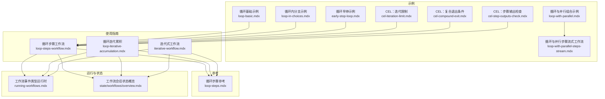
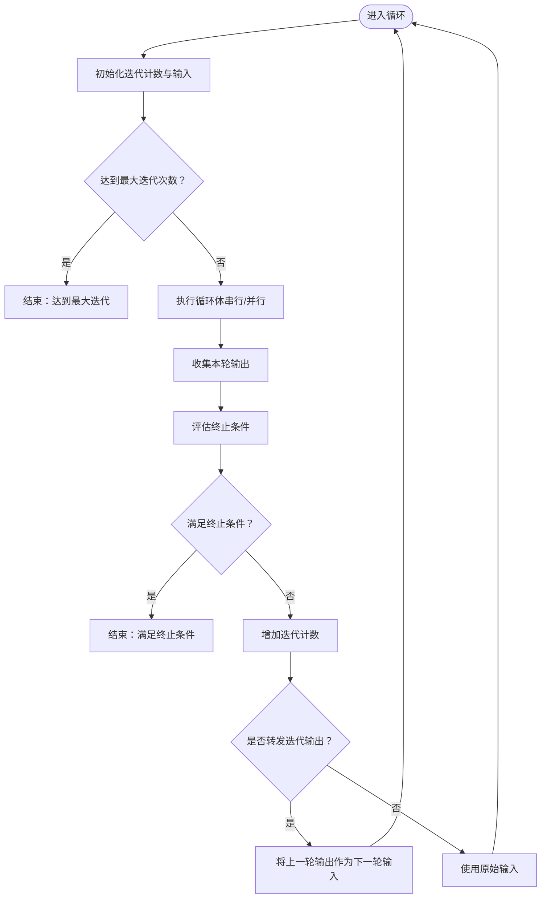
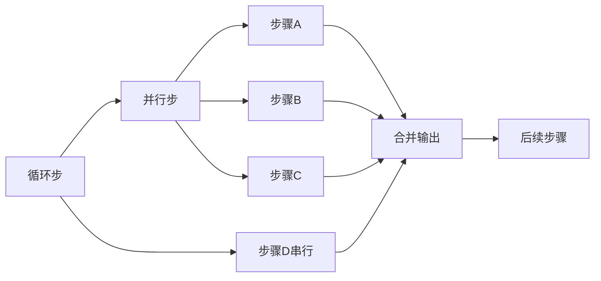
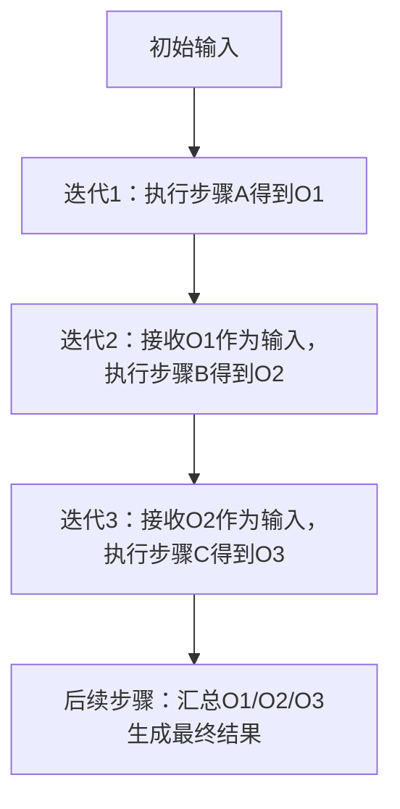
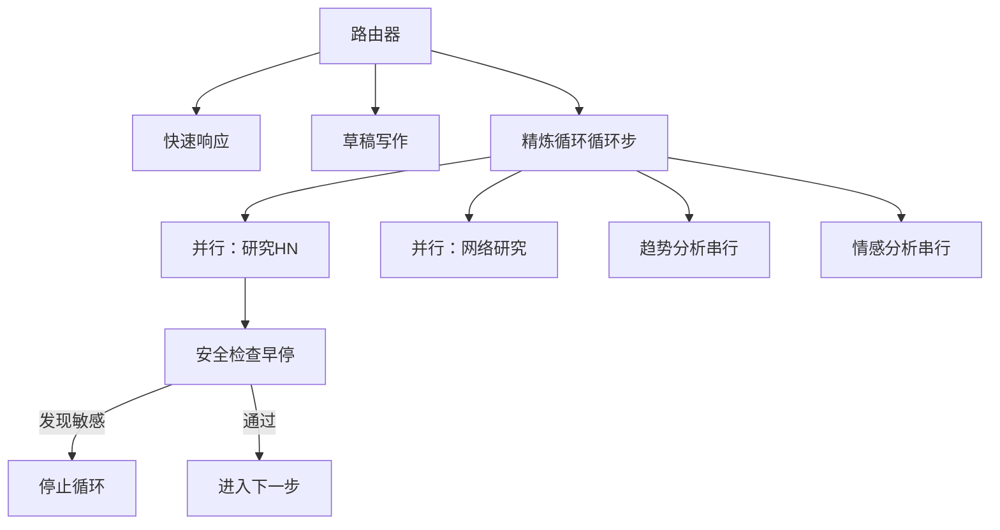
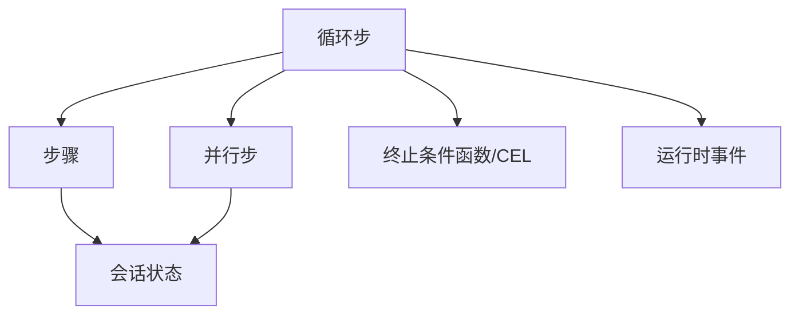

# 迭代循环模式

<cite>
**本文引用的文件**
- [循环基础示例](file://examples/workflows/loop-execution/loop-basic.mdx)
- [循环与并行组合示例](file://examples/workflows/loop-execution/loop-with-parallel.mdx)
- [循环步骤工作流](file://workflows/usage/loop-steps-workflow.mdx)
- [循环迭代累积](file://workflows/usage/loop-iterative-accumulation.mdx)
- [循环步骤参考](file://reference/workflows/loop-steps.mdx)
- [迭代式工作流](file://workflows/workflow-patterns/iterative-workflow.mdx)
- [循环内分支示例](file://examples/workflows/conditional-branching/loop-in-choices.mdx)
- [循环早停示例](file://examples/workflows/advanced-concepts/early-stopping/early-stop-loop.mdx)
- [循环与并行步骤流式工作流](file://workflows/usage/loop-with-parallel-steps-stream.mdx)
- [工作流事件类型（运行时）](file://workflows/running-workflows.mdx)
- [工作流会话状态概览](file://state/workflows/overview.mdx)
- [CEL 表达式：迭代限制](file://examples/workflows/cel-expressions/loop/cel-iteration-limit.mdx)
- [CEL 表达式：复合退出条件](file://examples/workflows/cel-expressions/loop/cel-compound-exit.mdx)
- [CEL 表达式：步骤输出检查](file://examples/workflows/cel-expressions/loop/cel-step-outputs-check.mdx)
</cite>

## 目录
1. [引言](#引言)
2. [项目结构](#项目结构)
3. [核心组件](#核心组件)
4. [架构总览](#架构总览)
5. [详细组件分析](#详细组件分析)
6. [依赖关系分析](#依赖关系分析)
7. [性能考量](#性能考量)
8. [故障排查指南](#故障排查指南)
9. [结论](#结论)
10. [附录](#附录)

## 引言
本技术文档系统性阐述“迭代循环模式”的设计与实现，聚焦于如何在工作流中重复执行一组步骤直至满足特定终止条件。文档覆盖循环控制机制（最大迭代次数、终止条件函数、CEL 条件表达式）、终止触发方式（安全检查早停）、状态维护与数据累积（迭代输入转发、会话状态共享）、并行与串行混合执行、以及性能监控与资源管理。同时给出基本循环与并行循环的实现路径，并总结循环嵌套与复杂逻辑的处理方法及应用场景。

## 项目结构
围绕迭代循环模式的相关内容主要分布在以下区域：
- 示例：循环基础、循环与并行组合、循环与并行步骤流式工作流、循环内分支、循环早停、CEL 表达式循环等
- 使用指南：循环步骤工作流、循环迭代累积、迭代式工作流
- 参考：循环步骤参数与行为
- 运行与状态：工作流事件类型、工作流会话状态



图表来源
- [循环基础示例](file://examples/workflows/loop-execution/loop-basic.mdx)
- [循环与并行组合示例](file://examples/workflows/loop-execution/loop-with-parallel.mdx)
- [循环与并行步骤流式工作流](file://workflows/usage/loop-with-parallel-steps-stream.mdx)
- [循环内分支示例](file://examples/workflows/conditional-branching/loop-in-choices.mdx)
- [循环早停示例](file://examples/workflows/advanced-concepts/early-stopping/early-stop-loop.mdx)
- [循环步骤工作流](file://workflows/usage/loop-steps-workflow.mdx)
- [循环迭代累积](file://workflows/usage/loop-iterative-accumulation.mdx)
- [迭代式工作流](file://workflows/workflow-patterns/iterative-workflow.mdx)
- [循环步骤参考](file://reference/workflows/loop-steps.mdx)
- [工作流事件类型（运行时）](file://workflows/running-workflows.mdx)
- [工作流会话状态概览](file://state/workflows/overview.mdx)

章节来源
- [循环基础示例](file://examples/workflows/loop-execution/loop-basic.mdx)
- [循环与并行组合示例](file://examples/workflows/loop-execution/loop-with-parallel.mdx)
- [循环与并行步骤流式工作流](file://workflows/usage/loop-with-parallel-steps-stream.mdx)
- [循环内分支示例](file://examples/workflows/conditional-branching/loop-in-choices.mdx)
- [循环早停示例](file://examples/workflows/advanced-concepts/early-stopping/early-stop-loop.mdx)
- [循环步骤工作流](file://workflows/usage/loop-steps-workflow.mdx)
- [循环迭代累积](file://workflows/usage/loop-iterative-accumulation.mdx)
- [迭代式工作流](file://workflows/workflow-patterns/iterative-workflow.mdx)
- [循环步骤参考](file://reference/workflows/loop-steps.mdx)
- [工作流事件类型（运行时）](file://workflows/running-workflows.mdx)
- [工作流会话状态概览](file://state/workflows/overview.mdx)

## 核心组件
- 循环步（Loop）
  - 负责在每次迭代中顺序或并行执行一组子步骤
  - 支持最大迭代次数（max_iterations）与终止条件（end_condition）
  - 支持迭代输入转发（forward_iteration_output），默认逐次传递上一次输出作为本次输入
  - 支持早停（stop=True）以中断整个循环
- 步骤（Step）
  - 执行器可以是 Agent、Team 或自定义函数
  - 可通过 run_context 访问与更新会话状态
- 并行步（Parallel）
  - 在单次迭代内并发执行多个独立步骤，提升吞吐
- 终止条件（end_condition）
  - 可为同步或异步函数，接收上一轮所有步骤输出列表，返回布尔值决定是否结束
  - 也可使用 CEL 表达式进行声明式终止判断
- 事件与状态
  - 运行时事件包括 LoopExecutionStarted、LoopIterationStartedEvent、LoopIterationCompletedEvent、LoopExecutionCompleted
  - 会话状态贯穿工作流生命周期，支持持久化与跨组件共享

章节来源
- [循环步骤参考](file://reference/workflows/loop-steps.mdx)
- [工作流事件类型（运行时）](file://workflows/running-workflows.mdx)
- [工作流会话状态概览](file://state/workflows/overview.mdx)

## 架构总览
下图展示了循环模式在工作流中的典型调用链与数据流：外部输入经由初始步骤进入循环；循环根据终止条件与最大迭代次数决定是否继续；在每次迭代中可选择串行或并行执行多个子步骤；最终汇聚到后续步骤生成结果。

```mermaid
sequenceDiagram
participant Client as "客户端"
participant WF as "工作流"
participant Loop as "循环步"
participant P as "并行步"
participant S1 as "步骤A"
participant S2 as "步骤B"
participant Eval as "终止条件函数"
participant Next as "后续步骤"
Client->>WF : 提交输入
WF->>Loop : 启动循环
loop 每次迭代
alt 包含并行
Loop->>P : 并行执行
P->>S1 : 执行
P->>S2 : 执行
S1-->>P : 输出1
S2-->>P : 输出2
P-->>Loop : 汇总输出
else 仅串行
Loop->>S1 : 执行
S1-->>Loop : 输出
end
Loop->>Eval : 传入上一轮输出列表
Eval-->>Loop : 返回布尔值
alt 需要继续
Loop->>Loop : 增加迭代计数
else 结束
Loop-->>Next : 进入下一步
end
end
Next-->>Client : 返回最终结果
```

图表来源
- [循环与并行组合示例](file://examples/workflows/loop-execution/loop-with-parallel.mdx)
- [循环与并行步骤流式工作流](file://workflows/usage/loop-with-parallel-steps-stream.mdx)
- [循环步骤工作流](file://workflows/usage/loop-steps-workflow.mdx)
- [循环早停示例](file://examples/workflows/advanced-concepts/early-stopping/early-stop-loop.mdx)

## 详细组件分析

### 组件一：循环步（Loop）
- 控制机制
  - 最大迭代次数：防止无限循环
  - 终止条件函数：基于上一轮输出集合判定是否结束
  - 迭代输入转发：默认 forward_iteration_output=True，使每次迭代接收上次输出作为输入
  - 早停：在任一步骤中设置 stop=True 可提前终止循环
- 数据累积与状态维护
  - 通过 forward_iteration_output 实现“上一次输出即下一次输入”的累积
  - 通过 run_context 访问会话状态，实现跨步骤的状态共享与持久化
- 复杂逻辑
  - 支持在循环体内嵌套并行步，实现“每轮内多任务并发”
  - 支持将循环作为路由选择之一，形成“条件+循环”的复合流程



图表来源
- [循环步骤参考](file://reference/workflows/loop-steps.mdx)
- [循环步骤工作流](file://workflows/usage/loop-steps-workflow.mdx)
- [循环迭代累积](file://workflows/usage/loop-iterative-accumulation.mdx)
- [工作流会话状态概览](file://state/workflows/overview.mdx)

章节来源
- [循环步骤参考](file://reference/workflows/loop-steps.mdx)
- [循环步骤工作流](file://workflows/usage/loop-steps-workflow.mdx)
- [循环迭代累积](file://workflows/usage/loop-iterative-accumulation.mdx)
- [工作流会话状态概览](file://state/workflows/overview.mdx)

### 组件二：终止条件与早停
- 终止条件函数
  - 接收上一轮所有步骤输出列表，返回布尔值
  - 可结合内容长度、关键词匹配、聚合指标等策略
- 早停机制
  - 在某一步骤中设置 stop=True，立即中断循环并进入后续步骤
  - 适用于安全检查、合规审查等场景
- CEL 表达式终止
  - 支持使用 CEL 表达式编写终止条件，如基于 current_iteration、step_outputs 等变量
  - 适合非编程场景下的声明式终止规则

```mermaid
sequenceDiagram
participant Loop as "循环步"
participant Step as "步骤"
participant Eval as "终止条件函数/CEL"
Loop->>Step : 执行步骤
Step-->>Loop : 返回输出
Loop->>Eval : 传入输出列表
alt 返回True
Eval-->>Loop : 满足终止条件
Loop-->>Next : 结束循环
else 返回False
Eval-->>Loop : 继续迭代
Loop->>Loop : 增加迭代计数
end
Note over Step,Loop : 若步骤输出设置stop=True，则直接结束循环
```

图表来源
- [循环早停示例](file://examples/workflows/advanced-concepts/early-stopping/early-stop-loop.mdx)
- [循环步骤工作流](file://workflows/usage/loop-steps-workflow.mdx)
- [CEL 表达式：迭代限制](file://examples/workflows/cel-expressions/loop/cel-iteration-limit.mdx)
- [CEL 表达式：复合退出条件](file://examples/workflows/cel-expressions/loop/cel-compound-exit.mdx)
- [CEL 表达式：步骤输出检查](file://examples/workflows/cel-expressions/loop/cel-step-outputs-check.mdx)

章节来源
- [循环早停示例](file://examples/workflows/advanced-concepts/early-stopping/early-stop-loop.mdx)
- [循环步骤工作流](file://workflows/usage/loop-steps-workflow.mdx)
- [CEL 表达式：迭代限制](file://examples/workflows/cel-expressions/loop/cel-iteration-limit.mdx)
- [CEL 表达式：复合退出条件](file://examples/workflows/cel-expressions/loop/cel-compound-exit.mdx)
- [CEL 表达式：步骤输出检查](file://examples/workflows/cel-expressions/loop/cel-step-outputs-check.mdx)

### 组件三：并行循环与混合执行
- 并行循环
  - 在每次迭代内部并行执行多个独立步骤，显著提升吞吐
  - 适用于多源研究、多维度分析等场景
- 混合执行
  - 循环体中既包含并行步，也包含串行步，形成“并行+串行”的组合
  - 适合先并行收集信息，再串行整合与生成的流程



图表来源
- [循环与并行组合示例](file://examples/workflows/loop-execution/loop-with-parallel.mdx)
- [循环与并行步骤流式工作流](file://workflows/usage/loop-with-parallel-steps-stream.mdx)

章节来源
- [循环与并行组合示例](file://examples/workflows/loop-execution/loop-with-parallel.mdx)
- [循环与并行步骤流式工作流](file://workflows/usage/loop-with-parallel-steps-stream.mdx)

### 组件四：状态维护与数据累积
- 迭代输入转发
  - 默认 forward_iteration_output=True，使每次迭代接收上一次输出作为输入
  - 便于构建“逐步收敛”“迭代累积”等模式
- 会话状态
  - 工作流级会话状态在组件间共享，支持持久化
  - 可在自定义函数中读写状态，实现跨步骤的数据累积与上下文维护
- 典型用法
  - 数值递增、文本拼接、指标聚合等累积类任务
  - 将上一轮质量评估结果作为下一轮输入，驱动“质量驱动的迭代”



图表来源
- [循环迭代累积](file://workflows/usage/loop-iterative-accumulation.mdx)
- [迭代式工作流](file://workflows/workflow-patterns/iterative-workflow.mdx)
- [工作流会话状态概览](file://state/workflows/overview.mdx)

章节来源
- [循环迭代累积](file://workflows/usage/loop-iterative-accumulation.mdx)
- [迭代式工作流](file://workflows/workflow-patterns/iterative-workflow.mdx)
- [工作流会话状态概览](file://state/workflows/overview.mdx)

### 组件五：循环嵌套与复杂逻辑
- 循环内嵌套并行
  - 在循环体内使用并行步，实现“每轮内多任务并发”，提升整体效率
- 循环作为路由选择
  - 将循环作为 Router 的一个分支，根据用户意图动态选择“快速响应”“草稿写作”“精炼循环”等路径
- 安全检查早停
  - 在循环体内插入安全检查步骤，一旦检测到敏感内容则立即停止循环



图表来源
- [循环内分支示例](file://examples/workflows/conditional-branching/loop-in-choices.mdx)
- [循环与并行组合示例](file://examples/workflows/loop-execution/loop-with-parallel.mdx)
- [循环早停示例](file://examples/workflows/advanced-concepts/early-stopping/early-stop-loop.mdx)

章节来源
- [循环内分支示例](file://examples/workflows/conditional-branching/loop-in-choices.mdx)
- [循环与并行组合示例](file://examples/workflows/loop-execution/loop-with-parallel.mdx)
- [循环早停示例](file://examples/workflows/advanced-concepts/early-stopping/early-stop-loop.mdx)

## 依赖关系分析
- 组件耦合
  - Loop 依赖 Step/Parallel 子步骤；终止条件函数依赖 StepOutput 列表
  - 早停通过 StepOutput.stop 触发，影响 Loop 的控制流
- 外部依赖
  - 运行时事件用于可观测性与调试
  - 会话状态用于跨组件共享与持久化



图表来源
- [循环步骤参考](file://reference/workflows/loop-steps.mdx)
- [工作流事件类型（运行时）](file://workflows/running-workflows.mdx)
- [工作流会话状态概览](file://state/workflows/overview.mdx)

章节来源
- [循环步骤参考](file://reference/workflows/loop-steps.mdx)
- [工作流事件类型（运行时）](file://workflows/running-workflows.mdx)
- [工作流会话状态概览](file://state/workflows/overview.mdx)

## 性能考量
- 并行优化
  - 在循环体内使用并行步，减少总等待时间
  - 注意资源上限与并发度平衡，避免过度竞争
- 终止策略
  - 设计合理的终止条件，避免无效迭代
  - 使用 CEL 表达式或早停机制快速止损
- 流式输出
  - 支持同步/异步/流式输出，降低端到端延迟感知
- 监控与追踪
  - 关注 LoopExecutionStarted/Completed、LoopIteration* 等事件，定位瓶颈
  - 对内存增长、存储访问、工具调用等进行评估与优化

章节来源
- [循环与并行组合示例](file://examples/workflows/loop-execution/loop-with-parallel.mdx)
- [循环与并行步骤流式工作流](file://workflows/usage/loop-with-parallel-steps-stream.mdx)
- [工作流事件类型（运行时）](file://workflows/running-workflows.mdx)

## 故障排查指南
- 常见问题
  - 循环未按预期结束：检查终止条件函数逻辑与 max_iterations 设置
  - 早停不生效：确认步骤输出中 stop=True 是否被正确设置与传播
  - 并行死锁或超时：检查并行步依赖关系与外部服务可用性
  - 状态不同步：核对会话状态初始化与读写位置
- 排查步骤
  - 开启流式输出观察中间结果
  - 记录 LoopIteration* 事件，定位具体失败迭代
  - 使用 CEL 表达式验证终止条件变量（current_iteration、step_outputs）

章节来源
- [循环早停示例](file://examples/workflows/advanced-concepts/early-stopping/early-stop-loop.mdx)
- [CEL 表达式：迭代限制](file://examples/workflows/cel-expressions/loop/cel-iteration-limit.mdx)
- [CEL 表达式：复合退出条件](file://examples/workflows/cel-expressions/loop/cel-compound-exit.mdx)
- [CEL 表达式：步骤输出检查](file://examples/workflows/cel-expressions/loop/cel-step-outputs-check.mdx)
- [工作流事件类型（运行时）](file://workflows/running-workflows.mdx)

## 结论
迭代循环模式通过“可控重复 + 明确终止 + 输入转发 + 并行加速”实现了高质量、高效率的工作流编排。配合会话状态与事件监控，可在复杂业务场景中实现稳健的迭代累积、并行优化与早停保护。建议优先从简单循环起步，逐步引入并行与 CEL 终止条件，并在关键节点加入安全检查与可观测性事件，确保系统的稳定性与可维护性。

## 附录
- 应用场景
  - 质量驱动的迭代研究、内容创作与审核
  - 多源数据采集与并行分析
  - 安全合规的早停与人工介入
- 设计原则
  - 明确终止条件与最大迭代次数
  - 合理使用 forward_iteration_output 与会话状态
  - 在循环体内谨慎使用并行，避免竞态
  - 为每个关键步骤提供清晰的事件与日志