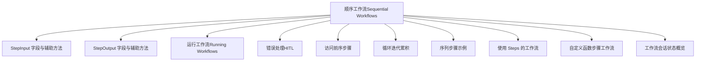
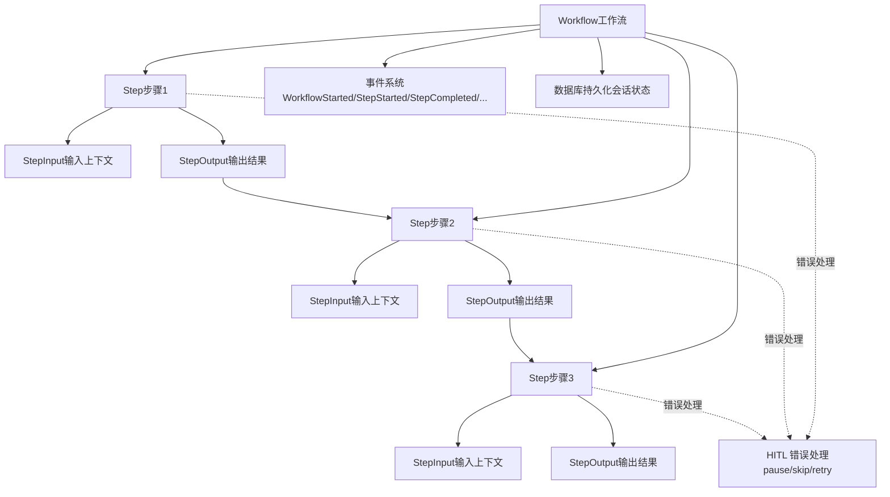
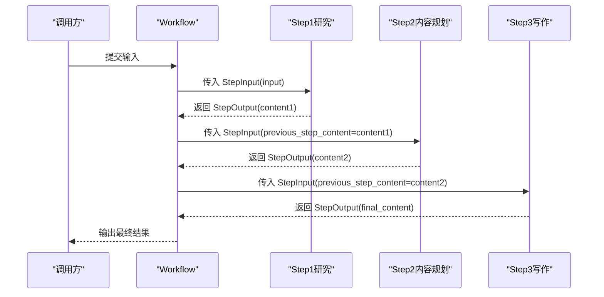
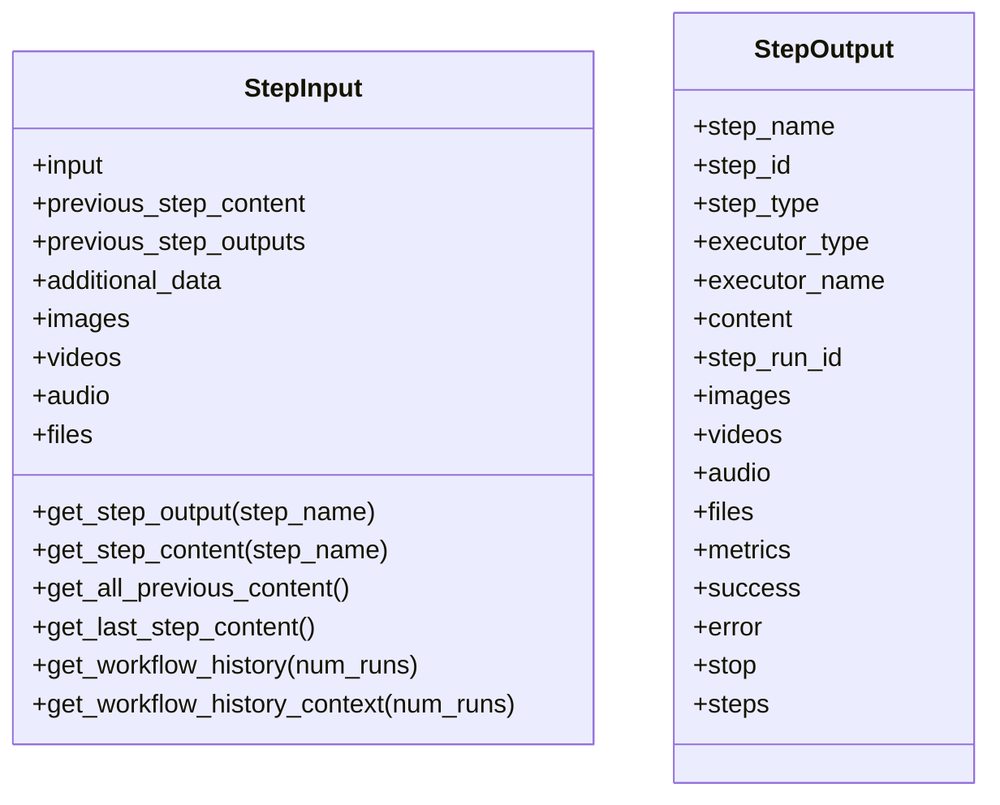
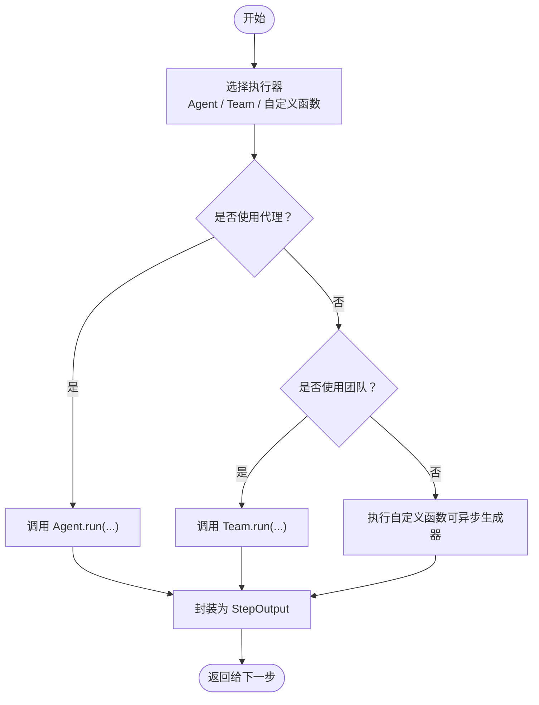
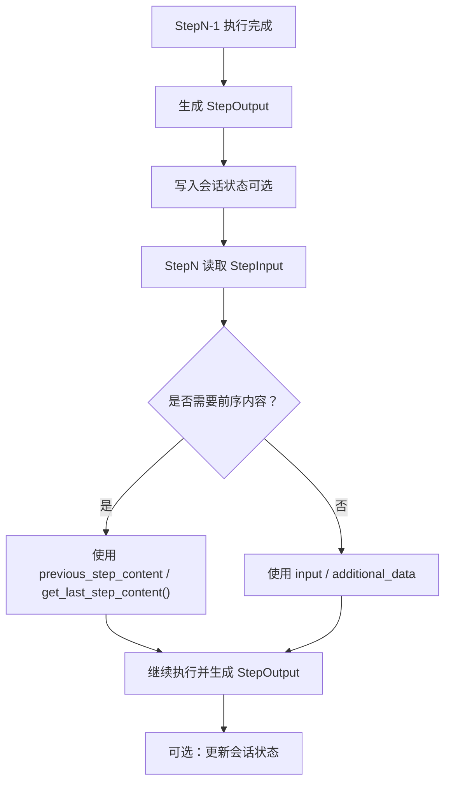
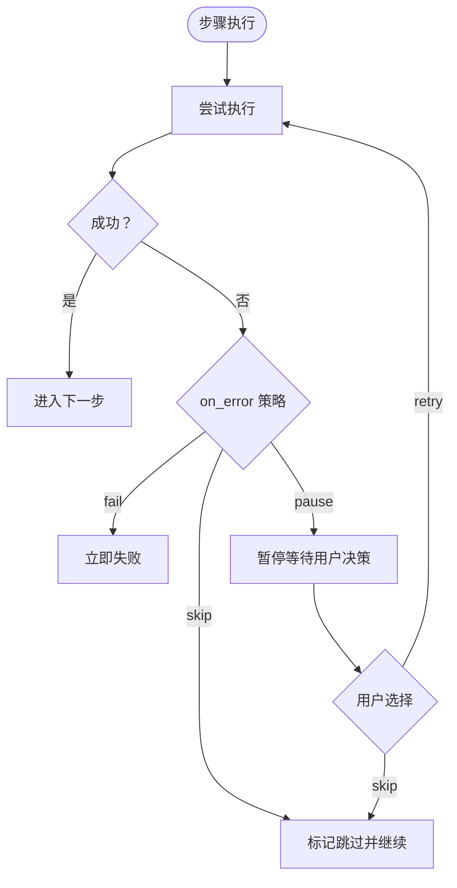
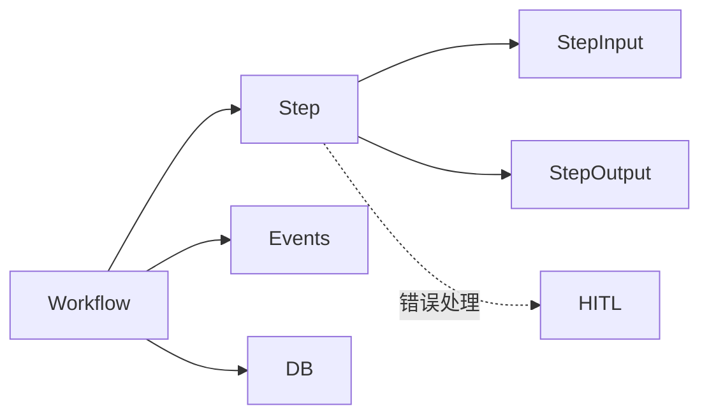

# 顺序执行模式

<cite>
**本文引用的文件**
- [顺序工作流（Sequential Workflows）](file://workflows/workflow-patterns/sequential.mdx)
- [函数替代步骤（Function instead of steps）](file://workflows/usage/function-instead-of-steps.mdx)
- [StepInput 参考](file://reference/workflows/step_input.mdx)
- [StepOutput 参考](file://reference/workflows/step_output.mdx)
- [运行工作流（Running Workflows）](file://workflows/running-workflows.mdx)
- [错误处理（HITL）](file://workflows/hitl/error-handling.mdx)
- [访问前序步骤](file://workflows/access-previous-steps.mdx)
- [循环迭代累积](file://workflows/usage/loop-iterative-accumulation.mdx)
- [序列步骤示例](file://examples/workflows/basic-workflows/sequence-of-steps/sequence-of-steps.mdx)
- [使用 Steps 的工作流](file://examples/workflows/basic-workflows/sequence-of-steps/workflow-using-steps.mdx)
- [自定义函数步骤工作流](file://workflows/workflow-patterns/custom-function-step-workflow.mdx)
- [工作流会话状态概览](file://state/workflows/overview.mdx)
</cite>

## 目录
1. [引言](#引言)
2. [项目结构](#项目结构)
3. [核心组件](#核心组件)
4. [架构总览](#架构总览)
5. [详细组件分析](#详细组件分析)
6. [依赖关系分析](#依赖关系分析)
7. [性能考量](#性能考量)
8. [故障排查指南](#故障排查指南)
9. [结论](#结论)
10. [附录](#附录)

## 引言
本技术文档围绕“顺序执行模式”展开，系统阐述如何在工作流中构建线性步骤序列，明确步骤之间的数据传递与状态管理机制，并重点说明 StepInput 与 StepOutput 在顺序执行中的关键作用。文档提供可直接定位到仓库示例与参考页面的路径，帮助读者快速理解并落地实现。

## 项目结构
与顺序执行相关的内容主要分布在以下区域：
- 概念与模式：顺序工作流、函数替代步骤、自定义函数步骤
- 数据模型：StepInput、StepOutput 的字段与辅助方法
- 运行与事件：工作流运行模式、事件类型、流式输出
- 示例与用法：序列步骤示例、使用 Steps 组合工作流、访问前序步骤、循环迭代累积
- 错误处理：HITL 错误处理、重试与跳过策略
- 状态管理：工作流会话状态跨步骤共享

**图表来源**
- [顺序工作流（Sequential Workflows）:1-50](file://workflows/workflow-patterns/sequential.mdx#L1-L50)
- [StepInput 参考:1-29](file://reference/workflows/step_input.mdx#L1-L29)
- [StepOutput 参考:1-25](file://reference/workflows/step_output.mdx#L1-L25)
- [运行工作流（Running Workflows）:460-511](file://workflows/running-workflows.mdx#L460-L511)
- [错误处理（HITL）:1-183](file://workflows/hitl/error-handling.mdx#L1-L183)
- [访问前序步骤:72-110](file://workflows/access-previous-steps.mdx#L72-L110)
- [循环迭代累积:1-49](file://workflows/usage/loop-iterative-accumulation.mdx#L1-L49)
- [序列步骤示例:1-226](file://examples/workflows/basic-workflows/sequence-of-steps/sequence-of-steps.mdx#L1-L226)
- [使用 Steps 的工作流:1-111](file://examples/workflows/basic-workflows/sequence-of-steps/workflow-using-steps.mdx#L1-L111)
- [自定义函数步骤工作流:1-148](file://workflows/workflow-patterns/custom-function-step-workflow.mdx#L1-L148)
- [工作流会话状态概览:1-39](file://state/workflows/overview.mdx#L1-L39)

**章节来源**
- [顺序工作流（Sequential Workflows）:1-50](file://workflows/workflow-patterns/sequential.mdx#L1-L50)
- [运行工作流（Running Workflows）:460-511](file://workflows/running-workflows.mdx#L460-L511)

## 核心组件
- 步骤（Step）：顺序执行的基本单元，可绑定 Agent、Team 或自定义函数作为执行器。
- 工作流（Workflow）：由一个或多个步骤组成的线性流程，支持同步、异步、流式运行。
- StepInput：步骤输入上下文，承载主输入、前一步内容、历史输出、附加数据与媒体输入。
- StepOutput：步骤输出结果，承载内容、元信息、媒体输出、指标、成功状态、错误信息、终止请求以及嵌套输出。
- 事件系统：工作流运行期间产生事件，便于监控与调试。
- 错误处理（HITL）：在步骤失败时暂停，允许用户选择重试或跳过。
- 状态管理：工作流会话状态在步骤间持久化与共享。

**章节来源**
- [StepInput 参考:1-29](file://reference/workflows/step_input.mdx#L1-L29)
- [StepOutput 参考:1-25](file://reference/workflows/step_output.mdx#L1-L25)
- [运行工作流（Running Workflows）:460-511](file://workflows/running-workflows.mdx#L460-L511)
- [错误处理（HITL）:1-183](file://workflows/hitl/error-handling.mdx#L1-L183)
- [工作流会话状态概览:1-39](file://state/workflows/overview.mdx#L1-L39)

## 架构总览
下图展示了顺序执行的工作流在系统中的交互关系：工作流编排步骤，步骤通过 StepInput 接收上游输出，执行后以 StepOutput 返回；事件系统贯穿运行期；错误处理在步骤失败时介入；状态在数据库中持久化。

**图表来源**
- [顺序工作流（Sequential Workflows）:12-32](file://workflows/workflow-patterns/sequential.mdx#L12-L32)
- [StepInput 参考:6-27](file://reference/workflows/step_input.mdx#L6-L27)
- [StepOutput 参考:6-24](file://reference/workflows/step_output.mdx#L6-L24)
- [运行工作流（Running Workflows）:460-511](file://workflows/running-workflows.mdx#L460-L511)
- [错误处理（HITL）:10-127](file://workflows/hitl/error-handling.mdx#L10-L127)

## 详细组件分析

### 步骤与线性排列
- 步骤的线性排列确保每个步骤严格依赖上一步的输出，形成确定性的执行顺序。
- 支持多种执行器：Agent、Team、自定义函数（含异步生成器）。
- 示例展示了从研究到内容规划再到写作的完整顺序流程。

**图表来源**
- [顺序工作流（Sequential Workflows）:12-32](file://workflows/workflow-patterns/sequential.mdx#L12-L32)
- [序列步骤示例:122-145](file://examples/workflows/basic-workflows/sequence-of-steps/sequence-of-steps.mdx#L122-L145)

**章节来源**
- [顺序工作流（Sequential Workflows）:1-50](file://workflows/workflow-patterns/sequential.mdx#L1-L50)
- [序列步骤示例:1-226](file://examples/workflows/basic-workflows/sequence-of-steps/sequence-of-steps.mdx#L1-L226)

### StepInput 与 StepOutput 的数据传递
- StepInput 字段包括主输入、前一步内容、所有前序输出映射、附加数据与媒体输入；并提供便捷方法获取指定步骤输出、拼接历史上下文等。
- StepOutput 字段包括内容、元信息、媒体输出、指标、成功状态、错误信息、终止请求以及嵌套输出；用于承载步骤执行结果与控制信号。

**图表来源**
- [StepInput 参考:6-27](file://reference/workflows/step_input.mdx#L6-L27)
- [StepOutput 参考:6-24](file://reference/workflows/step_output.mdx#L6-L24)

**章节来源**
- [StepInput 参考:1-29](file://reference/workflows/step_input.mdx#L1-L29)
- [StepOutput 参考:1-25](file://reference/workflows/step_output.mdx#L1-L25)

### 使用代理、团队与自定义函数构建顺序工作流
- 代理（Agent）：适合独立任务执行，如研究、写作。
- 团队（Team）：适合需要协作与多角色参与的任务，如研究团队。
- 自定义函数：提供最大灵活性，可在函数内调用代理/团队或进行复杂的数据转换与控制逻辑。

**图表来源**
- [函数替代步骤（Function instead of steps）:14-101](file://workflows/usage/function-instead-of-steps.mdx#L14-L101)
- [自定义函数步骤工作流:14-148](file://workflows/workflow-patterns/custom-function-step-workflow.mdx#L14-L148)

**章节来源**
- [函数替代步骤（Function instead of steps）:1-103](file://workflows/usage/function-instead-of-steps.mdx#L1-L103)
- [自定义函数步骤工作流:1-148](file://workflows/workflow-patterns/custom-function-step-workflow.mdx#L1-L148)

### 步骤间参数传递与状态管理
- 参数传递：通过 StepInput.previous_step_content 获取上一步内容；通过 StepInput.previous_step_outputs 获取全部前序输出映射；通过 StepInput.additional_data 注入上下文数据。
- 历史访问：StepInput 提供递归搜索能力，可在并行/嵌套结构中按名称获取任意前序步骤的输出。
- 会话状态：工作流会话状态在数据库中持久化，支持跨步骤读写，便于协调全局状态。

**图表来源**
- [访问前序步骤:72-110](file://workflows/access-previous-steps.mdx#L72-L110)
- [工作流会话状态概览:23-39](file://state/workflows/overview.mdx#L23-L39)

**章节来源**
- [访问前序步骤:72-110](file://workflows/access-previous-steps.mdx#L72-L110)
- [工作流会话状态概览:1-39](file://state/workflows/overview.mdx#L1-L39)

### 错误处理与异常策略（HITL）
- on_error 选项：fail（默认）、skip、pause（暂停等待用户决策）。
- 错误暂停：当 on_error=OnError.pause 时，工作流在步骤失败处暂停，返回 ErrorRequirement，支持 retry()/skip()。
- 流式场景：结合流式事件（如 StepPausedEvent）进行交互式恢复。
- 建议策略：对网络超时/限流等瞬时错误采用有限次重试；对无效输入直接跳过；对资源不可用根据关键性决定重试或跳过。

**图表来源**
- [错误处理（HITL）:10-127](file://workflows/hitl/error-handling.mdx#L10-L127)

**章节来源**
- [错误处理（HITL）:1-183](file://workflows/hitl/error-handling.mdx#L1-L183)

### 性能特点与适用场景
- 顺序执行的特点：确定性强、易于调试、依赖清晰；但吞吐受限于串行度。
- 适用场景：需要严格顺序与强一致性的流程，如合规审查、预处理-主流程-后处理等。
- 性能评估：可通过示例中的性能评测工具对实例化、响应时间与内存影响进行基准测试（仓库中提供了多类性能示例，可用于对比不同执行模式的开销）。

**章节来源**
- [运行工作流（Running Workflows）:460-511](file://workflows/running-workflows.mdx#L460-L511)

## 依赖关系分析
- 工作流依赖步骤（Step）组织执行；步骤依赖 StepInput/StepOutput 进行数据交换。
- 事件系统贯穿运行期，便于监控与调试；错误处理模块与步骤执行耦合。
- 状态管理依赖数据库持久化，确保跨步骤一致性。

**图表来源**
- [运行工作流（Running Workflows）:460-511](file://workflows/running-workflows.mdx#L460-L511)
- [错误处理（HITL）:10-127](file://workflows/hitl/error-handling.mdx#L10-L127)
- [工作流会话状态概览:10-11](file://state/workflows/overview.mdx#L10-L11)

**章节来源**
- [运行工作流（Running Workflows）:460-511](file://workflows/running-workflows.mdx#L460-L511)
- [错误处理（HITL）:1-183](file://workflows/hitl/error-handling.mdx#L1-L183)
- [工作流会话状态概览:1-39](file://state/workflows/overview.mdx#L1-L39)

## 性能考量
- 顺序执行的吞吐通常低于并行执行，但在确定性与一致性方面具有优势。
- 对于长链路顺序工作流，建议：
  - 合理拆分步骤，避免单步耗时过长；
  - 利用事件系统与日志进行性能观测；
  - 使用会话状态减少重复计算；
  - 针对易失败步骤配置合理的重试与跳过策略。
- 可参考仓库中的性能评测示例，建立基线并持续监控。

[本节为通用指导，不直接分析具体文件]

## 故障排查指南
- 常见问题与对策：
  - 步骤失败：检查 on_error 配置与错误类型，必要时启用 pause 并人工干预。
  - 输入不匹配：确认 StepInput 字段使用正确（如 previous_step_content、get_last_step_content）。
  - 状态未更新：确认数据库配置与会话状态写入逻辑。
  - 循环/条件/并行组合导致的复杂依赖：使用事件流与历史上下文辅助定位。
- 调试技巧：
  - 启用流式事件（stream_events），捕获 StepStarted/StepCompleted 等事件。
  - 在自定义函数中打印 StepInput 的历史上下文，辅助定位问题。

**章节来源**
- [错误处理（HITL）:1-183](file://workflows/hitl/error-handling.mdx#L1-L183)
- [运行工作流（Running Workflows）:460-511](file://workflows/running-workflows.mdx#L460-L511)
- [访问前序步骤:72-110](file://workflows/access-previous-steps.mdx#L72-L110)

## 结论
顺序执行模式通过明确的步骤线性排列与标准化的 StepInput/StepOutput 接口，实现了稳定、可预测且易于调试的工作流执行。配合事件系统、HITL 错误处理与会话状态持久化，能够在复杂业务场景中实现可靠的参数传递与状态管理。对于强调确定性与一致性的流程，顺序执行是首选方案；若需提升吞吐，可考虑与其他模式（并行、条件、循环）组合使用。

[本节为总结性内容，不直接分析具体文件]

## 附录
- 快速参考路径（示例与参考页）：
  - [顺序工作流（Sequential Workflows）:1-50](file://workflows/workflow-patterns/sequential.mdx#L1-L50)
  - [函数替代步骤（Function instead of steps）:1-103](file://workflows/usage/function-instead-of-steps.mdx#L1-L103)
  - [StepInput 参考:1-29](file://reference/workflows/step_input.mdx#L1-L29)
  - [StepOutput 参考:1-25](file://reference/workflows/step_output.mdx#L1-L25)
  - [运行工作流（Running Workflows）:460-511](file://workflows/running-workflows.mdx#L460-L511)
  - [错误处理（HITL）:1-183](file://workflows/hitl/error-handling.mdx#L1-L183)
  - [访问前序步骤:72-110](file://workflows/access-previous-steps.mdx#L72-L110)
  - [循环迭代累积:1-49](file://workflows/usage/loop-iterative-accumulation.mdx#L1-L49)
  - [序列步骤示例:1-226](file://examples/workflows/basic-workflows/sequence-of-steps/sequence-of-steps.mdx#L1-L226)
  - [使用 Steps 的工作流:1-111](file://examples/workflows/basic-workflows/sequence-of-steps/workflow-using-steps.mdx#L1-L111)
  - [自定义函数步骤工作流:1-148](file://workflows/workflow-patterns/custom-function-step-workflow.mdx#L1-L148)
  - [工作流会话状态概览:1-39](file://state/workflows/overview.mdx#L1-L39)

[本节为补充索引，不直接分析具体文件]