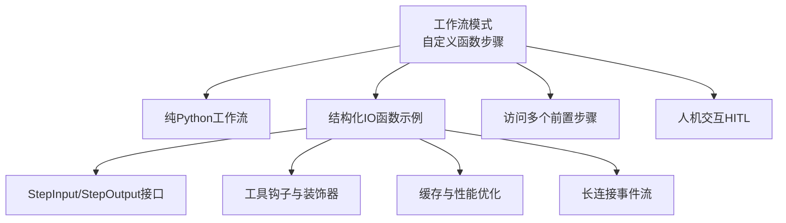
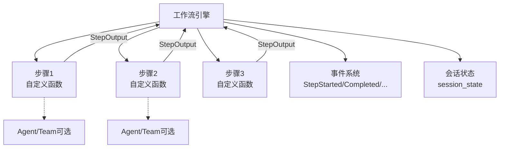
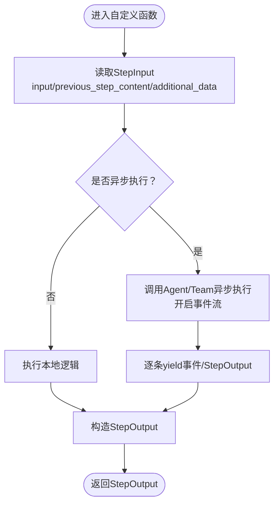
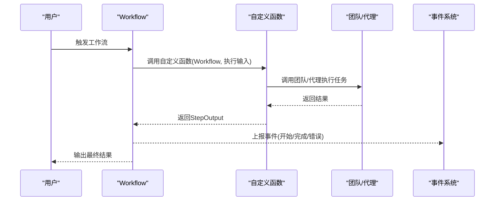
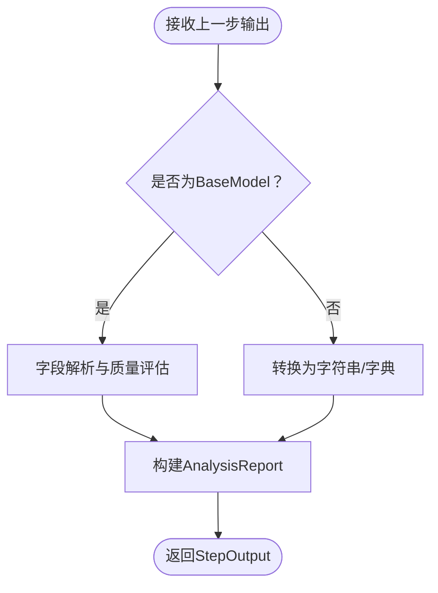
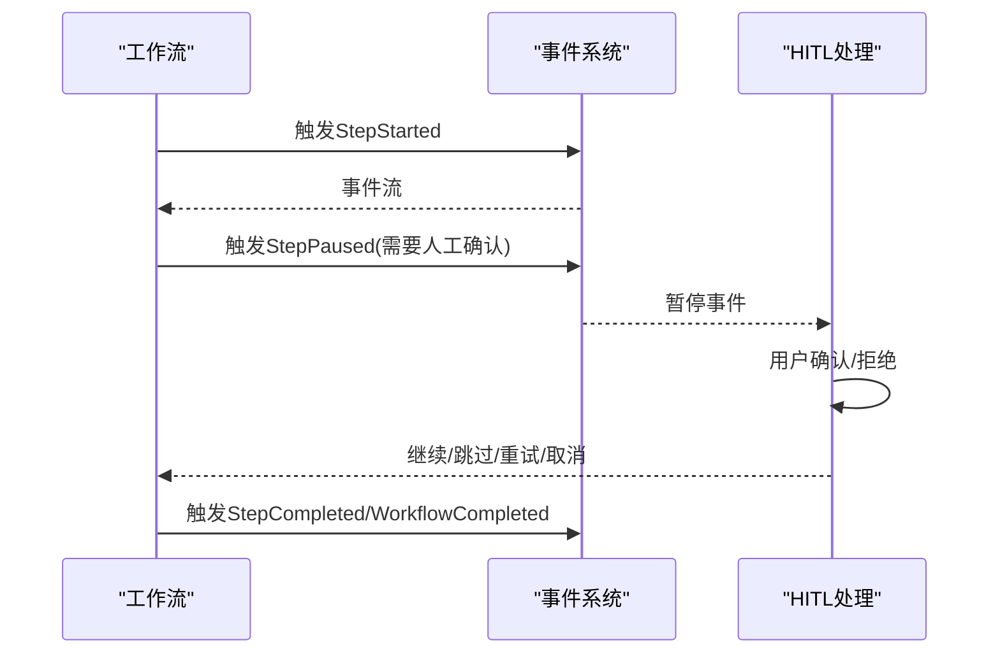
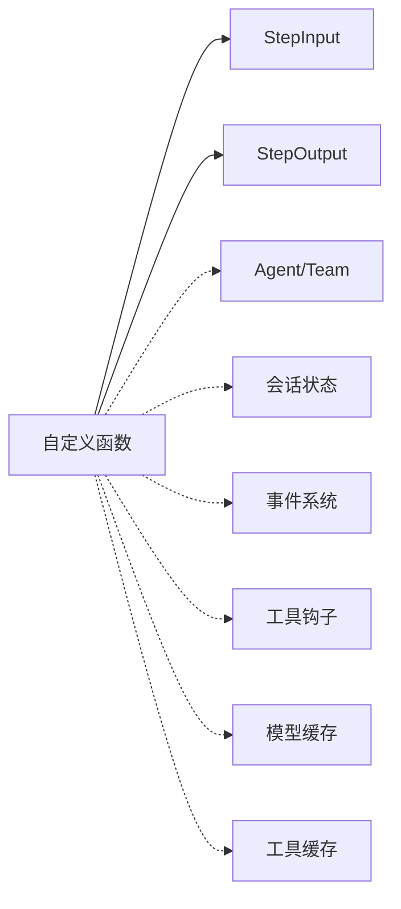

# 函数式工作流

<cite>
**本文引用的文件**
- [自定义函数工作流（概述）](file://workflows/workflow-patterns/custom-function-step-workflow.mdx)
- [纯Python工作流](file://workflows/workflow-patterns/fully-python-workflow.mdx)
- [结构化IO函数示例](file://examples/workflows/advanced-concepts/structured-io/structured-io-function.mdx)
- [访问多个前置步骤](file://workflows/access-previous-steps.mdx)
- [StepInput接口](file://reference/workflows/step_input.mdx)
- [StepOutput接口](file://reference/workflows/step_output.mdx)
- [运行输出事件类型](file://reference/workflows/run-output.mdx)
- [人机交互（HITL）概述](file://workflows/hitl/overview.mdx)
- [工具钩子（工具装饰器）](file://reference/tools/decorator.mdx)
- [工具钩子（示例：工具包中的钩子）](file://examples/tools/tool-hooks/tool-hook-in-toolkit.mdx)
- [模型响应缓存](file://models/cache-response.mdx)
- [工具结果缓存](file://tools/caching.mdx)
- [长连接重连示例（WebSocket）](file://examples/workflows/advanced-concepts/long-running/websocket-reconnect.mdx)
</cite>

## 目录
1. [引言](#引言)
2. [项目结构](#项目结构)
3. [核心组件](#核心组件)
4. [架构总览](#架构总览)
5. [详细组件分析](#详细组件分析)
6. [依赖关系分析](#依赖关系分析)
7. [性能考量](#性能考量)
8. [故障排查指南](#故障排查指南)
9. [结论](#结论)
10. [附录](#附录)

## 引言
本技术文档围绕“函数式工作流”展开，系统讲解如何以纯Python函数为核心构建工作流，强调纯函数风格的可测试性、可组合性与无副作用特性。文档结合仓库中关于“自定义函数步骤”“纯Python工作流”“结构化输入输出”“StepInput/StepOutput接口”“人机交互（HITL）”“缓存与性能优化”等资料，给出从概念到实现、从数据流到错误处理的完整说明，并提供复杂业务场景的函数式实现思路与调试技巧。

## 项目结构
本仓库提供了大量与工作流相关的文档与示例，其中与函数式工作流直接相关的关键位置如下：
- 工作流模式与自定义函数步骤：workflows/workflow-patterns/custom-function-step-workflow.mdx
- 纯Python工作流：workflows/workflow-patterns/fully-python-workflow.mdx
- 结构化输入输出与自定义函数：examples/workflows/advanced-concepts/structured-io/structured-io-function.mdx
- 访问多步前置内容：workflows/access-previous-steps.mdx
- 接口规范：reference/workflows/step_input.mdx、reference/workflows/step_output.mdx
- 运行事件类型：reference/workflows/run-output.mdx
- 人机交互（HITL）：workflows/hitl/overview.mdx
- 工具钩子与装饰器：reference/tools/decorator.mdx、examples/tools/tool-hooks/tool-hook-in-toolkit.mdx
- 缓存与性能：models/cache-response.mdx、tools/caching.mdx
- 长连接与事件流：examples/workflows/advanced-concepts/long-running/websocket-reconnect.mdx

**章节来源**
- [自定义函数工作流（概述）:1-259](file://workflows/workflow-patterns/custom-function-step-workflow.mdx#L1-L259)
- [纯Python工作流:1-32](file://workflows/workflow-patterns/fully-python-workflow.mdx#L1-L32)
- [结构化IO函数示例:1-401](file://examples/workflows/advanced-concepts/structured-io/structured-io-function.mdx#L1-L401)
- [访问多个前置步骤:1-41](file://workflows/access-previous-steps.mdx#L1-L41)
- [StepInput接口:1-29](file://reference/workflows/step_input.mdx#L1-L29)
- [StepOutput接口:1-25](file://reference/workflows/step_output.mdx#L1-L25)
- [运行输出事件类型:50-221](file://reference/workflows/run-output.mdx#L50-L221)
- [人机交互（HITL）概述:190-242](file://workflows/hitl/overview.mdx#L190-L242)
- [工具钩子（工具装饰器）:1-21](file://reference/tools/decorator.mdx#L1-L21)
- [工具钩子（示例：工具包中的钩子）:121-188](file://examples/tools/tool-hooks/tool-hook-in-toolkit.mdx#L121-L188)
- [模型响应缓存:1-53](file://models/cache-response.mdx#L1-L53)
- [工具结果缓存:1-52](file://tools/caching.mdx#L1-L52)
- [长连接重连示例（WebSocket）:196-230](file://examples/workflows/advanced-concepts/long-running/websocket-reconnect.mdx#L196-L230)

## 核心组件
- 自定义函数步骤（Custom Function Step）
  - 通过Step的executor参数注入自定义函数，函数签名需接受StepInput并返回StepOutput，确保与工作流系统的数据契约一致。
  - 支持同步与异步执行；在AgentOS上可启用事件流，实现边执行边产出中间结果。
- 纯Python工作流（Fully Python Workflow）
  - 使用单个Python函数作为整个工作流的执行体，仍可享受存储、流式输出、会话管理等能力。
- 结构化输入输出（Structured IO）
  - 借助Pydantic BaseModel定义结构化输入/输出，配合StepInput/StepOutput实现强类型的数据传递与校验。
- 会话状态与历史（Session State & History）
  - 在自定义函数中读取/写入run_context.session_state，支持跨步骤的状态持久化与上下文累积。
- 事件与错误处理（Events & Error Handling）
  - 通过RunOutput事件类型监控执行过程；HITL支持暂停、重试、跳过、取消等策略。
- 缓存与性能（Caching & Performance）
  - 模型响应缓存与工具结果缓存减少重复调用；长连接事件流提升交互体验。

**章节来源**
- [自定义函数工作流（概述）:14-165](file://workflows/workflow-patterns/custom-function-step-workflow.mdx#L14-L165)
- [纯Python工作流:6-32](file://workflows/workflow-patterns/fully-python-workflow.mdx#L6-L32)
- [结构化IO函数示例:249-273](file://examples/workflows/advanced-concepts/structured-io/structured-io-function.mdx#L249-L273)
- [StepInput接口:6-29](file://reference/workflows/step_input.mdx#L6-L29)
- [StepOutput接口:6-25](file://reference/workflows/step_output.mdx#L6-L25)
- [运行输出事件类型:50-221](file://reference/workflows/run-output.mdx#L50-L221)
- [人机交互（HITL）概述:190-242](file://workflows/hitl/overview.mdx#L190-L242)
- [模型响应缓存:1-53](file://models/cache-response.mdx#L1-L53)
- [工具结果缓存:1-52](file://tools/caching.mdx#L1-L52)

## 架构总览
下图展示了函数式工作流的核心交互：工作流引擎负责编排步骤，自定义函数作为执行器接收StepInput并产生StepOutput；在需要时可与Agent/Team协作；事件系统贯穿执行全程，便于调试与可观测性。

**图表来源**
- [自定义函数工作流（概述）:14-165](file://workflows/workflow-patterns/custom-function-step-workflow.mdx#L14-L165)
- [运行输出事件类型:50-221](file://reference/workflows/run-output.mdx#L50-L221)

## 详细组件分析

### 组件A：自定义函数步骤（Custom Function Step）
- 设计要点
  - 输入/输出契约：函数签名必须接受StepInput并返回StepOutput，保证与工作流系统的兼容性。
  - 数据访问：可通过StepInput访问上一步内容、全部历史、媒体资源等；必要时使用get_step_content/get_all_previous_content等辅助方法。
  - 异步与流式：在AgentOS上建议使用异步执行与事件流，以便实时产出中间结果。
  - 类型安全：结合Pydantic模型与结构化输出，提升可读性与可维护性。
- 实现模式
  - 同步函数：适合轻量处理或本地计算。
  - 异步函数：适合调用外部服务或Agent/Team，支持事件流。
  - 类执行器：通过实现__call__方法，可在初始化时注入配置与状态，实现复用与可测试性。
- 错误处理
  - 返回StepOutput.success=False或设置error字段；在HITL中可选择pause/skip/retry等策略。
- 性能优化
  - 使用缓存（模型响应缓存、工具结果缓存）减少重复调用。
  - 将昂贵操作拆分为独立步骤，避免阻塞主流程。
- 调试技巧
  - 利用事件流观察StepStarted/Completed等事件，定位卡顿或异常点。
  - 在函数内部打印关键上下文（如上一步内容类型、长度、字段），辅助问题定位。

**图表来源**
- [自定义函数工作流（概述）:166-253](file://workflows/workflow-patterns/custom-function-step-workflow.mdx#L166-L253)
- [结构化IO函数示例:249-273](file://examples/workflows/advanced-concepts/structured-io/structured-io-function.mdx#L249-L273)

**章节来源**
- [自定义函数工作流（概述）:14-165](file://workflows/workflow-patterns/custom-function-step-workflow.mdx#L14-L165)
- [结构化IO函数示例:249-273](file://examples/workflows/advanced-concepts/structured-io/structured-io-function.mdx#L249-L273)
- [访问多个前置步骤:12-41](file://workflows/access-previous-steps.mdx#L12-L41)
- [运行输出事件类型:50-221](file://reference/workflows/run-output.mdx#L50-L221)

### 组件B：纯Python工作流（Fully Python Workflow）
- 设计要点
  - 将所有步骤逻辑收敛到一个函数中，获得最大灵活性；同时保留存储、流式输出、会话管理等能力。
  - 适用于快速原型或对流程有强约束的场景。
- 实现模式
  - 函数签名通常包含Workflow实例与WorkflowExecutionInput，便于直接调用团队/代理并整合结果。
- 最佳实践
  - 明确分层：将业务逻辑封装为纯函数，再在顶层函数中编排调用。
  - 错误边界：在顶层捕获异常并转换为可读的StepOutput.success=False。
  - 可观测性：在关键节点记录事件或指标，便于后续审计与调试。

**图表来源**
- [纯Python工作流:11-26](file://workflows/workflow-patterns/fully-python-workflow.mdx#L11-L26)

**章节来源**
- [纯Python工作流:6-32](file://workflows/workflow-patterns/fully-python-workflow.mdx#L6-L32)

### 组件C：结构化输入输出（Structured IO）
- 设计要点
  - 使用Pydantic BaseModel定义输入/输出模型，确保数据格式稳定、字段可验证。
  - 在自定义函数中进行类型判断与字段访问，增强健壮性与可读性。
- 实践建议
  - 对于复杂数据流，先做“结构化分析”，再决定下一步处理策略。
  - 将“结构化分析”与“业务处理”解耦，分别封装为独立函数，提高可测试性。
- 典型流程
  - 接收上一步的BaseModel输出，进行字段校验与质量评估；
  - 生成中间报告（如AnalysisReport），再交给下游步骤继续处理。

**图表来源**
- [结构化IO函数示例:164-273](file://examples/workflows/advanced-concepts/structured-io/structured-io-function.mdx#L164-L273)

**章节来源**
- [结构化IO函数示例:249-273](file://examples/workflows/advanced-concepts/structured-io/structured-io-function.mdx#L249-L273)

### 组件D：会话状态与历史（Session State & History）
- 设计要点
  - 在自定义函数中通过run_context.session_state读写状态，实现跨步骤的状态共享。
  - 使用StepInput.history相关方法获取历史上下文，辅助决策与审计。
- 最佳实践
  - 将状态设计为不可变数据结构或受控更新，避免副作用。
  - 对敏感状态进行序列化/反序列化时注意版本兼容性。
- 调试技巧
  - 在关键步骤打印session_state快照，核对状态变化轨迹。

**章节来源**
- [访问多个前置步骤:12-41](file://workflows/access-previous-steps.mdx#L12-L41)
- [运行输出事件类型:50-221](file://reference/workflows/run-output.mdx#L50-L221)

### 组件E：事件与错误处理（Events & Error Handling）
- 设计要点
  - 通过RunOutput事件类型监控执行生命周期，便于可视化与告警。
  - 在HITL中支持pause/skip/retry/cancel等策略，满足人机协同需求。
- 实现模式
  - 流式执行：在事件流中检测StepPausedEvent等，按需处理用户确认或重试。
  - 批处理执行：在run_output.is_paused后，调用continue_run继续执行。
- 调试技巧
  - 记录事件索引与类型分布，定位异常阶段与失败原因。

**图表来源**
- [人机交互（HITL）概述:220-234](file://workflows/hitl/overview.mdx#L220-L234)
- [运行输出事件类型:50-221](file://reference/workflows/run-output.mdx#L50-L221)

**章节来源**
- [人机交互（HITL）概述:190-242](file://workflows/hitl/overview.mdx#L190-L242)
- [运行输出事件类型:50-221](file://reference/workflows/run-output.mdx#L50-L221)

### 组件F：工具钩子与装饰器（Hooks & Decorators）
- 设计要点
  - 工具装饰器支持pre_hook/post_hook/tool_hooks等，用于日志、校验、限流、缓存、审计等横切关注点。
  - 工具包级钩子可对一组工具统一生效，便于集中治理。
- 实践建议
  - 将“输入校验”放在pre_hook，“结果转换/缓存”放在post_hook。
  - 对高风险操作（删除、修改）在pre_hook中进行权限与参数校验。
- 调试技巧
  - 在钩子中打印函数名与参数，核对调用链路与参数变更。

**章节来源**
- [工具钩子（工具装饰器）:1-21](file://reference/tools/decorator.mdx#L1-L21)
- [工具钩子（示例：工具包中的钩子）:121-188](file://examples/tools/tool-hooks/tool-hook-in-toolkit.mdx#L121-L188)

### 组件G：缓存与性能（Caching & Performance）
- 设计要点
  - 模型响应缓存：首次请求走API，后续相同请求命中本地缓存，显著降低延迟与成本。
  - 工具结果缓存：对工具调用结果进行缓存，避免重复网络请求。
- 实施建议
  - 开发/测试环境开启缓存，生产环境谨慎使用动态内容。
  - 合理设置TTL，平衡新鲜度与性能。
- 调试技巧
  - 观察事件中的metrics.duration与缓存命中率，识别热点路径。

**章节来源**
- [模型响应缓存:1-53](file://models/cache-response.mdx#L1-L53)
- [工具结果缓存:1-52](file://tools/caching.mdx#L1-L52)

## 依赖关系分析
- 组件耦合
  - 自定义函数与工作流引擎通过StepInput/StepOutput解耦；与Agent/Team的耦合通过异步调用与事件流弱化。
  - 会话状态与历史通过run_context注入，避免全局变量带来的副作用。
- 外部依赖
  - 模型服务（OpenAI等）、外部工具（HackerNews/YFinance等）通过缓存与钩子降低依赖风险。
- 循环依赖
  - 自定义函数应保持纯函数风格，避免对全局状态的隐式依赖，防止循环依赖。

**图表来源**
- [自定义函数工作流（概述）:14-165](file://workflows/workflow-patterns/custom-function-step-workflow.mdx#L14-L165)
- [结构化IO函数示例:249-273](file://examples/workflows/advanced-concepts/structured-io/structured-io-function.mdx#L249-L273)
- [工具钩子（工具装饰器）:1-21](file://reference/tools/decorator.mdx#L1-L21)
- [模型响应缓存:1-53](file://models/cache-response.mdx#L1-L53)
- [工具结果缓存:1-52](file://tools/caching.mdx#L1-L52)

**章节来源**
- [自定义函数工作流（概述）:14-165](file://workflows/workflow-patterns/custom-function-step-workflow.mdx#L14-L165)
- [结构化IO函数示例:249-273](file://examples/workflows/advanced-concepts/structured-io/structured-io-function.mdx#L249-L273)
- [工具钩子（工具装饰器）:1-21](file://reference/tools/decorator.mdx#L1-L21)
- [模型响应缓存:1-53](file://models/cache-response.mdx#L1-L53)
- [工具结果缓存:1-52](file://tools/caching.mdx#L1-L52)

## 性能考量
- 缓存策略
  - 模型响应缓存与工具结果缓存优先启用，减少重复调用。
  - 合理设置TTL，避免陈旧数据影响业务。
- 并发与流式
  - 在AgentOS上使用异步执行与事件流，提升吞吐与用户体验。
  - 对长连接场景（如WebSocket）做好断线重连与事件去重。
- 资源控制
  - 通过工具钩子实现限流与重试，避免对外部服务造成冲击。
- 监控与度量
  - 关注事件流中的duration、事件类型分布，识别瓶颈与异常。

**章节来源**
- [模型响应缓存:1-53](file://models/cache-response.mdx#L1-L53)
- [工具结果缓存:1-52](file://tools/caching.mdx#L1-L52)
- [长连接重连示例（WebSocket）:196-230](file://examples/workflows/advanced-concepts/long-running/websocket-reconnect.mdx#L196-L230)

## 故障排查指南
- 常见问题
  - 输入类型不匹配：检查StepInput.previous_step_content类型，必要时进行类型判断与转换。
  - 事件流中断：在长连接场景中，关注连接关闭与事件丢失，采用重连与事件索引追踪。
  - 人机交互暂停：根据StepPausedEvent提示，处理用户确认或重试。
- 定位手段
  - 打印StepInput关键字段（类型、长度、字段列表）与StepOutput.success/error。
  - 记录事件索引与事件类型统计，定位异常阶段。
- 修复策略
  - 对异常步骤设置on_error策略（fail/skip/pause），并在HITL中提供重试/跳过选项。
  - 在工具钩子中增加校验与降级逻辑，保障整体稳定性。

**章节来源**
- [结构化IO函数示例:249-273](file://examples/workflows/advanced-concepts/structured-io/structured-io-function.mdx#L249-L273)
- [运行输出事件类型:50-221](file://reference/workflows/run-output.mdx#L50-L221)
- [人机交互（HITL）概述:190-242](file://workflows/hitl/overview.mdx#L190-L242)
- [长连接重连示例（WebSocket）:196-230](file://examples/workflows/advanced-concepts/long-running/websocket-reconnect.mdx#L196-L230)

## 结论
函数式工作流以纯Python函数为核心，通过标准化的StepInput/StepOutput契约、事件系统与缓存机制，实现了高可测试性、强可组合性与低副作用的工程实践。结合结构化输入输出、会话状态管理、人机交互与工具钩子，能够在复杂业务场景中保持清晰的职责边界与良好的可观测性。建议在开发过程中坚持“纯函数优先、状态可控、事件可见、缓存合理”的原则，持续优化性能与可靠性。

## 附录
- 快速参考
  - 自定义函数签名：接受StepInput，返回StepOutput。
  - 结构化模型：使用Pydantic BaseModel定义输入/输出。
  - 事件监控：关注StepStarted/Completed/WorkflowCompleted等事件。
  - 缓存启用：模型响应缓存与工具结果缓存。
  - HITL策略：pause/skip/retry/cancel。