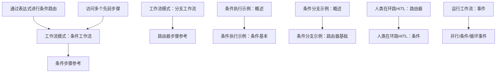
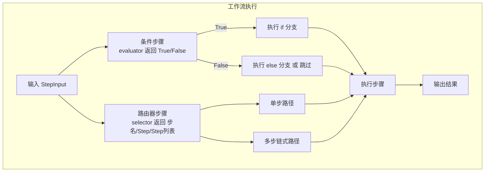
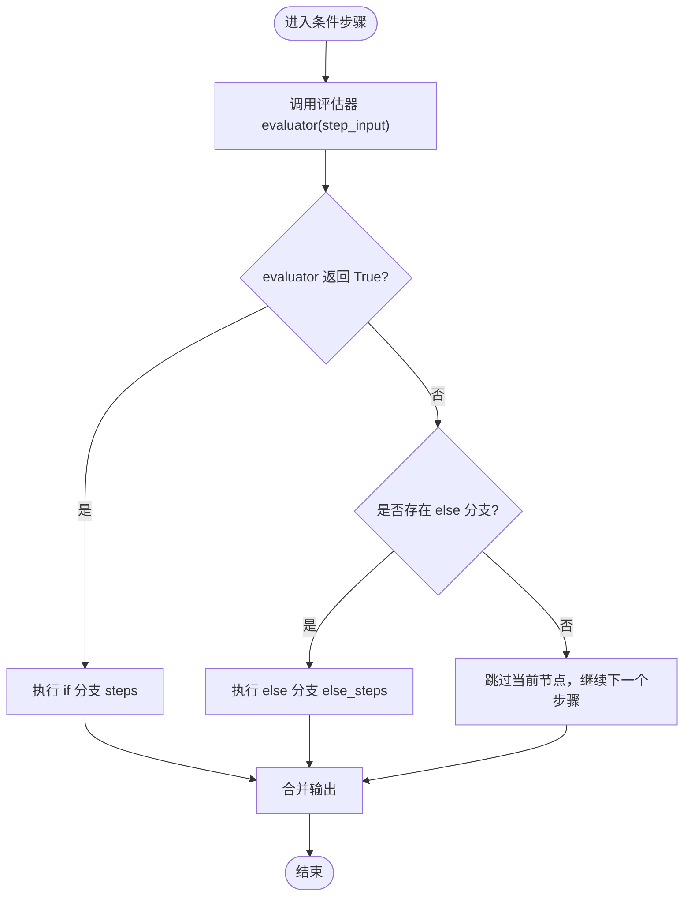
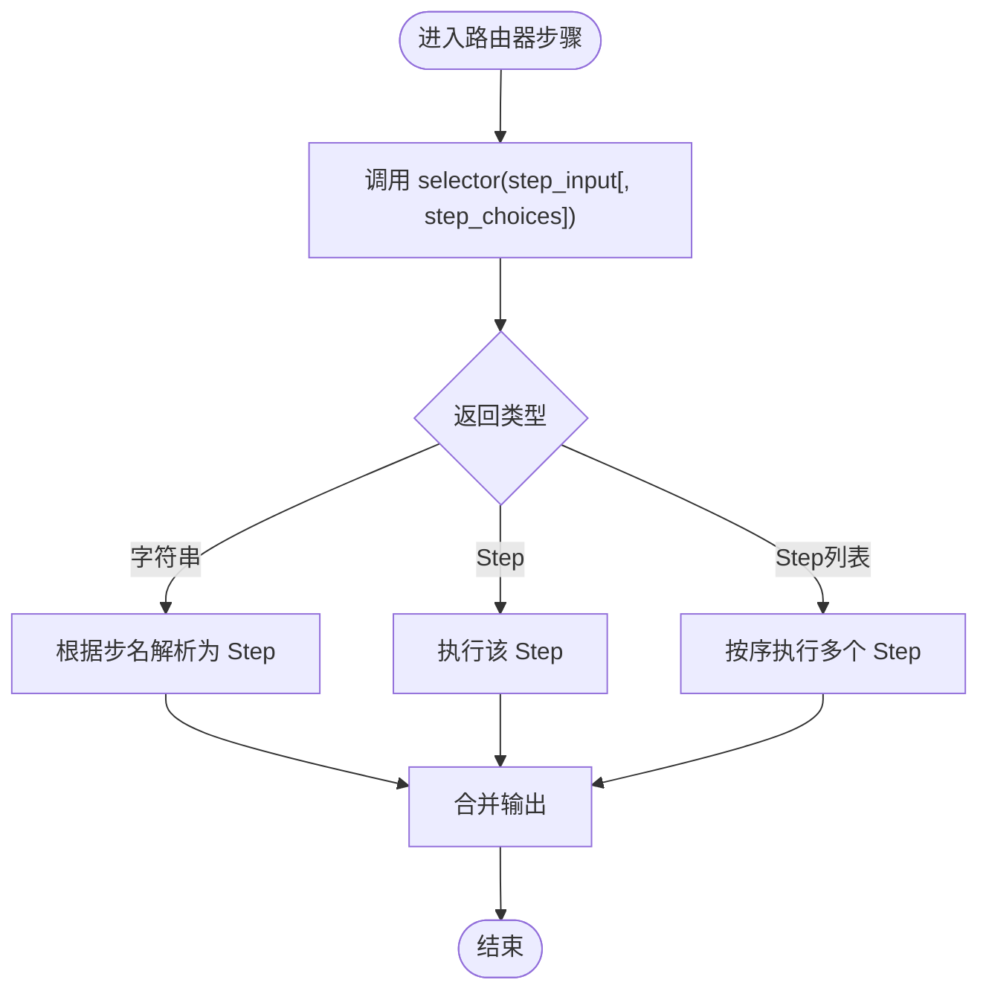
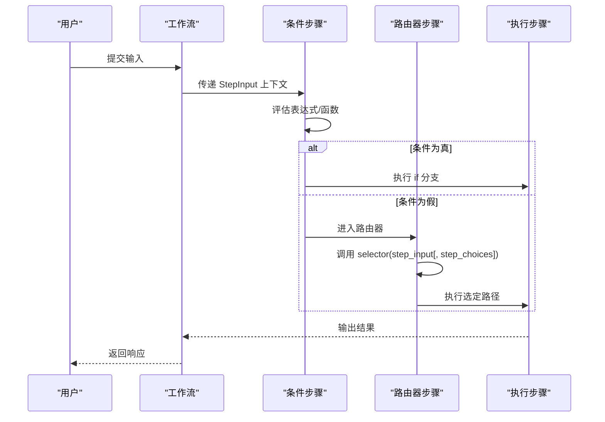
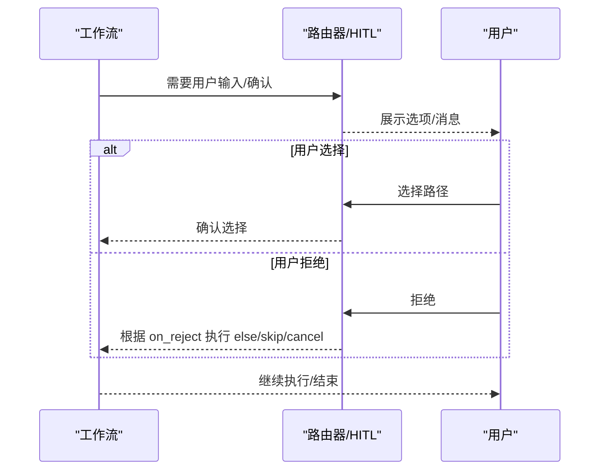
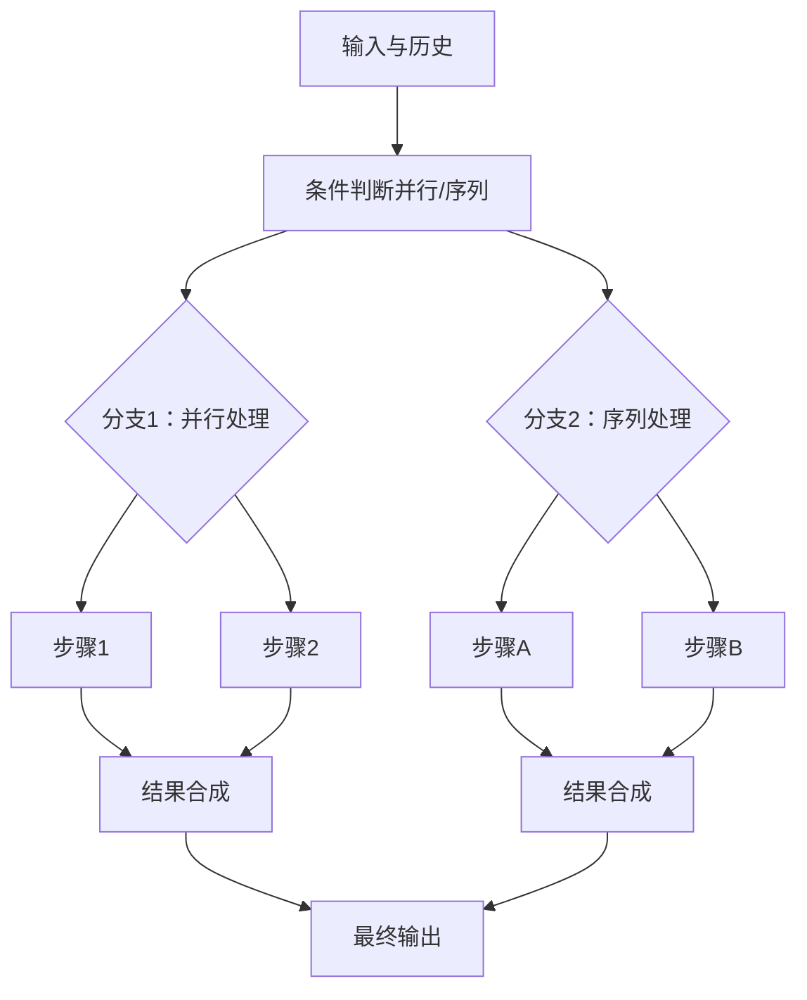
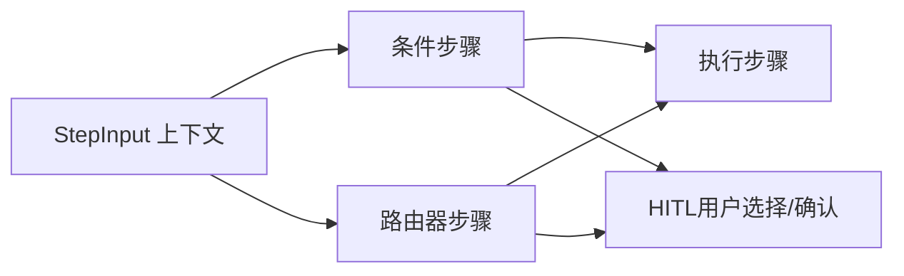

# 分支工作流

<cite>
**本文引用的文件**
- [工作流模式：条件工作流](file://workflows/workflow-patterns/conditional-workflow.mdx)
- [工作流模式：分支工作流](file://workflows/workflow-patterns/branching-workflow.mdx)
- [条件步骤参考](file://reference/workflows/conditional-steps.mdx)
- [路由器步骤参考](file://reference/workflows/router-steps.mdx)
- [条件执行示例：概述](file://examples/workflows/conditional-execution/overview.mdx)
- [条件分支示例：概述](file://examples/workflows/conditional-branching/overview.mdx)
- [条件执行示例：条件基本](file://examples/workflows/conditional-execution/condition-basic.mdx)
- [条件执行示例：条件与并行](file://examples/workflows/conditional-execution/condition-with-parallel.mdx)
- [条件分支示例：路由器基础](file://examples/workflows/conditional-branching/router-basic.mdx)
- [条件分支示例：嵌套选择](file://examples/workflows/conditional-branching/nested-choices.mdx)
- [人类在环路（HITL）：路由器](file://workflows/hitl/router.mdx)
- [人类在环路（HITL）：条件](file://workflows/hitl/condition.mdx)
- [通过表达式进行条件路由](file://agent-os/studio/cel-expressions.mdx)
- [访问多个先前步骤](file://workflows/access-previous-steps.mdx)
- [运行工作流：事件](file://workflows/running-workflows.mdx)
</cite>

## 目录
1. [引言](#引言)
2. [项目结构](#项目结构)
3. [核心组件](#核心组件)
4. [架构总览](#架构总览)
5. [详细组件分析](#详细组件分析)
6. [依赖关系分析](#依赖关系分析)
7. [性能考量](#性能考量)
8. [故障排查指南](#故障排查指南)
9. [结论](#结论)
10. [附录](#附录)

## 引言
本技术文档围绕“分支工作流”的动态分支模式展开，系统阐述路由逻辑的构建、路径选择算法与结果合并策略，并结合仓库中的真实示例，给出可操作的实现路径与最佳实践。文档同时覆盖分支工作流的灵活性与复杂性权衡、路径优化与回溯机制、分支预测与性能监控、错误恢复方案，以及面向实际业务场景的应用案例。

## 项目结构
本仓库以“工作流”为核心主题，配套有：
- 工作流模式文档：涵盖条件工作流与分支工作流两大范式
- 参考文档：条件步骤与路由器步骤的参数与返回类型
- 示例工程：条件执行与条件分支的可运行示例
- 人类在环路（HITL）：路由器与条件步骤的人机交互能力
- 运行时事件：并行、条件、循环等执行事件的可观测性

**图表来源**
- [工作流模式：条件工作流:1-100](file://workflows/workflow-patterns/conditional-workflow.mdx#L1-L100)
- [工作流模式：分支工作流:1-176](file://workflows/workflow-patterns/branching-workflow.mdx#L1-L176)
- [条件步骤参考:1-15](file://reference/workflows/conditional-steps.mdx#L1-L15)
- [路由器步骤参考:1-56](file://reference/workflows/router-steps.mdx#L1-L56)
- [条件执行示例：概述:1-11](file://examples/workflows/conditional-execution/overview.mdx#L1-L11)
- [条件分支示例：概述:1-15](file://examples/workflows/conditional-branching/overview.mdx#L1-L15)
- [条件执行示例：条件基本](file://examples/workflows/conditional-execution/condition-basic.mdx)
- [条件分支示例：路由器基础:1-158](file://examples/workflows/conditional-branching/router-basic.mdx#L1-L158)
- [人类在环路（HITL）：路由器:1-202](file://workflows/hitl/router.mdx#L1-L202)
- [人类在环路（HITL）：条件:62-107](file://workflows/hitl/condition.mdx#L62-L107)
- [通过表达式进行条件路由:25-104](file://agent-os/studio/cel-expressions.mdx#L25-L104)
- [访问多个先前步骤:1-41](file://workflows/access-previous-steps.mdx#L1-L41)
- [运行工作流：事件:488-511](file://workflows/running-workflows.mdx#L488-L511)

**章节来源**
- [工作流模式：条件工作流:1-100](file://workflows/workflow-patterns/conditional-workflow.mdx#L1-L100)
- [工作流模式：分支工作流:1-176](file://workflows/workflow-patterns/branching-workflow.mdx#L1-L176)
- [条件执行示例：概述:1-11](file://examples/workflows/conditional-execution/overview.mdx#L1-L11)
- [条件分支示例：概述:1-15](file://examples/workflows/conditional-branching/overview.mdx#L1-L15)

## 核心组件
- 条件步骤（Condition）
  - 基于评估器（evaluator）返回布尔值，决定执行 if 分支或 else 分支；当未提供 else 分支且条件为假时，跳过该条件节点继续后续步骤。
  - 支持 requires_confirmation 模式，由用户决定走哪条分支。
- 路由器步骤（Router）
  - 通过 selector 函数动态选择一条或多条执行路径，支持字符串（步名称）、Step 对象、Step 列表（链式执行）三种返回类型。
  - 支持 requires_user_input（用户选择）与 requires_confirmation（确认）两种人机交互模式。
- 步骤输入上下文（StepInput）
  - 提供 input、previous_step_content、previous_step_outputs、additional_data、session_state 等变量，支撑条件与路由的判定。
- 执行事件（Events）
  - 并行执行、条件执行、循环执行等事件用于可观测性与调试。

**章节来源**
- [条件步骤参考:6-15](file://reference/workflows/conditional-steps.mdx#L6-L15)
- [路由器步骤参考:6-56](file://reference/workflows/router-steps.mdx#L6-L56)
- [通过表达式进行条件路由:25-104](file://agent-os/studio/cel-expressions.mdx#L25-L104)
- [运行工作流：事件:488-511](file://workflows/running-workflows.mdx#L488-L511)

## 架构总览
下图展示了分支工作流在运行时的总体交互：输入经由条件步骤与路由器步骤进行判定，最终进入具体执行步骤；若启用 HITL，则会在关键节点暂停等待人工确认或选择。

**图表来源**
- [工作流模式：条件工作流:21-28](file://workflows/workflow-patterns/conditional-workflow.mdx#L21-L28)
- [工作流模式：分支工作流:21-28](file://workflows/workflow-patterns/branching-workflow.mdx#L21-L28)
- [条件步骤参考:6-15](file://reference/workflows/conditional-steps.mdx#L6-L15)
- [路由器步骤参考:21-47](file://reference/workflows/router-steps.mdx#L21-L47)

## 详细组件分析

### 组件一：条件步骤（Condition）
- 设计要点
  - 评估器支持同步与异步函数，亦可直接传入布尔常量（忽略时 requires_confirmation 为真则不生效）。
  - 若未提供 else 分支且条件为假，当前条件节点被跳过，流程继续下一个步骤。
- 路由逻辑
  - True → 执行 steps；False → 执行 else_steps（若存在），否则跳过。
- 结果合并
  - 条件节点本身不改变数据结构，仅控制执行路径；后续步骤的输出按顺序合并到整体运行输出中。

**图表来源**
- [工作流模式：条件工作流:21-28](file://workflows/workflow-patterns/conditional-workflow.mdx#L21-L28)
- [条件步骤参考:6-15](file://reference/workflows/conditional-steps.mdx#L6-L15)

**章节来源**
- [工作流模式：条件工作流:21-91](file://workflows/workflow-patterns/conditional-workflow.mdx#L21-L91)
- [条件步骤参考:6-15](file://reference/workflows/conditional-steps.mdx#L6-L15)
- [人类在环路（HITL）：条件:62-107](file://workflows/hitl/condition.mdx#L62-L107)

### 组件二：路由器步骤（Router）
- 设计要点
  - selector 支持三种返回类型：字符串（步名）、Step 对象、Step 列表（链式执行）。
  - 支持 step_choices 参数，便于在 selector 内部动态构建名称映射或直接返回 Step 对象。
  - 支持 requires_user_input 与 requires_confirmation 两种模式，分别用于用户选择与确认自动化路由。
- 路径选择算法
  - 字符串返回：从 choices 中解析对应 Step。
  - Step 对象返回：直接执行该 Step。
  - Step 列表返回：按序执行多个 Step，形成链式路径。
- 结果合并
  - 多个路径可并行执行后在后续步骤中统一汇聚；链式路径按顺序输出。

**图表来源**
- [工作流模式：分支工作流:21-28](file://workflows/workflow-patterns/branching-workflow.mdx#L21-L28)
- [路由器步骤参考:21-47](file://reference/workflows/router-steps.mdx#L21-L47)

**章节来源**
- [工作流模式：分支工作流:30-134](file://workflows/workflow-patterns/branching-workflow.mdx#L30-L134)
- [条件分支示例：路由器基础:69-96](file://examples/workflows/conditional-branching/router-basic.mdx#L69-L96)
- [条件分支示例：嵌套选择:33-42](file://examples/workflows/conditional-branching/nested-choices.mdx#L33-L42)
- [路由器步骤参考:6-56](file://reference/workflows/router-steps.mdx#L6-L56)
- [人类在环路（HITL）：路由器:101-142](file://workflows/hitl/router.mdx#L101-L142)

### 组件三：表达式驱动的条件路由
- 设计要点
  - 使用 CEL 表达式读取 input、previous_step_content、additional_data、session_state 等上下文变量，实现基于内容的自动路由。
- 实现方式
  - 在 evaluator 中使用字符串表达式（如 input.contains(...)），无需编写完整函数体。
- 典型场景
  - 根据输入是否包含特定关键词进行紧急/普通请求分流；根据上一步输出内容进行分类后再路由。

**图表来源**
- [通过表达式进行条件路由:45-104](file://agent-os/studio/cel-expressions.mdx#L45-L104)
- [工作流模式：条件工作流:21-28](file://workflows/workflow-patterns/conditional-workflow.mdx#L21-L28)
- [工作流模式：分支工作流:21-28](file://workflows/workflow-patterns/branching-workflow.mdx#L21-L28)

**章节来源**
- [通过表达式进行条件路由:25-104](file://agent-os/studio/cel-expressions.mdx#L25-L104)

### 组件四：人类在环路（HITL）与回溯机制
- 路由器 HITL
  - 用户选择模式：requires_user_input=True，允许用户从 available_choices 中选择一个或多个路径。
  - 确认模式：requires_confirmation=True，先由 selector 自动选择，再由用户确认或拒绝；拒绝时可选择跳过、取消或执行 else 分支。
- 条件 HITL
  - requires_confirmation=True 时，忽略 evaluator，由用户决定走哪条分支；支持 on_reject 控制拒绝后的动作。
- 回溯与继续
  - 当工作流暂停（如等待路由选择或确认），可通过会话获取最后一次运行输出，调用 continue_run 继续执行。

**图表来源**
- [人类在环路（HITL）：路由器:14-153](file://workflows/hitl/router.mdx#L14-L153)
- [人类在环路（HITL）：条件:62-107](file://workflows/hitl/condition.mdx#L62-L107)

**章节来源**
- [人类在环路（HITL）：路由器:1-202](file://workflows/hitl/router.mdx#L1-L202)
- [人类在环路（HITL）：条件:62-107](file://workflows/hitl/condition.mdx#L62-L107)

### 组件五：复杂业务逻辑分支与智能决策路径
- 多路径并行与合成
  - 条件步骤支持在 if/else 分支中执行一组步骤（含并行块），并在后续步骤中进行结果合成。
- 嵌套选择与链式路径
  - 路由器 choices 支持嵌套列表，转换为 Steps 容器，实现多步链式执行；selector 可返回字符串、Step 或 Step 列表，灵活组合。
- 基于历史的决策
  - 通过 previous_step_content、previous_step_outputs、get_all_previous_content 等方法，聚合多步历史信息，提升路由准确性。

**图表来源**
- [工作流模式：条件工作流:54-91](file://workflows/workflow-patterns/conditional-workflow.mdx#L54-L91)
- [工作流模式：分支工作流:136-167](file://workflows/workflow-patterns/branching-workflow.mdx#L136-L167)
- [访问多个先前步骤:10-41](file://workflows/access-previous-steps.mdx#L10-L41)

**章节来源**
- [工作流模式：条件工作流:54-91](file://workflows/workflow-patterns/conditional-workflow.mdx#L54-L91)
- [工作流模式：分支工作流:136-167](file://workflows/workflow-patterns/branching-workflow.mdx#L136-L167)
- [访问多个先前步骤:10-41](file://workflows/access-previous-steps.mdx#L10-L41)

## 依赖关系分析
- 组件耦合
  - 条件步骤与路由器步骤均依赖 StepInput 上下文；条件步骤依赖 evaluator，路由器依赖 selector。
  - 路由器可与 HITL 模式组合，形成“自动决策+人工确认”的双层控制。
- 外部集成点
  - 通过 StepInput 的历史访问接口，可与知识库、存储、外部工具等模块对接，增强路由决策依据。
- 可能的循环依赖
  - 路由器与条件步骤之间无直接循环依赖；若在 selector 中再次触发条件步骤，需谨慎避免无限递归。

**图表来源**
- [通过表达式进行条件路由:25-40](file://agent-os/studio/cel-expressions.mdx#L25-L40)
- [人类在环路（HITL）：路由器:1-202](file://workflows/hitl/router.mdx#L1-L202)
- [人类在环路（HITL）：条件:62-107](file://workflows/hitl/condition.mdx#L62-L107)

**章节来源**
- [通过表达式进行条件路由:25-40](file://agent-os/studio/cel-expressions.mdx#L25-L40)
- [人类在环路（HITL）：路由器:1-202](file://workflows/hitl/router.mdx#L1-L202)
- [人类在环路（HITL）：条件:62-107](file://workflows/hitl/condition.mdx#L62-L107)

## 性能考量
- 路由器选择开销
  - selector 应尽量保持轻量，避免在其中执行耗时操作；必要时可引入缓存或预计算。
- 条件评估
  - 评估器应避免复杂 IO；对需要外部服务的判断建议前置到上游步骤或使用缓存。
- 并行与合成
  - 并行执行可缩短总时延，但需注意资源竞争与结果合并的成本；合理拆分任务粒度。
- 观测与事件
  - 利用运行事件（并行/条件/循环）进行性能监控与瓶颈定位。

**章节来源**
- [运行工作流：事件:488-511](file://workflows/running-workflows.mdx#L488-L511)

## 故障排查指南
- 条件步骤
  - 若未设置 else 分支且条件为假，节点会被跳过；检查评估器逻辑与输入上下文。
  - 启用 requires_confirmation 时，evaluator 将被忽略，优先考虑用户选择。
- 路由器步骤
  - selector 返回类型必须为字符串、Step 或 Step 列表之一；确保 choices 中包含对应名称或对象。
  - requires_user_input 与 requires_confirmation 不能同时强制执行不同路径，需明确其优先级。
- HITL 暂停
  - 当工作流暂停时，检查 run_output.is_paused 与 steps_requiring_route/confirmation，按要求继续执行。
- 错误恢复
  - 在关键节点增加重试与降级策略；对失败路径记录事件并输出诊断信息。

**章节来源**
- [条件步骤参考:6-15](file://reference/workflows/conditional-steps.mdx#L6-L15)
- [路由器步骤参考:6-56](file://reference/workflows/router-steps.mdx#L6-L56)
- [人类在环路（HITL）：路由器:101-153](file://workflows/hitl/router.mdx#L101-L153)
- [人类在环路（HITL）：条件:62-107](file://workflows/hitl/condition.mdx#L62-L107)

## 结论
分支工作流通过“条件步骤 + 路由器步骤”的组合，实现了从规则驱动到智能决策的渐进式路径选择。借助表达式与上下文变量，系统可在不侵入业务逻辑的前提下完成动态路由；配合 HITL 模式，既能保证自动化效率，又能满足合规与审慎需求。通过合理的路径设计、事件监控与错误恢复机制，分支工作流能够在复杂业务场景中取得灵活性与可控性的平衡。

## 附录
- 实际业务场景建议
  - 客服工单：紧急/普通分流 → 技术/非技术分流 → 处理与跟进
  - 研究与发布：主题识别 → HackerNews/Web 研究 → 内容合成与发布
  - 数据处理：质量检测 → 快速/深度/自定义分析 → 报告生成
- 最佳实践
  - 明确评估器与 selector 的职责边界，避免重复判断
  - 使用历史上下文增强路由准确性，但注意敏感信息保护
  - 对关键路径启用 HITL 与事件监控，建立可观测性闭环
  - 合理拆分并行与串行，控制资源占用与延迟