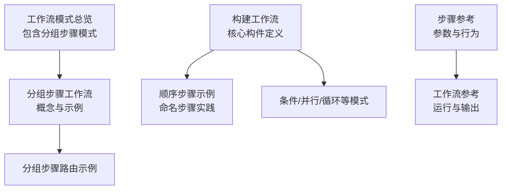
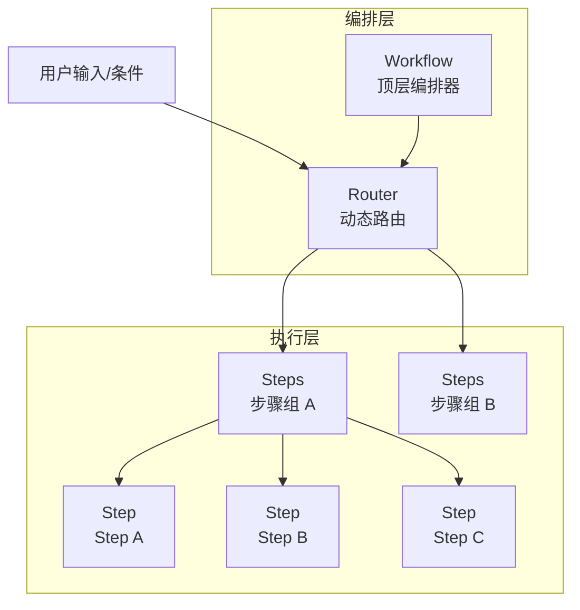
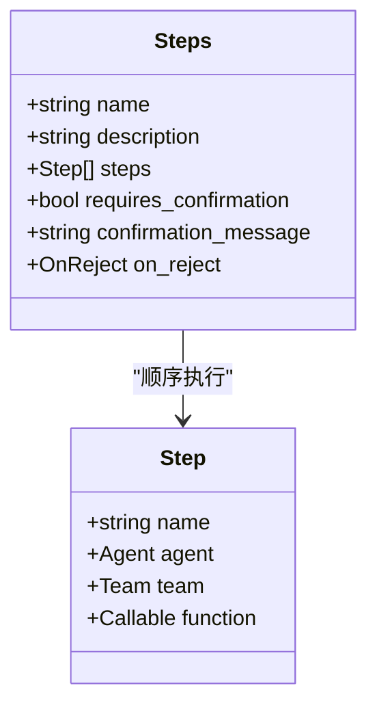
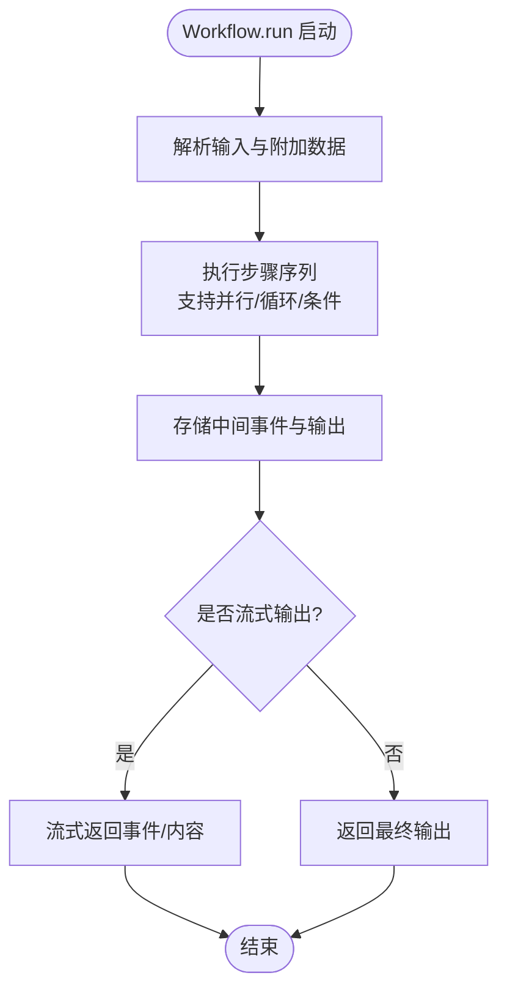
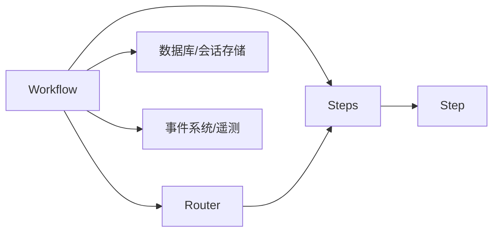

# 分组步骤工作流

<cite>
**本文档引用的文件**
- [分组步骤工作流](file://workflows/workflow-patterns/grouped-steps-workflow.mdx)
- [工作流模式总览](file://workflows/workflow-patterns/overview.mdx)
- [构建工作流](file://workflows/building-workflows.mdx)
- [工作流概览](file://workflows/overview.mdx)
- [步骤参考](file://reference/workflows/steps-step.mdx)
- [工作流参考](file://reference/workflows/workflow.mdx)
- [顺序步骤示例](file://workflows/usage/sequence-of-steps.mdx)
</cite>

## 目录
1. [简介](#简介)
2. [项目结构](#项目结构)
3. [核心组件](#核心组件)
4. [架构概览](#架构概览)
5. [详细组件分析](#详细组件分析)
6. [依赖关系分析](#依赖关系分析)
7. [性能考虑](#性能考虑)
8. [故障排除指南](#故障排除指南)
9. [结论](#结论)
10. [附录](#附录)

## 简介
本文件系统性阐述分组步骤工作流（Grouped Steps Workflow）的设计理念、实现方式与最佳实践。通过将多个步骤组织为可重用的逻辑单元，分组步骤工作流实现了模块化设计、步骤复用与封装策略，显著提升了代码组织、维护性与扩展性。本文档不仅提供架构优势说明，还给出具体代码示例路径、设计原则、命名规范与依赖管理建议，并结合实际项目场景展示模块化应用与重构技巧。

## 项目结构
围绕分组步骤工作流，知识库提供了以下关键资源：
- 概念与示例：分组步骤工作流文档展示了基本用法与路由组合
- 模式总览：工作流模式总览页面将“分组步骤”作为六大基础模式之一进行呈现
- 构建指南：构建工作流文档定义了工作流体系的核心构件（Workflow、Step、Loop、Parallel、Condition、Router）
- 参考文档：步骤与工作流的参数与方法参考，支撑实现细节
- 实践示例：顺序步骤示例展示了命名步骤在跟踪与日志方面的价值

**图表来源**
- [工作流模式总览:30-73](file://workflows/workflow-patterns/overview.mdx#L30-L73)
- [分组步骤工作流:1-101](file://workflows/workflow-patterns/grouped-steps-workflow.mdx#L1-L101)
- [构建工作流:1-59](file://workflows/building-workflows.mdx#L1-L59)
- [顺序步骤示例:1-85](file://workflows/usage/sequence-of-steps.mdx#L1-L85)
- [步骤参考:1-13](file://reference/workflows/steps-step.mdx#L1-L13)
- [工作流参考:1-306](file://reference/workflows/workflow.mdx#L1-L306)

**章节来源**
- [工作流模式总览:1-92](file://workflows/workflow-patterns/overview.mdx#L1-L92)
- [分组步骤工作流:1-101](file://workflows/workflow-patterns/grouped-steps-workflow.mdx#L1-L101)
- [构建工作流:1-59](file://workflows/building-workflows.mdx#L1-L59)
- [顺序步骤示例:1-85](file://workflows/usage/sequence-of-steps.mdx#L1-L85)
- [步骤参考:1-13](file://reference/workflows/steps-step.mdx#L1-L13)
- [工作流参考:1-306](file://reference/workflows/workflow.mdx#L1-L306)

## 核心组件
分组步骤工作流基于以下核心组件构建：
- Steps：将一组顺序执行的 Step 封装为可复用的步骤序列，支持确认机制与拒绝处理
- Step：工作流的最小执行单元，封装一个执行器（Agent、Team 或自定义函数）
- Workflow：顶层编排器，负责管理整个执行流程
- Router：动态路由，根据输入或条件选择下一步骤序列
- Loop/Parallel/Condition：与 Steps 组合，形成更复杂的执行模式

这些组件共同实现模块化、可复用与清晰的边界划分，便于在不同业务场景中组合使用。

**章节来源**
- [构建工作流:11-16](file://workflows/building-workflows.mdx#L11-L16)
- [步骤参考:6-13](file://reference/workflows/steps-step.mdx#L6-L13)
- [工作流参考:9-32](file://reference/workflows/workflow.mdx#L9-L32)

## 架构概览
分组步骤工作流的架构以“序列化步骤组 + 动态路由”为核心，通过 Steps 将多个 Step 组织为逻辑单元，再由 Router 在运行时选择合适的步骤组，从而实现模块化与可扩展的执行路径。

**图表来源**
- [分组步骤工作流:35-92](file://workflows/workflow-patterns/grouped-steps-workflow.mdx#L35-L92)
- [构建工作流:11-16](file://workflows/building-workflows.mdx#L11-L16)

## 详细组件分析

### 组件一：Steps（步骤组）
- 设计理念：将一组顺序执行的 Step 封装为可复用的逻辑单元，提升模块化与可维护性
- 关键参数与行为
  - name/description：标识与描述，便于追踪与日志
  - steps：顺序执行的 Step 列表
  - requires_confirmation/confirmation_message：可选的用户确认机制
  - on_reject：拒绝后的动作（跳过/取消）
- 使用场景：内容创作流水线、数据处理管线、多阶段验证流程等

**图表来源**
- [步骤参考:6-13](file://reference/workflows/steps-step.mdx#L6-L13)

**章节来源**
- [步骤参考:1-13](file://reference/workflows/steps-step.mdx#L1-L13)
- [分组步骤工作流:10-33](file://workflows/workflow-patterns/grouped-steps-workflow.mdx#L10-L33)

### 组件二：Router（路由）
- 设计理念：在运行时根据输入或条件选择不同的 Steps 序列，实现动态分支与路径选择
- 典型用法：媒体类型选择（图像/视频）、业务规则路由、A/B 测试分流等
- 与 Steps 的配合：Router.choices 接收多个 Steps 对象，形成清晰的可选项集合

```mermaid
sequenceDiagram
participant U as "用户输入"
participant R as "Router"
participant S1 as "图像生成步骤组"
participant S2 as "视频生成步骤组"
participant W as "Workflow"
U->>R : 提交请求
R->>R : 解析输入/条件
R->>S1 : 路由到图像生成
R->>S2 : 路由到视频生成
S1-->>W : 执行结果
S2-->>W : 执行结果
```

**图表来源**
- [分组步骤工作流:35-92](file://workflows/workflow-patterns/grouped-steps-workflow.mdx#L35-L92)

**章节来源**
- [分组步骤工作流:35-92](file://workflows/workflow-patterns/grouped-steps-workflow.mdx#L35-L92)

### 组件三：Workflow（工作流）
- 设计理念：顶层编排器，统一管理输入、会话、事件与输出
- 关键能力
  - run/arun：同步/异步执行
  - print_response/aprint_response：富格式打印与流式输出
  - 会话与历史：支持会话状态持久化与历史查询
  - 事件与遥测：可配置事件存储、WebSocket 通信与遥测开关
- 与 Steps/Router 的集成：将 Steps 作为步骤传入，Router 作为步骤选择器

**图表来源**
- [工作流参考:37-122](file://reference/workflows/workflow.mdx#L37-L122)

**章节来源**
- [工作流参考:1-306](file://reference/workflows/workflow.mdx#L1-L306)

### 组件四：Step（步骤）
- 设计理念：单一职责的执行单元，封装一个执行器（Agent/Team/函数），确保清晰的边界与可维护性
- 与 Steps 的关系：Steps 内部由多个 Step 顺序组成；Steps 可被 Workflow 或 Router 直接使用

**章节来源**
- [构建工作流:11-16](file://workflows/building-workflows.mdx#L11-L16)

## 依赖关系分析
分组步骤工作流的依赖关系体现为“编排层-执行层”的清晰分离：
- 编排层：Workflow、Router 负责控制流程与选择路径
- 执行层：Steps、Step 封装具体执行逻辑
- 外部依赖：数据库、会话存储、事件系统、WebSocket 等（由 Workflow 参数控制）

**图表来源**
- [工作流参考:15-32](file://reference/workflows/workflow.mdx#L15-L32)
- [构建工作流:11-16](file://workflows/building-workflows.mdx#L11-L16)

**章节来源**
- [工作流参考:1-306](file://reference/workflows/workflow.mdx#L1-L306)
- [构建工作流:1-59](file://workflows/building-workflows.mdx#L1-L59)

## 性能考虑
- 步骤组复用：通过 Steps 将重复逻辑封装，减少重复计算与配置开销
- 路由优化：Router 的选择逻辑应尽量轻量，避免在选择器中执行重型操作
- 并行与循环：合理使用 Parallel 与 Loop，避免过度并发导致资源争用
- 事件与存储：按需开启事件存储与流式输出，平衡可观测性与性能
- 会话缓存：启用会话缓存可降低重复访问成本（参见 Workflow 参数）

[本节为通用指导，无需特定文件来源]

## 故障排除指南
- 步骤组未执行
  - 检查 Steps 的 name/description 是否正确设置，确保日志可追踪
  - 确认 requires_confirmation 配置是否导致阻塞
- 路由不生效
  - 核对 Router 的 selector 返回值与 choices 匹配关系
  - 验证输入解析逻辑，确保条件分支覆盖默认路径
- 输出异常
  - 使用 print_response 的 show_step_details 查看每一步输出
  - 检查 Workflow 的 stream/stream_events 配置
- 会话与历史
  - 使用 get_session/get_session_state 获取当前会话状态
  - 使用 get_chat_history 获取历史交互记录

**章节来源**
- [工作流参考:83-122](file://reference/workflows/workflow.mdx#L83-L122)
- [工作流参考:208-244](file://reference/workflows/workflow.mdx#L208-L244)

## 结论
分组步骤工作流通过将相关步骤封装为可复用的逻辑单元，实现了模块化、可维护与可扩展的架构目标。结合 Router 的动态路由能力，可在复杂业务场景中灵活切换执行路径。配合 Workflow 的丰富运行与输出能力，开发者可以构建稳定、可观测且易于演进的工作流系统。

[本节为总结性内容，无需特定文件来源]

## 附录

### 设计原则
- 单一职责：每个 Steps 专注于一个明确的业务领域
- 可复用性：将通用流程抽象为 Steps，跨工作流共享
- 清晰边界：通过命名与描述明确步骤组的用途与范围
- 可测试性：将复杂逻辑拆分为独立的 Steps，便于单元测试与集成测试

### 命名规范
- Steps：采用动宾短语或领域名称，如“文章创作”、“图像生成”
- Step：采用动词短语，如“研究”、“写作”、“编辑”
- Router：采用“选择器”后缀，如“媒体类型选择器”

### 依赖管理
- 明确外部依赖：数据库、会话存储、事件系统等
- 条件启用：按需开启流式输出、事件存储与遥测
- 版本兼容：关注 Workflow/Steps 的参数变更，保持向后兼容

### 实际应用案例与重构技巧
- 案例：媒体内容生成工作流
  - 将“图像生成-描述”与“视频生成-描述”分别封装为 Steps
  - 使用 Router 根据输入关键词选择对应步骤组
  - 示例路径：[分组步骤工作流:35-92](file://workflows/workflow-patterns/grouped-steps-workflow.mdx#L35-L92)
- 重构技巧
  - 将长流程拆分为多个 Steps，提升可读性与可维护性
  - 将公共逻辑抽取为 Steps，减少重复代码
  - 使用命名步骤（参考顺序步骤示例）增强可观测性
  - 示例路径：[顺序步骤示例:11-14](file://workflows/usage/sequence-of-steps.mdx#L11-L14)

**章节来源**
- [分组步骤工作流:1-101](file://workflows/workflow-patterns/grouped-steps-workflow.mdx#L1-L101)
- [顺序步骤示例:11-14](file://workflows/usage/sequence-of-steps.mdx#L11-L14)