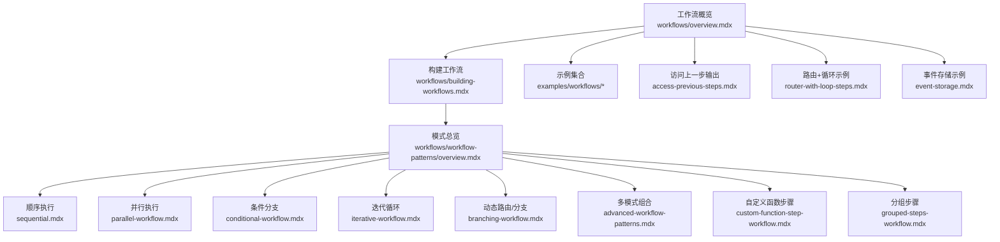
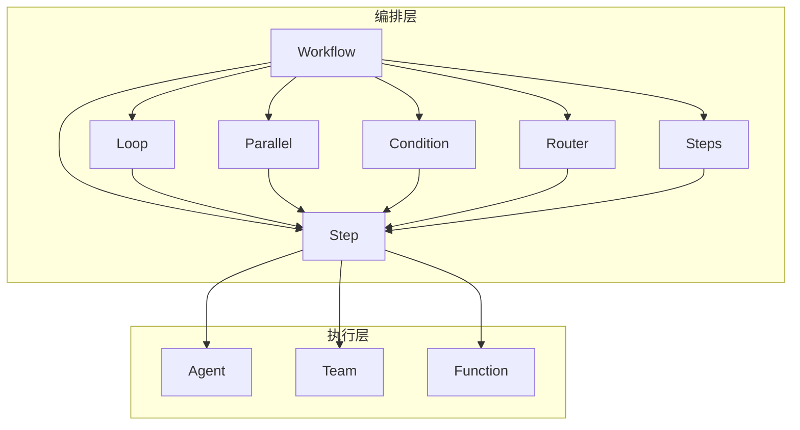
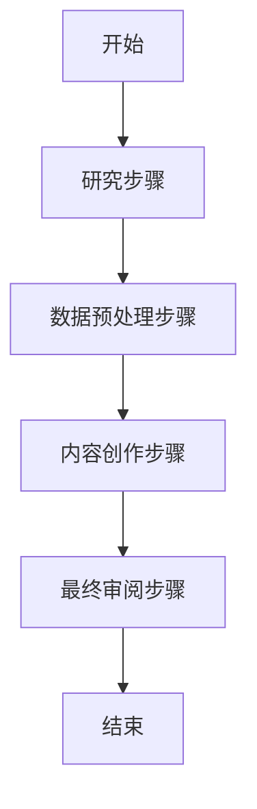
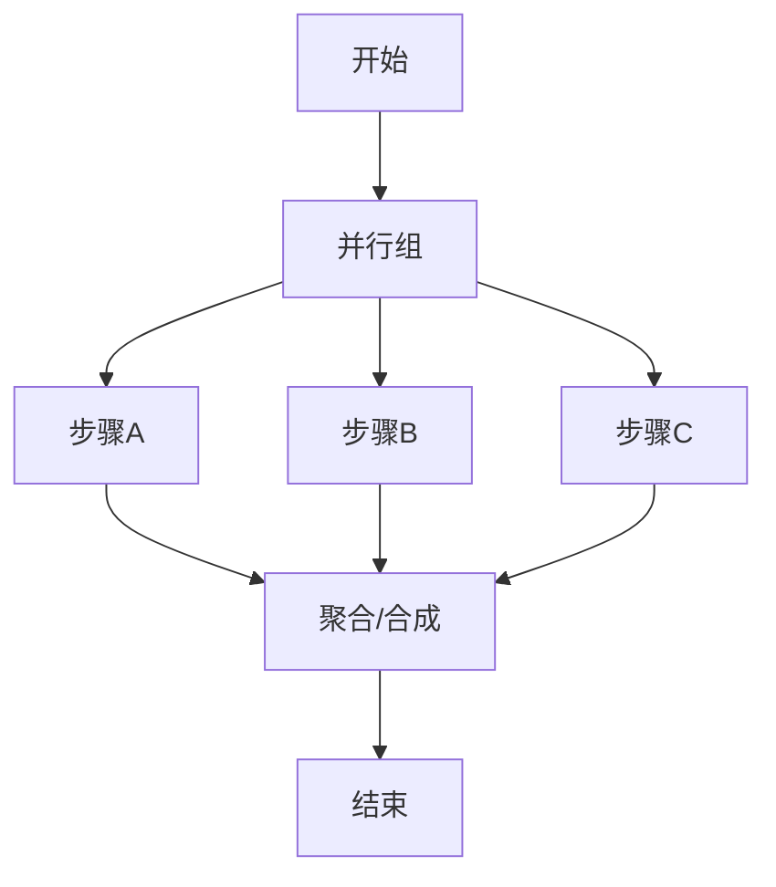
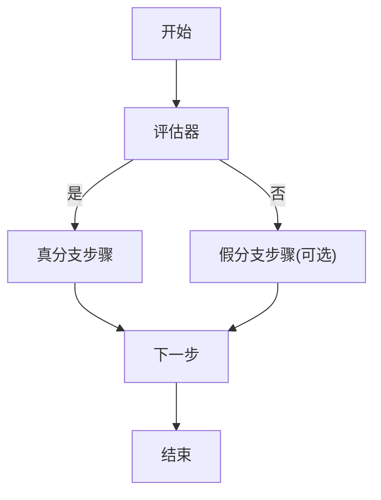
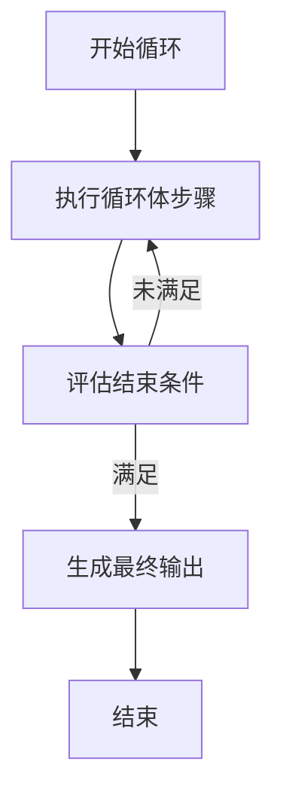
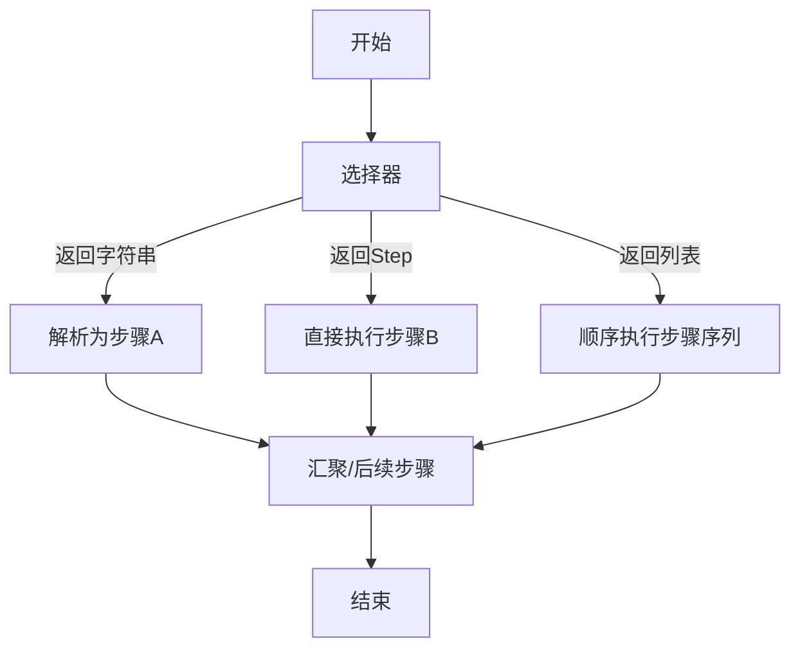
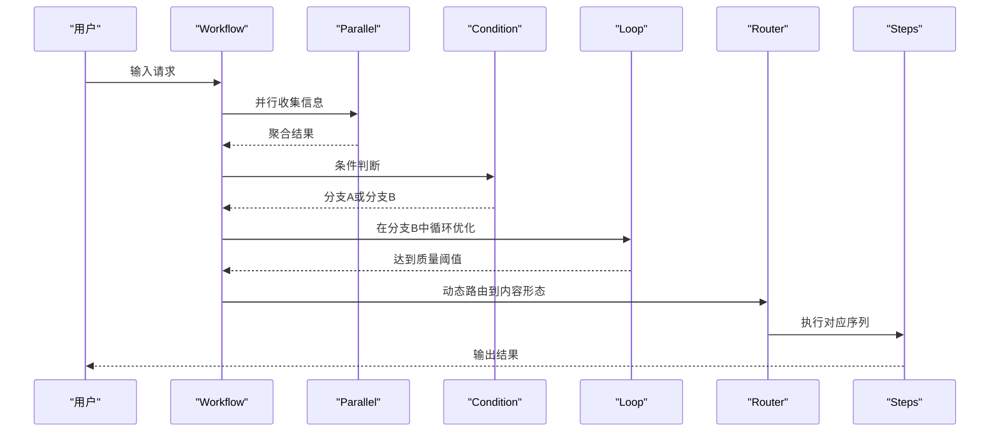
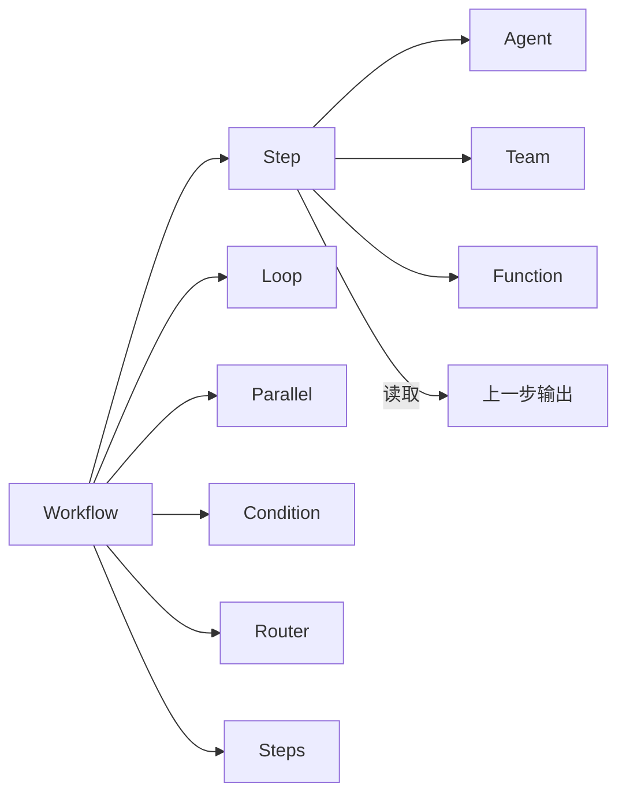

# 工作流模式

<cite>
**本文引用的文件**
- [workflows/overview.mdx](file://workflows/overview.mdx)
- [workflows/building-workflows.mdx](file://workflows/building-workflows.mdx)
- [workflows/workflow-patterns/overview.mdx](file://workflows/workflow-patterns/overview.mdx)
- [workflows/workflow-patterns/sequential.mdx](file://workflows/workflow-patterns/sequential.mdx)
- [workflows/workflow-patterns/parallel-workflow.mdx](file://workflows/workflow-patterns/parallel-workflow.mdx)
- [workflows/workflow-patterns/conditional-workflow.mdx](file://workflows/workflow-patterns/conditional-workflow.mdx)
- [workflows/workflow-patterns/iterative-workflow.mdx](file://workflows/workflow-patterns/iterative-workflow.mdx)
- [workflows/workflow-patterns/branching-workflow.mdx](file://workflows/workflow-patterns/branching-workflow.mdx)
- [workflows/workflow-patterns/advanced-workflow-patterns.mdx](file://workflows/workflow-patterns/advanced-workflow-patterns.mdx)
- [workflows/workflow-patterns/custom-function-step-workflow.mdx](file://workflows/workflow-patterns/custom-function-step-workflow.mdx)
- [workflows/workflow-patterns/grouped-steps-workflow.mdx](file://workflows/workflow-patterns/grouped-steps-workflow.mdx)
- [workflows/access-previous-steps.mdx](file://workflows/access-previous-steps.mdx)
- [workflows/usage/router-with-loop-steps.mdx](file://workflows/usage/router-with-loop-steps.mdx)
- [examples/workflows/loop-execution/loop-basic.mdx](file://examples/workflows/loop-execution/loop-basic.mdx)
- [examples/workflows/loop-execution/loop-with-parallel.mdx](file://examples/workflows/loop-execution/loop-with-parallel.mdx)
- [examples/workflows/parallel-execution/overview.mdx](file://examples/workflows/parallel-execution/overview.mdx)
- [examples/workflows/conditional-execution/condition-basic.mdx](file://examples/workflows/conditional-execution/condition-basic.mdx)
- [examples/workflows/conditional-branching/conditional-branching-basic.mdx](file://examples/workflows/conditional-branching/conditional-branching-basic.mdx)
- [examples/workflows/advanced-concepts/run-control/event-storage.mdx](file://examples/workflows/advanced-concepts/run-control/event-storage.mdx)
</cite>

## 目录
1. [引言](#引言)
2. [项目结构](#项目结构)
3. [核心组件](#核心组件)
4. [架构总览](#架构总览)
5. [详细组件分析](#详细组件分析)
6. [依赖分析](#依赖分析)
7. [性能考虑](#性能考虑)
8. [故障排查指南](#故障排查指南)
9. [结论](#结论)
10. [附录](#附录)

## 引言
本技术文档系统性地阐述 Agno 工作流体系中的标准模式：顺序执行、并行执行、条件分支与迭代循环，并给出适用场景、设计原则、实现要点、组合策略、复杂流程拆解与重构技巧、模式选择决策指南以及性能与可靠性考量。文档以仓库中已有的“工作流模式”“构建工作流”“运行工作流”等主题文档为基础，结合示例与参考路径，帮助读者在生产环境中稳定地构建可维护、可观测、可扩展的工作流自动化。

## 项目结构
围绕工作流模式的知识与示例主要分布在以下位置：
- 概览与入门：workflows/overview.mdx、workflows/building-workflows.mdx
- 模式总览与卡片导航：workflows/workflow-patterns/overview.mdx
- 各模式详解：sequential.mdx、parallel-workflow.mdx、conditional-workflow.mdx、iterative-workflow.mdx、branching-workflow.mdx、advanced-workflow-patterns.mdx、custom-function-step-workflow.mdx、grouped-steps-workflow.mdx
- 实战示例：examples/workflows 下的子目录（如 loop-execution、parallel-execution、conditional-execution、conditional-branching 等）
- 运行时访问历史输出：workflows/access-previous-steps.mdx
- 高级组合示例：workflows/usage/router-with-loop-steps.mdx
- 事件存储与运行控制：examples/workflows/advanced-concepts/run-control/event-storage.mdx

图表来源
- [workflows/overview.mdx:1-102](file://workflows/overview.mdx#L1-L102)
- [workflows/building-workflows.mdx:1-16](file://workflows/building-workflows.mdx#L1-L16)
- [workflows/workflow-patterns/overview.mdx:1-92](file://workflows/workflow-patterns/overview.mdx#L1-L92)

章节来源
- [workflows/overview.mdx:1-102](file://workflows/overview.mdx#L1-L102)
- [workflows/building-workflows.mdx:1-16](file://workflows/building-workflows.mdx#L1-L16)
- [workflows/workflow-patterns/overview.mdx:1-92](file://workflows/workflow-patterns/overview.mdx#L1-L92)

## 核心组件
- 工作流（Workflow）：顶层编排器，管理整个执行过程与数据流。
- 步骤（Step）：最小执行单元，封装一个执行器（Agent、Team 或自定义函数），确保职责单一、可测试、可复用。
- 循环（Loop）：重复执行一组步骤，支持结束条件与最大迭代次数，保障确定性退出。
- 并行（Parallel）：并发执行多个独立步骤，结果汇聚后进入后续步骤。
- 条件（Condition）：基于评估函数在两个分支间选择执行路径，或在不满足时跳过。
- 路由（Router）：根据内容分析动态选择下一步或多步序列，支持字符串、Step 对象或 Step 列表返回。
- 分组（Steps）：将多个步骤组织为可复用的逻辑序列，便于模块化与清晰的分支选择。
- 自定义函数（Custom Function）：通过 Step 的 executor 使用自定义逻辑，实现输入预处理、调用 Agent/Team、输出后处理等。

章节来源
- [workflows/building-workflows.mdx:1-16](file://workflows/building-workflows.mdx#L1-L16)

## 架构总览
下图展示了工作流系统的核心构件及其交互关系，体现从“输入到输出”的确定性数据流与控制流。

图表来源
- [workflows/building-workflows.mdx:1-16](file://workflows/building-workflows.mdx#L1-L16)
- [workflows/workflow-patterns/overview.mdx:11-25](file://workflows/workflow-patterns/overview.mdx#L11-L25)

## 详细组件分析

### 顺序执行模式
- 设计原则
  - 明确的线性依赖关系，前一步输出作为下一步输入。
  - 可混合 Agent、Team 与自定义函数，统一通过 StepOutput 接口传递数据。
- 适用场景
  - 研究 → 数据处理 → 内容创作 → 最终审阅等线性流程。
- 实现要点
  - 使用 Workflow 定义 steps 列表，按顺序执行。
  - 自定义函数需遵循 StepInput/StepOutput 接口约定，保证数据兼容。
- 示例参考
  - [顺序工作流示例:12-32](file://workflows/workflow-patterns/sequential.mdx#L12-L32)
  - [函数与代理序列示例:1-200](file://workflows/usage/function-instead-of-steps.mdx#L1-L200)

图表来源
- [workflows/workflow-patterns/sequential.mdx:12-32](file://workflows/workflow-patterns/sequential.mdx#L12-L32)

章节来源
- [workflows/workflow-patterns/sequential.mdx:1-50](file://workflows/workflow-patterns/sequential.mdx#L1-L50)

### 并行执行模式
- 设计原则
  - 独立任务并发执行，减少总耗时；注意共享状态的并发安全。
  - 并行结束后进行结果聚合或合成。
- 适用场景
  - 多源研究、并行分析、并发数据处理。
- 实现要点
  - 使用 Parallel 包裹多个 Step；后续步骤负责合并输出。
  - 在自定义函数中访问会话状态时需避免竞态。
- 示例参考
  - [并行工作流示例:23-40](file://workflows/workflow-patterns/parallel-workflow.mdx#L23-L40)
  - [并行与条件组合示例:1-9](file://examples/workflows/parallel-execution/overview.mdx#L1-L9)

图表来源
- [workflows/workflow-patterns/parallel-workflow.mdx:26-40](file://workflows/workflow-patterns/parallel-workflow.mdx#L26-L40)

章节来源
- [workflows/workflow-patterns/parallel-workflow.mdx:1-54](file://workflows/workflow-patterns/parallel-workflow.mdx#L1-L54)

### 条件分支模式
- 设计原则
  - 基于输入或规则进行二选一或多选一的确定性分支。
  - 未满足条件时可跳过或走备选路径。
- 适用场景
  - 内容类型路由、主题特定处理、质量判定分流。
- 实现要点
  - Condition 的 evaluator 返回布尔值；支持 else_steps。
  - 可与 Parallel、Loop、Router 组合形成复合逻辑。
- 示例参考
  - [条件工作流基础示例:32-52](file://workflows/workflow-patterns/conditional-workflow.mdx#L32-L52)
  - [条件与并行组合示例:1-200](file://examples/workflows/conditional-execution/condition-basic.mdx#L1-L200)

图表来源
- [workflows/workflow-patterns/conditional-workflow.mdx:23-52](file://workflows/workflow-patterns/conditional-workflow.mdx#L23-L52)

章节来源
- [workflows/workflow-patterns/conditional-workflow.mdx:1-100](file://workflows/workflow-patterns/conditional-workflow.mdx#L1-L100)

### 迭代循环模式
- 设计原则
  - 通过 end_condition 控制退出，max_iterations 提供安全上限。
  - 支持迭代输出转发（默认逐次传递上一次输出）。
- 适用场景
  - 质量改进循环、重试机制、迭代优化。
- 实现要点
  - end_condition 接收历史 StepOutput 列表，决定是否继续。
  - forward_iteration_output 可切换为每次传入原始输入。
- 示例参考
  - [迭代工作流示例:23-44](file://workflows/workflow-patterns/iterative-workflow.mdx#L23-L44)
  - [循环+并行示例:1-166](file://examples/workflows/loop-execution/loop-with-parallel.mdx#L1-L166)
  - [循环基础示例:1-144](file://examples/workflows/loop-execution/loop-basic.mdx#L1-L144)

图表来源
- [workflows/workflow-patterns/iterative-workflow.mdx:30-44](file://workflows/workflow-patterns/iterative-workflow.mdx#L30-L44)

章节来源
- [workflows/workflow-patterns/iterative-workflow.mdx:1-57](file://workflows/workflow-patterns/iterative-workflow.mdx#L1-L57)

### 动态路由/分支模式
- 设计原则
  - 根据输入内容智能选择路径，支持返回字符串、Step 对象或 Step 列表。
  - 可接收 step_choices 参数，实现动态选择与嵌套序列。
- 适用场景
  - 专家路由、内容类型检测、多路径处理。
- 实现要点
  - selector 函数灵活返回多种类型；choices 支持嵌套列表作为顺序容器。
- 示例参考
  - [动态路由示例:34-91](file://workflows/workflow-patterns/branching-workflow.mdx#L34-L91)
  - [使用 step_choices 示例:97-134](file://workflows/workflow-patterns/branching-workflow.mdx#L97-L134)
  - [嵌套 choices 示例:140-167](file://workflows/workflow-patterns/branching-workflow.mdx#L140-L167)

图表来源
- [workflows/workflow-patterns/branching-workflow.mdx:67-91](file://workflows/workflow-patterns/branching-workflow.mdx#L67-L91)

章节来源
- [workflows/workflow-patterns/branching-workflow.mdx:1-176](file://workflows/workflow-patterns/branching-workflow.mdx#L1-L176)

### 多模式组合与高级模式
- 设计原则
  - 将条件、并行、循环、路由、自定义函数与分组步骤组合，形成复杂但确定性的自动化。
  - 通过 Steps 将子流程模块化，提升可读性与可维护性。
- 适用场景
  - 复杂业务流程编排、跨域内容生产、质量度量驱动的迭代。
- 实现要点
  - 先并行收集信息，再条件分流，必要时在某条路径内进行循环优化，最后统一路由到不同内容形态。
  - 使用自定义函数进行后处理与质量评估。
- 示例参考
  - [多模式组合示例:51-90](file://workflows/workflow-patterns/advanced-workflow-patterns.mdx#L51-L90)
  - [路由+循环组合示例:1-20](file://workflows/usage/router-with-loop-steps.mdx#L1-L20)
  - [分组步骤示例:12-33](file://workflows/workflow-patterns/grouped-steps-workflow.mdx#L12-L33)

图表来源
- [workflows/workflow-patterns/advanced-workflow-patterns.mdx:51-90](file://workflows/workflow-patterns/advanced-workflow-patterns.mdx#L51-L90)

章节来源
- [workflows/workflow-patterns/advanced-workflow-patterns.mdx:1-97](file://workflows/workflow-patterns/advanced-workflow-patterns.mdx#L1-L97)

### 自定义函数步骤
- 设计原则
  - 通过自定义函数实现业务规则、数据转换与 Agent/Team 调用。
  - 支持类式执行器与异步流式执行，便于在 AgentOS 中进行事件流式传输。
- 适用场景
  - 输入预处理、上下文增强、后处理与质量评估、缓存与重试策略。
- 实现要点
  - 函数签名遵循 StepInput/StepOutput；可使用 run_context 访问会话状态。
  - 类式执行器可携带配置与状态，适合复用与追踪。
- 示例参考
  - [自定义函数步骤示例:30-87](file://workflows/workflow-patterns/custom-function-step-workflow.mdx#L30-L87)
  - [类式执行器示例:124-146](file://workflows/workflow-patterns/custom-function-step-workflow.mdx#L124-L146)
  - [异步流式示例:175-253](file://workflows/workflow-patterns/custom-function-step-workflow.mdx#L175-L253)

章节来源
- [workflows/workflow-patterns/custom-function-step-workflow.mdx:1-259](file://workflows/workflow-patterns/custom-function-step-workflow.mdx#L1-L259)

### 分组步骤（Steps）
- 设计原则
  - 将相关步骤封装为可复用的逻辑单元，简化主流程并提升可读性。
  - 与 Router 结合，实现清晰的分支与路由。
- 适用场景
  - 不同内容形态的完整流水线（如图像生成、视频生成）。
- 实现要点
  - Steps 作为单个步骤被 Router 选择；支持在 Router 中返回 Steps 序列。
- 示例参考
  - [分组步骤示例:12-33](file://workflows/workflow-patterns/grouped-steps-workflow.mdx#L12-L33)
  - [与 Router 结合示例:39-92](file://workflows/workflow-patterns/grouped-steps-workflow.mdx#L39-L92)

章节来源
- [workflows/workflow-patterns/grouped-steps-workflow.mdx:1-101](file://workflows/workflow-patterns/grouped-steps-workflow.mdx#L1-L101)

## 依赖分析
- 组件耦合
  - Workflow 与 Step 为强依赖；Step 可依赖 Agent/Team/Function。
  - Loop/Parallel/Condition/Router/Steps 作为复合 Step 使用，彼此可嵌套组合。
- 外部依赖
  - 示例中使用工具（如 HackerNewsTools、WebSearchTools）与模型（OpenAIChat）等。
- 运行时数据依赖
  - 上一步输出可通过 StepInput.previous_step_content 获取；并行组输出可通过名称访问。

图表来源
- [workflows/access-previous-steps.mdx:72-110](file://workflows/access-previous-steps.mdx#L72-L110)

章节来源
- [workflows/access-previous-steps.mdx:72-110](file://workflows/access-previous-steps.mdx#L72-L110)

## 性能考虑
- 并行优先：对独立任务采用 Parallel，显著缩短端到端时间。
- 循环收敛：为 Loop 设置合理的 end_condition 与 max_iterations，避免无限循环。
- 自定义函数轻量化：尽量将重计算交给 Agent/Team，函数仅做必要的数据转换与路由。
- 事件与流式：在 AgentOS 中启用流式输出与事件注入，降低等待时间并提升可观测性。
- 会话状态并发：在并行步骤中更新共享状态时，采用加锁或去并发化策略，避免竞态。

## 故障排查指南
- 无法获取上一步输出
  - 确认使用了正确的 StepInput 接口与命名；并行组输出可通过名称递归访问。
  - 参考：[访问上一步输出:72-110](file://workflows/access-previous-steps.mdx#L72-L110)
- 并行竞态与状态冲突
  - 在并行步骤中更新共享状态时，需协调或串行化；避免同时写入。
  - 参考：[并行工作流注意事项:42-47](file://workflows/workflow-patterns/parallel-workflow.mdx#L42-L47)
- 循环不退出
  - 检查 end_condition 的实现与 max_iterations 设置；确保条件能收敛。
  - 参考：[迭代工作流说明:26-48](file://workflows/workflow-patterns/iterative-workflow.mdx#L26-L48)
- 路由未命中
  - 检查 selector 返回类型与 choices 是否一致；必要时使用 step_choices 动态选择。
  - 参考：[分支工作流示例:67-91](file://workflows/workflow-patterns/branching-workflow.mdx#L67-L91)
- 事件存储与回放
  - 使用 run_control 示例验证事件持久化与检索能力。
  - 参考：[事件存储示例:150-166](file://examples/workflows/advanced-concepts/run-control/event-storage.mdx#L150-L166)

章节来源
- [workflows/access-previous-steps.mdx:72-110](file://workflows/access-previous-steps.mdx#L72-L110)
- [workflows/workflow-patterns/parallel-workflow.mdx:42-47](file://workflows/workflow-patterns/parallel-workflow.mdx#L42-L47)
- [workflows/workflow-patterns/iterative-workflow.mdx:26-48](file://workflows/workflow-patterns/iterative-workflow.mdx#L26-L48)
- [workflows/workflow-patterns/branching-workflow.mdx:67-91](file://workflows/workflow-patterns/branching-workflow.mdx#L67-L91)
- [examples/workflows/advanced-concepts/run-control/event-storage.mdx:150-166](file://examples/workflows/advanced-concepts/run-control/event-storage.mdx#L150-L166)

## 结论
通过顺序、并行、条件、循环与路由等确定性模式，配合自定义函数与分组步骤，Agno 工作流能够稳定地支撑从简单到复杂的多阶段自动化。建议在设计初期明确数据边界与控制流，优先采用并行与循环收敛策略，并以分组步骤与路由实现清晰的模块化与可演进性。结合事件存储与流式输出，可在生产环境获得良好的可观测性与用户体验。

## 附录
- 快速参考
  - 模式总览与导航：[工作流模式总览:1-92](file://workflows/workflow-patterns/overview.mdx#L1-L92)
  - 构建工作流基础：[构建工作流:1-16](file://workflows/building-workflows.mdx#L1-L16)
  - 实战示例入口：[工作流示例总览:1-14](file://examples/workflows/overview.mdx#L1-L14)