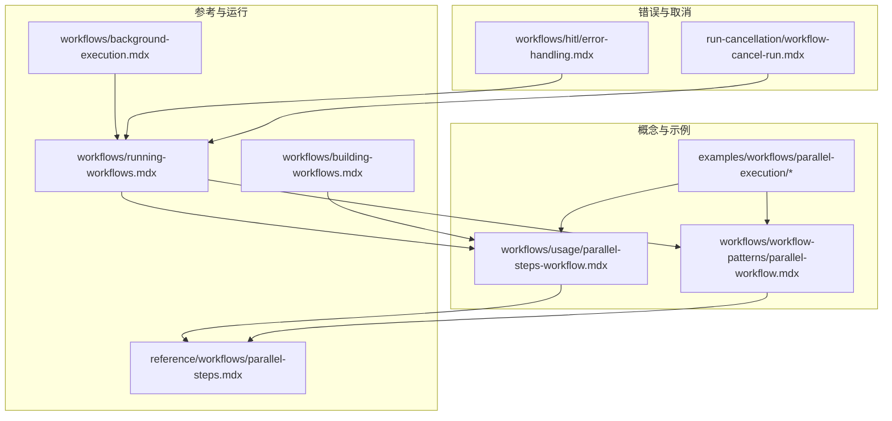
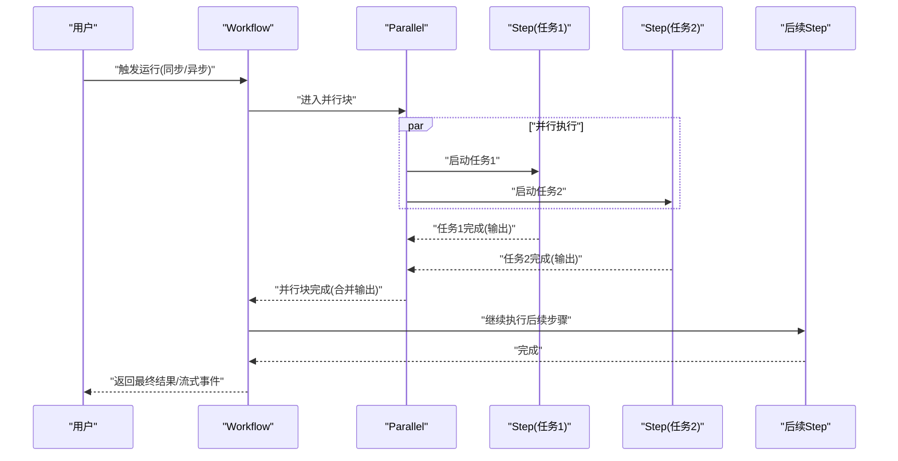
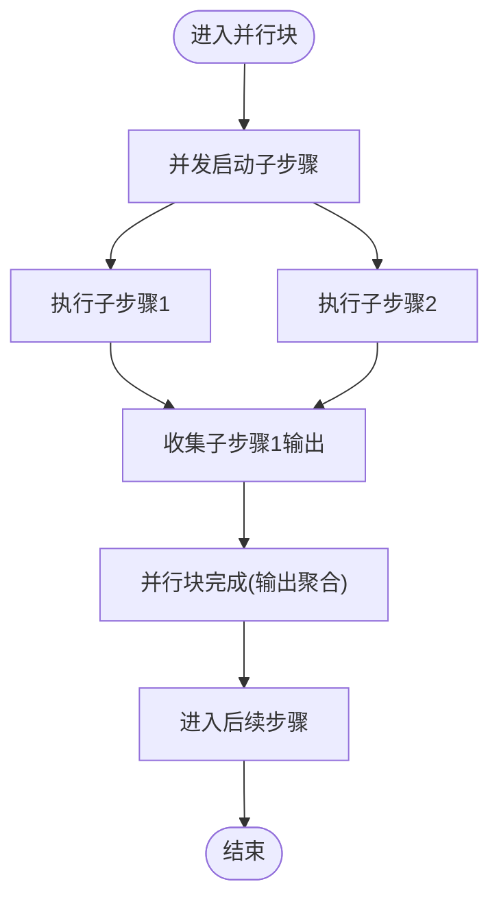
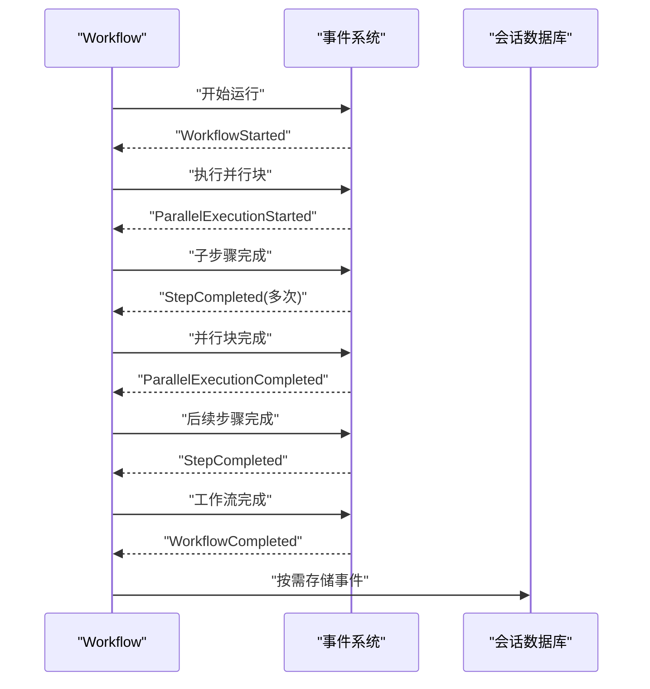
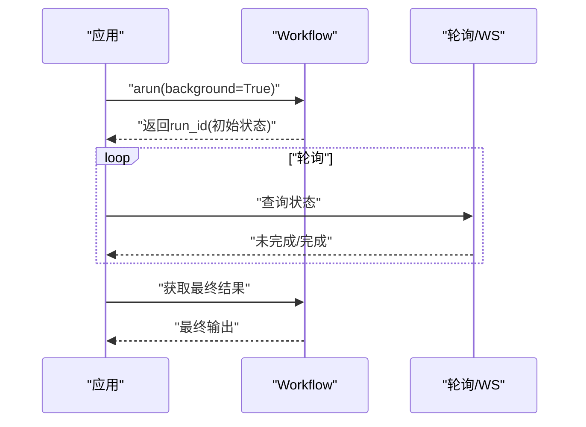
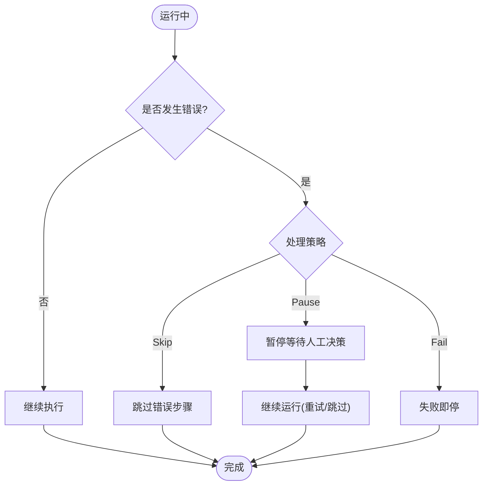
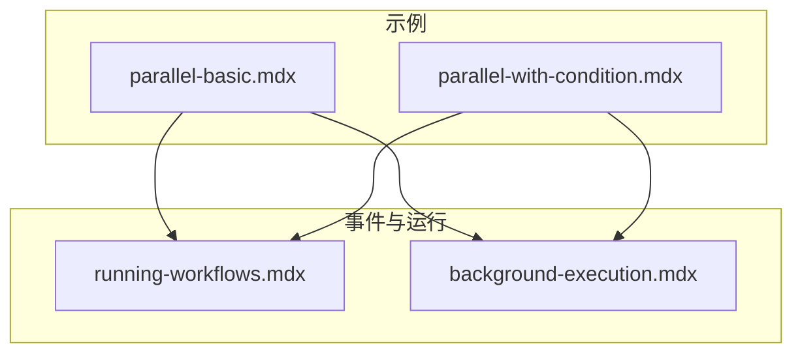
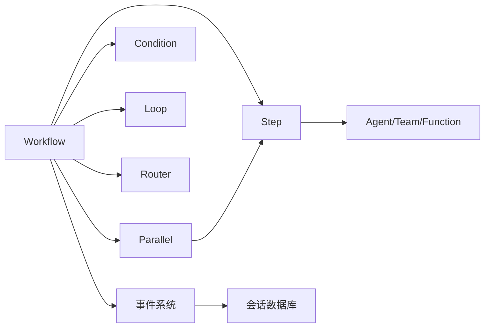

# 并行执行工作流

<cite>
**本文引用的文件**
- [workflows/usage/parallel-steps-workflow.mdx](file://workflows/usage/parallel-steps-workflow.mdx)
- [workflows/workflow-patterns/parallel-workflow.mdx](file://workflows/workflow-patterns/parallel-workflow.mdx)
- [examples/workflows/parallel-execution/overview.mdx](file://examples/workflows/parallel-execution/overview.mdx)
- [examples/workflows/parallel-execution/parallel-basic.mdx](file://examples/workflows/parallel-execution/parallel-basic.mdx)
- [examples/workflows/parallel-execution/parallel-with-condition.mdx](file://examples/workflows/parallel-execution/parallel-with-condition.mdx)
- [reference/workflows/parallel-steps.mdx](file://reference/workflows/parallel-steps.mdx)
- [workflows/running-workflows.mdx](file://workflows/running-workflows.mdx)
- [workflows/building-workflows.mdx](file://workflows/building-workflows.mdx)
- [workflows/background-execution.mdx](file://workflows/background-execution.mdx)
- [workflows/hitl/error-handling.mdx](file://workflows/hitl/error-handling.mdx)
- [run-cancellation/workflow-cancel-run.mdx](file://run-cancellation/workflow-cancel-run.mdx)
</cite>

## 目录
1. [引言](#引言)
2. [项目结构](#项目结构)
3. [核心组件](#核心组件)
4. [架构总览](#架构总览)
5. [详细组件分析](#详细组件分析)
6. [依赖关系分析](#依赖关系分析)
7. [性能考量](#性能考量)
8. [故障排查指南](#故障排查指南)
9. [结论](#结论)
10. [附录](#附录)

## 引言
本文件围绕“并行执行工作流”的设计理念与实现方式进行系统化技术说明，重点覆盖以下方面：
- 并发任务调度：如何在工作流中以并行方式启动多个相互独立的任务，并在完成后进行结果聚合。
- 资源管理与同步：并行步骤的启动、完成事件、以及事件存储与过滤策略，确保可观测性与可审计性。
- 错误隔离与恢复：并行执行中的错误处理策略（失败、跳过、暂停等待人工干预），以及运行时取消与恢复。
- 性能优势与挑战：通过并行减少总执行时间，同时关注负载均衡、资源竞争与共享状态访问的协调。
- 设计原则、监控策略与故障恢复：事件存储、流式输出、后台执行、取消与重试等能力。

## 项目结构
并行执行工作流相关的内容主要分布在以下位置：
- 概念与用法示例：workflows/usage、workflows/workflow-patterns
- 示例集合：examples/workflows/parallel-execution
- 参考文档：reference/workflows
- 运行与监控：workflows/running-workflows、workflows/background-execution
- 错误处理与取消：workflows/hitl/error-handling.mdx、run-cancellation/workflow-cancel-run.mdx

**图示来源**
- [workflows/usage/parallel-steps-workflow.mdx](file://workflows/usage/parallel-steps-workflow.mdx)
- [workflows/workflow-patterns/parallel-workflow.mdx](file://workflows/workflow-patterns/parallel-workflow.mdx)
- [examples/workflows/parallel-execution/parallel-basic.mdx](file://examples/workflows/parallel-execution/parallel-basic.mdx)
- [examples/workflows/parallel-execution/parallel-with-condition.mdx](file://examples/workflows/parallel-execution/parallel-with-condition.mdx)
- [reference/workflows/parallel-steps.mdx](file://reference/workflows/parallel-steps.mdx)
- [workflows/running-workflows.mdx](file://workflows/running-workflows.mdx)
- [workflows/building-workflows.mdx](file://workflows/building-workflows.mdx)
- [workflows/background-execution.mdx](file://workflows/background-execution.mdx)
- [workflows/hitl/error-handling.mdx](file://workflows/hitl/error-handling.mdx)
- [run-cancellation/workflow-cancel-run.mdx](file://run-cancellation/workflow-cancel-run.mdx)

**章节来源**
- [workflows/usage/parallel-steps-workflow.mdx](file://workflows/usage/parallel-steps-workflow.mdx)
- [workflows/workflow-patterns/parallel-workflow.mdx](file://workflows/workflow-patterns/parallel-workflow.mdx)
- [examples/workflows/parallel-execution/overview.mdx](file://examples/workflows/parallel-execution/overview.mdx)

## 核心组件
- 并行步骤（Parallel）：用于声明一组可并行执行的子步骤，这些子步骤彼此独立，最终由上层步骤进行结果聚合或继续后续步骤。
- 工作流（Workflow）：顶层编排器，负责顺序、条件、循环、并行等控制流的组合与执行。
- 步骤（Step）：工作流中的最小执行单元，可封装 Agent、Team 或自定义函数。
- 事件系统：支持流式事件输出、事件存储、事件过滤，便于调试、审计与性能分析。
- 后台执行：通过异步运行与轮询/WebSocket获取结果，适合长时间运行的并行任务。
- 错误处理与取消：支持失败即停、跳过、暂停等待人工干预，以及运行时取消与恢复。

**章节来源**
- [workflows/building-workflows.mdx](file://workflows/building-workflows.mdx)
- [reference/workflows/parallel-steps.mdx](file://reference/workflows/parallel-steps.mdx)
- [workflows/running-workflows.mdx](file://workflows/running-workflows.mdx)
- [workflows/background-execution.mdx](file://workflows/background-execution.mdx)
- [workflows/hitl/error-handling.mdx](file://workflows/hitl/error-handling.mdx)
- [run-cancellation/workflow-cancel-run.mdx](file://run-cancellation/workflow-cancel-run.mdx)

## 架构总览
下图展示了并行执行在工作流中的整体调用链与事件流：

**图示来源**
- [workflows/running-workflows.mdx](file://workflows/running-workflows.mdx)
- [workflows/workflow-patterns/parallel-workflow.mdx](file://workflows/workflow-patterns/parallel-workflow.mdx)

## 详细组件分析

### 组件一：并行步骤（Parallel）
- 设计理念：将多个相互独立的子步骤放入一个并行块，系统自动并发启动这些子步骤，待全部完成后进入下一步。
- 关键参数与行为：
  - 支持可变数量的子步骤作为并行输入。
  - 可选名称与描述，便于日志与事件识别。
- 结果聚合：并行块完成后，其输出通常由上层步骤统一处理（如写入、评审、合成报告等）。

**图示来源**
- [reference/workflows/parallel-steps.mdx](file://reference/workflows/parallel-steps.mdx)
- [workflows/usage/parallel-steps-workflow.mdx](file://workflows/usage/parallel-steps-workflow.mdx)

**章节来源**
- [reference/workflows/parallel-steps.mdx](file://reference/workflows/parallel-steps.mdx)
- [workflows/usage/parallel-steps-workflow.mdx](file://workflows/usage/parallel-steps-workflow.mdx)

### 组件二：工作流运行与事件系统
- 同步/异步运行：支持同步与异步两种执行路径，异步适合长任务与后台执行。
- 流式输出：可选择仅输出关键事件或输出所有内部事件，便于实时观测。
- 事件存储：可配置是否存储事件到数据库，支持过滤冗余事件以降低噪声与存储开销。
- 事件类型：包含工作流开始/完成、步骤开始/完成、并行执行开始/完成、条件/循环/路由等事件。

**图示来源**
- [workflows/running-workflows.mdx](file://workflows/running-workflows.mdx)

**章节来源**
- [workflows/running-workflows.mdx](file://workflows/running-workflows.mdx)

### 组件三：后台执行与轮询
- 背景执行：通过异步运行开启后台任务，立即返回运行标识以便轮询或使用WebSocket订阅。
- 轮询策略：定期查询运行状态，直到完成或超时。
- 适用场景：长时间运行的并行任务，避免阻塞主线程。

**图示来源**
- [workflows/background-execution.mdx](file://workflows/background-execution.mdx)

**章节来源**
- [workflows/background-execution.mdx](file://workflows/background-execution.mdx)

### 组件四：错误处理与运行取消
- 错误处理策略：
  - 失败即停：默认策略，遇到错误直接终止。
  - 跳过：忽略错误并继续后续步骤。
  - 暂停：等待人工决策（重试或跳过），并可在会话中继续运行。
- 运行取消：
  - 支持在运行过程中取消，取消后可查询状态并记录取消事件。
  - 取消后可结合事件存储与流式事件进行审计与复盘。

**图示来源**
- [workflows/hitl/error-handling.mdx](file://workflows/hitl/error-handling.mdx)
- [run-cancellation/workflow-cancel-run.mdx](file://run-cancellation/workflow-cancel-run.mdx)

**章节来源**
- [workflows/hitl/error-handling.mdx](file://workflows/hitl/error-handling.mdx)
- [run-cancellation/workflow-cancel-run.mdx](file://run-cancellation/workflow-cancel-run.mdx)

### 组件五：示例与最佳实践
- 基础并行示例：展示多来源研究并行执行，随后串行写入与评审。
- 条件+并行示例：根据主题相关性动态决定是否进行并行研究，并在必要时追加专项分析。
- 事件存储与过滤：演示如何启用事件存储、过滤冗余事件，以及如何查看存储的事件列表。

**图示来源**
- [examples/workflows/parallel-execution/parallel-basic.mdx](file://examples/workflows/parallel-execution/parallel-basic.mdx)
- [examples/workflows/parallel-execution/parallel-with-condition.mdx](file://examples/workflows/parallel-execution/parallel-with-condition.mdx)
- [workflows/running-workflows.mdx](file://workflows/running-workflows.mdx)
- [workflows/background-execution.mdx](file://workflows/background-execution.mdx)

**章节来源**
- [examples/workflows/parallel-execution/parallel-basic.mdx](file://examples/workflows/parallel-execution/parallel-basic.mdx)
- [examples/workflows/parallel-execution/parallel-with-condition.mdx](file://examples/workflows/parallel-execution/parallel-with-condition.mdx)
- [workflows/running-workflows.mdx](file://workflows/running-workflows.mdx)

## 依赖关系分析
- 组件耦合：
  - Parallel 依赖于 Step 的执行模型；Workflow 作为顶层编排器，协调 Step、Condition、Loop、Router 等。
  - 事件系统与运行输出解耦，既可流式输出，也可持久化存储。
- 外部集成点：
  - 数据库：会话与事件存储（SQLite、PostgreSQL 等）。
  - 异步运行：依赖事件循环与轮询/WS。
- 潜在环路：
  - 并行块内部步骤之间无直接依赖，避免了环形依赖；条件/循环/路由可能形成复杂分支，但不改变并行块内步骤的无依赖特性。

**图示来源**
- [workflows/building-workflows.mdx](file://workflows/building-workflows.mdx)
- [workflows/running-workflows.mdx](file://workflows/running-workflows.mdx)

**章节来源**
- [workflows/building-workflows.mdx](file://workflows/building-workflows.mdx)
- [workflows/running-workflows.mdx](file://workflows/running-workflows.mdx)

## 性能考量
- 性能优势：
  - 并行执行显著缩短独立任务的总耗时，尤其适用于多来源数据采集、多模型推理或高延迟外部服务调用。
- 负载均衡与资源竞争：
  - 需要评估并发度与资源配额（如模型调用速率限制、外部API限流、内存/CPU占用），避免过度并发导致抖动或失败率上升。
- 共享状态访问：
  - 在并行步骤中更新共享会话状态时，应采用协调机制（如锁或队列）避免竞态条件。
- 监控与采样：
  - 使用事件存储与过滤策略，聚焦关键事件，降低存储与解析成本；对高频事件（如 step_started/completed）可选择性跳过。

[本节为通用指导，无需列出具体文件来源]

## 故障排查指南
- 观察事件序列：通过事件存储与流式事件定位问题发生阶段（并行块开始/完成、步骤开始/完成、条件/循环/路由事件）。
- 错误处理策略切换：根据错误类型（网络超时、限流、无效输入、资源不可用）选择重试、跳过或暂停等待人工干预。
- 取消与恢复：在运行中取消后，检查状态与事件记录，结合事件存储进行复盘；必要时重新运行或调整并发度。
- 后台执行异常：检查轮询间隔与超时设置，确认 WS 订阅是否正常；对长时间任务设置合理的超时与告警。

**章节来源**
- [workflows/running-workflows.mdx](file://workflows/running-workflows.mdx)
- [workflows/hitl/error-handling.mdx](file://workflows/hitl/error-handling.mdx)
- [run-cancellation/workflow-cancel-run.mdx](file://run-cancellation/workflow-cancel-run.mdx)

## 结论
并行执行工作流通过将相互独立的任务并发执行，在保证确定性结果的同时大幅降低总执行时间。配合完善的事件系统、后台执行、错误处理与取消能力，可以构建高可靠、可观测、可恢复的并行工作流体系。实践中应重视资源配额与共享状态协调，结合事件存储与流式输出进行持续优化与监控。

[本节为总结性内容，无需列出具体文件来源]

## 附录
- 实际应用场景建议：
  - 多来源信息检索与交叉验证（如新闻、网页、专业数据库）。
  - 并行数据分析与特征提取，随后统一建模与报告生成。
  - 批量任务分片并行处理，最后汇总结果。
- 性能优化建议：
  - 动态调整并发度，结合限流与退避策略。
  - 对共享状态访问加锁或使用队列，避免竞态。
  - 使用事件过滤与存储策略，聚焦关键指标与异常事件。

[本节为通用指导，无需列出具体文件来源]