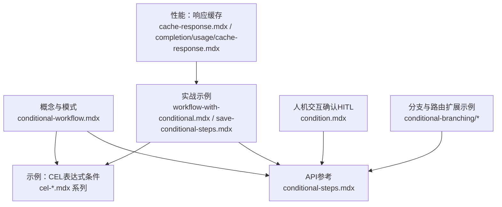
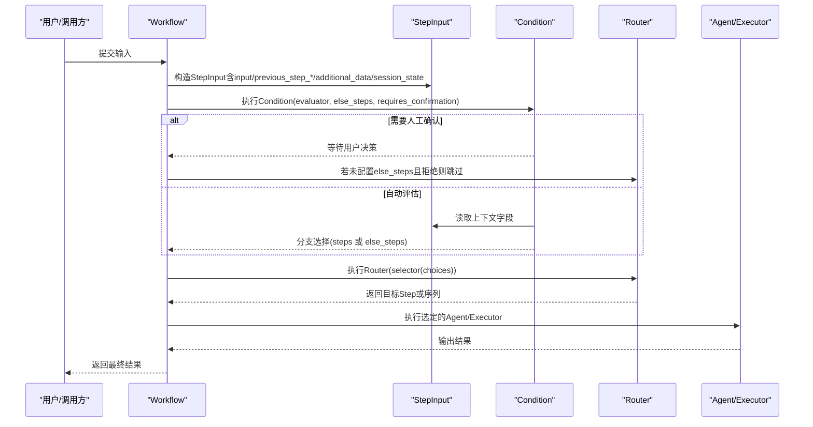
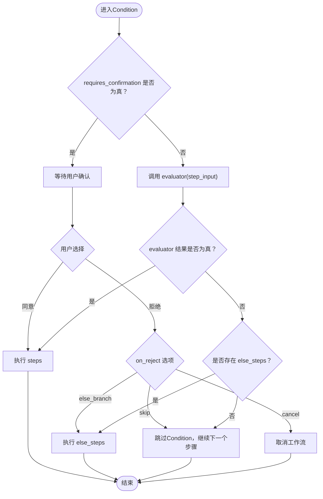
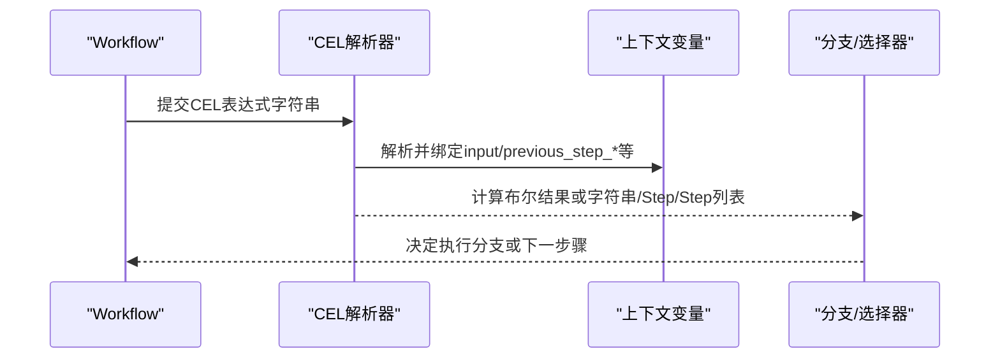
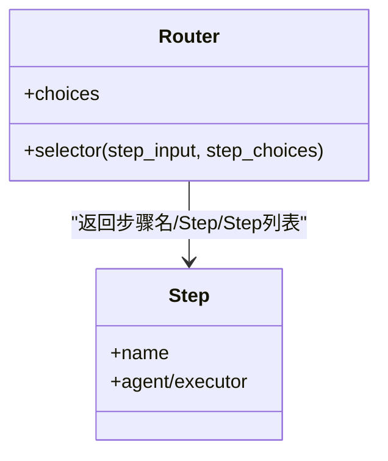
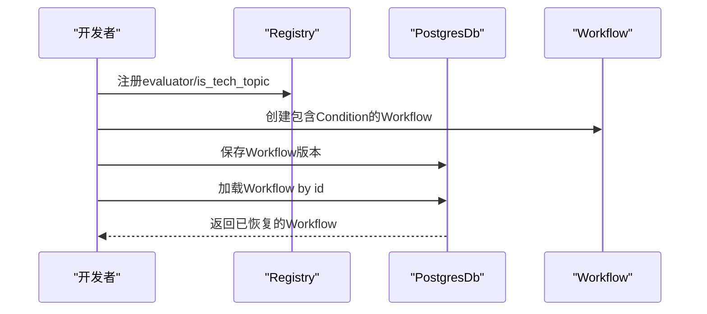
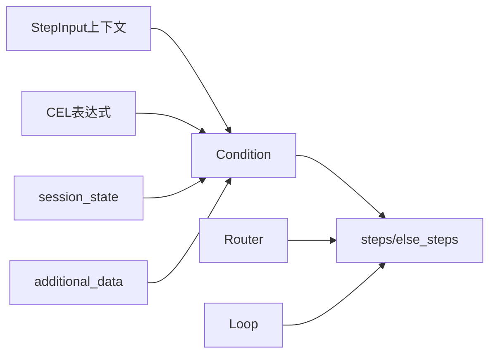

# 条件分支工作流

<cite>
**本文引用的文件**   
- [conditional-workflow.mdx](file://workflows/workflow-patterns/conditional-workflow.mdx)
- [conditional-steps.mdx](file://reference/workflows/conditional-steps.mdx)
- [cel-expressions.mdx](file://agent-os/studio/cel-expressions.mdx)
- [cel-basic.mdx](file://examples/workflows/cel-expressions/condition/cel-basic.mdx)
- [cel-previous-step.mdx](file://examples/workflows/cel-expressions/condition/cel-previous-step.mdx)
- [cel-session-state.mdx](file://examples/workflows/cel-expressions/condition/cel-session-state.mdx)
- [cel-additional-data.mdx](file://examples/workflows/cel-expressions/condition/cel-additional-data.mdx)
- [workflow-with-conditional.mdx](file://examples/agent-os/workflow/workflow-with-conditional.mdx)
- [save-conditional-steps.mdx](file://examples/components/workflows/save-conditional-steps.mdx)
- [condition.mdx](file://workflows/hitl/condition.mdx)
- [nested-choices.mdx](file://examples/workflows/conditional-branching/nested-choices.mdx)
- [selector-types.mdx](file://examples/workflows/conditional-branching/selector-types.mdx)
- [overview.mdx（条件分支示例总览）](file://examples/workflows/conditional-branching/overview.mdx)
- [cache-response.mdx](file://models/cache-response.mdx)
- [completion/usage/cache-response.mdx](file://models/providers/native/openai/completion/usage/cache-response.mdx)
</cite>

## 目录
1. [引言](#引言)
2. [项目结构](#项目结构)
3. [核心组件](#核心组件)
4. [架构总览](#架构总览)
5. [详细组件分析](#详细组件分析)
6. [依赖分析](#依赖分析)
7. [性能考虑](#性能考虑)
8. [故障排查指南](#故障排查指南)
9. [结论](#结论)
10. [附录](#附录)

## 引言
本技术文档聚焦“条件分支工作流”的设计与实现，系统讲解条件执行模式：从条件表达式的编写、分支逻辑处理到动态路由选择；覆盖基于数据、状态与外部条件的决策路径；并结合CEL表达式、会话状态、前置步骤输出等上下文变量，给出可复用的模式与最佳实践。文档同时提供性能优化建议（如条件缓存与短路求值）、复杂条件逻辑的设计模式以及调试技巧。

## 项目结构
围绕条件分支工作流，知识库中存在多类资源：
- 概念与模式：条件工作流、分支工作流、路由器等
- API参考：Condition步参数、返回类型与行为
- 示例：CEL表达式条件、前置步骤输出条件、会话状态条件、附加数据条件
- 实战：带条件的线性工作流、持久化保存与加载、人机交互确认（HITL）
- 性能：响应缓存、模型调用缓存

**图表来源**
- [conditional-workflow.mdx:1-100](file://workflows/workflow-patterns/conditional-workflow.mdx#L1-L100)
- [conditional-steps.mdx:1-15](file://reference/workflows/conditional-steps.mdx#L1-L15)
- [cel-expressions.mdx:1-25](file://agent-os/studio/cel-expressions.mdx#L1-L25)
- [cel-basic.mdx:44-88](file://examples/workflows/cel-expressions/condition/cel-basic.mdx#L44-L88)
- [cel-previous-step.mdx:56-74](file://examples/workflows/cel-expressions/condition/cel-previous-step.mdx#L56-L74)
- [cel-session-state.mdx:75-94](file://examples/workflows/cel-expressions/condition/cel-session-state.mdx#L75-L94)
- [cel-additional-data.mdx:44-79](file://examples/workflows/cel-expressions/condition/cel-additional-data.mdx#L44-L79)
- [workflow-with-conditional.mdx:104-122](file://examples/agent-os/workflow/workflow-with-conditional.mdx#L104-L122)
- [save-conditional-steps.mdx:106-120](file://examples/components/workflows/save-conditional-steps.mdx#L106-L120)
- [condition.mdx:62-107](file://workflows/hitl/condition.mdx#L62-L107)
- [nested-choices.mdx:44-56](file://examples/workflows/conditional-branching/nested-choices.mdx#L44-L56)
- [selector-types.mdx:115-127](file://examples/workflows/conditional-branching/selector-types.mdx#L115-L127)
- [cache-response.mdx:1-53](file://models/cache-response.mdx#L1-L53)
- [completion/usage/cache-response.mdx:1-52](file://models/providers/native/openai/completion/usage/cache-response.mdx#L1-L52)

**章节来源**
- [conditional-workflow.mdx:1-100](file://workflows/workflow-patterns/conditional-workflow.mdx#L1-L100)
- [cel-expressions.mdx:1-25](file://agent-os/studio/cel-expressions.mdx#L1-L25)

## 核心组件
- Condition步：根据evaluator返回值在steps与else_steps之间切换；支持requires_confirmation进行人机交互确认；支持布尔常量evaluator直接决定分支。
- 步输入StepInput：提供input、previous_step_content、previous_step_outputs、additional_data、session_state等上下文字段，用于编写条件表达式。
- 路由器Router：通过selector动态选择下一步骤或步骤序列，支持字符串、Step对象、Step列表及嵌套列表等返回形式。
- 会话状态与附加数据：通过session_state与additional_data实现跨步骤的状态共享与外部条件注入。
- HITL（人机交互确认）：在requires_confirmation=True时，忽略evaluator，由用户选择分支或跳过/取消。

**章节来源**
- [conditional-steps.mdx:1-15](file://reference/workflows/conditional-steps.mdx#L1-L15)
- [cel-expressions.mdx:15-25](file://agent-os/studio/cel-expressions.mdx#L15-L25)
- [condition.mdx:62-107](file://workflows/hitl/condition.mdx#L62-L107)

## 架构总览
下图展示了条件分支工作流在运行期的控制流：StepInput作为条件上下文，Condition根据evaluator与HITL策略选择分支；Router在更复杂的场景中承担动态路由职责；CEL表达式提供可序列化的条件与选择器。

**图表来源**
- [cel-expressions.mdx:15-25](file://agent-os/studio/cel-expressions.mdx#L15-L25)
- [conditional-steps.mdx:1-15](file://reference/workflows/conditional-steps.mdx#L1-L15)
- [condition.mdx:62-107](file://workflows/hitl/condition.mdx#L62-L107)

## 详细组件分析

### 组件一：Condition步（条件执行）
- 设计要点
  - evaluator支持函数或布尔常量；当requires_confirmation=True时忽略evaluator。
  - steps为真分支；else_steps为假分支（可选）。
  - 无else_steps且evaluator为假时，Condition被跳过，继续后续步骤。
- 典型用法
  - 基于输入关键词的紧急度判断
  - 基于前置步骤输出的分类结果路由
  - 基于会话状态的重试次数控制
  - 基于附加数据的优先级路由
- 关键参数
  - evaluator、steps、else_steps、name、description、requires_confirmation、confirmation_message、on_reject

**图表来源**
- [conditional-steps.mdx:6-15](file://reference/workflows/conditional-steps.mdx#L6-L15)
- [condition.mdx:62-107](file://workflows/hitl/condition.mdx#L62-L107)

**章节来源**
- [conditional-steps.mdx:1-15](file://reference/workflows/conditional-steps.mdx#L1-L15)
- [condition.mdx:62-107](file://workflows/hitl/condition.mdx#L62-L107)

### 组件二：CEL表达式（可序列化条件与选择器）
- 设计要点
  - 支持在Condition的evaluator、Loop的end_condition、Router的selector中使用CEL表达式。
  - 上下文变量：input、previous_step_content、previous_step_outputs、additional_data、session_state等。
  - 表达式可存储与编辑，便于在Studio与数据库中管理。
- 典型用法
  - 基于input内容的紧急度检查
  - 基于前置步骤输出的分类结果
  - 基于会话状态的重试计数
  - 基于附加数据的优先级

**图表来源**
- [cel-expressions.mdx:15-25](file://agent-os/studio/cel-expressions.mdx#L15-L25)
- [cel-basic.mdx:44-61](file://examples/workflows/cel-expressions/condition/cel-basic.mdx#L44-L61)
- [cel-previous-step.mdx:56-74](file://examples/workflows/cel-expressions/condition/cel-previous-step.mdx#L56-L74)
- [cel-session-state.mdx:75-94](file://examples/workflows/cel-expressions/condition/cel-session-state.mdx#L75-L94)
- [cel-additional-data.mdx:44-61](file://examples/workflows/cel-expressions/condition/cel-additional-data.mdx#L44-L61)

**章节来源**
- [cel-expressions.mdx:1-25](file://agent-os/studio/cel-expressions.mdx#L1-L25)
- [cel-basic.mdx:44-88](file://examples/workflows/cel-expressions/condition/cel-basic.mdx#L44-L88)
- [cel-previous-step.mdx:56-88](file://examples/workflows/cel-expressions/condition/cel-previous-step.mdx#L56-L88)
- [cel-session-state.mdx:75-106](file://examples/workflows/cel-expressions/condition/cel-session-state.mdx#L75-L106)
- [cel-additional-data.mdx:44-79](file://examples/workflows/cel-expressions/condition/cel-additional-data.mdx#L44-L79)

### 组件三：Router（动态路由）
- 设计要点
  - selector支持多种返回类型：字符串（步骤名）、Step对象、Step列表、嵌套列表（转换为顺序Step容器）。
  - 可接收step_choices作为第二个参数以实现动态选择。
- 典型用法
  - 基于输入内容选择不同研究/写作/审阅流程
  - 嵌套选择器实现“单步/多步”动态组合

**图表来源**
- [selector-types.mdx:97-127](file://examples/workflows/conditional-branching/selector-types.mdx#L97-L127)
- [nested-choices.mdx:44-56](file://examples/workflows/conditional-branching/nested-choices.mdx#L44-L56)

**章节来源**
- [selector-types.mdx:97-127](file://examples/workflows/conditional-branching/selector-types.mdx#L97-L127)
- [nested-choices.mdx:44-76](file://examples/workflows/conditional-branching/nested-choices.mdx#L44-L76)

### 组件四：实战案例与持久化
- 带条件的线性工作流
  - 前置研究与摘要后，依据摘要内容是否包含事实性指标决定是否执行事实核查。
- 条件步骤持久化与加载
  - 将evaluator函数注册到Registry，保存到Postgres数据库，再按ID加载恢复。

**图表来源**
- [workflow-with-conditional.mdx:104-122](file://examples/agent-os/workflow/workflow-with-conditional.mdx#L104-L122)
- [save-conditional-steps.mdx:106-147](file://examples/components/workflows/save-conditional-steps.mdx#L106-L147)

**章节来源**
- [workflow-with-conditional.mdx:50-122](file://examples/agent-os/workflow/workflow-with-conditional.mdx#L50-L122)
- [save-conditional-steps.mdx:54-147](file://examples/components/workflows/save-conditional-steps.mdx#L54-L147)

### 组件五：复杂条件与设计模式
- 多层条件与嵌套
  - 使用嵌套列表在choices中定义序列化步骤，实现“单路径/双路径”动态切换。
- 动态选择器
  - 在selector中读取step_choices构建映射，按输入动态返回步骤名、Step对象或Step列表。
- 与Loop结合
  - Router在“简单检索”和“迭代深度检索”之间做选择，提升复杂场景的灵活性。

**章节来源**
- [nested-choices.mdx:39-76](file://examples/workflows/conditional-branching/nested-choices.mdx#L39-L76)
- [selector-types.mdx:97-127](file://examples/workflows/conditional-branching/selector-types.mdx#L97-L127)
- [overview.mdx（条件分支示例总览）:1-16](file://examples/workflows/conditional-branching/overview.mdx#L1-L16)

## 依赖分析
- 组件耦合
  - Condition依赖StepInput上下文与可选的人机交互策略。
  - Router依赖selector函数与choices配置，可与Loop、Condition组合。
  - CEL表达式在运行期解析上下文变量，降低硬编码耦合。
- 外部依赖
  - 模型调用缓存（响应缓存）与会话状态共同影响条件判断的稳定性与成本。
- 潜在循环依赖
  - 条件与路由通过显式步骤序列避免循环；若使用Loop需谨慎设计终止条件。

**图表来源**
- [cel-expressions.mdx:15-25](file://agent-os/studio/cel-expressions.mdx#L15-L25)
- [conditional-steps.mdx:1-15](file://reference/workflows/conditional-steps.mdx#L1-L15)
- [cel-session-state.mdx:75-94](file://examples/workflows/cel-expressions/condition/cel-session-state.mdx#L75-L94)
- [cel-additional-data.mdx:44-61](file://examples/workflows/cel-expressions/condition/cel-additional-data.mdx#L44-L61)

**章节来源**
- [cel-expressions.mdx:1-25](file://agent-os/studio/cel-expressions.mdx#L1-L25)
- [conditional-steps.mdx:1-15](file://reference/workflows/conditional-steps.mdx#L1-L15)

## 性能考虑
- 条件缓存
  - 对频繁重复的条件判断结果进行缓存（例如基于输入哈希），避免重复计算。
  - 对CEL表达式的结果进行短期缓存，减少解析与上下文访问开销。
- 短路求值
  - 在复合条件中优先放置高区分度、低成本的子条件，尽早确定分支。
  - 使用布尔运算符的短路特性，避免不必要的昂贵子条件执行。
- 响应缓存与模型调用
  - 在开发与测试阶段启用模型响应缓存，减少API调用与延迟。
  - 注意：生产环境慎用响应缓存以保证内容新鲜度。

**章节来源**
- [cache-response.mdx:1-53](file://models/cache-response.mdx#L1-L53)
- [completion/usage/cache-response.mdx:1-52](file://models/providers/native/openai/completion/usage/cache-response.mdx#L1-L52)

## 故障排查指南
- 条件未按预期执行
  - 检查requires_confirmation是否开启，开启后evaluator将被忽略。
  - 确认else_steps是否配置；若未配置且evaluator为假，Condition会被跳过。
- CEL表达式报错
  - 核对上下文变量名称与可用字段（input、previous_step_content、session_state等）。
  - 确保表达式语法正确，必要时先在独立环境中验证。
- 会话状态不生效
  - 确认session_state初始化与更新步骤（如递增计数）是否正确执行。
- 持久化加载失败
  - 确保Registry中注册了所有需要恢复的函数（如evaluator）。
  - 检查数据库连接与Workflow ID是否一致。

**章节来源**
- [condition.mdx:62-107](file://workflows/hitl/condition.mdx#L62-L107)
- [cel-expressions.mdx:15-25](file://agent-os/studio/cel-expressions.mdx#L15-L25)
- [cel-session-state.mdx:75-106](file://examples/workflows/cel-expressions/condition/cel-session-state.mdx#L75-L106)
- [save-conditional-steps.mdx:125-147](file://examples/components/workflows/save-conditional-steps.mdx#L125-L147)

## 结论
条件分支工作流通过Condition与Router实现了灵活而可控的分支与路由能力。结合CEL表达式、会话状态与附加数据，可在不侵入业务逻辑的前提下实现强大的动态决策。配合响应缓存与短路求值等优化策略，可在保证性能的同时提升可维护性与可扩展性。建议在复杂场景中采用模块化设计与清晰的调试流程，确保条件逻辑的可读性与可测试性。

## 附录
- 实际业务场景建议
  - 客户支持：基于问题关键词分流至技术/通用支持，并在无else_steps时允许用户跳过非必要处理。
  - 内容审核：前置分类器+条件事实核查+最终发布，结合会话状态实现重试与降级。
  - 研究管线：Router在“浅层检索/深层迭代”间动态选择，nested choices实现单/多步组合。
- 最佳实践
  - 将条件表达式与选择器尽量保持简洁与可序列化，便于编辑与持久化。
  - 明确else_steps与跳过策略，避免歧义。
  - 在开发阶段使用响应缓存加速迭代，在生产阶段关闭或限制缓存范围。