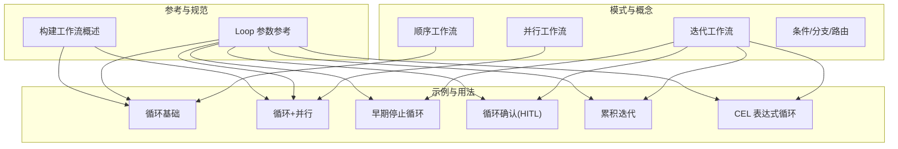
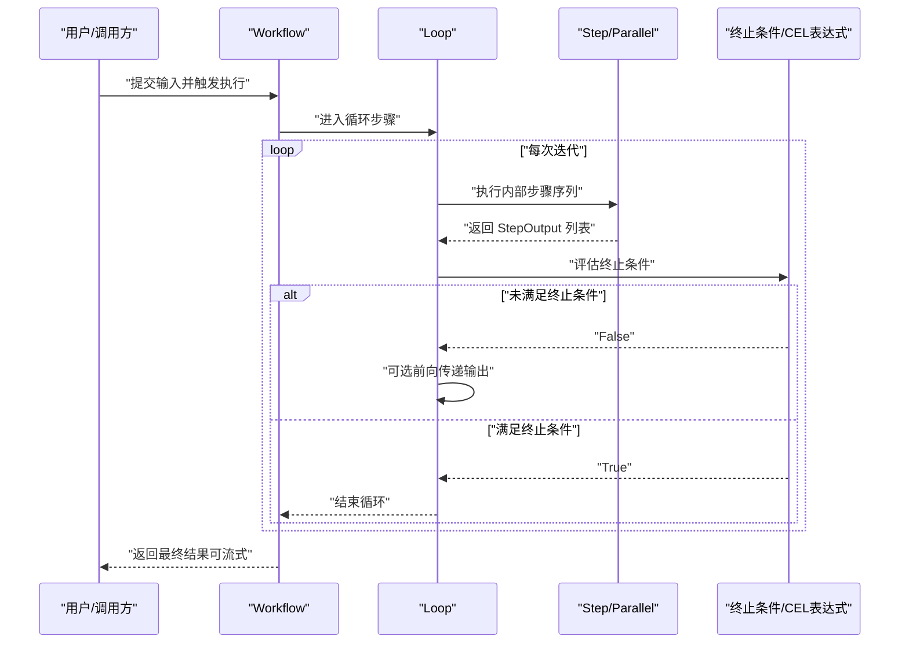
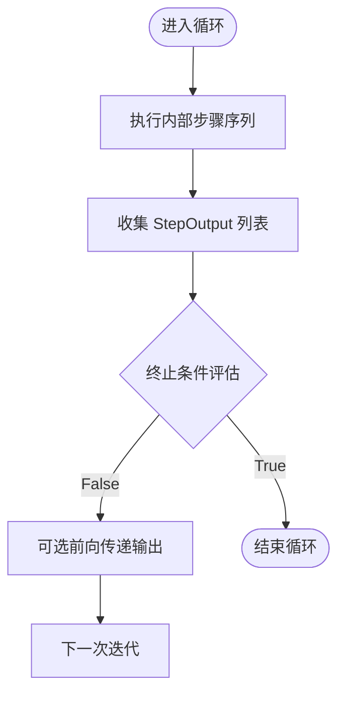
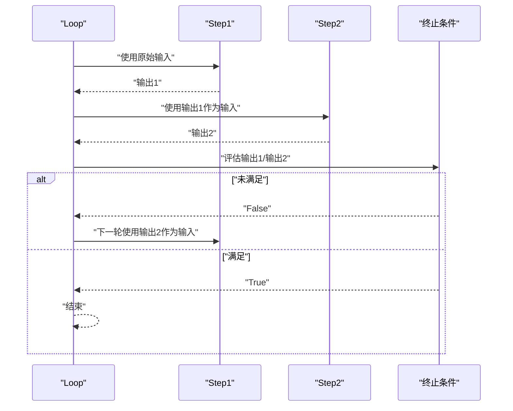
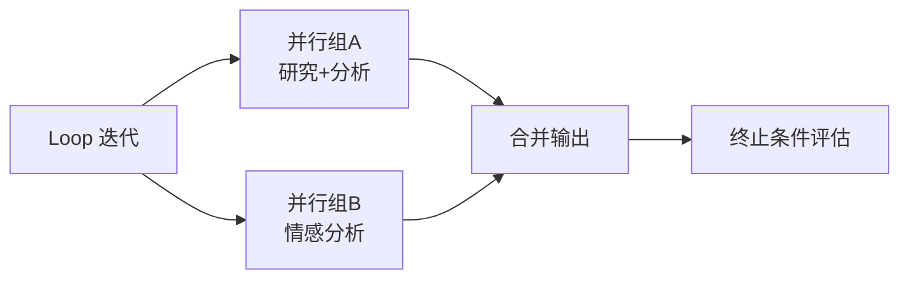
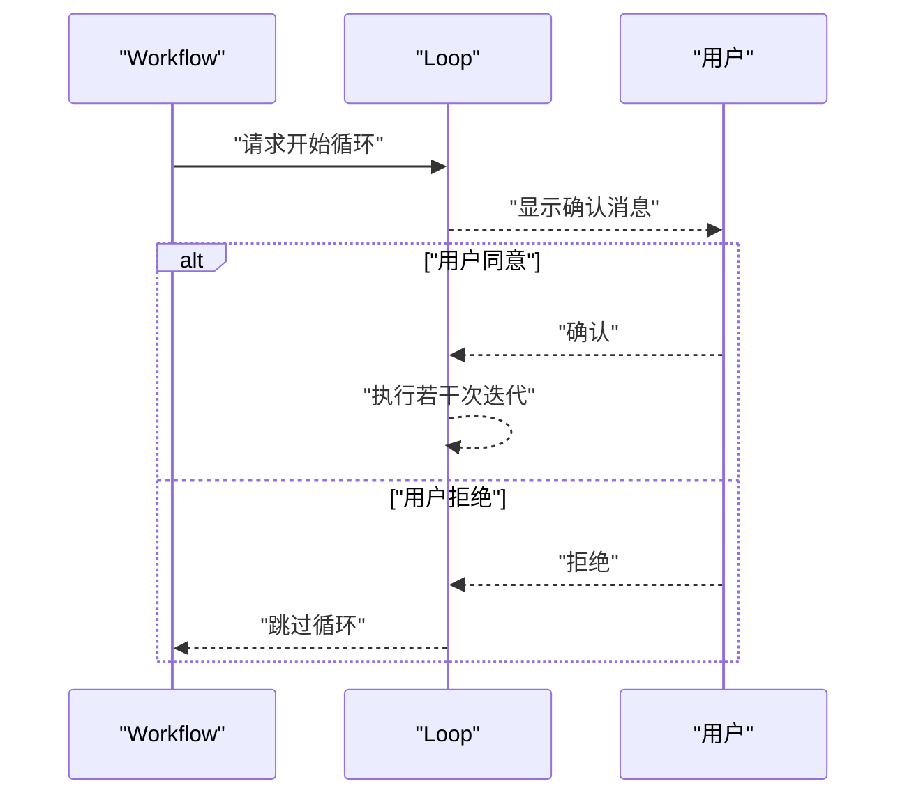
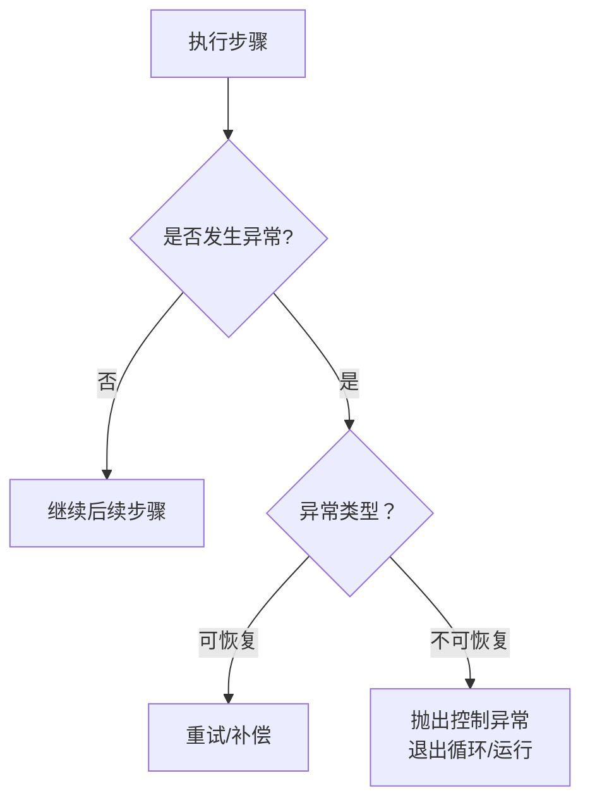
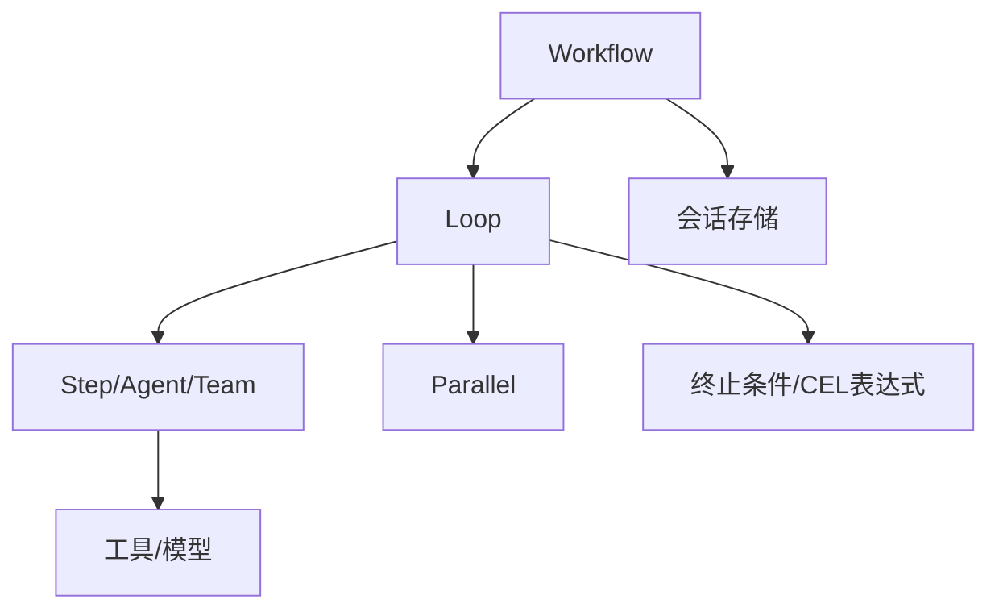

# 迭代循环工作流

<cite>
**本文引用的文件**
- [迭代工作流（示例）](file://workflows/workflow-patterns/iterative-workflow.mdx)
- [循环步骤工作流（示例）](file://workflows/usage/loop-steps-workflow.mdx)
- [循环基础（示例）](file://examples/workflows/loop-execution/loop-basic.mdx)
- [循环与并行组合（示例）](file://workflows/usage/loop-with-parallel-steps-stream.mdx)
- [循环与并行（示例）](file://examples/workflows/loop-execution/loop-with-parallel.mdx)
- [早期停止循环（示例）](file://examples/workflows/advanced-concepts/early-stopping/early-stop-loop.mdx)
- [循环确认（人机交互）](file://workflows/hitl/loop.mdx)
- [循环参数参考](file://reference/workflows/loop-steps.mdx)
- [构建工作流（概述）](file://workflows/building-workflows.mdx)
- [工作流模式总览](file://workflows/workflow-patterns/overview.mdx)
- [顺序工作流模式](file://workflows/workflow-patterns/sequential.mdx)
- [并行工作流模式](file://workflows/workflow-patterns/parallel-workflow.mdx)
- [循环累积迭代（示例）](file://workflows/usage/loop-iterative-accumulation.mdx)
- [CEL 表达式：复合退出条件](file://examples/workflows/cel-expressions/loop/cel-compound-exit.mdx)
- [CEL 表达式：检查步骤输出](file://examples/workflows/cel-expressions/loop/cel-step-outputs-check.mdx)
- [CEL 表达式：迭代次数限制](file://examples/workflows/cel-expressions/loop/cel-iteration-limit.mdx)
- [工具异常与重试（概述）](file://examples/tools/exceptions/overview.mdx)
- [工具异常与重试（详细）](file://tools/exceptions.mdx)
- [AgentOS 工作流（含循环）](file://examples/agent-os/workflow/workflow-with-loop.mdx)
</cite>

## 目录
1. [简介](#简介)
2. [项目结构](#项目结构)
3. [核心组件](#核心组件)
4. [架构总览](#架构总览)
5. [详细组件分析](#详细组件分析)
6. [依赖关系分析](#依赖关系分析)
7. [性能考量](#性能考量)
8. [故障排查指南](#故障排查指南)
9. [结论](#结论)
10. [附录](#附录)

## 简介
本文件系统性阐述“迭代循环工作流”的设计原理与实现机制，覆盖循环条件设置、迭代状态管理、终止条件控制、并发与流式执行、人机交互确认、异常与超时控制、性能与资源优化，以及可复用的设计模式与实践案例。目标是帮助读者在生产环境中构建稳定、可控、可观测且高效的迭代自动化流程。

## 项目结构
围绕“迭代循环工作流”，本仓库提供了从概念到示例、从参考到高级模式的完整资料体系：
- 概念与模式：顺序、并行、条件、迭代、分支、函数化、多模式组合
- 示例与用法：循环基础、循环与并行、早期停止、循环确认、累积迭代、CEL 表达式
- 参考与规范：Loop 步骤参数、类型接口、运行时行为
- 高级主题：异常与重试、AgentOS 集成、性能评估

**图表来源**
- [工作流模式总览:1-92](file://workflows/workflow-patterns/overview.mdx#L1-L92)
- [顺序工作流模式:1-50](file://workflows/workflow-patterns/sequential.mdx#L1-L50)
- [并行工作流模式:1-54](file://workflows/workflow-patterns/parallel-workflow.mdx#L1-L54)
- [循环基础（示例）:1-144](file://examples/workflows/loop-execution/loop-basic.mdx#L1-L144)
- [循环与并行组合（示例）:1-136](file://workflows/usage/loop-with-parallel-steps-stream.mdx#L1-L136)
- [早期停止循环（示例）:1-143](file://examples/workflows/advanced-concepts/early-stopping/early-stop-loop.mdx#L1-L143)
- [循环确认（人机交互）:1-85](file://workflows/hitl/loop.mdx#L1-L85)
- [循环累积迭代（示例）:1-49](file://workflows/usage/loop-iterative-accumulation.mdx#L1-L49)
- [循环参数参考:1-16](file://reference/workflows/loop-steps.mdx#L1-L16)

**章节来源**
- [工作流模式总览:1-92](file://workflows/workflow-patterns/overview.mdx#L1-L92)
- [构建工作流（概述）:1-16](file://workflows/building-workflows.mdx#L1-L16)

## 核心组件
- Loop 步骤：定义每次迭代要执行的子步骤序列、最大迭代次数、终止条件、是否向前传递上一次输出、是否需要用户确认等。
- Step 步骤：最小执行单元，可绑定 Agent、Team 或自定义函数。
- Parallel 并行：在单次迭代内并发执行多个独立任务，提升吞吐与效率。
- Condition/Router：在循环内外进行条件判断与动态路由。
- 类型与接口：StepInput/StepOutput 提供标准化的数据流契约；RunContext 提供会话状态访问能力。
- 异常与重试：通过异常机制控制模型调用循环与整体运行的退出，避免无效或危险的重复执行。

**章节来源**
- [循环参数参考:1-16](file://reference/workflows/loop-steps.mdx#L1-L16)
- [构建工作流（概述）:1-16](file://workflows/building-workflows.mdx#L1-L16)
- [工具异常与重试（概述）:1-13](file://examples/tools/exceptions/overview.mdx#L1-L13)
- [工具异常与重试（详细）:1-20](file://tools/exceptions.mdx#L1-L20)

## 架构总览
下图展示了“循环工作流”的典型执行路径：外部输入进入 Workflow，逐层进入 Loop；Loop 在每次迭代中按序执行内部 Step/Parallel，并根据终止条件决定是否继续；支持前向输出传递、并行加速、人机确认、早期停止与流式输出。

**图表来源**
- [循环基础（示例）:65-78](file://examples/workflows/loop-execution/loop-basic.mdx#L65-L78)
- [循环与并行组合（示例）:80-103](file://workflows/usage/loop-with-parallel-steps-stream.mdx#L80-L103)
- [循环参数参考:6-16](file://reference/workflows/loop-steps.mdx#L6-L16)

## 详细组件分析

### 组件一：循环条件与终止控制
- 函数式终止条件：以“上一轮输出列表”为输入，返回布尔值决定是否继续。适合内容长度、关键词匹配、质量阈值等判定。
- CEL 表达式终止条件：支持基于当前迭代数、步骤输出内容等的表达式，便于声明式配置与快速迭代。
- 早停机制：在循环内部插入“安全检查”步骤，当检测到敏感内容或异常信号时，直接设置停止标志提前结束整个循环。

**图表来源**
- [早期停止循环（示例）:43-56](file://examples/workflows/advanced-concepts/early-stopping/early-stop-loop.mdx#L43-L56)
- [CEL 表达式：检查步骤输出:56-57](file://examples/workflows/cel-expressions/loop/cel-step-outputs-check.mdx#L56-L57)
- [CEL 表达式：复合退出条件:53-54](file://examples/workflows/cel-expressions/loop/cel-compound-exit.mdx#L53-L54)

**章节来源**
- [循环基础（示例）:65-78](file://examples/workflows/loop-execution/loop-basic.mdx#L65-L78)
- [早期停止循环（示例）:43-56](file://examples/workflows/advanced-concepts/early-stopping/early-stop-loop.mdx#L43-L56)
- [CEL 表达式：检查步骤输出:56-57](file://examples/workflows/cel-expressions/loop/cel-step-outputs-check.mdx#L56-L57)
- [CEL 表达式：复合退出条件:53-54](file://examples/workflows/cel-expressions/loop/cel-compound-exit.mdx#L53-L54)

### 组件二：迭代状态管理与输出转发
- 前向输出传递：默认开启，使每次迭代接收上一次迭代的输出作为输入，形成“累积式迭代”。
- 关闭前向传递：所有迭代均使用原始输入，适用于独立重复处理。
- 累积迭代示例：通过读取上一步内容并进行变换，直到达到阈值停止。

**图表来源**
- [循环累积迭代（示例）:15-21](file://workflows/usage/loop-iterative-accumulation.mdx#L15-L21)
- [迭代工作流（示例）:26-48](file://workflows/workflow-patterns/iterative-workflow.mdx#L26-L48)

**章节来源**
- [循环累积迭代（示例）:1-49](file://workflows/usage/loop-iterative-accumulation.mdx#L1-L49)
- [迭代工作流（示例）:1-57](file://workflows/workflow-patterns/iterative-workflow.mdx#L1-L57)

### 组件三：并发与流式执行
- 循环内并行：在单次迭代中并发执行多个独立任务，显著缩短迭代周期，适合多源研究、多维分析等场景。
- 流式输出：支持同步/异步、阻塞/非阻塞的流式输出，便于实时反馈与长任务进度展示。

**图表来源**
- [循环与并行组合（示例）:110-127](file://workflows/usage/loop-with-parallel-steps-stream.mdx#L110-L127)

**章节来源**
- [循环与并行组合（示例）:1-136](file://workflows/usage/loop-with-parallel-steps-stream.mdx#L1-L136)
- [循环与并行（示例）:1-166](file://examples/workflows/loop-execution/loop-with-parallel.mdx#L1-L166)

### 组件四：人机交互与确认（HITL）
- 启用确认：在循环首次执行前暂停，等待用户确认是否开始；拒绝则跳过整个循环。
- 行为说明：仅在循环开始前确认一次，单次循环内部不再单独确认。

**图表来源**
- [循环确认（人机交互）:16-58](file://workflows/hitl/loop.mdx#L16-L58)

**章节来源**
- [循环确认（人机交互）:1-85](file://workflows/hitl/loop.mdx#L1-L85)

### 组件五：异常处理与超时控制
- 异常与重试：在工具或模型调用中抛出特定异常以控制“工具调用循环”或“整体运行循环”，避免无效或危险的重复执行。
- 超时控制：客户端/服务端可配置超时，结合错误处理策略，确保系统稳定性与可用性。

**图表来源**
- [工具异常与重试（详细）:1-20](file://tools/exceptions.mdx#L1-L20)

**章节来源**
- [工具异常与重试（概述）:1-13](file://examples/tools/exceptions/overview.mdx#L1-L13)
- [工具异常与重试（详细）:1-20](file://tools/exceptions.mdx#L1-L20)

### 组件六：CEL 表达式与复杂终止逻辑
- 支持基于当前迭代数、步骤输出内容、聚合状态等的表达式，实现“复合退出条件”“迭代次数限制”等灵活控制。
- 典型用法：当满足“全部成功且达到最小迭代次数”或“检测到特定关键词”时停止。

**章节来源**
- [CEL 表达式：复合退出条件:47-72](file://examples/workflows/cel-expressions/loop/cel-compound-exit.mdx#L47-L72)
- [CEL 表达式：检查步骤输出:47-76](file://examples/workflows/cel-expressions/loop/cel-step-outputs-check.mdx#L47-L76)
- [CEL 表达式：迭代次数限制:37-65](file://examples/workflows/cel-expressions/loop/cel-iteration-limit.mdx#L37-L65)

### 组件七：与 AgentOS 的集成
- 在 AgentOS 中注册包含循环的工作流，通过服务端入口对外提供能力，支持数据库会话存储与持久化。

**章节来源**
- [AgentOS 工作流（含循环）:91-123](file://examples/agent-os/workflow/workflow-with-loop.mdx#L91-L123)

## 依赖关系分析
- 组件耦合：Loop 对 Step/Parallel 的依赖是“组合式”而非继承式，便于灵活编排；终止条件与 CEL 表达式解耦于具体步骤。
- 外部依赖：Agent/Team 工具链、数据库（会话存储）、网络（远程工具/服务）。
- 可能的循环依赖：在“前向输出传递 + 复杂终止条件”场景下需谨慎设计，避免“输出越变越差导致无法收敛”。

**图表来源**
- [构建工作流（概述）:9-16](file://workflows/building-workflows.mdx#L9-L16)
- [循环参数参考:6-16](file://reference/workflows/loop-steps.mdx#L6-L16)

**章节来源**
- [构建工作流（概述）:1-16](file://workflows/building-workflows.mdx#L1-L16)
- [循环参数参考:1-16](file://reference/workflows/loop-steps.mdx#L1-L16)

## 性能考量
- 计算开销
  - 循环次数与终止条件评估频率正相关；建议将评估逻辑轻量化，必要时缓存中间结果。
  - 并行执行可显著降低端到端延迟，但需注意资源竞争与会话状态一致性。
- 内存管理
  - 长循环可能累积大量中间输出；建议在循环内对历史输出做截断或汇总，避免内存膨胀。
  - 使用“前向输出传递”时，应明确每轮输出大小上限，防止指数级增长。
- I/O 与网络
  - 外部工具/模型调用应设置合理超时与重试策略；对高延迟服务采用并行化与分批处理。
- 观测与诊断
  - 结合事件存储与流式输出，记录关键指标（迭代次数、耗时、输出长度、错误率），用于性能回归与容量规划。

[本节为通用指导，不直接分析具体文件]

## 故障排查指南
- 循环不收敛
  - 检查终止条件是否过于宽松或过于严格；必要时引入“最小迭代次数”与“最大迭代次数”双重保护。
  - 若使用 CEL 表达式，核对变量名与上下文可用字段。
- 输出未前向传递
  - 确认是否显式关闭了“前向输出传递”；如需累积迭代，请保持默认开启。
- 并行死锁或竞态
  - 并行步骤更新共享会话状态时，需加锁或采用幂等写入策略；避免无界并发。
- 人机交互未生效
  - 确认已启用确认参数并在循环开始前触发；注意仅首次迭代前确认一次。
- 异常导致无限重试
  - 明确区分可恢复异常与不可恢复异常；对可恢复异常设置最大重试次数与退避策略。
- 超时与连接失败
  - 客户端侧设置合理超时与重试；服务端侧监控资源占用与队列长度。

**章节来源**
- [循环确认（人机交互）:61-85](file://workflows/hitl/loop.mdx#L61-L85)
- [工具异常与重试（概述）:1-13](file://examples/tools/exceptions/overview.mdx#L1-L13)
- [工具异常与重试（详细）:1-20](file://tools/exceptions.mdx#L1-L20)

## 结论
迭代循环工作流通过“可配置的终止条件 + 可选的前向输出传递 + 并行加速 + 人机确认 + 异常与超时控制”，实现了高质量、可预测、可扩展的自动化流程。结合本仓库提供的示例与参考，可在研发、知识检索、内容生成、合规审查等场景中快速落地。

[本节为总结性内容，不直接分析具体文件]

## 附录
- 设计模式速览
  - 顺序：线性依赖，清晰可追踪
  - 并行：独立任务并发，提升吞吐
  - 条件/分支/路由：动态选择路径
  - 迭代：反复优化，直至达标
  - 多模式组合：复杂业务的模块化拼装
- 实践清单
  - 明确终止条件与边界（最小/最大迭代、质量阈值、安全检查）
  - 控制输出规模，避免指数增长
  - 并行化优先考虑无状态或幂等步骤
  - 为关键路径增加人机确认与审计日志
  - 为外部依赖配置超时、重试与熔断
  - 使用流式输出与事件存储，增强可观测性

**章节来源**
- [工作流模式总览:1-92](file://workflows/workflow-patterns/overview.mdx#L1-L92)
- [顺序工作流模式:1-50](file://workflows/workflow-patterns/sequential.mdx#L1-L50)
- [并行工作流模式:1-54](file://workflows/workflow-patterns/parallel-workflow.mdx#L1-L54)