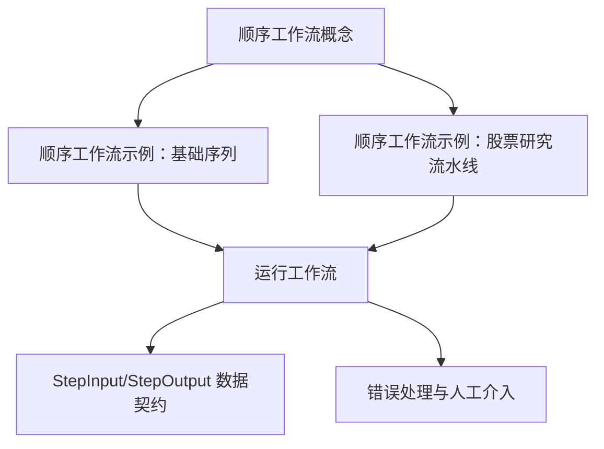
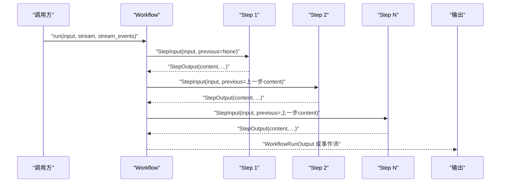
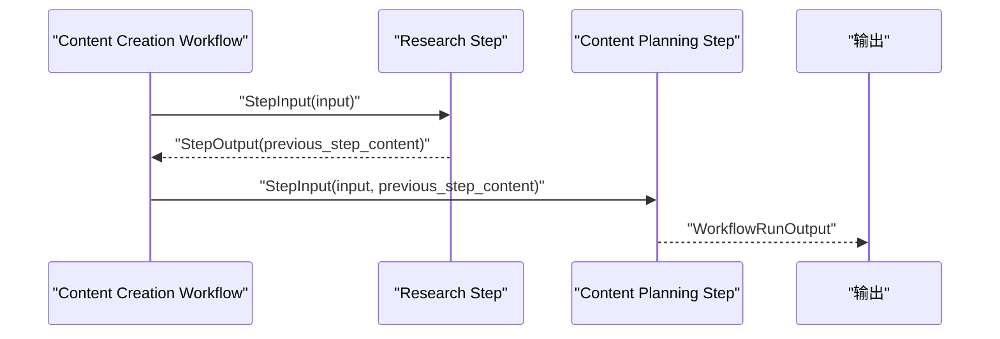
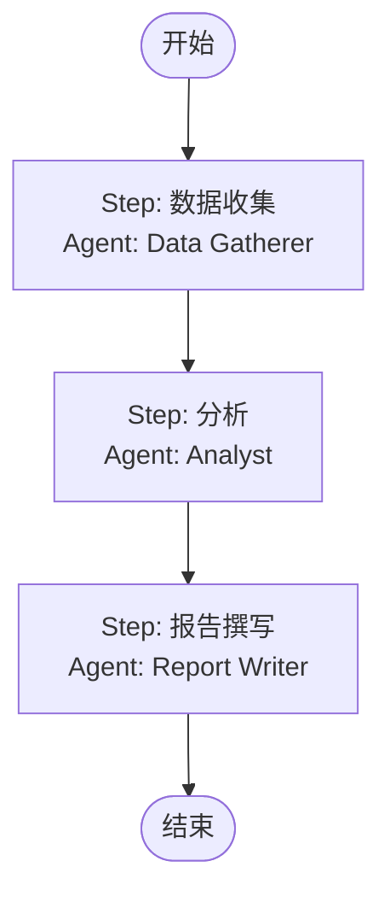
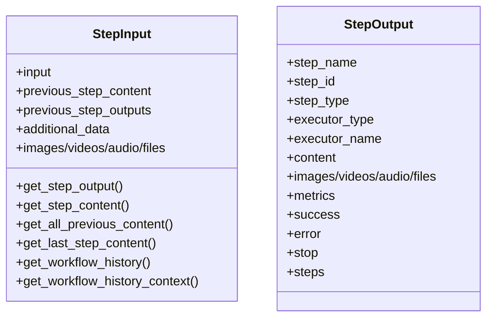
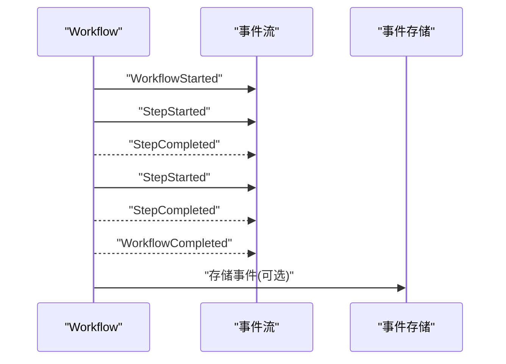
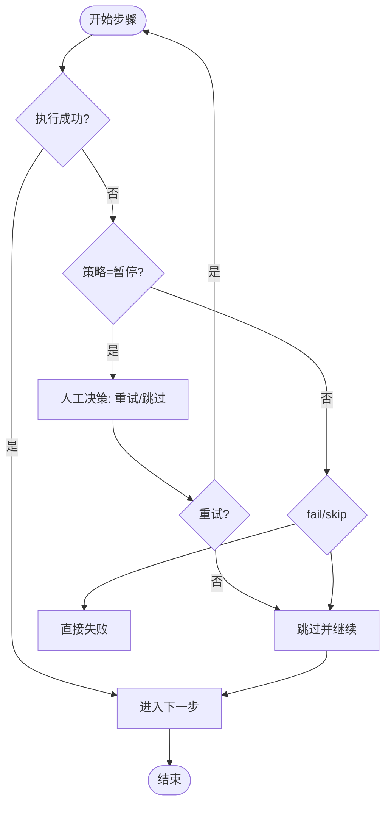
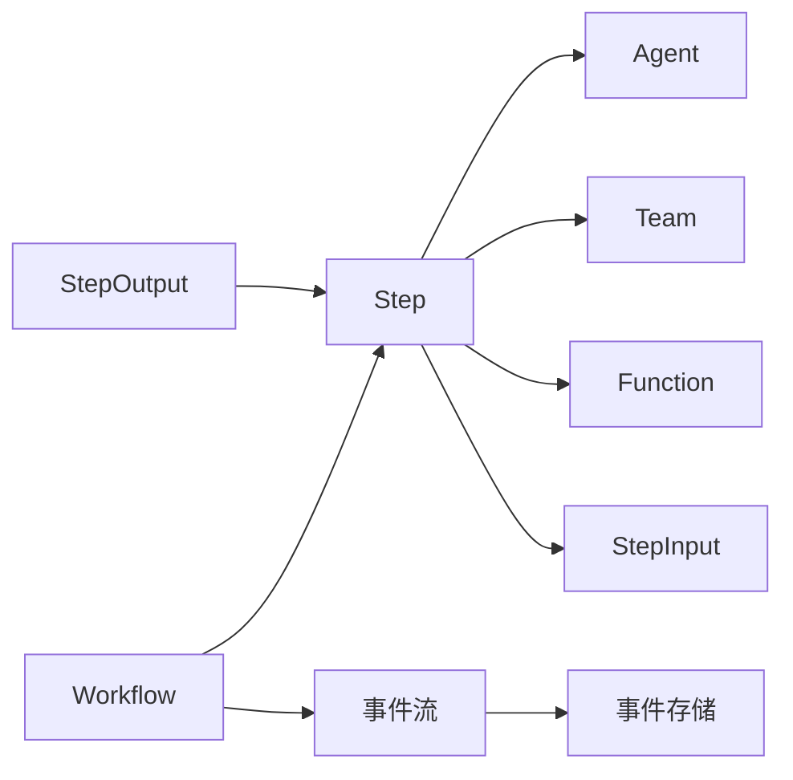

# 顺序执行工作流

<cite>
**本文引用的文件**
- [顺序工作流（概念）](file://workflows/workflow-patterns/sequential.mdx)
- [顺序工作流示例：基础序列](file://examples/workflows/basic-workflows/sequence-of-steps/sequence-of-steps.mdx)
- [顺序工作流示例：股票研究流水线](file://examples/basics/sequential-workflow.mdx)
- [运行工作流](file://workflows/running-workflows.mdx)
- [构建工作流](file://workflows/building-workflows.mdx)
- [StepInput 结构说明](file://reference/workflows/step_input.mdx)
- [StepOutput 结构说明](file://reference/workflows/step_output.mdx)
- [工作流错误处理与人工介入](file://workflows/hitl/error-handling.mdx)
- [工作流概览与使用场景](file://workflows/overview.mdx)
</cite>

## 目录
1. [引言](#引言)
2. [项目结构](#项目结构)
3. [核心组件](#核心组件)
4. [架构总览](#架构总览)
5. [详细组件分析](#详细组件分析)
6. [依赖关系分析](#依赖关系分析)
7. [性能考虑](#性能考虑)
8. [故障排除指南](#故障排除指南)
9. [结论](#结论)
10. [附录](#附录)

## 引言
本技术文档聚焦“顺序执行工作流”，系统阐述其设计原理、实现机制与工程实践。顺序执行模式以线性步骤为核心，强调确定性的执行顺序、清晰的状态传递与稳健的错误处理。文档通过多层级示例，从简单到复杂，帮助读者掌握如何构建可维护、可观测、可扩展的顺序工作流，并给出最佳实践与排障建议。

## 项目结构
围绕顺序执行工作流的关键资料分布在以下位置：
- 概念与模式：顺序工作流的概念与混合执行（函数/团队/代理）示例
- 示例工程：基础序列与股票研究流水线两个典型顺序工作流
- 运行与事件：同步/异步运行、事件流、事件存储与遥测配置
- 构建与接口：StepInput/StepOutput 的数据契约与自定义函数接入
- 错误处理：自动暂停、重试、跳过与人工介入流程

**图表来源**
- [顺序工作流（概念）:1-50](file://workflows/workflow-patterns/sequential.mdx#L1-L50)
- [顺序工作流示例：基础序列:1-226](file://examples/workflows/basic-workflows/sequence-of-steps/sequence-of-steps.mdx#L1-L226)
- [顺序工作流示例：股票研究流水线:1-193](file://examples/basics/sequential-workflow.mdx#L1-L193)
- [运行工作流:1-619](file://workflows/running-workflows.mdx#L1-L619)
- [StepInput 结构说明:1-29](file://reference/workflows/step_input.mdx#L1-L29)
- [StepOutput 结构说明:1-25](file://reference/workflows/step_output.mdx#L1-L25)
- [工作流错误处理与人工介入:1-183](file://workflows/hitl/error-handling.mdx#L1-L183)

**章节来源**
- [顺序工作流（概念）:1-50](file://workflows/workflow-patterns/sequential.mdx#L1-L50)
- [顺序工作流示例：基础序列:1-226](file://examples/workflows/basic-workflows/sequence-of-steps/sequence-of-steps.mdx#L1-L226)
- [顺序工作流示例：股票研究流水线:1-193](file://examples/basics/sequential-workflow.mdx#L1-L193)
- [运行工作流:1-619](file://workflows/running-workflows.mdx#L1-L619)
- [构建工作流:1-59](file://workflows/building-workflows.mdx#L1-L59)
- [StepInput 结构说明:1-29](file://reference/workflows/step_input.mdx#L1-L29)
- [StepOutput 结构说明:1-25](file://reference/workflows/step_output.mdx#L1-L25)
- [工作流错误处理与人工介入:1-183](file://workflows/hitl/error-handling.mdx#L1-L183)
- [工作流概览与使用场景:46-102](file://workflows/overview.mdx#L46-L102)

## 核心组件
- 工作流（Workflow）
  - 负责编排步骤序列，管理执行上下文、事件流与会话存储。
- 步骤（Step）
  - 最小执行单元，封装一个执行器（Agent/Team/自定义函数），确保职责单一、边界清晰。
- 执行器（Agent/Team/Function）
  - Agent：单智能体专用工具与指令；Team：协作式多智能体；Function：自定义逻辑适配 StepInput/StepOutput。
- 数据契约（StepInput/StepOutput）
  - 统一输入输出格式，支持内容、媒体、附加数据、指标与嵌套输出等。
- 事件系统（WorkflowRunOutputEvent）
  - 提供核心事件（开始/完成/错误）、步骤事件（开始/完成/错误）、条件/循环/并行/路由等复合事件，支持事件流与事件存储。

**章节来源**
- [构建工作流:9-33](file://workflows/building-workflows.mdx#L9-L33)
- [StepInput 结构说明:6-27](file://reference/workflows/step_input.mdx#L6-L27)
- [StepOutput 结构说明:6-24](file://reference/workflows/step_output.mdx#L6-L24)
- [运行工作流:462-526](file://workflows/running-workflows.mdx#L462-L526)

## 架构总览
顺序执行工作流的核心控制流如下：输入经由 StepInput 进入第一个 Step，执行器产出 StepOutput 并作为下一个 Step 的输入，直至最后一个 Step 完成，最终汇总为 WorkflowRunOutput 或事件流。

**图表来源**
- [顺序工作流示例：基础序列:122-145](file://examples/workflows/basic-workflows/sequence-of-steps/sequence-of-steps.mdx#L122-L145)
- [运行工作流:199-364](file://workflows/running-workflows.mdx#L199-L364)
- [StepInput 结构说明:6-27](file://reference/workflows/step_input.mdx#L6-L27)
- [StepOutput 结构说明:6-24](file://reference/workflows/step_output.mdx#L6-L24)

## 详细组件分析

### 组件A：顺序工作流（基础序列）
- 场景描述：从研究到内容规划的基础序列，演示同步、异步、流式与事件流式运行模式。
- 关键点
  - 使用 Team 与 Agent 组合完成研究任务。
  - 自定义函数作为 Step，基于 StepInput 动态准备下游输入。
  - 支持同步打印、异步打印、事件流与事件过滤。
- 典型路径
  - [示例入口与步骤定义:28-145](file://examples/workflows/basic-workflows/sequence-of-steps/sequence-of-steps.mdx#L28-L145)
  - [运行与事件流示例:148-212](file://examples/workflows/basic-workflows/sequence-of-steps/sequence-of-steps.mdx#L148-L212)

**图表来源**
- [顺序工作流示例：基础序列:122-145](file://examples/workflows/basic-workflows/sequence-of-steps/sequence-of-steps.mdx#L122-L145)

**章节来源**
- [顺序工作流示例：基础序列:1-226](file://examples/workflows/basic-workflows/sequence-of-steps/sequence-of-steps.mdx#L1-L226)

### 组件B：顺序工作流（股票研究流水线）
- 场景描述：三步法研究流水线：数据收集 → 分析 → 报告撰写，每步由专门 Agent 负责。
- 关键点
  - 明确的步骤顺序与职责分离。
  - 使用数据库持久化会话与历史记录，便于审计与复现。
  - 支持 Markdown 输出与流式打印。
- 典型路径
  - [Agent 与 Step 定义:43-129](file://examples/basics/sequential-workflow.mdx#L43-L129)
  - [工作流编排与运行:134-151](file://examples/basics/sequential-workflow.mdx#L134-L151)

**图表来源**
- [顺序工作流示例：股票研究流水线:134-151](file://examples/basics/sequential-workflow.mdx#L134-L151)

**章节来源**
- [顺序工作流示例：股票研究流水线:1-193](file://examples/basics/sequential-workflow.mdx#L1-L193)

### 组件C：StepInput 与 StepOutput 数据契约
- StepInput
  - 字段：input、previous_step_content、previous_step_outputs、additional_data、媒体输入等。
  - 方法：按步骤名获取输出、拼接历史内容、获取最近内容等。
- StepOutput
  - 字段：step_name、step_id、step_type、executor 类型与名称、content、媒体输出、metrics、success/error/stop/steps 等。
- 作用
  - 规范化跨步骤的数据传递，支持自定义函数无缝接入。
- 典型路径
  - [StepInput 字段与方法:6-27](file://reference/workflows/step_input.mdx#L6-L27)
  - [StepOutput 字段与语义:6-24](file://reference/workflows/step_output.mdx#L6-L24)

**图表来源**
- [StepInput 结构说明:6-27](file://reference/workflows/step_input.mdx#L6-L27)
- [StepOutput 结构说明:6-24](file://reference/workflows/step_output.mdx#L6-L24)

**章节来源**
- [StepInput 结构说明:1-29](file://reference/workflows/step_input.mdx#L1-L29)
- [StepOutput 结构说明:1-25](file://reference/workflows/step_output.mdx#L1-L25)

### 组件D：运行与事件系统
- 同步/异步运行
  - run()/arun() 返回 WorkflowRunOutput 或事件迭代器。
- 流式输出
  - stream=True 时返回事件流；stream_events=True 可获得更细粒度事件。
- 事件类型
  - 核心事件：WorkflowStarted/Completed/Error
  - 步骤事件：StepStarted/Completed/Error
  - 复合事件：Condition/Loop/Parallel/Router 执行事件
- 事件存储与过滤
  - store_events 控制是否存储；events_to_skip 可过滤噪声事件。
- 典型路径
  - [运行与事件流示例:199-364](file://workflows/running-workflows.mdx#L199-L364)
  - [事件类型与过滤配置:462-594](file://workflows/running-workflows.mdx#L462-L594)

**图表来源**
- [运行工作流:462-526](file://workflows/running-workflows.mdx#L462-L526)
- [运行工作流:527-594](file://workflows/running-workflows.mdx#L527-L594)

**章节来源**
- [运行工作流:1-619](file://workflows/running-workflows.mdx#L1-L619)

### 组件E：错误处理与人工介入（HITL）
- 错误策略
  - fail：立即失败；skip：跳过并继续；pause：暂停等待人工决策（重试或跳过）。
- ErrorRequirement
  - 属性：step_name、error_message、error_type、retry_count。
  - 方法：retry()/skip()。
- 实践建议
  - 针对超时、限流、无效输入、资源不可用等场景制定差异化策略。
- 典型路径
  - [错误处理与人工介入:42-183](file://workflows/hitl/error-handling.mdx#L42-L183)

**图表来源**
- [工作流错误处理与人工介入:61-86](file://workflows/hitl/error-handling.mdx#L61-L86)

**章节来源**
- [工作流错误处理与人工介入:1-183](file://workflows/hitl/error-handling.mdx#L1-L183)

## 依赖关系分析
- 组件耦合
  - Workflow 与 Step 强耦合（顺序编排），Step 与执行器弱耦合（Agent/Team/Function 可替换）。
  - StepInput/StepOutput 作为跨步骤契约，降低数据层耦合。
- 外部依赖
  - 数据库（会话与事件存储）、模型服务（推理）、工具集（搜索/财务等）。
- 事件与存储
  - 事件流与事件存储相互独立，可通过 store_events 与 events_to_skip 精准控制。

**图表来源**
- [构建工作流:9-33](file://workflows/building-workflows.mdx#L9-L33)
- [运行工作流:527-594](file://workflows/running-workflows.mdx#L527-L594)

**章节来源**
- [构建工作流:1-59](file://workflows/building-workflows.mdx#L1-L59)
- [运行工作流:527-594](file://workflows/running-workflows.mdx#L527-L594)

## 性能考虑
- 事件噪声与存储开销
  - 使用 events_to_skip 过滤高频事件（如 step_started），仅保留关键事件，降低存储与网络传输成本。
- 流式与事件流
  - 在长流程中启用 stream_events 可获得实时反馈，但需权衡事件数量；必要时关闭 executor 事件以减少噪音。
- 模型与工具调用
  - 将昂贵操作（如大模型推理、外部 API）置于必要步骤，避免重复计算；利用缓存与会话历史减少冗余。
- 会话与历史
  - 历史记录有助于审计与复现，但应限制保存轮次（num_history_runs）以控制开销。

[本节为通用指导，不直接分析具体文件]

## 故障排除指南
- 常见问题与对策
  - 网络超时：重试有限次数后跳过；或增加延迟后重试。
  - 速率限制：等待冷却时间后重试。
  - 输入无效：直接跳过（重试无意义）。
  - 资源不可用：根据关键性决定重试或跳过。
- 事件与日志
  - 开启 store_events 并结合 events_to_skip，定位失败前后的事件序列。
  - 使用 stream_events 观察实时状态，快速判断卡顿阶段。
- 人工介入（HITL）
  - 当 on_error=OnError.pause 时，通过 ErrorRequirement 的 retry()/skip() 控制后续流程。

**章节来源**
- [运行工作流:462-594](file://workflows/running-workflows.mdx#L462-L594)
- [工作流错误处理与人工介入:154-183](file://workflows/hitl/error-handling.mdx#L154-L183)

## 结论
顺序执行工作流通过“确定性步骤 + 清晰数据契约 + 事件可观测 + 可配置错误策略”实现了高可靠、易维护的自动化流程。在需要明确顺序、稳定输出与审计追踪的场景中尤为适用。配合事件流与事件存储，可实现端到端的可观测性与可追溯性。

[本节为总结性内容，不直接分析具体文件]

## 附录

### A. 何时选择顺序执行工作流
- 需要可预测、可重复的执行顺序
- 步骤职责清晰且存在天然先后依赖
- 需要审计与合规记录
- 输出从上一步稳定流入下一步

**章节来源**
- [工作流概览与使用场景:49-56](file://workflows/overview.mdx#L49-L56)

### B. 步骤设计原则与输入输出规范
- 步骤设计原则
  - 单一职责：每个 Step 专注于一个明确任务。
  - 可组合：通过 StepInput/StepOutput 与其他 Step 解耦。
  - 可测试：自定义函数应具备稳定的输入输出契约。
- 输入输出规范
  - 使用 StepInput 接收 input、previous_step_content、媒体与附加数据。
  - 使用 StepOutput 返回 content、媒体、metrics、success/error/stop/steps 等。

**章节来源**
- [构建工作流:18-33](file://workflows/building-workflows.mdx#L18-L33)
- [StepInput 结构说明:6-27](file://reference/workflows/step_input.mdx#L6-L27)
- [StepOutput 结构说明:6-24](file://reference/workflows/step_output.mdx#L6-L24)

### C. 从简单到复杂的顺序工作流示例路径
- 基础序列（含自定义函数与 Team/Agent 组合）
  - [示例路径:1-226](file://examples/workflows/basic-workflows/sequence-of-steps/sequence-of-steps.mdx#L1-L226)
- 股票研究流水线（三步法）
  - [示例路径:1-193](file://examples/basics/sequential-workflow.mdx#L1-L193)
- 混合执行（函数/团队/代理）
  - [示例路径:12-32](file://workflows/workflow-patterns/sequential.mdx#L12-L32)

**章节来源**
- [顺序工作流示例：基础序列:1-226](file://examples/workflows/basic-workflows/sequence-of-steps/sequence-of-steps.mdx#L1-L226)
- [顺序工作流示例：股票研究流水线:1-193](file://examples/basics/sequential-workflow.mdx#L1-L193)
- [顺序工作流（概念）:12-32](file://workflows/workflow-patterns/sequential.mdx#L12-L32)