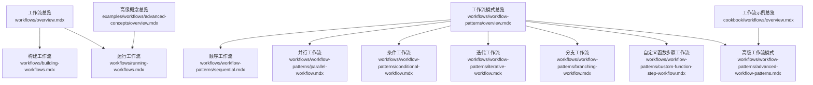
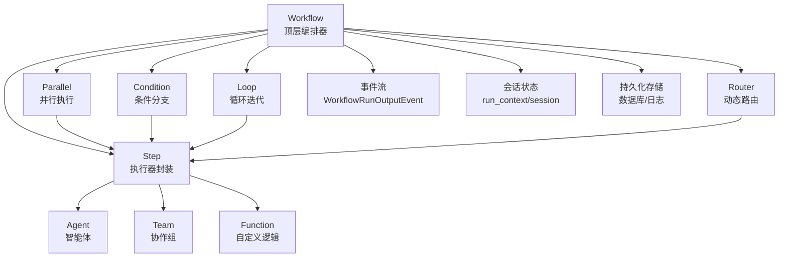
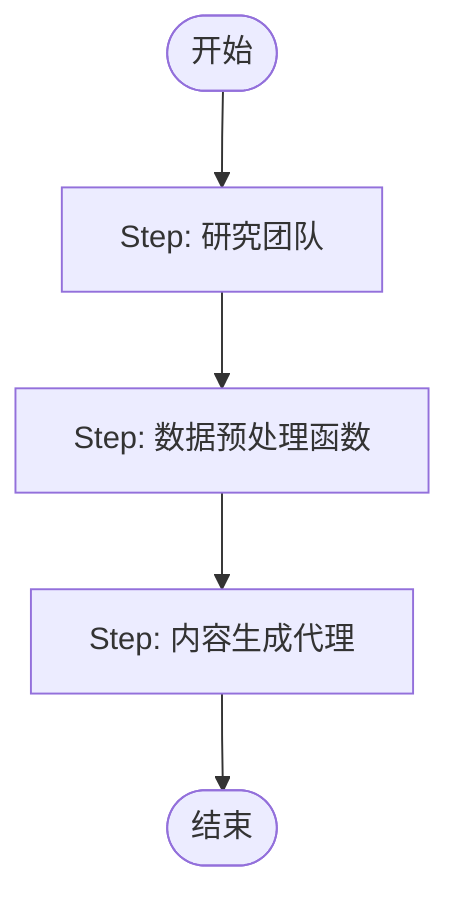
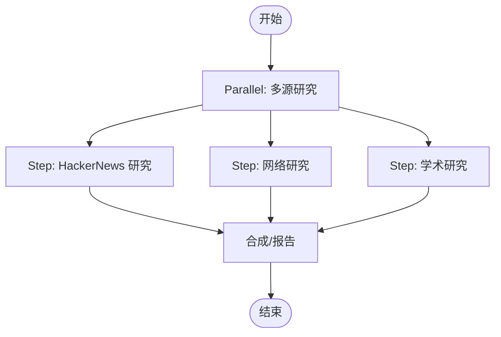
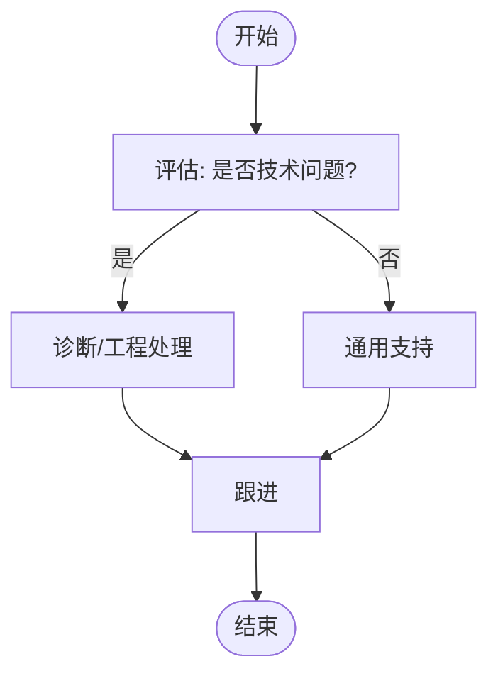
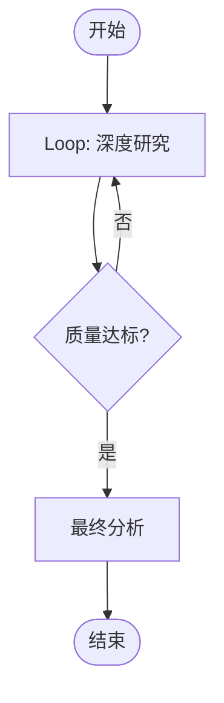
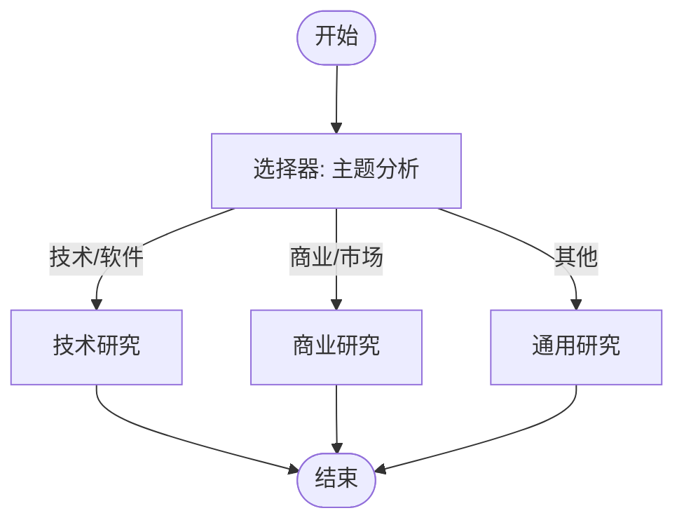
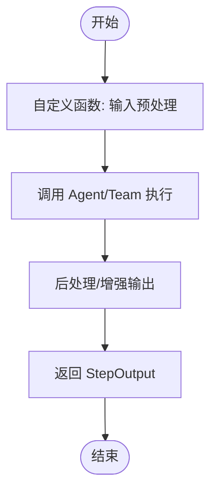
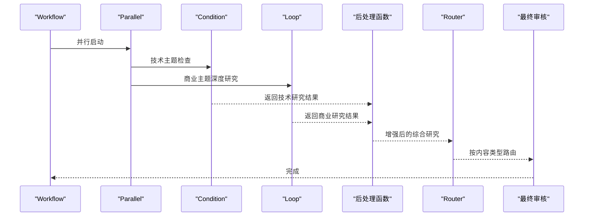
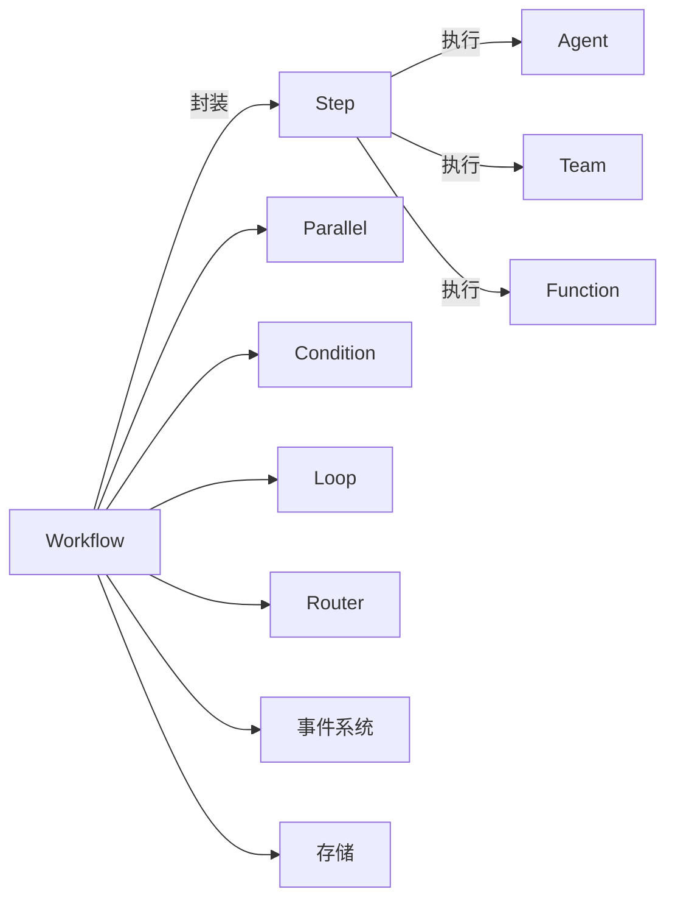

# 高级工作流模式

<cite>
**本文引用的文件**
- [工作流总览](file://workflows/overview.mdx)
- [构建工作流](file://workflows/building-workflows.mdx)
- [运行工作流](file://workflows/running-workflows.mdx)
- [工作流模式总览](file://workflows/workflow-patterns/overview.mdx)
- [高级工作流模式](file://workflows/workflow-patterns/advanced-workflow-patterns.mdx)
- [顺序工作流](file://workflows/workflow-patterns/sequential.mdx)
- [并行工作流](file://workflows/workflow-patterns/parallel-workflow.mdx)
- [条件工作流](file://workflows/workflow-patterns/conditional-workflow.mdx)
- [迭代工作流](file://workflows/workflow-patterns/iterative-workflow.mdx)
- [分支工作流](file://workflows/workflow-patterns/branching-workflow.mdx)
- [自定义函数步骤工作流](file://workflows/workflow-patterns/custom-function-step-workflow.mdx)
- [工作流示例总览](file://cookbook/workflows/overview.mdx)
- [高级概念总览](file://examples/workflows/advanced-concepts/overview.mdx)
</cite>

## 目录
1. [引言](#引言)
2. [项目结构](#项目结构)
3. [核心组件](#核心组件)
4. [架构总览](#架构总览)
5. [详细组件分析](#详细组件分析)
6. [依赖关系分析](#依赖关系分析)
7. [性能考量](#性能考量)
8. [故障排除指南](#故障排除指南)
9. [结论](#结论)
10. [附录](#附录)

## 引言
本文件面向需要在企业级场景中构建复杂自动化系统的工程师与架构师，系统化阐述“高级工作流模式”的设计原则、组合方式与工程实践。内容覆盖顺序、并行、条件、循环、路由等基础模式的协同使用，以及状态管理、事件流、可观测性与性能优化策略。通过仓库中的官方文档与示例页面，我们提炼出可复用的模式与最佳实践，并给出调试、监控与排障建议。

## 项目结构
该仓库以文档形式组织了工作流相关的知识图谱：从基础概念到高级模式，再到示例与参考。下图展示了与“高级工作流模式”直接相关的主要模块及其关系。

**图表来源**
- [工作流总览:1-102](file://workflows/overview.mdx#L1-L102)
- [构建工作流:1-59](file://workflows/building-workflows.mdx#L1-L59)
- [运行工作流:1-619](file://workflows/running-workflows.mdx#L1-L619)
- [工作流模式总览:1-92](file://workflows/workflow-patterns/overview.mdx#L1-L92)
- [顺序工作流:1-50](file://workflows/workflow-patterns/sequential.mdx#L1-L50)
- [并行工作流:1-54](file://workflows/workflow-patterns/parallel-workflow.mdx#L1-L54)
- [条件工作流:1-100](file://workflows/workflow-patterns/conditional-workflow.mdx#L1-L100)
- [迭代工作流:1-57](file://workflows/workflow-patterns/iterative-workflow.mdx#L1-L57)
- [分支工作流:1-176](file://workflows/workflow-patterns/branching-workflow.mdx#L1-L176)
- [自定义函数步骤工作流:1-259](file://workflows/workflow-patterns/custom-function-step-workflow.mdx#L1-L259)
- [高级工作流模式:1-97](file://workflows/workflow-patterns/advanced-workflow-patterns.mdx#L1-L97)
- [工作流示例总览:1-55](file://cookbook/workflows/overview.mdx#L1-L55)
- [高级概念总览:1-19](file://examples/workflows/advanced-concepts/overview.mdx#L1-L19)

**章节来源**
- [工作流总览:1-102](file://workflows/overview.mdx#L1-L102)
- [工作流模式总览:1-92](file://workflows/workflow-patterns/overview.mdx#L1-L92)

## 核心组件
- 工作流（Workflow）：顶层编排器，负责执行步骤序列、处理事件与输出。
- 步骤（Step）：最小执行单元，封装一个执行器（Agent、Team 或自定义函数），确保职责单一与可维护性。
- 并行（Parallel）：并发执行一组步骤，合并结果，显著提升独立任务的吞吐。
- 条件（Condition）：基于评估函数进行分支选择，支持 if/else 双路径。
- 循环（Loop）：重复执行一组步骤，直到满足终止条件或达到最大迭代次数。
- 路由（Router）：根据选择器动态决定下一步路径，支持字符串名、Step 对象或 Step 列表。
- 自定义函数（Function）：作为执行器，提供对输入输出的完全控制与上下文集成能力。

这些组件共同构成确定性的生产级自动化流水线，既保证可预测性，又具备强大的组合与扩展能力。

**章节来源**
- [构建工作流:9-32](file://workflows/building-workflows.mdx#L9-L32)
- [高级工作流模式:1-97](file://workflows/workflow-patterns/advanced-workflow-patterns.mdx#L1-L97)

## 架构总览
下图展示了“高级工作流模式”的整体架构：以 Workflow 为核心，Step 为基本单元，通过 Parallel、Condition、Loop、Router 等复合结构实现复杂控制流；同时结合事件流、会话状态与存储，支撑可观测性与审计。

**图表来源**
- [构建工作流:9-32](file://workflows/building-workflows.mdx#L9-L32)
- [并行工作流:1-54](file://workflows/workflow-patterns/parallel-workflow.mdx#L1-L54)
- [条件工作流:1-100](file://workflows/workflow-patterns/conditional-workflow.mdx#L1-L100)
- [迭代工作流:1-57](file://workflows/workflow-patterns/iterative-workflow.mdx#L1-L57)
- [分支工作流:1-176](file://workflows/workflow-patterns/branching-workflow.mdx#L1-L176)
- [运行工作流:462-526](file://workflows/running-workflows.mdx#L462-L526)

## 详细组件分析

### 组件一：顺序工作流（Sequential）
- 设计要点：线性依赖，数据逐级传递，适合清晰的阶段化流程。
- 典型用法：研究 → 数据预处理 → 内容生成 → 最终审核。
- 关键接口：StepInput/StepOutput 标准化数据流，确保自定义函数与 Agent/Team 的无缝衔接。

**图表来源**
- [顺序工作流:12-32](file://workflows/workflow-patterns/sequential.mdx#L12-L32)

**章节来源**
- [顺序工作流:1-50](file://workflows/workflow-patterns/sequential.mdx#L1-L50)

### 组件二：并行工作流（Parallel）
- 设计要点：独立任务并发执行，减少总时延；合成阶段统一结果。
- 注意事项：并行步骤中的会话状态更新需避免竞态，必要时引入协调机制。
- 典型用法：多源研究（HackerNews/Web/Academic）→ 合成报告。

**图表来源**
- [并行工作流:23-40](file://workflows/workflow-patterns/parallel-workflow.mdx#L23-L40)

**章节来源**
- [并行工作流:1-54](file://workflows/workflow-patterns/parallel-workflow.mdx#L1-L54)

### 组件三：条件工作流（Condition）
- 设计要点：基于业务规则或输入特征进行分支；可选 else 分支。
- 典型用法：技术问题 vs 一般支持；不同主题走不同处理链路。
- 执行语义：若条件为假且无 else，则跳过该条件节点继续后续步骤。

**图表来源**
- [条件工作流:32-91](file://workflows/workflow-patterns/conditional-workflow.mdx#L32-L91)

**章节来源**
- [条件工作流:1-100](file://workflows/workflow-patterns/conditional-workflow.mdx#L1-L100)

### 组件四：迭代工作流（Loop）
- 设计要点：质量控制驱动的重复执行，设定终止条件与最大迭代次数。
- 迭代输出转发：默认将上一次输出作为本次输入，支持累积式改进。
- 典型用法：深度研究 → 质量检查 → 达标则结束，否则继续。

**图表来源**
- [迭代工作流:23-44](file://workflows/workflow-patterns/iterative-workflow.mdx#L23-L44)

**章节来源**
- [迭代工作流:1-57](file://workflows/workflow-patterns/iterative-workflow.mdx#L1-L57)

### 组件五：分支工作流（Router）
- 设计要点：动态选择执行路径，支持字符串名、Step 对象或 Step 列表返回值。
- 选择器灵活性：可接收 choices 参数，实现更灵活的路由决策。
- 典型用法：按主题路由到技术专家、商业专家或通用分析。

**图表来源**
- [分支工作流:67-91](file://workflows/workflow-patterns/branching-workflow.mdx#L67-L91)

**章节来源**
- [分支工作流:1-176](file://workflows/workflow-patterns/branching-workflow.mdx#L1-L176)

### 组件六：自定义函数步骤（Function-Based Step）
- 设计要点：完全掌控输入输出转换、调用 Agent/Team、状态读写与错误处理。
- 执行器形态：函数、类实例（实现 __call__）、异步类实例。
- 流式集成：在 AgentOS 中可通过 arun + stream/stream_events 实现事件级流式输出。

**图表来源**
- [自定义函数步骤工作流:36-87](file://workflows/workflow-patterns/custom-function-step-workflow.mdx#L36-L87)

**章节来源**
- [自定义函数步骤工作流:1-259](file://workflows/workflow-patterns/custom-function-step-workflow.mdx#L1-L259)

### 组件七：高级模式组合（多模式协同）
- 设计原则：将条件、并行、循环、路由与自定义函数有机结合，形成可预测但功能强大的自动化系统。
- 示例要点：条件并行 + 深度循环 + 后处理 + 动态路由 + 最终审核。
- 输出与质量：通过后处理步骤对并行结果进行质量评估与增强，再按内容类型路由至不同下游。

**图表来源**
- [高级工作流模式:52-87](file://workflows/workflow-patterns/advanced-workflow-patterns.mdx#L52-L87)

**章节来源**
- [高级工作流模式:1-97](file://workflows/workflow-patterns/advanced-workflow-patterns.mdx#L1-L97)

## 依赖关系分析
- 组件内聚与耦合
  - Step 将执行器封装，降低与 Workflow 的耦合度，便于替换 Agent/Team/Function。
  - Parallel/Condition/Loop/Router 作为复合结构，组合多个 Step，提升控制流表达力。
- 外部依赖与集成点
  - 事件系统：Workflow.run()/arun() 产出 WorkflowRunOutput/事件流，用于可观测性与审计。
  - 存储：可配置事件存储与过滤，兼顾调试与生产成本。
  - AgentOS：在自定义函数中可启用流式事件，实现端到端可观测。
- 潜在循环依赖
  - 工作流内部通过显式步骤与选择器避免循环依赖；外部仅依赖标准接口（StepInput/StepOutput）。

**图表来源**
- [构建工作流:9-32](file://workflows/building-workflows.mdx#L9-L32)
- [运行工作流:462-526](file://workflows/running-workflows.mdx#L462-L526)

**章节来源**
- [运行工作流:1-619](file://workflows/running-workflows.mdx#L1-L619)

## 性能考量
- 并发优先：对独立任务使用 Parallel，显著缩短端到端时延。
- 控制循环：为 Loop 设置合理终止条件与最大迭代次数，避免无限循环。
- 事件与存储：生产环境可跳过高频事件（如 step_started/completed），仅保留关键事件，降低存储与解析开销。
- 流式输出：在需要实时反馈的场景启用 stream/stream_events，平衡延迟与带宽。
- 模型遥测：默认开启模型使用遥测，可在环境变量或工作流配置中关闭。

**章节来源**
- [运行工作流:527-598](file://workflows/running-workflows.mdx#L527-L598)
- [运行工作流:600-612](file://workflows/running-workflows.mdx#L600-L612)

## 故障排除指南
- 事件存储与回放
  - 使用 store_events=True 记录完整事件序列，结合 events_to_skip 过滤噪声事件，便于定位问题根因。
- 错误事件识别
  - 关注 WorkflowError、StepError 等错误事件，结合上一步输出与上下文信息进行排查。
- 并行竞态
  - 在并行步骤中更新共享会话状态时，采用加锁或串行化写入，避免竞态。
- 调试策略
  - 开发阶段启用全量事件存储与流式事件，生产阶段按需裁剪事件类型。
- 取消与早停
  - 结合“早停”与“运行控制”示例，实现可控的中断与恢复。

**章节来源**
- [运行工作流:527-598](file://workflows/running-workflows.mdx#L527-L598)
- [高级概念总览:1-19](file://examples/workflows/advanced-concepts/overview.mdx#L1-L19)

## 结论
通过将顺序、并行、条件、循环与路由等基础模式进行系统化组合，并辅以标准化的数据接口（StepInput/StepOutput）、事件流与存储策略，可以构建可预测、可扩展、可维护的企业级复杂自动化系统。在实践中，应重视状态一致性、事件治理与性能权衡，结合示例与参考文档持续演进。

## 附录
- 实际应用案例与经验
  - 三阶段流水线（研究→提取→写作）与会话缓存：见示例总览中的“博客文章生成器”。
  - 多源并行采集与合成：见示例总览中的“公司描述生成”。
  - 条件分支与阈值筛选：见示例总览中的“员工招聘官”。
  - 分类路由与知识库操作：见示例总览中的“Notion 知识管理器”。

**章节来源**
- [工作流示例总览:1-55](file://cookbook/workflows/overview.mdx#L1-L55)