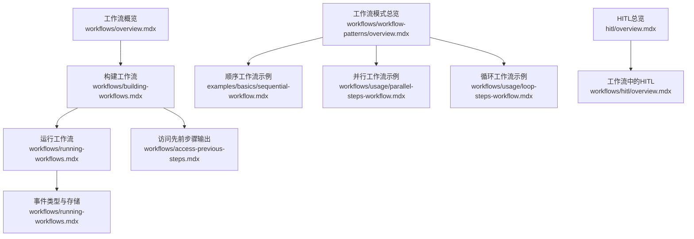
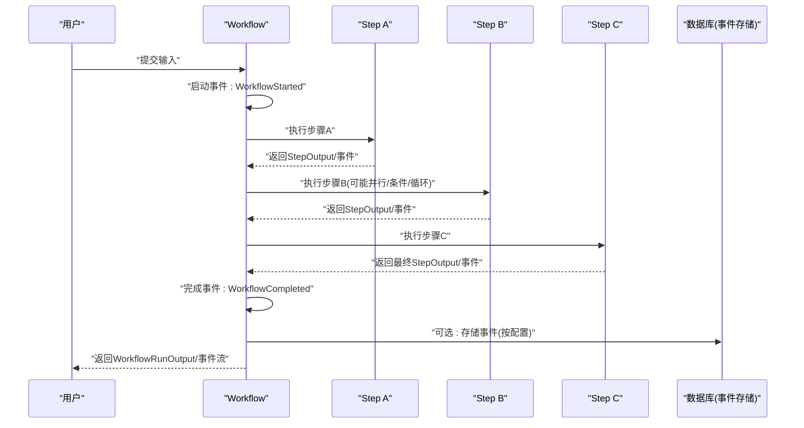
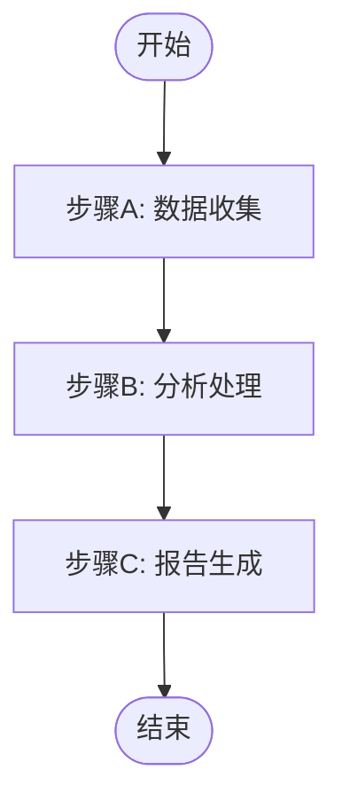
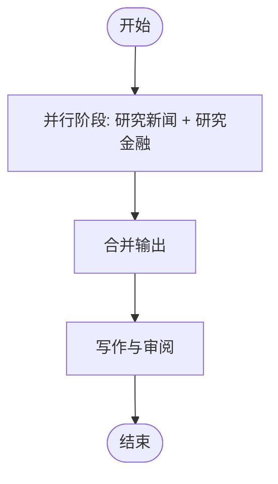
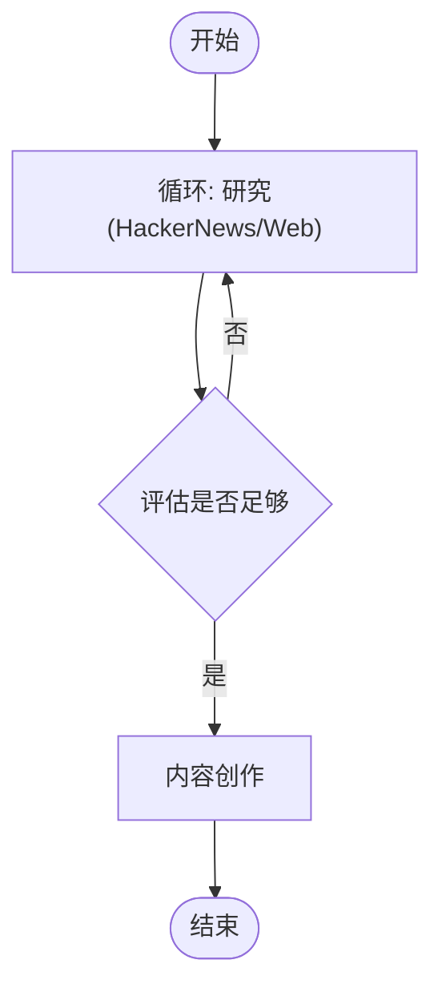
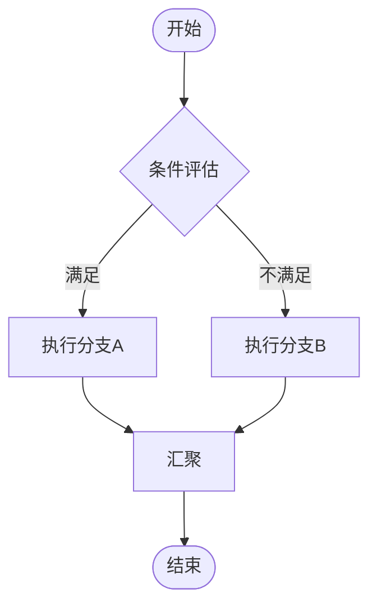
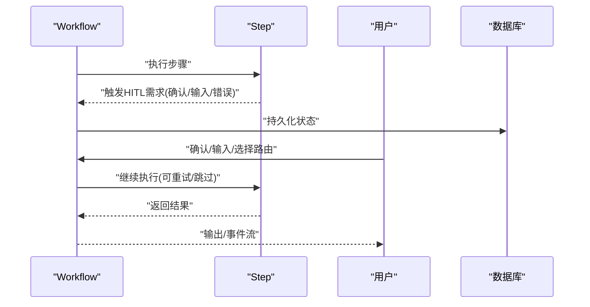
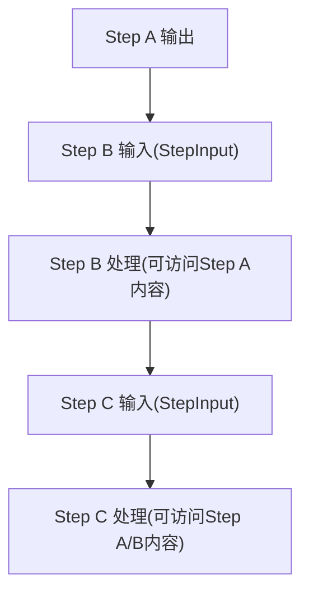
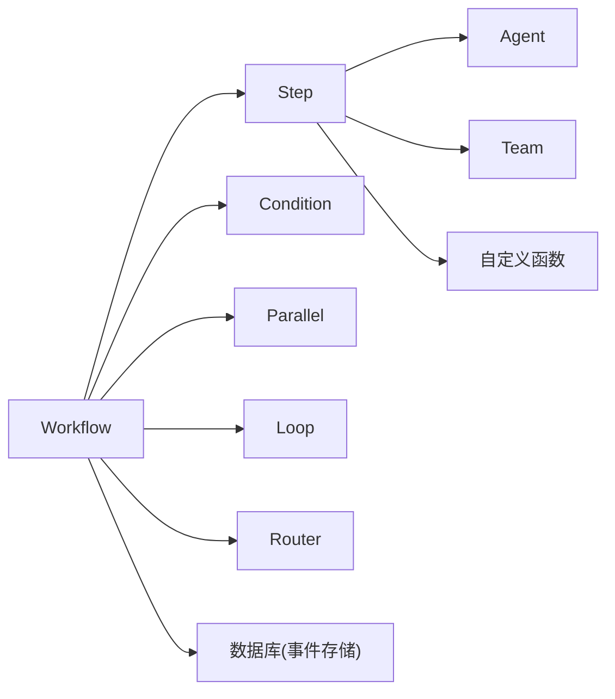

# 工作流编排系统

<cite>
**本文引用的文件**
- [工作流概览](file://workflows/overview.mdx)
- [构建工作流](file://workflows/building-workflows.mdx)
- [运行工作流](file://workflows/running-workflows.mdx)
- [工作流模式总览](file://workflows/workflow-patterns/overview.mdx)
- [顺序工作流示例](file://examples/basics/sequential-workflow.mdx)
- [并行工作流示例](file://workflows/usage/parallel-steps-workflow.mdx)
- [循环工作流示例](file://workflows/usage/loop-steps-workflow.mdx)
- [工作流访问先前步骤输出](file://workflows/access-previous-steps.mdx)
- [人机交互（HITL）总览](file://hitl/overview.mdx)
- [工作流中的HITL总览](file://workflows/hitl/overview.mdx)
</cite>

## 目录
1. [引言](#引言)
2. [项目结构](#项目结构)
3. [核心组件](#核心组件)
4. [架构总览](#架构总览)
5. [详细组件分析](#详细组件分析)
6. [依赖关系分析](#依赖关系分析)
7. [性能考虑](#性能考虑)
8. [故障排查指南](#故障排查指南)
9. [结论](#结论)
10. [附录](#附录)

## 引言
本技术文档面向“工作流编排系统”，系统性阐述工作流的核心概念与实现方式：步骤编排、条件分支、并行执行、迭代循环；详解工作流的构建流程（步骤定义、输入输出配置、执行逻辑设计）；说明运行管理（执行状态监控、事件流、错误处理、结果收集）；覆盖常见工作流模式（顺序、条件分支、并行、迭代）；介绍人机交互（HITL）能力（用户确认、输入收集、外部执行）；并提供高级用法（自定义执行器、数据流处理、事件存储与审计）与丰富示例路径，帮助读者在复杂业务场景中落地使用。

## 项目结构
本仓库以“文档+示例”为主，工作流相关知识分布在以下位置：
- 概念与入门：工作流概览、构建工作流、运行工作流
- 模式与范式：工作流模式总览、顺序/并行/循环示例
- 运行与事件：运行工作流（事件类型、事件存储、异步/流式）
- 数据访问：访问先前步骤输出
- 人机交互（HITL）：HITL总览、工作流中的HITL总览
- 示例工程：顺序工作流、并行工作流、循环工作流

**图示来源**
- [工作流概览:1-102](file://workflows/overview.mdx#L1-L102)
- [构建工作流:1-59](file://workflows/building-workflows.mdx#L1-L59)
- [运行工作流:1-619](file://workflows/running-workflows.mdx#L1-L619)
- [工作流模式总览:1-92](file://workflows/workflow-patterns/overview.mdx#L1-L92)
- [顺序工作流示例:1-193](file://examples/basics/sequential-workflow.mdx#L1-L193)
- [并行工作流示例:1-47](file://workflows/usage/parallel-steps-workflow.mdx#L1-L47)
- [循环工作流示例:1-103](file://workflows/usage/loop-steps-workflow.mdx#L1-L103)
- [HITL总览:1-174](file://hitl/overview.mdx#L1-L174)
- [工作流中的HITL总览:1-289](file://workflows/hitl/overview.mdx#L1-L289)

**章节来源**
- [工作流概览:1-102](file://workflows/overview.mdx#L1-L102)
- [构建工作流:1-59](file://workflows/building-workflows.mdx#L1-L59)
- [运行工作流:1-619](file://workflows/running-workflows.mdx#L1-L619)
- [工作流模式总览:1-92](file://workflows/workflow-patterns/overview.mdx#L1-L92)
- [顺序工作流示例:1-193](file://examples/basics/sequential-workflow.mdx#L1-L193)
- [并行工作流示例:1-47](file://workflows/usage/parallel-steps-workflow.mdx#L1-L47)
- [循环工作流示例:1-103](file://workflows/usage/loop-steps-workflow.mdx#L1-L103)
- [HITL总览:1-174](file://hitl/overview.mdx#L1-L174)
- [工作流中的HITL总览:1-289](file://workflows/hitl/overview.mdx#L1-L289)

## 核心组件
- 工作流（Workflow）：顶层编排器，负责管理整个执行流程，支持事件流、异步执行、事件存储与审计。
- 步骤（Step）：工作单元，封装一个执行器（Agent、Team或自定义函数），确保职责单一、可维护。
- 条件（Condition）：基于评估器决定是否执行某段步骤，形成分支逻辑。
- 并行（Parallel）：并发执行多个步骤，输出合并后进入下一步。
- 循环（Loop）：重复执行一组步骤直到满足终止条件，适合质量驱动的迭代。
- 路由（Router）：动态选择下一步执行路径，常配合用户输入进行路由决策。
- 输入输出（StepInput/StepOutput）：标准化的数据流接口，用于步骤间传递内容与附加数据。

**章节来源**
- [构建工作流:9-32](file://workflows/building-workflows.mdx#L9-L32)
- [运行工作流:462-525](file://workflows/running-workflows.mdx#L462-L525)

## 架构总览
下图展示了工作流从“输入到输出”的端到端执行链路，以及事件流与数据流的关键节点。

**图示来源**
- [运行工作流:462-525](file://workflows/running-workflows.mdx#L462-L525)
- [运行工作流:527-598](file://workflows/running-workflows.mdx#L527-L598)

## 详细组件分析

### 组件A：顺序工作流
顺序工作流强调线性步骤与明确的数据传递。每个步骤专注于特定任务，输出作为下一个步骤的输入，适合可预测、可重复的任务流水线。

- 关键点
  - 明确的步骤边界与职责划分
  - 使用历史与上下文增强（如时间戳、会话历史）
  - 可通过数据库持久化中间结果与事件
- 实践建议
  - 在每步设置清晰的描述与提示词
  - 利用Markdown输出提升可读性
  - 对关键步骤启用事件存储以便审计

**图示来源**
- [顺序工作流示例:1-193](file://examples/basics/sequential-workflow.mdx#L1-L193)

**章节来源**
- [顺序工作流示例:1-193](file://examples/basics/sequential-workflow.mdx#L1-L193)

### 组件B：并行工作流
并行工作流通过并发执行独立任务显著缩短总时长，适用于多源研究、并行数据处理等场景。

- 关键点
  - 并行组内的步骤相互独立，不依赖彼此输出
  - 合并策略需明确（例如按名称访问或聚合）
  - 支持事件存储与过滤，便于调试与审计
- 实践建议
  - 将I/O密集型任务放入并行组
  - 对并行事件进行过滤，聚焦关键事件
  - 使用数据库持久化以支持断点续跑

**图示来源**
- [并行工作流示例:1-47](file://workflows/usage/parallel-steps-workflow.mdx#L1-L47)
- [运行工作流:488-493](file://workflows/running-workflows.mdx#L488-L493)

**章节来源**
- [并行工作流示例:1-47](file://workflows/usage/parallel-steps-workflow.mdx#L1-L47)
- [运行工作流:488-493](file://workflows/running-workflows.mdx#L488-L493)

### 组件C：循环工作流
循环工作流通过“评估-迭代”机制实现质量驱动的自动化，适合需要深度研究或内容质量保障的场景。

- 关键点
  - 终止条件函数根据输出质量判断是否继续
  - 可设置最大迭代次数防止无限循环
  - 输出评估可结合长度阈值、关键词检测等策略
- 实践建议
  - 将“评估”抽象为可插拔的函数，便于扩展
  - 记录每次迭代的输出，便于回溯与审计
  - 对不稳定环节开启事件存储与错误暂停

**图示来源**
- [循环工作流示例:1-103](file://workflows/usage/loop-steps-workflow.mdx#L1-L103)

**章节来源**
- [循环工作流示例:1-103](file://workflows/usage/loop-steps-workflow.mdx#L1-L103)
- [运行工作流:502-509](file://workflows/running-workflows.mdx#L502-L509)

### 组件D：条件分支与路由
条件与路由允许根据前置输出或用户决策动态选择路径，形成灵活的分支逻辑。

- 关键点
  - 条件评估器基于上一步内容或附加数据判定
  - 路由可结合用户输入进行路径选择
  - 支持“确认/拒绝/跳过/取消”等拒绝行为
- 实践建议
  - 将条件逻辑模块化，便于测试与复用
  - 对关键分支启用事件存储与审计
  - 在路由中提供清晰的选项说明与回退策略

**章节来源**
- [构建工作流:11-16](file://workflows/building-workflows.mdx#L11-L16)
- [运行工作流:495-500](file://workflows/running-workflows.mdx#L495-L500)
- [工作流中的HITL总览:63-82](file://workflows/hitl/overview.mdx#L63-L82)

### 组件E：人机交互（HITL）
HITL在工作流中提供“暂停-确认-输入-外部执行-恢复”的闭环控制，确保敏感操作与关键决策受人工监督。

- 关键点
  - 支持步骤级确认、用户输入、路由选择、错误暂停
  - 需要数据库持久化以支持断点续跑
  - 流式事件中可检测暂停并处理活动需求
- 实践建议
  - 对高风险步骤强制要求确认
  - 使用用户输入字段Schema约束输入合法性
  - 结合事件存储与审计日志，满足合规要求

**图示来源**
- [工作流中的HITL总览:1-289](file://workflows/hitl/overview.mdx#L1-L289)
- [HITL总览:1-174](file://hitl/overview.mdx#L1-L174)

**章节来源**
- [工作流中的HITL总览:1-289](file://workflows/hitl/overview.mdx#L1-L289)
- [HITL总览:1-174](file://hitl/overview.mdx#L1-L174)

### 组件F：数据流与历史访问
工作流提供统一的输入输出接口，并支持对先前步骤的直接访问与递归搜索，便于复杂数据聚合与跨步骤协作。

- 关键点
  - 通过名称直接访问并行组内子步骤
  - 支持递归搜索任意层级嵌套步骤
  - 自定义函数可通过StepInput获取附加数据（如用户输入）
- 实践建议
  - 为并行组命名，便于后续聚合
  - 在聚合步骤中显式声明所需上游步骤
  - 对复杂数据结构进行Schema化，降低耦合

**图示来源**
- [工作流访问先前步骤输出:72-110](file://workflows/access-previous-steps.mdx#L72-L110)

**章节来源**
- [工作流访问先前步骤输出:72-110](file://workflows/access-previous-steps.mdx#L72-L110)

## 依赖关系分析
- 组件耦合
  - Workflow对Step/Condition/Parallel/Loop/Router存在组合依赖
  - Step对Agent/Team/自定义函数存在执行器依赖
  - HITL依赖数据库持久化以支持断点续跑
- 外部依赖
  - 事件存储：SQLite/PostgreSQL等数据库
  - 模型与工具：OpenAIResponses、第三方工具包
- 潜在问题
  - 未配置数据库时HITL无法断点续跑
  - 并行步骤过多可能导致资源竞争与超时
  - 事件存储开启后需合理筛选事件类型以控制开销

**图示来源**
- [构建工作流:9-32](file://workflows/building-workflows.mdx#L9-L32)
- [运行工作流:527-598](file://workflows/running-workflows.mdx#L527-L598)

**章节来源**
- [构建工作流:9-32](file://workflows/building-workflows.mdx#L9-L32)
- [运行工作流:527-598](file://workflows/running-workflows.mdx#L527-L598)

## 性能考虑
- 并行优化
  - 将I/O密集型步骤放入并行组，减少等待时间
  - 控制并行度，避免资源争用导致整体延迟上升
- 事件存储
  - 默认仅存储关键事件，必要时过滤verbose事件
  - 生产环境建议仅保留“完成/失败/错误”等关键事件
- 流式与异步
  - 使用流式事件实时感知执行进度
  - 异步执行适合长耗时任务，注意异常传播与重试策略
- 数据访问
  - 合理命名并行组与步骤，降低聚合成本
  - 对复杂数据结构进行Schema化，减少解析与校验开销

**章节来源**
- [运行工作流:527-598](file://workflows/running-workflows.mdx#L527-L598)
- [并行工作流示例:1-47](file://workflows/usage/parallel-steps-workflow.mdx#L1-L47)

## 故障排查指南
- 常见问题
  - HITL无法恢复：检查是否配置数据库与会话状态
  - 事件缺失：确认是否开启事件存储与事件过滤策略
  - 并行阻塞：检查步骤间依赖与资源限制
  - 条件不生效：核对评估器逻辑与StepInput内容
- 排查步骤
  - 开启事件存储并过滤关键事件
  - 使用流式事件定位暂停点与错误点
  - 对高风险步骤启用确认与错误暂停
  - 回放最近一次运行的事件序列，复现问题
- 参考事件类型
  - 核心事件：WorkflowStarted/WorkflowCompleted/WorkflowError
  - 步骤事件：StepStarted/StepCompleted/StepError
  - 并行/条件/循环/路由事件：对应启动/完成事件
  - 步骤输出事件：StepOutput（自定义函数）

**章节来源**
- [运行工作流:462-525](file://workflows/running-workflows.mdx#L462-L525)
- [运行工作流:527-598](file://workflows/running-workflows.mdx#L527-L598)

## 结论
工作流编排系统通过“步骤+条件+并行+循环+路由”的组合，提供了确定性、可重复且可观测的自动化能力。借助标准化的输入输出接口与事件流，系统既能满足复杂业务场景的灵活性，又能通过事件存储与审计满足合规与质量要求。配合HITL，可在关键节点引入人工监督，平衡自动化效率与风险控制。建议在生产环境中：
- 明确步骤边界与职责，采用顺序+并行+条件+循环的组合模式
- 启用事件存储与关键事件过滤，兼顾可观测性与成本
- 对高风险步骤强制确认与错误暂停，确保可控性
- 使用数据库持久化支持断点续跑与审计回溯

## 附录
- 快速参考
  - 顺序：适用于线性、可预测的任务流水线
  - 并行：适用于独立I/O密集任务
  - 条件/路由：适用于基于规则或用户决策的分支
  - 循环：适用于质量驱动的迭代与收敛
  - HITL：适用于需要人工确认、输入与外部执行的场景
- 示例路径
  - 顺序工作流：[顺序工作流示例:1-193](file://examples/basics/sequential-workflow.mdx#L1-L193)
  - 并行工作流：[并行工作流示例:1-47](file://workflows/usage/parallel-steps-workflow.mdx#L1-L47)
  - 循环工作流：[循环工作流示例:1-103](file://workflows/usage/loop-steps-workflow.mdx#L1-L103)
  - 访问先前步骤输出：[访问先前步骤输出:72-110](file://workflows/access-previous-steps.mdx#L72-L110)
  - 运行与事件：[运行工作流:1-619](file://workflows/running-workflows.mdx#L1-L619)
  - HITL总览与工作流中的HITL：[HITL总览:1-174](file://hitl/overview.mdx#L1-L174)、[工作流中的HITL总览:1-289](file://workflows/hitl/overview.mdx#L1-L289)