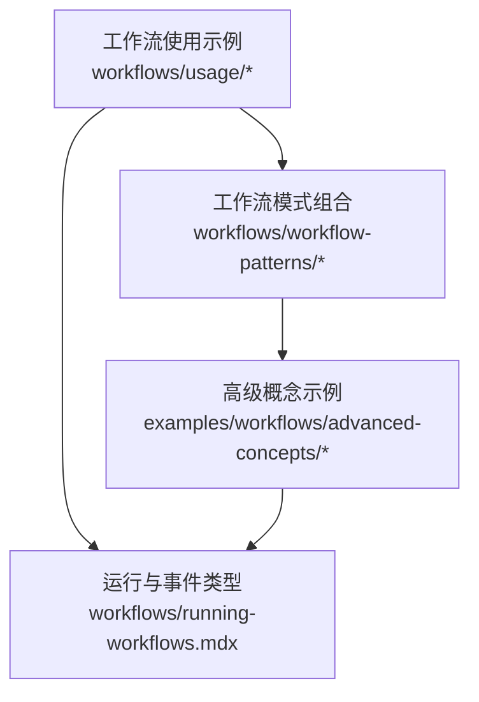
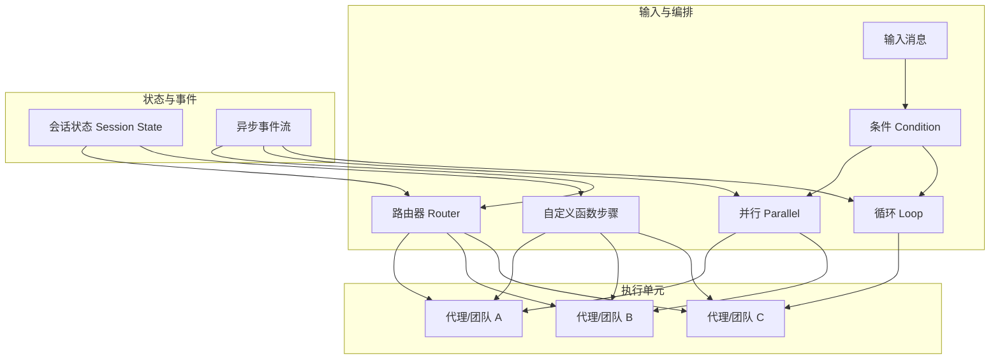
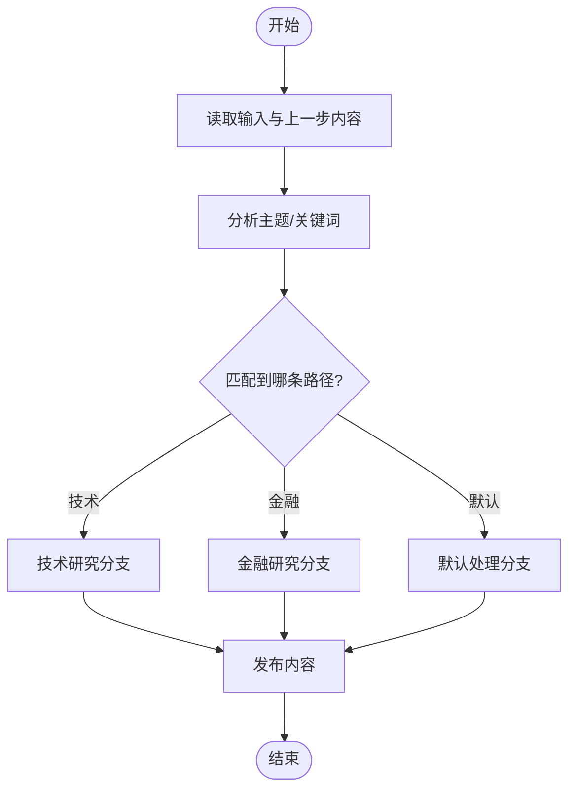
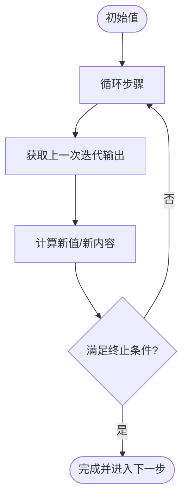
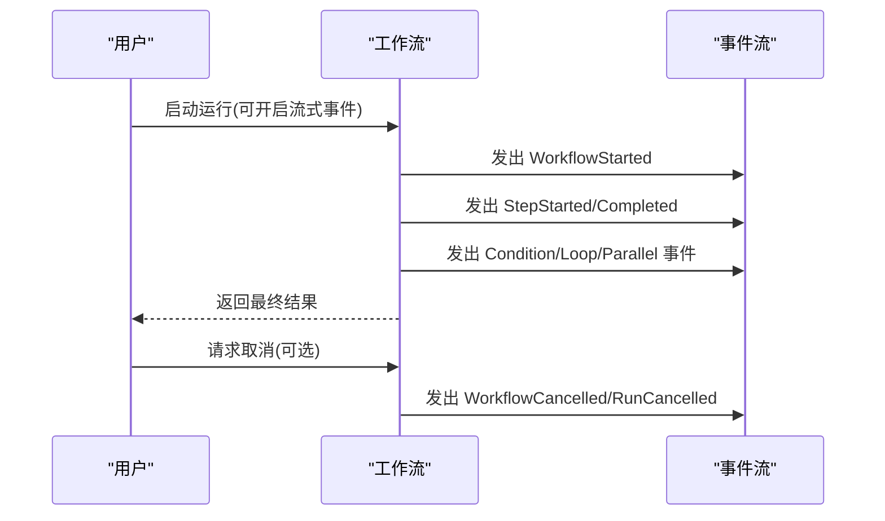
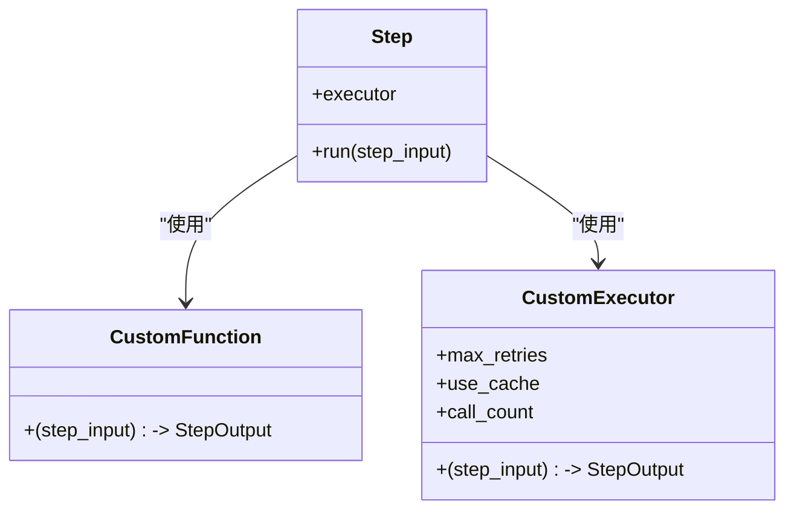
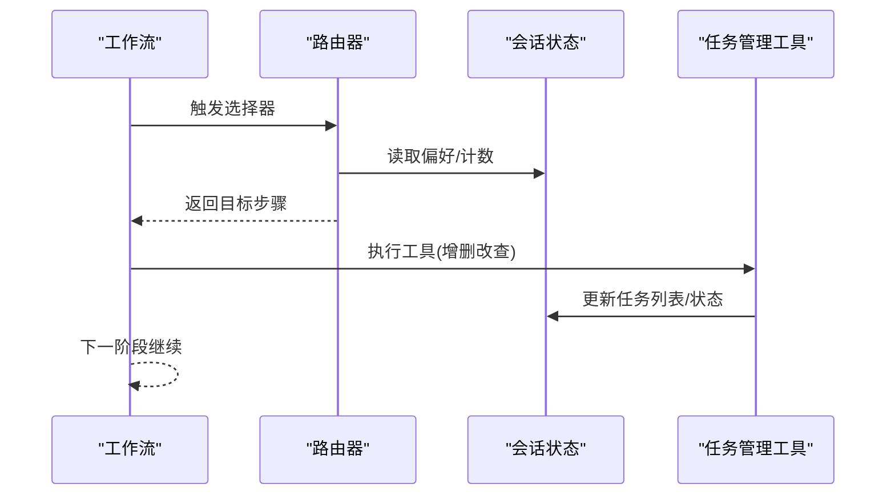
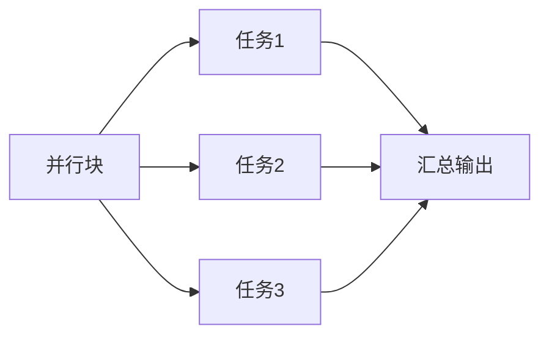
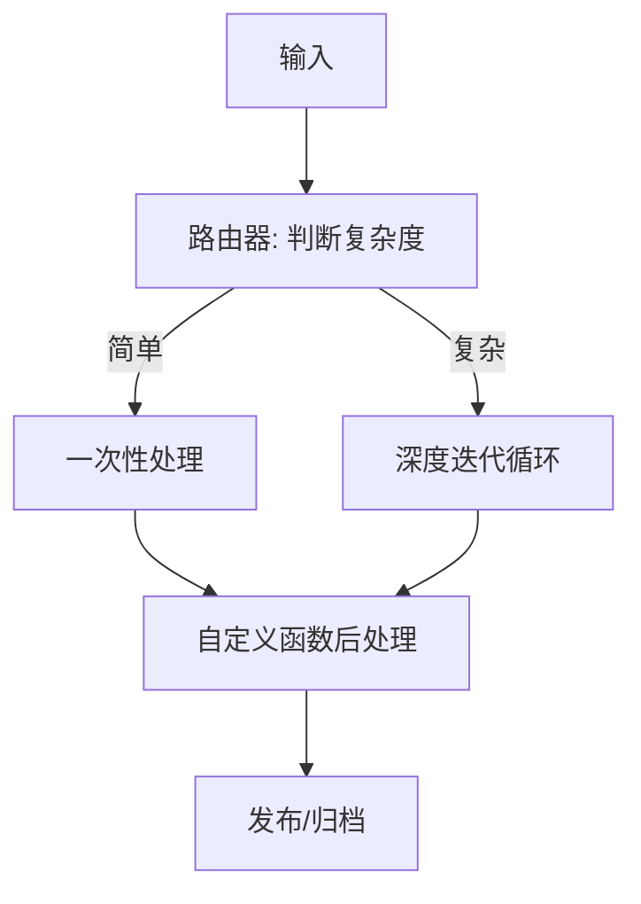
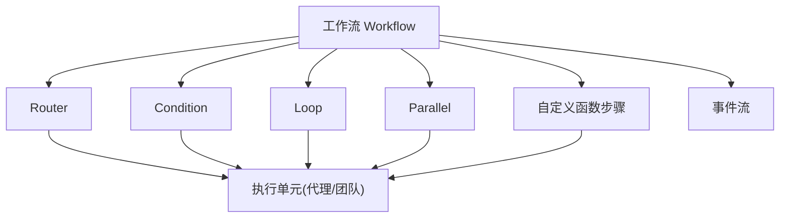

# 工作流高级用法

<cite>
**本文引用的文件**
- [路由工作流（条件分支）](file://workflows/usage/router-steps-workflow.mdx)
- [并行工作流](file://workflows/usage/parallel-steps-workflow.mdx)
- [循环工作流](file://workflows/usage/loop-steps-workflow.mdx)
- [单函数替代步骤](file://workflows/usage/function-instead-of-steps.mdx)
- [异步事件流](file://workflows/usage/async-events-streaming.mdx)
- [工作流取消](file://workflows/usage/workflow-cancellation.mdx)
- [高级工作流模式组合](file://workflows/workflow-patterns/advanced-workflow-patterns.mdx)
- [自定义函数步骤工作流](file://workflows/workflow-patterns/custom-function-step-workflow.mdx)
- [会话状态在路由器中的使用](file://examples/workflows/advanced-concepts/session-state/state-in-router.mdx)
- [会话状态与团队协作](file://examples/workflows/advanced-concepts/session-state/state-with-team.mdx)
- [循环迭代累积](file://workflows/usage/loop-iterative-accumulation.mdx)
- [路由器与循环步骤](file://workflows/usage/router-with-loop-steps.mdx)
- [工作流运行与事件类型](file://workflows/running-workflows.mdx)
- [事件存储与重放](file://examples/workflows/advanced-concepts/long-running/event-storage.mdx)
- [事件重放示例](file://examples/workflows/advanced-concepts/long-running/events-replay.mdx)
</cite>

## 目录
1. [简介](#简介)
2. [项目结构](#项目结构)
3. [核心组件](#核心组件)
4. [架构总览](#架构总览)
5. [详细组件分析](#详细组件分析)
6. [依赖关系分析](#依赖关系分析)
7. [性能考量](#性能考量)
8. [故障排查指南](#故障排查指南)
9. [结论](#结论)
10. [附录](#附录)

## 简介
本文件面向具备一定基础的工程师与架构师，系统性阐述工作流的高级特性与复杂用法，覆盖以下主题：
- 路由器选择与动态路径决策
- 多步骤输出访问与迭代累积
- 异步事件流与实时可观测性
- 自定义函数替代步骤的实现与类执行器模式
- 会话状态驱动的状态管理与跨组件共享
- 并行步骤的高级配置与优化
- 复杂业务场景的组合模式与架构设计
- 工作流扩展与定制化方法
- 性能优化与资源管理的高级技巧
- 专家级使用案例与最佳实践

## 项目结构
围绕“工作流高级用法”的知识主要分布在以下区域：
- workflows/usage：工作流使用示例（路由、并行、循环、异步事件、取消等）
- workflows/workflow-patterns：工作流模式与组合范式
- examples/workflows/advanced-concepts：高级概念示例（会话状态、长运行事件存储与重放）
- workflows/running-workflows：运行时事件类型与流式输出说明

图示来源
- [路由工作流（条件分支）:1-119](file://workflows/usage/router-steps-workflow.mdx#L1-L119)
- [并行工作流:1-47](file://workflows/usage/parallel-steps-workflow.mdx#L1-L47)
- [循环工作流:1-103](file://workflows/usage/loop-steps-workflow.mdx#L1-L103)
- [异步事件流:1-141](file://workflows/usage/async-events-streaming.mdx#L1-L141)
- [高级工作流模式组合:1-97](file://workflows/workflow-patterns/advanced-workflow-patterns.mdx#L1-L97)
- [会话状态在路由器中的使用:1-488](file://examples/workflows/advanced-concepts/session-state/state-in-router.mdx#L1-L488)
- [工作流运行与事件类型:420-511](file://workflows/running-workflows.mdx#L420-L511)

章节来源
- [路由工作流（条件分支）:1-119](file://workflows/usage/router-steps-workflow.mdx#L1-L119)
- [并行工作流:1-47](file://workflows/usage/parallel-steps-workflow.mdx#L1-L47)
- [循环工作流:1-103](file://workflows/usage/loop-steps-workflow.mdx#L1-L103)
- [异步事件流:1-141](file://workflows/usage/async-events-streaming.mdx#L1-L141)
- [高级工作流模式组合:1-97](file://workflows/workflow-patterns/advanced-workflow-patterns.mdx#L1-L97)
- [会话状态在路由器中的使用:1-488](file://examples/workflows/advanced-concepts/session-state/state-in-router.mdx#L1-L488)
- [工作流运行与事件类型:420-511](file://workflows/running-workflows.mdx#L420-L511)

## 核心组件
- 路由器（Router）：基于输入或状态动态选择单一执行路径，适合互斥分支与专家路由。
- 条件（Condition）：可触发多个并行路径，适合多策略并行评估。
- 循环（Loop）：重复执行一组步骤直至满足终止条件，适合质量驱动的迭代过程。
- 并行（Parallel）：同时执行独立任务，显著降低总执行时间。
- 自定义函数步骤：以函数或类执行器实现完全可控的步骤逻辑，支持预处理、调用代理/团队、后处理与流式输出。
- 会话状态（Session State）：贯穿工作流全生命周期的共享数据容器，支持跨组件协作与记忆化。

章节来源
- [路由工作流（条件分支）:64-111](file://workflows/usage/router-steps-workflow.mdx#L64-L111)
- [循环工作流:59-94](file://workflows/usage/loop-steps-workflow.mdx#L59-L94)
- [并行工作流:35-42](file://workflows/usage/parallel-steps-workflow.mdx#L35-L42)
- [自定义函数步骤工作流:30-87](file://workflows/workflow-patterns/custom-function-step-workflow.mdx#L30-L87)
- [会话状态在路由器中的使用:144-168](file://examples/workflows/advanced-concepts/session-state/state-in-router.mdx#L144-L168)

## 架构总览
下图展示典型高级工作流的组合方式：条件判断与并行执行结合，循环用于质量保障，路由器进行最终路径选择，自定义函数步骤负责编排与后处理，异步事件流提供可观测性与交互体验。

图示来源
- [高级工作流模式组合:52-87](file://workflows/workflow-patterns/advanced-workflow-patterns.mdx#L52-L87)
- [循环工作流:82-94](file://workflows/usage/loop-steps-workflow.mdx#L82-L94)
- [并行工作流:35-42](file://workflows/usage/parallel-steps-workflow.mdx#L35-L42)
- [路由工作流（条件分支）:99-111](file://workflows/usage/router-steps-workflow.mdx#L99-L111)
- [自定义函数步骤工作流:30-87](file://workflows/workflow-patterns/custom-function-step-workflow.mdx#L30-L87)
- [会话状态在路由器中的使用:144-168](file://examples/workflows/advanced-concepts/session-state/state-in-router.mdx#L144-L168)

## 详细组件分析

### 路由器选择与动态路径
- 动态选择：根据输入关键词、领域特征或会话状态选择不同研究路径。
- 互斥路径：一次仅执行一个分支，避免资源竞争与重复计算。
- 与会话状态联动：可在选择器中读取/更新偏好、交互次数等，实现自适应路由。

图示来源
- [路由工作流（条件分支）:64-111](file://workflows/usage/router-steps-workflow.mdx#L64-L111)
- [会话状态在路由器中的使用:28-72](file://examples/workflows/advanced-concepts/session-state/state-in-router.mdx#L28-L72)

章节来源
- [路由工作流（条件分支）:64-111](file://workflows/usage/router-steps-workflow.mdx#L64-L111)
- [会话状态在路由器中的使用:28-72](file://examples/workflows/advanced-concepts/session-state/state-in-router.mdx#L28-L72)

### 多步骤输出访问与迭代累积
- 迭代累积：通过向前传递上一次迭代的输出，实现数值累加、内容收敛等。
- 终止条件：基于内容长度、质量评分或外部指标决定是否继续迭代。
- 最大迭代次数：防止无限循环，确保资源安全。

图示来源
- [循环迭代累积:15-49](file://workflows/usage/loop-iterative-accumulation.mdx#L15-L49)
- [循环工作流:59-94](file://workflows/usage/loop-steps-workflow.mdx#L59-L94)

章节来源
- [循环迭代累积:15-49](file://workflows/usage/loop-iterative-accumulation.mdx#L15-L49)
- [循环工作流:59-94](file://workflows/usage/loop-steps-workflow.mdx#L59-L94)

### 异步事件流与可观测性
- 事件类型：工作流启动/完成、步骤开始/完成、条件/循环/并行执行事件等。
- 流式输出：支持同步与异步流式事件，便于前端实时渲染与用户交互。
- 取消与状态：线程内运行与取消机制，配合事件流反馈执行状态。

图示来源
- [异步事件流:94-139](file://workflows/usage/async-events-streaming.mdx#L94-L139)
- [工作流取消:27-140](file://workflows/usage/workflow-cancellation.mdx#L27-L140)
- [工作流运行与事件类型:462-511](file://workflows/running-workflows.mdx#L462-L511)

章节来源
- [异步事件流:94-139](file://workflows/usage/async-events-streaming.mdx#L94-L139)
- [工作流取消:27-140](file://workflows/usage/workflow-cancellation.mdx#L27-L140)
- [工作流运行与事件类型:462-511](file://workflows/running-workflows.mdx#L462-L511)

### 自定义函数替代步骤与类执行器
- 单函数替代步骤：直接传入可调用对象作为步骤，获得与标准步骤一致的存储、流式与会话能力。
- 类执行器：通过实现 __call__ 的类实例注入步骤，支持初始化配置、状态保持与复用。
- 异步流式：在类执行器中使用异步调用与事件生成，实现端到端流式体验。

图示来源
- [单函数替代步骤:55-97](file://workflows/usage/function-instead-of-steps.mdx#L55-L97)
- [自定义函数步骤工作流:30-87](file://workflows/workflow-patterns/custom-function-step-workflow.mdx#L30-L87)
- [自定义函数步骤工作流:105-148](file://workflows/workflow-patterns/custom-function-step-workflow.mdx#L105-L148)
- [自定义函数步骤工作流:151-162](file://workflows/workflow-patterns/custom-function-step-workflow.mdx#L151-L162)

章节来源
- [单函数替代步骤:55-97](file://workflows/usage/function-instead-of-steps.mdx#L55-L97)
- [自定义函数步骤工作流:30-87](file://workflows/workflow-patterns/custom-function-step-workflow.mdx#L30-L87)
- [自定义函数步骤工作流:105-148](file://workflows/workflow-patterns/custom-function-step-workflow.mdx#L105-L148)
- [自定义函数步骤工作流:151-162](file://workflows/workflow-patterns/custom-function-step-workflow.mdx#L151-L162)

### 会话状态管理与跨组件协作
- 共享状态：所有组件（代理、团队、函数）共享同一会话状态对象，实现无侵入的数据一致性。
- 路由器与状态：在选择器中读取/更新偏好、交互计数、任务列表等，实现自适应路由与任务编排。
- 团队协作：通过工具与状态交互，实现步骤增删改查与状态同步。

图示来源
- [会话状态在路由器中的使用:28-72](file://examples/workflows/advanced-concepts/session-state/state-in-router.mdx#L28-L72)
- [会话状态在路由器中的使用:405-418](file://examples/workflows/advanced-concepts/session-state/state-in-router.mdx#L405-L418)
- [会话状态与团队协作:187-192](file://examples/workflows/advanced-concepts/session-state/state-with-team.mdx#L187-L192)

章节来源
- [会话状态在路由器中的使用:28-72](file://examples/workflows/advanced-concepts/session-state/state-in-router.mdx#L28-L72)
- [会话状态在路由器中的使用:405-418](file://examples/workflows/advanced-concepts/session-state/state-in-router.mdx#L405-L418)
- [会话状态与团队协作:187-192](file://examples/workflows/advanced-concepts/session-state/state-with-team.mdx#L187-L192)

### 并行步骤的高级配置与优化
- 独立任务并行：将不相互依赖的任务放入并行块，显著缩短总耗时。
- 并行+条件/循环：在并行块内嵌套条件或循环，实现多源并行采集与质量控制。
- 事件聚合：通过事件流统一收集并行子任务的中间结果与状态。

图示来源
- [并行工作流:35-42](file://workflows/usage/parallel-steps-workflow.mdx#L35-L42)
- [高级工作流模式组合:55-74](file://workflows/workflow-patterns/advanced-workflow-patterns.mdx#L55-L74)

章节来源
- [并行工作流:35-42](file://workflows/usage/parallel-steps-workflow.mdx#L35-L42)
- [高级工作流模式组合:55-74](file://workflows/workflow-patterns/advanced-workflow-patterns.mdx#L55-L74)

### 复杂业务场景的解决方案与架构设计
- 路由器+循环：根据输入复杂度切换简单一次性处理或深度迭代处理，统一输出格式。
- 条件+并行+循环+自定义函数：先并行采集，再条件分流，循环提升质量，最后自定义函数后处理与编排。
- 长运行与事件存储：持久化事件以便断点续跑与事件重放，支持客户端断线重连与补录。

图示来源
- [路由器与循环步骤:1-20](file://workflows/usage/router-with-loop-steps.mdx#L1-L20)
- [高级工作流模式组合:52-87](file://workflows/workflow-patterns/advanced-workflow-patterns.mdx#L52-L87)
- [事件存储与重放:150-166](file://examples/workflows/advanced-concepts/long-running/event-storage.mdx#L150-L166)
- [事件重放示例:48-86](file://examples/workflows/advanced-concepts/long-running/events-replay.mdx#L48-L86)

章节来源
- [路由器与循环步骤:1-20](file://workflows/usage/router-with-loop-steps.mdx#L1-L20)
- [高级工作流模式组合:52-87](file://workflows/workflow-patterns/advanced-workflow-patterns.mdx#L52-L87)
- [事件存储与重放:150-166](file://examples/workflows/advanced-concepts/long-running/event-storage.mdx#L150-L166)
- [事件重放示例:48-86](file://examples/workflows/advanced-concepts/long-running/events-replay.mdx#L48-L86)

### 工作流扩展与定制方法
- 自定义函数步骤：在步骤中注入任意业务逻辑，支持与代理/团队集成与输出转换。
- 类执行器：通过构造函数注入配置、维护状态、实现复用与缓存。
- 异步与流式：在类执行器中使用异步调用与事件生成，实现端到端流式体验。

章节来源
- [自定义函数步骤工作流:105-148](file://workflows/workflow-patterns/custom-function-step-workflow.mdx#L105-L148)
- [自定义函数步骤工作流:151-162](file://workflows/workflow-patterns/custom-function-step-workflow.mdx#L151-L162)

## 依赖关系分析
- 组件耦合：路由器/条件/循环/并行均为组合型组件，彼此可嵌套；自定义函数步骤与这些组件解耦，仅依赖 StepInput/StepOutput 接口。
- 数据流：输入经由条件/路由器分发至具体执行单元；并行块内的任务相互独立；循环块内通过上一步输出推进迭代。
- 事件流：工作流运行期间产生丰富事件，供前端或下游系统订阅与消费。

图示来源
- [高级工作流模式组合:52-87](file://workflows/workflow-patterns/advanced-workflow-patterns.mdx#L52-L87)
- [工作流运行与事件类型:462-511](file://workflows/running-workflows.mdx#L462-L511)

章节来源
- [高级工作流模式组合:52-87](file://workflows/workflow-patterns/advanced-workflow-patterns.mdx#L52-L87)
- [工作流运行与事件类型:462-511](file://workflows/running-workflows.mdx#L462-L511)

## 性能考量
- 并行优先：对相互独立的任务尽量使用并行块，减少总等待时间。
- 循环节制：为循环设置最大迭代次数与明确终止条件，避免资源浪费。
- 事件流成本：流式事件会带来网络与序列化开销，按需启用 stream_events。
- 缓存与复用：在类执行器中实现缓存与状态保持，减少重复调用。
- 取消与中断：在长任务中支持取消，及时释放资源并返回中间结果。

## 故障排查指南
- 事件类型识别：确认事件流中是否包含 WorkflowStarted/Completed、StepStarted/Completed、Condition/Loop/Parallel 等关键事件。
- 取消流程：若出现取消，检查取消线程与 run_id 容器的传递，确保事件流中包含 WorkflowCancelled/RunCancelled。
- 会话状态异常：若路由行为异常，检查会话状态的读写逻辑与并发访问。
- 事件存储与重放：对于长运行任务，确认事件持久化与断线重连补录流程是否正确。

章节来源
- [工作流运行与事件类型:462-511](file://workflows/running-workflows.mdx#L462-L511)
- [工作流取消:27-140](file://workflows/usage/workflow-cancellation.mdx#L27-L140)
- [事件存储与重放:150-166](file://examples/workflows/advanced-concepts/long-running/event-storage.mdx#L150-L166)
- [事件重放示例:48-86](file://examples/workflows/advanced-concepts/long-running/events-replay.mdx#L48-L86)

## 结论
通过路由器、条件、循环、并行与自定义函数步骤的组合，工作流可以实现从简单到复杂的多样化自动化。借助会话状态与异步事件流，系统具备了强大的可观测性与可扩展性。在生产环境中，应重点关注并行优化、循环终止条件、事件流成本与取消机制，并结合状态管理与事件存储实现高可用与可恢复的自动化流水线。

## 附录
- 实战建议
  - 将“质量优先”的任务放入循环，设定明确的终止条件与最大迭代次数。
  - 使用并行块聚合多源数据，随后在自定义函数步骤中做统一后处理。
  - 在路由器选择器中读取/更新会话状态，实现用户偏好与交互历史驱动的路由。
  - 对长运行任务启用事件存储与断线重连，保证用户体验与数据完整性。
- 最佳实践
  - 明确事件边界：仅在必要时启用流式事件，避免过度开销。
  - 保持步骤职责单一：将编排逻辑放入自定义函数步骤，执行单元专注具体任务。
  - 建立监控与告警：对关键事件与错误事件建立观测与告警，快速定位问题。