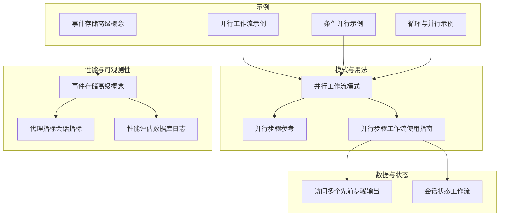
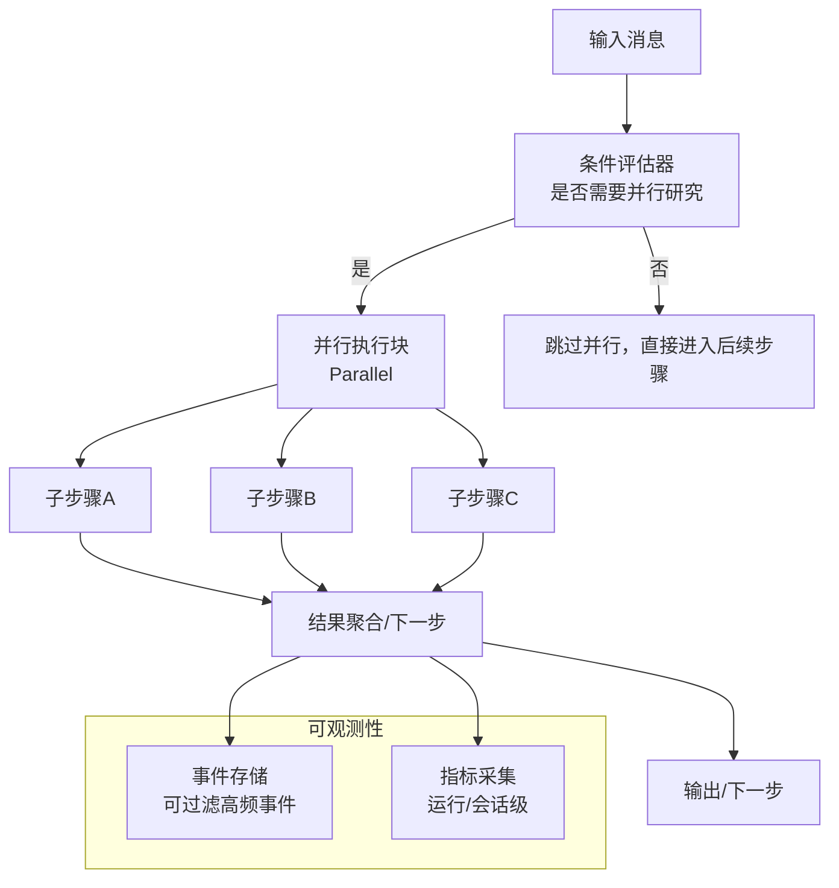
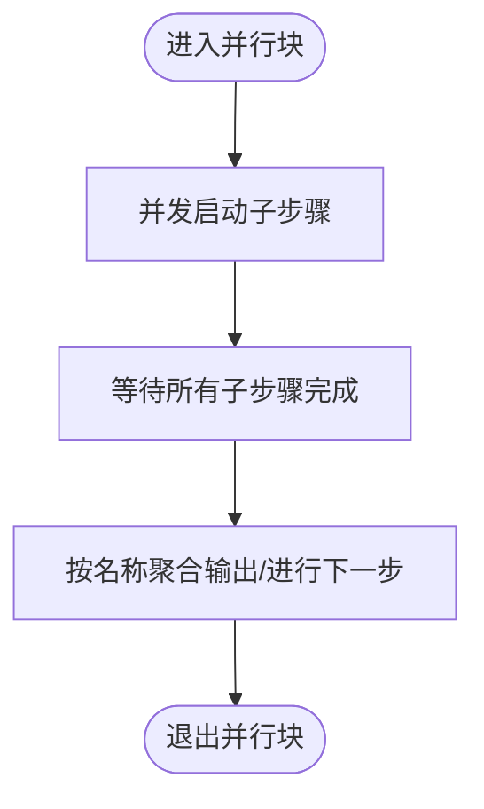
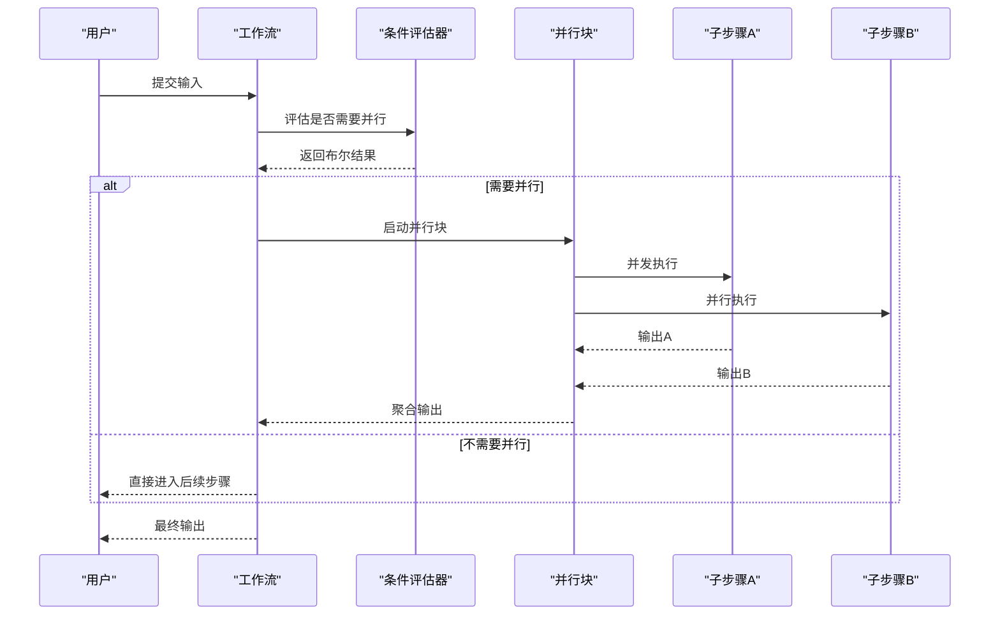
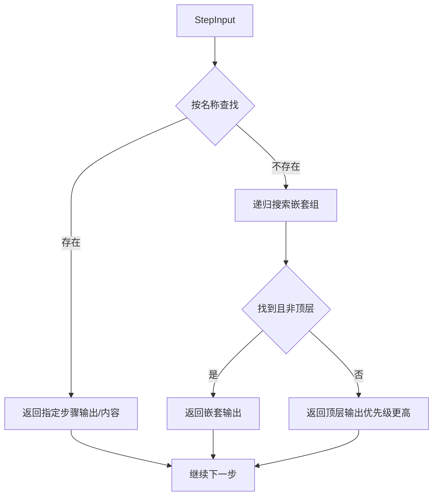
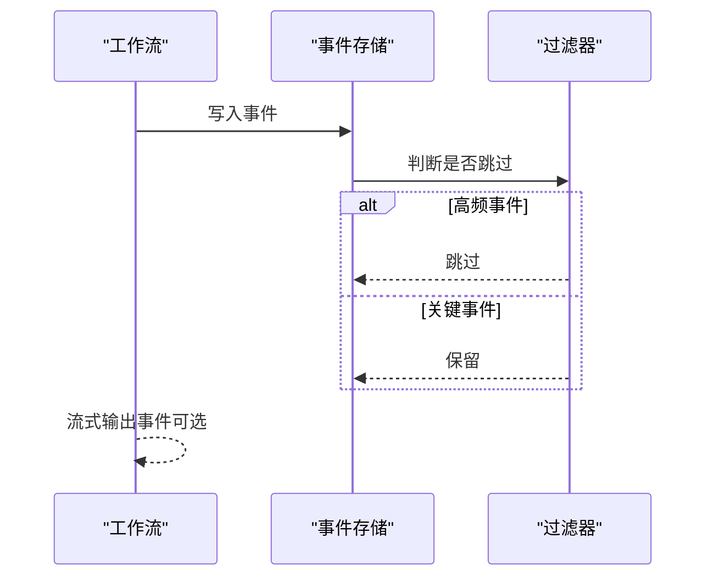
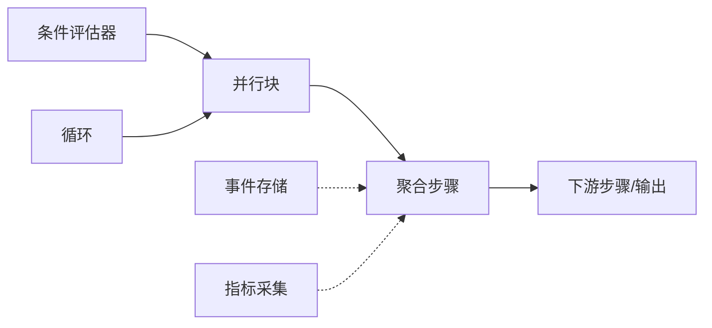

# 并行优化

<cite>
**本文引用的文件**
- [并行工作流（示例）](file://examples/workflows/parallel-execution/parallel-basic.mdx)
- [条件并行（示例）](file://examples/workflows/parallel-execution/parallel-with-condition.mdx)
- [并行工作流（模式）](file://workflows/workflow-patterns/parallel-workflow.mdx)
- [并行步骤参考](file://reference/workflows/parallel-steps.mdx)
- [并行步骤工作流（使用指南）](file://workflows/usage/parallel-steps-workflow.mdx)
- [访问多个先前步骤输出](file://workflows/access-previous-steps.mdx)
- [事件存储（高级概念）](file://examples/workflows/advanced-concepts/run-control/event-storage.mdx)
- [循环与并行（示例）](file://examples/workflows/loop-execution/loop-with-parallel.mdx)
- [会话状态（工作流）](file://state/workflows/overview.mdx)
- [团队执行风格](file://_snippets/team-execution-style.mdx)
- [延迟与错误处理（团队）](file://teams/delegation.mdx)
- [性能评估（数据库日志）](file://examples/evals/performance/db-logging.mdx)
- [代理指标（会话指标）](file://sessions/metrics/agent.mdx)
</cite>

## 目录
1. [简介](#简介)
2. [项目结构](#项目结构)
3. [核心组件](#核心组件)
4. [架构总览](#架构总览)
5. [详细组件分析](#详细组件分析)
6. [依赖关系分析](#依赖关系分析)
7. [性能考量](#性能考量)
8. [故障排查指南](#故障排查指南)
9. [结论](#结论)
10. [附录](#附录)

## 简介
本技术文档围绕工作流并行优化展开，系统阐述并行步骤的配置方法、执行策略、条件并行的实现原理与场景、资源分配与负载均衡、性能监控与调优、并行步骤间通信与数据共享、错误隔离与故障恢复，以及面向大规模并行处理的架构设计模式与成本控制策略。文档以仓库中的并行工作流示例与参考文档为基础，结合会话状态、事件存储、指标采集等能力，给出可操作的实践建议。

## 项目结构
并行优化相关内容主要分布在以下区域：
- 示例：并行基础、条件并行、循环与并行、事件存储等示例文档
- 模式与用法：并行工作流模式、并行步骤参考、并行步骤工作流用法
- 数据与状态：访问多个先前步骤输出、会话状态概述
- 性能与可观测性：事件存储示例、代理指标、性能评估示例

**图表来源**
- [并行工作流（示例）:1-87](file://examples/workflows/parallel-execution/parallel-basic.mdx#L1-L87)
- [条件并行（示例）:1-202](file://examples/workflows/parallel-execution/parallel-with-condition.mdx#L1-L202)
- [并行工作流（模式）:1-54](file://workflows/workflow-patterns/parallel-workflow.mdx#L1-L54)
- [并行步骤参考:1-10](file://reference/workflows/parallel-steps.mdx#L1-L10)
- [并行步骤工作流（使用指南）:1-47](file://workflows/usage/parallel-steps-workflow.mdx#L1-L47)
- [访问多个先前步骤输出:1-167](file://workflows/access-previous-steps.mdx#L1-L167)
- [会话状态（工作流）:1-39](file://state/workflows/overview.mdx#L1-L39)
- [事件存储（高级概念）:1-167](file://examples/workflows/advanced-concepts/run-control/event-storage.mdx#L1-L167)
- [代理指标（会话指标）:1-36](file://sessions/metrics/agent.mdx#L1-L36)
- [性能评估（数据库日志）:38-67](file://examples/evals/performance/db-logging.mdx#L38-L67)

**章节来源**
- [并行工作流（示例）:1-87](file://examples/workflows/parallel-execution/parallel-basic.mdx#L1-L87)
- [并行工作流（模式）:1-54](file://workflows/workflow-patterns/parallel-workflow.mdx#L1-L54)
- [并行步骤参考:1-10](file://reference/workflows/parallel-steps.mdx#L1-L10)
- [并行步骤工作流（使用指南）:1-47](file://workflows/usage/parallel-steps-workflow.mdx#L1-L47)
- [访问多个先前步骤输出:1-167](file://workflows/access-previous-steps.mdx#L1-L167)
- [会话状态（工作流）:1-39](file://state/workflows/overview.mdx#L1-L39)
- [事件存储（高级概念）:1-167](file://examples/workflows/advanced-concepts/run-control/event-storage.mdx#L1-L167)
- [代理指标（会话指标）:1-36](file://sessions/metrics/agent.mdx#L1-L36)
- [性能评估（数据库日志）:38-67](file://examples/evals/performance/db-logging.mdx#L38-L67)

## 核心组件
- 并行步骤（Parallel）
  - 用于将一组独立的子步骤并行执行，提升整体吞吐与缩短端到端时延
  - 支持命名与描述，便于调试与可观测性
  - 参考参数与行为见并行步骤参考
- 条件并行（Condition + Parallel）
  - 在满足条件时并行执行多个研究或处理分支，否则跳过
  - 适合根据输入主题或上下文动态选择并行路径
- 步骤间数据共享与聚合
  - 通过 StepInput 访问前序步骤输出，支持直接按名称访问嵌套在 Parallel/Condition/Routes/Loops 中的步骤
  - 并行组整体输出以字典形式返回，键为子步骤名
- 会话状态（Workflow Session State）
  - 在并行步骤中更新共享状态需注意并发写入协调，避免竞态
- 事件存储与运行时观测
  - 可配置存储事件并过滤高频率事件，便于回放与审计
- 指标与性能评估
  - 获取每轮运行、会话级指标，辅助成本与性能分析

**章节来源**
- [并行步骤参考:1-10](file://reference/workflows/parallel-steps.mdx#L1-L10)
- [并行工作流（模式）:42-54](file://workflows/workflow-patterns/parallel-workflow.mdx#L42-L54)
- [访问多个先前步骤输出:68-167](file://workflows/access-previous-steps.mdx#L68-L167)
- [会话状态（工作流）:1-39](file://state/workflows/overview.mdx#L1-L39)
- [事件存储（高级概念）:117-152](file://examples/workflows/advanced-concepts/run-control/event-storage.mdx#L117-L152)
- [代理指标（会话指标）:1-36](file://sessions/metrics/agent.mdx#L1-L36)

## 架构总览
下图展示了并行工作流在“条件触发 + 并行执行 + 结果聚合”的典型路径，并标注了事件存储与指标采集的关键节点。

**图表来源**
- [条件并行（示例）:138-165](file://examples/workflows/parallel-execution/parallel-with-condition.mdx#L138-L165)
- [并行工作流（示例）:39-46](file://examples/workflows/parallel-execution/parallel-basic.mdx#L39-L46)
- [事件存储（高级概念）:117-152](file://examples/workflows/advanced-concepts/run-control/event-storage.mdx#L117-L152)
- [代理指标（会话指标）:1-36](file://sessions/metrics/agent.mdx#L1-L36)

## 详细组件分析

### 组件A：并行步骤（Parallel）
- 配置要点
  - 将多个独立 Step 作为可变参数传入 Parallel
  - 建议为并行块与子步骤命名，增强可观测性
- 执行策略
  - 子步骤在同一执行通道内并发启动，等待全部完成再进入后续步骤
  - 若子步骤间无依赖，可显著降低总时延
- 数据共享与聚合
  - 后续步骤可通过 StepInput 按名称访问各子步骤输出
  - 并行块整体输出为字典，键为子步骤名
- 资源与负载
  - 并行度越高，对模型/工具/网络等资源的并发占用越大
  - 建议根据资源配额与限速策略调整并行度

**图表来源**
- [并行工作流（示例）:39-46](file://examples/workflows/parallel-execution/parallel-basic.mdx#L39-L46)
- [访问多个先前步骤输出:152-164](file://workflows/access-previous-steps.mdx#L152-L164)

**章节来源**
- [并行工作流（示例）:39-46](file://examples/workflows/parallel-execution/parallel-basic.mdx#L39-L46)
- [并行工作流（模式）:21-40](file://workflows/workflow-patterns/parallel-workflow.mdx#L21-L40)
- [访问多个先前步骤输出:72-101](file://workflows/access-previous-steps.mdx#L72-L101)

### 组件B：条件并行（Condition + Parallel）
- 实现原理
  - 使用 Condition 的 evaluator 决定是否进入并行分支
  - 进入后，Parallel 并发执行多个研究或处理步骤
- 应用场景
  - 主题相关性判断：仅当话题具备“技术/研究”特征时才进行多源并行研究
  - 动态路由：根据输入关键词/历史上下文决定是否启用并行
- 执行序列

**图表来源**
- [条件并行（示例）:138-165](file://examples/workflows/parallel-execution/parallel-with-condition.mdx#L138-L165)

**章节来源**
- [条件并行（示例）:94-133](file://examples/workflows/parallel-execution/parallel-with-condition.mdx#L94-L133)
- [条件并行（示例）:138-165](file://examples/workflows/parallel-execution/parallel-with-condition.mdx#L138-L165)

### 组件C：步骤间通信与数据共享
- 直接访问并行组内子步骤
  - 通过 StepInput.get_step_output()/get_step_content() 按名称访问
  - 并行组整体可通过名称访问，返回字典
- 递归搜索与优先级
  - 支持在任意嵌套层级查找步骤
  - 当同名步骤同时存在于顶层与嵌套组时，优先返回顶层
- 与自定义函数协作
  - 自定义函数可从 StepInput 获取所需数据，实现灵活的数据编排

**图表来源**
- [访问多个先前步骤输出:68-150](file://workflows/access-previous-steps.mdx#L68-L150)

**章节来源**
- [访问多个先前步骤输出:68-167](file://workflows/access-previous-steps.mdx#L68-L167)

### 组件D：会话状态与并发写入协调
- 会话状态的作用
  - 在工作流全链路共享与持久化状态，支持跨 Agent、Team、自定义函数
- 并行场景下的注意事项
  - 多个子步骤可能同时更新共享状态，需加锁或采用无冲突更新策略
  - 建议将状态更新集中在单一聚合步骤中进行

**章节来源**
- [会话状态（工作流）:1-39](file://state/workflows/overview.mdx#L1-L39)
- [并行工作流（模式）:42-46](file://workflows/workflow-patterns/parallel-workflow.mdx#L42-L46)

### 组件E：事件存储与运行时观测
- 事件存储
  - 可开启事件存储，并通过 events_to_skip 过滤高频事件，降低存储开销
  - 支持流式事件输出，便于实时观测
- 事件类型示例
  - 工作流运行事件、运行事件、工具调用事件等
- 与并行块的交互
  - 可选择保留/跳过并行执行开始/结束事件，平衡可观测性与成本

**图表来源**
- [事件存储（高级概念）:80-152](file://examples/workflows/advanced-concepts/run-control/event-storage.mdx#L80-L152)

**章节来源**
- [事件存储（高级概念）:80-152](file://examples/workflows/advanced-concepts/run-control/event-storage.mdx#L80-L152)

### 组件F：指标与性能评估
- 指标维度
  - 每条消息、每次运行、每个会话的指标均可获取
  - 包括 token 使用、耗时等关键指标
- 性能评估
  - 可通过评估器设置迭代次数、预热轮次，稳定测量基线
- 并行场景下的应用
  - 对比串行与并行的端到端时延、吞吐与成本
  - 分析不同并行度下的资源占用与稳定性

**章节来源**
- [代理指标（会话指标）:1-36](file://sessions/metrics/agent.mdx#L1-L36)
- [性能评估（数据库日志）:38-67](file://examples/evals/performance/db-logging.mdx#L38-L67)

## 依赖关系分析
- 组件耦合
  - 并行块与后续步骤之间为弱耦合（无强依赖），但需要通过 StepInput 获取输出
  - 条件并行引入条件评估器作为外部依赖
- 外部依赖
  - 指标与事件存储依赖数据库/存储后端
  - 并行度受限于模型/工具/网络等外部资源的并发能力
- 循环与并行
  - 循环与并行可组合使用，形成“多次迭代 + 每轮内部并行”的模式

**图表来源**
- [条件并行（示例）:138-165](file://examples/workflows/parallel-execution/parallel-with-condition.mdx#L138-L165)
- [循环与并行（示例）:135-166](file://examples/workflows/loop-execution/loop-with-parallel.mdx#L135-L166)
- [事件存储（高级概念）:117-152](file://examples/workflows/advanced-concepts/run-control/event-storage.mdx#L117-L152)
- [代理指标（会话指标）:1-36](file://sessions/metrics/agent.mdx#L1-L36)

**章节来源**
- [条件并行（示例）:138-165](file://examples/workflows/parallel-execution/parallel-with-condition.mdx#L138-L165)
- [循环与并行（示例）:135-166](file://examples/workflows/loop-execution/loop-with-parallel.mdx#L135-L166)

## 性能考量
- 并行度与资源配额
  - 根据模型/工具/网络带宽设定最大并发数，避免资源争抢导致抖动
- 事件存储成本
  - 对高频事件进行过滤，仅保留关键事件，降低存储与查询成本
- 指标驱动优化
  - 通过运行/会话级指标对比不同并行度的吞吐与时延，寻找最优配置
- 流式输出与可观测性
  - 在保证可观测性的前提下，减少不必要的中间事件，降低传输与解析开销

**章节来源**
- [事件存储（高级概念）:80-152](file://examples/workflows/advanced-concepts/run-control/event-storage.mdx#L80-L152)
- [代理指标（会话指标）:1-36](file://sessions/metrics/agent.mdx#L1-L36)
- [性能评估（数据库日志）:38-67](file://examples/evals/performance/db-logging.mdx#L38-L67)

## 故障排查指南
- 并行步骤失败
  - 观察事件存储中的并行执行事件，定位失败子步骤
  - 检查工具/模型调用是否超时或限流
- 会话状态异常
  - 并行写入可能引发竞态，建议集中聚合后再写入
- 团队执行风格的并行参考
  - 团队的 broadcast 模式与工作流的并行类似，均强调成员并发执行与合成阶段的延迟与容错

**章节来源**
- [事件存储（高级概念）:117-152](file://examples/workflows/advanced-concepts/run-control/event-storage.mdx#L117-L152)
- [会话状态（工作流）:1-39](file://state/workflows/overview.mdx#L1-L39)
- [团队执行风格:1-6](file://_snippets/team-execution-style.mdx#L1-L6)
- [延迟与错误处理（团队）:280-299](file://teams/delegation.mdx#L280-L299)

## 结论
通过合理配置并行步骤、结合条件并行实现自适应路径、利用事件存储与指标体系进行可观测性与成本控制，可在不牺牲确定性结果的前提下显著提升工作流吞吐与效率。在大规模并行场景中，应重点关注资源配额、事件过滤、指标对比与错误隔离策略，确保系统稳定与可控。

## 附录
- 快速上手
  - 并行基础：参考并行工作流示例，理解基本语法与运行方式
  - 条件并行：参考条件并行示例，掌握动态路由与并行结合
  - 数据共享：参考访问多个先前步骤输出，学习如何在聚合步骤中整合并行结果
  - 观测与成本：参考事件存储与指标示例，建立可观测性与成本控制闭环

**章节来源**
- [并行工作流（示例）:1-87](file://examples/workflows/parallel-execution/parallel-basic.mdx#L1-L87)
- [条件并行（示例）:1-202](file://examples/workflows/parallel-execution/parallel-with-condition.mdx#L1-L202)
- [访问多个先前步骤输出:1-167](file://workflows/access-previous-steps.mdx#L1-L167)
- [事件存储（高级概念）:1-167](file://examples/workflows/advanced-concepts/run-control/event-storage.mdx#L1-L167)
- [代理指标（会话指标）:1-36](file://sessions/metrics/agent.mdx#L1-L36)