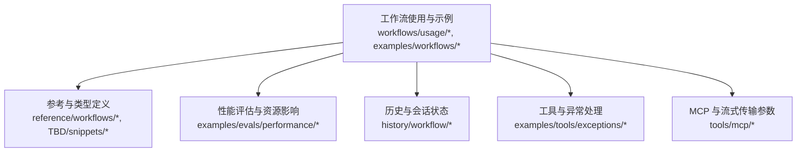
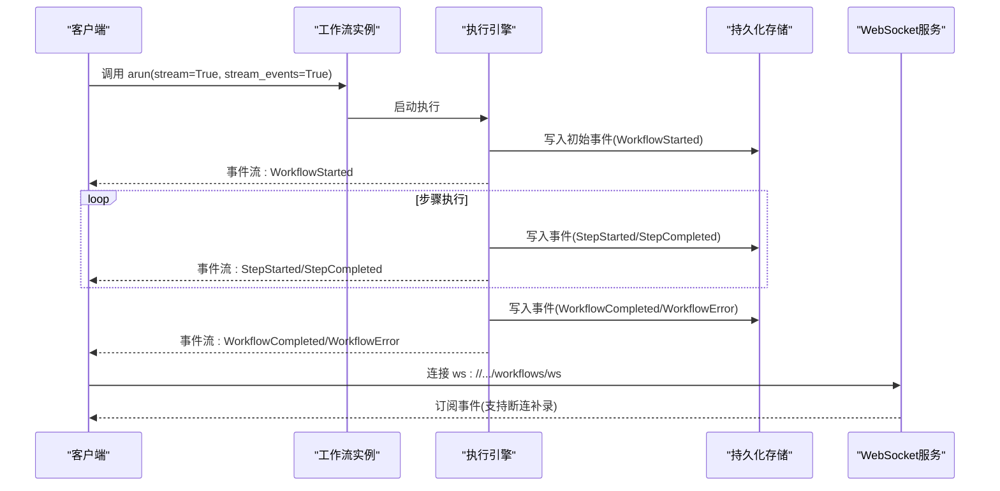
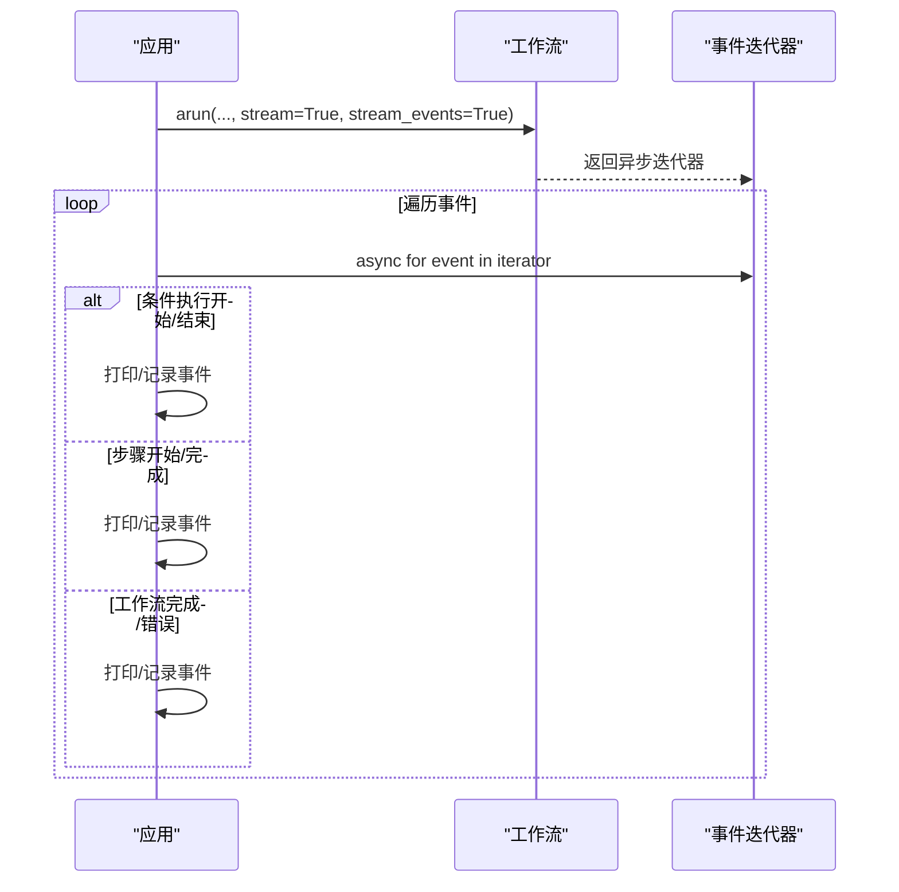
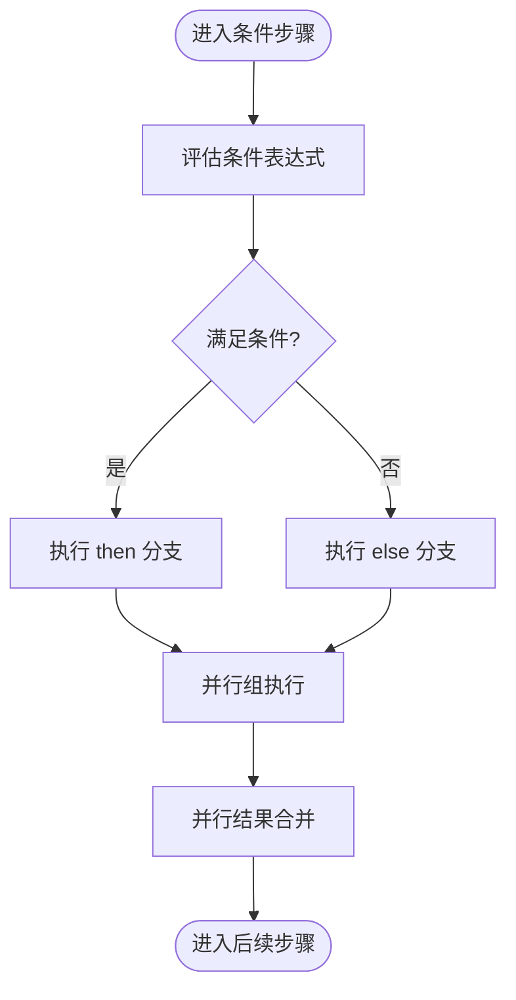
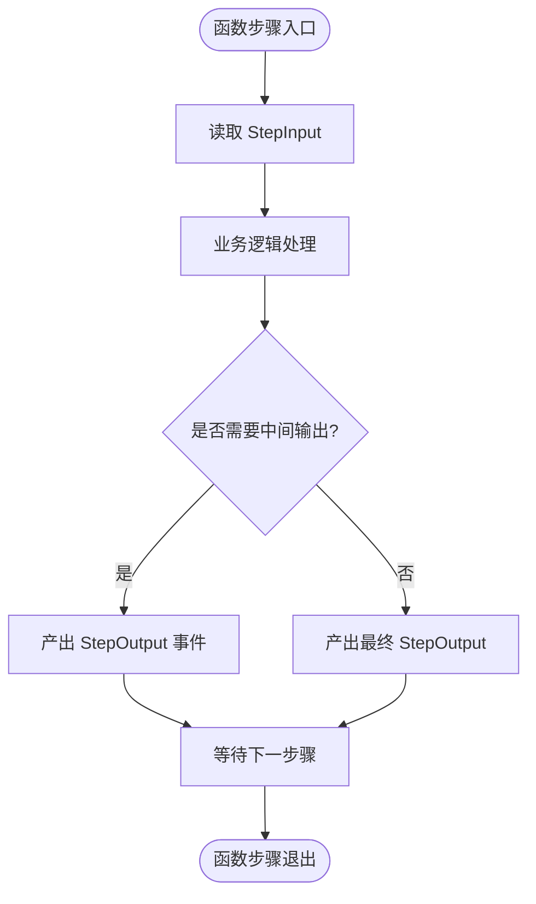
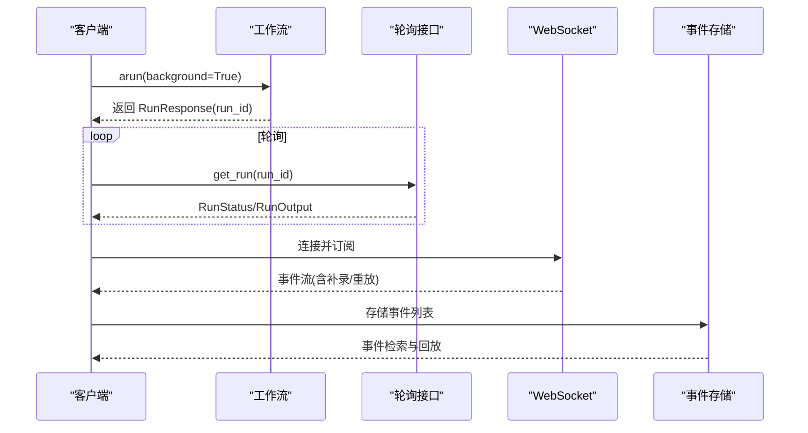
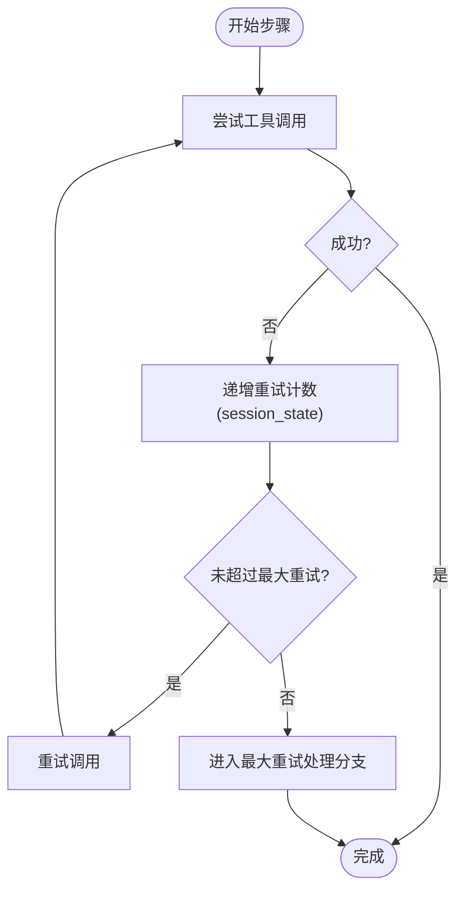
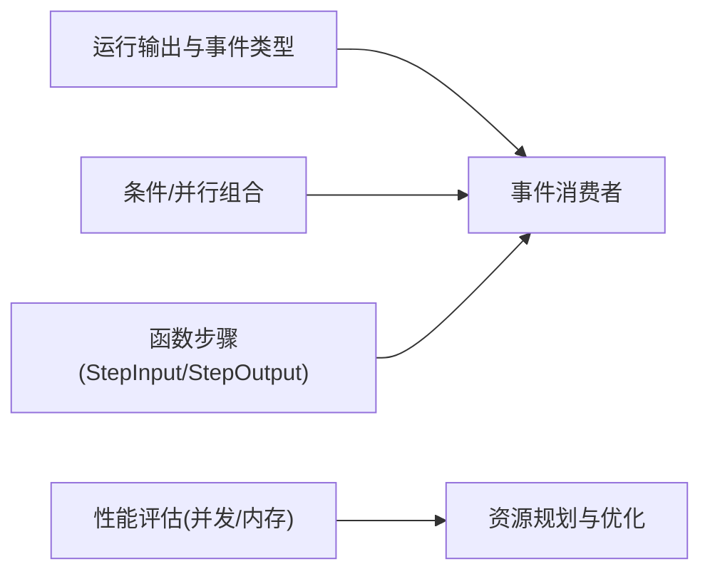

# 异步处理

<cite>
**本文引用的文件**
- [异步事件流式传输](file://workflows/usage/async-events-streaming.mdx)
- [运行工作流](file://workflows/running-workflows.mdx)
- [后台执行](file://workflows/background-execution.mdx)
- [事件存储](file://examples/workflows/advanced-concepts/run-control/event-storage.mdx)
- [长时运行：断连与补录](file://examples/workflows/advanced-concepts/long-running/disruption-catchup.mdx)
- [事件回放](file://examples/workflows/advanced-concepts/long-running/events-replay.mdx)
- [WebSocket 重连](file://examples/workflows/advanced-concepts/long-running/websocket-reconnect.mdx)
- [并行与条件组合](file://examples/workflows/parallel-execution/parallel-with-condition.mdx)
- [条件与并行组合](file://examples/workflows/conditional-execution/condition-with-parallel.mdx)
- [工作流运行输出与事件](file://reference/workflows/run-output.mdx)
- [工作流取消事件](file://TBD/snippets/workflow-cancelled-event.mdx)
- [工作流完成事件](file://_snippets/workflow-completed-event.mdx)
- [工具异常：重试调用](file://examples/tools/exceptions/retry-tool-call.mdx)
- [CEL 表达式：会话状态重试逻辑](file://examples/workflows/cel-expressions/condition/cel-session-state.mdx)
- [性能评估：团队响应（含内存）](file://examples/evals/performance/team-response-with-memory-and-reasoning.mdx)
- [性能评估：团队响应（多用户）](file://examples/evals/performance/team-response-with-memory-multi-user.mdx)
- [性能评估：团队响应（简单）](file://examples/evals/performance/team-response-with-memory-simple.mdx)
- [MCP 服务器参数](file://tools/mcp/server-params.mdx)
- [构建工作流](file://workflows/building-workflows.mdx)
- [自定义函数步骤工作流模式](file://workflows/workflow-patterns/custom-function-step-workflow.mdx)
- [工作流历史概览](file://history/workflow/overview.mdx)
</cite>

## 目录
1. [简介](#简介)
2. [项目结构](#项目结构)
3. [核心组件](#核心组件)
4. [架构总览](#架构总览)
5. [详细组件分析](#详细组件分析)
6. [依赖关系分析](#依赖关系分析)
7. [性能考量](#性能考量)
8. [故障排查指南](#故障排查指南)
9. [结论](#结论)
10. [附录](#附录)

## 简介
本技术文档聚焦于工作流的异步处理能力，系统阐述事件流式工作机制、条件步骤与并行步骤的流式配置、函数步骤的流式执行模式、性能优化与资源管理策略、事件捕获与处理示例、流式数据的缓冲与背压处理、监控与调试方法，以及错误恢复与重试机制的实现要点。文档以仓库中的示例与参考材料为依据，提供可操作的实践路径与可视化图示。

## 项目结构
围绕异步处理主题，相关知识与示例主要分布在以下区域：
- 工作流使用与示例：workflows/usage、examples/workflows
- 参考与类型定义：reference/workflows、TBD/snippets
- 性能评估与资源影响：examples/evals/performance
- 历史与会话状态：history/workflow
- 工具与异常处理：examples/tools/exceptions
- MCP 与流式传输参数：tools/mcp

## 核心组件
- 工作流运行输出与事件模型：提供统一的事件类型与字段，支持事件流式消费、存储与回放。
- 异步事件流式传输：通过 arun(stream=True, stream_events=True) 获取事件流，按阶段输出事件。
- 后台执行与轮询：支持后台启动与轮询查询，或通过 WebSocket 实时订阅事件。
- 条件与并行组合：在流式场景下，条件分支与并行组的事件语义与顺序控制。
- 函数步骤的流式执行：自定义函数作为步骤执行器，返回 StepOutput 或异步生成器，参与事件流。
- 错误恢复与重试：结合会话状态与 CEL 表达式，实现可控的重试与终止策略。
- 性能与资源管理：通过性能评估示例观察内存增长与并发影响，指导资源配置。

**章节来源**
- [工作流运行输出与事件:1-221](file://reference/workflows/run-output.mdx#L1-L221)
- [异步事件流式传输:1-141](file://workflows/usage/async-events-streaming.mdx#L1-L141)
- [运行工作流:420-488](file://workflows/running-workflows.mdx#L420-L488)
- [后台执行:83-137](file://workflows/background-execution.mdx#L83-L137)

## 架构总览
下图展示了从触发到事件流产出的整体流程，包括同步/异步运行、事件流式输出、后台轮询与 WebSocket 订阅等路径。

**图表来源**
- [异步事件流式传输:94-138](file://workflows/usage/async-events-streaming.mdx#L94-L138)
- [运行工作流:420-488](file://workflows/running-workflows.mdx#L420-L488)
- [长时运行：断连与补录:46-196](file://examples/workflows/advanced-concepts/long-running/disruption-catchup.mdx#L46-L196)
- [WebSocket 重连:170-230](file://examples/workflows/advanced-concepts/long-running/websocket-reconnect.mdx#L170-L230)

## 详细组件分析

### 事件流式传输与消费
- 触发方式：通过 arun(...) 启动，设置 stream=True 与 stream_events=True，返回异步迭代器。
- 事件类型：包含工作流级事件（如 WorkflowStarted、WorkflowCompleted）、步骤级事件（StepStarted、StepCompleted）与条件执行事件等。
- 消费模式：逐个事件消费，根据事件类型进行分支处理与日志输出。

**图表来源**
- [异步事件流式传输:110-135](file://workflows/usage/async-events-streaming.mdx#L110-L135)

**章节来源**
- [异步事件流式传输:8-141](file://workflows/usage/async-events-streaming.mdx#L8-L141)
- [运行工作流:420-488](file://workflows/running-workflows.mdx#L420-L488)

### 条件步骤与并行步骤的流式配置
- 条件步骤：在流式执行中，条件评估开始与结束分别对应独立事件，便于感知分支选择过程。
- 并行步骤：并行组内部的多个子步骤并行执行，完成后汇总结果；在事件层面，可观察到 StepsExecutionStarted/Completed 等事件，用于定位并行组的执行进度与结果集合。
- 组合场景：条件与并行可嵌套组合，事件流帮助理解执行拓扑与顺序。

**图表来源**
- [并行与条件组合:167-201](file://examples/workflows/parallel-execution/parallel-with-condition.mdx#L167-L201)
- [条件与并行组合:161-203](file://examples/workflows/conditional-execution/condition-with-parallel.mdx#L161-L203)

**章节来源**
- [并行与条件组合:167-201](file://examples/workflows/parallel-execution/parallel-with-condition.mdx#L167-L201)
- [条件与并行组合:161-203](file://examples/workflows/conditional-execution/condition-with-parallel.mdx#L161-L203)

### 函数步骤的流式执行模式
- 自定义函数作为步骤执行器：接收 StepInput，返回 StepOutput，或作为异步生成器逐步产出中间结果。
- 事件集成：当函数步骤参与事件流时，其输出事件将被纳入整体事件序列，便于监控与审计。
- 数据流控制：通过 StepInput/StepOutput 接口，实现输入预处理、中间态输出与后处理。

**图表来源**
- [自定义函数步骤工作流模式:1-34](file://workflows/workflow-patterns/custom-function-step-workflow.mdx#L1-L34)
- [构建工作流:1-16](file://workflows/building-workflows.mdx#L1-L16)

**章节来源**
- [自定义函数步骤工作流模式:1-34](file://workflows/workflow-patterns/custom-function-step-workflow.mdx#L1-L34)
- [构建工作流:1-16](file://workflows/building-workflows.mdx#L1-L16)

### 后台执行与轮询/订阅
- 后台执行：arun(background=True) 立即返回 RunResponse，随后通过轮询 get_run(run_id) 查询状态。
- WebSocket 订阅：连接 ws://.../workflows/ws，接收实时事件，支持断连补录与重放通知。
- 事件存储：可将事件持久化以便离线分析与回放。

**图表来源**
- [后台执行:83-137](file://workflows/background-execution.mdx#L83-L137)
- [事件存储:150-166](file://examples/workflows/advanced-concepts/run-control/event-storage.mdx#L150-L166)
- [长时运行：断连与补录:46-196](file://examples/workflows/advanced-concepts/long-running/disruption-catchup.mdx#L46-L196)
- [WebSocket 重连:170-230](file://examples/workflows/advanced-concepts/long-running/websocket-reconnect.mdx#L170-L230)

**章节来源**
- [后台执行:83-137](file://workflows/background-execution.mdx#L83-L137)
- [事件存储:150-166](file://examples/workflows/advanced-concepts/run-control/event-storage.mdx#L150-L166)
- [长时运行：断连与补录:46-196](file://examples/workflows/advanced-concepts/long-running/disruption-catchup.mdx#L46-L196)
- [WebSocket 重连:170-230](file://examples/workflows/advanced-concepts/long-running/websocket-reconnect.mdx#L170-L230)

### 流式数据的缓冲与背压处理
- 事件流消费者应采用异步消费，避免阻塞执行引擎。
- 对高吞吐事件流，建议：
  - 使用异步迭代器逐条处理事件，减少内存占用。
  - 在消费者侧引入背压策略（如限速、批量处理、丢弃过期事件）。
  - 利用 WebSocket 的断连补录与重放能力，确保事件完整性。
- SSE/Streamable HTTP 参数可用于控制连接超时与读取超时，降低资源占用。

**章节来源**
- [MCP 服务器参数:26-37](file://tools/mcp/server-params.mdx#L26-L37)
- [WebSocket 重连:170-230](file://examples/workflows/advanced-concepts/long-running/websocket-reconnect.mdx#L170-L230)

### 监控与调试方法
- 事件字段：所有事件均包含 created_at、event、workflow_id/name、session_id、run_id、step_id/parent_step_id 等通用字段，便于关联与追踪。
- 完成事件：WorkflowCompleted 包含 content、content_type、step_results、metadata 等关键信息。
- 取消事件：WorkflowCancelled 包含 reason 字段，便于定位取消原因。
- 历史与会话状态：可通过会话状态与历史开关控制事件体量，避免上下文窗口膨胀。

**章节来源**
- [工作流运行输出与事件:1-221](file://reference/workflows/run-output.mdx#L1-L221)
- [工作流完成事件:1-8](file://_snippets/workflow-completed-event.mdx#L1-L8)
- [工作流取消事件:1-6](file://TBD/snippets/workflow-cancelled-event.mdx#L1-L6)
- [工作流历史概览:108-141](file://history/workflow/overview.mdx#L108-L141)

### 错误恢复与重试机制
- 工具层重试：在工具调用失败时，利用后置钩子或会话状态实现自动重试与上限控制。
- CEL 表达式重试：通过会话状态计数与条件判断，实现可控的重试与兜底分支。
- 终止条件：针对不可恢复错误设置显式停止条件，防止循环执行。

**图表来源**
- [CEL 表达式：会话状态重试逻辑:77-94](file://examples/workflows/cel-expressions/condition/cel-session-state.mdx#L77-L94)
- [工具异常：重试调用:41-82](file://examples/tools/exceptions/retry-tool-call.mdx#L41-L82)

**章节来源**
- [CEL 表达式：会话状态重试逻辑:38-120](file://examples/workflows/cel-expressions/condition/cel-session-state.mdx#L38-L120)
- [工具异常：重试调用:41-82](file://examples/tools/exceptions/retry-tool-call.mdx#L41-L82)

## 依赖关系分析
- 工作流运行输出与事件类型定义为事件流消费提供契约，保证不同执行路径（同步/异步/后台/WebSocket）的一致性。
- 条件与并行组合依赖事件流来反映执行拓扑与进度。
- 函数步骤通过 StepInput/StepOutput 接口与事件流解耦，便于扩展与测试。
- 性能评估示例揭示了并发与内存增长对系统的影响，指导资源规划。

**图表来源**
- [工作流运行输出与事件:1-221](file://reference/workflows/run-output.mdx#L1-L221)
- [构建工作流:1-16](file://workflows/building-workflows.mdx#L1-L16)
- [性能评估：团队响应（含内存）:1087-1132](file://examples/evals/performance/team-response-with-memory-and-reasoning.mdx#L1087-L1132)

**章节来源**
- [工作流运行输出与事件:1-221](file://reference/workflows/run-output.mdx#L1-L221)
- [构建工作流:1-16](file://workflows/building-workflows.mdx#L1-L16)
- [性能评估：团队响应（含内存）:1087-1132](file://examples/evals/performance/team-response-with-memory-and-reasoning.mdx#L1087-L1132)

## 性能考量
- 并发与内存：多用户/多步骤并发执行可能带来内存增长，建议开启内存增长跟踪与前 N 分配定位。
- 事件体量控制：通过历史开关与历史数量限制，避免上下文窗口过大。
- 连接与读取超时：合理设置 SSE/Streamable HTTP 的超时参数，平衡延迟与资源占用。
- 轮询策略：后台执行建议使用指数退避与超时上限，避免无效轮询。

**章节来源**
- [性能评估：团队响应（含内存）:1087-1132](file://examples/evals/performance/team-response-with-memory-and-reasoning.mdx#L1087-L1132)
- [性能评估：团队响应（多用户）:135-172](file://examples/evals/performance/team-response-with-memory-multi-user.mdx#L135-L172)
- [性能评估：团队响应（简单）:91-127](file://examples/evals/performance/team-response-with-memory-simple.mdx#L91-L127)
- [MCP 服务器参数:26-37](file://tools/mcp/server-params.mdx#L26-L37)
- [工作流历史概览:123-141](file://history/workflow/overview.mdx#L123-L141)

## 故障排查指南
- 事件缺失与顺序：使用 WebSocket 订阅时，关注 catch_up 与 replay 事件，确认是否发生断连与补录。
- 事件索引一致性：检查事件索引连续性，确保无遗漏。
- 取消与错误：通过 WorkflowCancelled 与 WorkflowError 事件定位问题根因。
- 重试与终止：结合会话状态与 CEL 表达式，验证重试次数与终止条件是否生效。

**章节来源**
- [长时运行：断连与补录:46-196](file://examples/workflows/advanced-concepts/long-running/disruption-catchup.mdx#L46-L196)
- [WebSocket 重连:170-230](file://examples/workflows/advanced-concepts/long-running/websocket-reconnect.mdx#L170-L230)
- [工作流取消事件:1-6](file://TBD/snippets/workflow-cancelled-event.mdx#L1-L6)
- [工作流完成事件:1-8](file://_snippets/workflow-completed-event.mdx#L1-L8)

## 结论
通过事件流式传输、条件与并行组合、函数步骤的灵活接入、后台执行与 WebSocket 订阅、以及完善的错误恢复与性能优化策略，工作流系统能够在复杂业务场景下实现高可靠、可观测与高性能的异步处理。建议在生产环境中结合事件存储与性能评估，持续优化资源与策略。

## 附录
- 示例与参考文件清单（按主题）
  - 异步事件流式传输：[异步事件流式传输:1-141](file://workflows/usage/async-events-streaming.mdx#L1-L141)
  - 运行工作流与事件类型：[运行工作流:420-488](file://workflows/running-workflows.mdx#L420-L488)
  - 后台执行与轮询：[后台执行:83-137](file://workflows/background-execution.mdx#L83-L137)
  - 事件存储与回放：[事件存储:150-166](file://examples/workflows/advanced-concepts/run-control/event-storage.mdx#L150-L166)
  - 断连补录与 WebSocket 重连：[长时运行：断连与补录:46-196](file://examples/workflows/advanced-concepts/long-running/disruption-catchup.mdx#L46-L196), [WebSocket 重连:170-230](file://examples/workflows/advanced-concepts/long-running/websocket-reconnect.mdx#L170-L230)
  - 条件与并行组合：[并行与条件组合:167-201](file://examples/workflows/parallel-execution/parallel-with-condition.mdx#L167-L201), [条件与并行组合:161-203](file://examples/workflows/conditional-execution/condition-with-parallel.mdx#L161-L203)
  - 事件类型与字段：[工作流运行输出与事件:1-221](file://reference/workflows/run-output.mdx#L1-L221)
  - 取消与完成事件：[工作流取消事件:1-6](file://TBD/snippets/workflow-cancelled-event.mdx#L1-L6), [工作流完成事件:1-8](file://_snippets/workflow-completed-event.mdx#L1-L8)
  - 重试与终止：[CEL 表达式：会话状态重试逻辑:38-120](file://examples/workflows/cel-expressions/condition/cel-session-state.mdx#L38-L120), [工具异常：重试调用:41-82](file://examples/tools/exceptions/retry-tool-call.mdx#L41-L82)
  - 性能评估：[性能评估：团队响应（含内存）:1087-1132](file://examples/evals/performance/team-response-with-memory-and-reasoning.mdx#L1087-L1132), [性能评估：团队响应（多用户）:135-172](file://examples/evals/performance/team-response-with-memory-multi-user.mdx#L135-L172), [性能评估：团队响应（简单）:91-127](file://examples/evals/performance/team-response-with-memory-simple.mdx#L91-L127)
  - MCP 与流式传输参数：[MCP 服务器参数:26-37](file://tools/mcp/server-params.mdx#L26-L37)
  - 工作流构建与函数步骤：[构建工作流:1-16](file://workflows/building-workflows.mdx#L1-L16), [自定义函数步骤工作流模式:1-34](file://workflows/workflow-patterns/custom-function-step-workflow.mdx#L1-L34)
  - 历史与会话状态：[工作流历史概览:108-141](file://history/workflow/overview.mdx#L108-L141)