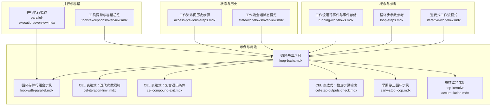
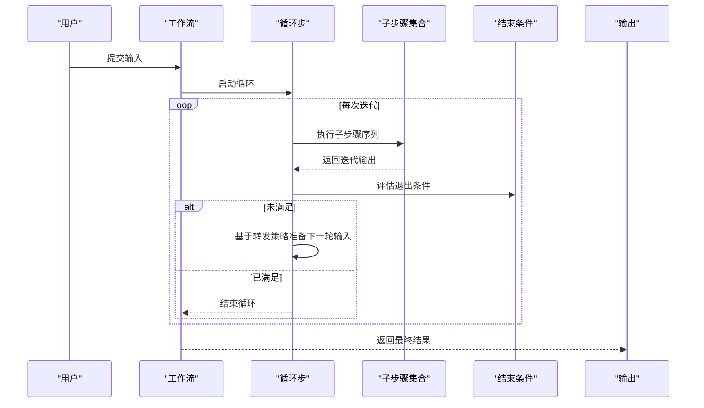
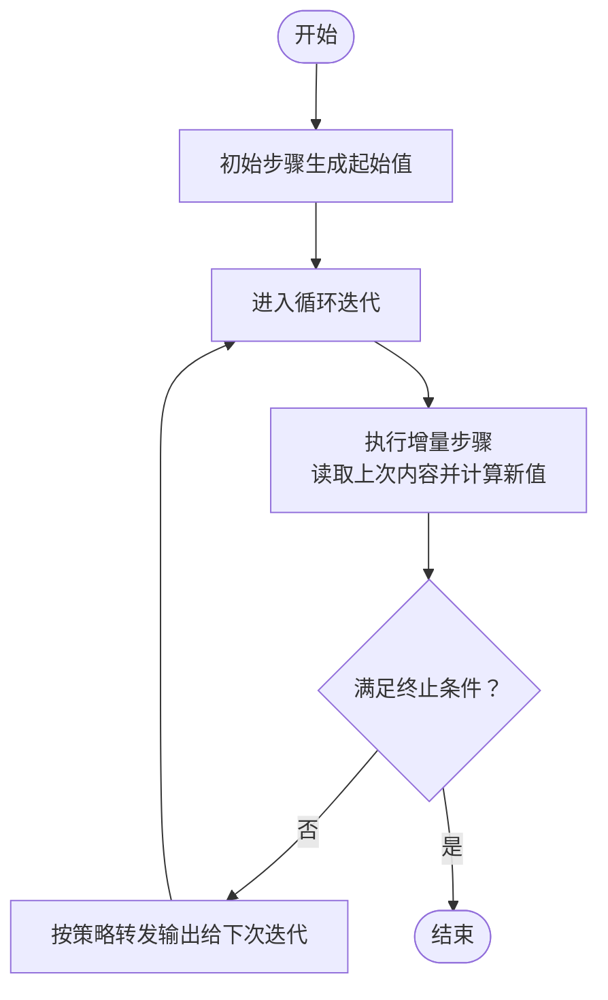
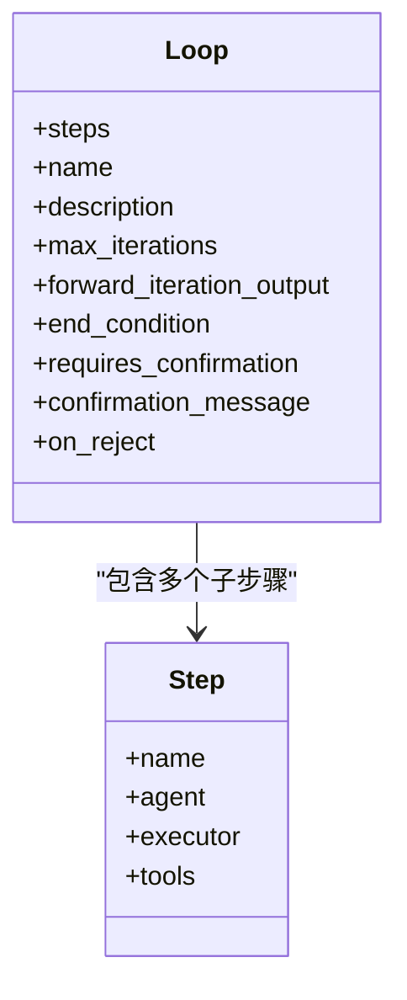
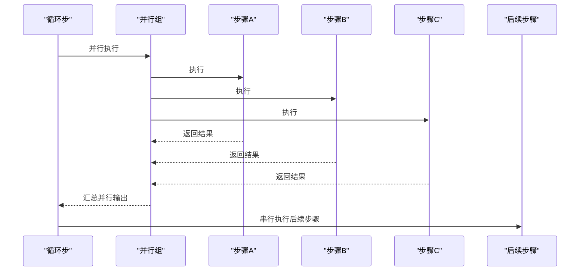
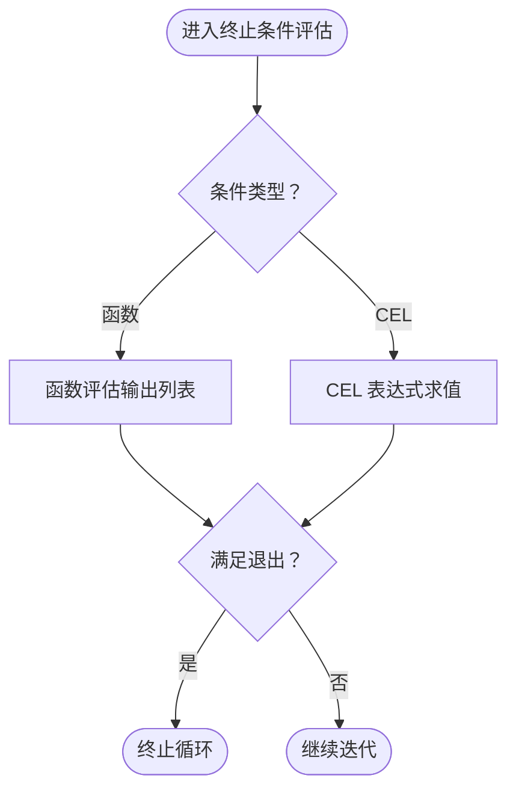
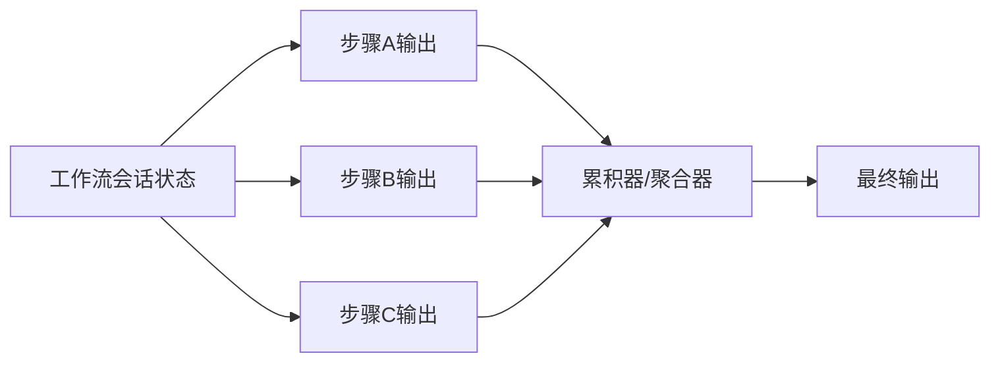
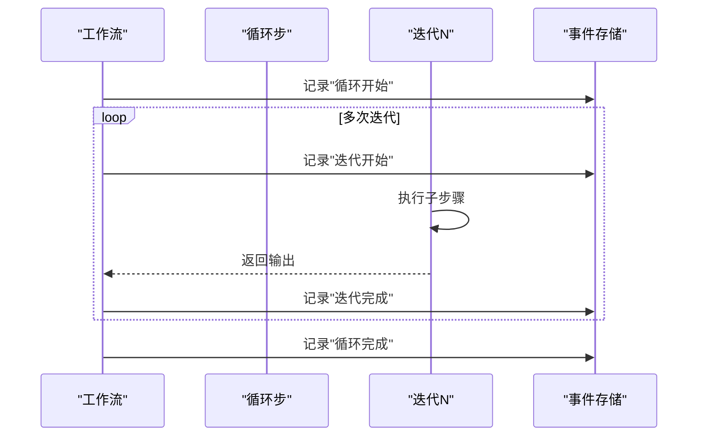
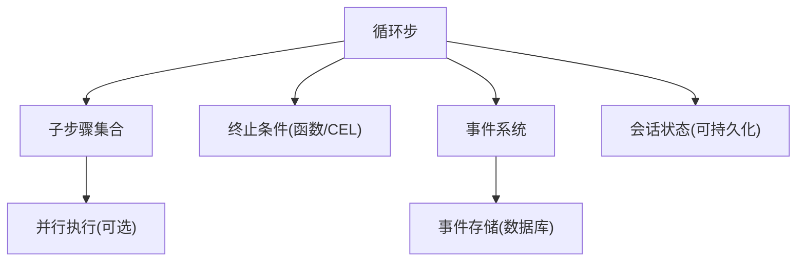

# 循环累积

<cite>
**本文引用的文件**
- [循环累积示例](file://workflows/usage/loop-iterative-accumulation.mdx)
- [迭代式工作流模式](file://workflows/workflow-patterns/iterative-workflow.mdx)
- [循环基础示例](file://examples/workflows/loop-execution/loop-basic.mdx)
- [循环与并行组合示例](file://examples/workflows/loop-execution/loop-with-parallel.mdx)
- [循环步参数参考](file://reference/workflows/loop-steps.mdx)
- [CEL 表达式：迭代次数限制](file://examples/workflows/cel-expressions/loop/cel-iteration-limit.mdx)
- [CEL 表达式：复合退出条件](file://examples/workflows/cel-expressions/loop/cel-compound-exit.mdx)
- [CEL 表达式：检查步骤输出](file://examples/workflows/cel-expressions/loop/cel-step-outputs-check.mdx)
- [工作流运行事件与事件存储](file://workflows/running-workflows.mdx)
- [早期停止循环示例](file://examples/workflows/advanced-concepts/early-stopping/early-stop-loop.mdx)
- [工作流会话状态概览](file://state/workflows/overview.mdx)
- [工作流访问历史步骤](file://workflows/access-previous-steps.mdx)
- [并行执行概述](file://examples/workflows/parallel-execution/overview.mdx)
- [工具异常与容错总览](file://examples/tools/exceptions/overview.mdx)
</cite>

## 目录
1. [引言](#引言)
2. [项目结构](#项目结构)
3. [核心组件](#核心组件)
4. [架构总览](#架构总览)
5. [详细组件分析](#详细组件分析)
6. [依赖关系分析](#依赖关系分析)
7. [性能考量](#性能考量)
8. [故障排查指南](#故障排查指南)
9. [结论](#结论)
10. [附录](#附录)

## 引言
本技术文档聚焦“工作流循环累积”能力，系统阐述迭代累积的工作原理、配置方法、控制逻辑与高级模式（循环与并行结合），并给出循环决策与终止条件的实现策略、累积状态管理与持久化、数据流与事件传播、性能优化与资源控制、错误处理与异常恢复，以及复杂业务场景的设计模式。读者可据此在工作流中构建高质量、可审计、可扩展的迭代式处理流程。

## 项目结构
围绕循环累积主题，知识库提供了从概念到实践的完整材料：
- 概念与模式：迭代式工作流、循环步参数、事件与存储
- 示例与用法：循环基础、循环与并行组合、CEL 条件表达式、早期停止
- 状态与历史：会话状态、历史步骤访问
- 并行与事件：并行执行、事件类型与存储策略
- 容错与异常：工具异常与重试、异常停止

图表来源
- [迭代式工作流模式:1-57](file://workflows/workflow-patterns/iterative-workflow.mdx#L1-L57)
- [循环步参数参考:1-16](file://reference/workflows/loop-steps.mdx#L1-L16)
- [工作流运行事件与事件存储:500-619](file://workflows/running-workflows.mdx#L500-L619)
- [循环基础示例:1-144](file://examples/workflows/loop-execution/loop-basic.mdx#L1-L144)
- [循环与并行组合示例:1-167](file://examples/workflows/loop-execution/loop-with-parallel.mdx#L1-L167)
- [CEL 表达式：迭代次数限制:37-78](file://examples/workflows/cel-expressions/loop/cel-iteration-limit.mdx#L37-L78)
- [CEL 表达式：复合退出条件:44-85](file://examples/workflows/cel-expressions/loop/cel-compound-exit.mdx#L44-L85)
- [CEL 表达式：检查步骤输出:47-89](file://examples/workflows/cel-expressions/loop/cel-step-outputs-check.mdx#L47-L89)
- [早期停止循环示例:1-143](file://examples/workflows/advanced-concepts/early-stopping/early-stop-loop.mdx#L1-L143)
- [循环累积示例:1-50](file://workflows/usage/loop-iterative-accumulation.mdx#L1-L50)
- [工作流会话状态概览:1-39](file://state/workflows/overview.mdx#L1-L39)
- [工作流访问历史步骤:72-154](file://workflows/access-previous-steps.mdx#L72-L154)
- [并行执行概述:1-9](file://examples/workflows/parallel-execution/overview.mdx#L1-L9)
- [工具异常与容错总览:1-13](file://examples/tools/exceptions/overview.mdx#L1-L13)

章节来源
- [循环累积示例:1-50](file://workflows/usage/loop-iterative-accumulation.mdx#L1-L50)
- [迭代式工作流模式:1-57](file://workflows/workflow-patterns/iterative-workflow.mdx#L1-L57)
- [循环基础示例:1-144](file://examples/workflows/loop-execution/loop-basic.mdx#L1-L144)
- [循环与并行组合示例:1-167](file://examples/workflows/loop-execution/loop-with-parallel.mdx#L1-L167)
- [循环步参数参考:1-16](file://reference/workflows/loop-steps.mdx#L1-L16)
- [CEL 表达式：迭代次数限制:37-78](file://examples/workflows/cel-expressions/loop/cel-iteration-limit.mdx#L37-L78)
- [CEL 表达式：复合退出条件:44-85](file://examples/workflows/cel-expressions/loop/cel-compound-exit.mdx#L44-L85)
- [CEL 表达式：检查步骤输出:47-89](file://examples/workflows/cel-expressions/loop/cel-step-outputs-check.mdx#L47-L89)
- [工作流运行事件与事件存储:500-619](file://workflows/running-workflows.mdx#L500-L619)
- [早期停止循环示例:1-143](file://examples/workflows/advanced-concepts/early-stopping/early-stop-loop.mdx#L1-L143)
- [工作流会话状态概览:1-39](file://state/workflows/overview.mdx#L1-L39)
- [工作流访问历史步骤:72-154](file://workflows/access-previous-steps.mdx#L72-L154)
- [并行执行概述:1-9](file://examples/workflows/parallel-execution/overview.mdx#L1-L9)
- [工具异常与容错总览:1-13](file://examples/tools/exceptions/overview.mdx#L1-L13)

## 核心组件
- 循环步（Loop）：在每次迭代中顺序执行一组子步骤，并通过结束条件决定是否继续或终止。
- 步骤（Step）：最小执行单元，可由代理、工具或自定义函数组成。
- 并行步（Parallel）：在单次迭代内并行执行多个子步骤，提升吞吐。
- 结束条件（end_condition）：支持函数或 CEL 表达式，用于判定循环退出时机。
- 迭代输出转发（forward_iteration_output）：控制每次迭代输入来自上一次迭代输出，还是原始输入。
- 事件与存储：记录循环开始/迭代开始/迭代完成/循环完成等事件，便于审计与调试。
- 会话状态：跨步骤共享与持久化的状态容器，支撑累积状态管理。

章节来源
- [循环步参数参考:1-16](file://reference/workflows/loop-steps.mdx#L1-L16)
- [工作流运行事件与事件存储:500-619](file://workflows/running-workflows.mdx#L500-L619)
- [工作流会话状态概览:1-39](file://state/workflows/overview.mdx#L1-L39)

## 架构总览
下图展示循环累积在工作流中的整体执行路径：初始化输入 → 首轮迭代 → 输出转发 → 终止条件评估 → 下一轮迭代 → 直至满足退出条件 → 流程收尾。

图表来源
- [循环累积示例:24-44](file://workflows/usage/loop-iterative-accumulation.mdx#L24-L44)
- [循环基础示例:83-95](file://examples/workflows/loop-execution/loop-basic.mdx#L83-L95)
- [循环与并行组合示例:104-125](file://examples/workflows/loop-execution/loop-with-parallel.mdx#L104-L125)
- [工作流运行事件与事件存储:500-619](file://workflows/running-workflows.mdx#L500-L619)

## 详细组件分析

### 组件一：迭代累积工作流（数值累加）
该组件演示了“上一次输出作为下一次输入”的累积模式，适合需要逐步逼近目标值的场景（如阈值收敛）。

图表来源
- [循环累积示例:10-49](file://workflows/usage/loop-iterative-accumulation.mdx#L10-L49)

章节来源
- [循环累积示例:1-50](file://workflows/usage/loop-iterative-accumulation.mdx#L1-L50)
- [迭代式工作流模式:46-48](file://workflows/workflow-patterns/iterative-workflow.mdx#L46-L48)

### 组件二：循环步参数与控制逻辑
- 参数要点：steps、name、description、max_iterations、forward_iteration_output、end_condition、requires_confirmation、confirmation_message、on_reject。
- 控制逻辑：默认每次迭代接收上一次输出；可通过设置关闭以实现“所有迭代均使用原始输入”的模式；结束条件可为函数或 CEL 表达式。

图表来源
- [循环步参数参考:6-16](file://reference/workflows/loop-steps.mdx#L6-L16)

章节来源
- [循环步参数参考:1-16](file://reference/workflows/loop-steps.mdx#L1-L16)
- [迭代式工作流模式:46-48](file://workflows/workflow-patterns/iterative-workflow.mdx#L46-L48)

### 组件三：循环与并行的高级组合
在单次迭代内混合并行与顺序步骤，可在保证质量的同时提升吞吐。例如：并行研究与分析、随后串行情感分析，最后统一生成内容。

图表来源
- [循环与并行组合示例:104-125](file://examples/workflows/loop-execution/loop-with-parallel.mdx#L104-L125)

章节来源
- [循环与并行组合示例:1-167](file://examples/workflows/loop-execution/loop-with-parallel.mdx#L1-L167)
- [并行执行概述:1-9](file://examples/workflows/parallel-execution/overview.mdx#L1-L9)

### 组件四：循环决策与终止条件
- 函数式终止条件：基于历史输出列表进行聚合判断（如长度阈值、关键词命中等）。
- CEL 表达式终止条件：支持当前迭代索引、步骤输出查询、布尔组合等，便于声明式表达复杂退出策略。
- 早期停止：在安全检查等关键步骤中显式触发停止，避免危险内容继续迭代。

图表来源
- [循环基础示例:65-78](file://examples/workflows/loop-execution/loop-basic.mdx#L65-L78)
- [CEL 表达式：迭代次数限制:40-53](file://examples/workflows/cel-expressions/loop/cel-iteration-limit.mdx#L40-L53)
- [CEL 表达式：复合退出条件:47-58](file://examples/workflows/cel-expressions/loop/cel-compound-exit.mdx#L47-L58)
- [CEL 表达式：检查步骤输出:50-62](file://examples/workflows/cel-expressions/loop/cel-step-outputs-check.mdx#L50-L62)
- [早期停止循环示例:43-56](file://examples/workflows/advanced-concepts/early-stopping/early-stop-loop.mdx#L43-L56)

章节来源
- [循环基础示例:65-78](file://examples/workflows/loop-execution/loop-basic.mdx#L65-L78)
- [CEL 表达式：迭代次数限制:37-78](file://examples/workflows/cel-expressions/loop/cel-iteration-limit.mdx#L37-L78)
- [CEL 表达式：复合退出条件:44-85](file://examples/workflows/cel-expressions/loop/cel-compound-exit.mdx#L44-L85)
- [CEL 表达式：检查步骤输出:47-89](file://examples/workflows/cel-expressions/loop/cel-step-outputs-check.mdx#L47-L89)
- [早期停止循环示例:43-56](file://examples/workflows/advanced-concepts/early-stopping/early-stop-loop.mdx#L43-L56)

### 组件五：累积状态管理与持久化
- 会话状态：工作流级共享状态，可在数据库可用时自动持久化，并在后续运行加载。
- 历史步骤访问：通过名称或递归搜索获取任意历史步骤的输出，支持在聚合器中汇总多源信息。

图表来源
- [工作流会话状态概览:23-39](file://state/workflows/overview.mdx#L23-L39)
- [工作流访问历史步骤:72-154](file://workflows/access-previous-steps.mdx#L72-L154)

章节来源
- [工作流会话状态概览:1-39](file://state/workflows/overview.mdx#L1-L39)
- [工作流访问历史步骤:72-154](file://workflows/access-previous-steps.mdx#L72-L154)

### 组件六：数据流与事件传播
- 数据流：forward_iteration_output 决定迭代输入来源；并行组返回字典格式输出，便于按名访问。
- 事件传播：循环执行事件包括循环开始、迭代开始、迭代完成、循环完成；可选择性存储事件以降低噪声或满足审计需求。

图表来源
- [工作流运行事件与事件存储:502-509](file://workflows/running-workflows.mdx#L502-L509)
- [工作流运行事件与事件存储:527-598](file://workflows/running-workflows.mdx#L527-L598)

章节来源
- [工作流运行事件与事件存储:500-619](file://workflows/running-workflows.mdx#L500-L619)
- [并行执行概述:1-9](file://examples/workflows/parallel-execution/overview.mdx#L1-L9)

## 依赖关系分析
- 组件耦合：Loop 依赖 Step 列表；终止条件可为函数或 CEL 字符串；事件存储与工作流配置强耦合。
- 外部依赖：并行执行依赖底层并发调度；事件存储依赖数据库；会话状态依赖持久化后端。
- 可能的循环风险：无终止条件或不当的 forward_iteration_output 设置可能导致无限循环。

图表来源
- [循环步参数参考:6-16](file://reference/workflows/loop-steps.mdx#L6-L16)
- [循环与并行组合示例:104-125](file://examples/workflows/loop-execution/loop-with-parallel.mdx#L104-L125)
- [工作流运行事件与事件存储:527-598](file://workflows/running-workflows.mdx#L527-L598)
- [工作流会话状态概览:10-10](file://state/workflows/overview.mdx#L10-L10)

章节来源
- [循环步参数参考:1-16](file://reference/workflows/loop-steps.mdx#L1-L16)
- [循环与并行组合示例:1-167](file://examples/workflows/loop-execution/loop-with-parallel.mdx#L1-L167)
- [工作流运行事件与事件存储:527-598](file://workflows/running-workflows.mdx#L527-L598)
- [工作流会话状态概览:1-39](file://state/workflows/overview.mdx#L1-L39)

## 性能考量
- 并行优先：在单次迭代内尽可能并行化独立子任务，减少总等待时间。
- 事件降噪：生产环境建议仅保留关键事件，避免过多细粒度事件写入数据库。
- 终止条件前置：尽量在早期迭代快速收敛，减少无效重复。
- 资源配额：结合 max_iterations 与并发度限制，防止资源耗尽。
- I/O 优化：对高延迟工具调用采用缓存与重试策略，避免阻塞循环。

## 故障排查指南
- 无限循环排查：检查终止条件是否正确评估，确认 forward_iteration_output 是否符合预期。
- 事件审计：启用事件存储并过滤冗余事件，定位问题发生阶段。
- 安全早停：在关键步骤中加入显式 stop 触发点，阻止危险内容继续迭代。
- 异常恢复：利用工具异常与重试机制，避免因瞬时失败导致的死循环。

章节来源
- [工作流运行事件与事件存储:527-598](file://workflows/running-workflows.mdx#L527-L598)
- [早期停止循环示例:43-56](file://examples/workflows/advanced-concepts/early-stopping/early-stop-loop.mdx#L43-L56)
- [工具异常与容错总览:1-13](file://examples/tools/exceptions/overview.mdx#L1-L13)

## 结论
循环累积通过“上一次输出驱动下一次输入”的机制，实现了可控的迭代式处理。配合并行执行、灵活的终止条件（函数/CEL）、完善的事件与状态管理，可覆盖从质量改进到复杂业务编排的广泛场景。建议在生产中结合事件降噪、安全早停与异常恢复策略，确保稳定性与可观测性。

## 附录
- 实践清单
  - 明确终止条件：优先使用可读性强的 CEL 表达式或清晰的函数评估。
  - 合理转发：默认开启 forward_iteration_output，除非有特殊需求。
  - 并行化：在单次迭代内并行独立子任务，提高吞吐。
  - 事件策略：生产环境仅保留关键事件，必要时开启事件存储。
  - 安全早停：在敏感环节加入显式停止点。
  - 状态持久化：利用会话状态承载跨步骤共享数据，确保重启后可恢复。