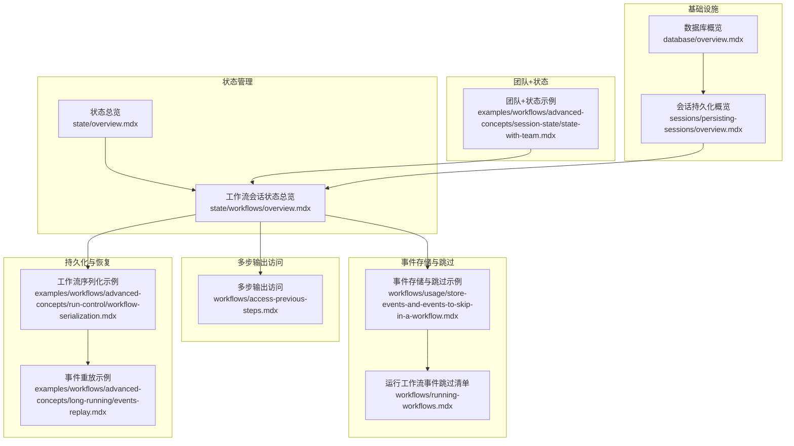
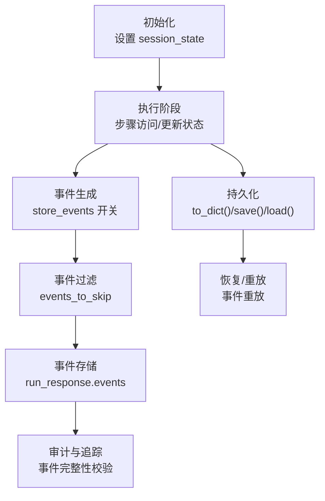
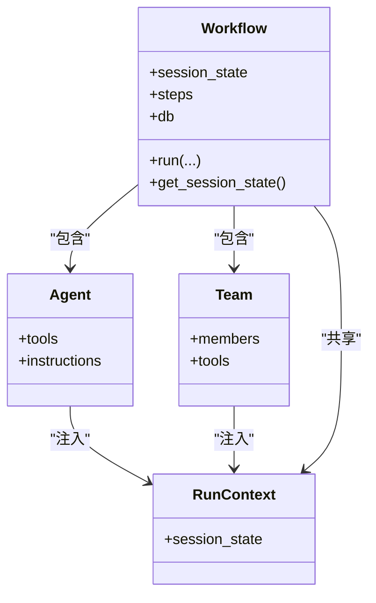
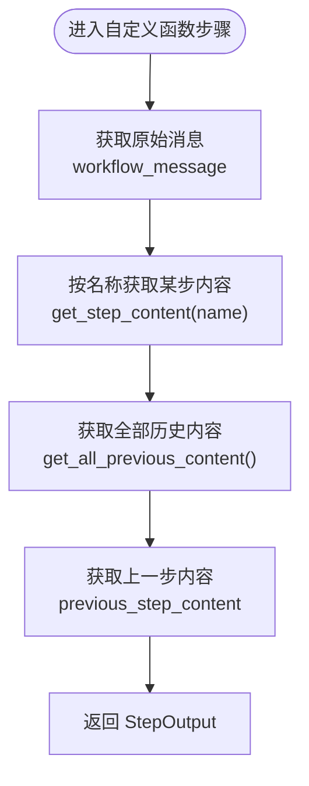
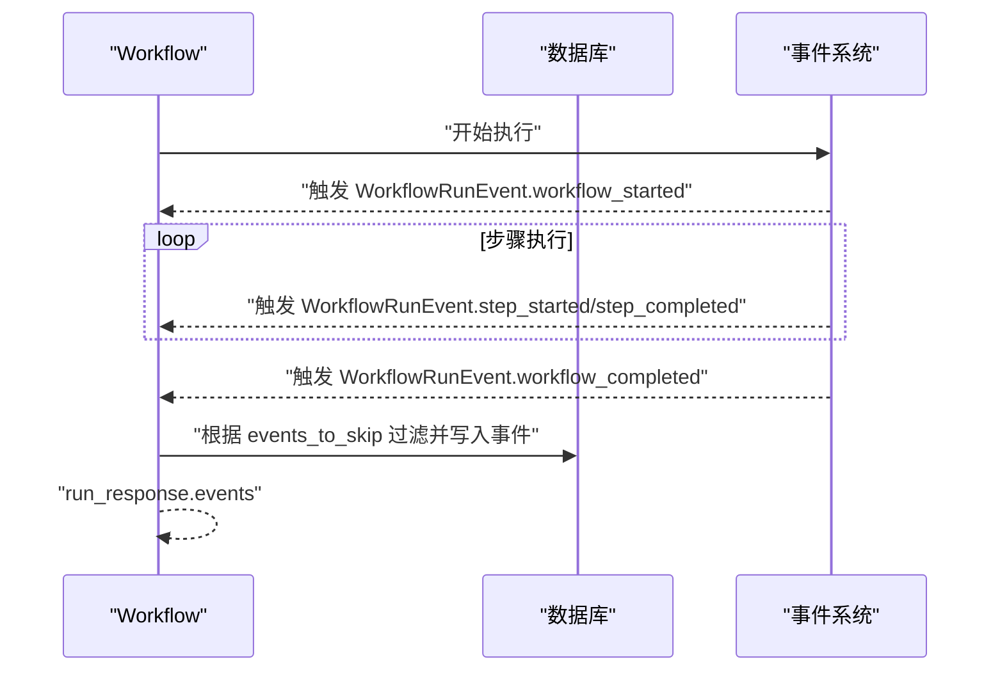
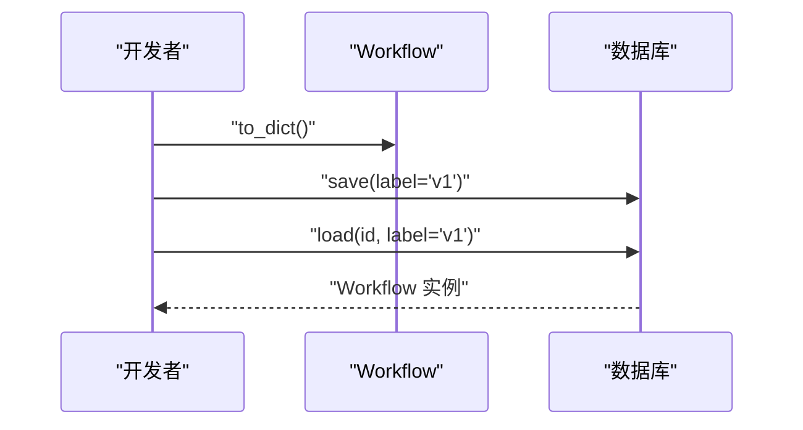
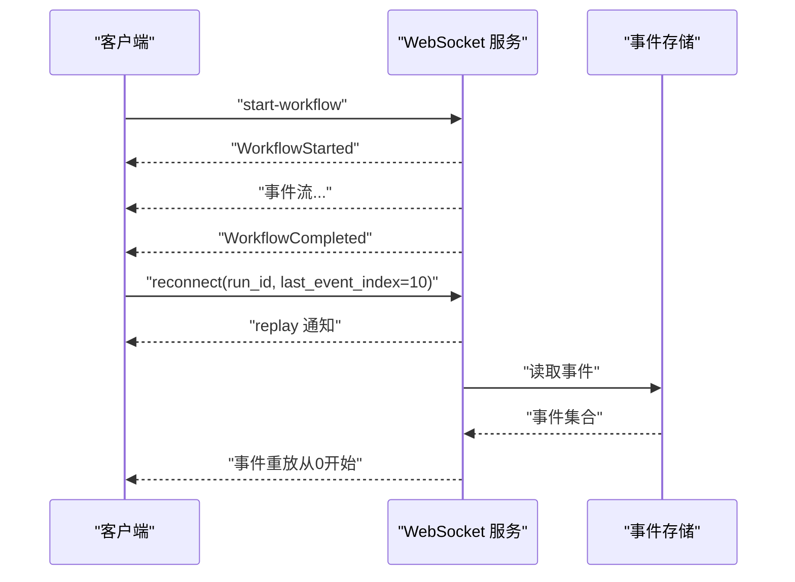
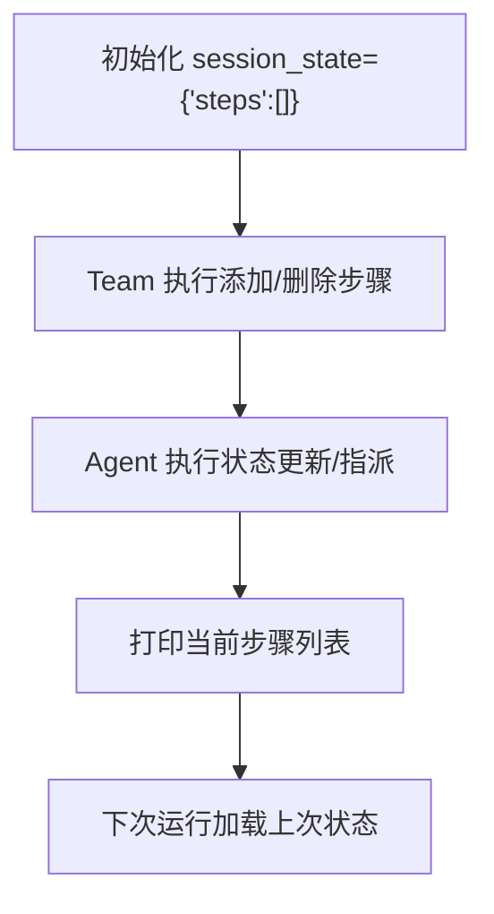
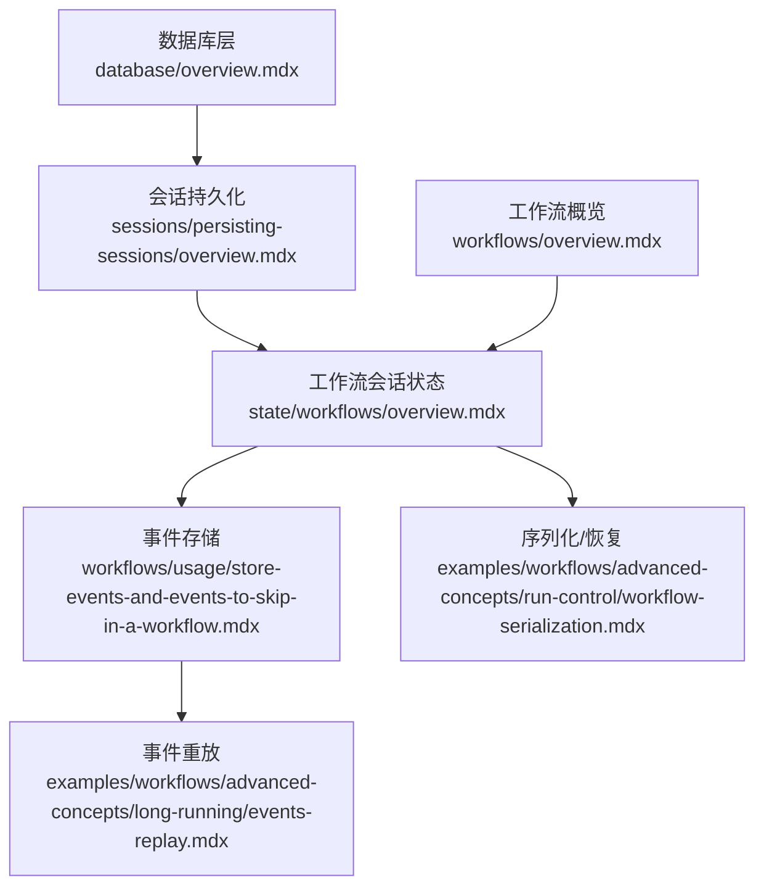

# 状态管理

<cite>
**本文引用的文件**
- [状态总览](file://state/overview.mdx)
- [工作流会话状态总览](file://state/workflows/overview.mdx)
- [多步输出访问](file://workflows/access-previous-steps.mdx)
- [工作流事件存储与跳过](file://workflows/usage/store-events-and-events-to-skip-in-a-workflow.mdx)
- [运行工作流（事件跳过清单）](file://workflows/running-workflows.mdx)
- [工作流序列化示例](file://examples/workflows/advanced-concepts/run-control/workflow-serialization.mdx)
- [事件重放示例](file://examples/workflows/advanced-concepts/long-running/events-replay.mdx)
- [团队+状态示例](file://examples/workflows/advanced-concepts/session-state/state-with-team.mdx)
- [数据库概览](file://database/overview.mdx)
- [会话持久化概览](file://sessions/persisting-sessions/overview.mdx)
- [工作流概览](file://workflows/overview.mdx)
</cite>

## 目录
1. [简介](#简介)
2. [项目结构](#项目结构)
3. [核心组件](#核心组件)
4. [架构总览](#架构总览)
5. [详细组件分析](#详细组件分析)
6. [依赖关系分析](#依赖关系分析)
7. [性能考量](#性能考量)
8. [故障排查指南](#故障排查指南)
9. [结论](#结论)
10. [附录](#附录)

## 简介
本技术文档围绕“工作流状态管理”主题，系统阐述多步骤输出访问、每步结构化输入输出配置、事件存储与跳过策略、状态持久化与恢复、状态变更跟踪与审计、以及在复杂状态场景下的设计模式与架构考虑。文档以仓库中已有的状态管理、事件存储、会话持久化与工作流运行示例为依据，结合概念性图示，帮助读者从整体到细节掌握状态管理的最佳实践。

## 项目结构
本仓库提供了覆盖“状态管理”的多处文档与示例，主要分布在以下区域：
- 状态管理：state/overview.mdx、state/workflows/overview.mdx
- 多步输出访问：workflows/access-previous-steps.mdx
- 事件存储与跳过：workflows/usage/store-events-and-events-to-skip-in-a-workflow.mdx、workflows/running-workflows.mdx
- 序列化与持久化：examples/workflows/advanced-concepts/run-control/workflow-serialization.mdx
- 长连接/重放：examples/workflows/advanced-concepts/long-running/events-replay.mdx
- 团队+状态示例：examples/workflows/advanced-concepts/session-state/state-with-team.mdx
- 数据库存储与会话持久化：database/overview.mdx、sessions/persisting-sessions/overview.mdx
- 工作流概览：workflows/overview.mdx

**图表来源**
- [状态总览](file://state/overview.mdx)
- [工作流会话状态总览](file://state/workflows/overview.mdx)
- [多步输出访问](file://workflows/access-previous-steps.mdx)
- [工作流事件存储与跳过](file://workflows/usage/store-events-and-events-to-skip-in-a-workflow.mdx)
- [运行工作流（事件跳过清单）](file://workflows/running-workflows.mdx)
- [工作流序列化示例](file://examples/workflows/advanced-concepts/run-control/workflow-serialization.mdx)
- [事件重放示例](file://examples/workflows/advanced-concepts/long-running/events-replay.mdx)
- [团队+状态示例](file://examples/workflows/advanced-concepts/session-state/state-with-team.mdx)
- [数据库概览](file://database/overview.mdx)
- [会话持久化概览](file://sessions/persisting-sessions/overview.mdx)

**章节来源**
- [状态总览](file://state/overview.mdx)
- [工作流会话状态总览](file://state/workflows/overview.mdx)
- [多步输出访问](file://workflows/access-previous-steps.mdx)
- [工作流事件存储与跳过](file://workflows/usage/store-events-and-events-to-skip-in-a-workflow.mdx)
- [运行工作流（事件跳过清单）](file://workflows/running-workflows.mdx)
- [工作流序列化示例](file://examples/workflows/advanced-concepts/run-control/workflow-serialization.mdx)
- [事件重放示例](file://examples/workflows/advanced-concepts/long-running/events-replay.mdx)
- [团队+状态示例](file://examples/workflows/advanced-concepts/session-state/state-with-team.mdx)
- [数据库概览](file://database/overview.mdx)
- [会话持久化概览](file://sessions/persisting-sessions/overview.mdx)

## 核心组件
- 工作流会话状态（Workflow Session State）
  - 在工作流初始化时设置 session_state，所有步骤（Agent、Team、自定义函数）共享同一份状态对象，并自动持久化到数据库。
  - 支持在工具或自定义函数中通过 run_context.session_state 访问与更新状态。
- 多步输出访问（Previous Steps Access）
  - 通过 StepInput 提供的方法按名称或递归查找访问任意前序步骤的输出内容；支持 Parallel 组合步骤的字典式输出格式。
- 事件存储与跳过（Event Storage & Skipping）
  - 运行时可选择开启 store_events 并指定 events_to_skip，仅保留关键里程碑事件，减少噪声与存储开销。
  - 可通过 run_response.events 获取执行期间产生的事件序列。
- 持久化与恢复（Persistence & Recovery）
  - 使用 to_dict()/save()/load() 实现工作流的序列化与版本化保存；完成运行后可通过重放接口获取完整事件序列。
- 审计与追踪（Audit & Trace）
  - 事件重放与事件索引保证事件完整性与可追溯性；配合数据库层可实现跨会话的状态与事件审计。

**章节来源**
- [工作流会话状态总览](file://state/workflows/overview.mdx)
- [多步输出访问](file://workflows/access-previous-steps.mdx)
- [工作流事件存储与跳过](file://workflows/usage/store-events-and-events-to-skip-in-a-workflow.mdx)
- [运行工作流（事件跳过清单）](file://workflows/running-workflows.mdx)
- [工作流序列化示例](file://examples/workflows/advanced-concepts/run-control/workflow-serialization.mdx)
- [事件重放示例](file://examples/workflows/advanced-concepts/long-running/events-replay.mdx)

## 架构总览
下图展示了工作流状态管理在执行链路中的位置与交互关系：初始化阶段设置 session_state；执行阶段各步骤通过 run_context 访问与更新状态；事件存储策略决定事件写入与过滤；持久化与恢复通过序列化与重放保障一致性与可审计性。

**图表来源**
- [工作流会话状态总览](file://state/workflows/overview.mdx)
- [工作流事件存储与跳过](file://workflows/usage/store-events-and-events-to-skip-in-a-workflow.mdx)
- [运行工作流（事件跳过清单）](file://workflows/running-workflows.mdx)
- [工作流序列化示例](file://examples/workflows/advanced-concepts/run-control/workflow-serialization.mdx)
- [事件重放示例](file://examples/workflows/advanced-concepts/long-running/events-replay.mdx)

## 详细组件分析

### 组件A：工作流会话状态（Workflow Session State）
- 初始化：在 Workflow 构造时传入 session_state，作为共享状态容器。
- 访问与更新：在工具或自定义函数中使用 run_context.session_state 读写状态；后续同会话运行将加载上次持久化的状态。
- 跨组件协作：Agent、Team、自定义函数均可访问同一 session_state，便于协同与数据一致性。

**图表来源**
- [工作流会话状态总览](file://state/workflows/overview.mdx)

**章节来源**
- [工作流会话状态总览](file://state/workflows/overview.mdx)

### 组件B：多步输出访问（Previous Steps Access）
- 方法族：按名称访问特定步骤输出、获取全部历史内容、访问原始消息等。
- 嵌套与递归：支持在 Parallel/Condition/Router/Loop/Steps 等组合步骤中按名称递归查找。
- 输出格式：Parallel 组合步骤返回字典，键为子步骤名，值为其输出内容。

**图表来源**
- [多步输出访问](file://workflows/access-previous-steps.mdx)

**章节来源**
- [多步输出访问](file://workflows/access-previous-steps.mdx)

### 组件C：事件存储与跳过（Event Storage & Skipping）
- 存储开关：store_events=True 启用事件记录；events_to_skip 列表用于过滤冗余事件。
- 可用事件类型：WorkflowRunEvent、RunEvent 等；常见可跳过的事件包括 step_started、workflow_completed、run_content 等。
- 访问方式：执行完成后通过 run_response.events 获取事件列表。

**图表来源**
- [工作流事件存储与跳过](file://workflows/usage/store-events-and-events-to-skip-in-a-workflow.mdx)
- [运行工作流（事件跳过清单）](file://workflows/running-workflows.mdx)

**章节来源**
- [工作流事件存储与跳过](file://workflows/usage/store-events-and-events-to-skip-in-a-workflow.mdx)
- [运行工作流（事件跳过清单）](file://workflows/running-workflows.mdx)

### 组件D：持久化与恢复（Serialization & Recovery）
- 序列化：to_dict() 导出工作流结构；save(db, label) 版本化保存；load(id, db, label) 加载。
- 恢复与重放：完成运行后，通过重放接口可获取完整事件序列，验证事件索引连续性与完整性。

**图表来源**
- [工作流序列化示例](file://examples/workflows/advanced-concepts/run-control/workflow-serialization.mdx)

**章节来源**
- [工作流序列化示例](file://examples/workflows/advanced-concepts/run-control/workflow-serialization.mdx)

### 组件E：事件重放（Events Replay）
- 场景：断线重连或延迟接入后，重新获取已完成运行的事件流。
- 行为：服务端发送 replay 通知，客户端按事件索引顺序接收事件；last_event_index 参数在已完成运行时被忽略，确保从头重放。

**图表来源**
- [事件重放示例](file://examples/workflows/advanced-concepts/long-running/events-replay.mdx)

**章节来源**
- [事件重放示例](file://examples/workflows/advanced-concepts/long-running/events-replay.mdx)

### 组件F：团队+状态（Team + State）
- 共享状态：Team 与 Agent 的工具均可访问 run_context.session_state，实现跨成员的状态同步。
- 示例场景：项目步骤生命周期管理，包含添加/删除步骤、更新状态与指派、打印当前步骤列表等。

**图表来源**
- [团队+状态示例](file://examples/workflows/advanced-concepts/session-state/state-with-team.mdx)

**章节来源**
- [团队+状态示例](file://examples/workflows/advanced-concepts/session-state/state-with-team.mdx)

## 依赖关系分析
- 状态管理依赖数据库层进行持久化；会话持久化指南明确了支持的数据库类型与命名约定。
- 事件存储依赖运行时事件系统与数据库；事件重放依赖 WebSocket 与事件索引。
- 工作流概览说明了何时使用工作流而非团队，有助于在不同场景下选择合适的状态管理模式。

**图表来源**
- [数据库概览](file://database/overview.mdx)
- [会话持久化概览](file://sessions/persisting-sessions/overview.mdx)
- [工作流会话状态总览](file://state/workflows/overview.mdx)
- [工作流事件存储与跳过](file://workflows/usage/store-events-and-events-to-skip-in-a-workflow.mdx)
- [事件重放示例](file://examples/workflows/advanced-concepts/long-running/events-replay.mdx)
- [工作流序列化示例](file://examples/workflows/advanced-concepts/run-control/workflow-serialization.mdx)
- [工作流概览](file://workflows/overview.mdx)

**章节来源**
- [数据库概览](file://database/overview.mdx)
- [会话持久化概览](file://sessions/persisting-sessions/overview.mdx)
- [工作流会话状态总览](file://state/workflows/overview.mdx)
- [工作流事件存储与跳过](file://workflows/usage/store-events-and-events-to-skip-in-a-workflow.mdx)
- [事件重放示例](file://examples/workflows/advanced-concepts/long-running/events-replay.mdx)
- [工作流序列化示例](file://examples/workflows/advanced-concepts/run-control/workflow-serialization.mdx)
- [工作流概览](file://workflows/overview.mdx)

## 性能考量
- 事件存储优化
  - 使用 events_to_skip 过滤高频事件（如 step_started、run_content），降低存储与传输开销。
  - 仅在调试/审计阶段临时启用全量事件存储，生产环境建议保留关键里程碑事件。
- 状态访问与更新
  - 将状态结构化为轻量级字典/列表，避免大对象频繁序列化；必要时对热点字段建立索引。
  - 在工具函数中尽量批量读取/写入，减少多次数据库往返。
- 持久化与恢复
  - 使用 save()/load() 对工作流进行版本化管理，避免频繁重建复杂对象。
  - 重放时优先使用事件索引范围查询，确保低延迟接入。
- 内存控制
  - 对历史事件采用分页/游标策略，避免一次性加载过多事件。
  - 对会话状态设置上限大小，超限则清理旧数据或压缩。

[本节为通用性能建议，不直接分析具体文件]

## 故障排查指南
- 事件缺失或重复
  - 检查 events_to_skip 是否误删关键事件；确认事件索引连续性与去重逻辑。
- 状态未生效
  - 确认 run_context.session_state 是否正确注入；检查数据库连接与表结构是否匹配。
- 重放异常
  - 确保 WebSocket 连接正常；核对 run_id 与 last_event_index 的语义差异（已完成运行时忽略 last_event_index）。
- 持久化失败
  - 校验数据库权限与表名；确认 save()/load() 的标签与 ID 一致。

**章节来源**
- [运行工作流（事件跳过清单）](file://workflows/running-workflows.mdx)
- [事件重放示例](file://examples/workflows/advanced-concepts/long-running/events-replay.mdx)
- [工作流序列化示例](file://examples/workflows/advanced-concepts/run-control/workflow-serialization.mdx)

## 结论
通过“工作流会话状态 + 多步输出访问 + 事件存储与跳过 + 持久化与恢复 + 审计与追踪”的组合，可以构建高可靠、可观测、可审计且具备良好性能的工作流状态管理体系。在实际工程中，应根据业务需求选择合适的事件过滤策略、状态结构与持久化方案，并在长连接与重放场景下完善事件索引与完整性校验。

[本节为总结性内容，不直接分析具体文件]

## 附录
- 最佳实践清单
  - 明确每步输入输出契约，使用结构化数据承载状态。
  - 事件存储遵循“关键里程碑 + 可选调试”原则。
  - 对状态与事件建立统一的命名规范与版本管理。
  - 在团队协作场景中，明确状态访问边界与并发控制策略。
- 相关参考
  - [工作流概览](file://workflows/overview.mdx)
  - [数据库概览](file://database/overview.mdx)
  - [会话持久化概览](file://sessions/persisting-sessions/overview.mdx)

[本节为补充信息，不直接分析具体文件]