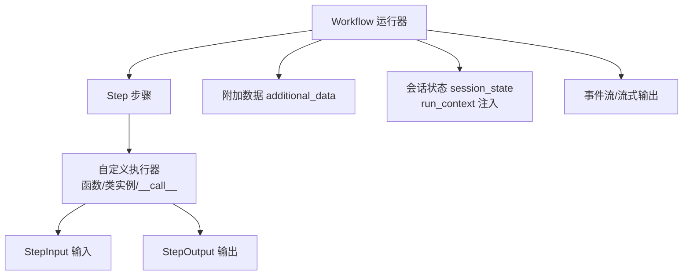
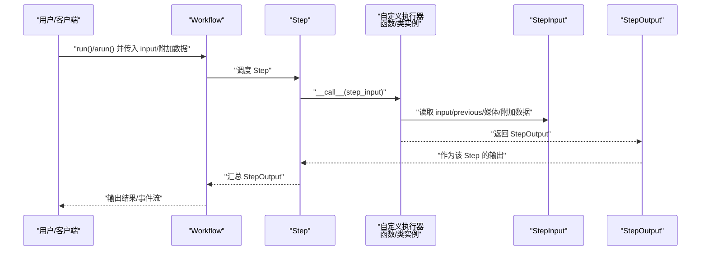
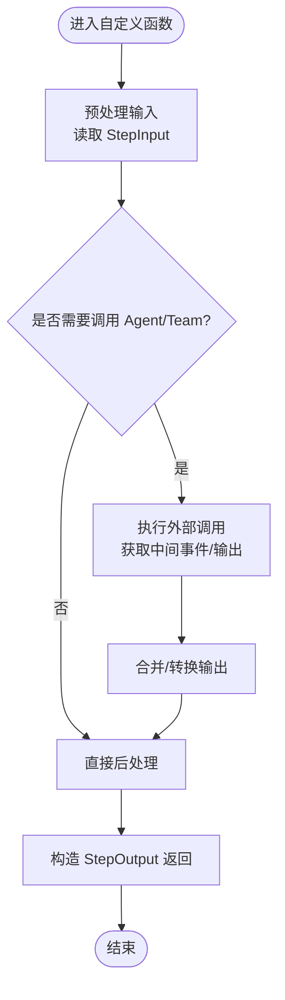
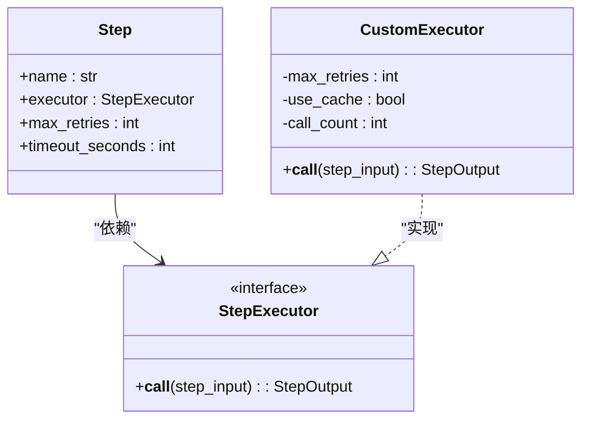
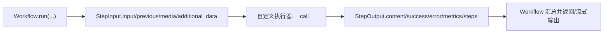
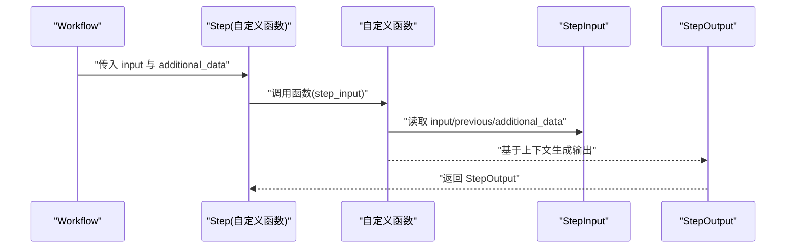
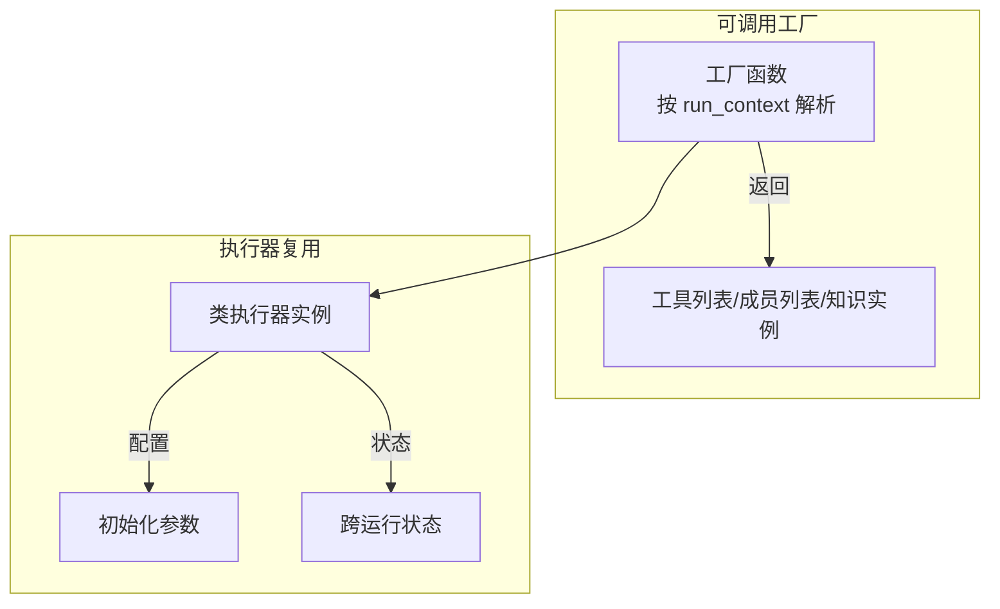
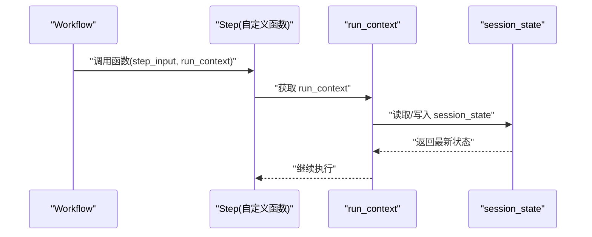
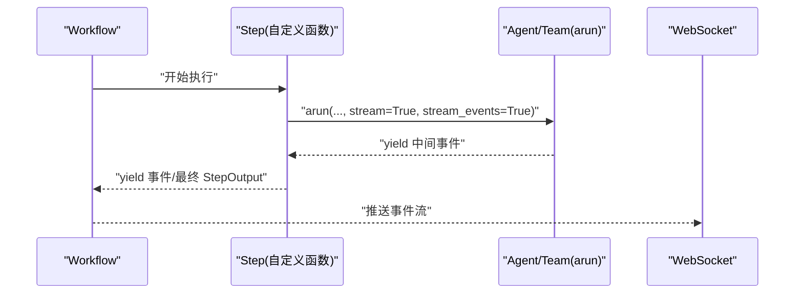
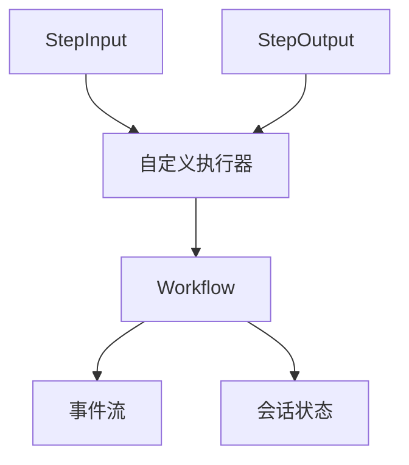

# 自定义函数

<cite>
**本文引用的文件**
- [自定义函数在工作流中](file://workflows/workflow-patterns/custom-function-step-workflow.mdx)
- [附加数据与元数据](file://workflows/additional-data.mdx)
- [StepInput 参考](file://reference/workflows/step_input.mdx)
- [StepOutput 参考](file://reference/workflows/step_output.mdx)
- [Workflow 参考](file://reference/workflows/workflow.mdx)
- [Step 参考](file://reference/workflows/step.mdx)
- [工作流会话状态访问（Python 函数步骤）](file://state/workflows/overview.mdx)
- [可调用工厂概念](file://_snippets/concept-callable-factories.mdx)
- [可调用工厂缓存](file://_snippets/concept-callable-factories-caching.mdx)
- [WebSocket 重连与事件回放示例](file://examples/workflows/advanced-concepts/long-running/websocket-reconnect.mdx)
- [取消运行示例](file://examples/workflows/advanced-concepts/run-control/cancel-run.mdx)
</cite>

## 目录
1. [简介](#简介)
2. [项目结构](#项目结构)
3. [核心组件](#核心组件)
4. [架构总览](#架构总览)
5. [详细组件分析](#详细组件分析)
6. [依赖关系分析](#依赖关系分析)
7. [性能考量](#性能考量)
8. [故障排查指南](#故障排查指南)
9. [结论](#结论)
10. [附录](#附录)

## 简介
本技术文档围绕“工作流自定义函数”能力，系统阐述如何以函数或类为基础的执行器替代传统步骤，实现更强的灵活性与可组合性。内容覆盖：
- 使用自定义函数替代传统步骤的优势与适用场景
- 函数步骤的参数传递与返回值处理规范
- 类基础执行器的设计模式与实现要点
- 函数与“附加数据”的结合使用方法
- 复杂业务逻辑的函数封装与复用策略
- 执行上下文与会话状态管理
- 调试与测试最佳实践
- 性能优化与内存管理高级技巧

## 项目结构
与“自定义函数”直接相关的知识分布在以下位置：
- 工作流模式与示例：自定义函数在工作流中的使用、类基础执行器、AgentOS 流式执行
- 数据输入输出模型：StepInput、StepOutput 的字段与辅助方法
- 工作流 API：Workflow 的运行接口、事件流、会话状态访问
- 会话状态与上下文：在自定义 Python 函数步骤中通过 run_context 访问 session_state
- 附加数据：如何向工作流传入额外上下文信息
- 可调用工厂：动态工具/成员/知识的按需解析与缓存
- 高级运行控制：长时任务、WebSocket 事件回放与重连、运行取消

图示来源
- [自定义函数在工作流中:14-16](file://workflows/workflow-patterns/custom-function-step-workflow.mdx#L14-L16)
- [StepInput 参考:6-26](file://reference/workflows/step_input.mdx#L6-L26)
- [StepOutput 参考:6-24](file://reference/workflows/step_output.mdx#L6-L24)
- [Workflow 参考:37-81](file://reference/workflows/workflow.mdx#L37-L81)
- [工作流会话状态访问（Python 函数步骤）:201-218](file://state/workflows/overview.mdx#L201-L218)

章节来源
- [自定义函数在工作流中:1-259](file://workflows/workflow-patterns/custom-function-step-workflow.mdx#L1-L259)
- [StepInput 参考:1-29](file://reference/workflows/step_input.mdx#L1-L29)
- [StepOutput 参考:1-25](file://reference/workflows/step_output.mdx#L1-L25)
- [Workflow 参考:1-306](file://reference/workflows/workflow.mdx#L1-L306)
- [工作流会话状态访问（Python 函数步骤）:201-246](file://state/workflows/overview.mdx#L201-L246)

## 核心组件
- 自定义函数执行器
  - 接口约定：接收 StepInput，返回 StepOutput；支持同步与异步
  - 适用场景：预处理输入、编排代理与团队、后处理输出、条件判断与路由
- 类基础执行器
  - 通过实现 __call__ 的可调用类承载配置与状态，便于复用与共享
  - 支持初始化参数注入与跨多次运行的状态保持
- StepInput/StepOutput
  - StepInput 提供 input、previous_step_content、previous_step_outputs、additional_data、媒体输入等
  - StepOutput 定义 content、success、error、metrics、嵌套 steps 等
- Workflow 运行接口
  - run/arun/print_response/aprint_response 等，支持事件流与执行器事件合并
- 会话状态与上下文
  - 在自定义 Python 函数步骤中通过 run_context.session_state 读写会话状态
- 附加数据
  - 通过 workflow.run(..., additional_data=...) 传入，函数内部通过 step_input.additional_data 获取

章节来源
- [自定义函数在工作流中:14-16](file://workflows/workflow-patterns/custom-function-step-workflow.mdx#L14-L16)
- [StepInput 参考:6-26](file://reference/workflows/step_input.mdx#L6-L26)
- [StepOutput 参考:6-24](file://reference/workflows/step_output.mdx#L6-L24)
- [Workflow 参考:37-121](file://reference/workflows/workflow.mdx#L37-L121)
- [工作流会话状态访问（Python 函数步骤）:201-218](file://state/workflows/overview.mdx#L201-L218)
- [附加数据与元数据:17-18](file://workflows/additional-data.mdx#L17-L18)

## 架构总览
下图展示从 Workflow 到 Step，再到自定义执行器的调用链路，以及事件流与会话状态的交互。

图示来源
- [自定义函数在工作流中:14-16](file://workflows/workflow-patterns/custom-function-step-workflow.mdx#L14-L16)
- [StepInput 参考:6-26](file://reference/workflows/step_input.mdx#L6-L26)
- [StepOutput 参考:6-24](file://reference/workflows/step_output.mdx#L6-L24)
- [Workflow 参考:37-81](file://reference/workflows/workflow.mdx#L37-L81)

## 详细组件分析

### 组件一：自定义函数执行器
- 设计要点
  - 同步/异步统一：函数签名接收 StepInput，返回 StepOutput；异步版本可 yield 中间事件
  - 编排能力：在函数内调用 Agent/Team，实现复杂业务编排
  - 错误处理：通过 StepOutput.success/error 控制流程与可观测性
- 实现建议
  - 将“预处理-调用-后处理”三段式逻辑清晰分层
  - 对外部调用设置超时与重试策略，避免阻塞
  - 使用 additional_data 与 previous_step_content 做上下文增强

图示来源
- [自定义函数在工作流中:36-87](file://workflows/workflow-patterns/custom-function-step-workflow.mdx#L36-L87)
- [StepInput 参考:6-26](file://reference/workflows/step_input.mdx#L6-L26)
- [StepOutput 参考:6-24](file://reference/workflows/step_output.mdx#L6-L24)

章节来源
- [自定义函数在工作流中:28-98](file://workflows/workflow-patterns/custom-function-step-workflow.mdx#L28-L98)
- [StepInput 参考:6-26](file://reference/workflows/step_input.mdx#L6-L26)
- [StepOutput 参考:6-24](file://reference/workflows/step_output.mdx#L6-L24)

### 组件二：类基础执行器（设计模式）
- 设计模式
  - 初始化注入：在 __init__ 中接收配置项（如重试次数、缓存开关），形成可复用的执行器实例
  - 状态保持：在实例属性中维护计数器、缓存键等，实现跨多次运行的状态
  - 可扩展性：通过继承或组合扩展行为，适配不同业务场景
- 实现技巧
  - 异步类执行器：将 __call__ 定义为 async，并在内部使用 arun/异步迭代器
  - 事件透传：在异步场景下，将内部事件 yield 出去，由 Workflow 层统一注入上下文

图示来源
- [Step 参考:6-25](file://reference/workflows/step.mdx#L6-L25)
- [自定义函数在工作流中:100-164](file://workflows/workflow-patterns/custom-function-step-workflow.mdx#L100-L164)

章节来源
- [自定义函数在工作流中:100-164](file://workflows/workflow-patterns/custom-function-step-workflow.mdx#L100-L164)
- [Step 参考:6-25](file://reference/workflows/step.mdx#L6-L25)

### 组件三：参数传递与返回值处理
- 参数传递
  - StepInput 字段：input、previous_step_content、previous_step_outputs、additional_data、媒体输入等
  - 附加数据：通过 workflow.run(..., additional_data=...) 传入，函数内通过 step_input.additional_data 获取
- 返回值处理
  - StepOutput.content：主输出内容，支持多种类型
  - StepOutput.success/error：控制流程与错误传播
  - StepOutput.metrics：记录执行指标
  - StepOutput.steps：复合步骤的嵌套输出

图示来源
- [附加数据与元数据:17-18](file://workflows/additional-data.mdx#L17-L18)
- [StepInput 参考:6-26](file://reference/workflows/step_input.mdx#L6-L26)
- [StepOutput 参考:6-24](file://reference/workflows/step_output.mdx#L6-L24)
- [Workflow 参考:37-81](file://reference/workflows/workflow.mdx#L37-L81)

章节来源
- [附加数据与元数据:17-18](file://workflows/additional-data.mdx#L17-L18)
- [StepInput 参考:6-26](file://reference/workflows/step_input.mdx#L6-L26)
- [StepOutput 参考:6-24](file://reference/workflows/step_output.mdx#L6-L24)
- [Workflow 参考:37-81](file://reference/workflows/workflow.mdx#L37-L81)

### 组件四：函数与附加数据的结合使用
- 场景
  - 将用户信息、优先级、预算、截止日期等上下文注入到具体步骤
  - 通过 additional_data 与 previous_step_content 组合生成更丰富的提示或决策依据
- 方法
  - 在函数中读取 step_input.additional_data，进行条件分支或模板渲染
  - 将业务规则与上下文解耦，提升函数复用性

图示来源
- [附加数据与元数据:25-67](file://workflows/additional-data.mdx#L25-L67)
- [StepInput 参考:6-26](file://reference/workflows/step_input.mdx#L6-L26)
- [StepOutput 参考:6-24](file://reference/workflows/step_output.mdx#L6-L24)

章节来源
- [附加数据与元数据:20-91](file://workflows/additional-data.mdx#L20-L91)

### 组件五：复杂业务逻辑的封装与复用
- 封装策略
  - 将通用预处理/后处理逻辑抽取为独立模块或工具函数
  - 使用类执行器承载可配置状态，实现“一次配置，多处复用”
- 复用策略
  - 通过工厂模式按用户/会话/自定义键生成执行器实例
  - 结合可调用工厂的缓存机制，减少重复解析成本

图示来源
- [可调用工厂概念:1-8](file://_snippets/concept-callable-factories.mdx#L1-L8)
- [可调用工厂缓存:1-16](file://_snippets/concept-callable-factories-caching.mdx#L1-L16)
- [自定义函数在工作流中:118-146](file://workflows/workflow-patterns/custom-function-step-workflow.mdx#L118-L146)

章节来源
- [可调用工厂概念:1-8](file://_snippets/concept-callable-factories.mdx#L1-L8)
- [可调用工厂缓存:1-16](file://_snippets/concept-callable-factories-caching.mdx#L1-L16)
- [自定义函数在工作流中:118-146](file://workflows/workflow-patterns/custom-function-step-workflow.mdx#L118-L146)

### 组件六：上下文管理与状态保持
- 上下文注入
  - 在自定义 Python 函数步骤中，run_context 会自动注入，可通过 run_context.session_state 读写会话状态
- 并发注意事项
  - 并行步骤更新共享状态时，需协调避免竞态
- 会话持久化
  - Workflow 支持 session_state 存储于数据库，实现跨运行持久化

图示来源
- [工作流会话状态访问（Python 函数步骤）:201-218](file://state/workflows/overview.mdx#L201-L218)
- [Workflow 参考:16-32](file://reference/workflows/workflow.mdx#L16-L32)

章节来源
- [工作流会话状态访问（Python 函数步骤）:201-246](file://state/workflows/overview.mdx#L201-L246)
- [Workflow 参考:16-32](file://reference/workflows/workflow.mdx#L16-L32)

### 组件七：流式执行与事件管理
- AgentOS 流式
  - 在自定义函数中调用 Agent/Team 的 arun 并开启 stream/stream_events，yield 内部事件，由 Workflow 注入上下文
- 事件聚合
  - Workflow 层可选择是否合并执行器事件与工作流事件，便于统一消费
- 长时任务与重连
  - 通过 WebSocket 接收事件，支持断线重连与事件回放

图示来源
- [自定义函数在工作流中:166-253](file://workflows/workflow-patterns/custom-function-step-workflow.mdx#L166-L253)
- [Workflow 参考:20-32](file://reference/workflows/workflow.mdx#L20-L32)
- [WebSocket 重连与事件回放示例:47-70](file://examples/workflows/advanced-concepts/long-running/websocket-reconnect.mdx#L47-L70)

章节来源
- [自定义函数在工作流中:166-253](file://workflows/workflow-patterns/custom-function-step-workflow.mdx#L166-L253)
- [Workflow 参考:20-32](file://reference/workflows/workflow.mdx#L20-L32)
- [WebSocket 重连与事件回放示例:47-70](file://examples/workflows/advanced-concepts/long-running/websocket-reconnect.mdx#L47-L70)

## 依赖关系分析
- 组件耦合
  - Step 依赖 StepExecutor 接口；自定义函数/类执行器实现该接口
  - 自定义执行器依赖 StepInput/StepOutput 作为输入输出契约
  - Workflow 依赖事件流与会话状态管理
- 外部集成
  - Agent/Team 的 arun 与事件流集成
  - WebSocket 事件通道用于长时任务与实时反馈

图示来源
- [StepInput 参考:6-26](file://reference/workflows/step_input.mdx#L6-L26)
- [StepOutput 参考:6-24](file://reference/workflows/step_output.mdx#L6-L24)
- [Workflow 参考:37-81](file://reference/workflows/workflow.mdx#L37-L81)

章节来源
- [StepInput 参考:6-26](file://reference/workflows/step_input.mdx#L6-L26)
- [StepOutput 参考:6-24](file://reference/workflows/step_output.mdx#L6-L24)
- [Workflow 参考:37-81](file://reference/workflows/workflow.mdx#L37-L81)

## 性能考量
- 减少重复解析
  - 使用可调用工厂缓存机制，按用户/会话/自定义键缓存解析结果
  - 清理缓存时使用同步/异步清理方法，避免陈旧解析导致的资源浪费
- 控制事件风暴
  - 合理设置 stream/stream_events/store_events，避免过多中间事件造成带宽与存储压力
- 并发安全
  - 并行步骤更新共享状态时，采用原子操作或加锁，避免竞态
- 内存管理
  - 避免在类执行器中累积无界状态；对缓存容量与生命周期进行限制
  - 在异步流式场景中及时释放中间对象，防止内存泄漏

章节来源
- [可调用工厂缓存:1-16](file://_snippets/concept-callable-factories-caching.mdx#L1-L16)
- [Workflow 参考:20-32](file://reference/workflows/workflow.mdx#L20-L32)
- [工作流会话状态访问（Python 函数步骤）:201-246](file://state/workflows/overview.mdx#L201-L246)

## 故障排查指南
- 常见问题
  - 函数未正确返回 StepOutput：检查返回值类型与 success/error 字段
  - 附加数据为空：确认 workflow.run(...) 是否传入 additional_data
  - 并行步骤状态冲突：引入锁或队列协调共享状态更新
  - 长时任务中断：使用 WebSocket 重连与事件回放机制恢复
  - 运行被取消：通过 cancel_run 触发取消，关注 RunStatus
- 调试建议
  - 开启 debug_mode 或细粒度日志
  - 使用 print_response/aprint_response 查看步骤详情与事件流
  - 在自定义函数中打印关键上下文（input、previous、additional_data）

章节来源
- [Workflow 参考:37-121](file://reference/workflows/workflow.mdx#L37-L121)
- [WebSocket 重连与事件回放示例:47-70](file://examples/workflows/advanced-concepts/long-running/websocket-reconnect.mdx#L47-L70)
- [取消运行示例:72-108](file://examples/workflows/advanced-concepts/run-control/cancel-run.mdx#L72-L108)

## 结论
自定义函数与类基础执行器为工作流提供了强大的可编程性与可复用性。通过标准化的 StepInput/StepOutput 接口、会话状态与附加数据机制、以及事件流与缓存策略，可以在保证性能与稳定性的同时，灵活地封装复杂业务逻辑并实现跨场景复用。建议在实际工程中遵循“职责分离、状态最小化、事件可控、并发安全”的原则，持续优化执行器与工作流的整体表现。

## 附录
- 相关参考
  - [StepInput 字段与辅助方法:6-26](file://reference/workflows/step_input.mdx#L6-L26)
  - [StepOutput 字段与语义:6-24](file://reference/workflows/step_output.mdx#L6-L24)
  - [Workflow 运行接口与事件流:37-121](file://reference/workflows/workflow.mdx#L37-L121)
  - [Step 配置与控制选项:6-25](file://reference/workflows/step.mdx#L6-L25)
  - [可调用工厂与缓存机制:1-8](file://_snippets/concept-callable-factories.mdx#L1-L8)
  - [可调用工厂缓存配置与清理:1-16](file://_snippets/concept-callable-factories-caching.mdx#L1-L16)
  - [AgentOS 流式执行示例:166-253](file://workflows/workflow-patterns/custom-function-step-workflow.mdx#L166-L253)
  - [附加数据传参与使用:17-18](file://workflows/additional-data.mdx#L17-L18)
  - [会话状态访问与并发注意事项:201-246](file://state/workflows/overview.mdx#L201-L246)