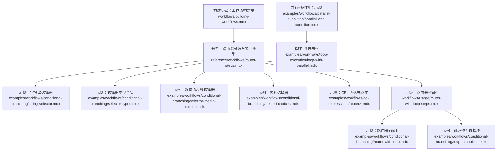
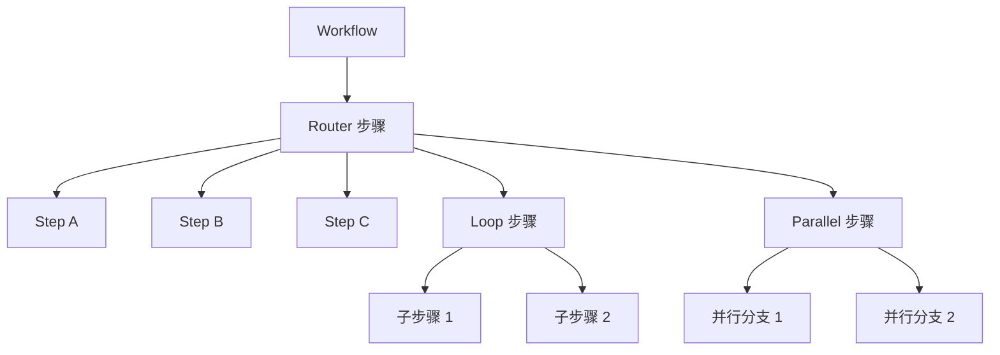
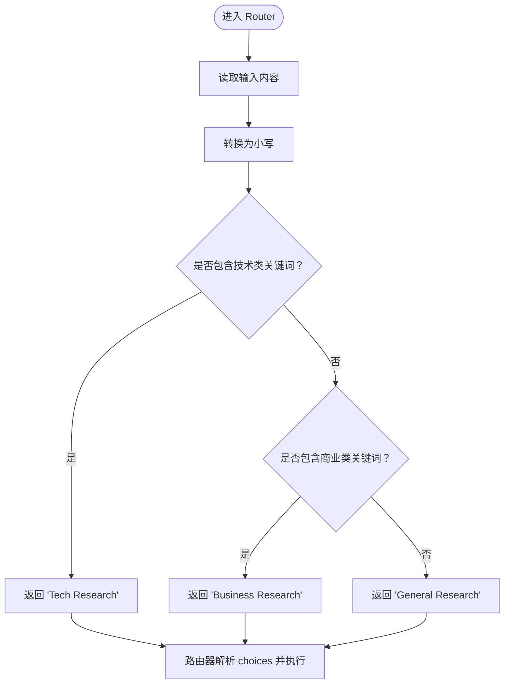
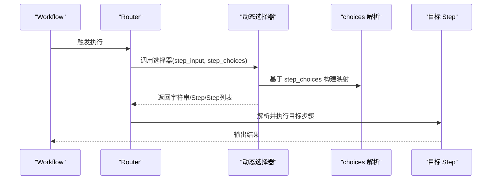
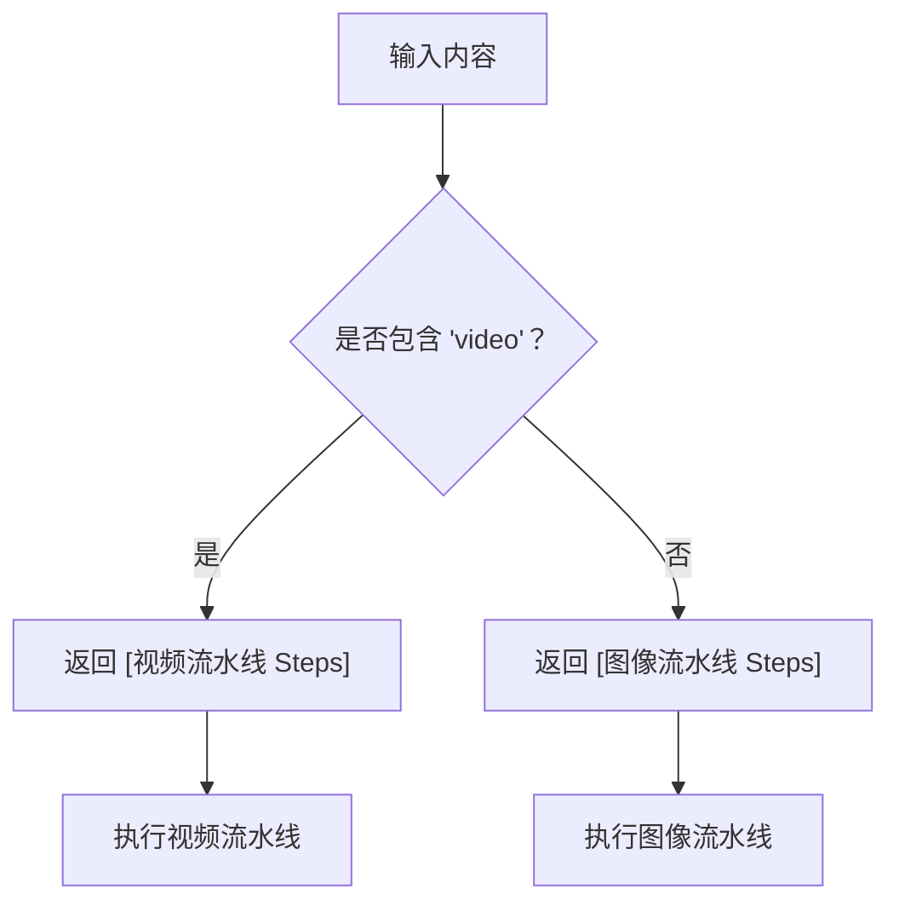
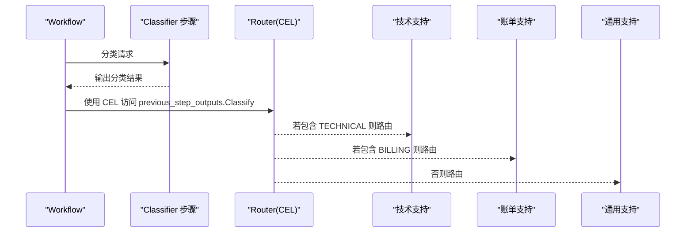
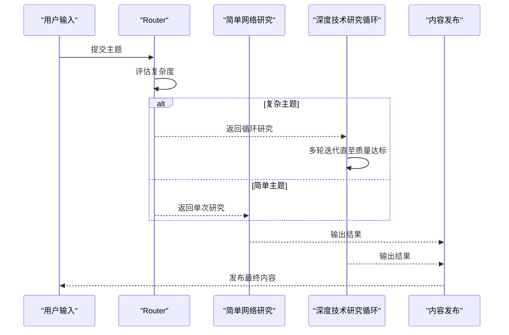
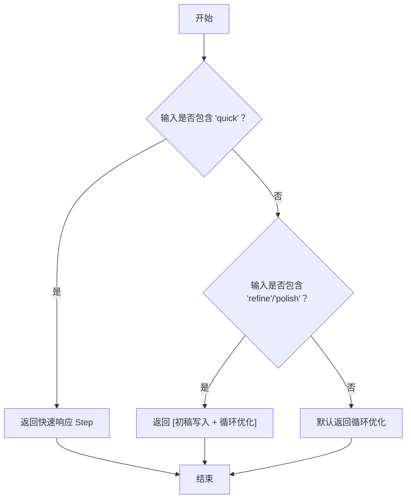

# 路由器选择

<cite>
**本文引用的文件**
- [router-steps.mdx](file://reference/workflows/router-steps.mdx)
- [string-selector.mdx](file://examples/workflows/conditional-branching/string-selector.mdx)
- [selector-types.mdx](file://examples/workflows/conditional-branching/selector-types.mdx)
- [nested-choices.mdx](file://examples/workflows/conditional-branching/nested-choices.mdx)
- [selector-media-pipeline.mdx](file://examples/workflows/conditional-branching/selector-media-pipeline.mdx)
- [router-with-loop-steps.mdx](file://workflows/usage/router-with-loop-steps.mdx)
- [router-with-loop.mdx](file://examples/workflows/conditional-branching/router-with-loop.mdx)
- [loop-in-choices.mdx](file://examples/workflows/conditional-branching/loop-in-choices.mdx)
- [cel-ternary.mdx](file://examples/workflows/cel-expressions/router/cel-ternary.mdx)
- [cel-previous-step-route.mdx](file://examples/workflows/cel-expressions/router/cel-previous-step-route.mdx)
- [building-workflows.mdx](file://workflows/building-workflows.mdx)
- [loop-with-parallel.mdx](file://examples/workflows/loop-execution/loop-with-parallel.mdx)
- [parallel-with-condition.mdx](file://examples/workflows/parallel-execution/parallel-with-condition.mdx)
</cite>

## 目录
1. [简介](#简介)
2. [项目结构](#项目结构)
3. [核心组件](#核心组件)
4. [架构总览](#架构总览)
5. [详细组件分析](#详细组件分析)
6. [依赖关系分析](#依赖关系分析)
7. [性能考量](#性能考量)
8. [故障排查指南](#故障排查指南)
9. [结论](#结论)
10. [附录](#附录)

## 简介
本技术文档聚焦“工作流路由器选择”能力，系统阐述路由器步骤（Router）的工作原理、配置方式与最佳实践。内容覆盖：
- 选择器类型：字符串选择器、动态选择器（含 step_choices）、嵌套选择器、以及基于 CEL 表达式的声明式路由。
- 路由决策的条件表达式与逻辑判断，支持输入文本、前序步骤输出、工具调用结果等多维判定。
- 高级模式：路由器与循环（Loop）组合，实现“简单路径 vs 迭代深挖”的自适应策略；与并行（Parallel）结合，实现分支并行执行。
- 复杂路由逻辑的实际代码示例路径，帮助快速落地。
- 性能优化与错误处理的最佳实践。

## 项目结构
围绕路由器选择的相关文档与示例主要分布在以下位置：
- 参考与参数说明：reference/workflows/router-steps.mdx
- 示例与用法：examples/workflows/conditional-branching/* 与 examples/workflows/cel-expressions/router/*
- 高级模式：workflows/usage/router-with-loop-steps.mdx
- 组合模式：examples/workflows/loop-execution/loop-with-parallel.mdx、examples/workflows/parallel-execution/parallel-with-condition.mdx
- 构建基础：workflows/building-workflows.mdx

图表来源
- [router-steps.mdx:1-56](file://reference/workflows/router-steps.mdx#L1-L56)
- [string-selector.mdx:1-97](file://examples/workflows/conditional-branching/string-selector.mdx#L1-L97)
- [selector-types.mdx:1-194](file://examples/workflows/conditional-branching/selector-types.mdx#L1-L194)
- [selector-media-pipeline.mdx:1-204](file://examples/workflows/conditional-branching/selector-media-pipeline.mdx#L1-L204)
- [nested-choices.mdx:1-76](file://examples/workflows/conditional-branching/nested-choices.mdx#L1-L76)
- [cel-ternary.mdx:1-86](file://examples/workflows/cel-expressions/router/cel-ternary.mdx#L1-L86)
- [cel-previous-step-route.mdx:1-110](file://examples/workflows/cel-expressions/router/cel-previous-step-route.mdx#L1-L110)
- [router-with-loop-steps.mdx:1-163](file://workflows/usage/router-with-loop-steps.mdx#L1-L163)
- [router-with-loop.mdx:1-172](file://examples/workflows/conditional-branching/router-with-loop.mdx#L1-L172)
- [loop-in-choices.mdx:1-105](file://examples/workflows/conditional-branching/loop-in-choices.mdx#L1-L105)
- [building-workflows.mdx:1-16](file://workflows/building-workflows.mdx#L1-L16)
- [loop-with-parallel.mdx:135-166](file://examples/workflows/loop-execution/loop-with-parallel.mdx#L135-L166)
- [parallel-with-condition.mdx:167-201](file://examples/workflows/parallel-execution/parallel-with-condition.mdx#L167-L201)

章节来源
- [router-steps.mdx:1-56](file://reference/workflows/router-steps.mdx#L1-L56)
- [building-workflows.mdx:1-16](file://workflows/building-workflows.mdx#L1-L16)

## 核心组件
- 路由器（Router）：根据选择器函数或表达式决定下一步执行的步骤集合，支持字符串名称、Step 对象、Step 列表三种返回类型。
- 选择器（Selector）：可为同步/异步函数，签名支持 step_input 与可选的 step_choices 参数，便于动态解析 choices。
- choices：可用 Step 列表或嵌套列表（自动转为 Steps 容器），用于定义可选路径。
- 高级组合：与 Loop 结合实现自适应迭代，与 Parallel 结合实现分支并行。

章节来源
- [router-steps.mdx:6-56](file://reference/workflows/router-steps.mdx#L6-L56)
- [building-workflows.mdx:9-16](file://workflows/building-workflows.mdx#L9-L16)

## 架构总览
下图展示了路由器在工作流中的典型位置与交互关系，以及与循环、并行等组件的协作方式。

图表来源
- [router-with-loop-steps.mdx:143-155](file://workflows/usage/router-with-loop-steps.mdx#L143-L155)
- [router-with-loop.mdx:130-142](file://examples/workflows/conditional-branching/router-with-loop.mdx#L130-L142)
- [loop-with-parallel.mdx:135-166](file://examples/workflows/loop-execution/loop-with-parallel.mdx#L135-L166)
- [parallel-with-condition.mdx:167-201](file://examples/workflows/parallel-execution/parallel-with-condition.mdx#L167-L201)

## 详细组件分析

### 路由器参数与选择器返回类型
- 关键参数
  - selector：选择器函数或表达式，可选接收 step_choices。
  - choices：可选步骤列表，支持嵌套列表自动转为 Steps 容器。
  - 其他：名称、描述、是否需要确认、用户输入选择、多选、拒绝行为等。
- 返回类型
  - 字符串：从 choices 中解析具体 Step 名称。
  - Step 对象：直接返回目标 Step。
  - Step 列表：返回多个连续执行的步骤（链式执行）。

章节来源
- [router-steps.mdx:6-56](file://reference/workflows/router-steps.mdx#L6-L56)

### 字符串选择器（基于输入内容）
- 适用场景：根据输入关键词路由到不同专家步骤。
- 决策逻辑：对输入进行小写化后匹配关键词，返回对应步骤名称字符串。
- 实现要点：选择器返回字符串名称，由路由器解析 choices 中的 Step 名称。

图表来源
- [string-selector.mdx:54-61](file://examples/workflows/conditional-branching/string-selector.mdx#L54-L61)

章节来源
- [string-selector.mdx:54-76](file://examples/workflows/conditional-branching/string-selector.mdx#L54-L76)

### 动态选择器（使用 step_choices）
- 适用场景：需要在运行时访问 choices 准备好的 Step 对象，进行动态映射或组合。
- 决策逻辑：通过 step_choices 构建名称到 Step 的映射，按输入动态返回字符串名称、Step 或 Step 列表。
- 实现要点：利用 step_choices 获取 Step 对象，支持返回链式步骤以实现“研究-写作-审阅”的串联。

图表来源
- [selector-types.mdx:97-112](file://examples/workflows/conditional-branching/selector-types.mdx#L97-L112)

章节来源
- [selector-types.mdx:97-127](file://examples/workflows/conditional-branching/selector-types.mdx#L97-L127)

### 嵌套选择器（将 choices 作为单个单元）
- 适用场景：将一组步骤作为一个整体进行路由，例如“图像生成流水线”或“视频生成流水线”。
- 决策逻辑：根据输入内容返回一个 Step 列表，该列表代表一整条顺序执行的步骤序列。
- 实现要点：choices 中的嵌套列表会被路由器包装为 Steps 容器，作为单一 Step 执行。

图表来源
- [selector-media-pipeline.mdx:137-146](file://examples/workflows/conditional-branching/selector-media-pipeline.mdx#L137-L146)

章节来源
- [selector-media-pipeline.mdx:121-163](file://examples/workflows/conditional-branching/selector-media-pipeline.mdx#L121-L163)

### 基于 CEL 的声明式路由
- 适用场景：无需编写复杂 Python 逻辑，直接用表达式在 Router 中进行条件判断。
- 两种典型用法：
  - 二元表达式：根据输入是否包含特定词，选择两个分支之一。
  - 前序步骤输出：通过 previous_step_outputs 访问上一步输出，再进行分支选择。
- 实现要点：selector 接受字符串形式的 CEL 表达式，运行时求值决定返回的分支。

图表来源
- [cel-previous-step-route.mdx:65-83](file://examples/workflows/cel-expressions/router/cel-previous-step-route.mdx#L65-L83)

章节来源
- [cel-ternary.mdx:48-60](file://examples/workflows/cel-expressions/router/cel-ternary.mdx#L48-L60)
- [cel-previous-step-route.mdx:65-83](file://examples/workflows/cel-expressions/router/cel-previous-step-route.mdx#L65-L83)

### 路由器与循环（Loop）的高级模式
- 模式说明：根据输入复杂度选择“一次性研究”或“迭代深挖循环”，最终统一进入发布步骤。
- 关键点：
  - Router 决策：检测关键词或词数阈值，返回单步研究或循环研究。
  - 循环结束条件：基于输出内容长度等质量指标判断是否继续迭代。
  - 统一出口：无论走哪条路径，最终都进入内容发布步骤。

图表来源
- [router-with-loop-steps.mdx:8-13](file://workflows/usage/router-with-loop-steps.mdx#L8-L13)
- [router-with-loop.mdx:97-124](file://examples/workflows/conditional-branching/router-with-loop.mdx#L97-L124)

章节来源
- [router-with-loop-steps.mdx:1-163](file://workflows/usage/router-with-loop-steps.mdx#L1-L163)
- [router-with-loop.mdx:88-142](file://examples/workflows/conditional-branching/router-with-loop.mdx#L88-L142)

### 路由器与循环的组合实例
- 将 Loop 作为 choices 中的一个选项，实现“快速响应 vs 进入循环优化”的二选一。
- 决策逻辑：根据输入关键词选择“快速响应”或“先写初稿再进入循环优化”。

图表来源
- [loop-in-choices.mdx:56-66](file://examples/workflows/conditional-branching/loop-in-choices.mdx#L56-L66)

章节来源
- [loop-in-choices.mdx:72-81](file://examples/workflows/conditional-branching/loop-in-choices.mdx#L72-L81)

### 路由器与并行（Parallel）的应用
- 场景：在 Router 决策后，将不同分支并行执行，再汇聚结果。
- 注意事项：确保各分支输出格式一致，以便后续步骤正确消费。

章节来源
- [parallel-with-condition.mdx:167-201](file://examples/workflows/parallel-execution/parallel-with-condition.mdx#L167-L201)
- [loop-with-parallel.mdx:135-166](file://examples/workflows/loop-execution/loop-with-parallel.mdx#L135-L166)

## 依赖关系分析
- Router 与 Step/Loop/Parallel 的耦合度低，通过 choices 与返回值解耦。
- 选择器与 choices 的绑定：当选择器返回字符串或 Step 对象时，需与 choices 中的名称或对象保持一致。
- CEL 表达式依赖外部库 availability 标识，运行时需安装相应依赖。

图表来源
- [router-steps.mdx:10-11](file://reference/workflows/router-steps.mdx#L10-L11)
- [cel-ternary.mdx:24-26](file://examples/workflows/cel-expressions/router/cel-ternary.mdx#L24-L26)

章节来源
- [router-steps.mdx:10-11](file://reference/workflows/router-steps.mdx#L10-L11)
- [cel-ternary.mdx:24-26](file://examples/workflows/cel-expressions/router/cel-ternary.mdx#L24-L26)

## 性能考量
- 选择器计算复杂度控制：避免在选择器中执行重 IO 或大计算，必要时缓存中间结果。
- choices 预处理：尽量在创建 Router 时完成 Step 对象准备，减少运行时解析成本。
- 循环与并行的平衡：对高耗时任务采用循环逐步收敛，对独立任务采用并行加速。
- 异步支持：选择器支持异步函数，可在 I/O 密集场景提升吞吐。
- 输出一致性：并行分支输出格式统一，减少下游聚合开销。

## 故障排查指南
- 选择器返回类型不匹配
  - 现象：运行时报错无法解析步骤。
  - 处理：检查返回类型是否为字符串名称、Step 对象或 Step 列表，并确保与 choices 一致。
- step_choices 为空或未传入
  - 现象：动态选择器无法解析名称映射。
  - 处理：确认选择器签名包含 step_choices 参数，并在 Router 初始化时正确传入 choices。
- CEL 表达式不可用
  - 现象：提示 CEL 不可用。
  - 处理：安装所需依赖后重试。
- 循环未终止
  - 现象：循环持续执行超过预期次数。
  - 处理：检查 end_condition 逻辑与 max_iterations 设置，确保质量指标合理。
- 并行分支阻塞
  - 现象：并行执行卡住。
  - 处理：检查各分支是否存在死锁或长时间等待，确保异步调用正确 await。

章节来源
- [router-steps.mdx:49-56](file://reference/workflows/router-steps.mdx#L49-L56)
- [cel-ternary.mdx:24-26](file://examples/workflows/cel-expressions/router/cel-ternary.mdx#L24-L26)
- [router-with-loop-steps.mdx:68-98](file://workflows/usage/router-with-loop-steps.mdx#L68-L98)

## 结论
路由器选择提供了强大的工作流分支能力，既能通过字符串/动态/嵌套/CEL 等多种方式灵活决策，又可与循环、并行等高级模式无缝组合，实现从简单到复杂的多样化业务流程。建议在设计阶段明确选择器的职责边界、choices 的组织方式与输出格式约定，配合性能与错误处理最佳实践，构建稳定高效的智能工作流。

## 附录
- 快速参考
  - 字符串选择器示例路径：[string-selector.mdx:54-76](file://examples/workflows/conditional-branching/string-selector.mdx#L54-L76)
  - 动态选择器（step_choices）示例路径：[selector-types.mdx:97-127](file://examples/workflows/conditional-branching/selector-types.mdx#L97-L127)
  - 嵌套选择器（媒体流水线）示例路径：[selector-media-pipeline.mdx:137-163](file://examples/workflows/conditional-branching/selector-media-pipeline.mdx#L137-L163)
  - CEL 二元表达式路由示例路径：[cel-ternary.mdx:48-60](file://examples/workflows/cel-expressions/router/cel-ternary.mdx#L48-L60)
  - CEL 基于前序步骤输出路由示例路径：[cel-previous-step-route.mdx:65-83](file://examples/workflows/cel-expressions/router/cel-previous-step-route.mdx#L65-L83)
  - 路由器+循环高级模式说明：[router-with-loop-steps.mdx:1-163](file://workflows/usage/router-with-loop-steps.mdx#L1-L163)
  - 路由器+循环示例路径：[router-with-loop.mdx:97-142](file://examples/workflows/conditional-branching/router-with-loop.mdx#L97-L142)
  - 循环作为选择项示例路径：[loop-in-choices.mdx:56-81](file://examples/workflows/conditional-branching/loop-in-choices.mdx#L56-L81)
  - 并行+条件组合示例路径：[parallel-with-condition.mdx:167-201](file://examples/workflows/parallel-execution/parallel-with-condition.mdx#L167-L201)
  - 循环+并行示例路径：[loop-with-parallel.mdx:135-166](file://examples/workflows/loop-execution/loop-with-parallel.mdx#L135-L166)