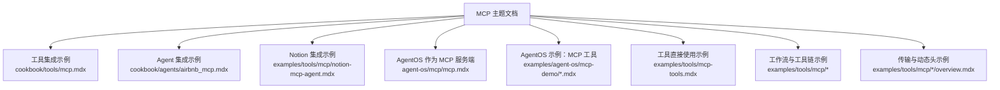
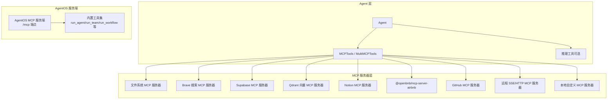
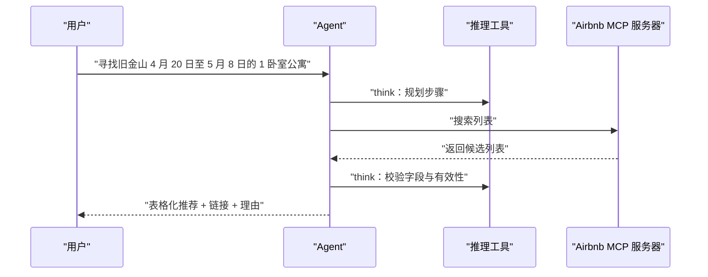
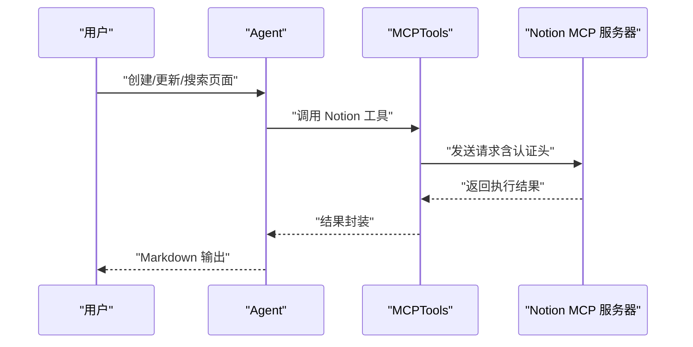
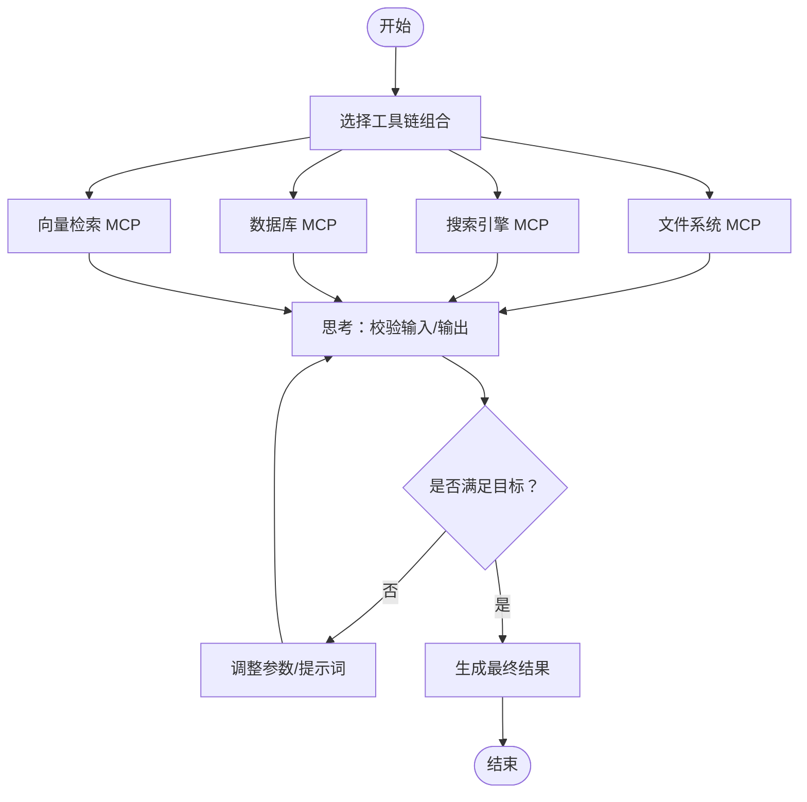
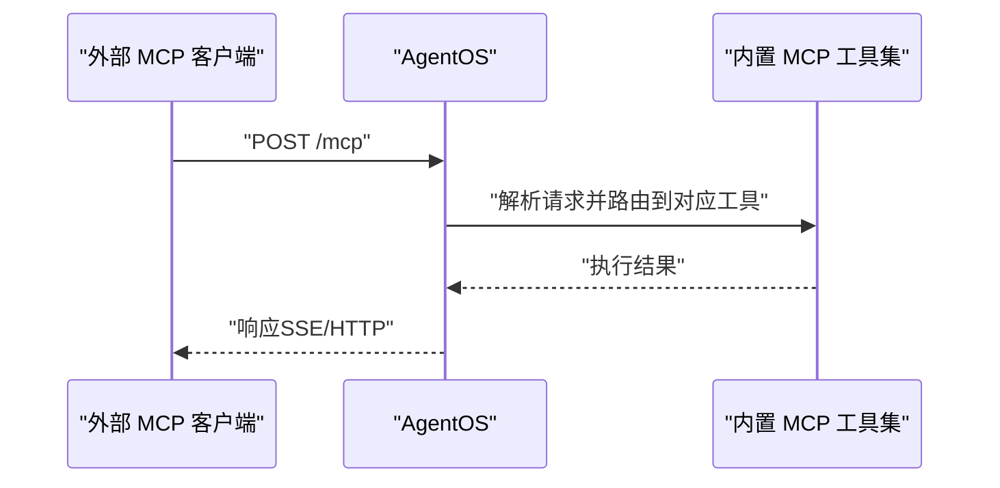
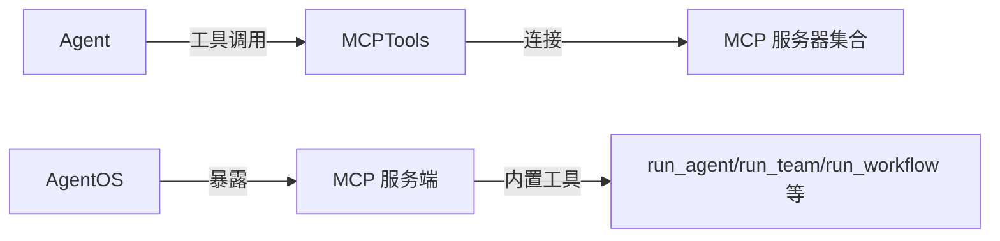

# MCP 使用示例

<cite>
**本文引用的文件**
- [cookbook/tools/mcp.mdx](file://cookbook/tools/mcp.mdx)
- [cookbook/agents/airbnb_mcp.mdx](file://cookbook/agents/airbnb_mcp.mdx)
- [tools/mcp/usage/notion.mdx](file://tools/mcp/usage/notion.mdx)
- [examples/tools/mcp/notion-mcp-agent.mdx](file://examples/tools/mcp/notion-mcp-agent.mdx)
- [agent-os/mcp/mcp.mdx](file://agent-os/mcp/mcp.mdx)
- [examples/agent-os/mcp-demo/mcp-tools-example.mdx](file://examples/agent-os/mcp-demo/mcp-tools-example.mdx)
- [examples/agent-os/mcp-demo/mcp-tools-advanced-example.mdx](file://examples/agent-os/mcp-demo/mcp-tools-advanced-example.mdx)
- [examples/tools/mcp-tools.mdx](file://examples/tools/mcp-tools.mdx)
- [examples/tools/mcp/sequential-thinking.mdx](file://examples/tools/mcp/sequential-thinking.mdx)
- [examples/tools/mcp/multiple-servers.mdx](file://examples/tools/mcp/multiple-servers.mdx)
- [examples/tools/mcp/github.mdx](file://examples/tools/mcp/github.mdx)
- [tools/mcp/usage/github.mdx](file://tools/mcp/usage/github.mdx)
- [examples/tools/mcp/include-exclude-tools.mdx](file://examples/tools/mcp/include-exclude-tools.mdx)
- [examples/tools/mcp/streamable-http-transport/overview.mdx](file://examples/tools/mcp/streamable-http-transport/overview.mdx)
- [examples/tools/mcp/sse-transport/overview.mdx](file://examples/tools/mcp/sse-transport/overview.mdx)
- [examples/tools/mcp/dynamic-headers/overview.mdx](file://examples/tools/mcp/dynamic-headers/overview.mdx)
- [agent-os/mcp/tools.mdx](file://agent-os/mcp/tools.mdx)
</cite>

## 目录
1. [简介](#简介)
2. [项目结构](#项目结构)
3. [核心组件](#核心组件)
4. [架构总览](#架构总览)
5. [详细组件分析](#详细组件分析)
6. [依赖关系分析](#依赖关系分析)
7. [性能考虑](#性能考虑)
8. [故障排查指南](#故障排查指南)
9. [结论](#结论)
10. [附录](#附录)

## 简介
本实践文档围绕 Model Context Protocol（MCP）在 Agno 中的使用展开，覆盖从基础连接到高级用法的完整学习路径。内容包括：
- 基于 MCP 的外部工具与数据源接入能力
- 多个真实场景的集成示例：Airbnb、GitHub、Notion 等 MCP 服务器
- 并行处理与顺序思考的工作流设计
- 工具链组合与复杂任务编排
- 调试技巧与性能优化建议
- AgentOS 作为 MCP 服务端的暴露方式与可用工具集

## 项目结构
以下图示展示了与 MCP 相关的核心文档与示例分布，便于按主题快速定位：

**图表来源**
- [cookbook/tools/mcp.mdx](file://cookbook/tools/mcp.mdx)
- [cookbook/agents/airbnb_mcp.mdx](file://cookbook/agents/airbnb_mcp.mdx)
- [examples/tools/mcp/notion-mcp-agent.mdx](file://examples/tools/mcp/notion-mcp-agent.mdx)
- [agent-os/mcp/mcp.mdx](file://agent-os/mcp/mcp.mdx)
- [examples/agent-os/mcp-demo/mcp-tools-example.mdx](file://examples/agent-os/mcp-demo/mcp-tools-example.mdx)
- [examples/agent-os/mcp-demo/mcp-tools-advanced-example.mdx](file://examples/agent-os/mcp-demo/mcp-tools-advanced-example.mdx)
- [examples/tools/mcp-tools.mdx](file://examples/tools/mcp-tools.mdx)
- [examples/tools/mcp/sequential-thinking.mdx](file://examples/tools/mcp/sequential-thinking.mdx)
- [examples/tools/mcp/multiple-servers.mdx](file://examples/tools/mcp/multiple-servers.mdx)
- [examples/tools/mcp/github.mdx](file://examples/tools/mcp/github.mdx)
- [examples/tools/mcp/streamable-http-transport/overview.mdx](file://examples/tools/mcp/streamable-http-transport/overview.mdx)
- [examples/tools/mcp/sse-transport/overview.mdx](file://examples/tools/mcp/sse-transport/overview.mdx)
- [examples/tools/mcp/dynamic-headers/overview.mdx](file://examples/tools/mcp/dynamic-headers/overview.mdx)

**章节来源**
- [cookbook/tools/mcp.mdx](file://cookbook/tools/mcp.mdx)
- [agent-os/mcp/mcp.mdx](file://agent-os/mcp/mcp.mdx)

## 核心组件
- MCPTools：封装与 MCP 服务器的连接与工具调用，支持本地命令启动、远程 SSE/HTTP、Stdio 客户端会话等模式。
- AgentOS 的 MCP 服务端：可将 AgentOS 暴露为 MCP 服务端，提供统一的工具集（如运行 Agent/Team/Workflow、会话查询、记忆体管理等）。
- 工具过滤与多服务器组合：通过 include/exclude 工具或 MultiMCPTools 组合多个 MCP 服务器，实现复杂工作流。

关键能力概览（基于仓库示例）：
- 文件系统访问、Web 搜索、数据库操作、向量检索、远程 SSE/HTTP 连接、本地自定义 MCP 服务器、动态 HTTP 头传递等。

**章节来源**
- [cookbook/tools/mcp.mdx](file://cookbook/tools/mcp.mdx)
- [agent-os/mcp/mcp.mdx](file://agent-os/mcp/mcp.mdx)

## 架构总览
下图展示了 Agent 与 MCP 服务器之间的交互关系，以及 AgentOS 作为 MCP 服务端时的对外暴露方式：

**图表来源**
- [cookbook/tools/mcp.mdx](file://cookbook/tools/mcp.mdx)
- [agent-os/mcp/mcp.mdx](file://agent-os/mcp/mcp.mdx)
- [examples/tools/mcp/notion-mcp-agent.mdx](file://examples/tools/mcp/notion-mcp-agent.mdx)
- [cookbook/agents/airbnb_mcp.mdx](file://cookbook/agents/airbnb_mcp.mdx)
- [examples/tools/mcp/github.mdx](file://examples/tools/mcp/github.mdx)

## 详细组件分析

### Airbnb 集成（MCP + Llama 4）
- 场景目标：通过 MCP 访问 Airbnb 列表搜索能力，结合推理工具进行顺序思考与结果整理。
- 关键要点：
  - 使用 MCPTools 包装 @openbnb/mcp-server-airbnb
  - 将 ReasoningTools 与 MCPTools 组合，指导 Agent 在每次工具调用后进行“思考”以验证结果
  - 输出要求：表格化推荐、提供链接、给出理由
- 最佳实践：
  - 明确提示词指令，强调“先思考再输出”
  - 对工具返回进行二次校验，避免直接信任结果
  - 控制输出格式，便于用户阅读与决策

**图表来源**
- [cookbook/agents/airbnb_mcp.mdx](file://cookbook/agents/airbnb_mcp.mdx)

**章节来源**
- [cookbook/agents/airbnb_mcp.mdx](file://cookbook/agents/airbnb_mcp.mdx)

### Notion 集成（MCP 服务器 + Agent）
- 场景目标：通过 Notion MCP 服务器对页面进行创建、更新与搜索。
- 关键要点：
  - 使用 StdioServerParameters 启动 @notionhq/notion-mcp-server，并注入 OPENAPI_MCP_HEADERS
  - 通过环境变量提供 Notion Token 与版本号
  - 将 MCPTools 注入 Agent，开启交互式 CLI
- 最佳实践：
  - 先在 Notion 中创建内部集成并授权相关页面
  - 明确修改前的确认流程，避免误操作
  - 使用 Markdown 输出，提升可读性

**图表来源**
- [examples/tools/mcp/notion-mcp-agent.mdx](file://examples/tools/mcp/notion-mcp-agent.mdx)
- [tools/mcp/usage/notion.mdx](file://tools/mcp/usage/notion.mdx)

**章节来源**
- [examples/tools/mcp/notion-mcp-agent.mdx](file://examples/tools/mcp/notion-mcp-agent.mdx)
- [tools/mcp/usage/notion.mdx](file://tools/mcp/usage/notion.mdx)

### GitHub 集成（MCP 服务器 + Agent）
- 场景目标：通过 MCP 访问 GitHub 数据与操作能力，辅助代码检索与上下文分析。
- 关键要点：
  - 使用 MCPTools 包装 GitHub MCP 服务器
  - 可结合其他工具（如文件系统、搜索引擎）形成复合工作流
- 最佳实践：
  - 明确 API Key 环境变量配置
  - 对敏感操作增加确认与审计

**章节来源**
- [examples/tools/mcp/github.mdx](file://examples/tools/mcp/github.mdx)
- [tools/mcp/usage/github.mdx](file://tools/mcp/usage/github.mdx)

### 多服务器与工具链组合
- 多服务器并行：在同一 Agent 中同时加载多个 MCPTools，分别对接不同能力（如文件系统 + 搜索引擎）
- 工具过滤：通过 include/exclude 精准控制 MCP 工具集，降低噪音与安全风险
- 顺序思考：在工具调用前后使用推理工具进行“思考”，确保每一步都符合预期

**图表来源**
- [examples/tools/mcp/multiple-servers.mdx](file://examples/tools/mcp/multiple-servers.mdx)
- [examples/tools/mcp/include-exclude-tools.mdx](file://examples/tools/mcp/include-exclude-tools.mdx)
- [examples/tools/mcp/sequential-thinking.mdx](file://examples/tools/mcp/sequential-thinking.mdx)

**章节来源**
- [examples/tools/mcp/multiple-servers.mdx](file://examples/tools/mcp/multiple-servers.mdx)
- [examples/tools/mcp/include-exclude-tools.mdx](file://examples/tools/mcp/include-exclude-tools.mdx)
- [examples/tools/mcp/sequential-thinking.mdx](file://examples/tools/mcp/sequential-thinking.mdx)

### AgentOS 作为 MCP 服务端
- 场景目标：将 AgentOS 暴露为 MCP 服务端，供外部客户端通过 /mcp 端点调用。
- 可用工具集（示例）：
  - 获取配置、运行 Agent/Team/Workflow
  - 查询会话列表、创建/更新/删除记忆体
- 最佳实践：
  - 在 AgentOS 初始化时启用 enable_mcp_server
  - 注意生命周期管理，避免热重载导致的连接刷新问题
  - 结合动态头传递用户上下文信息

**图表来源**
- [agent-os/mcp/mcp.mdx](file://agent-os/mcp/mcp.mdx)
- [agent-os/mcp/tools.mdx](file://agent-os/mcp/tools.mdx)

**章节来源**
- [agent-os/mcp/mcp.mdx](file://agent-os/mcp/mcp.mdx)
- [agent-os/mcp/tools.mdx](file://agent-os/mcp/tools.mdx)

### 传输与动态头示例
- Streamable HTTP/SSE 传输：适用于远程 MCP 服务器，支持流式响应
- 动态头：在请求中注入用户上下文或认证信息，实现个性化响应
- 本地自定义服务器：通过自定义 MCP 服务器扩展能力边界

**章节来源**
- [examples/tools/mcp/streamable-http-transport/overview.mdx](file://examples/tools/mcp/streamable-http-transport/overview.mdx)
- [examples/tools/mcp/sse-transport/overview.mdx](file://examples/tools/mcp/sse-transport/overview.mdx)
- [examples/tools/mcp/dynamic-headers/overview.mdx](file://examples/tools/mcp/dynamic-headers/overview.mdx)

## 依赖关系分析
- 组件耦合：
  - Agent 与 MCPTools 强耦合，MCPTools 提供统一的工具调用接口
  - AgentOS 与内置 MCP 工具集弱耦合，通过 /mcp 端点暴露
- 外部依赖：
  - MCP 服务器（如 Notion、Airbnb、GitHub、Brave、Supabase、Qdrant 等）
  - 传输层（Stdio、SSE、Streamable HTTP）
- 潜在循环依赖：
  - 无直接循环；MCPTools 仅作为工具注入 Agent，不反向依赖 Agent

**图表来源**
- [cookbook/tools/mcp.mdx](file://cookbook/tools/mcp.mdx)
- [agent-os/mcp/mcp.mdx](file://agent-os/mcp/mcp.mdx)

**章节来源**
- [cookbook/tools/mcp.mdx](file://cookbook/tools/mcp.mdx)
- [agent-os/mcp/mcp.mdx](file://agent-os/mcp/mcp.mdx)

## 性能考虑
- 传输选择：
  - 远程场景优先考虑 SSE 或 Streamable HTTP，减少延迟与提高吞吐
  - 本地场景可使用 Stdio，降低网络开销
- 工具过滤：
  - 通过 include/exclude 缩小工具集，减少不必要的请求与解析成本
- 连接复用：
  - 避免频繁重启 MCP 服务器；必要时使用手动刷新连接机制
- 超时与重试：
  - 为长耗时工具设置合理超时时间，防止阻塞主流程
- 输出格式：
  - 使用结构化输出（如表格）提升用户阅读效率，减少二次交互成本

## 故障排查指南
- 连接失败：
  - 检查 MCP 服务器命令是否正确、环境变量是否注入
  - 确认传输类型（Stdio/SSE/HTTP）与端点地址一致
- 权限错误：
  - Notion/Brave/GitHub 等需正确配置 Token 与权限范围
- 生命周期问题：
  - 使用 AgentOS 时避免热重载导致的连接中断；参考 AgentOS 文档中的注意事项
- 工具不可用：
  - 使用 include/exclude 精确指定工具名，确认服务器已发布对应工具
- 动态头无效：
  - 确认请求头名称与服务器侧读取逻辑一致

**章节来源**
- [agent-os/mcp/tools.mdx](file://agent-os/mcp/tools.mdx)
- [examples/tools/mcp/notion-mcp-agent.mdx](file://examples/tools/mcp/notion-mcp-agent.mdx)
- [examples/tools/mcp/github.mdx](file://examples/tools/mcp/github.mdx)

## 结论
通过 MCP，Agno 能够无缝连接多种外部工具与数据源，实现从简单文件系统查询到复杂知识工作流的全栈能力。结合推理工具与工具链组合，可以构建出既高效又可控的智能代理系统。建议在实际项目中：
- 明确场景需求，选择合适的 MCP 服务器与传输方式
- 通过工具过滤与动态头实现安全与个性化
- 使用顺序思考与结构化输出提升结果质量
- 建立完善的调试与性能监控体系

## 附录
- 快速开始清单：
  - 安装依赖：安装 agno、mcp、模型 SDK（如 OpenAI/Groq/Claude）
  - 配置环境变量：如 NOTION_API_KEY、BRAVE_API_KEY、GROQ_API_KEY 等
  - 选择示例：从 cookbook/tools/mcp.mdx 与 examples/tools/mcp/* 开始
  - 运行与调试：逐步替换为你的 MCP 服务器与提示词