# MCP 协议支持

<cite>
**本文引用的文件**
- [tools/mcp/overview.mdx](file://tools/mcp/overview.mdx)
- [tools/mcp/server-params.mdx](file://tools/mcp/server-params.mdx)
- [tools/mcp/transports/stdio.mdx](file://tools/mcp/transports/stdio.mdx)
- [tools/mcp/transports/sse.mdx](file://tools/mcp/transports/sse.mdx)
- [tools/mcp/transports/streamable_http.mdx](file://tools/mcp/transports/streamable_http.mdx)
- [tools/mcp/dynamic-headers.mdx](file://tools/mcp/dynamic-headers.mdx)
- [tools/mcp/mcp-toolbox.mdx](file://tools/mcp/mcp-toolbox.mdx)
- [agent-os/mcp/mcp.mdx](file://agent-os/mcp/mcp.mdx)
- [agent-os/mcp/tools.mdx](file://agent-os/mcp/tools.mdx)
- [cookbook/tools/mcp.mdx](file://cookbook/tools/mcp.mdx)
- [examples/tools/mcp-tools.mdx](file://examples/tools/mcp-tools.mdx)
- [examples/agent-os/mcp-demo/mcp-tools-example.mdx](file://examples/agent-os/mcp-demo/mcp-tools-example.mdx)
- [examples/agents/human-in-the-loop/confirmation-required-mcp-toolkit.mdx](file://examples/agents/human-in-the-loop/confirmation-required-mcp-toolkit.mdx)
- [examples/tools/mcp/dynamic-headers/overview.mdx](file://examples/tools/mcp/dynamic-headers/overview.mdx)
- [examples/agent-os/mcp-demo/dynamic-headers/server.mdx](file://examples/agent-os/mcp-demo/dynamic-headers/server.mdx)
</cite>

## 目录
1. [简介](#简介)
2. [项目结构](#项目结构)
3. [核心组件](#核心组件)
4. [架构总览](#架构总览)
5. [详细组件分析](#详细组件分析)
6. [依赖关系分析](#依赖关系分析)
7. [性能考量](#性能考量)
8. [故障排查指南](#故障排查指南)
9. [结论](#结论)
10. [附录](#附录)

## 简介
本技术文档围绕 Model Context Protocol（MCP）在智能代理中的集成与使用展开，重点覆盖以下方面：
- MCP 概念与在智能代理中的作用：通过标准化接口连接模型与外部工具/数据源，提升代理的扩展性与能力边界。
- MCP 服务器配置：服务器参数设置、认证配置、传输协议选择与动态头部管理。
- 传输协议详解：stdio、SSE、可流式 HTTP（Streamable HTTP）三种传输方式的特性、适用场景与配置要点。
- MCP 工具箱（MCPToolbox）：工具发现、工具过滤与调用、错误处理与生产级参数绑定。
- 本地部署与远程连接示例：从本地 MCP 服务器到远程托管服务的完整集成流程。

## 项目结构
本仓库中与 MCP 相关的内容主要分布在如下位置：
- 工具层文档：tools/mcp/* 提供 MCP 基础使用、传输协议、动态头部与工具箱等文档。
- AgentOS 集成：agent-os/mcp/* 提供将 AgentOS 暴露为 MCP 服务器以及在 AgentOS 中使用 MCPTools 的说明。
- 示例与食谱：cookbook/tools/mcp.mdx、examples/* 下的多个示例展示了 MCP 的多种用法与最佳实践。
- 动态头部示例：examples/tools/mcp/dynamic-headers/* 展示了如何在客户端侧动态注入 HTTP 头部，并在服务端读取这些头部。

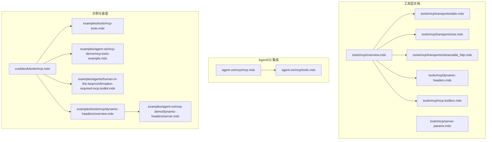

**图示来源**
- [tools/mcp/overview.mdx:1-257](file://tools/mcp/overview.mdx#L1-L257)
- [tools/mcp/server-params.mdx:1-40](file://tools/mcp/server-params.mdx#L1-L40)
- [tools/mcp/transports/stdio.mdx:1-82](file://tools/mcp/transports/stdio.mdx#L1-L82)
- [tools/mcp/transports/sse.mdx:1-157](file://tools/mcp/transports/sse.mdx#L1-L157)
- [tools/mcp/transports/streamable_http.mdx:1-155](file://tools/mcp/transports/streamable_http.mdx#L1-L155)
- [tools/mcp/dynamic-headers.mdx:1-156](file://tools/mcp/dynamic-headers.mdx#L1-L156)
- [tools/mcp/mcp-toolbox.mdx:1-252](file://tools/mcp/mcp-toolbox.mdx#L1-L252)
- [agent-os/mcp/mcp.mdx:1-146](file://agent-os/mcp/mcp.mdx#L1-L146)
- [agent-os/mcp/tools.mdx:1-57](file://agent-os/mcp/tools.mdx#L1-L57)
- [cookbook/tools/mcp.mdx:1-242](file://cookbook/tools/mcp.mdx#L1-L242)
- [examples/tools/mcp-tools.mdx:1-73](file://examples/tools/mcp-tools.mdx#L1-L73)
- [examples/agent-os/mcp-demo/mcp-tools-example.mdx:1-75](file://examples/agent-os/mcp-demo/mcp-tools-example.mdx#L1-L75)
- [examples/agents/human-in-the-loop/confirmation-required-mcp-toolkit.mdx:1-99](file://examples/agents/human-in-the-loop/confirmation-required-mcp-toolkit.mdx#L1-L99)
- [examples/tools/mcp/dynamic-headers/overview.mdx:1-8](file://examples/tools/mcp/dynamic-headers/overview.mdx#L1-L8)
- [examples/agent-os/mcp-demo/dynamic-headers/server.mdx:1-47](file://examples/agent-os/mcp-demo/dynamic-headers/server.mdx#L1-L47)

**章节来源**
- [tools/mcp/overview.mdx:1-257](file://tools/mcp/overview.mdx#L1-L257)
- [agent-os/mcp/mcp.mdx:1-146](file://agent-os/mcp/mcp.mdx#L1-L146)

## 核心组件
- MCPTools：面向代理的 MCP 客户端封装，支持连接生命周期管理、工具发现与调用、多服务器聚合（MultiMCPTools）、动态头部注入、确认要求（requires_confirmation_tools）等。
- MCPToolbox：基于 MCPToolbox 的数据库工具箱，支持按 toolset 或单个工具名进行筛选，减少“工具过载”，并提供认证令牌与参数绑定能力。
- AgentOS MCP 服务器：将 AgentOS 暴露为 MCP 服务器，提供运行代理、团队、工作流及会话/记忆操作等工具。
- 传输层：stdio、SSE、Streamable HTTP 三种传输协议，分别适用于本地进程、受限网络或需要多客户端并发与 SSE 流式输出的场景。

**章节来源**
- [tools/mcp/overview.mdx:212-222](file://tools/mcp/overview.mdx#L212-L222)
- [tools/mcp/mcp-toolbox.mdx:1-252](file://tools/mcp/mcp-toolbox.mdx#L1-L252)
- [agent-os/mcp/mcp.mdx:1-146](file://agent-os/mcp/mcp.mdx#L1-L146)

## 架构总览
下图展示了 MCP 在智能代理中的典型交互架构：代理通过 MCPTools/MultiMCPTools 连接一个或多个 MCP 服务器；服务器可以是本地进程（stdio）、远程 HTTP（SSE/Streamable HTTP），并在需要时携带动态头部；AgentOS 可以作为 MCP 服务器对外提供工具。

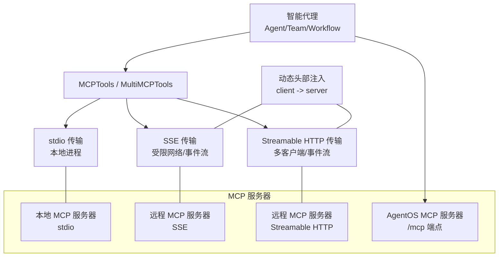

**图示来源**
- [tools/mcp/transports/stdio.mdx:1-82](file://tools/mcp/transports/stdio.mdx#L1-L82)
- [tools/mcp/transports/sse.mdx:1-157](file://tools/mcp/transports/sse.mdx#L1-L157)
- [tools/mcp/transports/streamable_http.mdx:1-155](file://tools/mcp/transports/streamable_http.mdx#L1-L155)
- [tools/mcp/dynamic-headers.mdx:1-156](file://tools/mcp/dynamic-headers.mdx#L1-L156)
- [agent-os/mcp/mcp.mdx:1-146](file://agent-os/mcp/mcp.mdx#L1-L146)

## 详细组件分析

### MCPTools 使用与生命周期管理
- 连接管理：推荐显式调用 connect()/close() 或使用异步上下文管理器确保资源清理；在 AgentOS 中由框架自动管理生命周期。
- 自动刷新：可通过 refresh_connection 参数在每次运行前检查并重建连接，适合托管型 MCP 服务器频繁重启或工具列表变化的场景。
- 多服务器聚合：MultiMCPTools 支持同时连接多个不同传输类型的 MCP 服务器，并可为每个服务器指定 transport。
- 工具过滤：支持 include_tools/exclude_tools 与 tool_name_prefix，避免工具过载并便于命名冲突解决。
- 确认要求：requires_confirmation_tools 可对特定工具调用启用人工确认流程。

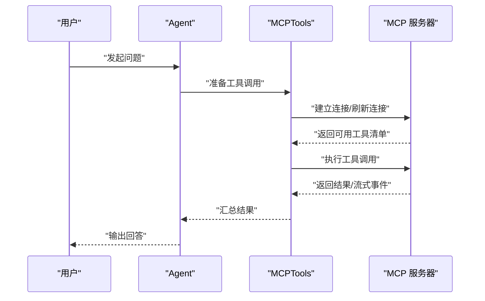

**图示来源**
- [tools/mcp/overview.mdx:131-190](file://tools/mcp/overview.mdx#L131-L190)
- [tools/mcp/overview.mdx:191-211](file://tools/mcp/overview.mdx#L191-L211)

**章节来源**
- [tools/mcp/overview.mdx:131-211](file://tools/mcp/overview.mdx#L131-L211)
- [agent-os/mcp/tools.mdx:1-57](file://agent-os/mcp/tools.mdx#L1-L57)

### 传输协议详解
- stdio 传输
  - 特点：默认传输，适合本地集成；通过命令启动本地 MCP 服务器。
  - 适用：本地开发、受限环境下的进程间通信。
  - 配置：使用 command 参数或 StdioServerParameters。
- SSE 传输
  - 特点：服务端推送事件，适合受限网络；不建议新项目继续使用。
  - 适用：旧版 MCP 服务器或特定网络限制场景。
  - 配置：使用 url 与 transport="sse"，可结合 SSEClientParams 设置 headers、超时等。
- Streamable HTTP 传输
  - 特点：新标准，支持多客户端连接，可结合 SSE 实现服务端到客户端的流式输出。
  - 适用：现代远程 MCP 服务器、云原生部署。
  - 配置：使用 url 与 transport="streamable-http"，可结合 StreamableHTTPClientParams 设置 headers、超时、SSE 读超时、关闭时终止等。

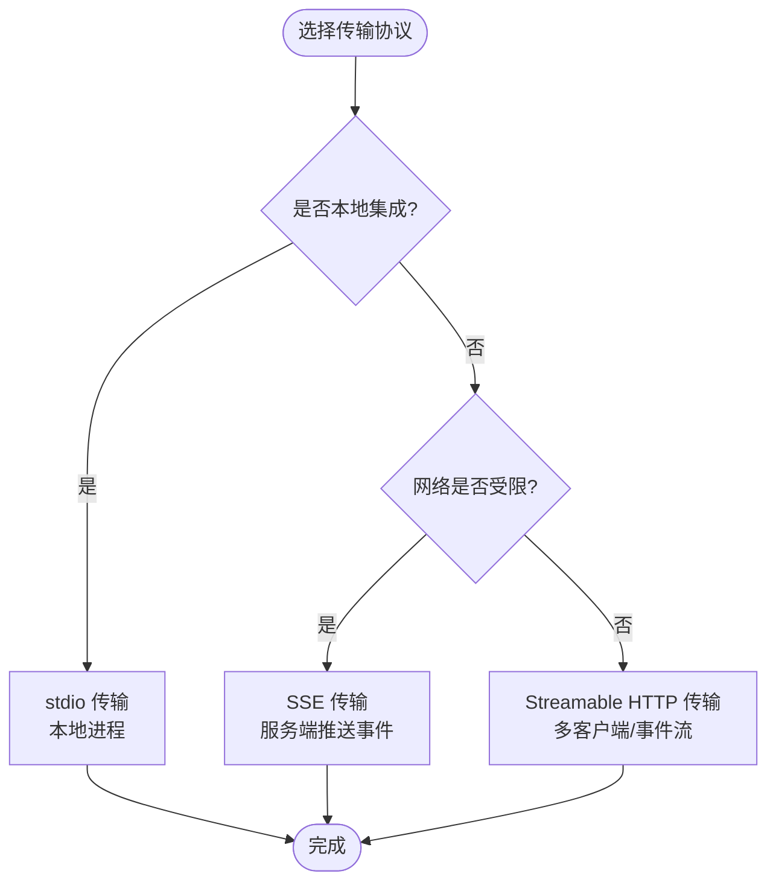

**图示来源**
- [tools/mcp/transports/stdio.mdx:1-82](file://tools/mcp/transports/stdio.mdx#L1-L82)
- [tools/mcp/transports/sse.mdx:1-157](file://tools/mcp/transports/sse.mdx#L1-L157)
- [tools/mcp/transports/streamable_http.mdx:1-155](file://tools/mcp/transports/streamable_http.mdx#L1-L155)

**章节来源**
- [tools/mcp/transports/stdio.mdx:1-82](file://tools/mcp/transports/stdio.mdx#L1-L82)
- [tools/mcp/transports/sse.mdx:1-157](file://tools/mcp/transports/sse.mdx#L1-L157)
- [tools/mcp/transports/streamable_http.mdx:1-155](file://tools/mcp/transports/streamable_http.mdx#L1-L155)

### 动态头部管理
- 客户端侧：通过 header_provider 函数在每次调用时动态生成 HTTP 头部，如用户标识、会话标识、代理/团队名称等。
- 服务端侧：在 MCP 服务器中读取并解析请求头，用于个性化响应或审计日志。
- 适用场景：多租户、跨会话追踪、权限控制与审计。

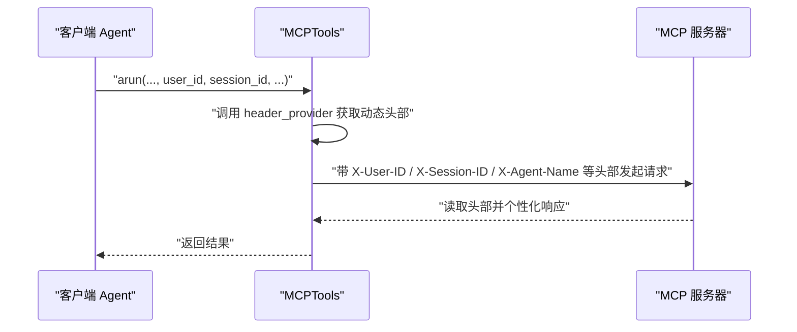

**图示来源**
- [tools/mcp/dynamic-headers.mdx:1-156](file://tools/mcp/dynamic-headers.mdx#L1-L156)
- [examples/tools/mcp/dynamic-headers/overview.mdx:1-8](file://examples/tools/mcp/dynamic-headers/overview.mdx#L1-L8)
- [examples/agent-os/mcp-demo/dynamic-headers/server.mdx:1-47](file://examples/agent-os/mcp-demo/dynamic-headers/server.mdx#L1-L47)

**章节来源**
- [tools/mcp/dynamic-headers.mdx:1-156](file://tools/mcp/dynamic-headers.mdx#L1-L156)
- [examples/tools/mcp/dynamic-headers/overview.mdx:1-8](file://examples/tools/mcp/dynamic-headers/overview.mdx#L1-L8)
- [examples/agent-os/mcp-demo/dynamic-headers/server.mdx:1-47](file://examples/agent-os/mcp-demo/dynamic-headers/server.mdx#L1-L47)

### MCP 工具箱（MCPToolbox）
- 能力概述：针对数据库 MCP 工具箱，支持按 toolset 或单个工具名筛选，减少工具数量，聚焦相关能力。
- 关键参数与函数：
  - 参数：url、toolsets、tool_name、headers、transport。
  - 方法：connect、load_tool、load_toolset、load_multiple_toolsets、load_toolset_safe、get_client、close。
- 生产级能力：支持认证令牌获取器与参数绑定，便于在不同环境（测试/生产）中安全地加载工具集。

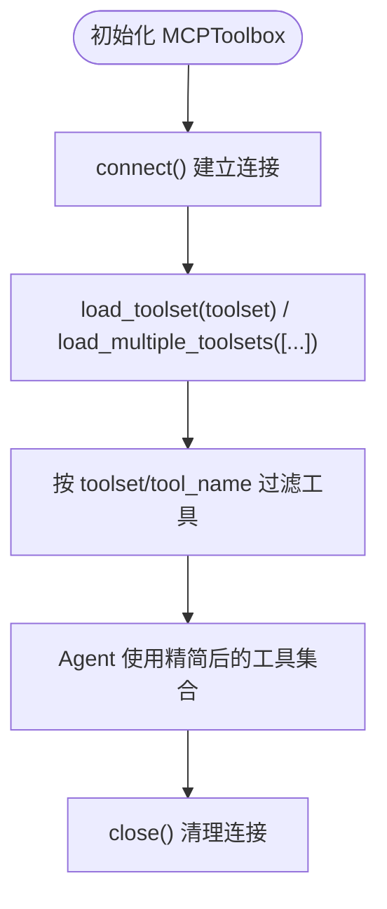

**图示来源**
- [tools/mcp/mcp-toolbox.mdx:209-234](file://tools/mcp/mcp-toolbox.mdx#L209-L234)

**章节来源**
- [tools/mcp/mcp-toolbox.mdx:1-252](file://tools/mcp/mcp-toolbox.mdx#L1-L252)

### AgentOS 作为 MCP 服务器
- 启用方式：在创建 AgentOS 时设置 enable_mcp_server=True，即可在 /mcp 端点暴露 MCP 服务器。
- 可用工具：提供运行 Agent/Team/Workflow、查询会话、管理记忆等工具，便于外部 MCP 客户端直接调用。
- 注意事项：在 AgentOS 中使用 MCPTools 时不要开启热重载（reload=True），以免破坏 MCP 生命周期。

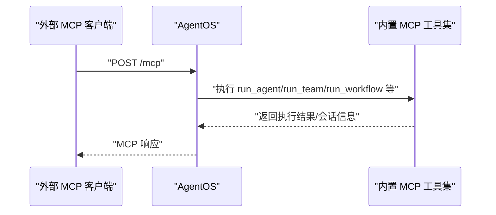

**图示来源**
- [agent-os/mcp/mcp.mdx:1-146](file://agent-os/mcp/mcp.mdx#L1-L146)
- [agent-os/mcp/tools.mdx:1-57](file://agent-os/mcp/tools.mdx#L1-L57)

**章节来源**
- [agent-os/mcp/mcp.mdx:1-146](file://agent-os/mcp/mcp.mdx#L1-L146)
- [agent-os/mcp/tools.mdx:1-57](file://agent-os/mcp/tools.mdx#L1-L57)

### 服务器参数与认证配置
- stdio：通过 StdioServerParameters 指定 command、args、env，支持传递环境变量（如 API Key）。
- SSE：通过 SSEClientParams 指定 url、headers、timeout、sse_read_timeout。
- Streamable HTTP：通过 StreamableHTTPClientParams 指定 url、headers、timeout、sse_read_timeout、terminate_on_close。

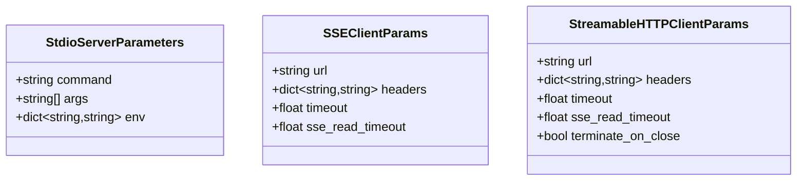

**图示来源**
- [tools/mcp/server-params.mdx:11-37](file://tools/mcp/server-params.mdx#L11-L37)

**章节来源**
- [tools/mcp/server-params.mdx:1-40](file://tools/mcp/server-params.mdx#L1-L40)

### 工具发现、调用与错误处理
- 工具发现：MCPTools 在连接后拉取工具清单；MCPToolbox 可按 toolset 进行筛选。
- 工具调用：通过 Agent 的工具链路触发；支持流式输出与分段响应。
- 错误处理：建议在客户端捕获连接异常、超时与工具调用失败；在需要时使用 requires_confirmation_tools 对高风险工具进行人工确认。

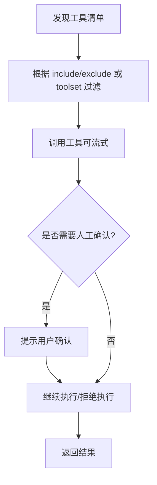

**图示来源**
- [tools/mcp/overview.mdx:191-211](file://tools/mcp/overview.mdx#L191-L211)
- [examples/agents/human-in-the-loop/confirmation-required-mcp-toolkit.mdx:1-99](file://examples/agents/human-in-the-loop/confirmation-required-mcp-toolkit.mdx#L1-L99)

**章节来源**
- [tools/mcp/overview.mdx:191-211](file://tools/mcp/overview.mdx#L191-L211)
- [examples/agents/human-in-the-loop/confirmation-required-mcp-toolkit.mdx:1-99](file://examples/agents/human-in-the-loop/confirmation-required-mcp-toolkit.mdx#L1-L99)

### 本地部署与远程连接示例
- 本地 MCP 服务器：使用 stdio 传输，通过命令启动本地服务器，再由 MCPTools 连接。
- 远程 MCP 服务器：使用 SSE 或 Streamable HTTP 传输，通过 url 指定远程端点。
- AgentOS 集成：在 AgentOS 中直接注入 MCPTools，由 AgentOS 管理生命周期与路由。

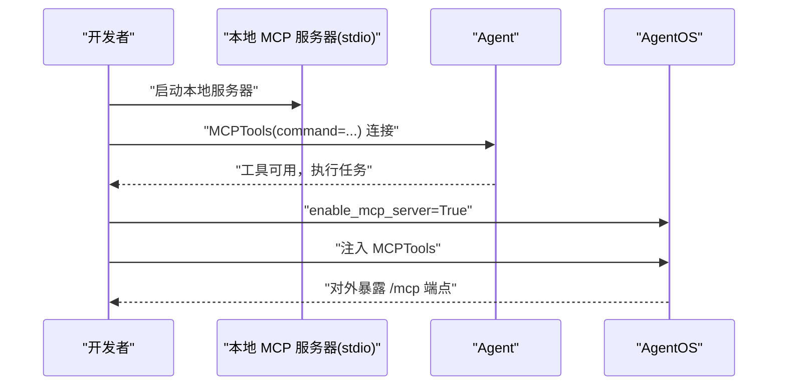

**图示来源**
- [tools/mcp/transports/stdio.mdx:1-82](file://tools/mcp/transports/stdio.mdx#L1-L82)
- [tools/mcp/transports/sse.mdx:59-157](file://tools/mcp/transports/sse.mdx#L59-L157)
- [tools/mcp/transports/streamable_http.mdx:56-155](file://tools/mcp/transports/streamable_http.mdx#L56-L155)
- [agent-os/mcp/mcp.mdx:1-146](file://agent-os/mcp/mcp.mdx#L1-L146)

**章节来源**
- [tools/mcp/transports/stdio.mdx:1-82](file://tools/mcp/transports/stdio.mdx#L1-L82)
- [tools/mcp/transports/sse.mdx:59-157](file://tools/mcp/transports/sse.mdx#L59-L157)
- [tools/mcp/transports/streamable_http.mdx:56-155](file://tools/mcp/transports/streamable_http.mdx#L56-L155)
- [agent-os/mcp/mcp.mdx:1-146](file://agent-os/mcp/mcp.mdx#L1-L146)

## 依赖关系分析
- 组件耦合
  - MCPTools 依赖于具体传输实现（stdio/SSE/Streamable HTTP）与底层 MCP 客户端会话。
  - MCPToolbox 在 MCPTools 基础上增加工具集筛选与认证令牌绑定逻辑。
  - AgentOS 将 MCP 服务器作为内置服务，提供统一的 /mcp 接口。
- 外部依赖
  - mcp 客户端库（如 stdio_client、ClientSession）用于建立会话。
  - fastmcp（示例中）用于快速搭建 SSE/Streamable HTTP 服务器。
- 循环依赖
  - 文档与示例之间为单向引用，未见循环依赖迹象。

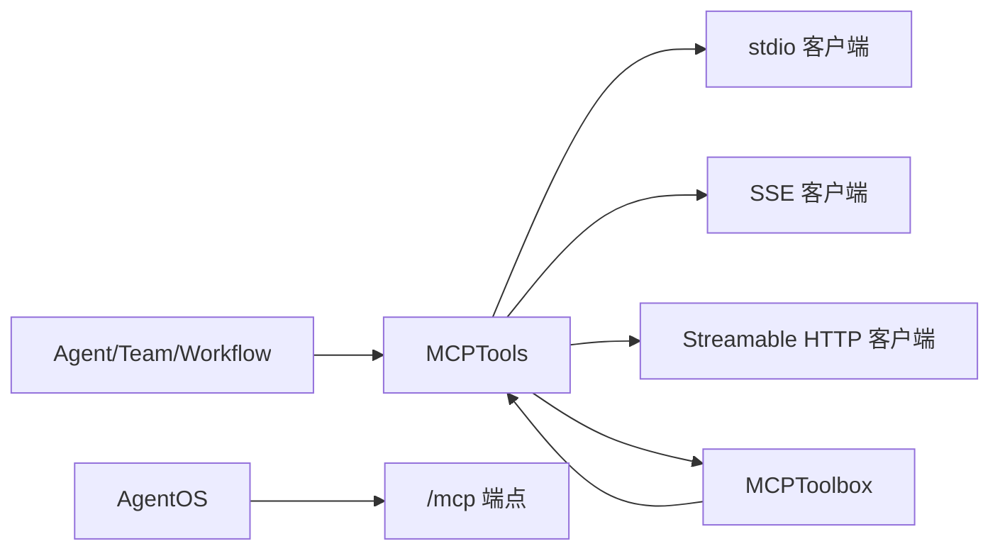

**图示来源**
- [examples/tools/mcp-tools.mdx:1-73](file://examples/tools/mcp-tools.mdx#L1-L73)
- [tools/mcp/transports/stdio.mdx:1-82](file://tools/mcp/transports/stdio.mdx#L1-L82)
- [tools/mcp/transports/sse.mdx:1-157](file://tools/mcp/transports/sse.mdx#L1-L157)
- [tools/mcp/transports/streamable_http.mdx:1-155](file://tools/mcp/transports/streamable_http.mdx#L1-L155)
- [tools/mcp/mcp-toolbox.mdx:1-252](file://tools/mcp/mcp-toolbox.mdx#L1-L252)
- [agent-os/mcp/mcp.mdx:1-146](file://agent-os/mcp/mcp.mdx#L1-L146)

**章节来源**
- [examples/tools/mcp-tools.mdx:1-73](file://examples/tools/mcp-tools.mdx#L1-L73)
- [tools/mcp/mcp-toolbox.mdx:1-252](file://tools/mcp/mcp-toolbox.mdx#L1-L252)
- [agent-os/mcp/mcp.mdx:1-146](file://agent-os/mcp/mcp.mdx#L1-L146)

## 性能考量
- 连接复用：优先使用显式 connect()/close() 或 AgentOS 生命周期管理，避免每次运行都重新建立连接。
- 刷新策略：仅在托管型服务器频繁重启或工具列表变化时启用 refresh_connection，以平衡可靠性与性能。
- 工具筛选：使用 MCPToolbox 的 toolset 过滤减少工具数量，降低模型推理负担与工具选择开销。
- 传输选择：在受限网络使用 SSE，其他场景优先 Streamable HTTP 以获得更好的并发与流式体验。

## 故障排查指南
- 连接失败
  - 检查服务器地址与传输类型是否匹配；确认网络可达性与防火墙策略。
  - 对 SSE/Streamable HTTP，检查 headers、超时与 SSE 读超时设置。
- 工具不可用
  - 确认服务器已正确发布工具；检查 include/exclude 与 toolset 过滤配置。
  - 若使用 MCPToolbox，请验证 toolset 名称与可用性。
- 人工确认阻塞
  - 检查 requires_confirmation_tools 配置；在人类在回路场景中确保正确处理确认流程。
- AgentOS 生命周期
  - 使用 MCPTools 时不要开启 reload=True，以免破坏 MCP 连接生命周期。

**章节来源**
- [tools/mcp/overview.mdx:191-211](file://tools/mcp/overview.mdx#L191-L211)
- [examples/agents/human-in-the-loop/confirmation-required-mcp-toolkit.mdx:1-99](file://examples/agents/human-in-the-loop/confirmation-required-mcp-toolkit.mdx#L1-L99)
- [agent-os/mcp/tools.mdx:1-57](file://agent-os/mcp/tools.mdx#L1-L57)

## 结论
MCP 为智能代理提供了标准化、可扩展的外部工具接入能力。通过合理选择传输协议、配置服务器参数与动态头部、使用 MCPToolbox 进行工具筛选与认证绑定，并结合 AgentOS 的 MCP 服务器能力，可以在本地与云端环境中高效构建强大的代理系统。建议在生产环境中采用显式的连接管理与工具筛选策略，以获得更稳定与高性能的运行效果。

## 附录
- 快速参考
  - 传输协议：stdio（本地）、SSE（受限网络，不推荐）、Streamable HTTP（推荐）。
  - 服务器参数：stdio（command/args/env）、SSE（url/headers/timeout/sse_read_timeout）、Streamable HTTP（url/headers/timeout/sse_read_timeout/terminate_on_close）。
  - 工具箱参数：url、toolsets/tool_name、headers、transport；支持认证令牌与参数绑定。
  - AgentOS：enable_mcp_server=True 暴露 /mcp 端点，内置工具集包括运行 Agent/Team/Workflow、会话与记忆管理。