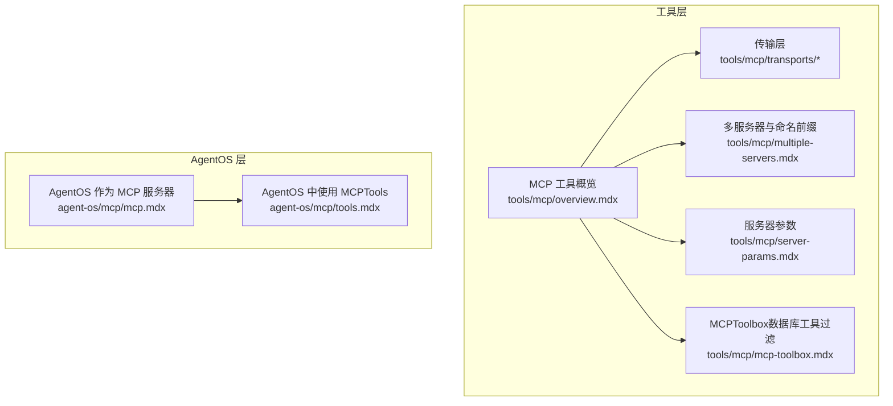
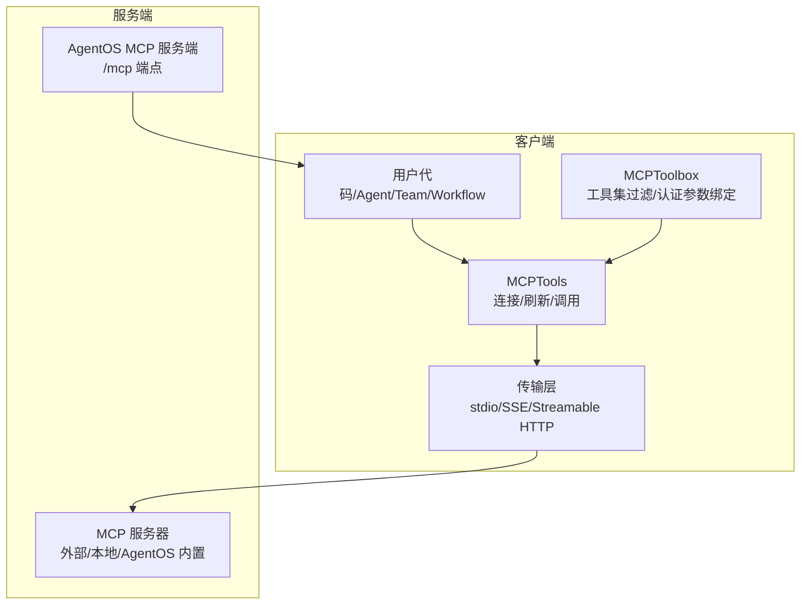
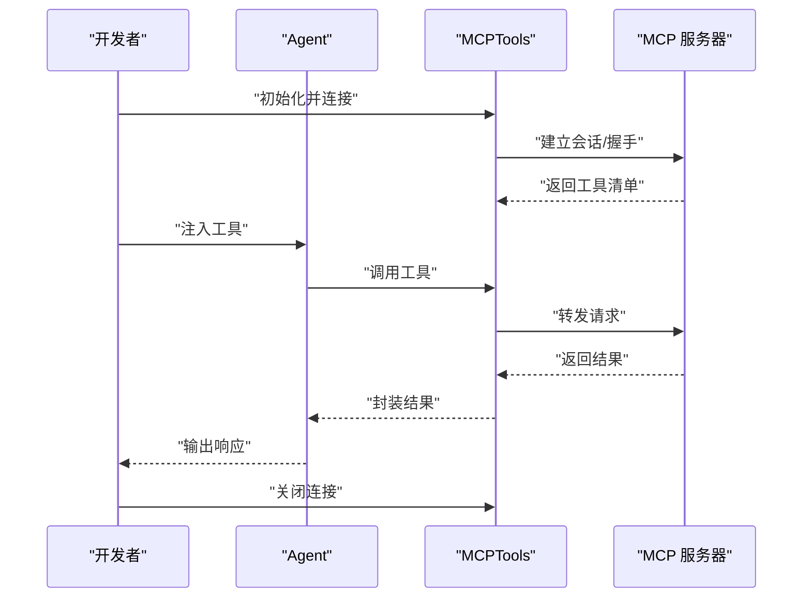
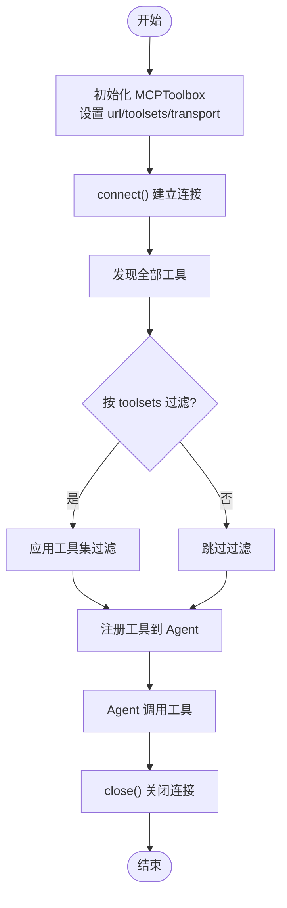
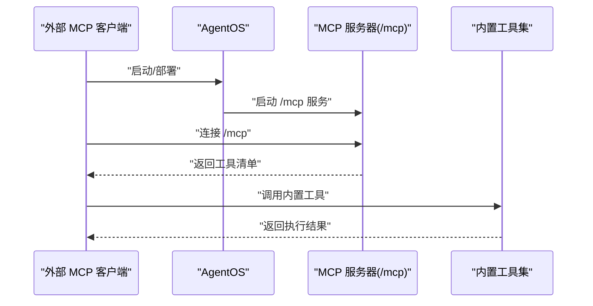
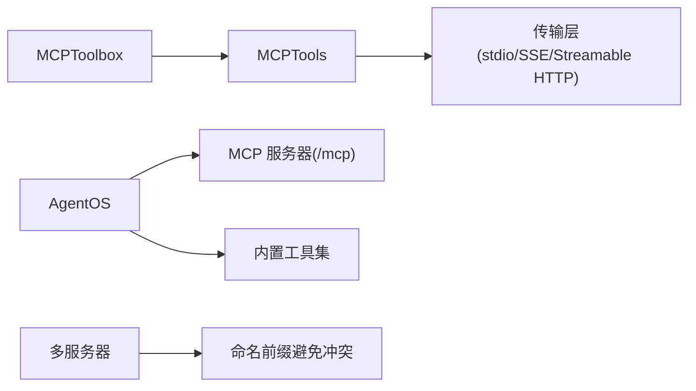

# MCP 工具箱

<cite>
**本文引用的文件**
- [tools/mcp/overview.mdx](file://tools/mcp/overview.mdx)
- [agent-os/mcp/mcp.mdx](file://agent-os/mcp/mcp.mdx)
- [agent-os/mcp/tools.mdx](file://agent-os/mcp/tools.mdx)
- [tools/mcp/mcp-toolbox.mdx](file://tools/mcp/mcp-toolbox.mdx)
- [tools/mcp/multiple-servers.mdx](file://tools/mcp/multiple-servers.mdx)
- [tools/mcp/server-params.mdx](file://tools/mcp/server-params.mdx)
- [tools/mcp/transports/streamable_http.mdx](file://tools/mcp/transports/streamable_http.mdx)
- [tools/mcp/transports/stdio.mdx](file://tools/mcp/transports/stdio.mdx)
- [tools/mcp/transports/sse.mdx](file://tools/mcp/transports/sse.mdx)
- [examples/tools/mcp-tools.mdx](file://examples/tools/mcp-tools.mdx)
- [examples/tools/mcp/tool-name-prefix.mdx](file://examples/tools/mcp/tool-name-prefix.mdx)
</cite>

## 目录
1. [简介](#简介)
2. [项目结构](#项目结构)
3. [核心组件](#核心组件)
4. [架构总览](#架构总览)
5. [详细组件分析](#详细组件分析)
6. [依赖关系分析](#依赖关系分析)
7. [性能考量](#性能考量)
8. [故障排查指南](#故障排查指南)
9. [结论](#结论)
10. [附录](#附录)

## 简介
本技术文档围绕 MCP（模型上下文协议）工具箱展开，系统阐述其概念、作用与实现方式，重点覆盖以下方面：
- 工具发现：从 MCP 服务器动态拉取可用工具清单
- 工具注册：将工具注册到 Agent/Team/Workflow 的工具集合中
- 工具管理：连接生命周期、认证参数绑定、工具集过滤与命名前缀等
- 外部工具集成：数据库工具、文件系统工具、Web API 工具等
- 使用示例：创建自定义 MCP 工具与工具包、并行调用、工具链组合、错误处理策略
- 生命周期管理：加载、调用、缓存与卸载

MCP 工具箱通过统一的传输层（stdio/SSE/Streamable HTTP）与 MCP 服务器交互，支持本地与远程场景，并在 AgentOS 中提供自动生命周期管理。

## 项目结构
与 MCP 工具箱相关的文档主要分布在 tools/mcp 与 agent-os/mcp 两个路径下：
- tools/mcp：MCP 工具通用说明、传输层、多服务器与参数配置、以及 MCPToolbox（数据库工具过滤）专题
- agent-os/mcp：在 AgentOS 控制平面中暴露 MCP 服务端与使用 MCPTools 的最佳实践

图表来源
- [tools/mcp/overview.mdx:1-257](file://tools/mcp/overview.mdx#L1-L257)
- [tools/mcp/mcp-toolbox.mdx:1-252](file://tools/mcp/mcp-toolbox.mdx#L1-L252)
- [agent-os/mcp/mcp.mdx:1-146](file://agent-os/mcp/mcp.mdx#L1-L146)
- [agent-os/mcp/tools.mdx:1-57](file://agent-os/mcp/tools.mdx#L1-L57)

章节来源
- [tools/mcp/overview.mdx:1-257](file://tools/mcp/overview.mdx#L1-L257)
- [agent-os/mcp/mcp.mdx:1-146](file://agent-os/mcp/mcp.mdx#L1-L146)
- [agent-os/mcp/tools.mdx:1-57](file://agent-os/mcp/tools.mdx#L1-L57)

## 核心组件
- MCPTools：通用 MCP 客户端封装，负责连接、刷新连接、工具发现与调用
- MCPToolbox：在 MCPTools 基础上扩展工具集过滤能力，按 toolset 或单个工具名进行筛选
- AgentOS MCP 服务端：将 AgentOS 暴露为 MCP 服务器，供外部客户端调用
- 传输层：支持 stdio、SSE、Streamable HTTP 三种传输方式

关键职责与行为
- 连接管理：显式 connect()/close() 或异步上下文管理器；在 AgentOS 中由控制平面自动管理生命周期
- 工具发现与注册：首次连接或刷新时从服务器拉取工具清单并注入到工具集合
- 认证与参数绑定：支持为工具集设置令牌获取器与绑定参数，用于生产环境
- 工具集过滤：MCPToolbox 支持按 toolset 或具体工具名进行筛选，缓解“工具过载”
- 命名前缀：避免多服务器工具名称冲突

章节来源
- [tools/mcp/overview.mdx:131-190](file://tools/mcp/overview.mdx#L131-L190)
- [tools/mcp/mcp-toolbox.mdx:209-233](file://tools/mcp/mcp-toolbox.mdx#L209-L233)
- [agent-os/mcp/mcp.mdx:62-145](file://agent-os/mcp/mcp.mdx#L62-L145)

## 架构总览
MCP 工具箱整体架构由“客户端工具层”和“服务端控制层”构成。客户端通过 MCPTools/MCPToolbox 与任意 MCP 服务器交互；AgentOS 可作为 MCP 服务器对外提供内置工具。

图表来源
- [tools/mcp/overview.mdx:26-74](file://tools/mcp/overview.mdx#L26-L74)
- [tools/mcp/transports/streamable_http.mdx](file://tools/mcp/transports/streamable_http.mdx)
- [tools/mcp/transports/stdio.mdx](file://tools/mcp/transports/stdio.mdx)
- [tools/mcp/transports/sse.mdx](file://tools/mcp/transports/sse.mdx)
- [agent-os/mcp/mcp.mdx:58-58](file://agent-os/mcp/mcp.mdx#L58-L58)

## 详细组件分析

### 组件一：MCPTools（通用工具）
- 功能要点
  - 初始化与连接：支持命令行启动本地服务器或连接远程服务器
  - 自动/手动生命周期管理：在 AgentOS 中自动管理；独立使用时可显式 connect()/close() 或使用异步上下文管理器
  - 连接刷新：在每次运行前检查并刷新连接，适合托管服务器频繁重启或变更场景
  - 传输层选择：stdio/SSE/Streamable HTTP
  - 工具集命名前缀：避免多服务器工具名冲突
- 典型流程
  - 创建实例 → connect() → 注入 Agent/Team → 运行 → close()

图表来源
- [tools/mcp/overview.mdx:131-190](file://tools/mcp/overview.mdx#L131-L190)

章节来源
- [tools/mcp/overview.mdx:131-190](file://tools/mcp/overview.mdx#L131-L190)
- [examples/tools/mcp-tools.mdx:1-72](file://examples/tools/mcp-tools.mdx#L1-L72)
- [tools/mcp/multiple-servers.mdx:164-191](file://tools/mcp/multiple-servers.mdx#L164-L191)

### 组件二：MCPToolbox（数据库工具过滤）
- 功能要点
  - 在 MCPToolbox 中仅加载指定 toolset 的工具，减少工具数量，提升聚焦度
  - 支持多个 toolset 合并加载
  - 支持认证令牌获取器与绑定参数，便于生产环境使用
  - 支持手动连接与关闭，或使用异步上下文管理器
- 参数与方法
  - 参数：url、toolsets、tool_name、headers、transport
  - 方法：connect()、load_tool()、load_toolset()、load_multiple_toolsets()、load_toolset_safe()、get_client()、close()

图表来源
- [tools/mcp/mcp-toolbox.mdx:93-114](file://tools/mcp/mcp-toolbox.mdx#L93-L114)
- [tools/mcp/mcp-toolbox.mdx:209-233](file://tools/mcp/mcp-toolbox.mdx#L209-L233)

章节来源
- [tools/mcp/mcp-toolbox.mdx:1-252](file://tools/mcp/mcp-toolbox.mdx#L1-L252)

### 组件三：AgentOS 作为 MCP 服务器
- 功能要点
  - 将 AgentOS 暴露为 MCP 服务器，提供统一的工具入口
  - 内置工具：获取配置、运行 Agent/Team/Workflow、查询会话、内存 CRUD 等
  - 通过 /mcp 端点提供服务，便于外部客户端连接
- 使用建议
  - 在 AgentOS 中使用 MCPTools 时，不要启用热重载（reload），以免破坏 MCP 连接
  - 如需刷新连接，可通过 refresh_connection 手动刷新

图表来源
- [agent-os/mcp/mcp.mdx:11-58](file://agent-os/mcp/mcp.mdx#L11-L58)
- [agent-os/mcp/tools.mdx:13-16](file://agent-os/mcp/tools.mdx#L13-L16)

章节来源
- [agent-os/mcp/mcp.mdx:1-146](file://agent-os/mcp/mcp.mdx#L1-L146)
- [agent-os/mcp/tools.mdx:1-57](file://agent-os/mcp/tools.mdx#L1-L57)

## 依赖关系分析
- MCPTools 依赖传输层（stdio/SSE/Streamable HTTP）与 MCP 协议客户端库
- MCPToolbox 依赖 MCPTools 并在其基础上增加工具集过滤与参数绑定能力
- AgentOS 作为 MCP 服务器依赖内置工具集与 FastAPI 应用生命周期管理
- 多服务器场景通过命名前缀避免工具名冲突

图表来源
- [tools/mcp/overview.mdx:212-222](file://tools/mcp/overview.mdx#L212-L222)
- [tools/mcp/mcp-toolbox.mdx:219-221](file://tools/mcp/mcp-toolbox.mdx#L219-L221)
- [agent-os/mcp/mcp.mdx:58-58](file://agent-os/mcp/mcp.mdx#L58-L58)

章节来源
- [tools/mcp/overview.mdx:212-222](file://tools/mcp/overview.mdx#L212-L222)
- [tools/mcp/mcp-toolbox.mdx:219-221](file://tools/mcp/mcp-toolbox.mdx#L219-L221)
- [agent-os/mcp/mcp.mdx:58-58](file://agent-os/mcp/mcp.mdx#L58-L58)

## 性能考量
- 连接刷新策略
  - 对于托管服务器频繁重启或工具清单变化频繁的场景，建议开启 refresh_connection，在每次运行前刷新连接与工具清单
  - 在独立使用时推荐显式 connect()/close()，避免不必要的自动刷新带来的开销
- 传输层选择
  - Streamable HTTP 适合远程/网络场景；stdio 适合本地进程；SSE 适用于事件推送场景
- 工具集过滤
  - 使用 MCPToolbox 的工具集过滤可显著减少工具数量，降低提示词负担与工具选择成本

章节来源
- [tools/mcp/overview.mdx:191-211](file://tools/mcp/overview.mdx#L191-L211)
- [tools/mcp/transports/streamable_http.mdx](file://tools/mcp/transports/streamable_http.mdx)
- [tools/mcp/transports/stdio.mdx](file://tools/mcp/transports/stdio.mdx)
- [tools/mcp/transports/sse.mdx](file://tools/mcp/transports/sse.mdx)

## 故障排查指南
- 连接生命周期问题
  - 在 AgentOS 中使用 MCPTools 时，不要启用 reload，否则可能在 FastAPI 生命周期中打断 MCP 连接
  - 如需刷新连接，使用 refresh_connection 或手动 connect()/close()
- 工具名冲突
  - 多服务器场景下使用 tool_name_prefix 为工具添加前缀，避免同名工具冲突
- 传输层问题
  - 确认传输类型与服务器支持情况；stdio 需要本地可执行；SSE/Streamable HTTP 需要网络可达
- 资源清理
  - 独立使用时务必在 finally 中调用 close()，防止资源泄漏

章节来源
- [agent-os/mcp/tools.mdx:13-16](file://agent-os/mcp/tools.mdx#L13-L16)
- [tools/mcp/overview.mdx:181-190](file://tools/mcp/overview.mdx#L181-L190)
- [tools/mcp/multiple-servers.mdx:164-191](file://tools/mcp/multiple-servers.mdx#L164-L191)
- [tools/mcp/overview.mdx:224-236](file://tools/mcp/overview.mdx#L224-L236)

## 结论
MCP 工具箱提供了标准化、可扩展的外部工具接入能力。通过 MCPTools 实现工具发现与调用，借助 MCPToolbox 实现工具集过滤与参数化，结合 AgentOS 的 MCP 服务端能力，可以快速构建从本地到云端的多样化工具生态。在实际工程中，应重视连接生命周期管理、传输层选择与工具集治理，以获得稳定、高性能与易维护的工具链。

## 附录

### 使用示例与最佳实践
- 文件系统代理示例：使用 MCPTools 连接文件系统服务器，探索目录与文件
- 异步上下文管理器：推荐使用 async with 管理连接生命周期
- 多服务器与命名前缀：为不同环境的工具添加前缀，避免冲突
- AgentOS 集成：在 AgentOS 中直接使用 MCPTools，由控制平面管理生命周期

章节来源
- [tools/mcp/overview.mdx:77-128](file://tools/mcp/overview.mdx#L77-L128)
- [examples/tools/mcp-tools.mdx:1-72](file://examples/tools/mcp-tools.mdx#L1-L72)
- [examples/tools/mcp/tool-name-prefix.mdx:1-54](file://examples/tools/mcp/tool-name-prefix.mdx#L1-L54)
- [agent-os/mcp/tools.mdx:18-56](file://agent-os/mcp/tools.mdx#L18-L56)