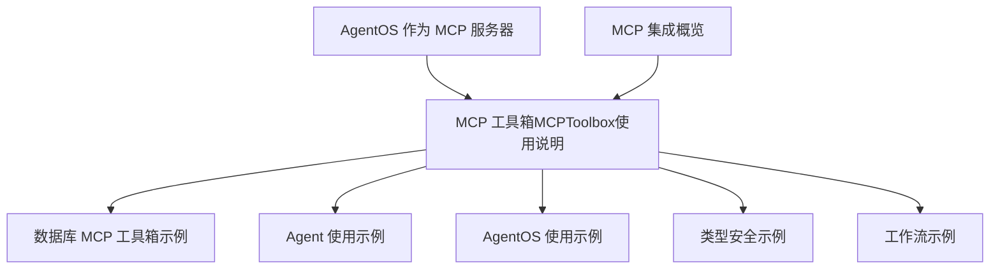
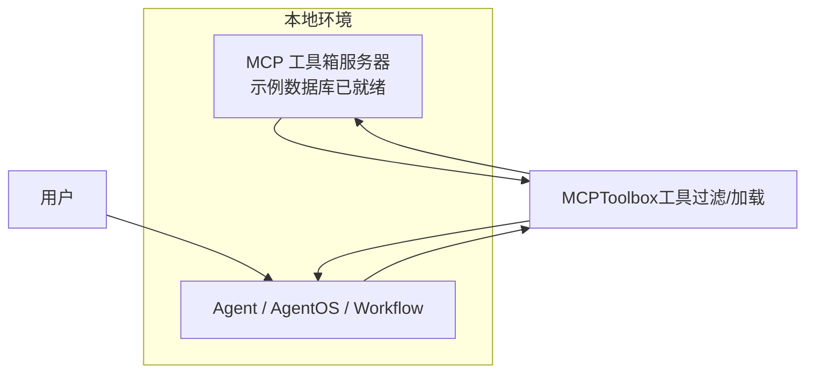
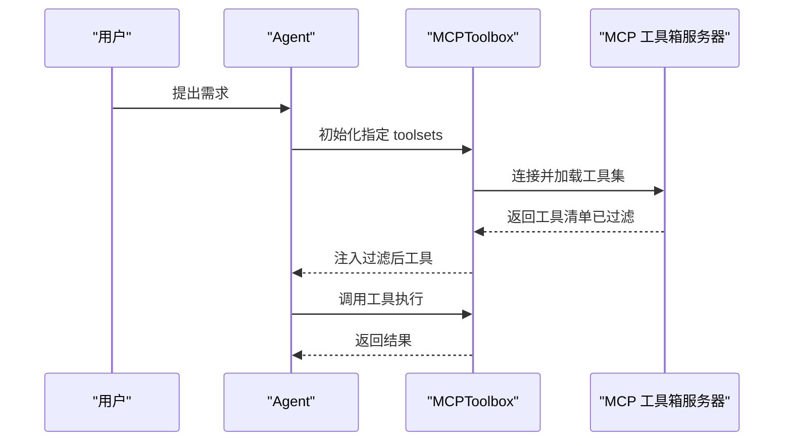
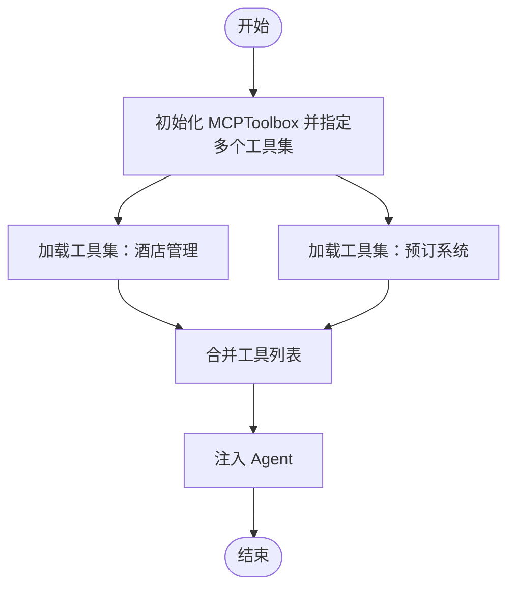
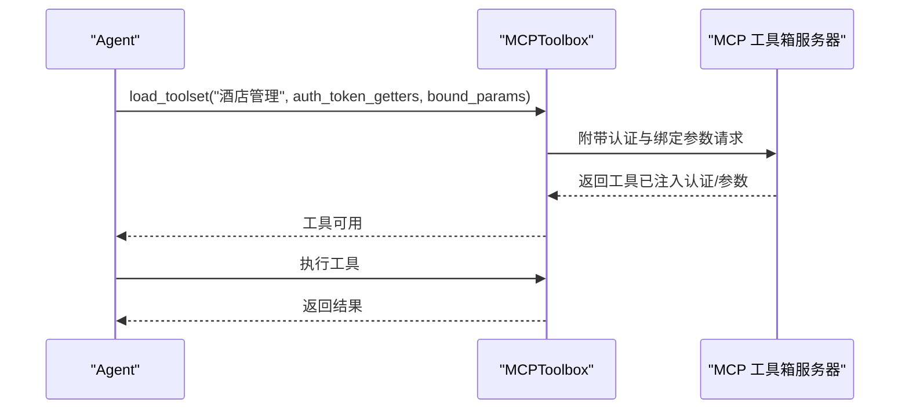
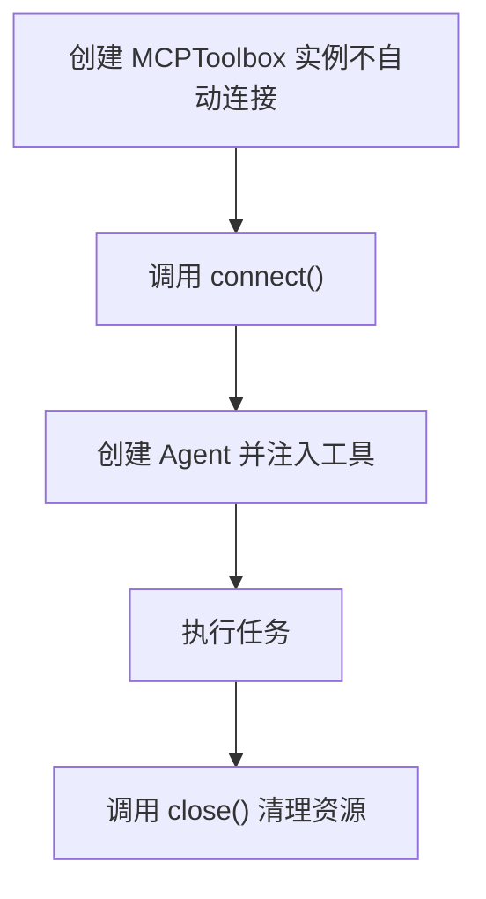
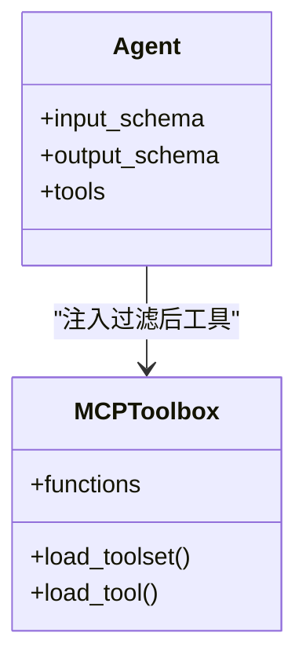
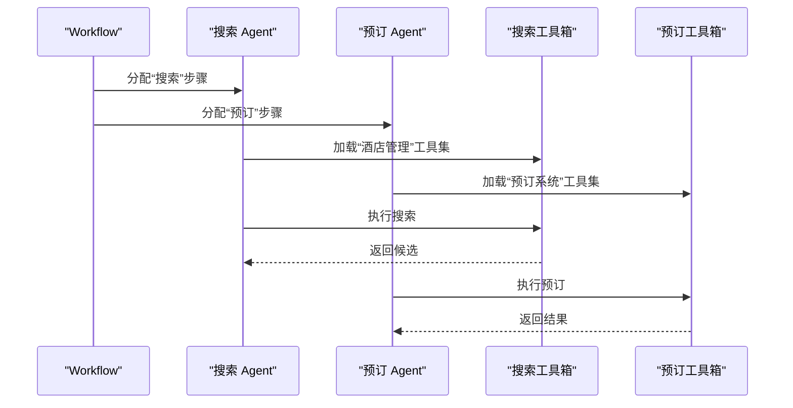
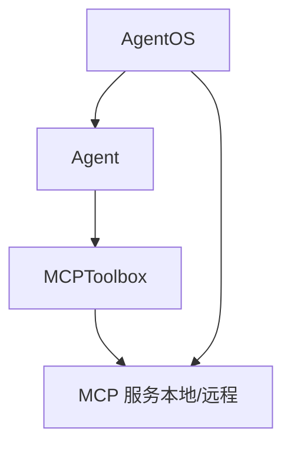

# MCP 工具箱使用

<cite>
**本文引用的文件**   
- [MCP 工具箱（MCPToolbox）](file://tools/mcp/mcp-toolbox.mdx)
- [数据库 MCP 工具箱示例](file://examples/tools/mcp/mcp-toolbox-for-db.mdx)
- [MCP 工具箱示例：Agent](file://examples/tools/mcp/mcp-toolbox-demo/agent.mdx)
- [MCP 工具箱示例：AgentOS](file://examples/tools/mcp/mcp-toolbox-demo/agent-os.mdx)
- [MCP 工具箱示例：类型安全酒店管理](file://examples/tools/mcp/mcp-toolbox-demo/hotel-management-typesafe.mdx)
- [MCP 工具箱示例：工作流（酒店搜索与预订）](file://examples/tools/mcp/mcp-toolbox-demo/hotel-management-workflows.mdx)
- [AgentOS 作为 MCP 服务器](file://agent-os/mcp/mcp.mdx)
- [MCP 集成概览](file://cookbook/tools/mcp.mdx)
</cite>

## 目录
1. [简介](#简介)
2. [项目结构](#项目结构)
3. [核心组件](#核心组件)
4. [架构总览](#架构总览)
5. [组件详解](#组件详解)
6. [依赖关系分析](#依赖关系分析)
7. [性能考量](#性能考量)
8. [故障排除指南](#故障排除指南)
9. [结论](#结论)
10. [附录](#附录)

## 简介
本指南面向希望在 Agno 中使用 MCP 工具箱（MCPToolbox）的用户，系统讲解如何通过工具过滤与工具集加载，将 Google 的 MCP 工具箱（数据库）能力以“按需加载”的方式接入到智能体中。文档覆盖以下主题：
- 基础使用：单工具集加载、多工具集组合
- 高级用法：自定义认证参数与绑定参数、手动连接管理
- 多种使用模式：Agent、AgentOS、工作流、类型安全输入输出
- 工具函数与参数配置
- 故障排除与调试技巧

## 项目结构
围绕 MCP 工具箱的文档与示例主要分布在如下位置：
- 工具箱使用说明与参数、函数列表：tools/mcp/mcp-toolbox.mdx
- 数据库 MCP 工具箱示例（含三种运行方式）：examples/tools/mcp/mcp-toolbox-for-db.mdx
- 示例：Agent 使用 MCPToolbox 连接数据库工具
  - examples/tools/mcp/mcp-toolbox-demo/agent.mdx
  - examples/tools/mcp/mcp-toolbox-demo/agent-os.mdx
  - examples/tools/mcp/mcp-toolbox-demo/hotel-management-typesafe.mdx
  - examples/tools/mcp/mcp-toolbox-demo/hotel-management-workflows.mdx
- AgentOS 作为 MCP 服务器：agent-os/mcp/mcp.mdx
- 更广泛的 MCP 集成示例与能力：cookbook/tools/mcp.mdx

章节来源
- [MCP 工具箱（MCPToolbox）:1-252](file://tools/mcp/mcp-toolbox.mdx#L1-L252)
- [数据库 MCP 工具箱示例:1-155](file://examples/tools/mcp/mcp-toolbox-for-db.mdx#L1-L155)
- [MCP 工具箱示例：Agent:1-122](file://examples/tools/mcp/mcp-toolbox-demo/agent.mdx#L1-L122)
- [MCP 工具箱示例：AgentOS:1-75](file://examples/tools/mcp/mcp-toolbox-demo/agent-os.mdx#L1-L75)
- [MCP 工具箱示例：类型安全酒店管理:1-119](file://examples/tools/mcp/mcp-toolbox-demo/hotel-management-typesafe.mdx#L1-L119)
- [MCP 工具箱示例：工作流（酒店搜索与预订）:1-119](file://examples/tools/mcp/mcp-toolbox-demo/hotel-management-workflows.mdx#L1-L119)
- [AgentOS 作为 MCP 服务器:1-146](file://agent-os/mcp/mcp.mdx#L1-L146)
- [MCP 集成概览:1-242](file://cookbook/tools/mcp.mdx#L1-L242)

## 核心组件
- MCPToolbox：对 MCP 工具进行“按工具集/按工具名”过滤加载，减少工具数量，提升智能体聚焦度与安全性。
- MCPTools：通用 MCP 工具封装，支持本地或远程 MCP 服务、多种传输协议（stdio/SSE/streamable-http），并可进行工具包含/排除。
- AgentOS（可选）：可将 AgentOS 暴露为 MCP 服务器，供外部 MCP 客户端调用。

章节来源
- [MCP 工具箱（MCPToolbox）:13-114](file://tools/mcp/mcp-toolbox.mdx#L13-L114)
- [AgentOS 作为 MCP 服务器:7-13](file://agent-os/mcp/mcp.mdx#L7-L13)
- [MCP 集成概览:7-21](file://cookbook/tools/mcp.mdx#L7-L21)

## 架构总览
MCPToolbox 的典型使用流程：
- 启动 MCP 工具箱服务器与示例数据库（Docker/Podman）
- 在智能体中通过 MCPToolbox 连接该服务器
- 可在初始化时指定工具集过滤，或在运行时动态加载工具集并绑定参数
- 将过滤后的工具注入智能体，执行任务

图表来源
- [MCP 工具箱（MCPToolbox）:25-63](file://tools/mcp/mcp-toolbox.mdx#L25-L63)
- [数据库 MCP 工具箱示例:14-52](file://examples/tools/mcp/mcp-toolbox-for-db.mdx#L14-L52)

章节来源
- [MCP 工具箱（MCPToolbox）:25-63](file://tools/mcp/mcp-toolbox.mdx#L25-L63)
- [数据库 MCP 工具箱示例:14-52](file://examples/tools/mcp/mcp-toolbox-for-db.mdx#L14-L52)

## 组件详解

### 参数与函数总览
- 参数
  - url：MCP 服务地址（若未以 “/mcp” 结尾会自动补全）
  - toolsets：按工具集过滤（与 tool_name 互斥）
  - tool_name：按单个工具名加载（与 toolsets 互斥）
  - headers：HTTP 请求头
  - transport：传输协议（stdio/sse/streamable-http）
- 函数
  - connect()：建立 MCP 与工具箱客户端连接
  - load_tool()：按名称加载单个工具（支持认证与绑定参数）
  - load_toolset()：加载某工具集（支持认证与绑定参数）
  - load_multiple_toolsets()：批量加载多个工具集
  - load_toolset_safe()：安全加载工具集并返回工具名用于错误处理
  - get_client()：获取底层工具箱客户端实例
  - close()：关闭工具箱与 MCP 客户端连接

章节来源
- [MCP 工具箱（MCPToolbox）:209-234](file://tools/mcp/mcp-toolbox.mdx#L209-L234)

### 基础使用：单工具集加载
- 场景：仅需要某一类数据库操作（如酒店管理）
- 关键点：在初始化时通过 toolsets 指定工具集，即可只加载相关工具
- 示例路径：[示例：Agent 使用 MCPToolbox:25-52](file://examples/tools/mcp/mcp-toolbox-demo/agent.mdx#L25-L52)

图表来源
- [MCP 工具箱（MCPToolbox）:95-114](file://tools/mcp/mcp-toolbox.mdx#L95-L114)
- [MCP 工具箱示例：Agent:25-52](file://examples/tools/mcp/mcp-toolbox-demo/agent.mdx#L25-L52)

章节来源
- [MCP 工具箱（MCPToolbox）:95-114](file://tools/mcp/mcp-toolbox.mdx#L95-L114)
- [MCP 工具箱示例：Agent:25-52](file://examples/tools/mcp/mcp-toolbox-demo/agent.mdx#L25-L52)

### 多工具集组合
- 场景：需要同时使用“酒店管理”和“预订系统”
- 关键点：在初始化时传入多个工具集；或运行时分别加载后再合并
- 示例路径：[数据库 MCP 工具箱示例:25-52](file://examples/tools/mcp/mcp-toolbox-for-db.mdx#L25-L52)

图表来源
- [数据库 MCP 工具箱示例:25-52](file://examples/tools/mcp/mcp-toolbox-for-db.mdx#L25-L52)

章节来源
- [数据库 MCP 工具箱示例:25-52](file://examples/tools/mcp/mcp-toolbox-for-db.mdx#L25-L52)

### 自定义认证参数与绑定参数
- 场景：不同工具集需要不同的认证令牌与运行时参数
- 关键点：load_toolset 支持 auth_token_getters 与 bound_params；可按工具集分别设置
- 示例路径：[自定义认证与参数（高级用法）:161-186](file://tools/mcp/mcp-toolbox.mdx#L161-L186)，[手动加载示例:54-96](file://examples/tools/mcp/mcp-toolbox-for-db.mdx#L54-L96)

图表来源
- [MCP 工具箱（MCPToolbox）:161-186](file://tools/mcp/mcp-toolbox.mdx#L161-L186)
- [数据库 MCP 工具箱示例:54-96](file://examples/tools/mcp/mcp-toolbox-for-db.mdx#L54-L96)

章节来源
- [MCP 工具箱（MCPToolbox）:161-186](file://tools/mcp/mcp-toolbox.mdx#L161-L186)
- [数据库 MCP 工具箱示例:54-96](file://examples/tools/mcp/mcp-toolbox-for-db.mdx#L54-L96)

### 手动连接管理
- 场景：需要显式控制连接生命周期（connect/close）
- 关键点：不使用上下文管理器时，需在 finally 中确保关闭
- 示例路径：[手动连接管理示例:188-207](file://tools/mcp/mcp-toolbox.mdx#L188-L207)，[无上下文管理器示例:99-127](file://examples/tools/mcp/mcp-toolbox-for-db.mdx#L99-L127)

图表来源
- [MCP 工具箱（MCPToolbox）:188-207](file://tools/mcp/mcp-toolbox.mdx#L188-L207)
- [数据库 MCP 工具箱示例:99-127](file://examples/tools/mcp/mcp-toolbox-for-db.mdx#L99-L127)

章节来源
- [MCP 工具箱（MCPToolbox）:188-207](file://tools/mcp/mcp-toolbox.mdx#L188-L207)
- [数据库 MCP 工具箱示例:99-127](file://examples/tools/mcp/mcp-toolbox-for-db.mdx#L99-L127)

### 在 AgentOS 中使用 MCPToolbox
- 场景：将 MCPToolbox 作为 AgentOS 的工具源，统一对外提供能力
- 关键点：AgentOS 可同时暴露为 API 与 MCP 服务器；此处展示将 MCPToolbox 注入 AgentOS 的 Agent
- 示例路径：[AgentOS 集成示例:24-51](file://examples/tools/mcp/mcp-toolbox-demo/agent-os.mdx#L24-L51)

图表来源
- [MCP 工具箱示例：AgentOS:24-51](file://examples/tools/mcp/mcp-toolbox-demo/agent-os.mdx#L24-L51)

章节来源
- [MCP 工具箱示例：AgentOS:24-51](file://examples/tools/mcp/mcp-toolbox-demo/agent-os.mdx#L24-L51)

### 类型安全输入输出（Pydantic Schema）
- 场景：通过输入/输出 Schema 强约束智能体与工具交互的数据结构
- 关键点：input_schema 与 output_schema 与工具过滤结合，提升鲁棒性
- 示例路径：[类型安全酒店管理示例:66-85](file://examples/tools/mcp/mcp-toolbox-demo/hotel-management-typesafe.mdx#L66-L85)

图表来源
- [MCP 工具箱示例：类型安全酒店管理:66-85](file://examples/tools/mcp/mcp-toolbox-demo/hotel-management-typesafe.mdx#L66-L85)

章节来源
- [MCP 工具箱示例：类型安全酒店管理:66-85](file://examples/tools/mcp/mcp-toolbox-demo/hotel-management-typesafe.mdx#L66-L85)

### 工作流中的 MCPToolbox（顺序编排）
- 场景：将“酒店搜索”和“酒店预订”拆分为两个步骤，分别由不同 Agent 使用不同工具集
- 关键点：每个 Agent 持有独立的 MCPToolbox，避免工具污染
- 示例路径：[工作流示例:70-96](file://examples/tools/mcp/mcp-toolbox-demo/hotel-management-workflows.mdx#L70-L96)

图表来源
- [MCP 工具箱示例：工作流（酒店搜索与预订）:70-96](file://examples/tools/mcp/mcp-toolbox-demo/hotel-management-workflows.mdx#L70-L96)

章节来源
- [MCP 工具箱示例：工作流（酒店搜索与预订）:70-96](file://examples/tools/mcp/mcp-toolbox-demo/hotel-management-workflows.mdx#L70-L96)

### 与通用 MCP 工具的关系
- MCPTools：通用 MCP 工具封装，支持本地/远程、多种传输协议、工具包含/排除
- MCPToolbox：在 MCPTools 基础上增加“工具集/工具名过滤”，更适合大规模工具集合的场景

章节来源
- [MCP 集成概览:7-21](file://cookbook/tools/mcp.mdx#L7-L21)
- [MCP 工具箱（MCPToolbox）:13-114](file://tools/mcp/mcp-toolbox.mdx#L13-L114)

## 依赖关系分析
- MCPToolbox 依赖 MCP 服务（示例为本地 Docker/Podman 启动的 MCP 工具箱服务器）
- Agent/AgentOS/Workflow 通过 MCPToolbox 获取过滤后的工具
- AgentOS 可同时作为 API 与 MCP 服务器对外提供能力

图表来源
- [MCP 工具箱（MCPToolbox）:25-63](file://tools/mcp/mcp-toolbox.mdx#L25-L63)
- [AgentOS 作为 MCP 服务器:7-13](file://agent-os/mcp/mcp.mdx#L7-L13)

章节来源
- [MCP 工具箱（MCPToolbox）:25-63](file://tools/mcp/mcp-toolbox.mdx#L25-L63)
- [AgentOS 作为 MCP 服务器:7-13](file://agent-os/mcp/mcp.mdx#L7-L13)

## 性能考量
- 工具过滤显著降低工具数量，减少模型推理负担与上下文开销
- 使用多工具集组合时，建议按职责拆分 Agent，避免跨域工具耦合导致的误用
- 对于高并发场景，优先采用“按需加载 + 绑定参数”的方式，减少不必要的网络往返
- 传输协议选择：本地推荐 stdio，远程推荐 streamable-http 或 SSE，视 MCP 服务支持而定

## 故障排除指南
- 无法连接 MCP 服务
  - 检查 url 是否正确，必要时补充 “/mcp”
  - 确认本地 Docker/Podman 服务已启动且端口开放
  - 参考验证命令检查数据库连通性
- 工具为空或数量异常
  - 确认 toolsets/tool_name 与 MCP 服务实际提供的工具集一致
  - 若使用工具集过滤，请确认未同时设置 tool_name
- 认证失败
  - 检查 auth_token_getters 返回值是否正确
  - 确认 bound_params 与服务期望一致
- 资源泄漏
  - 使用手动连接管理时，务必在 finally 中调用 close()

章节来源
- [MCP 工具箱（MCPToolbox）:52-62](file://tools/mcp/mcp-toolbox.mdx#L52-L62)
- [MCP 工具箱（MCPToolbox）:219-221](file://tools/mcp/mcp-toolbox.mdx#L219-L221)
- [MCP 工具箱（MCPToolbox）:188-207](file://tools/mcp/mcp-toolbox.mdx#L188-L207)

## 结论
MCPToolbox 通过“工具集/工具名过滤”有效解决了“工具过载”问题，使智能体在复杂数据库 MCP 服务场景下仍能保持聚焦与可控。配合自定义认证与绑定参数、手动连接管理、AgentOS 集成以及工作流编排，可满足从简单 Agent 到企业级应用的多样化需求。

## 附录
- 快速开始与演示
  - 参考：[快速开始与演示:25-48](file://tools/mcp/mcp-toolbox.mdx#L25-L48)
- 示例索引
  - 单工具集 Agent 示例：[示例：Agent 使用 MCPToolbox:25-52](file://examples/tools/mcp/mcp-toolbox-demo/agent.mdx#L25-L52)
  - AgentOS 集成示例：[示例：AgentOS:24-51](file://examples/tools/mcp/mcp-toolbox-demo/agent-os.mdx#L24-L51)
  - 类型安全示例：[示例：类型安全酒店管理:88-91](file://examples/tools/mcp/mcp-toolbox-demo/hotel-management-typesafe.mdx#L88-L91)
  - 工作流示例：[示例：工作流（酒店搜索与预订）:73-80](file://examples/tools/mcp/mcp-toolbox-demo/hotel-management-workflows.mdx#L73-L80)
  - 数据库 MCP 工具箱示例（三种运行方式）：[示例：数据库 MCP 工具箱:25-127](file://examples/tools/mcp/mcp-toolbox-for-db.mdx#L25-L127)