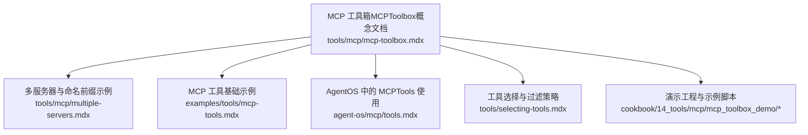
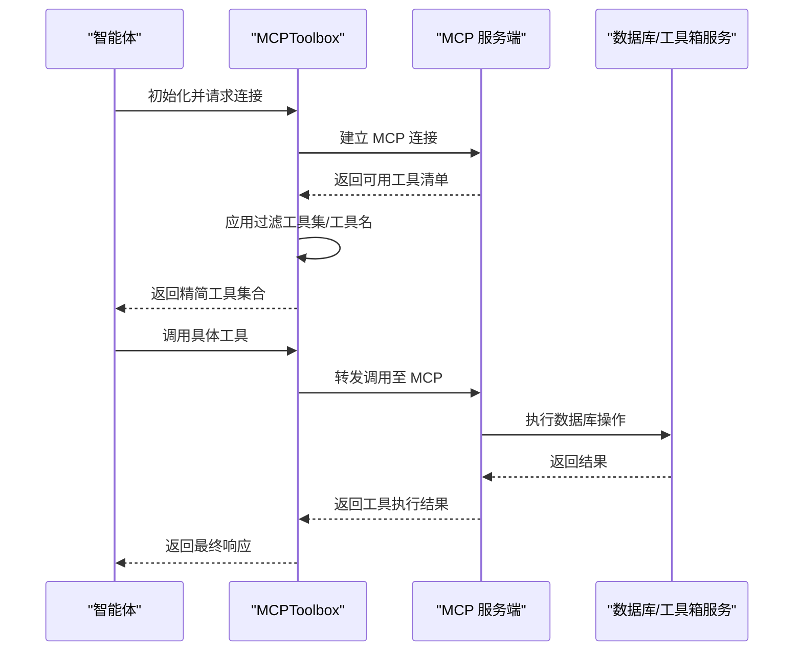
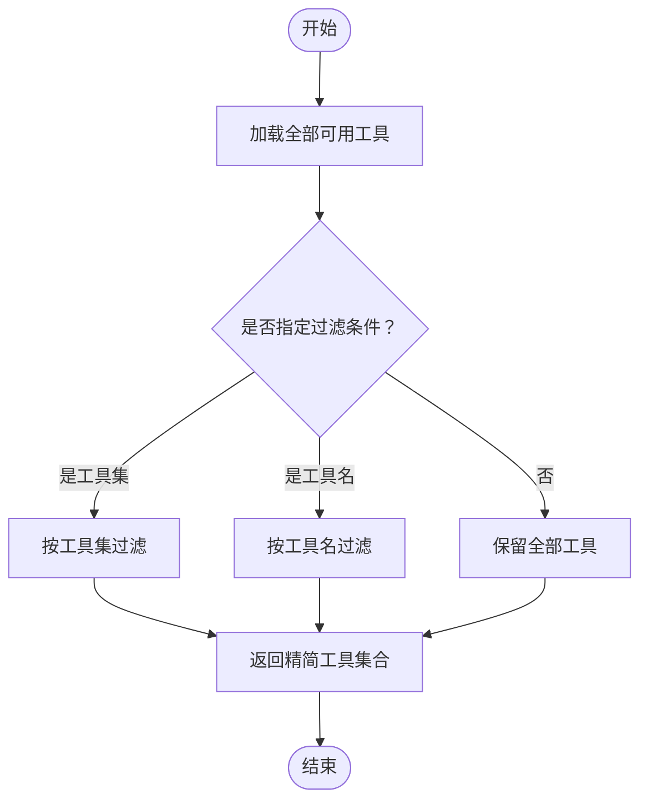
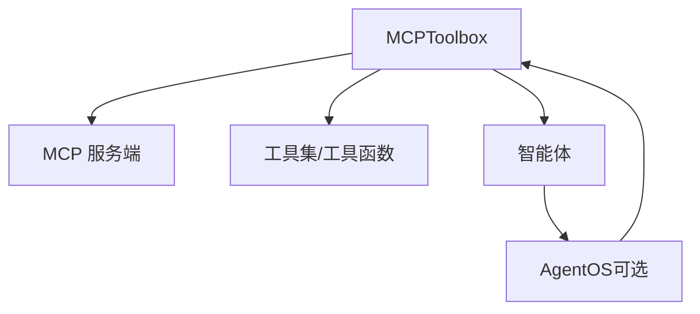

# MCP 工具箱概念

<cite>
**本文引用的文件**
- [MCP 工具箱（MCPToolbox）](file://tools/mcp/mcp-toolbox.mdx)
- [MCP 多服务器示例](file://tools/mcp/multiple-servers.mdx)
- [MCP 工具概览与示例](file://examples/tools/mcp-tools.mdx)
- [AgentOS 中的 MCPTools 使用](file://agent-os/mcp/tools.mdx)
- [MCP 工具选择与过滤](file://tools/selecting-tools.mdx)
- [MCP 工具箱演示：基础代理](file://cookbook/14_tools/mcp/mcp_toolbox_demo/agent.py)
- [MCP 工具箱演示：AgentOS 集成](file://cookbook/14_tools/mcp/mcp_toolbox_demo/agent_os.py)
- [MCP 工具箱演示：工作流集成](file://cookbook/14_tools/mcp/mcp_toolbox_demo/hotel_management_workflows.py)
- [MCP 工具箱演示：类型安全代理](file://cookbook/14_tools/mcp/mcp_toolbox_demo/hotel_management_typesafe.py)
</cite>

## 目录
1. [引言](#引言)
2. [项目结构](#项目结构)
3. [核心组件](#核心组件)
4. [架构总览](#架构总览)
5. [详细组件分析](#详细组件分析)
6. [依赖关系分析](#依赖关系分析)
7. [性能考量](#性能考量)
8. [故障排查指南](#故障排查指南)
9. [结论](#结论)
10. [附录](#附录)

## 引言
本技术文档围绕 MCP 工具箱（MCPToolbox）展开，系统阐述其核心理念与设计目标：解决“工具过载”问题，通过按工具集或工具名进行精确过滤，帮助智能体仅加载所需的数据库相关工具，从而提升专注度与安全性。MCPToolbox 在 Agno 的 MCPTools 基础上扩展了过滤能力，并提供连接生命周期管理、认证参数绑定、多工具集加载等高级功能。文档还对比了 MCPToolbox 与传统 MCPTools 的差异，给出最佳实践与典型使用场景。

## 项目结构
与 MCP 工具箱相关的知识内容主要分布在以下位置：
- 概念与快速开始：tools/mcp/mcp-toolbox.mdx
- 多服务器与命名前缀：tools/mcp/multiple-servers.mdx
- MCP 工具基础用法与示例：examples/tools/mcp-tools.mdx
- AgentOS 中的 MCPTools 生命周期：agent-os/mcp/tools.mdx
- 工具选择与过滤策略：tools/selecting-tools.mdx
- 完整演示工程与示例脚本：cookbook/14_tools/mcp/mcp_toolbox_demo 下的多个示例

**图表来源**
- [MCP 工具箱（MCPToolbox）](file://tools/mcp/mcp-toolbox.mdx)
- [MCP 多服务器示例](file://tools/mcp/multiple-servers.mdx)
- [MCP 工具概览与示例](file://examples/tools/mcp-tools.mdx)
- [AgentOS 中的 MCPTools 使用](file://agent-os/mcp/tools.mdx)
- [MCP 工具选择与过滤](file://tools/selecting-tools.mdx)

**章节来源**
- [MCP 工具箱（MCPToolbox）](file://tools/mcp/mcp-toolbox.mdx)
- [MCP 多服务器示例](file://tools/mcp/multiple-servers.mdx)
- [MCP 工具概览与示例](file://examples/tools/mcp-tools.mdx)
- [AgentOS 中的 MCPTools 使用](file://agent-os/mcp/tools.mdx)
- [MCP 工具选择与过滤](file://tools/selecting-tools.mdx)

## 核心组件
- 过滤机制
  - 支持按工具集（toolset）过滤，仅加载目标工具集内的工具，显著减少工具数量，避免“工具过载”。
  - 支持按单个工具名（tool_name）过滤，用于精确加载特定工具。
  - 参数互斥校验：toolsets 与 tool_name 不能同时指定，否则抛出错误。
- 连接与生命周期
  - 提供异步 connect()/close() 管理 MCP 服务端与工具箱客户端连接。
  - 支持自动连接（with 上下文）与手动连接（显式 connect/close）两种模式。
- 认证与参数绑定
  - 支持为工具集加载提供认证令牌获取器（auth_token_getters）与绑定参数（bound_params），便于生产环境的安全与配置化。
- 工具集操作
  - 单工具集加载：load_toolset(...)
  - 多工具集加载：load_multiple_toolsets([...], ...)
  - 安全加载并返回工具名：load_toolset_safe(...)
  - 单工具加载：load_tool(name, ...)
  - 获取底层 ToolboxClient 实例：get_client()

**章节来源**
- [MCP 工具箱（MCPToolbox）](file://tools/mcp/mcp-toolbox.mdx)

## 架构总览
MCPToolbox 的运行流程可概括为：连接 MCP 服务端 → 内部加载全部可用工具 → 应用过滤策略（工具集/工具名）→ 返回精简后的工具集合给智能体使用。

**图表来源**
- [MCP 工具箱（MCPToolbox）](file://tools/mcp/mcp-toolbox.mdx)

## 详细组件分析

### 过滤机制与工具过载问题
- 问题背景
  - 未过滤时，智能体可能接收 50+ 数据库工具，导致上下文膨胀、意图漂移与误调用风险上升。
- 解决方案
  - 通过 toolsets 或 tool_name 对工具进行精确筛选，仅暴露与任务相关的工具，降低认知负担与错误率。
- 流程示意

**图表来源**
- [MCP 工具箱（MCPToolbox）](file://tools/mcp/mcp-toolbox.mdx)

**章节来源**
- [MCP 工具箱（MCPToolbox）](file://tools/mcp/mcp-toolbox.mdx)

### 连接与生命周期管理
- 自动连接（with 上下文）
  - 适合简单场景，自动完成连接与关闭，降低资源泄漏风险。
- 手动连接
  - 适合需要精细控制的场景，需显式调用 connect()/close() 并在 finally 中确保清理。
- AgentOS 集成
  - 在 AgentOS 中，MCPTools 的生命周期由框架自动管理；若使用 MCPToolbox，请遵循相同原则，避免 reload 导致的连接中断。

**章节来源**
- [MCP 工具箱（MCPToolbox）](file://tools/mcp/mcp-toolbox.mdx)
- [AgentOS 中的 MCPTools 使用](file://agent-os/mcp/tools.mdx)

### 认证与参数绑定
- 认证令牌获取器（auth_token_getters）
  - 以键值映射的方式为不同工具或工具集提供动态认证令牌，支持按需刷新。
- 绑定参数（bound_params）
  - 将固定参数（如 region、environment）绑定到工具调用中，统一配置，避免重复传参。
- 典型用法
  - 分别为 hotel-management 与 booking-system 工具集设置不同的认证与环境参数，再合并所需工具参与推理。

**章节来源**
- [MCP 工具箱（MCPToolbox）](file://tools/mcp/mcp-toolbox.mdx)

### 工具发现、注册与管理
- 工具发现
  - 通过 MCP 服务端协议枚举可用工具，MCPToolbox 内部维护完整清单。
- 工具注册
  - 过滤后生成工具函数列表（functions），供智能体直接调用。
- 工具管理
  - 支持单工具、工具集、多工具集的加载与卸载；提供安全加载接口以捕获异常并返回工具名列表，便于排障。

**章节来源**
- [MCP 工具箱（MCPToolbox）](file://tools/mcp/mcp-toolbox.mdx)

### 与传统 MCPTools 的对比
- 功能增强
  - MCPToolbox 在 MCPTools 的基础上新增了“工具集/工具名过滤”，有效缓解工具过载。
  - 提供更丰富的工具集操作方法（多工具集加载、安全加载等）。
- 使用场景
  - MCPTools 更偏向通用 MCP 服务接入与工具聚合。
  - MCPToolbox 更适合需要对工具进行精细化裁剪的数据库类工具场景。
- 生命周期与集成
  - 两者均可在 AgentOS 中使用，但需注意生命周期管理与 reload 的兼容性。

**章节来源**
- [MCP 工具箱（MCPToolbox）](file://tools/mcp/mcp-toolbox.mdx)
- [AgentOS 中的 MCPTools 使用](file://agent-os/mcp/tools.mdx)

### 最佳实践与使用场景
- 最佳实践
  - 明确过滤边界：优先使用工具集过滤，必要时再细化到工具名。
  - 合理拆分工具集：将相关性强的工具归入同一工具集，便于复用与维护。
  - 使用安全加载：在生产环境优先采用 load_toolset_safe(...)，记录工具名以便排障。
  - 参数与认证分离：将认证信息与业务参数分离，分别通过 auth_token_getters 与 bound_params 注入。
  - 多服务器隔离：当存在多个 MCP 服务时，使用 tool_name_prefix 避免工具名冲突。
- 典型场景
  - 酒店助手：仅加载 hotel-management 工具集，聚焦酒店查询与推荐。
  - 预订助理：组合 hotel-management 与 booking-system 工具集，支持查询与预订闭环。
  - 类型安全代理：结合 Pydantic 模型，确保输入输出结构化与可验证。

**章节来源**
- [MCP 工具箱（MCPToolbox）](file://tools/mcp/mcp-toolbox.mdx)
- [MCP 多服务器示例](file://tools/mcp/multiple-servers.mdx)
- [MCP 工具选择与过滤](file://tools/selecting-tools.mdx)

## 依赖关系分析
- 组件耦合
  - MCPToolbox 依赖 MCP 服务端提供的工具清单与调用协议。
  - 与 AgentOS 的耦合体现在生命周期管理与服务启动方式，需避免 reload 导致的连接中断。
- 外部依赖
  - 示例工程依赖 Docker/Podman 与 toolbox-core，用于启动数据库与 MCP 工具箱服务。
- 可能的循环依赖
  - 文档层面未见直接循环导入；实际工程中应避免在工具定义中引入 AgentOS 的服务层逻辑。

**图表来源**
- [MCP 工具箱（MCPToolbox）](file://tools/mcp/mcp-toolbox.mdx)
- [AgentOS 中的 MCPTools 使用](file://agent-os/mcp/tools.mdx)

**章节来源**
- [MCP 工具箱（MCPToolbox）](file://tools/mcp/mcp-toolbox.mdx)
- [AgentOS 中的 MCPTools 使用](file://agent-os/mcp/tools.mdx)

## 性能考量
- 工具数量与上下文开销
  - 过滤后工具数量显著下降，有助于降低模型推理成本与延迟。
- 连接与会话管理
  - 合理使用 connect()/close()，避免长连接泄漏；在 AgentOS 中避免 reload。
- 认证与参数缓存
  - 对于频繁使用的认证令牌与参数，建议在应用层做缓存与刷新策略，减少重复网络往返。

## 故障排查指南
- 工具名冲突
  - 当从多个 MCP 服务加载工具时，使用 tool_name_prefix 为工具名添加前缀，避免同名冲突。
- 过滤参数冲突
  - toolsets 与 tool_name 不能同时指定，否则会触发参数校验错误；请二选一。
- 连接失败
  - 确认 MCP 服务地址可达、传输协议正确（stdio/SSE/streamable-http），并在 AgentOS 中避免 reload。
- 工具加载异常
  - 使用 load_toolset_safe(...) 获取工具名列表，定位具体失败工具；检查认证与参数绑定是否正确。

**章节来源**
- [MCP 多服务器示例](file://tools/mcp/multiple-servers.mdx)
- [MCP 工具箱（MCPToolbox）](file://tools/mcp/mcp-toolbox.mdx)

## 结论
MCPToolbox 通过“工具集/工具名过滤”有效解决了智能体在面对大量 MCP 工具时的“工具过载”问题，配合认证与参数绑定、多工具集加载与安全加载等能力，使其在数据库类工具场景中具备更高的可控性与安全性。与传统 MCPTools 相比，MCPToolbox 更强调“按需加载、精准裁剪”的工具管理理念，适合对工具边界有明确要求的生产场景。

## 附录
- 演示工程与示例脚本
  - 基础代理示例：[agent.py](file://cookbook/14_tools/mcp/mcp_toolbox_demo/agent.py)
  - AgentOS 集成示例：[agent_os.py](file://cookbook/14_tools/mcp/mcp_toolbox_demo/agent_os.py)
  - 工作流集成示例：[hotel_management_workflows.py](file://cookbook/14_tools/mcp/mcp_toolbox_demo/hotel_management_workflows.py)
  - 类型安全代理示例：[hotel_management_typesafe.py](file://cookbook/14_tools/mcp/mcp_toolbox_demo/hotel_management_typesafe.py)

**章节来源**
- [MCP 工具箱（MCPToolbox）](file://tools/mcp/mcp-toolbox.mdx)