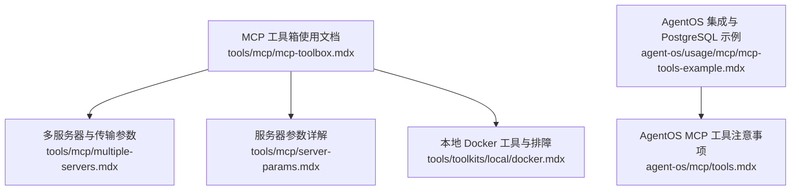
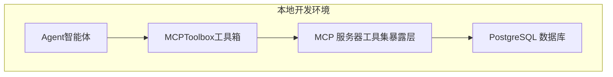
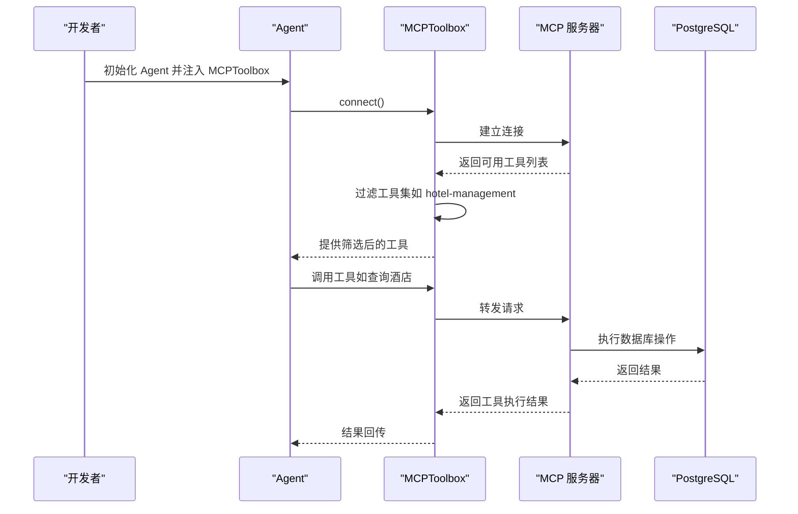
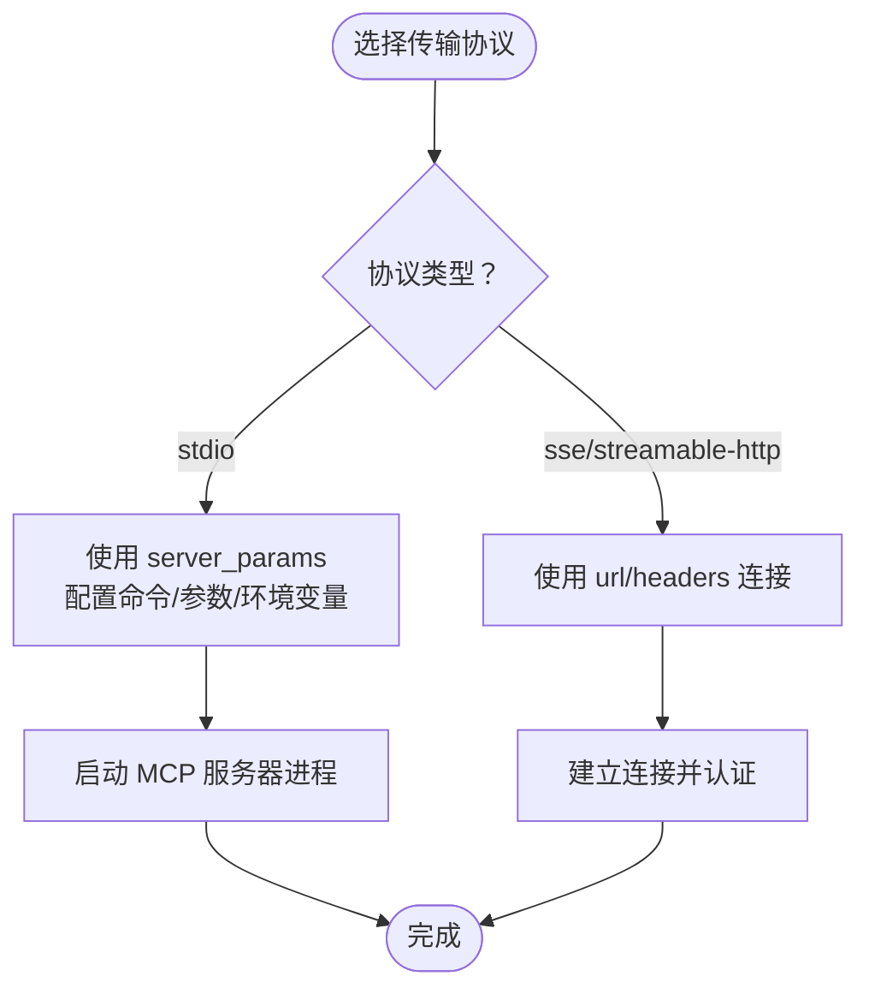
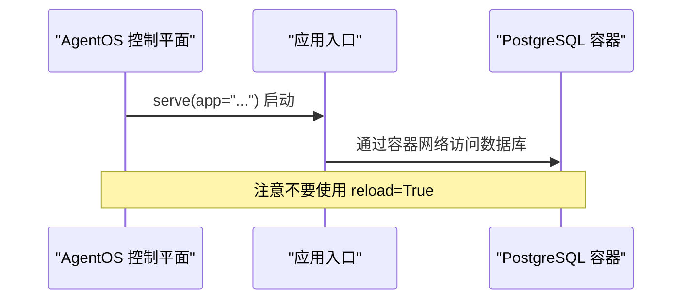
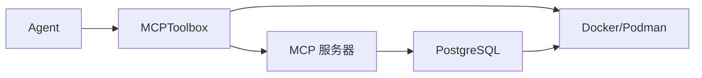

# MCP 工具箱设置

<cite>
**本文引用的文件**
- [mcp-toolbox.mdx](file://tools/mcp/mcp-toolbox.mdx)
- [server-params.mdx](file://tools/mcp/server-params.mdx)
- [multiple-servers.mdx](file://tools/mcp/multiple-servers.mdx)
- [docker.mdx](file://tools/toolkits/local/docker.mdx)
- [mcp-tools-example.mdx](file://agent-os/usage/mcp/mcp-tools-example.mdx)
- [tools.mdx](file://agent-os/mcp/tools.mdx)
</cite>

## 目录
1. [简介](#简介)
2. [项目结构](#项目结构)
3. [核心组件](#核心组件)
4. [架构总览](#架构总览)
5. [详细组件分析](#详细组件分析)
6. [依赖关系分析](#依赖关系分析)
7. [性能考虑](#性能考虑)
8. [故障排除指南](#故障排除指南)
9. [结论](#结论)
10. [附录](#附录)

## 简介
本指南面向希望在本地或生产环境中部署并使用 MCP 工具箱（MCP Toolbox）的用户，重点覆盖以下方面：
- 安装与前置条件：包括 toolbox-core 库、Docker/Podman 的准备与运行
- 环境准备：PostgreSQL 数据库初始化与 MCP Toolbox 服务器启动
- 验证安装：数据库连接测试与工具可用性检查
- 不同操作系统下的安装与配置示例
- 常见安装问题排查与解决方案

## 项目结构
围绕 MCP 工具箱设置的相关文档主要分布在以下位置：
- 工具箱使用与快速开始：tools/mcp/mcp-toolbox.mdx
- 多服务器与传输参数：tools/mcp/multiple-servers.mdx、tools/mcp/server-params.mdx
- 本地 Docker 工具与排障：tools/toolkits/local/docker.mdx
- AgentOS 集成与 PostgreSQL 示例：agent-os/usage/mcp/mcp-tools-example.mdx、agent-os/mcp/tools.mdx

**图表来源**
- [mcp-toolbox.mdx:1-252](file://tools/mcp/mcp-toolbox.mdx#L1-L252)
- [multiple-servers.mdx:164-191](file://tools/mcp/multiple-servers.mdx#L164-L191)
- [server-params.mdx:1-24](file://tools/mcp/server-params.mdx#L1-L24)
- [docker.mdx:1-95](file://tools/toolkits/local/docker.mdx#L1-L95)
- [mcp-tools-example.mdx:58-94](file://agent-os/usage/mcp/mcp-tools-example.mdx#L58-L94)
- [tools.mdx:46-56](file://agent-os/mcp/tools.mdx#L46-L56)

**章节来源**
- [mcp-toolbox.mdx:1-252](file://tools/mcp/mcp-toolbox.mdx#L1-L252)
- [multiple-servers.mdx:164-191](file://tools/mcp/multiple-servers.mdx#L164-L191)
- [server-params.mdx:1-24](file://tools/mcp/server-params.mdx#L1-L24)
- [docker.mdx:1-95](file://tools/toolkits/local/docker.mdx#L1-L95)
- [mcp-tools-example.mdx:58-94](file://agent-os/usage/mcp/mcp-tools-example.mdx#L58-L94)
- [tools.mdx:46-56](file://agent-os/mcp/tools.mdx#L46-L56)

## 核心组件
- MCPToolbox：用于连接 MCP 工具箱服务器，并按工具集或工具名进行过滤加载，解决“工具过载”问题
- MCPTools/MultiMCPTools：底层 MCP 连接工具，支持多种传输协议（stdio、sse、streamable-http）
- ToolboxClient：MCP 工具箱客户端，负责与 MCP 服务交互
- Docker/Podman：用于运行示例所需的 PostgreSQL 数据库与 MCP 工具箱服务器

关键参数与功能要点：
- 参数：url、toolsets、tool_name、headers、transport
- 功能：connect、load_tool、load_toolset、load_multiple_toolsets、load_toolset_safe、get_client、close

**章节来源**
- [mcp-toolbox.mdx:210-237](file://tools/mcp/mcp-toolbox.mdx#L210-L237)

## 架构总览
下图展示了 MCP 工具箱在本地环境中的典型工作流：Agent 通过 MCPToolbox 连接到 MCP 服务器，后者暴露数据库工具；MCPToolbox 在内部加载全部工具后进行筛选，最终仅向 Agent 暴露目标工具集。

**图表来源**
- [mcp-toolbox.mdx:93-114](file://tools/mcp/mcp-toolbox.mdx#L93-L114)

**章节来源**
- [mcp-toolbox.mdx:93-114](file://tools/mcp/mcp-toolbox.mdx#L93-L114)

## 详细组件分析

### 组件一：MCPToolbox 使用与参数
- 安装依赖：toolbox-core
- 快速开始：使用 Docker/Podman 启动数据库与 MCP 服务器，随后运行示例 Agent
- 验证方式：通过数据库命令行查询表记录数
- 参数与功能：
  - url：工具箱服务地址（可自动补全路径）
  - toolsets/tool_name：工具集或单个工具名过滤
  - headers/transport：HTTP 请求头与传输协议
  - connect/load_toolset 等：连接管理与工具加载

**图表来源**
- [mcp-toolbox.mdx:64-91](file://tools/mcp/mcp-toolbox.mdx#L64-L91)
- [mcp-toolbox.mdx:93-114](file://tools/mcp/mcp-toolbox.mdx#L93-L114)

**章节来源**
- [mcp-toolbox.mdx:15-62](file://tools/mcp/mcp-toolbox.mdx#L15-L62)
- [mcp-toolbox.mdx:210-237](file://tools/mcp/mcp-toolbox.mdx#L210-L237)

### 组件二：多服务器与传输参数
- 传输协议：stdio、sse、streamable-http
- stdio 场景：通过 server_params 指定命令、参数与环境变量
- 多服务器场景：可通过前缀避免工具名冲突

**图表来源**
- [server-params.mdx:7-24](file://tools/mcp/server-params.mdx#L7-L24)
- [multiple-servers.mdx:164-191](file://tools/mcp/multiple-servers.mdx#L164-L191)

**章节来源**
- [server-params.mdx:1-24](file://tools/mcp/server-params.mdx#L1-L24)
- [multiple-servers.mdx:164-191](file://tools/mcp/multiple-servers.mdx#L164-L191)

### 组件三：AgentOS 集成与 PostgreSQL 示例
- 在 AgentOS 中使用 MCP 工具时，注意不要启用自动重载以避免生命周期问题
- 可参考示例中 PostgreSQL 的 Docker 启动方式与端口映射

**图表来源**
- [tools.mdx:46-56](file://agent-os/mcp/tools.mdx#L46-L56)
- [mcp-tools-example.mdx:70-81](file://agent-os/usage/mcp/mcp-tools-example.mdx#L70-L81)

**章节来源**
- [tools.mdx:46-56](file://agent-os/mcp/tools.mdx#L46-L56)
- [mcp-tools-example.mdx:58-94](file://agent-os/usage/mcp/mcp-tools-example.mdx#L58-L94)

## 依赖关系分析
- MCPToolbox 依赖：
  - toolbox-core：工具箱核心库
  - Docker/Podman：运行数据库与 MCP 服务器
  - PostgreSQL：示例数据与工具暴露的基础存储
- 运行时耦合：
  - Agent 与 MCPToolbox 的连接
  - MCPToolbox 与 MCP 服务器的通信
  - MCP 服务器与数据库的交互

**图表来源**
- [mcp-toolbox.mdx:15-24](file://tools/mcp/mcp-toolbox.mdx#L15-L24)
- [mcp-toolbox.mdx:50-62](file://tools/mcp/mcp-toolbox.mdx#L50-L62)

**章节来源**
- [mcp-toolbox.mdx:15-24](file://tools/mcp/mcp-toolbox.mdx#L15-L24)
- [mcp-toolbox.mdx:50-62](file://tools/mcp/mcp-toolbox.mdx#L50-L62)

## 性能考虑
- 工具集过滤：通过 toolsets 减少工具数量，降低上下文复杂度与调用开销
- 连接复用：在长会话中复用 MCPToolbox 连接，避免频繁重建
- 传输协议选择：根据网络与延迟特性选择合适协议（sse/streamable-http）

## 故障排除指南
- Docker/Podman 访问权限
  - Linux：确认 Docker 服务状态与用户组权限
  - macOS/Windows：确保 Docker Desktop 正常运行
- 数据库连接失败
  - 使用内置验证命令检查数据库连接与表存在性
- MCP 连接刷新
  - AgentOS 中不自动处理刷新，需手动调用刷新接口
- 工具名冲突
  - 多服务器场景下使用工具名前缀避免命名冲突

**章节来源**
- [docker.mdx:51-82](file://tools/toolkits/local/docker.mdx#L51-L82)
- [mcp-toolbox.mdx:52-62](file://tools/mcp/mcp-toolbox.mdx#L52-L62)
- [tools.mdx:51-53](file://agent-os/mcp/tools.mdx#L51-L53)
- [multiple-servers.mdx:164-191](file://tools/mcp/multiple-servers.mdx#L164-L191)

## 结论
通过本指南，您可以在本地或生产环境中完成 MCP 工具箱的安装与配置，包括 toolbox-core 的安装、Docker/Podman 的准备、PostgreSQL 数据库的初始化以及 MCP Toolbox 服务器的启动。借助工具集过滤与合适的传输协议，您可以有效控制工具数量并提升系统稳定性。遇到问题时，可依据故障排除章节进行定位与修复。

## 附录

### A. 安装与配置步骤（概览）
- 安装 toolbox-core
- 准备 Docker/Podman 环境
- 启动 PostgreSQL 与 MCP 工具箱服务器
- 运行示例 Agent 并验证工具可用性

**章节来源**
- [mcp-toolbox.mdx:15-48](file://tools/mcp/mcp-toolbox.mdx#L15-L48)

### B. 验证安装的方法
- 数据库连接测试：使用 psql 命令查询示例表
- 工具可用性检查：通过 Agent 发起工具调用并观察输出

**章节来源**
- [mcp-toolbox.mdx:52-62](file://tools/mcp/mcp-toolbox.mdx#L52-L62)

### C. 不同操作系统下的示例
- Linux/macOS/Windows：Docker Desktop 或 Podman Compose 的使用差异
- AgentOS：在不同平台上的运行与端口映射

**章节来源**
- [docker.mdx:1-95](file://tools/toolkits/local/docker.mdx#L1-L95)
- [mcp-tools-example.mdx:70-81](file://agent-os/usage/mcp/mcp-tools-example.mdx#L70-L81)