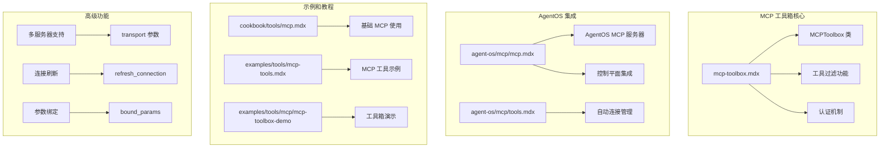
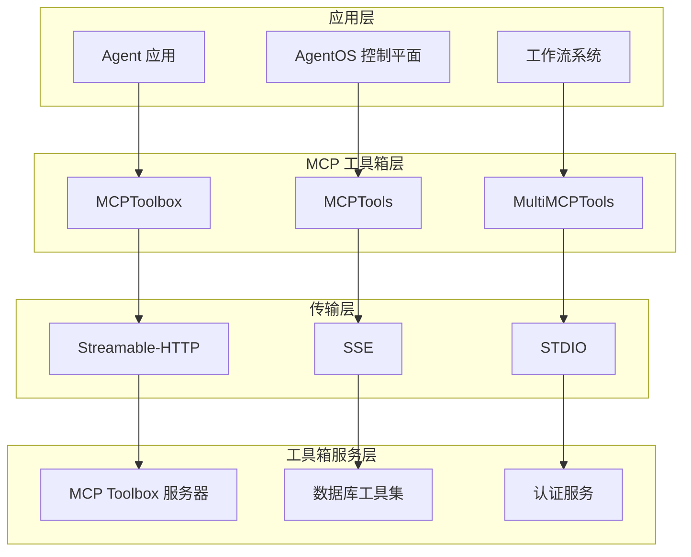
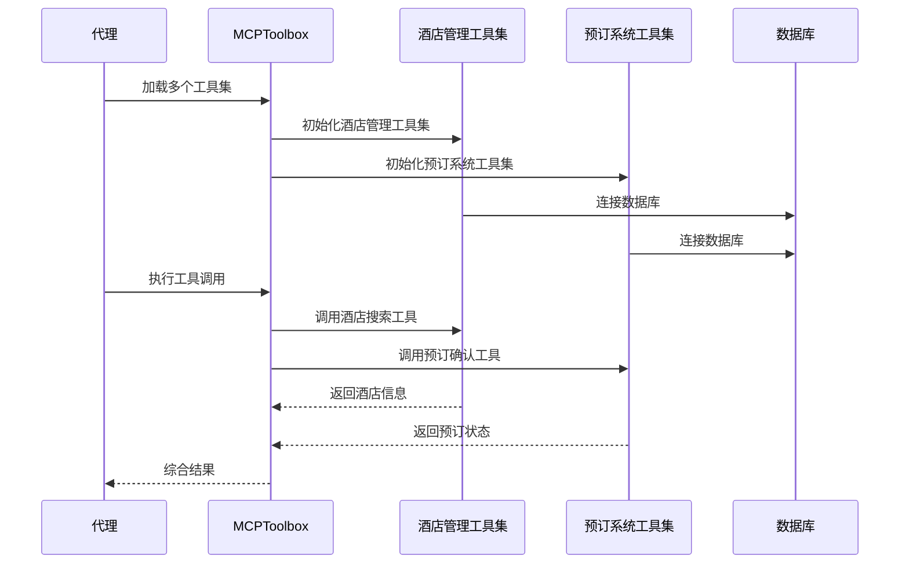
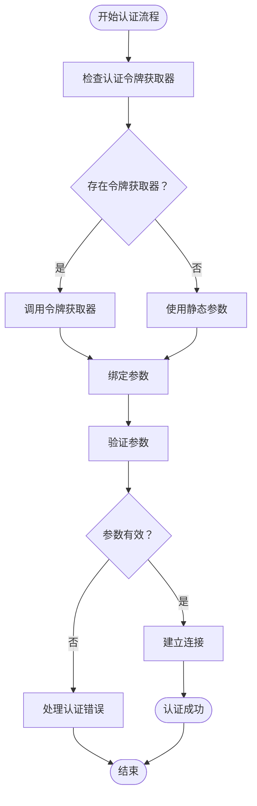
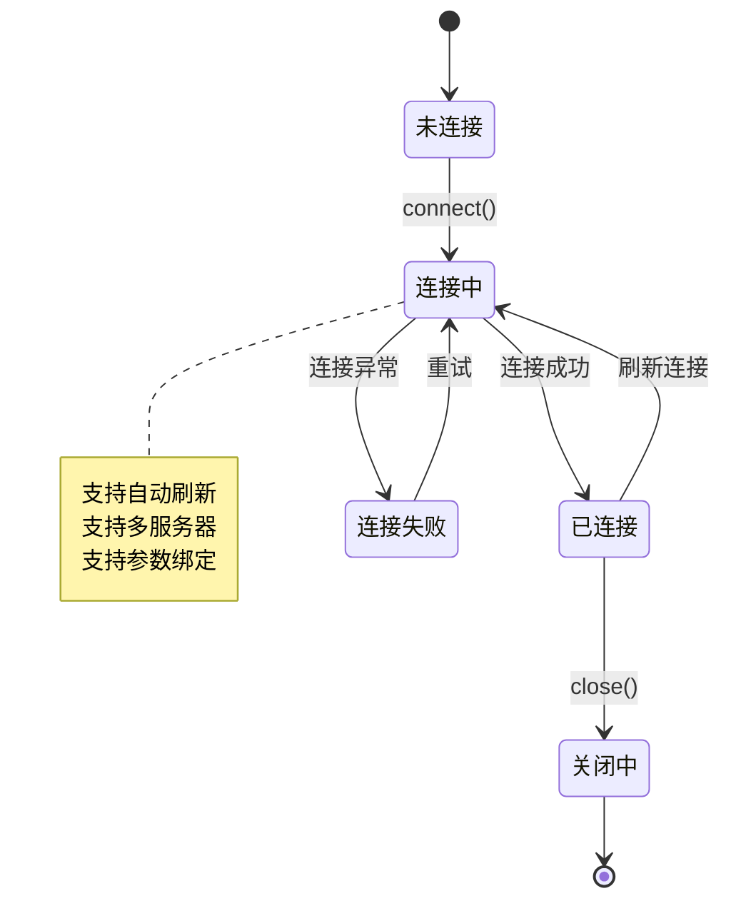
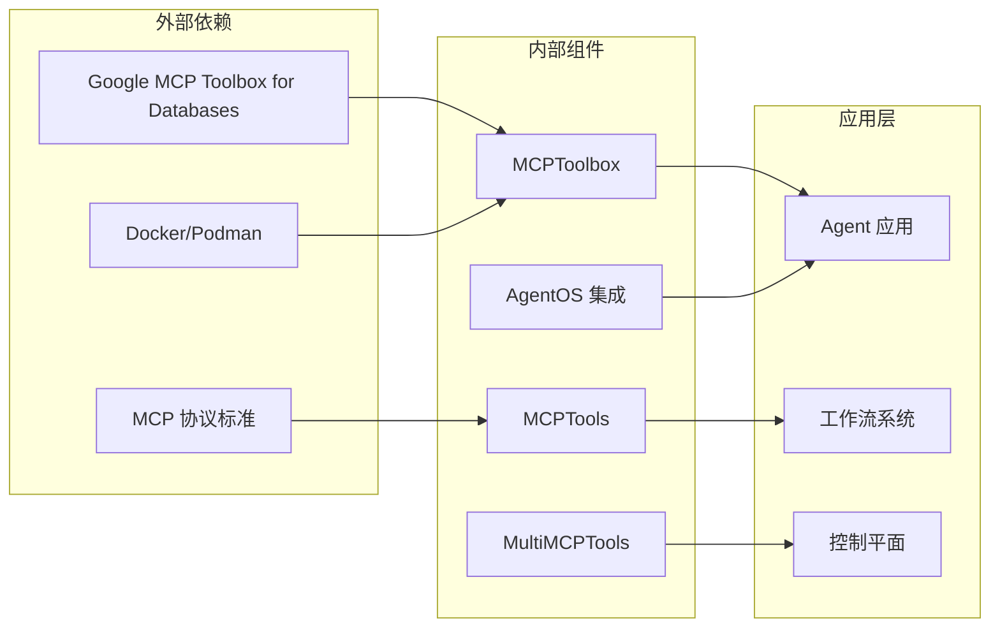
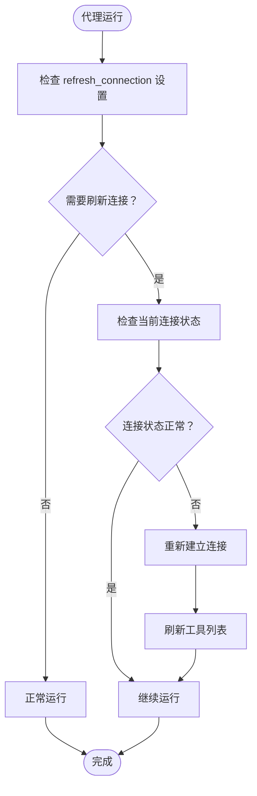
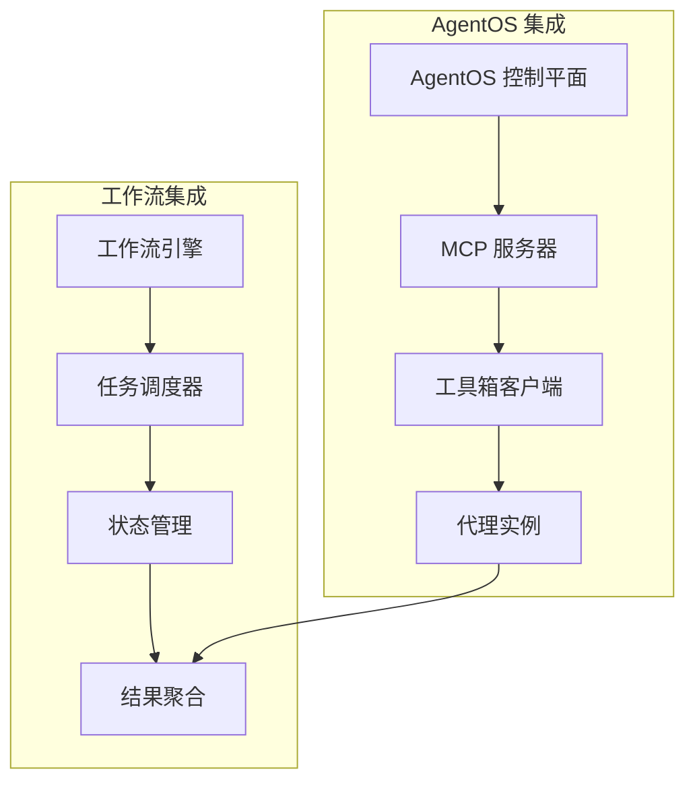

# MCP 工具箱高级功能

<cite>
**本文档引用的文件**
- [mcp-toolbox.mdx](file://tools/mcp/mcp-toolbox.mdx)
- [mcp.mdx](file://agent-os/mcp/mcp.mdx)
- [tools.mdx](file://agent-os/mcp/tools.mdx)
- [mcp.mdx](file://cookbook/tools/mcp.mdx)
- [mcp-tools.mdx](file://examples/tools/mcp-tools.mdx)
- [mcp-toolbox-demo/agent.mdx](file://examples/tools/mcp/mcp-toolbox-demo/agent.mdx)
- [mcp-toolbox-for-db.mdx](file://examples/tools/mcp/mcp-toolbox-for-db.mdx)
- [multiple-servers.mdx](file://tools/mcp/multiple-servers.mdx)
- [overview.mdx](file://tools/mcp/overview.mdx)
- [server-params.mdx](file://tools/mcp/server-params.mdx)
- [sse-transport/client.mdx](file://examples/tools/mcp/sse-transport/client.mdx)
- [test-client.mdx](file://examples/agent-os/mcp-demo/test-client.mdx)
</cite>

## 目录
1. [简介](#简介)
2. [项目结构](#项目结构)
3. [核心组件](#核心组件)
4. [架构概览](#架构概览)
5. [详细组件分析](#详细组件分析)
6. [依赖关系分析](#依赖关系分析)
7. [性能考虑](#性能考虑)
8. [故障排除指南](#故障排除指南)
9. [结论](#结论)
10. [附录](#附录)

## 简介

MCP 工具箱高级功能为开发者提供了强大的工具集，用于连接和管理 MCP（模型上下文协议）服务器。本文档深入探讨了 MCPToolbox 的高级使用模式，包括多工具集组合、自定义认证机制、参数绑定和严格模式等特性。

MCPToolbox 是基于 Google 的 MCP Toolbox for Databases 构建的，它扩展了 Agno 的 MCPTools 功能，提供了工具过滤能力，允许代理仅加载所需的特定数据库工具。

## 项目结构

MCP 工具箱功能分布在多个文档中，涵盖了从基础使用到高级配置的完整生态系统：



**图表来源**
- [mcp-toolbox.mdx:1-252](file://tools/mcp/mcp-toolbox.mdx#L1-L252)
- [mcp.mdx:1-146](file://agent-os/mcp/mcp.mdx#L1-L146)
- [mcp.mdx:1-242](file://cookbook/tools/mcp.mdx#L1-L242)

**章节来源**
- [mcp-toolbox.mdx:1-252](file://tools/mcp/mcp-toolbox.mdx#L1-L252)
- [mcp.mdx:1-146](file://agent-os/mcp/mcp.mdx#L1-L146)
- [mcp.mdx:1-242](file://cookbook/tools/mcp.mdx#L1-L242)

## 核心组件

### MCPToolbox 类

MCPToolbox 是 MCP 工具箱的核心类，提供了以下主要功能：

| 方法 | 描述 |
|------|------|
| `async connect()` | 初始化并连接到 MCP 服务器和工具箱客户端 |
| `async load_tool(tool_name, auth_token_getters={}, bound_params={})` | 按名称加载单个工具，支持可选认证 |
| `async load_toolset(toolset_name, auth_token_getters={}, bound_params={}, strict=False)` | 加载特定工具集中的所有工具 |
| `async load_multiple_toolsets(toolset_names, auth_token_getters={}, bound_params={}, strict=False)` | 从多个工具集中加载工具 |
| `async load_toolset_safe(toolset_name)` | 安全加载工具集并返回工具名称进行错误处理 |
| `get_client()` | 获取底层 ToolboxClient 实例 |
| `async close()` | 关闭工具箱客户端和 MCP 客户端连接 |

### 工具过滤功能

MCPToolbox 解决了工具过载问题，通过工具集过滤减少代理可用的工具数量：

**无 MCPToolbox（50+ 工具）：**
```python
tools = MCPTools(url="http://127.0.0.1:5001")  # 50+ 工具
```

**使用 MCPToolbox（3 个相关工具）：**
```python
tools = MCPToolbox(url="http://127.0.0.1:5001", toolsets=["hotel-management"])  # 3 个工具
```

**章节来源**
- [mcp-toolbox.mdx:223-234](file://tools/mcp/mcp-toolbox.mdx#L223-L234)
- [mcp-toolbox.mdx:93-114](file://tools/mcp/mcp-toolbox.mdx#L93-L114)

## 架构概览

MCP 工具箱采用分层架构设计，支持多种传输协议和连接模式：



**图表来源**
- [mcp-toolbox.mdx:13-252](file://tools/mcp/mcp-toolbox.mdx#L13-L252)
- [mcp.mdx:15-58](file://agent-os/mcp/mcp.mdx#L15-L58)

## 详细组件分析

### 多工具集组合

MCPToolbox 支持同时加载多个相关的工具集，为复杂的业务场景提供灵活的工具组合能力：



**图表来源**
- [mcp-toolbox.mdx:117-159](file://tools/mcp/mcp-toolbox.mdx#L117-L159)
- [mcp-toolbox-demo/agent.mdx:25-52](file://examples/tools/mcp/mcp-toolbox-demo/agent.mdx#L25-L52)

### 自定义认证机制

MCPToolbox 提供了灵活的认证机制，支持动态令牌获取和参数绑定：



**图表来源**
- [mcp-toolbox.mdx:161-186](file://tools/mcp/mcp-toolbox.mdx#L161-L186)
- [mcp-toolbox-demo/agent.mdx:54-95](file://examples/tools/mcp/mcp-toolbox-demo/agent.mdx#L54-L95)

### 参数绑定和严格模式

MCPToolbox 支持参数绑定和严格模式，确保工具调用的安全性和可靠性：

| 参数 | 类型 | 默认值 | 描述 |
|------|------|--------|------|
| `url` | `str` | - | 工具箱服务的基础 URL（如果缺少会自动添加 "/mcp"） |
| `toolsets` | `Optional[List[str]]` | `None` | 按工具集过滤工具的列表。不能与 `tool_name` 同时使用 |
| `tool_name` | `Optional[str]` | `None` | 要加载的单个工具名称。不能与 `toolsets` 同时使用 |
| `headers` | `Optional[Dict[str, Any]]` | `None` | 工具箱客户端请求的 HTTP 头部 |
| `transport` | `str` | `"streamable-http"` | MCP 传输协议。选项：`"stdio"`、`"sse"`、`"streamable-http"` |

**章节来源**
- [mcp-toolbox.mdx:209-221](file://tools/mcp/mcp-toolbox.mdx#L209-L221)

### 连接管理

MCPToolbox 提供了灵活的连接管理机制，支持自动和手动连接控制：



**图表来源**
- [overview.mdx:191-212](file://tools/mcp/overview.mdx#L191-L212)
- [mcp-toolbox.mdx:188-207](file://tools/mcp/mcp-toolbox.mdx#L188-L207)

**章节来源**
- [overview.mdx:169-190](file://tools/mcp/overview.mdx#L169-L190)
- [mcp-toolbox.mdx:188-207](file://tools/mcp/mcp-toolbox.mdx#L188-L207)

## 依赖关系分析

MCP 工具箱的依赖关系展示了其在整体架构中的位置和作用：



**图表来源**
- [mcp-toolbox.mdx:17-24](file://tools/mcp/mcp-toolbox.mdx#L17-L24)
- [mcp.mdx:15-19](file://agent-os/mcp/mcp.mdx#L15-L19)

**章节来源**
- [mcp-toolbox.mdx:17-24](file://tools/mcp/mcp-toolbox.mdx#L17-L24)
- [mcp.mdx:15-19](file://agent-os/mcp/mcp.mdx#L15-L19)

## 性能考虑

### 连接刷新策略

MCPToolbox 提供了智能的连接刷新机制，适用于托管 MCP 服务器频繁重启或工具列表经常变化的场景：



**图表来源**
- [overview.mdx:191-212](file://tools/mcp/overview.mdx#L191-L212)

### 多服务器传输支持

MCPToolbox 支持多种传输协议，每种协议都有其特定的性能特征：

| 传输协议 | 适用场景 | 性能特点 | 配置复杂度 |
|----------|----------|----------|------------|
| `streamable-http` | 本地开发、Docker 环境 | 低延迟、高吞吐量 | 低 |
| `sse` | 远程服务器、云环境 | 实时更新、断线重连 | 中等 |
| `stdio` | 本地命令行、自定义服务器 | 最低开销、简单配置 | 低 |

**章节来源**
- [overview.mdx:212-242](file://tools/mcp/overview.mdx#L212-L242)
- [multiple-servers.mdx:164-191](file://tools/mcp/multiple-servers.mdx#L164-L191)

## 故障排除指南

### 常见连接问题

1. **服务器无法访问**
   - 检查 URL 和端口配置
   - 验证防火墙设置
   - 确认 MCP 服务器正在运行

2. **认证失败**
   - 验证令牌获取器是否正确实现
   - 检查绑定参数的有效性
   - 确认环境变量已正确设置

3. **工具加载失败**
   - 检查工具集名称的拼写
   - 验证工具集权限
   - 确认数据库连接正常

### 性能优化建议

1. **连接池管理**
   - 在长时间运行的应用中复用连接
   - 避免频繁的连接/断开操作
   - 使用适当的超时设置

2. **工具集选择**
   - 仅加载必要的工具集
   - 使用工具过滤减少工具数量
   - 定期清理未使用的工具

3. **内存管理**
   - 及时关闭不再使用的连接
   - 监控内存使用情况
   - 避免内存泄漏

**章节来源**
- [overview.mdx:166-190](file://tools/mcp/overview.mdx#L166-L190)
- [mcp-toolbox.mdx:161-186](file://tools/mcp/mcp-toolbox.mdx#L161-L186)

## 结论

MCP 工具箱高级功能为构建企业级 AI 应用提供了强大而灵活的基础设施。通过多工具集组合、自定义认证机制、参数绑定和严格模式等功能，开发者可以构建既安全又高效的工具集成解决方案。

关键优势包括：
- **安全性**：支持动态认证令牌获取和参数绑定
- **灵活性**：多工具集组合和工具过滤能力
- **可扩展性**：支持多种传输协议和连接管理策略
- **易用性**：简洁的 API 设计和丰富的示例代码

## 附录

### 生产环境最佳实践

1. **连接管理**
   - 使用手动连接管理而非自动管理
   - 实现连接健康检查和自动重连
   - 设置适当的超时和重试机制

2. **安全配置**
   - 使用环境变量存储敏感信息
   - 实现令牌轮换机制
   - 启用 HTTPS 和身份验证

3. **监控和日志**
   - 记录工具调用的详细日志
   - 监控连接状态和性能指标
   - 设置告警机制

4. **部署考虑**
   - 使用容器化部署 MCP 服务器
   - 实现负载均衡和高可用性
   - 配置适当的资源限制

### 集成示例

MCPToolbox 可以无缝集成到 AgentOS 控制平面和工作流系统中：



**图表来源**
- [mcp.mdx:22-56](file://agent-os/mcp/mcp.mdx#L22-L56)
- [test-client.mdx:11-31](file://examples/agent-os/mcp-demo/test-client.mdx#L11-L31)